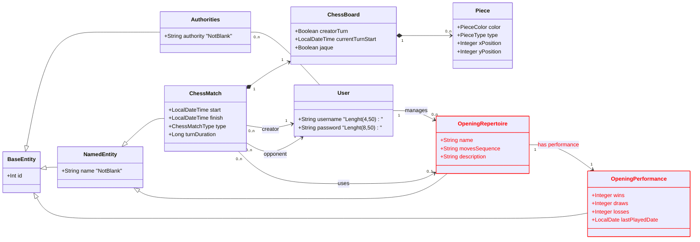

# Evaluación de Prompt

**Ejercicio:** ATTRIBUTES-CONSTRAINTS
**Dominio:** CHESS
**Fecha:** 4/6/2026, 23:41:11

## Índice
- [1. Contexto Oculto](#1-contexto-oculto)
- [2. Examen Seleccionado](#2-examen-seleccionado)
- [3. Prompt Visible](#3-prompt-visible)
- [4. Respuesta](#4-respuesta)

---

## 1. Contexto Oculto
--- ARCHIVO / RECURSO: attribute_constraints_examples_previous_exams.md ---
# RESTRICCIONES DE ATRIBUTOS DE EJEMPLO EXÁMENES ANTERIORES

## Clínica Veterinaria:

### ControlCheck 1 G1 ----------------------------------------------------------------------------------------------------------------------

```
Modificar las clases “Symptom” y “Treatment” para que sean entidades.
Estas clases están alojadas en el paquete
“org.springframework.samples.petclinic.disease”, y deben tener los
siguientes atributos y restricciones:
```

**Para ambas clases:**

- El atributo de tipo entero (Integer) llamado “id” actuará como
  clave primaria en la tabla de la base de datos relacional
  asociada a la entidad.

- Un atributo de tipo cadena de caracteres (String) llamado
  “name” obligatorio (no puede ser nulo), que debe tener una
  longitud mínima de 3 caracteres y máxima de 50 y que no
  puede estar formada por caracteres vacíos (espacios,
  tabuladores, etc.).

**Para la clase Treatment:**

- El atributo de tipo entero (Integer) llamado “baseDose”, que
  representa el número de miligramos de tratamiento por
  kilogramo de peso del animal. Este atributo será obligatorio y
  tendrá un valor mínimo de 1.

- El atributo de tipo entero llamado (Integer) llamado
  “shockDose”, que representa una cantidad fija de miligramos. En
  la lógica de negocio del sistema esta cantidad se añadirá al
  tratamiento en caso de que la enfermedad a tratar sea mortal
  (valor 5 para el atributo severity en la entidad Disease). El
  atributo es opcional, pero si toma valor, tendrá un valor mínimo
  de 1.

- El atributo de tipo entero (Integer) llamado “maxDose “ que
  representa la dosis máxima de tratamiento que puede llegar a
  administrarse (en miligramos de tratamiento por kilogramo de
  peso del animal). Este atributo es obligatorio y tendrá un valor
  mínimo de 1.

**Para la clase Symptom:**

- El atributo de tipo cadena caracteres (String) llamado
  “virulence” opcional que únicamente podrá tomar tres valores
  “LOW”,”MEDIUM”,”HIGH”1.

```
Modificar las interfaces “SymptomRepository” y “TreatmentRepository”
alojadas en el mismo paquete para que extiendan a CrudRepository. No
olvide especificar sus parámetros de tipo.
```

### ControlCheck 1 G2 ----------------------------------------------------------------------------------------------------------------------

```
Modificar las clases “Surgery” y “OperatingRoom” para que sean
entidades y eliminar las anotaciones @Transient estas clases. Estas
clases están alojadas en el paquete
“org.springframework.samples.petclinic.surgery”, y deben tener los
siguientes atributos y restricciones:
```

**Para ambas clases:**

- El atributo de tipo entero (Integer) llamado “id” actuará como
  clave primaria en la tabla de la base de datos relacional asociada
  a la entidad.

- Un atributo de tipo cadena de caracteres (String) llamado
  “name” obligatorio (no puede ser nulo), que debe tener una
  longitud mínima de 3 caracteres y máxima de 50 y que no puede
  estar formada por caracteres vacíos (espacios, tabuladores, etc.).

**Para la clase Surgery:**

- Un atributo de tipo fecha (LocalDate) llamado “date”, que
  representa la fecha en que se realiza la cirugía. Seguirá el
  formato “dd/MM/yyyy” (puede usar como ejemplo la clase Pet
  y su fecha de nacimiento para ver cómo se especificar dicho
  formato, pero nótese que el patrón del formato es distinto). Este
  atributo debe ser obligatorio y se almacenará en la BD con el
  nombre de columna “surgery_date”.

- El atributo de tipo cadena caracteres (String) llamado
  “description” opcional.

**Para la clase OperatingRoom:**

- Un atributo de tipo entero llamado “size” obligatorio, que
  representa el tamaño de la sala en metros cuadrados, y tiene que
  ser un número mayor que cero.
- Un atributo de tipo cadena de caracteres (String) llamado
  “sterilizationLevel” obligatorio que únicamente podrá tomar tres
  valores: “FULL”, “SEMI”, “LOW”.

```
Modificar las interfaces “SurgeryRepository” y
“OperationRoomRepository” alojadas en el mismo paquete para que
extiendan a CrudRepository. No olvide especificar sus parámetros de
tipo.
```

### ControlCheck 1 G3 ----------------------------------------------------------------------------------------------------------------------

```
Modificar las clases “CourseAttendance” y “CoursePayment” para que
sean entidades. Estas clases están alojadas en el paquete
“org.springframework.samples.petclinic.course”, y deben tener los
siguientes atributos y restricciones:
```

**Para ambas clases:**

- El atributo de tipo entero (Integer) llamado “id” actuará
  como clave primaria en la tabla de la base de datos relacional
  asociada a la entidad.

**Para la clase CourseAttendance:**

- El atributo de tipo fecha (LocalDate) llamado
  “registeredOn”, que representa la fecha en que el alumno se
  registra en el curso, seguirá el formato “dd/MM/yyyy”. Este
  atributo debe ser obligatorio. En la base de datos se almacenará
  con el nombre de columna “registrationDate”.

- El atributo de tipo entero (Integer) llamado “grade”, que
  representa la calificación global del curso. Este atributo es
  opcional, y debe estar en el rango de valores de 0 a 10, ambos
  inclusive.

**Para la clase CoursePayment:**

- El atributo de tipo fecha (LocalDate) llamado “paidOn”,
  que representa la fecha en que el alumno realiza un pago (parcial
  o total) del precio del curso, seguirá el formato “dd/MM/yyyy”.
  Este atributo debe ser obligatorio. En la base de datos se
  almacenará con el nombre de columna “paymentDate”.
- El atributo de tipo doble (Double) llamado “amount”, que
  representa la cantidad abonada en el pago. Este atributo será
  obligatorio.

```
Modificar las interfaces “CourseAttendanceRepository” y
“CoursePaymentRepository” alojadas en el mismo paquete para que
extiendan a CrudRepository. No olvide especificar sus parámetros de
tipo.
```

### ControlCheck 2 G1 ----------------------------------------------------------------------------------------------------------------------

```
Modificar las clases “Symptom” y “Medicine” para que sean entidades.
Estas clases están alojadas en el paquete
“org.springframework.samples.petclinic.disease”, y deben tener los
siguientes atributos y restricciones:
```

**Para ambas clases:**

- El atributo de tipo entero (Integer) llamado “id” actuará como
  clave primaria en la tabla de la base de datos relacional asociada a la
  entidad.

- Un atributo de tipo cadena de caracteres (String) llamado “name”
  obligatorio (no puede ser nulo), que debe tener una longitud mínima de 3
  caracteres y máxima de 50 y que no puede estar formada por caracteres
  vacíos (espacios, tabuladores, etc.).

- El atributo de tipo cadena caracteres (String) llamado
  “description” opcional.

**Para la clase Medicine:**

- El atributo de tipo entero (Integer) llamado “medication”, que
  representa la cantidad de medicación que debe tomar el animal en
  función de su peso. El atributo será obligatorio y tendrá un valor mínimo
  de 1 y un valor máximo de 1000 (a partir de este valor, la dosis puede ser
  mortal).

- El atributo de tipo fecha (LocalDate) llamado “startDate”, que
  representa la fecha en que comienza la medicación pautada. La fecha
  seguirá el formato “dd/MM/yyyy” (puede usar como ejemplo la clase Pet
  y su fecha de nacimiento para ver cómo se especificar dicho formato,
  pero nótese que el patrón del formato es distinto). Este atributo es
  obligatorio.

- El atributo de tipo fecha (LocalDate) llamado “endDate”, que
  representa la fecha en que debe terminar la medicación pautada. Seguirá
  el formato “dd/MM/yyyy”. Este atributo debe ser obligatorio.

```
No modifique por ahora las anotaciones @Transient de las clases. Modificar
las interfaces “SymptomRepository” y “MedicineRepository” alojadas en el
mismo paquete para que extiendan a CrudRepository. No olvide especificar
sus parámetros de tipo.
```

### ControlCheck 2 G2 ----------------------------------------------------------------------------------------------------------------------

```
Modifique las clases “GroomingConsumed” y “Coupon” alojadas en el
paquete “org.springframework.samples.petclinic.grooming” para que sean
una entidad y elimine las anotaciones @Transient de estas clases. Estas
entidades deben tener los siguientes atributos y restricciones:
```

**Para la clase GroomingConsumed:**

- Un atributo de tipo entero (Integer) llamado “id” que actúe como
  clave primaria en la tabla de la base de datos relacional asociada a la
  entidad.

- Un atributo de tipo cadena (String) llamado “petBeautician”
  obligatorio que debe tener una longitud mínima de 5 caracteres y
  máximo de 60 y no puede estar formada por caracteres vacíos (espacios,
  tabuladores, etc.).

- Un atributo de tipo entero (Integer) llamado “minutes” obligatorio
  que debe ser un número estrictamente positivo.

- Un atributo opcional de tipo cadena (String) llamado “comment”
  para registrar los comentarios sobre el servicio realizado.

**Para la clase Coupon:**

- El atributo de tipo entero (Integer) llamado “id” actuará como
  clave primaria en la tabla de la base de datos relacional asociada a la
  entidad.

- Un atributo de tipo fecha (LocalDate) llamado “startDate”, que
  representa la fecha en que comienza la oferta. Seguirá el formato
  “dd/MM/yyyy” (puede usar como ejemplo la clase Pet y su fecha de
  nacimiento para ver cómo se especificar dicho formato, pero nótese que
  el patrón del formato es distinto). Este atributo debe ser obligatorio y se
  almacenará en la base de datos con el nombre de columna “start”.

- El atributo de tipo fecha (LocalDate) llamado “expiryDate”, que
  representa la fecha en que termina la oferta, seguirá el formato
  “dd/MM/yyyy”. Este atributo debe ser obligatorio. En la base de datos se
  almacenará con el nombre de columna “finish”.

### ControlCheck 2 G3 ----------------------------------------------------------------------------------------------------------------------

```
Modificar las clases “Prescription” y “Allergy” para que sean entidades.
Estas clases están alojadas en el paquete
“org.springframework.samples.petclinic.medication”, y deben tener los
siguientes atributos y restricciones:
```

**Para ambas clases:**

- El atributo de tipo entero (Integer) llamado “id” actuará como
  clave primaria en la tabla de la base de datos relacional asociada a la
  entidad.

- El atributo de tipo cadena caracteres (String) llamado
  “information” opcional.

**Para la clase Prescription:**

- El atributo obligatorio de tipo entero (Integer) llamado “dosage”,
  que representa la cantidad de medicación en miligramos que debe tomar
  el animal. El atributo será obligatorio y tendrá un valor mínimo de 1 y un
  valor máximo de 1000.

- El atributo de tipo fecha (LocalDate) llamado “treatmentStart”,
  que representa la fecha en que comienza la medicación pautada. La fecha
  seguirá el formato “dd/MM/yyyy” (puede usar como ejemplo la clase Pet
  y su fecha de nacimiento para ver cómo se especificar dicho formato,
  pero nótese que el patrón del formato es distinto). Este atributo es
  obligatorio.

- El atributo de tipo fecha (LocalDate) llamado “treatmentEnd”,
  que representa la fecha en que debe terminar la medicación pautada.
  Seguirá el formato “dd/MM/yyyy”. Este atributo debe ser obligatorio.

- El atributo de tipo entero (Integer) llamado
  “hoursBetweenDosage”, que representa el número de horas entre cada
  dosis a dar al animal. El atributo será obligatorio y tendrá un valor
  mínimo de 1 y un valor máximo de 24.

**Para la clase Allergy:**

- El atributo obligatorio de tipo entero (Integer) llamado “level”,
  que representa la severidad con la que se presenta la alergia en el animal.
  El atributo será obligatorio y tendrá un valor mínimo de 1 y un valor
  máximo de 10.

- El atributo de tipo fecha (LocalDate) llamado “diagnosisDate”,
  que representa la fecha en la que la alergia fue diagnosticada al animal.
  Seguirá el formato “dd/MM/yyyy”. Este atributo debe ser obligatorio.

```
No modifique por ahora las anotaciones @Transient de las clases. Modificar
las interfaces “PrescriptionRepository” y “AllergyRepository” alojadas en el
mismo paquete para que extiendan a CrudRepository. No olvide especificar
sus parámetros de tipo.
```

## Juego de Ajedrez:

### 1ª Convocatoria (enero) ----------------------------------------------------------------------------------------------------------------

```
Modificar las clases “Tournament” y “Round” para que sean entidades.
Estas clases están alojadas en el paquete
“es.us.dp1.chess.tournament.round”, y deben tener los siguientes
atributos y restricciones:
```

**Para ambas clases:**

- El atributo de tipo entero (Integer) llamado “id” actuará
  como clave primaria en la tabla de la base de datos relacional
  asociada a la entidad.

- Un atributo de tipo cadena de caracteres (String) llamado
  “name” obligatorio (no puede ser nulo), que debe tener una
  longitud mínima de 5 caracteres y máxima de 60 y que no puede
  estar formada por caracteres vacíos (espacios, tabuladores, etc.).

**Para la clase Tournament:**

- El atributo de tipo entero (Integer) llamado “prize”, que
  representa el precio en metálico que se otorgará al ganador del
  torneo. Este atributo será obligatorio y tendrá un valor mínimo de 1.

- El atributo de tipo fecha (LocalDate) llamado “startDate”,
  que representa fecha de comienzo del torneo y es obligatorio.

- El atributo de tipo fecha (LocalDate) llamado
  “finishDate”, que representa fecha de finalización del torneo y es
  obligatorio.

**Para la clase Round:**

- El atributo de tipo entero (Integer) llamado
  “roundNumber” obligatorio que tendrá un valor mínimo de 1, un
  valor máximo de 8, y es obligatorio.

- Un atributo de tipo fecha (LocalDate) llamado
  “roundDate” que representa la fecha en la que se celebra la ronda
  y es obligatorio.

```
No modifique por ahora las anotaciones @Transient de las clases.
Modificar las interfaces “TournamentRepository” y “RoundRepository”
alojadas en el mismo paquete para que extiendan a CrudRepository. No
olvide especificar sus parámetros de tipo.
```

### 2ª Convocatoria (julio) ----------------------------------------------------------------------------------------------------------------

```
Modificar la clase “Challenge” para que sea una entidad. Esta clase está
alojada en el paquete “es.us.dp1.chess.tournament.challenge”, y debe tener
los siguientes atributos y restricciones:
```

- El atributo de tipo entero (Integer) llamado “id” actuará como clave
  primaria en la tabla de la base de datos relacional asociada a la entidad.

- Un atributo de tipo cadena de caracteres (String) llamado “message”
  obligatorio (no puede ser nulo), que debe tener una longitud mínima de 5
  caracteres y máxima de 60 y que no puede estar formada por caracteres
  vacíos (espacios, tabuladores, etc.).

- El atributo de tipo entero (Integer) llamado “targetValue”, que representa
  el número de partida ganadas o jugadas, o el número de piezas captuaradas
  asociadas al desafío. Este atributo es obligatorio y su valor debe ser mayor o
  igual a 1.

- El atributo de tipo fecha (LocalDate) llamado “startDate”, que representa
  fecha de comienzo del desafío y es obligatorio.

- El atributo de tipo fecha (LocalDate) llamado “endDate”, que representa
  fecha de finalización del desafío y es obligatorio.

- Un atributo del tipo enumerado “ChallengeObjective” llamado “goal”
  obligatorio. Este atributo es obligatorio y debe almacenarse como una
  cadena en la BD.

```
No modifique por ahora las anotaciones @Transient de las clases. Modificar
la interfaz “ChallengeRepository” alojada en el mismo paquete para que
extienda a CrudRepository. No olvide especificar sus parámetros de tipo y
descomentar la consulta del método “findActiveChallengesAtDate”.
```

---

## 2. Examen Seleccionado
En este ejercicio, añadiremos la funcionalidad de gestión del repertorio de aperturas de ajedrez y el seguimiento de su rendimiento para los usuarios. Concretamente, se proporciona una clase “ChessMatch” que representa las partidas que se juegan, y que tiene asociada una instancia de la clase “ChessBoard” que representa el estado del tablero para dicha partida, por lo que tendrá asociada un conjunto de instancias de la clase “Piece”. Además, tendremos la clase “OpeningRepertoire”, que representa una secuencia de movimientos de apertura que un jugador ha estudiado o planeado usar, y la clase “OpeningPerformance”, que registrará estadísticas específicas sobre el uso de cada apertura.

La clase “OpeningRepertoire” incluirá los atributos `name` para identificar la apertura (ej. "Defensa Siciliana"), `movesSequence` para almacenar la serie de movimientos que la definen, y `description` para una explicación adicional. Cada `User` puede gestionar múltiples `OpeningRepertoire`s. Una `ChessMatch` puede estar asociada a uno de estos repertorios, indicando qué apertura se jugó en esa partida.

Por otro lado, la clase “OpeningPerformance” contará con los atributos `wins`, `draws` y `losses` para registrar el número de victorias, empates y derrotas asociadas a una apertura específica, y `lastPlayedDate` para la fecha de la última partida en la que se utilizó dicha apertura. Cada `OpeningRepertoire` tendrá asociado un único registro de `OpeningPerformance` que resume su eficacia para un `User` dado.

Realizaremos una serie de ejercicios basados en funcionalidades que implementaremos en el sistema, y validaremos mediante pruebas unitarias.



---

## 3. Prompt Visible
Nuestra misión es generar, a partir de un enunciado dado, el ejercicio de un examen, tomando el rol de profesores para una asignatura llamada Diseño y Pruebas, para evaluar los conocimientos de los alumnos sobre mapeo objeto relacional en JPA, manejo de estas entidades y base de datos, entre otras más. Concretamente te pasaré el enunciado y el diagrama UML en código Mermaid que lo acompaña, elementos en los que te tendrás que basar para proporcionarme la solución, pero antes, te daré información de contexto que necesitarás como recurso y entender mejor qué características tiene este examen:

- Hay que tomar el rol de profesor siempre, estamos generando un examen, hay que ponerse en los zapatos del profesorado.

- Tenemos dos tipos de exámenes, uno enfocado a una clínica veterinaria y otro al juego del ajedrez.

- Respecto al diagrama UML:

  - Concepto de colores de clases:

    - **Clases negras**: El núcleo del sistema. Clases estables que se usan como contexto, pero que quedan fuera de la tarea de implementación.

    - **Clases rojas**: La tarea principal del alumno, se deben crear desde 0. Las clases vienen creadas pero su contenido está vacío.

    - Las clases negras son la base de la que partimos siempre en todos los exámenes, el dominio común a todos los exámenes dependiendo de qué tipo (clínica o ajedrez) de examen estemos generando y las rojas, pueden variar según la extensión funcional que se le añada.

  - Relaciones, cardinalidad y direccionalidad:

    - Relaciones rojas entre clases rojas: el alumno deberá añadir el atributo con su anotación de relación correspondiente.

    - Tendremos relaciones únicamente unidireccionales.

    - La cardinalidad podrá ser de 1..1, 1, 0..1, 0..n, 1..n. Las relaciones muchos a muchos se omitirán en todos los casos.

- Límite de 2 entidades de color rojo, es decir, a implementar por completo por el alumno, debido al tiempo disponible para realizar el examen.

Sabiendo y entendiendo esto a fondo, basándote y siguiendo la lógica del enunciado y el diagrama UML en código Mermaid que te proporciono en la sección de contexto de este mensaje, quiero que me generes el ejercicio “RESTRICCIONES DE ATRIBUTOS” del examen, es decir, las restricciones a nivel de entidad de los atributos que componen las clases a implementar por el alumno, es decir, de las clases rojas. (not null, etc). Para ello, te adjunto el archivo md llamado “attribute_constraints_examples_previous_exams” como referencia. Deberá cumplir estos requisitos:

- ÚNICAMENTE generarás las restricciones a nivel de entidad de los atributos de las clases a implementar por el alumno.

- Las restricciones tendrán que ser parecidas a los ejemplos que te he pasado en el archivo md.

- Omitirás en tu respuesta cualquier mención y explicación sobre las restricciones de los atributos correspondientes a las relaciones entre las entidades, eso se definirá más adelante.

- Sé lo más creativo posible en cuanto a restricciones, ni muy simples, ni muy complejas.

- El enunciado deberá seguir la siguiente sintaxis:

  _“Modificar las clases [“clases a implementar nuevas (rojas)”] para que sean entidades. Estas deben tener los siguientes atributos y restricciones:_

  _Para la clase [clase a implementar nueva (roja)]:_
  _El atributo de tipo [tipo de atributo] llamado [nombre de atributo] actuará como [opcional/obligatorio], [restricciones explicadas en forma de texto]”_

- Al final del enunciado generado, añadirás este párrafo:

  _“No modifique por ahora las anotaciones @Transient de las clases. Modificar las interfaces [repositorios de entidades nuevas a implementar por el alumno (rojas), no siendo enumerados] alojada en el mismo paquete para que extienda a CrudRepository.”_

---

## 4. Respuesta
Modificar las clases “OpeningRepertoire” y “OpeningPerformance” para que sean entidades. Estas deben tener los siguientes atributos y restricciones:

**Para la clase OpeningRepertoire:**

-   El atributo de tipo entero (Integer) llamado “id” actuará como clave primaria en la tabla de la base de datos relacional asociada a la entidad.

-   Un atributo de tipo cadena de caracteres (String) llamado “name” obligatorio (no puede ser nulo), que debe tener una longitud mínima de 3 caracteres y máxima de 50 y que no puede estar formada únicamente por caracteres vacíos (espacios, tabuladores, etc.).

-   El atributo de tipo cadena de caracteres (String) llamado “movesSequence”, que representa la serie de movimientos de ajedrez que definen la apertura. Este atributo es obligatorio y debe tener una longitud mínima de 10 caracteres y máxima de 255. No puede estar formado únicamente por caracteres vacíos (espacios, tabuladores, etc.).

-   El atributo de tipo cadena de caracteres (String) llamado “description” opcional, que puede contener una explicación adicional sobre la apertura.

**Para la clase OpeningPerformance:**

-   El atributo de tipo entero (Integer) llamado “id” actuará como clave primaria en la tabla de la base de datos relacional asociada a la entidad.

-   El atributo de tipo entero (Integer) llamado “wins”, que representa el número total de victorias registradas con esta apertura. Este atributo es obligatorio y tendrá un valor mínimo de 0.

-   El atributo de tipo entero (Integer) llamado “draws”, que representa el número total de empates registrados con esta apertura. Este atributo es obligatorio y tendrá un valor mínimo de 0.

-   El atributo de tipo entero (Integer) llamado “losses”, que representa el número total de derrotas registradas con esta apertura. Este atributo es obligatorio y tendrá un valor mínimo de 0.

-   El atributo de tipo fecha (LocalDate) llamado “lastPlayedDate”, que representa la fecha de la última partida en la que se utilizó la apertura. Este atributo es opcional y seguirá el formato “dd/MM/yyyy”.

No modifique por ahora las anotaciones @Transient de las clases. Modificar las interfaces “OpeningRepertoireRepository” y “OpeningPerformanceRepository” alojada en el mismo paquete para que extienda a CrudRepository.