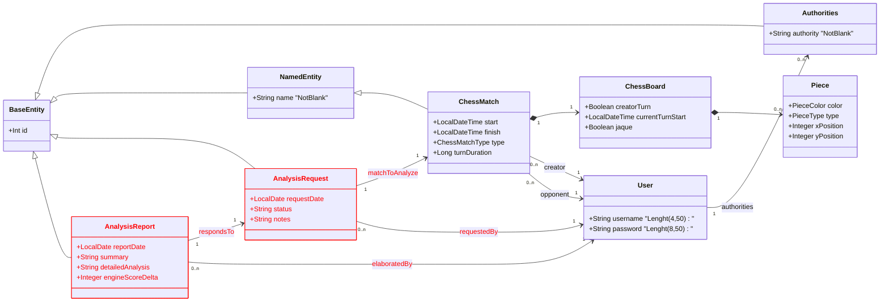

# Evaluación de Prompt

**Ejercicio:** ENTITY-RELATIONSHIPS
**Dominio:** CHESS
**Fecha:** 5/6/2026, 0:05:11

## Índice
- [1. Contexto Oculto](#1-contexto-oculto)
- [2. Examen Seleccionado](#2-examen-seleccionado)
- [3. Prompt Visible](#3-prompt-visible)
- [4. Respuesta](#4-respuesta)

---

## 1. Contexto Oculto
--- ARCHIVO / RECURSO: relationships_between_entities_examples_previous_exams.md ---
# RELACIONES ENTRE ENTIDADES DE EJEMPLO EXÁMENES ANTERIORES

## Clínica Veterinaria:

### ControlCheck 1 G1 ----------------------------------------------------------------------------------------------------------------------

```
Elimine las anotaciones @Transient de los métodos y atributos que las
tengan en las entidades creadas anteriormente, así como la del atributo
symptoms de la clase Visit. Se pide crear las siguientes relaciones entre las
entidades. Cree una relación unidireccional desde “Visit” hacia “Symptom”
que exprese la que aparece en el diagrama UML (mostrado en la primera
página de este enunciado) respetando sus cardinalidades, usando el atributo
“symptoms” de la clase “Visit”.

Además, se pide crear una relación unidireccional desde “Symptom” hacia
“Disease” que represente la que aparece en el diagrama UML, tenga en
cuenta la cardinalidad que tiene, usando el atributo “includes” en la clase
“Symptom”. Debe asegurarse de que las relaciones expresan adecuadamente
la cardinalidad que muestra el diagrama UML, por ejemplo, algunos
atributos pueden ser nulos puesto que la cardinalidad es 0..n pero otros no,
porque su cardinalidad en el extremo navegable de la relación es 1..n.

Finalmente, se pide crear una relación unidireccional desde “Treatment“
hacia “Disease” que represente la que aparece en el diagrama, usando como
nombre de atributo recommendedFor. Debe asegurarse de que las relaciones
expresan adecuadamente la cardinalidad que muestra el diagrama UML, por
ejemplo, el atributo no puede ser nulo y es obligatorio, puesto que la
cardinalidad es 1..n en el extremo de Disease.
```

### ControlCheck 1 G2 ----------------------------------------------------------------------------------------------------------------------

```
Se pide crear las siguientes relaciones entre las entidades:

▪ Una relación unidireccional desde “Surgery” hacia “Pet” que
exprese la que aparece en el diagrama UML (mostrado en la
primera página de este enunciado) respetando sus cardinalidades,
usando el atributo “pet”.

▪ Una relación unidireccional desde “Surgery” hacia
“SurgeryType” que represente la que aparece en el diagrama
UML respetando sus cardinalidades, usando el atributo “type”.

▪ Una relación unidireccional desde “OperatingRoom” hacia
“SurgeryType” que represente la que aparece en el diagrama
UML respetando sus cardinalidades, usando el atributo
“validFor”.

▪ Una relación unidireccional desde “Surgery” hacia
“OperatingRoom” que exprese la que aparece en el diagrama
UML respetando sus cardinalidades, usando el atributo “room”
de la clase “Surgery”.
```

### ControlCheck 1 G3 ----------------------------------------------------------------------------------------------------------------------

```
Elimine las anotaciones @Transient de los métodos y atributos que las
tengan en las entidades creadas anteriormente, así como la del atributo
attendants de la clase Course. Se pide crear las siguientes relaciones entre las
entidades:

Una relación bidireccional entre “CourseAttendance” y “Course” que
represente la que aparece en el diagrama UML, teniendo en cuenta la
cardinalidad que tiene.

Además, cree dos relaciones unidireccionales desde “CourseAttendance”
hacia “Vet” y hacia “CoursePayment” que expresen las que aparecen en el
diagrama UML (mostrado en la primera página de este enunciado), usando
los atributos “attendant” y “payments” de la clase “CourseAttendance”,
correspondientemente. Debe asegurarse de que las relaciones expresan
adecuadamente la cardinalidad que muestra el diagrama UML, por ejemplo,
algunos atributos pueden ser nulos puesto que la cardinalidad es 0..n pero
otros no, porque su cardinalidad en el extremo navegable de la relación es 1.
```

### ControlCheck 2 G1 ----------------------------------------------------------------------------------------------------------------------

```
Elimine las anotaciones @Transient de los métodos y atributos que las
tengan en las entidades creadas en el ejercicio anterior, así como la del
atributo symptoms de la clase Visit. Se pide crear las siguientes relaciones
entre las entidades:

Cree una relación unidireccional desde “Visit” hacia “Symptom” que exprese
la que aparece en el diagrama UML (mostrado en la primera página de este
enunciado) respetando sus cardinalidades, usando el atributo “symptoms” de
la clase “Visit”.

Además, se pide crear dos relaciones unidireccionales desde “Symptom”
hacia “Disease” que representen las que aparecen en el diagrama UML,
tenga en cuenta la cardinalidad que tienen (recuerde que en este caso, al
tratarse de una doble relación n a n entre las mismas entidades se trata de
unas relaciones bastante exóticas), usando como nombre de los atributos
“includedDiseases” y “excludedDiseases” en la clase “Symptom”.

Finalmente, se pide crear una relación unidireccional desde “Medicine”
hacia “Disease” que represente la que aparece en el diagrama. Debe
asegurarse de que las relaciones expresan adecuadamente la cardinalidad que
muestra el diagrama UML.
```

### ControlCheck 2 G2 ----------------------------------------------------------------------------------------------------------------------

```
Además, se pide crear las siguientes relaciones entre las entidades.

▪ Cree tres relaciones unidireccionales desde
“GroomingConsumed” hacia “Visit” utilizando el atributo
“appliedDuring”, de “GroomingConsumed” hacia
“GroomingType” utilizando el atributo “typeConsumed” y de
“GroomingConsumed” hacia “Coupon” utilizando el atributo
“consumed”, que expresen las relaciones que aparecen en el
diagrama UML (mostrado en la primera página de este
enunciado) respetando sus cardinalidades.

▪ Cree una relación unidireccional desde “Coupon” hacia
“GromingPackage” que represente la que aparece en el diagrama
UML, teniendo en cuenta la cardinalidad y usando el atributo
“groomingPackage” en la clase “Coupon”

Debe asegurarse de que las relaciones expresan adecuadamente la
cardinalidad que muestra el diagrama UML, por ejemplo, el atributo
groomingPackage no puede ser nulo puesto que la cardinalidad es 1.
```

### ControlCheck 2 G3 ----------------------------------------------------------------------------------------------------------------------

```
Elimine las anotaciones @Transient de los métodos y atributos que las
tengan en las entidades creadas en el ejercicio anterior, así como del atributo
allergies de la clase Pet. Se pide crear las siguientes relaciones entre las
entidades:

Cree una relación unidireccional desde “Prescription” hacia “Visit” que
exprese la que aparece en el diagrama UML (mostrado en la primera página
de este enunciado) respetando sus cardinalidades, usando un atributo “visit”
en la clase “Prescription”.

Cree dos relaciones unidireccionales desde “Prescription” hacia
“Medication” que representen las que aparecen en el diagrama UML, es
decir la medicación prescrita tanto obligatoria como opcional. Tenga en
cuenta la cardinalidad que tienen (recuerde que en este caso, al tratarse de
una doble relación n a n entre las mismas entidades se trata de unas
relaciones bastante exóticas vistas en teoría), usando como nombre de los
atributos “mandatoryMedications” y “optionalMedications” en la clase
“Prescription”. Debe asegurarse de que las relaciones expresan
adecuadamente la cardinalidad que muestra el diagrama UML.

Finalmente, se piden crear dos relaciones para la clase Allergy. Una de ellas
unidireccional desde “Pet” hacia “Allergy”; y otra desde “Allergy” hacia
“ActivePrinciple” que representen las que aparecen en el diagrama. Debe
asegurarse de que las relaciones expresan adecuadamente la cardinalidad que
muestra el diagrama UML.
```

### 3º Convocatoria (octubre)----------------------------------------------------------------------------------------------------------------------

```
Elimine las anotaciones @Transient de los métodos y atributos que las
tengan en las entidades creadas en el ejercicio anterior, así como la del
atributo symptoms de la clase Visit. Se pide crear las siguientes relaciones
entre las entidades. Cree una relación unidireccional desde “Visit” hacia
“Symptom” que exprese la que aparece en el diagrama UML (mostrado en la
primera página de este enunciado) respetando sus cardinalidades, usando el
atributo “symptoms” de la clase “Visit”.

Además, se pide crear dos relaciones unidireccionales desde “Symptom”
hacia “Disease” que representen las que aparecen en el diagrama UML,
tenga en cuenta la cardinalidad que tienen (recuerde que en este caso, al
tratarse de una doble relación n a n entre las mismas entidades se trata de
unas relaciones bastante exóticas), usando como nombre de los atributos
“includes ” y “excludes” en la clase “Symptom”. Debe asegurarse de que las
relaciones expresan adecuadamente la cardinalidad que muestra el diagrama
UML, por ejemplo, algunos atributos pueden ser nulos puesto que la
cardinalidad es 0..n pero otros no, porque su cardinalidad en el extremo
navegable de la relación es 1..n.

Finalmente, se pide crear una relación unidireccional desde “Treatment“
hacia “Disease” que represente la que aparece en el diagrama, usando como
nombre de atributo recommendedFor. Debe asegurarse de que las relaciones
expresan adecuadamente la cardinalidad que muestra el diagrama UML, por
ejemplo, el atributo no puede ser nulo y es obligatorio, puesto que la
cardinalidad es 1..n en el extremo de Disease.
```

## Juego de Ajedrez:

### 1ª Convocatoria (enero) ----------------------------------------------------------------------------------------------------------------

```
Elimine las anotaciones @Transient de los métodos y atributos que las
tengan en las entidades creadas en el ejercicio anterior. Se pide crear las
siguientes relaciones entre las entidades:

Cree una relación unidireccional desde “Round” hacia “Tournament” que
exprese la que aparece en el diagrama UML (mostrado en la primera página
de este enunciado) respetando sus cardinalidades, usando el atributo
“tournament” de la clase “Round”.

Además, se pide crear dos relaciones unidireccionales desde “Tournament” y
“Round” hacia “User” que representen las que aparecen en el diagrama
UML, tenga en cuenta la cardinalidad que tienen, usando como nombre de
los atributos “participants”. Debe asegurarse de que las relaciones expresan
adecuadamente la cardinalidad que muestra el diagrama UML, por ejemplo,
algunos atributos pueden ser nulos puesto que la cardinalidad es 0..n pero
otros no, porque su cardinalidad en el extremo navegable de la relación es
1..n.

Finalmente, se pide crear una relación unidireccional desde “ChessMatch“
hacia “Round” que represente la que aparece en el diagrama, usando como
nombre de atributo “round” en la clase “ChessMatch”. Debe asegurarse de
que las relaciones expresan adecuadamente la cardinalidad que muestra el
diagrama UML, por ejemplo, en este caso el atributo si podría ser nulo,
puesto que la cardinalidad es “0..1” en el extremo de “Round”, pero si fuera
“1” o “1..n” sería obligatorio.
```

### 2ª Convocatoria (julio) ----------------------------------------------------------------------------------------------------------------

```
Elimine las anotaciones @Transient de los métodos y atributos que las
tengan en las entidades creadas en el ejercicio anterior. Se pide crear las
siguientes relaciones entre las entidades:

Cree una relación unidireccional desde “Challenge” hacia “User” que
exprese la que aparece en el diagrama UML (mostrado en la primera página
de este enunciado) respetando sus cardinalidades, usando el atributo
“participants” de la clase “Challenge”.

Además, se pide crear otra relación unidireccional desde “Challenge” hacia
“ChessMatch” mediante el atributo “matches” que representen la que
aparece en el diagrama UML, tenga en cuenta la cardinalidad que tiene.
Debe asegurarse de que las relaciones expresan adecuadamente la
cardinalidad que muestra el diagrama UML, por ejemplo, en el diagrama,
algunos atributos pueden ser nulos puesto que la cardinalidad es 0..n pero
otros no, porque su cardinalidad en el extremo navegable de la relación es
1..n.
```

---

## 2. Examen Seleccionado
En este ejercicio, añadiremos la funcionalidad de gestión de solicitudes y reportes de análisis de partidas para que los usuarios puedan obtener una revisión experta de sus juegos. Concretamente, se proporciona una clase “ChessMatch” que representa las partidas que se juegan, y que tiene asociada una instancia de la clase “ChessBoard” que representa el estado del tablero para dicha partida, por lo que tendrá asociada un conjunto de instancias de la clase “Piece”. Además, tendremos la clase “AnalysisRequest”, que representa la solicitud de un usuario para que una partida específica sea analizada. Junto a esta, tendremos la clase “AnalysisReport”, que contendrá el análisis detallado proporcionado como respuesta a una solicitud.

La clase **AnalysisRequest** incluirá los atributos `requestDate` para la fecha de la solicitud, `status` para el estado actual de la solicitud (por ejemplo, "PENDIENTE", "EN_PROGRESO", "COMPLETADA") y `notes` para cualquier comentario o pregunta específica del usuario sobre la partida. La clase **AnalysisReport** contará con los atributos `reportDate` para la fecha en que se generó el informe, `summary` para un breve resumen del análisis, `detailedAnalysis` para el análisis textual completo y `engineScoreDelta` para indicar opcionalmente la variación en la puntuación del motor de ajedrez en puntos clave de la partida.

Las relaciones entre estas entidades son las siguientes: cada `AnalysisRequest` se asocia a una `ChessMatch` específica y es realizada por un `User`. Por su parte, un `AnalysisReport` se genera como respuesta a una única `AnalysisRequest` y es elaborado por un `User` (el analista).

Realizaremos una serie de ejercicios basados en funcionalidades que implementaremos en el sistema, y validaremos mediante pruebas unitarias.



---

## 3. Prompt Visible
Nuestra misión es generar, a partir de un enunciado dado, el ejercicio de un examen, tomando el rol de profesores para una asignatura llamada Diseño y Pruebas, para evaluar los conocimientos de los alumnos sobre mapeo objeto relacional en JPA, manejo de estas entidades y base de datos, entre otras más. Concretamente te pasaré el enunciado y el diagrama UML en código Mermaid que lo acompaña, elementos en los que te tendrás que basar para proporcionarme la solución, pero antes, te daré información de contexto que necesitarás como recurso y entender mejor qué características tiene este examen:

- Hay que tomar el rol de profesor siempre, estamos generando un examen, hay que ponerse en los zapatos del profesorado.
- Tenemos dos tipos de exámenes, uno enfocado a una clínica veterinaria y otro al juego del ajedrez.
- Respecto al diagrama UML:

  -     Concepto de colores de clases:

    - **Clases negras**: El núcleo del sistema. Clases estables que se usan como contexto, pero que quedan fuera de la tarea de implementación.
    - **Clases rojas**: La tarea principal del alumno, se deben crear desde 0. Las clases vienen creadas pero su contenido está vacío.

    - Las clases negras son la base de la que partimos siempre en todos los exámenes, el dominio común a todos los exámenes dependiendo de qué tipo (clínica o ajedrez) de examen estemos generando y las rojas, pueden variar según la extensión funcional que se le añada.

  - Relaciones, cardinalidad y direccionalidad:

    - Relaciones rojas entre clases rojas: el alumno deberá añadir el atributo con su anotación de relación correspondiente.

    - Tendremos relaciones únicamente unidireccionales.

    - La cardinalidad podrá ser de 1..1, 1, 0..1, 0..n, 1..n. Las relaciones muchos a muchos se omitirán en todos los casos.

- Límite de 2 entidades de color rojo, es decir, a implementar por completo por el alumno, debido al tiempo disponible para realizar el examen.

Sabiendo y entendiendo esto a fondo, basándote y siguiendo la lógica del enunciado y el diagrama UML en código Mermaid que te proporciono en la sección de contexto de este mensaje, quiero que me generes el ejercicio “RELACIONES ENTRE ENTIDADES” del examen, es decir, describirás en detalle las relaciones a implementar por el alumno entre las distintas entidades, es decir, entre las clases rojas. Para ello, se te adjunta un archivo md llamado “relationships_between_entities_examples_previous_exams” con ejemplos de exámenes anteriores ya realizados.

Deberá cumplir estos requisitos:

- Lo que vamos a proporcionar al alumno es un proyecto real que tendrá que manipular, por lo que los atributos de las nuevas clases tendrán anotaciones @Transient, que deberán eliminarse en este ejercicio. Esto se debe indicar explícitamente en este ejercicio.

- Deberás indicar las relaciones a implementar de las entidades ROJAS, es decir, de las entidades que se han añadido a la nueva funcionalidad y que el alumno deberá implementar, evitando dejar ninguna relación atrás. Puedes apoyarte en el apartado del código Mermaid donde se definen todas ellas.

- Las explicaciones tendrán que ser parecidas a los ejemplos que te he pasado en el archivo md.

- Se debe especificar la direccionalidad de las relaciones a implementar y las entidades implicadas en cada una de ellas. Esta direccionalidad tiene que ser la indicada estrictamente en el código Mermaid de la extensión funcional pasada como contexto.

- Se debe indicar que las relaciones deberán corresponderse con lo indicado en el diagrama UML proporcionado al alumno.

- Se debe indicar el nombre del atributo que identificará a la relación y la clase en la que tendrá que estar, en el caso en el que proceda.

- Se debe indicar que deberá implementar correctamente la cardinalidad de la relación, poniendo ejemplos simples de la relación actual para que se entienda bien.

- Omite en tu respuesta cualquier anotación para los alumnos y criterios de evaluación, solo devuelve lo que se te especifica.

- El enunciado deberá seguir la siguiente sintaxis:

  _“Elimine las anotaciones @Transient de los métodos y atributos que las tengan en las entidades creadas en el ejercicio anterior, (así como del atributo [atributo] de la clase [clase]). Se pide crear las siguientes relaciones entre las entidades:”_

  _“Además, se pide crear dos relaciones [direccionalidad] desde “[clase origen]” hacia “[clase destino]” que representen las que aparecen en el diagrama UML, tenga en cuenta la cardinalidad que tienen usando como nombre de los atributos “[nombre de atributo] ” y “[nombre de atributo]” en la clase “[clase]”. Debe asegurarse de que las relaciones expresan adecuadamente la cardinalidad que muestra el diagrama UML, por ejemplo, algunos atributos pueden ser nulos puesto que la cardinalidad es 0..n pero otros no, porque su cardinalidad en el extremo navegable de la relación es 1..n.”_

---

## 4. Respuesta
Elimine las anotaciones @Transient de los métodos y atributos que las tengan en las entidades creadas en el ejercicio anterior. Se pide crear las siguientes relaciones entre las entidades:

Cree una relación unidireccional desde “AnalysisRequest” hacia “ChessMatch” que exprese la que aparece en el diagrama UML respetando sus cardinalidades, usando el atributo “matchToAnalyze” de la clase “AnalysisRequest”. Debe asegurarse de que la relación expresa adecuadamente la cardinalidad que muestra el diagrama UML, por ejemplo, el atributo `matchToAnalyze` no puede ser nulo puesto que la cardinalidad en el extremo navegable de la relación es 1.

Además, se pide crear una relación unidireccional desde “AnalysisRequest” hacia “User” que represente la que aparece en el diagrama UML, tenga en cuenta la cardinalidad que tiene, usando el atributo “requestedBy” en la clase “AnalysisRequest”. Debe asegurarse de que la relación expresa adecuadamente la cardinalidad que muestra el diagrama UML, por ejemplo, el atributo `requestedBy` no puede ser nulo, puesto que la cardinalidad en el extremo de User es 1.

Se pide crear una relación unidireccional desde “AnalysisReport” hacia “AnalysisRequest” que exprese la que aparece en el diagrama UML respetando sus cardinalidades, usando el atributo “respondsTo” en la clase “AnalysisReport”. Debe asegurarse de que la relación expresa adecuadamente la cardinalidad que muestra el diagrama UML, por ejemplo, el atributo `respondsTo` no puede ser nulo, puesto que la cardinalidad es 1 en el extremo de AnalysisRequest.

Finalmente, se pide crear una relación unidireccional desde “AnalysisReport” hacia “User” que represente la que aparece en el diagrama, usando como nombre de atributo “elaboratedBy”. Debe asegurarse de que la relación expresa adecuadamente la cardinalidad que muestra el diagrama UML, por ejemplo, el atributo `elaboratedBy` no puede ser nulo y es obligatorio, puesto que la cardinalidad en el extremo de User es 1.