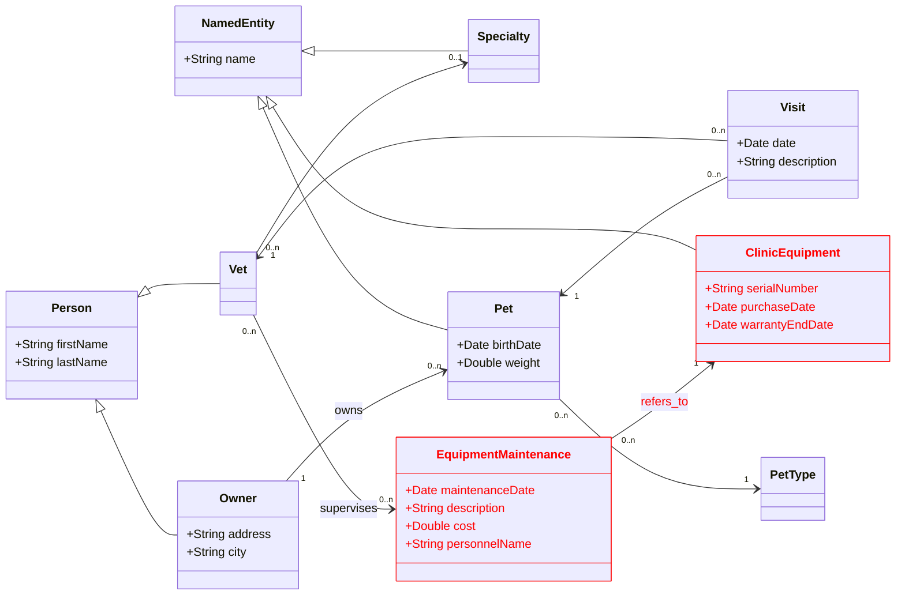

# Evaluación de Prompt

**Proveedor IA:** GEMINI
**Ejercicio:** BASE-CLASSES-CODE-GENERATION
**Dominio:** PETCLINIC
**Fecha:** 12/6/2026, 2:06:46

## Índice
- [1. Contexto Oculto](#1-contexto-oculto)
- [2. Examen Seleccionado](#2-examen-seleccionado)
- [3. Prompt Visible](#3-prompt-visible)
- [4. Respuesta](#4-respuesta)

---

## 1. Contexto Oculto
--- ARCHIVO / RECURSO: base_classes_structure_examples_previous_exams.md ---
# ESTRUCTURA BASE QUE DEBE SEGUIR ESTRICTAMENTE CADA CLASE

## Entidades (se deberán adaptar a los atributos concretos siguiendo el diagrama UML)

### Dominio Ajedrez

```java
package es.us.dp1.chess.tournament.round;

import java.time.LocalDate;
import java.util.List;

import es.us.dp1.chess.tournament.user.User;

import jakarta.persistence.Transient;
import lombok.Getter;
import lombok.Setter;

@Getter
@Setter
public class Round {
    String name;
    Integer roundNumber;
    LocalDate roundDate;
    @Transient
    Tournament tournament;
    @Transient
    List<User> participants;
}
```

```java
package es.us.dp1.chess.tournament.tournament;


import java.time.LocalDate;
import java.util.List;

import es.us.dp1.chess.tournament.user.User;
import lombok.Getter;
import lombok.Setter;

import jakarta.persistence.Transient;

@Getter
@Setter
public class Tournament {

    String name;

    Integer prize;

    LocalDate startDate;

    LocalDate endDate;

    @Transient
    List<User> participants;
}
```

```java
package es.us.dp1.chess.tournament.challenge;


import java.time.LocalDate;
import java.util.List;

import es.us.dp1.chess.tournament.match.ChessMatch;
import es.us.dp1.chess.tournament.user.User;
import lombok.Getter;
import lombok.Setter;

import jakarta.persistence.Transient;

@Getter
@Setter
public class Challenge {

    String message;

    Integer targetValue;

    LocalDate startDate;

    LocalDate endDate;

    ChallengeObjective goal;

    @Transient
    List<User> participants;

    @Transient
    List<ChessMatch> matches;
}
```

### Dominio Clínica Veterinaria

```java
package org.springframework.samples.petclinic.symptom;

import java.util.Set;

import jakarta.persistence.Transient;
import lombok.Getter;
import lombok.Setter;

@Getter
@Setter
public class Symptom {
    String virulence;

    @Transient
    Set<Disease> includes;

    @Transient
    Set<Disease> excludes;
}
```

```java
package org.springframework.samples.petclinic.treatment;

import java.util.Set;

import jakarta.persistence.Transient;
import lombok.Getter;
import lombok.Setter;

@Getter
@Setter
public class Treatment {
    String description;
    Integer baseDose;
    Integer shockDose;
    Integer maxDose;

    @Transient
    Set<Disease> recommendedFor;
}
```

```java
package org.springframework.samples.petclinic.coupon;

import java.time.LocalDate;

import lombok.Getter;
import lombok.Setter;

@Getter
@Setter
public class Coupon {

    LocalDate startDate;

    LocalDate expiryDate;

    GroomingPackage groomingPackage;

}
```

```java
package org.springframework.samples.petclinic.groomingConsumed;

import java.util.List;

import org.springframework.samples.petclinic.visit.Visit;

import lombok.Getter;
import lombok.Setter;

@Setter
@Getter
public class GroomingConsumed {

    String petBeautician;

    Integer minutes;

    String comment;

    Visit appliedDuring;

    Coupon consumed;

    List<GroomingType> typeConsumed;

}
```

```java
package org.springframework.samples.petclinic.medicine;

import java.time.LocalDate;
import java.util.Set;

import jakarta.persistence.Transient;
import lombok.Getter;
import lombok.Setter;

@Getter
@Setter
public class Medicine{
    String description;
    Integer medication; // cantidad de medicación
    LocalDate startDate; // fecha de inicio de la medicación
    LocalDate endDate;  //fecha de fin de la medicación

    @Transient
    Set<Disease> prescribedfor;

}
```

```java
package org.springframework.samples.petclinic.symptom;

import java.util.Set;
import jakarta.persistence.Transient;
import lombok.Getter;
import lombok.Setter;

@Getter
@Setter
public class Symptom {
    String description;

    @Transient
    Set<Disease> includedDiseases;

   @Transient
    Set<Disease> excludedDiseases;

}
```

```java
package org.springframework.samples.petclinic.coursePayment;

import java.time.LocalDate;

import lombok.Getter;
import lombok.Setter;

@Getter
@Setter
public class CoursePayment {
    LocalDate paidOn;
    Double amount;
}
```

```java
package org.springframework.samples.petclinic.courseAttendance;

import java.time.LocalDate;
import java.util.Set;

import org.springframework.samples.petclinic.vet.Vet;

import jakarta.persistence.Transient;
import lombok.Getter;
import lombok.Setter;

@Getter
@Setter
public class CourseAttendance {
    LocalDate registeredOn;
    Integer grade;
    @Transient
    Set<CoursePayment> payments;
    @Transient
    Course course;
    @Transient
    Vet attendant;
}
```

## Enumerados (se deberán adaptar a los atributos concretos siguiendo el diagrama UML)

### Dominio Ajedrez

```java
package es.us.dp1.chess.tournament.challengeObjetive;

public enum ChallengeObjective {
    WIN_MATCHES, PLAY_MATCHES, ACQUIRE_PIECES
}
```

## Repositorios (para cada una de las entidades a crear)

### Dominio Ajedrez

```java
package es.us.dp1.chess.tournament.challenge;

import java.time.LocalDate;
import java.util.List;
import java.util.Optional;

public interface ChallengeRepository {
    Optional<Challenge> findById(Integer id);
    List<Challenge> findAll();
    Challenge save(Challenge tournament);
```

```java
package es.us.dp1.chess.tournament.round;

import java.util.List;
import java.util.Optional;

import org.springframework.data.repository.CrudRepository;

public interface RoundRepository {
    Optional<Round> findById(Integer id);
    List<Round> findAll();
    //List<Round> findByTournament(Tournament tournament);
    Round save(Round round);
}
```

```java
package es.us.dp1.chess.tournament.tournament;

import java.util.List;
import java.util.Optional;

public interface TournamentRepository {
    Optional<Tournament> findById(Integer id);
    List<Tournament> findAll();
    Tournament save(Tournament tournament);
}
```

### Dominio Clínica Veterinaria

```java
package org.springframework.samples.petclinic.symptom;

import java.util.List;
import java.util.Optional;

public interface SymptomRepository {

    Optional<Symptom> findById(Integer i);

    List<Symptom> findAll();

    Symptom save(Symptom any);

}
```

```java
package org.springframework.samples.petclinic.treatment;

import java.util.List;
import java.util.Optional;

public interface TreatmentRepository {

    Optional<Treatment> findById(Integer i);

    List<Treatment> findAll();

    Treatment save(Treatment any);

}
```

```java
package org.springframework.samples.petclinic.allergy;

import java.util.List;
import java.util.Optional;

import org.springframework.data.repository.CrudRepository;

public interface AllergyRepository {

    Optional<Allergy> findById(Integer i);

    List<Allergy> findAll();

    Allergy save(Allergy any);

}
```

## Servicios (para cada una de las entidades a crear)

### Dominio Ajedrez

```java
package es.us.dp1.chess.tournament.challenge;

import java.util.List;

public class ChallengeService {
    ChallengeRepository challengeRepository;

    public ChallengeService(ChallengeRepository challengeRepository) {
        this.challengeRepository = challengeRepository;
    }
```

```java
package es.us.dp1.chess.tournament.round;

import java.util.List;

public class RoundService {
    RoundRepository roundRepository;

    public RoundService(RoundRepository roundRepository) {
        this.roundRepository = roundRepository;
    }
```

```java
package es.us.dp1.chess.tournament.tournament;

import java.util.List;

public class TournamentService {
    TournamentRepository tournamentRepository;

    public TournamentService(TournamentRepository tournamentRepository) {
        this.tournamentRepository = tournamentRepository;
    }
```

### Dominio Clínica Veterinaria

```java
package org.springframework.samples.petclinic.symptom;

import java.util.List;

public class SymptomService {
    SymptomRepository repo;

    public SymptomService(SymptomRepository sr){
        this.repo=sr;
    }

    public List<Symptom> getAll() {
        return null;
    }

    public Symptom save(Symptom s) {
        return null;
    }
}
```

```java
package org.springframework.samples.petclinic.treatment;

import java.util.List;

public class TreatmentService {
    private TreatmentRepository repo;

    public TreatmentService(TreatmentRepository tr){
        this.repo=tr;
    }

    public List<Treatment> getAll() {
        return null;
    }

    public Treatment save(Treatment t) {
        return null;
    }
}
```

```java
package org.springframework.samples.petclinic.allergy;

import java.util.List;

import org.springframework.beans.factory.annotation.Autowired;
import org.springframework.stereotype.Service;
import org.springframework.transaction.annotation.Transactional;

@Service
public class AllergyService {
    AllergyRepository repo;


    public AllergyService(AllergyRepository sr){
        this.repo=sr;
    }

    public List<Allergy> getAll() {
        return repo.findAll();
    }

    public Allergy save(Allergy s) {
        return repo.save(s);
    }
}
```

---

## 2. Examen Seleccionado
En este ejercicio, añadiremos la funcionalidad de gestión de equipos y mantenimiento de la clínica. Concretamente, tendremos la clase “ClinicEquipment” que representa los diversos equipos médicos y herramientas disponibles. Además, se tendrá la clase “EquipmentMaintenance” que registrará las intervenciones de mantenimiento realizadas sobre estos equipos.

La clase ClinicEquipment incluirá el número de serie del equipo, la fecha de su compra y la fecha de finalización de su garantía. Por su parte, la clase EquipmentMaintenance contendrá la fecha en que se realizó la intervención, una descripción de la misma, el coste asociado y el nombre del personal (interno o externo) que la llevó a cabo. Cada equipo puede tener asociados varios registros de mantenimiento, y cada registro de mantenimiento se refiere a un único equipo. Además, los veterinarios pueden ser los encargados de supervisar o realizar ciertas actividades de mantenimiento.

Realizaremos una serie de ejercicios basados en funcionalidades que implementaremos en el sistema, y validaremos mediante pruebas unitarias.



---

## 3. Prompt Visible
Actúa como un desarrollador Senior de Java y Spring Boot experto en la creación de esqueletos de código para exámenes universitarios.

Tu tarea es analizar el diagrama UML que se te pasará como contexto y generar las clases base (Entidad, Repositorio y Servicio) únicamente para las entidades nuevas que el alumno debe desarrollar, siguiendo estrictamente una plantilla de estilo.

### DATOS DE ENTRADA

- Dominio del proyecto: Clínica Veterinaria
- Clases que YA EXISTEN en el repositorio (debes EVITAR generarlas en todos los casos): 
- BaseEntity
- NamedEntity
- Person
- Owner
- Vet
- Pet
- PetType
- Specialty
- Visit
- Clinic
- PricingPlan
- ClinicOwner
- User
- Authorities

### REGLAS DE GENERACIÓN (ESTRICTAS)

1. IDENTIFICACIÓN: Compara las entidades del "Diagrama UML" con las "Clases que YA EXISTEN". Genera código ÚNICAMENTE para las entidades del UML que estén AUSENTES en la lista de clases existentes. Por ejemplo, si la clase `Lugar` se encuentra en la lista de clases existentes, OMITIRÁS la creación tanto de la entidad, el repositorio y el servicio correspondiente a ella.
2. ESTRUCTURA DE ARCHIVOS: Para cada entidad nueva identificada (ej. `Cita`), debes crear una carpeta con su nombre en minúsculas y dentro tres archivos:
   - La entidad en sí (ej. `Cita.java`)
   - El repositorio (ej. `CitaRepository.java`)
   - El servicio (ej. `CitaService.java`)
3. FORMATO DE CÓDIGO: El código generado debe ser un esqueleto inicial para que el alumno lo complete. Debes imitar EXACTAMENTE la estructura, anotaciones JPA/Spring y nivel de detalle proporcionado en el archivo md llamado "base_classes_structure_examples.md". EVITA añadir lógica de negocio adicional y resolver el examen. En cada entidad, deberás poner SIEMPRE la anotación `@Table(name="nombre_entidad")` y su correspondiente importación de jakarta. Ej: Para la entidad Event: `@Table(name = "events")`
4. CERO EXPLICACIONES: Devuelve ÚNICAMENTE el código fuente. EVITA hacer saludos, explicaciones de tus decisiones y comentarios finales.
5. Para las entidades nuevas, EVITA añadir la anotación `@Entity`, ya que esa anotación la tiene que implementar el alumno más adelante.
6. Para los repositorios nuevos, EVITA añadir la extensión a `CrudRepository`, ya que esa anotación la tiene que implementar el alumno más adelante.

### FORMATO DE SALIDA OBLIGATORIO

Para que el sistema automatizado pueda procesar tu respuesta, debes devolver cada archivo utilizando exactamente este formato (fíjate en la ruta de la carpeta):

- Para el dominio **Clínica Veterinaria** (IMPORTANTE LAS MAYÚSCULAS Y MINÚSCULAS, DEBEN SEGUIR EL FORMATO INDICADO): src/main/java/org/springframework/samples/petclinic/[nombreCarpeta]/[NombreClase].java;

```java
// Código Java aquí
```

- Para el dominio **Ajedrez** (IMPORTANTE LAS MAYÚSCULAS Y MINÚSCULAS, DEBEN SEGUIR EL FORMATO INDICADO): src/main/java/es/us/dp1/chess/tournament/[nombreCarpeta]/[NombreClase].java;

```java
// Código Java aquí
```

---

## 4. Respuesta
src/main/java/org/springframework/samples/petclinic/clinicequipment/ClinicEquipment.java;
```java
package org.springframework.samples.petclinic.clinicequipment;

import java.util.Date;

import org.springframework.samples.petclinic.model.NamedEntity;

import jakarta.persistence.Table;
import lombok.Getter;
import lombok.Setter;

@Getter
@Setter
@Table(name = "clinic_equipment")
public class ClinicEquipment extends NamedEntity {

    String serialNumber;

    Date purchaseDate;

    Date warrantyEndDate;

}
```
src/main/java/org/springframework/samples/petclinic/clinicequipment/ClinicEquipmentRepository.java;
```java
package org.springframework.samples.petclinic.clinicequipment;

import java.util.List;
import java.util.Optional;

public interface ClinicEquipmentRepository {

    Optional<ClinicEquipment> findById(Integer id);

    List<ClinicEquipment> findAll();

    ClinicEquipment save(ClinicEquipment clinicEquipment);

}
```
src/main/java/org/springframework/samples/petclinic/clinicequipment/ClinicEquipmentService.java;
```java
package org.springframework.samples.petclinic.clinicequipment;

import java.util.List;

public class ClinicEquipmentService {
    ClinicEquipmentRepository repo;

    public ClinicEquipmentService(ClinicEquipmentRepository clinicEquipmentRepository) {
        this.repo = clinicEquipmentRepository;
    }

    public List<ClinicEquipment> getAll() {
        return null;
    }

    public ClinicEquipment save(ClinicEquipment s) {
        return null;
    }
}
```
src/main/java/org/springframework/samples/petclinic/equipmentmaintenance/EquipmentMaintenance.java;
```java
package org.springframework.samples.petclinic.equipmentmaintenance;

import java.util.Date;
import java.util.List;

import org.springframework.samples.petclinic.clinicequipment.ClinicEquipment;
import org.springframework.samples.petclinic.vet.Vet;

import jakarta.persistence.Table;
import jakarta.persistence.Transient;
import lombok.Getter;
import lombok.Setter;

@Getter
@Setter
@Table(name = "equipment_maintenance")
public class EquipmentMaintenance {

    Date maintenanceDate;

    String description;

    Double cost;

    String personnelName;

    @Transient
    ClinicEquipment clinicEquipment;

    @Transient
    List<Vet> supervisors;

}
```
src/main/java/org/springframework/samples/petclinic/equipmentmaintenance/EquipmentMaintenanceRepository.java;
```java
package org.springframework.samples.petclinic.equipmentmaintenance;

import java.util.List;
import java.util.Optional;

public interface EquipmentMaintenanceRepository {

    Optional<EquipmentMaintenance> findById(Integer id);

    List<EquipmentMaintenance> findAll();

    EquipmentMaintenance save(EquipmentMaintenance equipmentMaintenance);

}
```
src/main/java/org/springframework/samples/petclinic/equipmentmaintenance/EquipmentMaintenanceService.java;
```java
package org.springframework.samples.petclinic.equipmentmaintenance;

import java.util.List;

public class EquipmentMaintenanceService {
    EquipmentMaintenanceRepository repo;

    public EquipmentMaintenanceService(EquipmentMaintenanceRepository equipmentMaintenanceRepository) {
        this.repo = equipmentMaintenanceRepository;
    }

    public List<EquipmentMaintenance> getAll() {
        return null;
    }

    public EquipmentMaintenance save(EquipmentMaintenance s) {
        return null;
    }
}
```