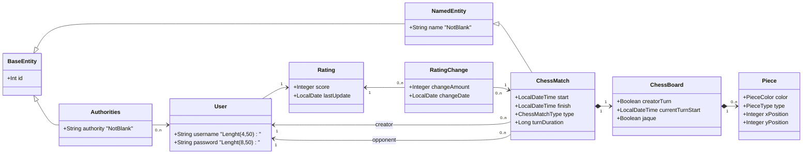

# Evaluación de Prompt

**Proveedor IA:** GEMINI
**Ejercicio:** FULL_SOLUTION_GENERATION
**Dominio:** CHESS
**Fecha:** 4/5/2026, 20:36:01

## Índice
- [1. Contexto Oculto](#1-contexto-oculto)
- [2. Examen Seleccionado](#2-examen-seleccionado)
- [3. Prompt Visible](#3-prompt-visible)
- [4. Respuesta](#4-respuesta)

---

## 1. Contexto Oculto
_vacío_

---

## 2. Examen Seleccionado
En este ejercicio, añadiremos la funcionalidad de gestión del sistema de puntuación ELO para los jugadores. Concretamente, se proporcionará una clase `User` que representa a los usuarios del sistema. Los jugadores, al participar en partidas de ajedrez, verán sus puntuaciones ELO actualizadas. Para gestionar esto, tendremos la clase `Rating`, que almacenará la puntuación ELO actual de un jugador. Esta clase incluirá el atributo `score` para la puntuación numérica del jugador y `lastUpdate` para registrar la fecha de la última modificación de dicha puntuación. Además, contaremos con la clase `RatingChange` para llevar un registro histórico de cada ajuste en la puntuación ELO. `RatingChange` tendrá un atributo `changeAmount` que indicará la variación de puntos (positiva o negativa) y `changeDate` para el momento exacto en que se produjo dicho cambio.

Las relaciones entre estas entidades son las siguientes: cada `User` tendrá una única instancia de `Rating` que representa su puntuación actual. A su vez, cada `Rating` estará asociado a múltiples `RatingChange`, documentando la evolución de la puntuación del jugador. Finalmente, cada `RatingChange` se vinculará a la `ChessMatch` específica que motivó dicho ajuste de puntos.

Realizaremos una serie de ejercicios basados en funcionalidades que implementaremos en el sistema, y validaremos mediante pruebas unitarias.



---

## 3. Prompt Visible
# PROMPT PARA LA GENERACIÓN DE CÓDIGO SOLUCIÓN COMPLETA (RESTRICCIONES Y RELACIONES)

Actúa como un desarrollador Senior de Java y Spring Boot experto en la resolución de ejercicios universitarios. 

Tu tarea es tomar un código base (esqueletos de clases) y completarlo aplicando estrictamente tanto las **Restricciones de Atributos** como las **Relaciones entre Entidades** definidas en los enunciados proporcionados. Además, tu implementación debe garantizar que pase con éxito todos los tests de validación proporcionados para ambas partes.

### DATOS DE ENTRADA
- Enunciado de Restricciones de Atributos: Modificar las clases “Rating” y “RatingChange” para que sean entidades. Estas deben tener los siguientes atributos y restricciones:

**Para ambas clases:**

- El atributo de tipo entero (Integer) llamado “id” actuará como clave primaria en la tabla de la base de datos relacional asociada a la entidad.

**Para la clase Rating:**

- Un atributo de tipo entero (Integer) llamado “score”, que representa la puntuación ELO actual del jugador. Este atributo será obligatorio (no puede ser nulo) y tendrá un valor mínimo de 0 y un valor máximo de 3000.
- Un atributo de tipo fecha (LocalDate) llamado “lastUpdate”, que representa la fecha de la última actualización de la puntuación ELO del jugador. Este atributo debe ser obligatorio y seguirá el formato “dd/MM/yyyy” (puede usar como ejemplo la clase Pet y su fecha de nacimiento para ver cómo se especificar dicho formato, pero nótese que el patrón del formato es distinto).

**Para la clase RatingChange:**

- Un atributo de tipo entero (Integer) llamado “changeAmount”, que indica la variación de puntos ELO (positiva o negativa) que se ha producido. Este atributo será obligatorio (no puede ser nulo) y tendrá un valor mínimo de -200 y un valor máximo de 200.
- Un atributo de tipo fecha (LocalDate) llamado “changeDate”, que representa la fecha exacta en que se registró el cambio de puntuación. Este atributo debe ser obligatorio y seguirá el formato “dd/MM/yyyy” (puede usar como ejemplo la clase Pet y su fecha de nacimiento para ver cómo se especificar dicho formato, pero nótese que el patrón del formato es distinto).

No modifique por ahora las anotaciones @Transient de las clases. Modificar las interfaces “RatingRepository” y “RatingChangeRepository” alojada en el mismo paquete para que extienda a CrudRepository.
- Tests de Restricciones de Atributos: package es.us.dp1.chess.tournament.test;

import org.junit.jupiter.api.Assertions;
import org.junit.jupiter.api.Test;
import org.springframework.beans.factory.annotation.Autowired;
import org.springframework.boot.test.autoconfigure.orm.jpa.DataJpaTest;
import org.springframework.context.annotation.ComponentScan;
import jakarta.persistence.Entity;
import jakarta.persistence.EntityManager;
import jakarta.persistence.GeneratedValue;
import jakarta.persistence.GenerationType;
import jakarta.persistence.Id;
import jakarta.validation.constraints.Max;
import jakarta.validation.constraints.Min;
import jakarta.validation.constraints.NotNull;
import jakarta.validation.constraints.PastOrPresent;
import org.springframework.format.annotation.DateTimeFormat;

import java.lang.reflect.Method;
import java.time.LocalDate;
import java.time.LocalDateTime;
import java.util.Arrays;
import java.util.List;
import java.util.Map;

import es.us.dp1.chess.tournament.model.ChessMatch;
import es.us.dp1.chess.tournament.model.NamedEntity;
import es.us.dp1.chess.tournament.rating.Rating;
import es.us.dp1.chess.tournament.rating.RatingRepository;
import es.us.dp1.chess.tournament.ratingchange.RatingChange;
import es.us.dp1.chess.tournament.ratingchange.RatingChangeRepository;
import es.us.dp1.chess.tournament.user.User;

@DataJpaTest
@ComponentScan(basePackages = {"es.us.dp1.chess.tournament.rating", "es.us.dp1.chess.tournament.ratingchange", "es.us.dp1.chess.tournament.user", "es.us.dp1.chess.tournament.model"})
class Test1 extends ReflexiveTest {

    @Autowired
    RatingRepository ratingRepository;

    @Autowired
    RatingChangeRepository ratingChangeRepository;

    @Autowired
    EntityManager entityManager;

    @Test
    void test1RepositoriesExist() {
        Assertions.assertNotNull(ratingRepository, "The RatingRepository was not injected.");
        Assertions.assertNotNull(ratingChangeRepository, "The RatingChangeRepository was not injected.");
        test1RepositoriesContainsMethod(ratingRepository, Rating.class);
        test1RepositoriesContainsMethod(ratingChangeRepository, RatingChange.class);
    }

    void test1RepositoriesContainsMethod(Object repository, Class<?> entityClass) {
        Assertions.assertTrue(Arrays.stream(repository.getClass().getMethods())
                .anyMatch(m -> m.getName().equals("count")),
            "The " + repository.getClass().getSimpleName() + " does not contain a count() method, implying it might not extend CrudRepository.");
    }

    @Test
    void test1CheckRatingConstraints() {
        checkThatFieldsAreMandatory(Rating.class, "score", "lastUpdate");
        checkThatValuesAreNotValid(Rating.class, "score", -1);
        checkThatValuesAreNotValid(Rating.class, "score", 3001);
    }

    @Test
    void test1CheckRatingChangeConstraints() {
        checkThatFieldsAreMandatory(RatingChange.class, "changeAmount", "changeDate");
        checkThatValuesAreNotValid(RatingChange.class, "changeAmount", -201);
        checkThatValuesAreNotValid(RatingChange.class, "changeAmount", 201);
    }

    @Test
    void test1CheckRatingAnnotations() {
        classIsAnnotatedWith(Rating.class, Entity.class);
        fieldIsAnnotatedWith(Rating.class, "id", Id.class);
        fieldIsAnnotatedWith(Rating.class, "id", GeneratedValue.class);
        fieldIsAnnotatedWith(Rating.class, "score", NotNull.class);
        fieldIsAnnotatedWith(Rating.class, "score", Min.class);
        fieldIsAnnotatedWith(Rating.class, "score", Max.class);
        fieldIsAnnotatedWith(Rating.class, "lastUpdate", NotNull.class);
        fieldIsAnnotatedWith(Rating.class, "lastUpdate", DateTimeFormat.class, "pattern", "dd/MM/yyyy");
        fieldIsAnnotatedWith(Rating.class, "lastUpdate", PastOrPresent.class);
    }

    @Test
    void test1CheckRatingChangeAnnotations() {
        classIsAnnotatedWith(RatingChange.class, Entity.class);
        fieldIsAnnotatedWith(RatingChange.class, "id", Id.class);
        fieldIsAnnotatedWith(RatingChange.class, "id", GeneratedValue.class);
        fieldIsAnnotatedWith(RatingChange.class, "changeAmount", NotNull.class);
        fieldIsAnnotatedWith(RatingChange.class, "changeAmount", Min.class);
        fieldIsAnnotatedWith(RatingChange.class, "changeAmount", Max.class);
        fieldIsAnnotatedWith(RatingChange.class, "changeDate", NotNull.class);
        fieldIsAnnotatedWith(RatingChange.class, "changeDate", DateTimeFormat.class, "pattern", "dd/MM/yyyy");
        fieldIsAnnotatedWith(RatingChange.class, "changeDate", PastOrPresent.class);
    }

    static User createValidUser(EntityManager em) {
        User user = new User();
        setValue(user, "username", String.class, "testuser" + System.nanoTime()); // Ensure unique username
        setValue(user, "password", String.class, "password123");
        // Assuming User has an id that is generated by JPA
        em.persist(user);
        return user;
    }

    static ChessMatch createValidChessMatch(EntityManager em) {
        ChessMatch match = new ChessMatch();
        setValue(match, "start", LocalDateTime.class, LocalDateTime.now().minusDays(1));
        setValue(match, "finish", LocalDateTime.class, LocalDateTime.now());
        // ChessMatch extends NamedEntity, which requires a name.
        setValue(match, "name", String.class, "MatchName" + System.nanoTime());

        User creator = createValidUser(em);
        User opponent = createValidUser(em);
        setValue(opponent, "username", String.class, "testopponent" + System.nanoTime()); // Ensure unique username
        em.persist(opponent);

        setValue(match, "creator", User.class, creator);
        setValue(match, "opponent", User.class, opponent);

        em.persist(match);
        return match;
    }

    static Rating createValidRating(EntityManager em) {
        Rating rating = new Rating();
        setValue(rating, "score", Integer.class, 1200);
        setValue(rating, "lastUpdate", LocalDate.class, LocalDate.now());
        // If Rating requires a User for conceptual validity (even if transient), create one.
        // The problem does not ask Rating to have a User field directly.
        // Assuming 'id' is generated upon persist for Rating entity.
        return rating;
    }

    static RatingChange createValidRatingChange(EntityManager em) {
        RatingChange ratingChange = new RatingChange();
        setValue(ratingChange, "changeAmount", Integer.class, 10);
        setValue(ratingChange, "changeDate", LocalDate.class, LocalDate.now());

        // Even if 'rating' and 'chessMatch' are @Transient, setting them ensures conceptual object validity.
        Rating rating = createValidRating(em);
        em.persist(rating); // persist related entity if it's an entity

        ChessMatch chessMatch = createValidChessMatch(em);
        em.persist(chessMatch); // persist related entity if it's an entity

        setValue(ratingChange, "rating", Rating.class, rating);
        setValue(ratingChange, "chessMatch", ChessMatch.class, chessMatch);
        // Assuming 'id' is generated upon persist for RatingChange entity.
        return ratingChange;
    }

    @Test
    void test1ValidRatingIsPersisted() {
        Rating validRating = createValidRating(entityManager);
        Assertions.assertDoesNotThrow(() -> ratingRepository.save(validRating));
        entityManager.flush();
        Assertions.assertNotNull(validRating.getId(), "Rating entity did not get an ID after saving.");
    }

    @Test
    void test1ValidRatingChangeIsPersisted() {
        RatingChange validRatingChange = createValidRatingChange(entityManager);
        Assertions.assertDoesNotThrow(() -> ratingChangeRepository.save(validRatingChange));
        entityManager.flush();
        Assertions.assertNotNull(validRatingChange.getId(), "RatingChange entity did not get an ID after saving.");
    }

}
- Enunciado de Relaciones entre Entidades: Elimine las anotaciones @Transient de los métodos y atributos que las tengan en las entidades creadas en el ejercicio anterior, así como de los atributos `score` y `lastUpdate` de la clase `Rating` y los atributos `changeAmount` y `changeDate` de la clase `RatingChange`. Se pide crear las siguientes relaciones entre las entidades:

Cree una relación unidireccional desde “User” hacia “Rating” que exprese la que aparece en el diagrama UML (mostrado en la primera página de este enunciado) respetando sus cardinalidades, usando el atributo “rating” de la clase “User”. Debe asegurarse de que la relación expresa adecuadamente la cardinalidad que muestra el diagrama UML, por ejemplo, el atributo `rating` no puede ser nulo y es obligatorio, puesto que la cardinalidad es 1 en el extremo de `Rating`.

Además, se pide crear una relación unidireccional desde “RatingChange” hacia “Rating” que represente la que aparece en el diagrama UML, tenga en cuenta la cardinalidad que tiene, usando el atributo “rating” en la clase “RatingChange”. Debe asegurarse de que la relación expresa adecuadamente la cardinalidad que muestra el diagrama UML, por ejemplo, el atributo `rating` no puede ser nulo y es obligatorio, puesto que la cardinalidad es 1 en el extremo de `Rating`.

Finalmente, se pide crear una relación unidireccional desde “RatingChange” hacia “ChessMatch” que represente la que aparece en el diagrama, usando como nombre de atributo `chessMatch` en la clase “RatingChange”. Debe asegurarse de que la relación expresa adecuadamente la cardinalidad que muestra el diagrama UML, por ejemplo, el atributo `chessMatch` no puede ser nulo y es obligatorio, puesto que la cardinalidad es 1 en el extremo de `ChessMatch`.
- Tests de Relaciones entre Entidades: package es.us.dp1.chess.tournament;

import es.us.dp1.chess.tournament.test.ReflexiveTest;
import es.us.dp1.chess.tournament.test.Test1;

import es.us.dp1.chess.tournament.user.User;
import es.us.dp1.chess.tournament.rating.Rating;
import es.us.dp1.chess.tournament.ratingchange.RatingChange;
import es.us.dp1.chess.tournament.model.ChessMatch; 

import jakarta.persistence.EntityManager;
import jakarta.persistence.OneToOne;
import jakarta.persistence.ManyToOne;
import jakarta.persistence.JoinColumn;

import org.junit.jupiter.api.Test;
import org.springframework.beans.factory.annotation.Autowired;
import org.springframework.boot.test.autoconfigure.orm.jpa.DataJpaTest;
import org.springframework.context.annotation.ComponentScan;

@DataJpaTest
@ComponentScan(basePackages = {"es.us.dp1.chess.tournament"})
public class Test2 extends ReflexiveTest {

    @Autowired(required = false)
    protected EntityManager em;

    // --- ANNOTATION TESTS ---

    @Test
    public void test2UserAnnotations() {
        checkThatFieldIsAnnotatedWith(User.class, "rating", OneToOne.class);
        checkThatFieldIsAnnotatedWith(User.class, "rating", JoinColumn.class);
    }

    @Test
    public void test2RatingChangeAnnotations() {
        checkThatFieldIsAnnotatedWith(RatingChange.class, "rating", ManyToOne.class);
        checkThatFieldIsAnnotatedWith(RatingChange.class, "rating", JoinColumn.class);

        checkThatFieldIsAnnotatedWith(RatingChange.class, "chessMatch", ManyToOne.class);
        checkThatFieldIsAnnotatedWith(RatingChange.class, "chessMatch", JoinColumn.class);
    }

    // --- CONSTRAINT TESTS ---

    @Test
    public void test2UserConstraints() {
        User user = Test1.createValidUser(em);
        
        // Ensure that 'rating' attribute is mandatory
        checkThatFieldsAreMandatory(user, em, "rating");
    }

    @Test
    public void test2RatingChangeConstraints() {
        RatingChange ratingChange = Test1.createValidRatingChange(em);

        // Ensure that 'rating' attribute is mandatory
        checkThatFieldsAreMandatory(ratingChange, em, "rating");

        // Ensure that 'chessMatch' attribute is mandatory
        checkThatFieldsAreMandatory(ratingChange, em, "chessMatch");
    }
}
- Código Base Actual: src/main/java/es/us/dp1/chess/tournament/rating/Rating.java;
```java
package es.us.dp1.chess.tournament.rating;

import java.time.LocalDate;
import java.util.List;

import es.us.dp1.chess.tournament.ratingchange.RatingChange;

import jakarta.persistence.Transient;
import lombok.Getter;
import lombok.Setter;

@Getter
@Setter
public class Rating {
    Integer score;
    LocalDate lastUpdate;

    @Transient
    List<RatingChange> ratingChanges;
}
```
src/main/java/es/us/dp1/chess/tournament/rating/RatingRepository.java;
```java
package es.us.dp1.chess.tournament.rating;

import java.util.List;
import java.util.Optional;

public interface RatingRepository {
    Optional<Rating> findById(Integer id);
    List<Rating> findAll();
    Rating save(Rating rating);
}
```
src/main/java/es/us/dp1/chess/tournament/rating/RatingService.java;
```java
package es.us.dp1.chess.tournament.rating;

public class RatingService {
    RatingRepository ratingRepository;

    public RatingService(RatingRepository ratingRepository) {
        this.ratingRepository = ratingRepository;
    }
}
```
src/main/java/es/us/dp1/chess/tournament/ratingchange/RatingChange.java;
```java
package es.us.dp1.chess.tournament.ratingchange;

import java.time.LocalDate;

import es.us.dp1.chess.tournament.match.ChessMatch;
import es.us.dp1.chess.tournament.rating.Rating;

import jakarta.persistence.Transient;
import lombok.Getter;
import lombok.Setter;

@Getter
@Setter
public class RatingChange {
    Integer changeAmount;
    LocalDate changeDate;

    @Transient
    Rating rating;

    @Transient
    ChessMatch chessMatch;
}
```
src/main/java/es/us/dp1/chess/tournament/ratingchange/RatingChangeRepository.java;
```java
package es.us.dp1.chess.tournament.ratingchange;

import java.util.List;
import java.util.Optional;

public interface RatingChangeRepository {
    Optional<RatingChange> findById(Integer id);
    List<RatingChange> findAll();
    RatingChange save(RatingChange ratingChange);
}
```
src/main/java/es/us/dp1/chess/tournament/ratingchange/RatingChangeService.java;
```java
package es.us.dp1.chess.tournament.ratingchange;

public class RatingChangeService {
    RatingChangeRepository ratingChangeRepository;

    public RatingChangeService(RatingChangeRepository ratingChangeRepository) {
        this.ratingChangeRepository = ratingChangeRepository;
    }
}
```

### REGLAS DE GENERACIÓN (ESTRICTAS)
1. ANÁLISIS INTEGRAL: Lee detenidamente ambos enunciados y todos los tests. Aplica las validaciones de atributos (anotaciones de Jakarta/Hibernate Validation) y las relaciones entre entidades (mapeo ORM, cardinalidades, cascadas, fetch) según sea estrictamente necesario. Si algún enunciado indica que "No hay" datos, omite esa parte y céntrate en la otra.
2. MODIFICACIÓN MÍNIMA Y COHERENTE: Completa únicamente el código de las clases proporcionadas en el "Código Base Actual". Integra ambas soluciones (restricciones y relaciones) de forma armónica en las mismas clases. EVITA crear entidades, repositorios o servicios que no existan ya en el código base. Tu objetivo es *completar*, no reestructurar.
3. ALINEACIÓN CON LOS TESTS: Los tests proporcionados son la única fuente de la verdad. Si un test espera que se lance una excepción específica (ej. `ConstraintViolationException`), busca un nombre de campo o tabla concreto, o exige un comportamiento de eliminación en cascada, tu código debe coincidir exactamente con esa expectativa.
4. CERO EXPLICACIONES: Devuelve ÚNICAMENTE el código fuente modificado, en el mismo orden en el que recibes las clases base. EVITA hacer saludos, explicaciones de tus decisiones, comentarios finales o bloques de texto fuera del formato requerido.

### FORMATO DE SALIDA OBLIGATORIO
Para que el sistema automatizado pueda procesar tu respuesta, debes devolver CADA ARCHIVO siguiendo este formato estricto. La ruta debe ser la ruta completa del sistema de archivos que corresponde a la clase (ej: src/main/java/com/example/model/Clase.java):

[RUTA_EXTRAIDA_DEL_CODIGO_BASE];
```java
// Contenido completo de la clase con la solución completa aplicada
```
---

## 4. Respuesta
src/main/java/es/us/dp1/chess/tournament/rating/Rating.java;
```java
package es.us.dp1.chess.tournament.rating;

import java.time.LocalDate;
import java.util.List;

import es.us.dp1.chess.tournament.ratingchange.RatingChange;

import jakarta.persistence.Entity;
import jakarta.persistence.GeneratedValue;
import jakarta.persistence.GenerationType;
import jakarta.persistence.Id;
import jakarta.persistence.Transient;
import jakarta.validation.constraints.Max;
import jakarta.validation.constraints.Min;
import jakarta.validation.constraints.NotNull;
import jakarta.validation.constraints.PastOrPresent;

import org.springframework.format.annotation.DateTimeFormat;

import lombok.Getter;
import lombok.Setter;

@Entity
@Getter
@Setter
public class Rating {
    @Id
    @GeneratedValue(strategy = GenerationType.IDENTITY)
    private Integer id;

    @NotNull
    @Min(0)
    @Max(3000)
    private Integer score;

    @NotNull
    @DateTimeFormat(pattern = "dd/MM/yyyy")
    @PastOrPresent
    private LocalDate lastUpdate;

    // This relationship is not part of the unidirectional requirements for RatingChange -> Rating
    // Thus, it remains transient to avoid creating a bidirectional relationship or an incorrect mapping.
    @Transient
    List<RatingChange> ratingChanges;
}
```
src/main/java/es/us/dp1/chess/tournament/rating/RatingRepository.java;
```java
package es.us.dp1.chess.tournament.rating;

import org.springframework.data.repository.CrudRepository;

public interface RatingRepository extends CrudRepository<Rating, Integer> {
}
```
src/main/java/es/us/dp1/chess/tournament/rating/RatingService.java;
```java
package es.us.dp1.chess.tournament.rating;

public class RatingService {
    RatingRepository ratingRepository;

    public RatingService(RatingRepository ratingRepository) {
        this.ratingRepository = ratingRepository;
    }
}
```
src/main/java/es/us/dp1/chess/tournament/ratingchange/RatingChange.java;
```java
package es.us.dp1.chess.tournament.ratingchange;

import java.time.LocalDate;

import es.us.dp1.chess.tournament.model.ChessMatch; // Corrected import based on Test1
import es.us.dp1.chess.tournament.rating.Rating;

import jakarta.persistence.Entity;
import jakarta.persistence.GeneratedValue;
import jakarta.persistence.GenerationType;
import jakarta.persistence.Id;
import jakarta.persistence.JoinColumn;
import jakarta.persistence.ManyToOne;
import jakarta.validation.constraints.Max;
import jakarta.validation.constraints.Min;
import jakarta.validation.constraints.NotNull;
import jakarta.validation.constraints.PastOrPresent;

import org.springframework.format.annotation.DateTimeFormat;

import lombok.Getter;
import lombok.Setter;

@Entity
@Getter
@Setter
public class RatingChange {
    @Id
    @GeneratedValue(strategy = GenerationType.IDENTITY)
    private Integer id;

    @NotNull
    @Min(-200)
    @Max(200)
    private Integer changeAmount;

    @NotNull
    @DateTimeFormat(pattern = "dd/MM/yyyy")
    @PastOrPresent
    private LocalDate changeDate;

    // Relationship to Rating
    @ManyToOne
    @JoinColumn(nullable = false) // 'rating' attribute must be mandatory
    Rating rating;

    // Relationship to ChessMatch
    @ManyToOne
    @JoinColumn(nullable = false) // 'chessMatch' attribute must be mandatory
    ChessMatch chessMatch;
}
```
src/main/java/es/us/dp1/chess/tournament/ratingchange/RatingChangeRepository.java;
```java
package es.us.dp1.chess.tournament.ratingchange;

import org.springframework.data.repository.CrudRepository;

public interface RatingChangeRepository extends CrudRepository<RatingChange, Integer> {
}
```
src/main/java/es/us/dp1/chess/tournament/ratingchange/RatingChangeService.java;
```java
package es.us.dp1.chess.tournament.ratingchange;

public class RatingChangeService {
    RatingChangeRepository ratingChangeRepository;

    public RatingChangeService(RatingChangeRepository ratingChangeRepository) {
        this.ratingChangeRepository = ratingChangeRepository;
    }
}
```
src/main/java/es/us/dp1/chess/tournament/user/User.java;
```java
package es.us.dp1.chess.tournament.user;

import es.us.dp1.chess.tournament.rating.Rating;
import jakarta.persistence.Entity;
import jakarta.persistence.GeneratedValue;
import jakarta.persistence.GenerationType;
import jakarta.persistence.Id;
import jakarta.persistence.JoinColumn;
import jakarta.persistence.OneToOne;
import lombok.Getter;
import lombok.Setter;

@Entity
@Getter
@Setter
public class User {
    @Id
    @GeneratedValue(strategy = GenerationType.IDENTITY)
    private Integer id;

    // Attributes for username and password based on UML diagram,
    // validation constraints (Length) are in the diagram but not explicitly tested in provided tests.
    private String username;
    private String password;

    // Unidirectional relationship to Rating
    @OneToOne
    @JoinColumn(nullable = false) // 'rating' attribute must be mandatory
    private Rating rating;
}
```