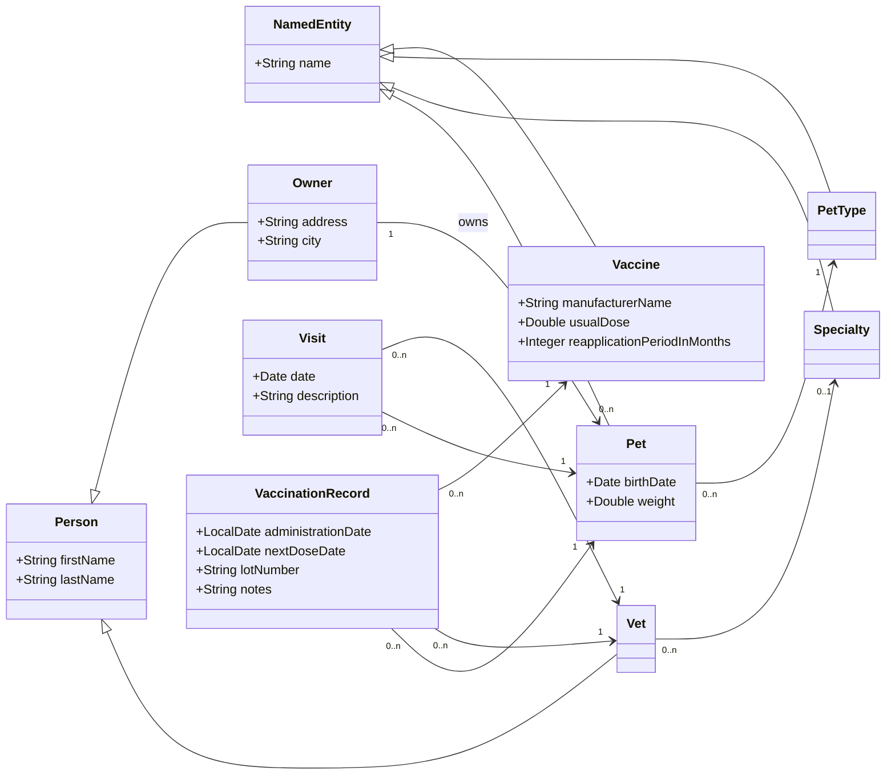
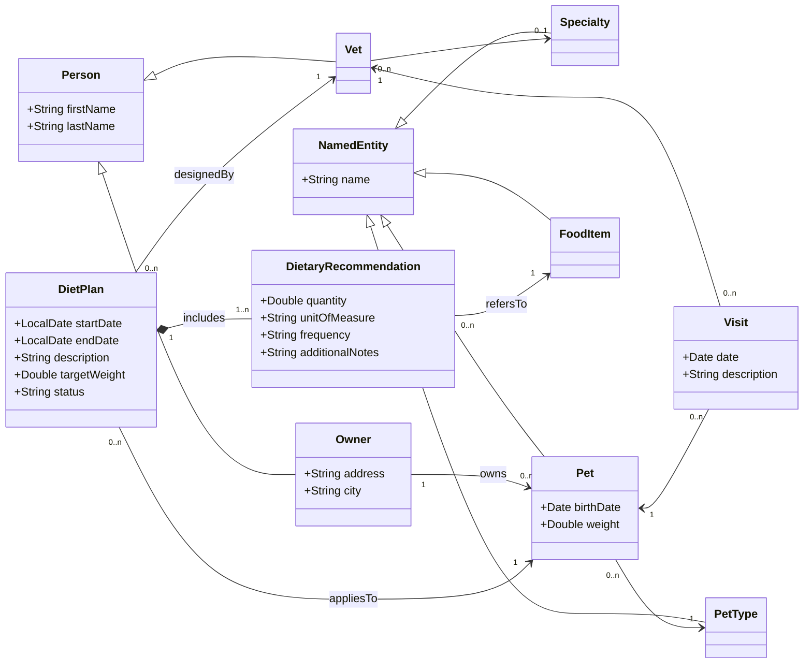
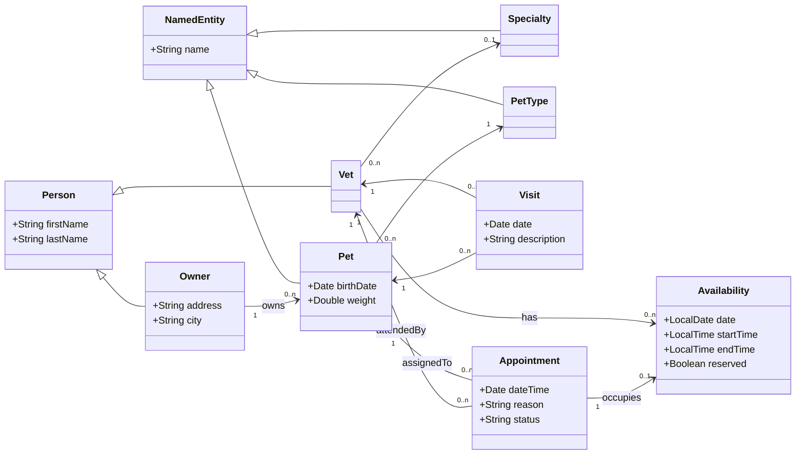
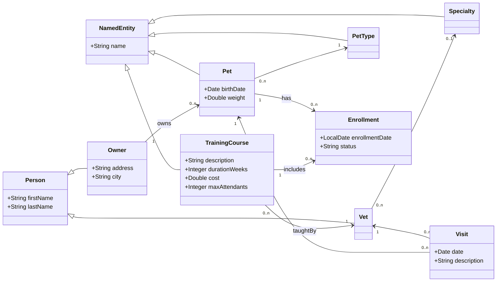
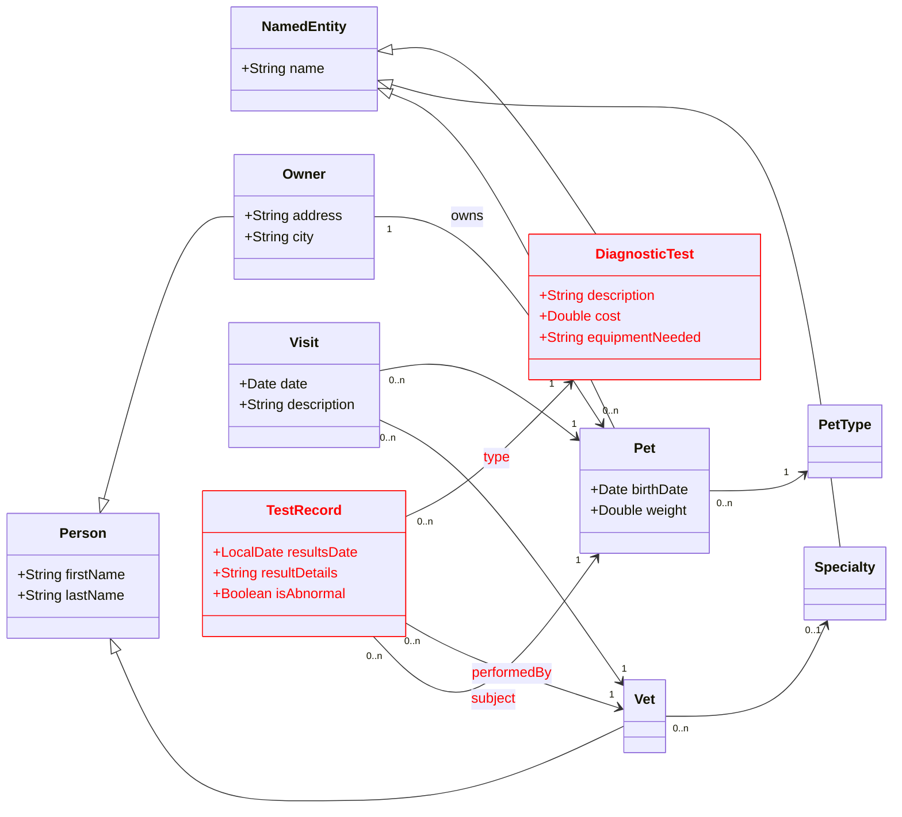

# Evaluación de Prompt

**Ejercicio:** STATEMENT-FUNCTIONAL-EXTENSION
**Dominio:** PETCLINIC
**Fecha:** 8/6/2026, 21:13:51

## Índice
- [1. Contexto Oculto](#1-contexto-oculto)
- [2. Extensiones Previas](#2-extensiones-previas)
- [3. Prompt Visible](#3-prompt-visible)
- [4. Respuesta](#4-respuesta)

---

## 1. Contexto Oculto
--- ARCHIVO / RECURSO: functional_extension_examples_previous_exams.md ---
# EXTENSIONES FUNCIONALES DE EJEMPLO

## Clínica Veterinaria:

### ControlCheck 1 G1 ----------------------------------------------------------------------------------------------------------------------

```
En este ejercicio, añadiremos la funcionalidad de gestión de
enfermedades, síntomas y tratamientos médicos. Concretamente, se
proporciona una clase “Disease” que representa a las enfermedades que
pueden desarrollar las mascotas, que se relaciona con el tipo de mascotas
que pueden sufrirlas. Además, tendremos las clases “Symptom” y
“Treatment” que representan a los síntomas que pueden aparecer a
consecuencia de una enfermedad y los tratamientos recomendados para
cada enfermedad respectivamente. Además, se ha creado una relación
que indica qué síntomas son susceptibles de presentarse para una
enfermedad llamada “includes”, para ayudar a los veterinarios a realizar
diagnósticos más precisos. El diagrama UML que describe las clases y
relaciones con las que vamos a trabajar es el siguiente:
```

```
classDiagram
direction LR

class NamedEntity {
+String name
}

class Person {
+String firstName
+String lastName
}

class Vet {
}

class Owner {
+String address
+String city
}

class Specialty {
}

class Pet {
+Date birthDate
+Double weight
}

class PetType {
}

class Visit {
+Date date
+String description
}

class Disease {
+String description
+Integer severity
}

class Symptom {
+String virulence
}

class Treatment {
+Integer baseDose
+Integer shockDose
+Integer maxDose
}

%% --- Herencia ---
NamedEntity <|-- Pet
NamedEntity <|-- Specialty
NamedEntity <|-- Symptom
NamedEntity <|-- Disease
NamedEntity <|-- Treatment
Person <|-- Vet
Person <|-- Owner

%% --- Asociaciones y Relaciones ---
Owner "1" --> "0..n" Pet : owns
Vet "0..n" --> "0..1" Specialty
Vet "1" <-- "0..n" Visit
Pet "0..n" --> "1" PetType
Pet "1" <-- "0..n" Visit
Visit "0..n" --> "0..1" Disease : <font color=blue>diagnosed</font>
Visit "0..n" --> "0..n" Symptom : <font color=red>present</font>
PetType "0..n" <-- "0..n" Disease : <font color=blue>can develop</font>
Disease "1..n" <-- "0..n" Symptom : <font color=red>includes</font>
Disease "1..n" <-- "0..n" Treatment : <font color=red>recommended for< font>

%% Style
style Pet stroke:blue,color:blue
style PetType stroke:blue,color:blue
style Disease stroke:blue,color:blue
style Visit stroke:blue,color:blue

style Symptom stroke:red,color:red
style Treatment stroke:red,color:red

linkStyle 7 stroke:blue
linkStyle 6 stroke:blue
```

```
Las clases para las que realizaremos el mapeo objeto-relacional como
entidades JPA se han señalado en rojo. Las clases en azul son clases que
se proporcionan ya mapeadas pero con las que se trabajará durante el
control de laboratorio. Realizaremos una serie de ejercicios basados en
funcionalidades que implementaremos en el sistema, y validaremos
mediante pruebas unitarias.
```

### ControlCheck 1 G2 ----------------------------------------------------------------------------------------------------------------------

```
En este ejercicio, añadiremos la funcionalidad de gestión de cirugías a
las mascotas. En concreto, tendremos la clase “Surgery”, que representa
la realización de una cirugía a una mascota por un equipo de
veterinarios, y la clase “OperatingRoom”, que representa las distintas
salas de operaciones disponibles en la clínica para realizar la cirugía.
Cada sala de operaciones está preparada para tratar a un determinado
tipo de cirugía concreto, representado con la clase “SurgeryType”. Por
ejemplo, podemos tener las salas 1 y 2 preparadas para cirugía de tejidos
blandos y la sala 3 preparada para cirugía oftálmica. Además, la clase
SurgeryType se relaciona con aquellos PetType a los que ese tipo de
cirugía puede aplicar. El diagrama UML que describe las clases y
relaciones con las que vamos a trabajar es el siguiente:
```

```
classDiagram
direction LR

class NamedEntity {
+String name
}

class Person {
+String firstName
+String lastName
}

class Vet {
}

class Owner {
+String address
+String city
}

class Specialty {
}

class Pet {
+Date birthDate
+Double weight
}

class PetType {
}

class Visit {
+Date date
+String description
}

class Surgery {
+String description
+LocalDate date
}

class SurgeryType {
}

class OperatingRoom {
+int size
+String sterilizationLevel
}

%% --- Herencia ---
NamedEntity <|-- Pet
NamedEntity <|-- Specialty
NamedEntity <|-- SurgeryType
NamedEntity <|-- Surgery
NamedEntity <|-- OperatingRoom
Person <|-- Vet
Person <|-- Owner

%% --- Asociaciones y Relaciones ---
Owner "1" --> "0..n" Pet : owns
Vet "0..n" --> "0..1" Specialty
Pet "0..n" --> "1" PetType
Visit "0..n" --> "1" Pet
Visit "0..n" --> "1" Vet
Visit "0..n" --> "0..1" SurgeryType : <font color=blue>recommends</font>
SurgeryType "0..n" --> "1..n" PetType : <font color=blue>can be applied to</font>
Surgery "0..n" --> "1" Pet : <font color=red>pet</font>
Surgery "1..n" --> "1" SurgeryType : <font color=red>type</font>
Surgery "0..n" --> "1" OperatingRoom : <font color=red>room</font>
OperatingRoom "0..n" --> "1..n" SurgeryType : <font color=red>valid for</font>

%% Style
style SurgeryType stroke:blue,color:blue
style Surgery stroke:red,color:red
style OperatingRoom stroke:red,color:red
```

```
Las clases para las que realizaremos el mapeo objeto-relacional como
entidades JPA se han señalado en rojo. Las clases en azul son clases que
se proporcionan ya mapeadas pero con las que se trabajará durante el
control de laboratorio. Commented [IE1]: Cambiar en el repositorio el
PDF con la definición del ejercicio. Realizaremos una serie de ejercicios
basados en funcionalidades que implementaremos en el sistema, y
validaremos mediante pruebas unitarias.
```

### ControlCheck 1 G3 ----------------------------------------------------------------------------------------------------------------------

```
En este ejercicio, añadiremos la funcionalidad de gestión de cursos de
especialización sobre mascotas para los veterinarios de las clínicas.
Concretamente, se proporciona una clase “Course” que representa los
cursos disponibles, relacionados con los tipos de mascota sobre los que
versan y el veterinario que actúa como profesor. Además, tendremos las
clases “CourseAttendance” y “CoursePayment” que registran la
información asociada con los veterinarios que asisten al curso como
alumnos y el pago de las tasas correspondientes, dado que el profesor no
trabaja gratis. El diagrama UML que describe las clases y relaciones con
las que vamos a trabajar es el siguiente:
```

```
classDiagram
direction LR

class Person {
+String firstName
+String lastName
}

class Vet {
}

class Owner {
+String address
+String city
}

class Speciality {
}

class Pet {
+Date birthDate
+Double weight
}

class PetType {
}

class CourseAttendance {
+LocalDate registeredOn
+Integer grade
}

class CoursePayment {
+LocalDate paidOn
+Double amount
}

class Course {
+String description
+Integer maxAttendants
+Double price
}

%% --- Herencia ---

Person <|-- Vet

Person <|-- Owner

%% --- Asociaciones y Relaciones ---

Owner "1" --> "0..n" Pet : owns
Vet "0..n" --> "0..1" Speciality
Pet "0..n" --> "1" PetType
PetType "0..n" <--> "0..n" Course : <font color=blue>< is about</font>
Course "0..n" --> "0..1" Speciality : <font color=blue>is about></font>
Course "0..n" --> "1" Vet : <font color=blue>< taught by</font>
CourseAttendance "0..n" <--> "1"Course
CourseAttendance "1" --> "0..n" CoursePayment
CourseAttendance "0..n" --> "1" Vet : <font color=red>attended by></font>

%% Style

style PetType stroke:blue,color:blue

style Vet stroke:blue,color:blue

style Course stroke:blue,color:blue

style CourseAttendance stroke:red,color:red

style CoursePayment stroke:red,color:red

linkStyle 8 stroke:blue

linkStyle 9 stroke:blue
```

```
Las clases para las que realizaremos el mapeo objeto-relacional como
entidades JPA se han señalado en rojo. Las clases en azul son clases que
se proporcionan ya mapeadas pero con las que se trabajará durante el
control de laboratorio. Realizaremos una serie de ejercicios basados en
funcionalidades que implementaremos en el sistema, y validaremos
mediante pruebas unitarias.
```

### ControlCheck 2 G1 ----------------------------------------------------------------------------------------------------------------------

```
En este ejercicio, añadiremos la funcionalidad de gestión de
enfermedades, síntomas y medicamentos. Concretamente, se proporciona
una clase “Disease” que representa a las enfermedades que pueden
desarrollar las mascotas, que se relaciona con el tipo de mascotas que
pueden sufrirlas. Esta clase, además de la descripción y severidad de la
enfermedad, presenta los atributos de contagiosidad y de periodo de
incubación de la dolencia. Además, tendremos las clases “Symptom” y
“Medicine” que representan a los síntomas que pueden aparecer a
consecuencia de una enfermedad y los medicamentos recomendados para
cada enfermedad respectivamente. Además, se ha creado una relación
que indica qué síntomas son susceptibles de presentarse para una
enfermedad llamada “includedDiseases”, y otra relación para indicar qué
síntomas excluyen que se trate de ciertas enfermedades llamada
“excludedDiseases”, para ayudar a los veterinarios a realizar diagnósticos
más precisos. Por otro lado, tenemos una relación denominada
“prescribedfor” para indicar la medicación recetada para la cura de la
afección de la mascota.El diagrama UML que describe las clases y
relaciones con las que vamos a trabajar es el siguiente:
```

```
classDiagram
direction LR

class NamedEntity {
+String name
}

class Person {
+String firstName
+String lastName
}

class Vet {
}

class Owner {
+String address
+String city
}

class Specialty {
}

class Pet {
+Date birthDate
+Double weight
}

class PetType {
}

class Visit {
+Date date
+String description
}

class Disease {
+String description
+Integer severity
+Boolean contagious
+Integer incubationPeriod
}

class Symptom {
+String description
}

class Medicine {
+String description
+Integer medication
+LocalDate startDate
+LocalDate endDate
}

%% --- Herencia ---

NamedEntity <|-- Pet

NamedEntity <|-- Speciality

NamedEntity <|-- Disease

NamedEntity <|-- Medicine

NamedEntity <|-- Symptom

Person <|-- Vet

Person <|-- Owner

%% --- Asociaciones y Relaciones ---

Owner "1" --> "0..n" Pet : owns

Vet "0..n" --> "0..1" Specialty

Vet "1" <-- "0..n" Visit

Pet "0..n" --> "1" PetType

Pet "1" <-- "0..n" Visit

Visit "0..n" --> "0..1" Disease : <font color=blue>diagnosed</font>

Visit "0..n" --> "0..n" Symptom : <font color=red>present</font>

PetType "0..n" <-- "0..n" Disease : <font color=blue>can develop</font>

Disease "1..n" <-- "0..n" Symptom : <font color=red>includesDiseases</font>

Disease "0..n" <-- "0..n" Symptom : <font color=red>excludedDiseases</font> Speciality -- Disease

Speciality -- Medicine

Speciality -- Symptom

Disease "1..n" <-- "0..n" Medicine : <font color=red>prescribedfor</font>

%% Style

style Pet stroke:blue,color:blue

style PetType stroke:blue,color:blue

style Disease stroke:blue,color:blue

style Visit stroke:blue,color:blue

style Symptom stroke:red,color:red

style Medicine stroke:red,color:red
```

```
Las clases para las que realizaremos el mapeo como entidades JPA se han
señalado en rojo. Las clases azules son clases que se proporcionan ya
mapeadas pero con las que se trabajará durante el control. Realizaremos
una serie de ejercicios basados en funcionalidades que implementaremos
en el sistema, y validaremos mediante pruebas unitarias.
```

### ControlCheck 2 G2 ----------------------------------------------------------------------------------------------------------------------

```
En este ejercicio, añadiremos la funcionalidad de ofrecer servicios de
belleza a las mascotas (en inglés pet grooming) de forma combinada
junto a las visitas a los veterinarios. Esto lo modelaremos con una clase
llamada GroomingType que incluye una descripción. Ejemplos de
GroomingType pueden ser “cepillado”, “baño”, “baño con masaje” o
“corte de uñas”. Los GroomingType se agrupan en GroomingPackage,
que incluyen, además del nombre, una descripción y su coste. Los
GroomingType están disponibles para un determinado tipo de mascotas
(PetType). Por ejemplo, el “corte de uñas” está disponibles para gatos y
perros, pero no para serpientes. Un GroomingPackage puede constar
únicamente de un GroomingType como “baño con masaje” o de varios
GroomingType como “cepillado + baño + corte de uñas”. Finalmente, los
usuarios compran un Coupon de un determinado GroomingPackage que
van consumiendo (GroomingConsumed) en una o varias visitas. Los
Coupon además tiene una fecha de validez determinada por los atributos
startDate (inicio) y expirationDate (caducidad). Cuando un servicio de
belleza es consumido (GroomingConsumed) en una visita, se debe
indicar el nombre del esteticista de mascotas que realizó el servicio, el
número de minutos invertidos y, además, es posible agregar un
comentario sobre el servicio.
```

```
classDiagram
direction LR

class NamedEntity {
+String name
}

class BasedEntity {
+Integer id
}

class Person {
+String firstName
+String lastName
}

class Vet {
}

class Owner {
+String address
+String city
}

class Specialty {
}

class Pet {
+Date birthDate
+Double weight
}

class PetType {
}

class Visit {
+Date date
+String description
}

class GroomingPackage {
+String description
+Double cost
}

class GroomingType {
+String description
}

class GroomingConsumed {
+String petBeautician
+Integer minutes
+String comment
}

class Coupon {
+LocalDate startDate
+LocalDate expiryDate
}

%% --- Herencia ---

BasedEntity <| -- NamedEntity

NamedEntity <|-- Pet

NamedEntity <|-- Person

NamedEntity <|-- Specialty

NamedEntity <|-- PetType

NamedEntity <|-- GroomingType

NamedEntity <|-- GroomingPackage

Person <|-- Vet

Person <|-- Owner


Vet "0..n" --> "0..1" Specialty

Vet "1" <-- "0..n" Visit

Owner "1" --> "0..n" Pet : owns

Pet "" --> "" PetType
Pet "1" -- "0..n" Visit

PetType "1..n" <-- "0..n" GroomingType : <font color=blue>availableTo</font>

GroomingPackage "0..n" --> "1..n" GroomingType : <font color=blue>contents</font>

GroomingPackage "1" <-- "0..n" Coupon : <font color=red>groomingPackage</font>

GroomingConsumed "0..n" --> "1..n" GroomingType : <font color=red>typeConsumed</font>

GroomingConsumed "0..n" --> "1" Coupon: <font color=red>consumed</font>

GroomingConsumed "0..n" --> "1" Visit: <font color=red>appliedDuring</font>

%% Style

style GroomingType stroke:blue,color:blue

style GroomingPackage stroke:blue,color:blue

style GroomingConsumed stroke:red,color:red

style Coupon stroke:red,color:red
```

```
Las clases para las que realizaremos el mapeo objeto-relacional como
entidades JPA se han señalado en rojo. Las clases en azul son clases que
se proporcionan ya mapeadas pero con las que se trabajará durante el
control de laboratorio. Realizaremos una serie de ejercicios basados en
funcionalidades que implementaremos en el sistema, y validaremos
mediante pruebas unitarias.
```

### ControlCheck 2 G3 ----------------------------------------------------------------------------------------------------------------------

```
En este ejercicio, añadiremos la funcionalidad de gestión de alergias de
las mascotas a principios activos de los medicamentos prescritos en las
visitas de las mascotas. Concretamente, se proporciona una clase que
representa los medicamentos disponibles que está relacionada con otra
clase que representa los principios activos que pueden contener. Como
objetivo, tendremos que completar las clases “Allergy” que representa las
alergias de las mascotas a los distintos principios activos, así como
“Prescription” que representa la prescripción de medicamentos
obligatorios y opcionales para una mascota en una visita y que
obviamente tendrá que tener en cuenta las alergias de dicha mascota. El
diagrama UML que describe las clases y relaciones con las que vamos a
trabajar es el siguiente:
```

```
classDiagram
direction LR

class NamedEntity {
+String name
}

class Person {
+String firstName
+String lastName
}

class Vet {
}

class Owner {
+String address
+String city
}

class Pet {
+Date birthDate
+Double weight
}

class Visit {
+Date date
+String description
}

class Allergy {
+Integer[1..10] level
+LocalDate diagnosisDate
+String information
}

class ActivePrinciple {
+Integer maxDailyDose
}

class Medication {
+String brand
+Integer dosePerUnit
+Integer units
}

class Prescription {
+Integer dosage
+LocalDate treatmentStart
+LocalDate treatmentEnd
+Integer hoursBetweenDosage
+String information
}

%% --- Herencia ---

NamedEntity <|-- Pet

NamedEntity <|-- ActivePrinciple

NamedEntity <|-- Medication

Person <|-- Vet

Person <|-- Owner

Vet "1" <-- "0..n" Visit

Pet "1" <-- "0..n" Visit

Owner "1" --> "0..n" Pet : owns

Pet "0..n" --> "0..n" Allergy: <font color=red>has</font>

Allergy "0..n" --> "1..n" ActivePrinciple: <font color=red>has</font>

Medication "0..n" --> "1..n" ActivePrinciple: <font color=blue>has</font>

Prescription "0..n" --> "1..n" Medication: <font color=red>mandatory</font>

Prescription "0..n" --> "0..n" Medication: <font color=red>optional</font>

Prescription "0..n" --> "1" Visit: <font color=red>precribedIn</font>

%% Style

style Pet stroke:blue,color:blue
style ActivePrinciple stroke:blue,color:blue
style Medication stroke:blue,color:blue
style Allergy stroke:red,color:red
style Prescription stroke:red,color:red
```

```
Las clases para las que realizaremos el mapeo como entidades JPA se han
señalado en rojo. Las clases azules son clases que se proporcionan ya
mapeadas pero con las que se trabajará durante el control. Realizaremos
una serie de ejercicios basados en funcionalidades que implementaremos
en el sistema, y validaremos mediante pruebas unitarias.
```

## Juego de Ajedrez:

### 1ª Convocatoria (enero) ----------------------------------------------------------------------------------------------------------------

```
En este ejercicio, añadiremos la funcionalidad de gestión de torneos para
una implementación del juego del ajedrez. Concretamente, se
proporciona una clase “ChessMatch” que representa las partidas que se
juegan, y que tiene asociada una instancia de la clase “ChessBoard” que
representa el estado del tablero para dicha partida, por lo que tendrá
asociada un conjunto de instancias de la clase “Piece”. Además,
tendremos las clases “Tournament”, que representa a un torneo y la clase
“Round” que representa a cada una de las rondas de un torneo. Tanto el
torneo como las rondas tienen un conjunto de usuarios que son los
participantes, que se han expresado en el diagrama con sendas relaciones.
El diagrama UML que describe las clases y relaciones con las que vamos
a trabajar es el siguiente:
```

```
classDiagram
direction LR

class BaseEntity {
+Int id
}

class Authorities {
+String authority "NotBlank"
}

class User {
+String username "Lenght(4,50)"
+String password "Lenght(8,50)"
}

class NamedEntity {
+String name "NotBlank"
}

class Round {
+String name
+Integer roundNumber
+LocalDate roundDate
}

class Tournament {
+String name
+LocalDate startDate
+LocalDate endDate
+Integer prize
}

class ChessMatch {
+LocalDateTime start
+LocalDateTime finish
+ChessMatchType type
+Long turnDuration
}

class ChessBoard {
+Boolean creatorTurn
+LocalDateTime currentTurnStart
+Boolean jaque
}

class Piece {
+PieceColor color
+PieceType type
+Integer xPosition
+Integer yPosition
}

%% --- Herencia ---

NamedEntity <|-- ChessMatch

BaseEntity <|-- Authorities

BaseEntity <|-- NamedEntity

BaseEntity <|-- Round

BaseEntity <|-- Tournament

%% --- Asociaciones y Relaciones ---

Round "0..1" <-- "1..n" ChessMatch

Round "1..n" --> "1" Tournament

Round "0..n" --> "2..n" User : <font color=blue>participants</font>

Tournament "o..n" --> "2..n" User: <font color=red>participants</font>
ChessMatch "1" *--> "1" ChessBoard
ChessMatch "0..n" --> "1" User: <font color=blue>creator</font>
ChessMatch "0..n" --> "1" User: <font color=blue>opponent</font>
ChessBoard "1" *--> "0..n" Piece
Authorities "0..n" -- "" User


%% Style

style ChessMatch stroke:blue,color:blue
style ChessBoard stroke:blue,color:blue
style Pice stroke:blue,color:blue

style Round stroke:red,color:red
style Tournament stroke:red,color:red
```

```
Las clases para las que realizaremos el mapeo objeto-relacional como
entidades JPA se han señalado en rojo. Las clases en azul son clases que
se proporcionan ya mapeadas pero con las que se trabajará durante el
control de laboratorio. Realizaremos una serie de ejercicios basados en
funcionalidades que implementaremos en el sistema, y validaremos
mediante pruebas unitarias.
```

### 2ª Convocatoria (julio) ----------------------------------------------------------------------------------------------------------------

```
En este ejercicio, añadiremos la funcionalidad de gestión de desafíos para
una implementación del juego del ajedrez. Concretamente, se
proporciona una clase “ChessMatch” que representa las partidas que se
juegan, y que tiene asociada una instancia de la clase “ChessBoard” que
representa el estado del tablero para dicha partida, por lo que tendrá
asociada un conjunto de instancias de la clase “Piece”. Además,
tendremos las clase “Challenge”, que representa a un desafío acotado en
el tiempo, por ejemplo “ganar 7 partidas en una semana entre el 10 y el
17 de julio de 2025”, o “jugar 100 partidas en el año 2025 (entre el 1 de
enero y el 31 de diciembre)”. Para expresar el objetivo del desafío se usa
el enumerado “ChallengeObjective”. Los usuarios del sistema se
inscriben en los desafíos (esta situación está expresada a través de la
relación “participants”), y cada vez que juegan una partida ésta se asocia
con los desafíos en los que estén participando activamente según las
fechas y la inscripción (esta situación está expresada a través de la
relación entre “Challenge” y “ChessMatch”).
El diagrama UML que describe las clases y relaciones con las que vamos
a trabajar es el siguiente:
```

```
classDiagram
direction LR

class BaseEntity {
+Int id
}

class Authorities {
+String authority "NotBlank"
}

class User {
+String username "Lenght(4,50)"
+String password "Lenght(8,50)"
}

class NamedEntity {
+String name "NotBlank"
}

class Challenge {
+String message
+Int targetValue
+LocalDate startDate
+LocalDate endDate
}

class ChallengeObjective {
<<enumeration>>
WIN_MATCHES
PLAY_MATCHES
CAPTURE_PIECES
}

class ChessMatch {
+LocalDateTime start
+LocalDateTime finish
+ChessMatchType type
+Long turnDuration
}

class ChessBoard {
+Boolean creatorTurn
+LocalDateTime currentTurnStart
+Boolean jaque
}

class Piece {
+PieceColor color
+PieceType type
+Integer xPosition
+Integer yPosition
}

%% --- Herencia ---

NamedEntity <|-- ChessMatch

BaseEntity <|-- Authorities

BaseEntity <|-- NamedEntity

BaseEntity <|-- Challenge

%% --- Asociaciones y Relaciones ---

Challenge "0..n" --> "1..n" ChessMatch

Challenge "0..n" --> "1" ChallengeObjective

Challenge "o..n" --> "0..n" User: <font color=red>participant</font>

ChessMatch "1" *--> "1" ChessBoard

ChessMatch "0..n" --> "1" User: <font color=blue>creator</font>

ChessMatch "0..n" --> "1" User: <font color=blue>opponent</font>

ChessBoard "1" *--> "0..n" Piece

Authorities "0..n" -- "" User

%% Style

style ChessMatch stroke:blue,color:blue

style ChessBoard stroke:blue,color:blue

style Pice stroke:blue,color:blue

style Challenge stroke:red,color:red

style ChallengeObjective stroke:red,color:red
```

```
Las clases para las que realizaremos el mapeo objeto-relacional como
entidades JPA se han señalado en rojo. Las clases en azul son clases que
se proporcionan ya mapeadas, pero con las que se trabajará durante el
control de laboratorio. Realizaremos una serie de ejercicios basados en
funcionalidades que implementaremos en el sistema, y validaremos
mediante pruebas unitarias
```

---

## 2. Extensiones Previas
# EXTENSIÓN FUNCIONAL PREVIA 1 (44)
En este ejercicio, añadiremos la funcionalidad de gestión de vacunas y registros de vacunación para las mascotas. Concretamente, tendremos la clase “Vaccine” que representa las diferentes vacunas disponibles en la clínica. Además, tendremos la clase “VaccinationRecord” que registrará las vacunas administradas a una mascota por un veterinario.

La clase `Vaccine` contiene información como el nombre del fabricante de la vacuna, la dosis habitual y el periodo en meses para su reaplicación. Por otro lado, la clase `VaccinationRecord` registrará la fecha de administración, la fecha de la próxima dosis, el número de lote de la vacuna utilizada y cualquier nota relevante sobre la vacunación.

Para ayudar a los veterinarios a mantener un historial de salud preciso, cada registro de vacunación se asociará con la mascota a la que se le administró la vacuna, el veterinario que la realizó, y el tipo específico de vacuna que fue utilizada.



# EXTENSIÓN FUNCIONAL PREVIA 2 (Examen de Clínica Veterinaria)
En este ejercicio, añadiremos la funcionalidad de gestión de planes dietéticos y recomendaciones alimentarias personalizadas para las mascotas. Concretamente, tendremos la clase “DietPlan” que representa un plan nutricional específico creado para una mascota, con sus atributos de fecha de inicio, fecha de fin, una descripción detallada, un peso objetivo y su estado actual. Además, tendremos la clase “DietaryRecommendation” que representa una recomendación individual dentro de un plan dietético, especificando la cantidad, la unidad de medida, la frecuencia de administración y cualquier nota adicional.

Cada plan dietético estará asociado a la mascota a la que se le aplica y al veterinario que lo ha diseñado. A su vez, cada recomendación dietética formará parte de un plan dietético y podrá referirse a un artículo alimentario genérico.

Realizaremos una serie de ejercicios basados en funcionalidades que implementaremos en el sistema, y validaremos mediante pruebas unitarias.



# EXTENSIÓN FUNCIONAL PREVIA 3 (Examen de)
En este ejercicio, añadiremos la funcionalidad de gestión de citas y disponibilidad del personal veterinario. Concretamente, tendremos la clase “Appointment”, que representa una cita programada para una mascota con un veterinario, y la clase “Availability”, que registrará los bloques de tiempo en los que cada veterinario está disponible para atender citas.

La clase Appointment contendrá información sobre la fecha y hora de la cita, el motivo de la misma y su estado actual. Por su parte, la clase Availability especificará la fecha del día, la hora de inicio y fin del bloque de disponibilidad y si dicho bloque ya ha sido reservado. Estas nuevas clases se relacionan con las mascotas a las que se les asigna la cita y con los veterinarios que la atenderán o que tienen una disponibilidad, además de la relación entre la cita y el bloque de disponibilidad que ocupa.



# EXTENSIÓN FUNCIONAL PREVIA 4 (33)
En este ejercicio, añadiremos la funcionalidad de gestión de servicios de entrenamiento para mascotas. Concretamente, tendremos la clase “TrainingCourse”, que representa los distintos cursos de entrenamiento disponibles para las mascotas. Además, tendremos la clase “Enrollment” que registrará la inscripción de una mascota en un curso específico, gestionando el progreso y estado de dicha participación.

La clase TrainingCourse contendrá información como la descripción del curso, su duración en semanas, el coste asociado y la capacidad máxima de asistentes. Por otro lado, la clase Enrollment registrará la fecha de inscripción y el estado de la participación de la mascota en el curso (por ejemplo, "pendiente", "en progreso", "completado").

Cada curso de entrenamiento será impartido por un veterinario de la clínica, y cada inscripción vinculará a una mascota con un curso específico.

Las clases para las que realizaremos el mapeo objeto-relacional como entidades JPA se han señalado en rojo. Realizaremos una serie de ejercicios basados en funcionalidades que implementaremos en el sistema, y validaremos mediante pruebas unitarias.



# EXTENSIÓN FUNCIONAL PREVIA 5 (Examen)
En este ejercicio, añadiremos la funcionalidad de gestión de pruebas diagnósticas y sus resultados para las mascotas. Concretamente, tendremos la clase “DiagnosticTest” que representa los diferentes tipos de pruebas de laboratorio o diagnóstico disponibles en la clínica. Además, tendremos la clase “TestRecord” que registrará los resultados específicos de cada prueba realizada a una mascota por un veterinario.

La clase DiagnosticTest contendrá información como la descripción de la prueba, su coste y el equipo necesario para realizarla. Por otro lado, la clase TestRecord registrará la fecha en que se obtuvieron los resultados, los detalles específicos de los mismos y si el resultado se considera anormal.

Para ayudar a los veterinarios a mantener un historial de salud preciso, cada registro de prueba se asociará con la mascota a la que se le realizó la prueba, el veterinario que la solicitó o llevó a cabo, y el tipo específico de prueba de diagnóstico que fue utilizada.

Las clases para las que realizaremos el mapeo objeto-relacional como entidades JPA se han señalado en rojo. Realizaremos una serie de ejercicios basados en funcionalidades que implementaremos en el sistema, y validaremos mediante pruebas unitarias.



---

## 3. Prompt Visible
Nuestra misión es generar un enunciado tomando el rol de profesores para una asignatura llamada Diseño y Pruebas para evaluar los conocimientos de los alumnos sobre mapeo objeto relacional en JPA, manejo de estas entidades y base de datos, entre otras más. Te voy a pasar enunciados de exámenes de otros años junto con el diagrama UML en código Mermaid que lo acompaña, pero antes, te daré información de contexto que necesitarás como recurso y entender mejor qué características tiene este examen:

- Hay que tomar el rol de profesor siempre, estamos generando un examen, hay que ponerse en los zapatos del profesorado.
- Tenemos dos tipos de exámenes, uno enfocado a una clínica veterinaria y otro al juego del ajedrez.
- Respecto a los diagramas UML que te pasaré junto con los ejemplos:

  - Concepto de colores de clases:

    - **Clases negras**: El núcleo del sistema. Clases estables que se usan como contexto, pero que quedan fuera de la tarea de implementación.

    - **Clases azules**: La base proporcionada. Son clases ya implementadas con las que las clases rojas interactuarán. Pueden estar sujetas a modificaciones para integrar las nuevas funcionalidades.

    - **Clases rojas**: La tarea principal del alumno, se deben crear desde 0. Las clases vienen creadas pero su contenido está vacío.

    - Las clases negras son la base de la que partimos siempre en todos los exámenes, el dominio común a todos los exámenes dependiendo de qué tipo (clínica o ajedrez) de examen estemos generando. Las azules son clases que el profesorado al crear las nuevas extensiones necesitaba para que hubiese un sentido lógico en la funcionalidad y las rojas, pueden variar según la extensión funcional que se le añada.

  - Relaciones, cardinalidad y direccionalidad.

    - Relaciones rojas entre clases rojas: el alumno deberá añadir el atributo con su anotación de relación correspondiente.

    - Relaciones rojas entre clases rojas y azules: el atributo de la relación ya viene dado, el alumno solo tendrá que poner la anotación de relación

    - Tendremos relaciones únicamente unidireccionales.

    - La cardinalidad podrá ser de 1..1, 1, 0..1, 0..n, 1..n. Las relaciones muchos a muchos se omitirán en todos los casos.

- Límite de 2 entidades de color rojo, es decir, a implementar por completo por el alumno, debido al tiempo disponible para realizar el examen.

Sabiendo esto, y entendiéndolo a fondo, cogerás los enunciados de exámenes de ejemplo para usarlos como base en el archivo md llamado “functional_extension_examples” que te adjunto.

Teniendo estos ejemplos, tu tarea es proporcionarme una extensión de enunciado nueva que sea funcional del proyecto Clínica Veterinaria, que cumpla estos requisitos:

- La extensión funcional deberá añadir alguna funcionalidad nueva respecto a los anteriores exámenes, es decir, los exámenes pasados como ejemplo.

- **Omite en tu respuesta el código Mermaid**, devuelve solo el enunciado en texto plano explicando la nueva extensión funcional.

- Omite en tu respuesta cualquier nota dirigida hacia el alumno y al profesorado.

- La extensión funcional devuelta deberá tener la misma estructura narrativa que la de los proporcionados como ejemplo, tanto el principio como el final del enunciado.

- La extensión funcional devuelta deberá tener el mismo nivel de detalle que los proporcionados como ejemplo, ni más ni menos, dando BREVES descripciones de los atributos de las nuevas entidades (rojas) y sus relaciones, evita alargar dichas explicaciones.

- La extensión funcional deberá mantener la base del dominio.

- Sé lo más creativo posible.

- Como te he explicado antes, las clases azules eran generadas por el profesorado como apoyo de la lógica nueva creada, por lo que tú evitarás crearlas. Simplemente desde la base de clases negras, genera una extensión funcional de clases rojas usando tu creatividad.

- En ningún caso mencionarás ni explicarás el color de las clases que se van a dar, puesto que eso los alumnos lo verán en el diagrama.

- Devuélveme directamente el enunciado resultado como si fuera el del examen, sin comentarios entre medio ni indicaciones concretas generadas por ti.

- Debido a la ausencia de clases azules, omite en tu respuesta cualquier información acerca de ellas en el enunciado generado, aunque en los enunciados de ejemplos si venga.

- Para el dominio de **Ajedrez**, es **MUY IMPORTANTE** que todas las propuestas de enunciado que devuelvas contengan estas 3 clases: ChessMatch, ChessBoard y Piece. Construye la nueva extensión funcional teniendo en cuenta SIEMPRE la existencia de estas clases.

---

## 4. Respuesta
En este ejercicio, añadiremos la funcionalidad de gestión de problemas de comportamiento y sesiones de terapia conductual para las mascotas. Concretamente, tendremos la clase “BehavioralIssue”, que representa un problema de comportamiento específico diagnosticado en una mascota, con atributos como la descripción del problema, su nivel de gravedad y la fecha de diagnóstico. Además, tendremos la clase “BehavioralSession” que representa una sesión individual de terapia conductual realizada para abordar uno de estos problemas, registrando la fecha de la sesión, su duración en minutos y las notas pertinentes.

Cada mascota puede sufrir uno o varios problemas de comportamiento, y cada problema de comportamiento puede requerir una o varias sesiones de terapia. Las sesiones de terapia son realizadas por un veterinario y están dirigidas a una mascota específica.

Las clases para las que realizaremos el mapeo objeto-relacional como entidades JPA se han señalado en rojo. Realizaremos una serie de ejercicios basados en funcionalidades que implementaremos en el sistema, y validaremos mediante pruebas unitarias.