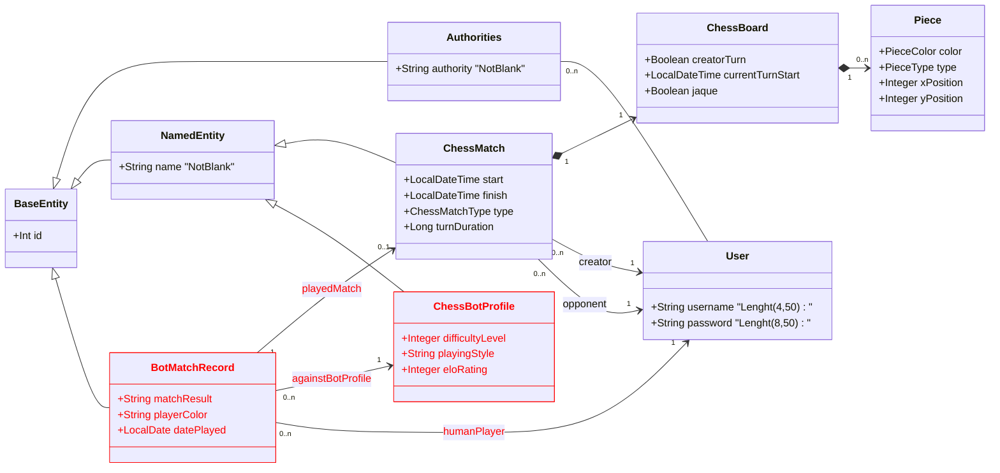

# Evaluación de Prompt

**Proveedor IA:** GEMINI
**Ejercicio:** TEST-ATTRIBUTES-CODE-GENERATION
**Dominio:** CHESS
**Fecha:** 12/6/2026, 2:36:04

## Índice
- [1. Contexto Oculto](#1-contexto-oculto)
- [2. Examen Seleccionado](#2-examen-seleccionado)
- [3. Prompt Visible](#3-prompt-visible)
- [4. Respuesta](#4-respuesta)

---

## 1. Contexto Oculto


=== PAQUETES DE LA PLANTILLA DEL PROYECTO ===
es.us.dp1.chess.tournament.user
es.us.dp1.chess.tournament.model
es.us.dp1.chess.tournament.exceptions

REGLA CRÍTICA DE IMPORTS:
- Usa EXACTAMENTE estos paquetes para las clases que NO son base.
- Paquete raíz: es.us.dp1.chess.tournament
- El paquete de ESTE test (Test1.java) debe ser: es.us.dp1.chess.tournament;

=== CÓDIGO FUENTE REAL ===
package es.us.dp1.chess.tournament.chessbotprofile;
import es.us.dp1.chess.tournament.model.NamedEntity;
@Getter
@Setter
@Table(name = "chess_bot_profiles")
public class ChessBotProfile extends NamedEntity {
    Integer difficultyLevel;
    String playingStyle;
    Integer eloRating;
}

// ---

package es.us.dp1.chess.tournament.chessbotprofile;
public interface ChessBotProfileRepository {
    Optional<ChessBotProfile> findById(Integer id);
    List<ChessBotProfile> findAll();
    ChessBotProfile save(ChessBotProfile chessBotProfile);
}

// ---

package es.us.dp1.chess.tournament.chessbotprofile;
public class ChessBotProfileService {
    ChessBotProfileRepository chessBotProfileRepository;
    public ChessBotProfileService(ChessBotProfileRepository chessBotProfileRepository) {
        this.chessBotProfileRepository = chessBotProfileRepository;
    }
    public List<ChessBotProfile> getAll() {
        return chessBotProfileRepository.findAll();
    }
    public ChessBotProfile save(ChessBotProfile chessBotProfile) {
        return chessBotProfileRepository.save(chessBotProfile);
    }
}

// ---

package es.us.dp1.chess.tournament.botmatchrecord;
import es.us.dp1.chess.tournament.match.ChessMatch;
import es.us.dp1.chess.tournament.model.BaseEntity;
import es.us.dp1.chess.tournament.user.User;
import es.us.dp1.chess.tournament.chessbotprofile.ChessBotProfile;
@Getter
@Setter
@Table(name = "bot_match_records")
public class BotMatchRecord extends BaseEntity {
    String matchResult;
    String playerColor;
    LocalDate datePlayed;
    @Transient
    ChessMatch playedMatch;
    @Transient
    ChessBotProfile againstBotProfile;
    @Transient
    User humanPlayer;
}

// ---

package es.us.dp1.chess.tournament.botmatchrecord;
public interface BotMatchRecordRepository {
    Optional<BotMatchRecord> findById(Integer id);
    List<BotMatchRecord> findAll();
    BotMatchRecord save(BotMatchRecord botMatchRecord);
}

// ---

package es.us.dp1.chess.tournament.botmatchrecord;
public class BotMatchRecordService {
    BotMatchRecordRepository botMatchRecordRepository;
    public BotMatchRecordService(BotMatchRecordRepository botMatchRecordRepository) {
        this.botMatchRecordRepository = botMatchRecordRepository;
    }
    public List<BotMatchRecord> getAll() {
        return botMatchRecordRepository.findAll();
    }
    public BotMatchRecord save(BotMatchRecord botMatchRecord) {
        return botMatchRecordRepository.save(botMatchRecord);
    }
}

=== ENUNCIADO ===
En este ejercicio, añadiremos la funcionalidad de gestión de perfiles de bots de ajedrez y el seguimiento de partidas jugadas contra ellos para una implementación del juego del ajedrez. Concretamente, se proporciona una clase “ChessMatch” que representa las partidas que se juegan, y que tiene asociada una instancia de la clase “ChessBoard” que representa el estado del tablero para dicha partida, por lo que tendrá asociada un conjunto de instancias de la clase “Piece”.

Además, tendremos la clase “ChessBotProfile”, que representa un perfil de oponente de inteligencia artificial con características específicas. Incluye atributos como el `difficultyLevel` (un nivel numérico que indica su dificultad), el `playingStyle` (una descripción de su estrategia, como "Agresivo" o "Posicional") y un `eloRating` estimado.

También tendremos la clase “BotMatchRecord”, que registra los detalles de una partida específica jugada por un usuario humano contra uno de estos perfiles de bot. Esta clase contiene el `matchResult` (el resultado de la partida, por ejemplo "Victoria", "Derrota" o "Empate"), el `playerColor` (el color de las piezas que jugó el jugador humano en esa partida) y la `datePlayed` (la fecha en que se jugó la partida). Un registro de partida contra un bot se asocia a una partida de ajedrez concreta (`playedMatch`), al perfil del bot contra el que se jugó (`againstBotProfile`) y al usuario humano que participó (`humanPlayer`).

Las clases para las que realizaremos el mapeo objeto-relacional como entidades JPA se han señalado en rojo. Realizaremos una serie de ejercicios basados en funcionalidades que implementaremos en el sistema, y validaremos mediante pruebas unitarias.



=== REGLAS A EVALUAR (RESTRICCIONES / RELACIONES) ===
Modificar las clases “ChessBotProfile” y “BotMatchRecord” para que sean entidades. Estas deben tener los siguientes atributos y restricciones:

**Para la clase ChessBotProfile:**

-   El atributo de tipo entero (Integer) llamado “id” actuará como clave primaria en la tabla de la base de datos relacional asociada a la entidad.
-   Un atributo de tipo cadena de caracteres (String) llamado “name” obligatorio (no puede ser nulo), que debe tener una longitud mínima de 3 caracteres y máxima de 50 y que no puede estar formada por caracteres vacíos (espacios, tabuladores, etc.).
-   El atributo de tipo entero (Integer) llamado “difficultyLevel”, que representa el nivel de dificultad del bot. Este atributo será obligatorio y tendrá un valor mínimo de 1 y un valor máximo de 10.
-   El atributo de tipo cadena de caracteres (String) llamado “playingStyle” obligatorio que únicamente podrá tomar los valores "AGGRESSIVE", "POSITIONAL", "TACTICAL", "STRATEGIC", "DEFENSIVE".
-   El atributo de tipo entero (Integer) llamado “eloRating”, que representa el ELO estimado del bot. Este atributo será obligatorio y tendrá un valor mínimo de 100 y un valor máximo de 3000.

**Para la clase BotMatchRecord:**

-   El atributo de tipo entero (Integer) llamado “id” actuará como clave primaria en la tabla de la base de datos relacional asociada a la entidad.
-   El atributo de tipo cadena de caracteres (String) llamado “matchResult” obligatorio que únicamente podrá tomar tres valores: “VICTORY”, “DEFEAT”, “DRAW”.
-   El atributo de tipo cadena de caracteres (String) llamado “playerColor” obligatorio que únicamente podrá tomar dos valores: “WHITE”, “BLACK”.
-   El atributo de tipo fecha (LocalDate) llamado “datePlayed”, que representa la fecha en que se jugó la partida. Seguirá el formato “dd/MM/yyyy”. Este atributo debe ser obligatorio.

No modifique por ahora las anotaciones @Transient de las clases. Modificar las interfaces “ChessBotProfileRepository” y “BotMatchRecordRepository” alojada en el mismo paquete para que extienda a CrudRepository. No olvide especificar sus parámetros de tipo.


---

## 2. Examen Seleccionado
En este ejercicio, añadiremos la funcionalidad de gestión de perfiles de bots de ajedrez y el seguimiento de partidas jugadas contra ellos para una implementación del juego del ajedrez. Concretamente, se proporciona una clase “ChessMatch” que representa las partidas que se juegan, y que tiene asociada una instancia de la clase “ChessBoard” que representa el estado del tablero para dicha partida, por lo que tendrá asociada un conjunto de instancias de la clase “Piece”.

Además, tendremos la clase “ChessBotProfile”, que representa un perfil de oponente de inteligencia artificial con características específicas. Incluye atributos como el `difficultyLevel` (un nivel numérico que indica su dificultad), el `playingStyle` (una descripción de su estrategia, como "Agresivo" o "Posicional") y un `eloRating` estimado.

También tendremos la clase “BotMatchRecord”, que registra los detalles de una partida específica jugada por un usuario humano contra uno de estos perfiles de bot. Esta clase contiene el `matchResult` (el resultado de la partida, por ejemplo "Victoria", "Derrota" o "Empate"), el `playerColor` (el color de las piezas que jugó el jugador humano en esa partida) y la `datePlayed` (la fecha en que se jugó la partida). Un registro de partida contra un bot se asocia a una partida de ajedrez concreta (`playedMatch`), al perfil del bot contra el que se jugó (`againstBotProfile`) y al usuario humano que participó (`humanPlayer`).

Las clases para las que realizaremos el mapeo objeto-relacional como entidades JPA se han señalado en rojo. Realizaremos una serie de ejercicios basados en funcionalidades que implementaremos en el sistema, y validaremos mediante pruebas unitarias.


---

## 3. Prompt Visible
Nuestra misión es generar el test de un examen de la asignatura "Diseño y Pruebas". Actuamos como profesores evaluando conocimientos de JPA y mapeo objeto-relacional. Te proporcionaré el enunciado, el diagrama UML en Mermaid y, **CRÍTICAMENTE, el Código Base de las clases ya generadas**.

Por favor, no uses Wildcard Imports (asteriscos). Genera todos los imports de forma explícita, uno por cada clase utilizada. IMPORTANTE CENTRARSE EN LAS CLASES QUE SE PROPORCIONA COMO CÓDIGO BASE, DE SU LOCALIZACIÓN PARA PODER PONER CORRECTAMENTE LOS IMPORTS DE DONDE SE SACAN LAS CLASES.

---

## REGLA ABSOLUTA — PAQUETES: LEE EL CÓDIGO BASE, EVITA INVENTAR

Esta es la regla más importante del prompt. Debes seguirla antes que cualquier otra cosa.
Además, para las clases que no estén implementadas en el código base, buscarla en el repositorio pasado, como Pet, viene de pet.Pet

**Procedimiento obligatorio antes de escribir un solo import:**

1. Localiza la sección `=== PAQUETES DE LA PLANTILLA DEL PROYECTO ===` del contexto. En ella se te especificará la estructura de los paquetes a importar.
2. Para cada clase que necesites importar, busca su `package` en el código base proporcionado.
3. Construye el import como: `import <package_de_esa_clase>.<NombreClase>;`

- Deberás tener cuidado y poner los nombres de las clases nueva generadas, ya que no siempre es Achievement; deberás coger las clases del contexto que se te proporciona de la extensión funcional.

**Ejemplo concreto:**

- Si el código base de `Achievement.java` empieza con `package es.us.dp1.chess.tournament.achievement;`
- El import correcto en el test es: `import es.us.dp1.chess.tournament.achievement.Achievement;`
- Teniendo en cuenta las mayúsculas y minúsculas de las clases para evitar el error en los tests
- NUNCA: `import org.springframework.samples.chessgame.model.Achievement;`
- NUNCA: `import org.springframework.samples.petClinic.model.Achievement;`

**Aplica lo mismo para `@ComponentScan`:**
Al definir los paquetes, SIEMPRE poner los paquetes individuales necesarios, evitar globalizar en uno todo:

- CORRECTO: `@ComponentScan(basePackages = {"es.us.dp1.chess.tournament.achievement", "es.us.dp1.chess.tournament.userAchievement"})`
- INCORRECTO: `@ComponentScan(basePackages = {"org.springframework.samples.chessgame.repository", "org.springframework.samples.chessgame.model"})`
- INCORRECTO: `@ComponentScan(basePackages = {"es.us.dp1.chess.tournament"})`

**El paquete del propio test (`package ...` en la primera línea) también debe derivarse del código base**, usando el prefijo de donde se crean los test. Ejemplo: si el prefijo raíz es `es.us.dp1.chess.tournament`, el paquete del test será `es.us.dp1.chess.tournament`.

Si una clase (como `ReflexiveTest`, `NamedEntity`, etc.) no aparece en el código base proporcionado, usa el mismo prefijo raíz detectado para inferir su paquete. Nunca uses `org.springframework.samples.*` salvo que ese prefijo aparezca explícitamente en el código base.

Para las diferentes comprobaciones, vamos a llamar a los métodos que nos proporciona la clase ReflexiveTest que te paso dentro del archivo `test_previous_exams`. **IMPORTANTE:** tienes que llamar con el MISMO NOMBRE a los métodos que utilices, además de pasarle los MISMOS tipos de argumentos que pide cada método. A continuación, te proporciono una lista con todos los métodos disponibles y sus correspondientes argumentos necesarios. Los analizarás todos para usarlos correctamente en el test:

```java
void checkThatFieldIsAnnotatedWithDateTimeFormat(Class aClass, String fieldname,String format)

void checkThatFieldIsAnnotatedWith(Class aClass, String fieldname,Class annotationClass)

boolean  isFieldAnnotatedWith(Class aClass, String fieldname,Class annotationClass) throws NoSuchFieldException, SecurityException

boolean classIsAnnotatedWith(Class class1, Class class2)

boolean classHasMethod(Object targetObject, String methodName, Class<?> ... parameterTypes)

void checkThatFieldsAreMandatory(Object validEntity,EntityManager em,String ... fieldnames )

void checkThatFieldIsMandatory(Object validEntity,String fieldname,Class<?> type,EntityManager em)

void checkThatValuesAreNotValid(Object validEntity,Map<String,List<Object>> invalidValues,EntityManager em)

void checkThatValueIsNotValid(Object validEntity,String fieldname,Object value,Class<?> type, EntityManager em)

Object setValue(Object object,String fieldname,Class<?> type, Object value)

Object invokeMethodReflexivelyWithParamTypes(Object targetObject, String methodName, Class<?>[] parameterTypes,Object ... parameterValues)

Object invokeMethodReflexively(Object o, String methodName, Object ... params)

void checkLinkedById(Class myClass,Integer id1,String methodName,Integer id2,EntityManager em)

Object getFieldValueReflexively(Object o, String fieldName)

void checkTransactional(Class<?> myClass,String methodName, Class<?>... parameterTypes)

boolean isMethodAnnotatedWithTest(Method method)

boolean isMethodAnnotatedWithBeforeEach(Method method)

boolean isMethodAnnotatedWithAfterEach(Method method)

void checkTransactionalRollback(Class<?> myClass,String methodName,Class<?>[] paramTypes,Class<? extends Exception> exceptionClass)

boolean isEntity(Class<T> clazz)
```

---

## Reglas de Coherencia Adicionales

2.  **Fidelidad al Código Base:** Si una clase en el código base tiene un atributo con un nombre específico (ej. `checkInDate`), el test debe usar ese nombre exacto, ignorando lo que diga cualquier otro ejemplo externo.
3.  **Manejo de Relaciones:** Si en el Código Base una relación está marcada como `@Transient`, el test debe tratarla según las instrucciones del enunciado, pero siempre importando la clase desde su paquete real.

---

## Especificaciones del Examen

- **Clases Negras:** Núcleo estable (Contexto). No se testea su implementación interna, pero se usan para crear objetos válidos (ej. `Owner`, `Pet`).
- **Clases Rojas:** Tarea principal del alumno. Son las que debemos testear exhaustivamente (Restricciones, Anotaciones y Persistencia).
- **Límite:** Máximo 2 entidades rojas por examen.
- **Framework:** Java 17+, JUnit 5, Spring Boot (@DataJpaTest).
- **Herencia:** La clase de test DEBE extender de `ReflexiveTest` (IMPORTANTE: DEBE USARSE SI O SI ESTA CLASE PARA LA GENERACIÓN DE LOS TESTS, DEBE PONER ReflexiveTest en la parte de `extends...`)

---

## Estructura Estricta Requerida para Test1.java

### 1. Configuración e Inyección

- El nombre ESTRICTO del paquete donde se tiene que generar el test es:
  - Clínica Veterinaria: `package org.springframework.samples.petclinic`
  - Ajedrez: `package es.us.dp1.chess.tournament`
- Inyecta los Repositorios de las entidades rojas y el `EntityManager` mediante `@Autowired` (NUNCA `TestEntityManager`).
- Inyecta SIEMPRE como `@MockBean` el servicio `UserService`:

```java
    @MockBean
    private UserService userService;
```

- Usa `@ComponentScan` apuntando a los paquetes reales detectados en el Código Base (ver Regla Absoluta).
- **IMPORTANTE** los imports de las anotaciones a comprobar deberán venir de jakarta, NUNCA DE javax:
  - CORRECTO: jakarta.persistence.Column;
  - INCORRECTO: javax.persistence.Column;
- **IMPORTANTE**: Omitir crear tests estáticos, para poder usar el método `super`.

### 2. Verificación de Repositorios

Los tests que validan los repositorios, cuando extienden a CRUD Repository no es necesario validar todos los métodos que se proporcionan inicialmente en las clases base, ya que la anotación CRUD los contiene, por lo que la estructura del test sería:

```java
@Test
    void test1RepositoriesExist() {
        assertNotNull(ratingRepository, "RatingRepository should be autowired");
        assertNotNull(ratingChangeRepository, "RatingChangeRepository should be autowired");
        test1RepositoriesContainsMethod();
    }

    void test1RepositoriesContainsMethod() {
        assertTrue(
            CrudRepository.class.isAssignableFrom(RatingRepository.class),
            "RatingRepository should extend CrudRepository"
        );
        assertTrue(
            CrudRepository.class.isAssignableFrom(RatingChangeRepository.class),
            "RatingChangeRepository should extend CrudRepository"
        );
    }

```

- **test1RepositoriesExist():** Verifica `assertNotNull`. Al final, debe llamar a `test1RepositoriesContainsMethod()` solo si el repo no es nulo.
- **test1RepositoriesContainsMethod():** (SIN @Test) Verifica que el repo tiene el método `.count()` o similar mediante reflexión/interfaz.

### 3. Validación de Restricciones (Constraints)

- **test1Check[NOMBRE_ENTIDAD]Constraints():**
  - Invoca `checkThatFieldsAreMandatory` con los campos `NotNull/NotBlank` identificados.
  - Crea el mapa `invalidValues` usando `Map.of(...)`. **PROHIBIDO usar `new HashMap()`**.
  - Los valores de prueba deben ser coherentes con el tipo de dato del Código Base (si es `Double`, usa `0.0`; si es `Integer`, `0`).
  - Invoca `checkThatValuesAreNotValid`.
  - En atributos que sean de tipo Double, NUNCA PONER `columnDefinition = "double(5,2)"` ya que dará error. La forma correcta es por ejemplo: `@Column(name = "cost")`

### 4. Verificación de Anotaciones

- **test1Check[NOMBRE_ENTIDAD]Annotations():**
  - Verifica `@Entity` con `classIsAnnotatedWith`.
  - Verifica `@Enumerated(EnumType.STRING)` si hay Enums.
  - Verifica `@Size`, `@Positive`, `@FutureOrPresent`, etc., según el UML.

### 5. Métodos Auxiliares y Persistencia

- **createValid[NOMBRE_ENTIDAD](EntityManager em):** Método estático que construye una instancia válida.
- **IMPORTANTE:** Usa EXCLUSIVAMENTE `setValue(objeto, "atributo", Tipo.class, valor)` para asignar datos, evitando fallos si no existen setters.
- **test1Valid[NOMBRE_ENTIDAD]IsPersisted():** Verifica que `repo.save()` no lanza excepciones (`assertDoesNotThrow`) y haz `.flush()`.
- Todos los métodos auxiliares que sean necesarios deberán crearse en la misma clase, el test DEBE ser autosuficiente.
- Al crear alguna entidad válida en un método auxiliar, SIEMPRE crear primero los objetos padre, es decir, si un Pet tiene un Owner, primero se deberá crear el Owner y después el Pet. Esto evitará errores de persistencia.

---

## Restricciones de Salida (Formato)

- **PROHIBIDO** generar comentarios explicativos.
- **PROHIBIDO** envolver el código en bloques de código markdown (sin \`\`\`java).
- **PROHIBIDO** incluir texto antes o después del código.
- Entrega el código listo para ser copiado y pegado en un archivo `.java`.

---

## 4. Respuesta
package es.us.dp1.chess.tournament;

import es.us.dp1.chess.tournament.chessbotprofile.ChessBotProfile;
import es.us.dp1.chess.tournament.chessbotprofile.ChessBotProfileRepository;
import es.us.dp1.chess.tournament.botmatchrecord.BotMatchRecord;
import es.us.dp1.chess.tournament.botmatchrecord.BotMatchRecordRepository;
import es.us.dp1.chess.tournament.model.NamedEntity;
import es.us.dp1.chess.tournament.model.BaseEntity;
import es.us.dp1.chess.tournament.match.ChessMatch;
import es.us.dp1.chess.tournament.user.User;
import es.us.dp1.chess.tournament.user.UserService;

import org.junit.jupiter.api.BeforeEach;
import org.junit.jupiter.api.Test;
import org.springframework.beans.factory.annotation.Autowired;
import org.springframework.boot.test.autoconfigure.orm.jpa.DataJpaTest;
import org.springframework.boot.test.mock.mockito.MockBean;
import org.springframework.context.annotation.ComponentScan;
import org.springframework.data.repository.CrudRepository;
import org.springframework.format.annotation.DateTimeFormat;

import jakarta.persistence.EntityManager;
import jakarta.persistence.Entity;
import jakarta.persistence.Table;
import jakarta.validation.constraints.NotBlank;
import jakarta.validation.constraints.NotNull;
import jakarta.validation.constraints.Size;
import jakarta.validation.constraints.Min;
import jakarta.validation.constraints.Max;
import jakarta.validation.constraints.Pattern;

import java.time.LocalDate;
import java.time.LocalDateTime;
import java.util.List;
import java.util.Map;
import java.util.Optional;

import static org.junit.jupiter.api.Assertions.assertNotNull;
import static org.junit.jupiter.api.Assertions.assertTrue;
import static org.junit.jupiter.api.Assertions.assertDoesNotThrow;

public class Test1 extends ReflexiveTest {

    @Autowired
    ChessBotProfileRepository chessBotProfileRepository;

    @Autowired
    BotMatchRecordRepository botMatchRecordRepository;

    @Autowired
    EntityManager em;

    @MockBean
    private UserService userService;

    enum ChessMatchType {
        STANDARD, BLITZ, RAPID
    }

    private ChessMatch createDummyChessMatch() {
        ChessMatch match = new ChessMatch();
        setValue(match, "name", String.class, "Dummy Match");
        setValue(match, "start", LocalDateTime.class, LocalDateTime.now());
        setValue(match, "finish", LocalDateTime.class, LocalDateTime.now().plusHours(1));
        setValue(match, "type", ChessMatchType.class, ChessMatchType.STANDARD);
        setValue(match, "turnDuration", Long.class, 300L);
        return match;
    }

    private User createDummyUser() {
        User user = new User();
        setValue(user, "id", Integer.class, 1);
        setValue(user, "username", String.class, "testuser");
        setValue(user, "password", String.class, "password123");
        return user;
    }

    @Test
    void test1RepositoriesExist() {
        assertNotNull(chessBotProfileRepository, "ChessBotProfileRepository should be autowired");
        assertNotNull(botMatchRecordRepository, "BotMatchRecordRepository should be autowired");
        test1RepositoriesContainsMethod();
    }

    void test1RepositoriesContainsMethod() {
        assertTrue(
            CrudRepository.class.isAssignableFrom(ChessBotProfileRepository.class),
            "ChessBotProfileRepository should extend CrudRepository"
        );
        assertTrue(
            CrudRepository.class.isAssignableFrom(BotMatchRecordRepository.class),
            "BotMatchRecordRepository should extend CrudRepository"
        );
        assertTrue(classHasMethod(chessBotProfileRepository, "count"), "ChessBotProfileRepository should have count() method from CrudRepository");
        assertTrue(classHasMethod(botMatchRecordRepository, "count"), "BotMatchRecordRepository should have count() method from CrudRepository");
    }

    @Test
    void test1CheckChessBotProfileConstraints() {
        ChessBotProfile validProfile = createValidChessBotProfile(em);

        checkThatFieldsAreMandatory(validProfile, em, "name", "difficultyLevel", "playingStyle", "eloRating");

        Map<String, List<Object>> invalidValues = Map.of(
            "name", List.of("", "ab", "a".repeat(51)),
            "difficultyLevel", List.of(0, 11),
            "playingStyle", List.of("", "INVALID_STYLE", "aggressive"),
            "eloRating", List.of(99, 3001)
        );
        checkThatValuesAreNotValid(validProfile, invalidValues, em);
    }

    @Test
    void test1CheckBotMatchRecordConstraints() {
        BotMatchRecord validRecord = createValidBotMatchRecord(em);

        checkThatFieldsAreMandatory(validRecord, em, "matchResult", "playerColor", "datePlayed");

        Map<String, List<Object>> invalidValues = Map.of(
            "matchResult", List.of("", "INVALID_RESULT", "victory"),
            "playerColor", List.of("", "INVALID_COLOR", "white")
        );
        checkThatValuesAreNotValid(validRecord, invalidValues, em);
    }

    @Test
    void test1CheckChessBotProfileAnnotations() {
        assertTrue(isEntity(ChessBotProfile.class), "ChessBotProfile should be an Entity");
        assertTrue(classIsAnnotatedWith(ChessBotProfile.class, Table.class), "ChessBotProfile should be annotated with @Table");
        checkThatFieldIsAnnotatedWith(ChessBotProfile.class, "name", NotBlank.class);
        checkThatFieldIsAnnotatedWith(ChessBotProfile.class, "name", Size.class);
        checkThatFieldIsAnnotatedWith(ChessBotProfile.class, "difficultyLevel", NotNull.class);
        checkThatFieldIsAnnotatedWith(ChessBotProfile.class, "difficultyLevel", Min.class);
        checkThatFieldIsAnnotatedWith(ChessBotProfile.class, "difficultyLevel", Max.class);
        checkThatFieldIsAnnotatedWith(ChessBotProfile.class, "playingStyle", NotNull.class);
        checkThatFieldIsAnnotatedWith(ChessBotProfile.class, "playingStyle", Pattern.class);
        checkThatFieldIsAnnotatedWith(ChessBotProfile.class, "eloRating", NotNull.class);
        checkThatFieldIsAnnotatedWith(ChessBotProfile.class, "eloRating", Min.class);
        checkThatFieldIsAnnotatedWith(ChessBotProfile.class, "eloRating", Max.class);
    }

    @Test
    void test1CheckBotMatchRecordAnnotations() {
        assertTrue(isEntity(BotMatchRecord.class), "BotMatchRecord should be an Entity");
        assertTrue(classIsAnnotatedWith(BotMatchRecord.class, Table.class), "BotMatchRecord should be annotated with @Table");
        checkThatFieldIsAnnotatedWith(BotMatchRecord.class, "matchResult", NotNull.class);
        checkThatFieldIsAnnotatedWith(BotMatchRecord.class, "matchResult", Pattern.class);
        checkThatFieldIsAnnotatedWith(BotMatchRecord.class, "playerColor", NotNull.class);
        checkThatFieldIsAnnotatedWith(BotMatchRecord.class, "playerColor", Pattern.class);
        checkThatFieldIsAnnotatedWith(BotMatchRecord.class, "datePlayed", NotNull.class);
        checkThatFieldIsAnnotatedWithDateTimeFormat(BotMatchRecord.class, "datePlayed", "dd/MM/yyyy");
    }

    @Test
    void test1ValidChessBotProfileIsPersisted() {
        ChessBotProfile chessBotProfile = createValidChessBotProfile(em);
        assertDoesNotThrow(() -> {
            chessBotProfileRepository.save(chessBotProfile);
            em.flush();
        }, "Saving a valid ChessBotProfile should not throw an exception");
        assertNotNull(chessBotProfile.getId(), "Persisted ChessBotProfile should have an ID");
    }

    @Test
    void test1ValidBotMatchRecordIsPersisted() {
        BotMatchRecord botMatchRecord = createValidBotMatchRecord(em);
        assertDoesNotThrow(() -> {
            botMatchRecordRepository.save(botMatchRecord);
            em.flush();
        }, "Saving a valid BotMatchRecord should not throw an exception");
        assertNotNull(botMatchRecord.getId(), "Persisted BotMatchRecord should have an ID");
    }

    private ChessBotProfile createValidChessBotProfile(EntityManager em) {
        ChessBotProfile profile = new ChessBotProfile();
        setValue(profile, "name", String.class, "AggroBot");
        setValue(profile, "difficultyLevel", Integer.class, 5);
        setValue(profile, "playingStyle", String.class, "AGGRESSIVE");
        setValue(profile, "eloRating", Integer.class, 1500);
        return profile;
    }

    private BotMatchRecord createValidBotMatchRecord(EntityManager em) {
        BotMatchRecord record = new BotMatchRecord();
        setValue(record, "matchResult", String.class, "VICTORY");
        setValue(record, "playerColor", String.class, "WHITE");
        setValue(record, "datePlayed", LocalDate.class, LocalDate.of(2023, 1, 15));

        setValue(record, "playedMatch", ChessMatch.class, createDummyChessMatch());
        setValue(record, "againstBotProfile", ChessBotProfile.class, createValidChessBotProfile(em));
        setValue(record, "humanPlayer", User.class, createDummyUser());

        return record;
    }
}