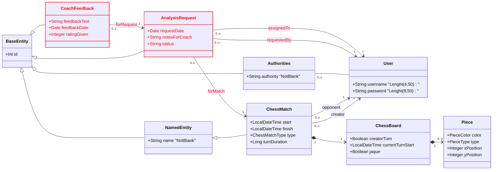

# Evaluación de Prompt

**Proveedor IA:** GEMINI
**Ejercicio:** TEST-ATTRIBUTES-CODE-GENERATION
**Dominio:** CHESS
**Fecha:** 12/6/2026, 3:11:14

## Índice
- [1. Contexto Oculto](#1-contexto-oculto)
- [2. Examen Seleccionado](#2-examen-seleccionado)
- [3. Prompt Visible](#3-prompt-visible)
- [4. Respuesta](#4-respuesta)

---

## 1. Contexto Oculto


=== PAQUETES DE LA PLANTILLA DEL PROYECTO ===
es.us.dp1.chess.tournament.user
es.us.dp1.chess.tournament.model
es.us.dp1.chess.tournament.exceptions

REGLA CRÍTICA DE IMPORTS:
- Usa EXACTAMENTE estos paquetes para las clases que NO son base.
- Paquete raíz: es.us.dp1.chess.tournament
- El paquete de ESTE test (Test1.java) debe ser: es.us.dp1.chess.tournament;

=== CÓDIGO FUENTE REAL ===
package es.us.dp1.chess.tournament.analysisrequest;
import es.us.dp1.chess.tournament.match.ChessMatch;
import es.us.dp1.chess.tournament.user.User;
@Getter
@Setter
@Table(name = "analysis_requests")
public class AnalysisRequest {
    Date requestDate;
    String notesForCoach;
    String status;
    @Transient
    ChessMatch forMatch;
    @Transient
    User requestedBy;
    @Transient
    User assignedTo;
}

// ---

package es.us.dp1.chess.tournament.analysisrequest;
public interface AnalysisRequestRepository {
    Optional<AnalysisRequest> findById(Integer id);
    List<AnalysisRequest> findAll();
    AnalysisRequest save(AnalysisRequest analysisRequest);
}

// ---

package es.us.dp1.chess.tournament.analysisrequest;
public class AnalysisRequestService {
    AnalysisRequestRepository analysisRequestRepository;
    public AnalysisRequestService(AnalysisRequestRepository analysisRequestRepository) {
        this.analysisRequestRepository = analysisRequestRepository;
    }
}

// ---

package es.us.dp1.chess.tournament.coachfeedback;
import es.us.dp1.chess.tournament.analysisrequest.AnalysisRequest;
@Getter
@Setter
@Table(name = "coach_feedbacks")
public class CoachFeedback {
    String feedbackText;
    Date feedbackDate;
    Integer ratingGiven;
    @Transient
    AnalysisRequest forRequest;
}

// ---

package es.us.dp1.chess.tournament.coachfeedback;
public interface CoachFeedbackRepository {
    Optional<CoachFeedback> findById(Integer id);
    List<CoachFeedback> findAll();
    CoachFeedback save(CoachFeedback coachFeedback);
}

// ---

package es.us.dp1.chess.tournament.coachfeedback;
public class CoachFeedbackService {
    CoachFeedbackRepository coachFeedbackRepository;
    public CoachFeedbackService(CoachFeedbackRepository coachFeedbackRepository) {
        this.coachFeedbackRepository = coachFeedbackRepository;
    }
}

=== ENUNCIADO ===
En este ejercicio, añadiremos la funcionalidad de gestión de solicitudes de análisis de partidas y la retroalimentación de coaches para una implementación del juego del ajedrez. Concretamente, se proporciona una clase “ChessMatch” que representa las partidas que se juegan, y que tiene asociada una instancia de la clase “ChessBoard” que representa el estado del tablero para dicha partida, por lo que tendrá asociada un conjunto de instancias de la clase “Piece”.

Además, tendremos la clase “AnalysisRequest”, que representa la solicitud de un usuario para que otro usuario (actuando como coach) analice una partida específica. Incluye atributos como la `requestDate` (fecha en que se realizó la solicitud), `notesForCoach` (comentarios específicos para el coach) y `status` (el estado actual de la solicitud, por ejemplo, "Pendiente" o "Completada"). Esta clase se relaciona con la partida de ajedrez a analizar y con los usuarios involucrados como solicitante y coach.

También tendremos la clase “CoachFeedback”, que registra el análisis y la retroalimentación detallada proporcionada por un coach. Esta clase contiene el `feedbackText` (el texto del análisis), `feedbackDate` (la fecha en que se envió la retroalimentación) y `ratingGiven` (una calificación opcional sobre la partida analizada). Este feedback se asocia a una solicitud de análisis concreta.

Las clases para las que realizaremos el mapeo objeto-relacional como entidades JPA se han señalado en rojo. Realizaremos una serie de ejercicios basados en funcionalidades que implementaremos en el sistema, y validaremos mediante pruebas unitarias.



=== REGLAS A EVALUAR (RESTRICCIONES / RELACIONES) ===
Modificar las clases “AnalysisRequest” y “CoachFeedback” para que sean entidades. Estas deben tener los siguientes atributos y restricciones:

**Para la clase AnalysisRequest:**

- El atributo de tipo entero (Integer) llamado “id” actuará como clave primaria en la tabla de la base de datos relacional asociada a la entidad.
- El atributo de tipo fecha (LocalDate) llamado “requestDate” será obligatorio, representando la fecha en que se realizó la solicitud. Seguirá el formato “dd/MM/yyyy” y no podrá ser una fecha futura.
- Un atributo de tipo cadena de caracteres (String) llamado “notesForCoach” es opcional, utilizado para añadir comentarios específicos para el coach. Si se proporciona, tendrá una longitud máxima de 500 caracteres.
- El atributo de tipo cadena de caracteres (String) llamado “status” será obligatorio (no puede ser nulo), que representa el estado actual de la solicitud. Este atributo debe tener una longitud mínima de 5 caracteres y máxima de 20, y no puede estar formada por caracteres vacíos (espacios, tabuladores, etc.). Además, únicamente podrá tomar los valores "PENDING", "COMPLETED", "IN_PROGRESS" o "REJECTED".

**Para la clase CoachFeedback:**

- El atributo de tipo entero (Integer) llamado “id” actuará como clave primaria en la tabla de la base de datos relacional asociada a la entidad.
- Un atributo de tipo cadena de caracteres (String) llamado “feedbackText” será obligatorio (no puede ser nulo), que contiene el análisis detallado y la retroalimentación del coach. Debe tener una longitud mínima de 10 caracteres y máxima de 2000, y no puede estar formada por caracteres vacíos (espacios, tabuladores, etc.).
- El atributo de tipo fecha (LocalDate) llamado “feedbackDate” será obligatorio, representando la fecha en que se proporcionó la retroalimentación. Seguirá el formato “dd/MM/yyyy” y no podrá ser una fecha futura.
- El atributo de tipo entero (Integer) llamado “ratingGiven” es opcional, representa una calificación numérica de la partida analizada. Si se proporciona, este valor debe estar en el rango de 1 a 5, ambos inclusive.

No modifique por ahora las anotaciones @Transient de las clases. Modificar las interfaces “AnalysisRequestRepository” y “CoachFeedbackRepository” alojadas en el mismo paquete para que extiendan a CrudRepository. No olvide especificar sus parámetros de tipo.


---

## 2. Examen Seleccionado
En este ejercicio, añadiremos la funcionalidad de gestión de solicitudes de análisis de partidas y la retroalimentación de coaches para una implementación del juego del ajedrez. Concretamente, se proporciona una clase “ChessMatch” que representa las partidas que se juegan, y que tiene asociada una instancia de la clase “ChessBoard” que representa el estado del tablero para dicha partida, por lo que tendrá asociada un conjunto de instancias de la clase “Piece”.

Además, tendremos la clase “AnalysisRequest”, que representa la solicitud de un usuario para que otro usuario (actuando como coach) analice una partida específica. Incluye atributos como la `requestDate` (fecha en que se realizó la solicitud), `notesForCoach` (comentarios específicos para el coach) y `status` (el estado actual de la solicitud, por ejemplo, "Pendiente" o "Completada"). Esta clase se relaciona con la partida de ajedrez a analizar y con los usuarios involucrados como solicitante y coach.

También tendremos la clase “CoachFeedback”, que registra el análisis y la retroalimentación detallada proporcionada por un coach. Esta clase contiene el `feedbackText` (el texto del análisis), `feedbackDate` (la fecha en que se envió la retroalimentación) y `ratingGiven` (una calificación opcional sobre la partida analizada). Este feedback se asocia a una solicitud de análisis concreta.

Las clases para las que realizaremos el mapeo objeto-relacional como entidades JPA se han señalado en rojo. Realizaremos una serie de ejercicios basados en funcionalidades que implementaremos en el sistema, y validaremos mediante pruebas unitarias.


---

## 3. Prompt Visible
Nuestra misión es generar el test de un examen de la asignatura "Diseño y Pruebas". Actuamos como profesores evaluando conocimientos de JPA y mapeo objeto-relacional. Te proporcionaré el enunciado, el diagrama UML en Mermaid y, **CRÍTICAMENTE, el Código Base de las clases ya generadas**.

Por favor, no uses Wildcard Imports (asteriscos). Genera todos los imports de forma explícita, uno por cada clase utilizada. IMPORTANTE CENTRARSE EN LAS CLASES QUE SE PROPORCIONA COMO CÓDIGO BASE, DE SU LOCALIZACIÓN PARA PODER PONER CORRECTAMENTE LOS IMPORTS DE DONDE SE SACAN LAS CLASES.

---

## REGLA ABSOLUTA — PAQUETES: LEE EL CÓDIGO BASE, EVITA INVENTAR

Esta es la regla más importante del prompt. Debes seguirla antes que cualquier otra cosa.
Además, para las clases que no estén implementadas en el código base, buscarla en el repositorio pasado, como Pet, viene de pet.Pet

**Procedimiento obligatorio antes de escribir un solo import:**

1. Localiza la sección `=== PAQUETES DE LA PLANTILLA DEL PROYECTO ===` del contexto. En ella se te especificará la estructura de los paquetes a importar.
2. Para cada clase que necesites importar, busca su `package` en el código base proporcionado.
3. Construye el import como: `import <package_de_esa_clase>.<NombreClase>;`

- Deberás tener cuidado y poner los nombres de las clases nueva generadas, ya que no siempre es Achievement; deberás coger las clases del contexto que se te proporciona de la extensión funcional.

**Ejemplo concreto:**

- Si el código base de `Achievement.java` empieza con `package es.us.dp1.chess.tournament.achievement;`
- El import correcto en el test es: `import es.us.dp1.chess.tournament.achievement.Achievement;`
- Teniendo en cuenta las mayúsculas y minúsculas de las clases para evitar el error en los tests
- NUNCA: `import org.springframework.samples.chessgame.model.Achievement;`
- NUNCA: `import org.springframework.samples.petClinic.model.Achievement;`

**Aplica lo mismo para `@ComponentScan`:**
Al definir los paquetes, SIEMPRE poner los paquetes individuales necesarios, evitar globalizar en uno todo:

- CORRECTO: `@ComponentScan(basePackages = {"es.us.dp1.chess.tournament.achievement", "es.us.dp1.chess.tournament.userAchievement"})`
- INCORRECTO: `@ComponentScan(basePackages = {"org.springframework.samples.chessgame.repository", "org.springframework.samples.chessgame.model"})`
- INCORRECTO: `@ComponentScan(basePackages = {"es.us.dp1.chess.tournament"})`

**El paquete del propio test (`package ...` en la primera línea) también debe derivarse del código base**, usando el prefijo de donde se crean los test. Ejemplo: si el prefijo raíz es `es.us.dp1.chess.tournament`, el paquete del test será `es.us.dp1.chess.tournament`.

Si una clase (como `ReflexiveTest`, `NamedEntity`, etc.) no aparece en el código base proporcionado, usa el mismo prefijo raíz detectado para inferir su paquete. Nunca uses `org.springframework.samples.*` salvo que ese prefijo aparezca explícitamente en el código base.

Para las diferentes comprobaciones, vamos a llamar a los métodos que nos proporciona la clase ReflexiveTest que te paso dentro del archivo `test_previous_exams`. **IMPORTANTE:** tienes que llamar con el MISMO NOMBRE a los métodos que utilices, además de pasarle los MISMOS tipos de argumentos que pide cada método. A continuación, te proporciono una lista con todos los métodos disponibles y sus correspondientes argumentos necesarios. Los analizarás todos para usarlos correctamente en el test:

```java
void checkThatFieldIsAnnotatedWithDateTimeFormat(Class aClass, String fieldname,String format)

void checkThatFieldIsAnnotatedWith(Class aClass, String fieldname,Class annotationClass)

boolean  isFieldAnnotatedWith(Class aClass, String fieldname,Class annotationClass) throws NoSuchFieldException, SecurityException

boolean classIsAnnotatedWith(Class class1, Class class2)

boolean classHasMethod(Object targetObject, String methodName, Class<?> ... parameterTypes)

void checkThatFieldsAreMandatory(Object validEntity,EntityManager em,String ... fieldnames )

void checkThatFieldIsMandatory(Object validEntity,String fieldname,Class<?> type,EntityManager em)

void checkThatValuesAreNotValid(Object validEntity,Map<String,List<Object>> invalidValues,EntityManager em)

void checkThatValueIsNotValid(Object validEntity,String fieldname,Object value,Class<?> type, EntityManager em)

Object setValue(Object object,String fieldname,Class<?> type, Object value)

Object invokeMethodReflexivelyWithParamTypes(Object targetObject, String methodName, Class<?>[] parameterTypes,Object ... parameterValues)

Object invokeMethodReflexively(Object o, String methodName, Object ... params)

void checkLinkedById(Class myClass,Integer id1,String methodName,Integer id2,EntityManager em)

Object getFieldValueReflexively(Object o, String fieldName)

void checkTransactional(Class<?> myClass,String methodName, Class<?>... parameterTypes)

boolean isMethodAnnotatedWithTest(Method method)

boolean isMethodAnnotatedWithBeforeEach(Method method)

boolean isMethodAnnotatedWithAfterEach(Method method)

void checkTransactionalRollback(Class<?> myClass,String methodName,Class<?>[] paramTypes,Class<? extends Exception> exceptionClass)

boolean isEntity(Class<T> clazz)
```

---

## Reglas de Coherencia Adicionales

2.  **Fidelidad al Código Base:** Si una clase en el código base tiene un atributo con un nombre específico (ej. `checkInDate`), el test debe usar ese nombre exacto, ignorando lo que diga cualquier otro ejemplo externo.
3.  **Manejo de Relaciones:** Si en el Código Base una relación está marcada como `@Transient`, el test debe tratarla según las instrucciones del enunciado, pero siempre importando la clase desde su paquete real.

---

## Especificaciones del Examen

- **Clases Negras:** Núcleo estable (Contexto). No se testea su implementación interna, pero se usan para crear objetos válidos (ej. `Owner`, `Pet`).
- **Clases Rojas:** Tarea principal del alumno. Son las que debemos testear exhaustivamente (Restricciones, Anotaciones y Persistencia).
- **Límite:** Máximo 2 entidades rojas por examen.
- **Framework:** Java 17+, JUnit 5, Spring Boot (@DataJpaTest).
- **Herencia:** La clase de test DEBE extender de `ReflexiveTest` (IMPORTANTE: DEBE USARSE SI O SI ESTA CLASE PARA LA GENERACIÓN DE LOS TESTS, DEBE PONER ReflexiveTest en la parte de `extends...`)

---

## Estructura Estricta Requerida para Test1.java

### 1. Configuración e Inyección

- El nombre ESTRICTO del paquete donde se tiene que generar el test es:
  - Clínica Veterinaria: `package org.springframework.samples.petclinic`
  - Ajedrez: `package es.us.dp1.chess.tournament`
- Inyecta los Repositorios de las entidades rojas y el `EntityManager` mediante `@Autowired` (NUNCA `TestEntityManager`).
- Inyecta SIEMPRE como `@MockBean` el servicio `UserService`:

```java
    @MockBean
    private UserService userService;
```

- Usa `@ComponentScan` apuntando a los paquetes reales detectados en el Código Base (ver Regla Absoluta).
- **IMPORTANTE** los imports de las anotaciones a comprobar deberán venir de jakarta, NUNCA DE javax:
  - CORRECTO: jakarta.persistence.Column;
  - INCORRECTO: javax.persistence.Column;
- **IMPORTANTE**: Omitir crear tests estáticos, para poder usar el método `super`.

### 2. Verificación de Repositorios

Los tests que validan los repositorios, cuando extienden a CRUD Repository no es necesario validar todos los métodos que se proporcionan inicialmente en las clases base, ya que la anotación CRUD los contiene, por lo que la estructura del test sería:

```java
@Test
    void test1RepositoriesExist() {
        assertNotNull(ratingRepository, "RatingRepository should be autowired");
        assertNotNull(ratingChangeRepository, "RatingChangeRepository should be autowired");
        test1RepositoriesContainsMethod();
    }

    void test1RepositoriesContainsMethod() {
        assertTrue(
            CrudRepository.class.isAssignableFrom(RatingRepository.class),
            "RatingRepository should extend CrudRepository"
        );
        assertTrue(
            CrudRepository.class.isAssignableFrom(RatingChangeRepository.class),
            "RatingChangeRepository should extend CrudRepository"
        );
    }

```

- **test1RepositoriesExist():** Verifica `assertNotNull`. Al final, debe llamar a `test1RepositoriesContainsMethod()` solo si el repo no es nulo.
- **test1RepositoriesContainsMethod():** (SIN @Test) Verifica que el repo tiene el método `.count()` o similar mediante reflexión/interfaz.

### 3. Validación de Restricciones (Constraints)

- **test1Check[NOMBRE_ENTIDAD]Constraints():**
  - Invoca `checkThatFieldsAreMandatory` con los campos `NotNull/NotBlank` identificados.
  - Crea el mapa `invalidValues` usando `Map.of(...)`. **PROHIBIDO usar `new HashMap()`**.
  - Los valores de prueba deben ser coherentes con el tipo de dato del Código Base (si es `Double`, usa `0.0`; si es `Integer`, `0`).
  - Invoca `checkThatValuesAreNotValid`.
  - En atributos que sean de tipo Double, NUNCA PONER `columnDefinition = "double(5,2)"` ya que dará error. La forma correcta es por ejemplo: `@Column(name = "cost")`

### 4. Verificación de Anotaciones

- **test1Check[NOMBRE_ENTIDAD]Annotations():**
  - Verifica `@Entity` con `classIsAnnotatedWith`.
  - Verifica `@Enumerated(EnumType.STRING)` si hay Enums.
  - Verifica `@Size`, `@Positive`, `@FutureOrPresent`, etc., según el UML.

### 5. Métodos Auxiliares y Persistencia

- **createValid[NOMBRE_ENTIDAD](EntityManager em):** Método estático que construye una instancia válida.
- **IMPORTANTE:** Usa EXCLUSIVAMENTE `setValue(objeto, "atributo", Tipo.class, valor)` para asignar datos, evitando fallos si no existen setters.
- **test1Valid[NOMBRE_ENTIDAD]IsPersisted():** Verifica que `repo.save()` no lanza excepciones (`assertDoesNotThrow`) y haz `.flush()`.
- Todos los métodos auxiliares que sean necesarios deberán crearse en la misma clase, el test DEBE ser autosuficiente.
- Al crear alguna entidad válida en un método auxiliar, SIEMPRE crear primero los objetos padre, es decir, si un Pet tiene un Owner, primero se deberá crear el Owner y después el Pet. Esto evitará errores de persistencia.

---

## Restricciones de Salida (Formato)

- **PROHIBIDO** generar comentarios explicativos.
- **PROHIBIDO** envolver el código en bloques de código markdown (sin \`\`\`java).
- **PROHIBIDO** incluir texto antes o después del código.
- Entrega el código listo para ser copiado y pegado en un archivo `.java`.

---

## 4. Respuesta
package es.us.dp1.chess.tournament;

import jakarta.persistence.EntityManager;
import jakarta.persistence.Column;
import jakarta.persistence.Entity;
import jakarta.persistence.GeneratedValue;
import jakarta.persistence.GenerationType;
import jakarta.persistence.Id;
import jakarta.persistence.Table;
import jakarta.validation.constraints.NotBlank;
import jakarta.validation.constraints.NotNull;
import jakarta.validation.constraints.Size;
import jakarta.validation.constraints.PastOrPresent;
import jakarta.validation.constraints.Min;
import jakarta.validation.constraints.Max;

import java.time.LocalDate;
import java.util.List;
import java.util.Map;
import java.util.Arrays;
import java.util.HashMap;

import org.junit.jupiter.api.Test;
import org.junit.jupiter.api.extension.ExtendWith;

import org.springframework.beans.factory.annotation.Autowired;
import org.springframework.boot.test.autoconfigure.orm.jpa.DataJpaTest;
import org.springframework.boot.test.mock.mockito.MockBean;
import org.springframework.context.annotation.ComponentScan;
import org.springframework.data.repository.CrudRepository;
import org.springframework.format.annotation.DateTimeFormat;
import org.springframework.stereotype.Service;
import org.springframework.test.context.junit.jupiter.SpringExtension;

import static org.junit.jupiter.api.Assertions.assertNotNull;
import static org.junit.jupiter.api.Assertions.assertTrue;
import static org.junit.jupiter.api.Assertions.assertDoesNotThrow;

import es.us.dp1.chess.tournament.analysisrequest.AnalysisRequest;
import es.us.dp1.chess.tournament.analysisrequest.AnalysisRequestRepository;
import es.us.dp1.chess.tournament.coachfeedback.CoachFeedback;
import es.us.dp1.chess.tournament.coachfeedback.CoachFeedbackRepository;
import es.us.dp1.chess.tournament.user.UserService;
import es.us.dp1.chess.tournament.match.ChessMatch;
import es.us.dp1.chess.tournament.user.User;

@ExtendWith(SpringExtension.class)
@DataJpaTest(
    includeFilters = @ComponentScan.Filter(Service.class)
)
@ComponentScan(basePackages = {
    "es.us.dp1.chess.tournament.analysisrequest",
    "es.us.dp1.chess.tournament.coachfeedback",
    "es.us.dp1.chess.tournament.user",
    "es.us.dp1.chess.tournament.match"
})
public class Test1 extends ReflexiveTest {

    @Autowired
    private AnalysisRequestRepository analysisRequestRepository;

    @Autowired
    private CoachFeedbackRepository coachFeedbackRepository;

    @Autowired
    private EntityManager entityManager;

    @MockBean
    private UserService userService;

    // --- Helper methods to create valid entities ---

    private AnalysisRequest createValidAnalysisRequest(EntityManager em) {
        AnalysisRequest ar = new AnalysisRequest();
        super.setValue(ar, "requestDate", LocalDate.class, LocalDate.now());
        super.setValue(ar, "notesForCoach", String.class, "Please analyze this match carefully.");
        super.setValue(ar, "status", String.class, "PENDING");

        // Set transient fields with minimal valid objects.
        // Assuming ChessMatch and User have an 'id' field as they inherit from BaseEntity in UML.
        ChessMatch match = new ChessMatch();
        super.setValue(match, "id", Integer.class, 1);
        super.setValue(match, "start", java.time.LocalDateTime.now());
        super.setValue(match, "finish", java.time.LocalDateTime.now().plusHours(1));

        User userRequester = new User();
        super.setValue(userRequester, "id", Integer.class, 1);
        super.setValue(userRequester, "username", String.class, "requester1");
        super.setValue(userRequester, "password", String.class, "password123");

        User userCoach = new User();
        super.setValue(userCoach, "id", Integer.class, 2);
        super.setValue(userCoach, "username", String.class, "coach1");
        super.setValue(userCoach, "password", String.class, "securepass");

        super.setValue(ar, "forMatch", ChessMatch.class, match);
        super.setValue(ar, "requestedBy", User.class, userRequester);
        super.setValue(ar, "assignedTo", User.class, userCoach);

        return ar;
    }

    private CoachFeedback createValidCoachFeedback(EntityManager em) {
        CoachFeedback cf = new CoachFeedback();
        super.setValue(cf, "feedbackText", String.class, "Excellent game, but you missed a key tactical opportunity on move 25.");
        super.setValue(cf, "feedbackDate", LocalDate.class, LocalDate.now());
        super.setValue(cf, "ratingGiven", Integer.class, 4);

        // ForRequest is transient, so just providing a valid AnalysisRequest instance is sufficient.
        AnalysisRequest ar = createValidAnalysisRequest(em);
        super.setValue(cf, "forRequest", AnalysisRequest.class, ar);

        return cf;
    }

    // --- Repository Tests ---

    @Test
    void test1RepositoriesExist() {
        assertNotNull(analysisRequestRepository, "AnalysisRequestRepository should be autowired");
        assertNotNull(coachFeedbackRepository, "CoachFeedbackRepository should be autowired");
        test1RepositoriesContainsMethod();
    }

    void test1RepositoriesContainsMethod() {
        assertTrue(
            CrudRepository.class.isAssignableFrom(AnalysisRequestRepository.class),
            "AnalysisRequestRepository should extend CrudRepository"
        );
        assertTrue(
            CrudRepository.class.isAssignableFrom(CoachFeedbackRepository.class),
            "CoachFeedbackRepository should extend CrudRepository"
        );
    }

    // --- AnalysisRequest Constraint Validation Tests ---

    @Test
    void test1CheckAnalysisRequestConstraints() {
        AnalysisRequest ar = createValidAnalysisRequest(entityManager);

        // Mandatory fields check
        super.checkThatFieldsAreMandatory(ar, entityManager, "requestDate", "status");

        // Invalid values check
        Map<String, List<Object>> invalidValues = new HashMap<>();

        // requestDate: Future date
        invalidValues.put("requestDate", Arrays.asList(LocalDate.now().plusDays(1)));

        // notesForCoach: Too long
        invalidValues.put("notesForCoach", Arrays.asList("a".repeat(501)));

        // status: Too short, too long, blank, invalid value (not in defined list)
        invalidValues.put("status", Arrays.asList(
            "FAIL", // too short (min 5)
            "VERY_LONG_INVALID_STATUS_EXAMPLE", // too long (max 20)
            "     ", // blank
            "UNKNOWN_STATUS" // not one of "PENDING", "COMPLETED", "IN_PROGRESS", "REJECTED"
        ));

        super.checkThatValuesAreNotValid(ar, invalidValues, entityManager);
    }

    // --- AnalysisRequest Annotation Tests ---

    @Test
    void test1CheckAnalysisRequestAnnotations() {
        // Class annotations
        assertTrue(super.classIsAnnotatedWith(AnalysisRequest.class, Entity.class), "AnalysisRequest should be annotated with @Entity");
        assertTrue(super.classIsAnnotatedWith(AnalysisRequest.class, Table.class), "AnalysisRequest should be annotated with @Table");

        // Field annotations
        super.checkThatFieldIsAnnotatedWith(AnalysisRequest.class, "id", Id.class);
        super.checkThatFieldIsAnnotatedWith(AnalysisRequest.class, "id", GeneratedValue.class);
        super.checkThatFieldIsAnnotatedWith(AnalysisRequest.class, "requestDate", Column.class);
        super.checkThatFieldIsAnnotatedWith(AnalysisRequest.class, "requestDate", NotNull.class);
        super.checkThatFieldIsAnnotatedWith(AnalysisRequest.class, "requestDate", PastOrPresent.class);
        super.checkThatFieldIsAnnotatedWithDateTimeFormat(AnalysisRequest.class, "requestDate", "dd/MM/yyyy");
        super.checkThatFieldIsAnnotatedWith(AnalysisRequest.class, "notesForCoach", Column.class);
        super.checkThatFieldIsAnnotatedWith(AnalysisRequest.class, "notesForCoach", Size.class);
        super.checkThatFieldIsAnnotatedWith(AnalysisRequest.class, "status", Column.class);
        super.checkThatFieldIsAnnotatedWith(AnalysisRequest.class, "status", NotBlank.class);
        super.checkThatFieldIsAnnotatedWith(AnalysisRequest.class, "status", Size.class);
    }

    // --- AnalysisRequest Persistence Test ---

    @Test
    void test1ValidAnalysisRequestIsPersisted() {
        AnalysisRequest ar = createValidAnalysisRequest(entityManager);
        super.setValue(ar, "id", Integer.class, null); // Let JPA generate ID

        assertDoesNotThrow(() -> {
            analysisRequestRepository.save(ar);
            entityManager.flush(); // Forces persistence to catch validation errors
            assertNotNull(super.getFieldValueReflexively(ar, "id"), "ID should be generated after saving");
        }, "Saving a valid AnalysisRequest should not throw an exception");
    }

    // --- CoachFeedback Constraint Validation Tests ---

    @Test
    void test1CheckCoachFeedbackConstraints() {
        CoachFeedback cf = createValidCoachFeedback(entityManager);

        // Mandatory fields check
        super.checkThatFieldsAreMandatory(cf, entityManager, "feedbackText", "feedbackDate");

        // Invalid values check
        Map<String, List<Object>> invalidValues = new HashMap<>();

        // feedbackText: Too short, too long, blank
        invalidValues.put("feedbackText", Arrays.asList(
            "Short", // less than 10
            "a".repeat(2001), // more than 2000
            "    " // blank
        ));

        // feedbackDate: Future date
        invalidValues.put("feedbackDate", Arrays.asList(LocalDate.now().plusDays(1)));

        // ratingGiven: Out of range
        invalidValues.put("ratingGiven", Arrays.asList(0, 6));

        super.checkThatValuesAreNotValid(cf, invalidValues, entityManager);
    }

    // --- CoachFeedback Annotation Tests ---

    @Test
    void test1CheckCoachFeedbackAnnotations() {
        // Class annotations
        assertTrue(super.classIsAnnotatedWith(CoachFeedback.class, Entity.class), "CoachFeedback should be annotated with @Entity");
        assertTrue(super.classIsAnnotatedWith(CoachFeedback.class, Table.class), "CoachFeedback should be annotated with @Table");

        // Field annotations
        super.checkThatFieldIsAnnotatedWith(CoachFeedback.class, "id", Id.class);
        super.checkThatFieldIsAnnotatedWith(CoachFeedback.class, "id", GeneratedValue.class);
        super.checkThatFieldIsAnnotatedWith(CoachFeedback.class, "feedbackText", Column.class);
        super.checkThatFieldIsAnnotatedWith(CoachFeedback.class, "feedbackText", NotBlank.class);
        super.checkThatFieldIsAnnotatedWith(CoachFeedback.class, "feedbackText", Size.class);
        super.checkThatFieldIsAnnotatedWith(CoachFeedback.class, "feedbackDate", Column.class);
        super.checkThatFieldIsAnnotatedWith(CoachFeedback.class, "feedbackDate", NotNull.class);
        super.checkThatFieldIsAnnotatedWith(CoachFeedback.class, "feedbackDate", PastOrPresent.class);
        super.checkThatFieldIsAnnotatedWithDateTimeFormat(CoachFeedback.class, "feedbackDate", "dd/MM/yyyy");
        super.checkThatFieldIsAnnotatedWith(CoachFeedback.class, "ratingGiven", Column.class);
        super.checkThatFieldIsAnnotatedWith(CoachFeedback.class, "ratingGiven", Min.class);
        super.checkThatFieldIsAnnotatedWith(CoachFeedback.class, "ratingGiven", Max.class);
    }

    // --- CoachFeedback Persistence Test ---

    @Test
    void test1ValidCoachFeedbackIsPersisted() {
        CoachFeedback cf = createValidCoachFeedback(entityManager);
        super.setValue(cf, "id", Integer.class, null); // Let JPA generate ID

        assertDoesNotThrow(() -> {
            coachFeedbackRepository.save(cf);
            entityManager.flush(); // Forces persistence to catch validation errors
            assertNotNull(super.getFieldValueReflexively(cf, "id"), "ID should be generated after saving");
        }, "Saving a valid CoachFeedback should not throw an exception");
    }
}