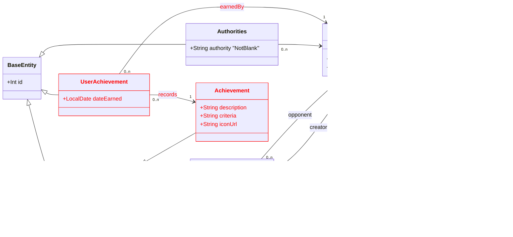
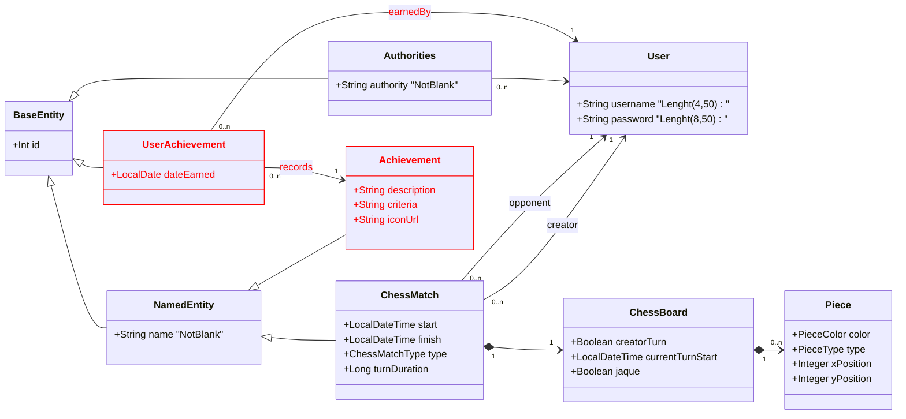

# Evaluación de Prompt

**Proveedor IA:** GEMINI
**Ejercicio:** TEST-ATTRIBUTES-CODE-GENERATION
**Dominio:** CHESS
**Fecha:** 12/6/2026, 3:21:51

## Índice
- [1. Contexto Oculto](#1-contexto-oculto)
- [2. Examen Seleccionado](#2-examen-seleccionado)
- [3. Prompt Visible](#3-prompt-visible)
- [4. Respuesta](#4-respuesta)

---

## 1. Contexto Oculto


=== PAQUETES DE LA PLANTILLA DEL PROYECTO ===
es.us.dp1.chess.tournament.user
es.us.dp1.chess.tournament.model
es.us.dp1.chess.tournament.exceptions

REGLA CRÍTICA DE IMPORTS:
- Usa EXACTAMENTE estos paquetes para las clases que NO son base.
- Paquete raíz: es.us.dp1.chess.tournament
- El paquete de ESTE test (Test1.java) debe ser: es.us.dp1.chess.tournament;

=== CÓDIGO FUENTE REAL ===
package es.us.dp1.chess.tournament.achievement;
@Getter
@Setter
@Table(name = "achievements")
public class Achievement {
    String description;
    String criteria;
    String iconUrl;
}

// ---

package es.us.dp1.chess.tournament.achievement;
public interface AchievementRepository {
    Optional<Achievement> findById(Integer id);
    List<Achievement> findAll();
    Achievement save(Achievement achievement);
}

// ---

package es.us.dp1.chess.tournament.achievement;
public class AchievementService {
    AchievementRepository achievementRepository;
    public AchievementService(AchievementRepository achievementRepository) {
        this.achievementRepository = achievementRepository;
    }
}

// ---

package es.us.dp1.chess.tournament.userachievement;
import es.us.dp1.chess.tournament.achievement.Achievement;
import es.us.dp1.chess.tournament.user.User;
@Getter
@Setter
@Table(name = "user_achievements")
public class UserAchievement {
    LocalDate dateEarned;
    @Transient
    User earnedBy;
    @Transient
    Achievement records;
}

// ---

package es.us.dp1.chess.tournament.userachievement;
public interface UserAchievementRepository {
    Optional<UserAchievement> findById(Integer id);
    List<UserAchievement> findAll();
    UserAchievement save(UserAchievement userAchievement);
}

// ---

package es.us.dp1.chess.tournament.userachievement;
public class UserAchievementService {
    UserAchievementRepository userAchievementRepository;
    public UserAchievementService(UserAchievementRepository userAchievementRepository) {
        this.userAchievementRepository = userAchievementRepository;
    }
}

=== ENUNCIADO ===
En este ejercicio, añadiremos la funcionalidad de gestión de logros y trofeos para una implementación del juego del ajedrez. Concretamente, se proporciona una clase “ChessMatch” que representa las partidas que se juegan, y que tiene asociada una instancia de la clase “ChessBoard” que representa el estado del tablero para dicha partida, por lo que tendrá asociada un conjunto de instancias de la clase “Piece”.

Además, tendremos la clase “Achievement”, que representa un logro o trofeo específico que los jugadores pueden conseguir. Esta clase incluirá atributos como la `description` (una breve explicación del logro), los `criteria` (una cadena de texto que detalla las condiciones para obtenerlo, por ejemplo, "Ganar 5 partidas consecutivas") y un `iconUrl` (la URL de la imagen que representa el trofeo). Los logros se otorgan a los usuarios.

También tendremos la clase “UserAchievement”, que registra cuándo un usuario ha conseguido un logro concreto. Esta clase contendrá el atributo `dateEarned` (la fecha en la que el logro fue obtenido por el usuario). Esta clase se asocia al usuario que lo ha obtenido y al logro correspondiente.

Realizaremos una serie de ejercicios basados en funcionalidades que implementaremos en el sistema, y validaremos mediante pruebas unitarias.



=== REGLAS A EVALUAR (RESTRICCIONES / RELACIONES) ===
Modificar las clases “Achievement” y “UserAchievement” para que sean entidades. Estas clases están alojadas en el paquete “es.us.dp1.chess.achievement”, y deben tener los siguientes atributos y restricciones:

**Para ambas clases:**

- El atributo de tipo entero (Integer) llamado “id” actuará como clave primaria en la tabla de la base de datos relacional asociada a la entidad.

**Para la clase Achievement:**

- Un atributo de tipo cadena de caracteres (String) llamado “name” obligatorio (no puede ser nulo), que debe tener una longitud mínima de 5 caracteres y máxima de 60 y que no puede estar formada por caracteres vacíos (espacios, tabuladores, etc.).
- El atributo de tipo cadena de caracteres (String) llamado “description” obligatorio, que ofrecerá una breve explicación del logro. Este atributo no puede estar formado por caracteres vacíos, y debe tener una longitud mínima de 10 caracteres y máxima de 255.
- El atributo de tipo cadena de caracteres (String) llamado “criteria” obligatorio, que detalla las condiciones específicas para obtener el logro (ej. "Ganar 5 partidas consecutivas"). Este atributo no puede estar formado por caracteres vacíos, y debe tener una longitud mínima de 15 caracteres y máxima de 500.
- El atributo de tipo cadena de caracteres (String) llamado “iconUrl” opcional, que representa la URL de la imagen del trofeo asociado. Tendrá una longitud máxima de 255 caracteres.

**Para la clase UserAchievement:**

- El atributo de tipo fecha (LocalDate) llamado “dateEarned”, que representa la fecha en la que el logro fue obtenido por el usuario. Seguirá el formato “dd/MM/yyyy” y es obligatorio.

No modifique por ahora las anotaciones @Transient de las clases. Modificar las interfaces “AchievementRepository” y “UserAchievementRepository” alojada en el mismo paquete para que extienda a CrudRepository.


---

## 2. Examen Seleccionado
En este ejercicio, añadiremos la funcionalidad de gestión de logros y trofeos para una implementación del juego del ajedrez. Concretamente, se proporciona una clase “ChessMatch” que representa las partidas que se juegan, y que tiene asociada una instancia de la clase “ChessBoard” que representa el estado del tablero para dicha partida, por lo que tendrá asociada un conjunto de instancias de la clase “Piece”.

Además, tendremos la clase “Achievement”, que representa un logro o trofeo específico que los jugadores pueden conseguir. Esta clase incluirá atributos como la `description` (una breve explicación del logro), los `criteria` (una cadena de texto que detalla las condiciones para obtenerlo, por ejemplo, "Ganar 5 partidas consecutivas") y un `iconUrl` (la URL de la imagen que representa el trofeo). Los logros se otorgan a los usuarios.

También tendremos la clase “UserAchievement”, que registra cuándo un usuario ha conseguido un logro concreto. Esta clase contendrá el atributo `dateEarned` (la fecha en la que el logro fue obtenido por el usuario). Esta clase se asocia al usuario que lo ha obtenido y al logro correspondiente.

Realizaremos una serie de ejercicios basados en funcionalidades que implementaremos en el sistema, y validaremos mediante pruebas unitarias.



---

## 3. Prompt Visible
Nuestra misión es generar el test de un examen de la asignatura "Diseño y Pruebas". Actuamos como profesores evaluando conocimientos de JPA y mapeo objeto-relacional. Te proporcionaré el enunciado, el diagrama UML en Mermaid y, **CRÍTICAMENTE, el Código Base de las clases ya generadas**.

Por favor, no uses Wildcard Imports (asteriscos). Genera todos los imports de forma explícita, uno por cada clase utilizada. IMPORTANTE CENTRARSE EN LAS CLASES QUE SE PROPORCIONA COMO CÓDIGO BASE, DE SU LOCALIZACIÓN PARA PODER PONER CORRECTAMENTE LOS IMPORTS DE DONDE SE SACAN LAS CLASES.

---

## REGLA ABSOLUTA — PAQUETES: LEE EL CÓDIGO BASE, EVITA INVENTAR

Esta es la regla más importante del prompt. Debes seguirla antes que cualquier otra cosa.
Además, para las clases que no estén implementadas en el código base, buscarla en el repositorio pasado, como Pet, viene de pet.Pet

**Procedimiento obligatorio antes de escribir un solo import:**

1. Localiza la sección `=== PAQUETES DE LA PLANTILLA DEL PROYECTO ===` del contexto. En ella se te especificará la estructura de los paquetes a importar.
2. Para cada clase que necesites importar, busca su `package` en el código base proporcionado.
3. Construye el import como: `import <package_de_esa_clase>.<NombreClase>;`

- Deberás tener cuidado y poner los nombres de las clases nueva generadas, ya que no siempre es Achievement; deberás coger las clases del contexto que se te proporciona de la extensión funcional.

**Ejemplo concreto:**

- Si el código base de `Achievement.java` empieza con `package es.us.dp1.chess.tournament.achievement;`
- El import correcto en el test es: `import es.us.dp1.chess.tournament.achievement.Achievement;`
- Teniendo en cuenta las mayúsculas y minúsculas de las clases para evitar el error en los tests
- NUNCA: `import org.springframework.samples.chessgame.model.Achievement;`
- NUNCA: `import org.springframework.samples.petClinic.model.Achievement;`

**Aplica lo mismo para `@ComponentScan`:**
Al definir los paquetes, SIEMPRE poner los paquetes individuales necesarios, evitar globalizar en uno todo:

- CORRECTO: `@ComponentScan(basePackages = {"es.us.dp1.chess.tournament.achievement", "es.us.dp1.chess.tournament.userAchievement"})`
- INCORRECTO: `@ComponentScan(basePackages = {"org.springframework.samples.chessgame.repository", "org.springframework.samples.chessgame.model"})`
- INCORRECTO: `@ComponentScan(basePackages = {"es.us.dp1.chess.tournament"})`

**El paquete del propio test (`package ...` en la primera línea) también debe derivarse del código base**, usando el prefijo de donde se crean los test. Ejemplo: si el prefijo raíz es `es.us.dp1.chess.tournament`, el paquete del test será `es.us.dp1.chess.tournament`.

Si una clase (como `ReflexiveTest`, `NamedEntity`, etc.) no aparece en el código base proporcionado, usa el mismo prefijo raíz detectado para inferir su paquete. Nunca uses `org.springframework.samples.*` salvo que ese prefijo aparezca explícitamente en el código base.

Para las diferentes comprobaciones, vamos a llamar a los métodos que nos proporciona la clase ReflexiveTest que te paso dentro del archivo `test_previous_exams`. **IMPORTANTE:** tienes que llamar con el MISMO NOMBRE a los métodos que utilices, además de pasarle los MISMOS tipos de argumentos que pide cada método. A continuación, te proporciono una lista con todos los métodos disponibles y sus correspondientes argumentos necesarios. Los analizarás todos para usarlos correctamente en el test:

```java
void checkThatFieldIsAnnotatedWithDateTimeFormat(Class aClass, String fieldname,String format)

void checkThatFieldIsAnnotatedWith(Class aClass, String fieldname,Class annotationClass)

boolean  isFieldAnnotatedWith(Class aClass, String fieldname,Class annotationClass) throws NoSuchFieldException, SecurityException

boolean classIsAnnotatedWith(Class class1, Class class2)

boolean classHasMethod(Object targetObject, String methodName, Class<?> ... parameterTypes)

void checkThatFieldsAreMandatory(Object validEntity,EntityManager em,String ... fieldnames )

void checkThatFieldIsMandatory(Object validEntity,String fieldname,Class<?> type,EntityManager em)

void checkThatValuesAreNotValid(Object validEntity,Map<String,List<Object>> invalidValues,EntityManager em)

void checkThatValueIsNotValid(Object validEntity,String fieldname,Object value,Class<?> type, EntityManager em)

Object setValue(Object object,String fieldname,Class<?> type, Object value)

Object invokeMethodReflexivelyWithParamTypes(Object targetObject, String methodName, Class<?>[] parameterTypes,Object ... parameterValues)

Object invokeMethodReflexively(Object o, String methodName, Object ... params)

void checkLinkedById(Class myClass,Integer id1,String methodName,Integer id2,EntityManager em)

Object getFieldValueReflexively(Object o, String fieldName)

void checkTransactional(Class<?> myClass,String methodName, Class<?>... parameterTypes)

boolean isMethodAnnotatedWithTest(Method method)

boolean isMethodAnnotatedWithBeforeEach(Method method)

boolean isMethodAnnotatedWithAfterEach(Method method)

void checkTransactionalRollback(Class<?> myClass,String methodName,Class<?>[] paramTypes,Class<? extends Exception> exceptionClass)

boolean isEntity(Class<T> clazz)
```

---

## Reglas de Coherencia Adicionales

2.  **Fidelidad al Código Base:** Si una clase en el código base tiene un atributo con un nombre específico (ej. `checkInDate`), el test debe usar ese nombre exacto, ignorando lo que diga cualquier otro ejemplo externo.
3.  **Manejo de Relaciones:** Si en el Código Base una relación está marcada como `@Transient`, el test debe tratarla según las instrucciones del enunciado, pero siempre importando la clase desde su paquete real.

---

## Especificaciones del Examen

- **Clases Negras:** Núcleo estable (Contexto). No se testea su implementación interna, pero se usan para crear objetos válidos (ej. `Owner`, `Pet`).
- **Clases Rojas:** Tarea principal del alumno. Son las que debemos testear exhaustivamente (Restricciones, Anotaciones y Persistencia).
- **Límite:** Máximo 2 entidades rojas por examen.
- **Framework:** Java 17+, JUnit 5, Spring Boot (@DataJpaTest).
- **Herencia:** La clase de test DEBE extender de `ReflexiveTest` (IMPORTANTE: DEBE USARSE SI O SI ESTA CLASE PARA LA GENERACIÓN DE LOS TESTS, DEBE PONER ReflexiveTest en la parte de `extends...`)

---

## Estructura Estricta Requerida para Test1.java

### 1. Configuración e Inyección

- El nombre ESTRICTO del paquete donde se tiene que generar el test es:
  - Clínica Veterinaria: `package org.springframework.samples.petclinic`
  - Ajedrez: `package es.us.dp1.chess.tournament`
- Inyecta los Repositorios de las entidades rojas y el `EntityManager` mediante `@Autowired` (NUNCA `TestEntityManager`).
- Inyecta SIEMPRE como `@MockBean` el servicio `UserService`:

```java
    @MockBean
    private UserService userService;
```

- Usa `@ComponentScan` apuntando a los paquetes reales detectados en el Código Base (ver Regla Absoluta).
- **IMPORTANTE** los imports de las anotaciones a comprobar deberán venir de jakarta, NUNCA DE javax:
  - CORRECTO: jakarta.persistence.Column;
  - INCORRECTO: javax.persistence.Column;
- **IMPORTANTE**: Omitir crear tests estáticos, para poder usar el método `super`.

### 2. Verificación de Repositorios

Los tests que validan los repositorios, cuando extienden a CRUD Repository no es necesario validar todos los métodos que se proporcionan inicialmente en las clases base, ya que la anotación CRUD los contiene, por lo que la estructura del test sería:

```java
@Test
    void test1RepositoriesExist() {
        assertNotNull(ratingRepository, "RatingRepository should be autowired");
        assertNotNull(ratingChangeRepository, "RatingChangeRepository should be autowired");
        test1RepositoriesContainsMethod();
    }

    void test1RepositoriesContainsMethod() {
        assertTrue(
            CrudRepository.class.isAssignableFrom(RatingRepository.class),
            "RatingRepository should extend CrudRepository"
        );
        assertTrue(
            CrudRepository.class.isAssignableFrom(RatingChangeRepository.class),
            "RatingChangeRepository should extend CrudRepository"
        );
    }

```

- **test1RepositoriesExist():** Verifica `assertNotNull`. Al final, debe llamar a `test1RepositoriesContainsMethod()` solo si el repo no es nulo.
- **test1RepositoriesContainsMethod():** (SIN @Test) Verifica que el repo tiene el método `.count()` o similar mediante reflexión/interfaz.

### 3. Validación de Restricciones (Constraints)

- **test1Check[NOMBRE_ENTIDAD]Constraints():**
  - Invoca `checkThatFieldsAreMandatory` con los campos `NotNull/NotBlank` identificados.
  - Crea el mapa `invalidValues` usando `Map.of(...)`. **PROHIBIDO usar `new HashMap()`**.
  - Los valores de prueba deben ser coherentes con el tipo de dato del Código Base (si es `Double`, usa `0.0`; si es `Integer`, `0`).
  - Invoca `checkThatValuesAreNotValid`.
  - En atributos que sean de tipo Double, NUNCA PONER `columnDefinition = "double(5,2)"` ya que dará error. La forma correcta es por ejemplo: `@Column(name = "cost")`

### 4. Verificación de Anotaciones

- **test1Check[NOMBRE_ENTIDAD]Annotations():**
  - Verifica `@Entity` con `classIsAnnotatedWith`.
  - Verifica `@Enumerated(EnumType.STRING)` si hay Enums.
  - Verifica `@Size`, `@Positive`, `@FutureOrPresent`, etc., según el UML.

### 5. Métodos Auxiliares y Persistencia

- **createValid[NOMBRE_ENTIDAD](EntityManager em):** Método estático que construye una instancia válida.
- **IMPORTANTE:** Usa EXCLUSIVAMENTE `setValue(objeto, "atributo", Tipo.class, valor)` para asignar datos, evitando fallos si no existen setters.
- **test1Valid[NOMBRE_ENTIDAD]IsPersisted():** Verifica que `repo.save()` no lanza excepciones (`assertDoesNotThrow`) y haz `.flush()`.
- Todos los métodos auxiliares que sean necesarios deberán crearse en la misma clase, el test DEBE ser autosuficiente.
- Al crear alguna entidad válida en un método auxiliar, SIEMPRE crear primero los objetos padre, es decir, si un Pet tiene un Owner, primero se deberá crear el Owner y después el Pet. Esto evitará errores de persistencia.

---

## Restricciones de Salida (Formato)

- **PROHIBIDO** generar comentarios explicativos.
- **PROHIBIDO** envolver el código en bloques de código markdown (sin \`\`\`java).
- **PROHIBIDO** incluir texto antes o después del código.
- Entrega el código listo para ser copiado y pegado en un archivo `.java`.

---

## 4. Respuesta
package es.us.dp1.chess.tournament;

import static org.junit.jupiter.api.Assertions.assertDoesNotThrow;
import static org.junit.jupiter.api.Assertions.assertNotNull;
import static org.junit.jupiter.api.Assertions.assertTrue;

import es.us.dp1.chess.tournament.achievement.Achievement;
import es.us.dp1.chess.tournament.achievement.AchievementRepository;
import es.us.dp1.chess.tournament.model.BaseEntity;
import es.us.dp1.chess.tournament.model.NamedEntity;
import es.us.dp1.chess.tournament.user.User;
import es.us.dp1.chess.tournament.user.UserService;
import es.us.dp1.chess.tournament.userachievement.UserAchievement;
import es.us.dp1.chess.tournament.userachievement.UserAchievementRepository;
import jakarta.persistence.Entity;
import jakarta.persistence.EntityManager;
import jakarta.persistence.GeneratedValue;
import jakarta.persistence.Id;
import jakarta.persistence.Table;
import jakarta.validation.constraints.NotBlank;
import jakarta.validation.constraints.NotNull;
import jakarta.validation.constraints.Size;
import java.time.LocalDate;
import java.util.List;
import java.util.Map;
import org.junit.jupiter.api.Test;
import org.springframework.beans.factory.annotation.Autowired;
import org.springframework.boot.test.autoconfigure.orm.jpa.DataJpaTest;
import org.springframework.boot.test.mock.mockito.MockBean;
import org.springframework.context.annotation.ComponentScan;
import org.springframework.data.repository.CrudRepository;
import org.springframework.format.annotation.DateTimeFormat;

@DataJpaTest(properties = {
    "spring.jpa.hibernate.ddl-auto=create-drop",
    "spring.jpa.properties.hibernate.dialect=org.hibernate.dialect.H2Dialect"
})
@ComponentScan(basePackages = {
    "es.us.dp1.chess.tournament.achievement",
    "es.us.dp1.chess.tournament.userachievement"
})
public class Test1 extends ReflexiveTest {

    @Autowired
    AchievementRepository achievementRepository;

    @Autowired
    UserAchievementRepository userAchievementRepository;

    @Autowired
    EntityManager entityManager;

    @MockBean
    UserService userService;

    @Test
    void test1RepositoriesExist() {
        assertNotNull(achievementRepository, "AchievementRepository should be autowired");
        assertNotNull(userAchievementRepository, "UserAchievementRepository should be autowired");
        test1RepositoriesContainsMethod();
    }

    void test1RepositoriesContainsMethod() {
        assertTrue(
            CrudRepository.class.isAssignableFrom(AchievementRepository.class),
            "AchievementRepository should extend CrudRepository"
        );
        assertTrue(
            CrudRepository.class.isAssignableFrom(UserAchievementRepository.class),
            "UserAchievementRepository should extend CrudRepository"
        );
        assertDoesNotThrow(() -> achievementRepository.count(), "AchievementRepository should have count() method from CrudRepository");
        assertDoesNotThrow(() -> userAchievementRepository.count(), "UserAchievementRepository should have count() method from CrudRepository");
    }

    @Test
    void test1CheckAchievementAnnotations() throws NoSuchFieldException, SecurityException {
        // Class annotations
        assertTrue(super.classIsAnnotatedWith(Achievement.class, Entity.class), "Achievement class should be annotated with @Entity");
        assertTrue(super.classIsAnnotatedWith(Achievement.class, Table.class), "Achievement class should be annotated with @Table");
        assertTrue(Achievement.class.getAnnotation(Table.class).name().equals("achievements"), "Table name for Achievement should be 'achievements'");

        // Inherited ID field annotations (from BaseEntity)
        assertTrue(super.isFieldAnnotatedWith(BaseEntity.class, "id", Id.class), "BaseEntity's id field should be annotated with @Id");
        assertTrue(super.isFieldAnnotatedWith(BaseEntity.class, "id", GeneratedValue.class), "BaseEntity's id field should be annotated with @GeneratedValue");

        // Inherited name field annotations (from NamedEntity)
        assertTrue(super.isFieldAnnotatedWith(NamedEntity.class, "name", NotBlank.class), "NamedEntity's name field should be annotated with @NotBlank");
        assertTrue(super.isFieldAnnotatedWith(NamedEntity.class, "name", Size.class), "NamedEntity's name field should be annotated with @Size");
        assertTrue(NamedEntity.class.getDeclaredField("name").getAnnotation(Size.class).min() == 5, "NamedEntity's name field @Size min should be 5");
        assertTrue(NamedEntity.class.getDeclaredField("name").getAnnotation(Size.class).max() == 60, "NamedEntity's name field @Size max should be 60");

        // Description field annotations (declared in Achievement)
        assertTrue(super.isFieldAnnotatedWith(Achievement.class, "description", NotBlank.class), "Achievement's description field should be annotated with @NotBlank");
        assertTrue(super.isFieldAnnotatedWith(Achievement.class, "description", Size.class), "Achievement's description field should be annotated with @Size");
        assertTrue(Achievement.class.getDeclaredField("description").getAnnotation(Size.class).min() == 10, "Achievement's description field @Size min should be 10");
        assertTrue(Achievement.class.getDeclaredField("description").getAnnotation(Size.class).max() == 255, "Achievement's description field @Size max should be 255");

        // Criteria field annotations (declared in Achievement)
        assertTrue(super.isFieldAnnotatedWith(Achievement.class, "criteria", NotBlank.class), "Achievement's criteria field should be annotated with @NotBlank");
        assertTrue(super.isFieldAnnotatedWith(Achievement.class, "criteria", Size.class), "Achievement's criteria field should be annotated with @Size");
        assertTrue(Achievement.class.getDeclaredField("criteria").getAnnotation(Size.class).min() == 15, "Achievement's criteria field @Size min should be 15");
        assertTrue(Achievement.class.getDeclaredField("criteria").getAnnotation(Size.class).max() == 500, "Achievement's criteria field @Size max should be 500");

        // IconUrl field annotations (declared in Achievement)
        assertTrue(super.isFieldAnnotatedWith(Achievement.class, "iconUrl", Size.class), "Achievement's iconUrl field should be annotated with @Size");
        assertTrue(Achievement.class.getDeclaredField("iconUrl").getAnnotation(Size.class).max() == 255, "Achievement's iconUrl field @Size max should be 255");
    }

    @Test
    void test1CheckUserAchievementAnnotations() throws NoSuchFieldException, SecurityException {
        // Class annotations
        assertTrue(super.classIsAnnotatedWith(UserAchievement.class, Entity.class), "UserAchievement class should be annotated with @Entity");
        assertTrue(super.classIsAnnotatedWith(UserAchievement.class, Table.class), "UserAchievement class should be annotated with @Table");
        assertTrue(UserAchievement.class.getAnnotation(Table.class).name().equals("user_achievements"), "Table name for UserAchievement should be 'user_achievements'");

        // Inherited ID field annotations (from BaseEntity)
        assertTrue(super.isFieldAnnotatedWith(BaseEntity.class, "id", Id.class), "BaseEntity's id field should be annotated with @Id");
        assertTrue(super.isFieldAnnotatedWith(BaseEntity.class, "id", GeneratedValue.class), "BaseEntity's id field should be annotated with @GeneratedValue");

        // DateEarned field annotations (declared in UserAchievement)
        assertTrue(super.isFieldAnnotatedWith(UserAchievement.class, "dateEarned", NotNull.class), "UserAchievement's dateEarned field should be annotated with @NotNull");
        super.checkThatFieldIsAnnotatedWithDateTimeFormat(UserAchievement.class, "dateEarned", "dd/MM/yyyy");
    }

    static Achievement createValidAchievement() {
        Achievement achievement = new Achievement();
        achievement.setName("Valid Achievement Name");
        achievement.setDescription("This is a valid achievement description with enough length.");
        achievement.setCriteria("Criteria for this achievement is to win 10 games in a row.");
        achievement.setIconUrl("http://example.com/icon.png");
        return achievement;
    }

    static User createValidUser() {
        User user = new User();
        user.setUsername("testuser");
        user.setPassword("password123");
        return user;
    }

    static UserAchievement createValidUserAchievement() {
        UserAchievement userAchievement = new UserAchievement();
        userAchievement.setDateEarned(LocalDate.of(2023, 1, 15));
        // These fields are @Transient as per instruction, so they won't be persisted
        userAchievement.setEarnedBy(createValidUser());
        userAchievement.setRecords(createValidAchievement());
        return userAchievement;
    }

    @Test
    void test1CheckAchievementConstraints() {
        Achievement achievement = createValidAchievement();

        // Mandatory fields check
        super.checkThatFieldsAreMandatory(achievement, entityManager, "name", "description", "criteria");

        // Invalid values check
        Map<String, List<Object>> invalidValues = Map.of(
            "name", List.of("", "1234", "a".repeat(61)),
            "description", List.of("", "short", "a".repeat(256)),
            "criteria", List.of("", "too short criteria", "a".repeat(501)),
            "iconUrl", List.of("a".repeat(256))
        );
        super.checkThatValuesAreNotValid(achievement, invalidValues, entityManager);
    }

    @Test
    void test1CheckUserAchievementConstraints() {
        UserAchievement userAchievement = createValidUserAchievement();

        // Mandatory fields check
        super.checkThatFieldsAreMandatory(userAchievement, entityManager, "dateEarned");

        // Invalid values check (only null for @NotNull)
        Map<String, List<Object>> invalidValues = Map.of(
            "dateEarned", List.of((Object) null)
        );
        super.checkThatValuesAreNotValid(userAchievement, invalidValues, entityManager);
    }

    @Test
    void test1ValidAchievementIsPersisted() {
        Achievement achievement = createValidAchievement();
        assertDoesNotThrow(() -> {
            this.achievementRepository.save(achievement);
            this.entityManager.flush();
            assertNotNull(achievement.getId(), "Achievement ID should not be null after persisting");
        }, "Valid Achievement should be persisted without throwing an exception");
    }

    @Test
    void test1ValidUserAchievementIsPersisted() {
        UserAchievement userAchievement = createValidUserAchievement();
        assertDoesNotThrow(() -> {
            this.userAchievementRepository.save(userAchievement);
            this.entityManager.flush();
            assertNotNull(userAchievement.getId(), "UserAchievement ID should not be null after persisting");
        }, "Valid UserAchievement should be persisted without throwing an exception");
    }
}