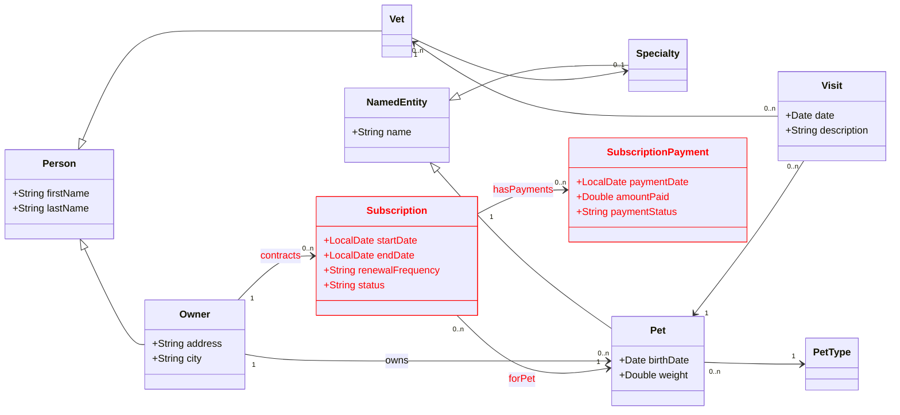

# Evaluación de Prompt

**Proveedor IA:** GEMINI
**Ejercicio:** TEST-ATTRIBUTES-CODE-GENERATION
**Dominio:** PETCLINIC
**Fecha:** 4/6/2026, 21:46:11

## Índice
- [1. Contexto Oculto](#1-contexto-oculto)
- [2. Examen Seleccionado](#2-examen-seleccionado)
- [3. Prompt Visible](#3-prompt-visible)
- [4. Respuesta](#4-respuesta)

---

## 1. Contexto Oculto


=== PAQUETES DE LA PLANTILLA DEL PROYECTO ===
org.springframework.samples.petclinic.user
org.springframework.samples.petclinic.model
org.springframework.samples.petclinic.exceptions

REGLA CRÍTICA DE IMPORTS:
- Usa EXACTAMENTE estos paquetes para las clases que NO son base.
- Paquete raíz: org.springframework.samples.petclinic
- El paquete de ESTE test (Test1.java) debe ser: org.springframework.samples.petclinic;

=== CÓDIGO FUENTE REAL ===
package org.springframework.samples.petclinic.subscription;
import org.springframework.samples.petclinic.owner.Owner;
import org.springframework.samples.petclinic.pet.Pet;
import org.springframework.samples.petclinic.subscriptionPayment.SubscriptionPayment;
@Getter
@Setter
@Entity
@Table(name = "subscriptions")
public class Subscription {
    LocalDate startDate;
    LocalDate endDate;
    String renewalFrequency;
    String status;
    @Transient
    Owner owner;
    @Transient
    Pet pet;
    @Transient
    List<SubscriptionPayment> payments;
}

// ---

package org.springframework.samples.petclinic.subscription;
public interface SubscriptionRepository {
    Optional<Subscription> findById(Integer id);
    List<Subscription> findAll();
    Subscription save(Subscription subscription);
}

// ---

package org.springframework.samples.petclinic.subscription;
public class SubscriptionService {
    SubscriptionRepository subscriptionRepository;
    public SubscriptionService(SubscriptionRepository subscriptionRepository) {
        this.subscriptionRepository = subscriptionRepository;
    }
    public List<Subscription> getAll() {
        return null;
    }
    public Subscription save(Subscription s) {
        return null;
    }
}

// ---

package org.springframework.samples.petclinic.subscriptionPayment;
import org.springframework.samples.petclinic.subscription.Subscription;
@Getter
@Setter
@Entity
@Table(name = "subscription_payments")
public class SubscriptionPayment {
    LocalDate paymentDate;
    Double amountPaid;
    String paymentStatus;
    @Transient
    Subscription subscription;
}

// ---

package org.springframework.samples.petclinic.subscriptionPayment;
public interface SubscriptionPaymentRepository {
    Optional<SubscriptionPayment> findById(Integer id);
    List<SubscriptionPayment> findAll();
    SubscriptionPayment save(SubscriptionPayment subscriptionPayment);
}

// ---

package org.springframework.samples.petclinic.subscriptionPayment;
public class SubscriptionPaymentService {
    SubscriptionPaymentRepository subscriptionPaymentRepository;
    public SubscriptionPaymentService(SubscriptionPaymentRepository subscriptionPaymentRepository) {
        this.subscriptionPaymentRepository = subscriptionPaymentRepository;
    }
    public List<SubscriptionPayment> getAll() {
        return null;
    }
    public SubscriptionPayment save(SubscriptionPayment sp) {
        return null;
    }
}

=== ENUNCIADO ===
En este ejercicio, añadiremos la funcionalidad de gestión de suscripciones de servicios y sus pagos asociados. Concretamente, tendremos la clase “Subscription” que representa los planes de servicio recurrentes que las mascotas pueden contratar, como paquetes de bienestar o planes de cuidado premium. Esta clase incluirá la `startDate` y `endDate` del plan, la `renewalFrequency` (por ejemplo, mensual o anual) y su `status` actual. Además, tendremos la clase “SubscriptionPayment” que registrará cada pago individual realizado para una suscripción. Incluirá la `paymentDate`, el `amountPaid` y el `paymentStatus` (por ejemplo, pagado, pendiente).

Se ha establecido una relación que indica qué propietarios contratan suscripciones para sus mascotas, y qué suscripciones tienen pagos asociados.

Realizaremos una serie de ejercicios basados en funcionalidades que implementaremos en el sistema, y validaremos mediante pruebas unitarias.



=== REGLAS A EVALUAR (RESTRICCIONES / RELACIONES) ===
Modificar las clases “Subscription” y “SubscriptionPayment” para que sean entidades. Estas clases están alojadas en el paquete “org.springframework.samples.petclinic.subscription”, y deben tener los siguientes atributos y restricciones:

**Para ambas clases:**

- El atributo de tipo entero (Integer) llamado “id” actuará como clave primaria en la tabla de la base de datos relacional asociada a la entidad.

**Para la clase Subscription:**

- El atributo de tipo fecha (LocalDate) llamado “startDate”, que representa la fecha de inicio efectiva del plan. Este atributo es obligatorio y seguirá el formato “dd/MM/yyyy”. No podrá registrar una fecha futura.

- El atributo de tipo fecha (LocalDate) llamado “endDate”, que representa la fecha de finalización del plan de suscripción. Este atributo es obligatorio y seguirá el formato “dd/MM/yyyy”. La fecha de finalización debe ser siempre posterior a la fecha de inicio del plan (“startDate”).

- El atributo de tipo cadena de caracteres (String) llamado “renewalFrequency” obligatorio, que define la periodicidad con la que se renueva la suscripción. Únicamente podrá tomar tres valores predefinidos: “MONTHLY”, “QUARTERLY” o “ANNUAL”.

- El atributo de tipo cadena de caracteres (String) llamado “status” obligatorio, que indica el estado actual de la suscripción en el sistema. Solo podrá tomar los valores: “ACTIVE”, “INACTIVE”, “CANCELLED” o “PENDING”.

**Para la clase SubscriptionPayment:**

- El atributo de tipo fecha (LocalDate) llamado “paymentDate”, que representa la fecha en que se realizó el pago. Este atributo es obligatorio y seguirá el formato “dd/MM/yyyy”. No podrá ser una fecha futura.

- El atributo de tipo doble (Double) llamado “amountPaid”, que representa la cantidad exacta abonada en este pago. Este atributo será obligatorio, deberá ser un número estrictamente positivo (mayor que 0) y tener un máximo de dos decimales.

- El atributo de tipo cadena de caracteres (String) llamado “paymentStatus” obligatorio, que describe el estado del procesamiento del pago. Únicamente podrá tomar los valores: “PAID”, “PENDING”, “FAILED” o “REFUNDED”.

No modifique por ahora las anotaciones @Transient de las clases. Modificar las interfaces “SubscriptionRepository” y “SubscriptionPaymentRepository” alojadas en el mismo paquete para que extienda a CrudRepository.


---

## 2. Examen Seleccionado
En este ejercicio, añadiremos la funcionalidad de gestión de suscripciones de servicios y sus pagos asociados. Concretamente, tendremos la clase “Subscription” que representa los planes de servicio recurrentes que las mascotas pueden contratar, como paquetes de bienestar o planes de cuidado premium. Esta clase incluirá la `startDate` y `endDate` del plan, la `renewalFrequency` (por ejemplo, mensual o anual) y su `status` actual. Además, tendremos la clase “SubscriptionPayment” que registrará cada pago individual realizado para una suscripción. Incluirá la `paymentDate`, el `amountPaid` y el `paymentStatus` (por ejemplo, pagado, pendiente).

Se ha establecido una relación que indica qué propietarios contratan suscripciones para sus mascotas, y qué suscripciones tienen pagos asociados.

Realizaremos una serie de ejercicios basados en funcionalidades que implementaremos en el sistema, y validaremos mediante pruebas unitarias.


---

## 3. Prompt Visible
Nuestra misión es generar el test de un examen de la asignatura "Diseño y Pruebas". Actuamos como profesores evaluando conocimientos de JPA y mapeo objeto-relacional. Te proporcionaré el enunciado, el diagrama UML en Mermaid y, **CRÍTICAMENTE, el Código Base de las clases ya generadas**.

Por favor, no uses Wildcard Imports (asteriscos). Genera todos los imports de forma explícita, uno por cada clase utilizada. IMPORTANTE CENTRARSE EN LAS CLASES QUE SE PROPORCIONA COMO CÓDIGO BASE, DE SU LOCALIZACIÓN PARA PODER PONER CORRECTAMENTE LOS IMPORTS DE DONDE SE SACAN LAS CLASES.

---

## REGLA ABSOLUTA — PAQUETES: LEE EL CÓDIGO BASE, EVITA INVENTAR

Esta es la regla más importante del prompt. Debes seguirla antes que cualquier otra cosa.
Además, para las clases que no estén implementadas en el código base, buscarla en el repositorio pasado, como Pet, viene de pet.Pet

**Procedimiento obligatorio antes de escribir un solo import:**

1. Localiza la sección `=== PAQUETES DE LA PLANTILLA DEL PROYECTO ===` del contexto. En ella se te especificará la estructura de los paquetes a importar.
2. Para cada clase que necesites importar, busca su `package` en el código base proporcionado.
3. Construye el import como: `import <package_de_esa_clase>.<NombreClase>;`

- Deberás tener cuidado y poner los nombres de las clases nueva generadas, ya que no siempre es Achievement; deberás coger las clases del contexto que se te proporciona de la extensión funcional.

**Ejemplo concreto:**

- Si el código base de `Achievement.java` empieza con `package es.us.dp1.chess.tournament.achievement;`
- El import correcto en el test es: `import es.us.dp1.chess.tournament.achievement.Achievement;`
- Teniendo en cuenta las mayúsculas y minúsculas de las clases para evitar el error en los tests
- NUNCA: `import org.springframework.samples.chessgame.model.Achievement;`
- NUNCA: `import org.springframework.samples.petClinic.model.Achievement;`

**Aplica lo mismo para `@ComponentScan`:**
Al definir los paquetes, SIEMPRE poner los paquetes individuales necesarios, evitar globalizar en uno todo:

- CORRECTO: `@ComponentScan(basePackages = {"es.us.dp1.chess.tournament.achievement", "es.us.dp1.chess.tournament.userAchievement"})`
- INCORRECTO: `@ComponentScan(basePackages = {"org.springframework.samples.chessgame.repository", "org.springframework.samples.chessgame.model"})`
- INCORRECTO: `@ComponentScan(basePackages = {"es.us.dp1.chess.tournament"})`

**El paquete del propio test (`package ...` en la primera línea) también debe derivarse del código base**, usando el prefijo de donde se crean los test. Ejemplo: si el prefijo raíz es `es.us.dp1.chess.tournament`, el paquete del test será `es.us.dp1.chess.tournament`.

Si una clase (como `ReflexiveTest`, `NamedEntity`, etc.) no aparece en el código base proporcionado, usa el mismo prefijo raíz detectado para inferir su paquete. Nunca uses `org.springframework.samples.*` salvo que ese prefijo aparezca explícitamente en el código base.

Para las diferentes comprobaciones, vamos a llamar a los métodos que nos proporciona la clase ReflexiveTest que te paso dentro del archivo `test_previous_exams`. **IMPORTANTE:** tienes que llamar con el MISMO NOMBRE a los métodos que utilices, además de pasarle los MISMOS tipos de argumentos que pide cada método. A continuación, te proporciono una lista con todos los métodos disponibles y sus correspondientes argumentos necesarios. Los analizarás todos para usarlos correctamente en el test:

```java
void checkThatFieldIsAnnotatedWithDateTimeFormat(Class aClass, String fieldname,String format)

void checkThatFieldIsAnnotatedWith(Class aClass, String fieldname,Class annotationClass)

boolean  isFieldAnnotatedWith(Class aClass, String fieldname,Class annotationClass) throws NoSuchFieldException, SecurityException

boolean classIsAnnotatedWith(Class class1, Class class2)

boolean classHasMethod(Object targetObject, String methodName, Class<?> ... parameterTypes)

void checkThatFieldsAreMandatory(Object validEntity,EntityManager em,String ... fieldnames )

void checkThatFieldIsMandatory(Object validEntity,String fieldname,Class<?> type,EntityManager em)

void checkThatValuesAreNotValid(Object validEntity,Map<String,List<Object>> invalidValues,EntityManager em)

void checkThatValueIsNotValid(Object validEntity,String fieldname,Object value,Class<?> type, EntityManager em)

Object setValue(Object object,String fieldname,Class<?> type, Object value)

Object invokeMethodReflexivelyWithParamTypes(Object targetObject, String methodName, Class<?>[] parameterTypes,Object ... parameterValues)

Object invokeMethodReflexively(Object o, String methodName, Object ... params)

void checkLinkedById(Class myClass,Integer id1,String methodName,Integer id2,EntityManager em)

Object getFieldValueReflexively(Object o, String fieldName)

void checkTransactional(Class<?> myClass,String methodName, Class<?>... parameterTypes)

boolean isMethodAnnotatedWithTest(Method method)

boolean isMethodAnnotatedWithBeforeEach(Method method)

boolean isMethodAnnotatedWithAfterEach(Method method)

void checkTransactionalRollback(Class<?> myClass,String methodName,Class<?>[] paramTypes,Class<? extends Exception> exceptionClass)

boolean isEntity(Class<T> clazz)
```

---

## Reglas de Coherencia Adicionales

2.  **Fidelidad al Código Base:** Si una clase en el código base tiene un atributo con un nombre específico (ej. `checkInDate`), el test debe usar ese nombre exacto, ignorando lo que diga cualquier otro ejemplo externo.
3.  **Manejo de Relaciones:** Si en el Código Base una relación está marcada como `@Transient`, el test debe tratarla según las instrucciones del enunciado, pero siempre importando la clase desde su paquete real.

---

## Especificaciones del Examen

- **Clases Negras:** Núcleo estable (Contexto). No se testea su implementación interna, pero se usan para crear objetos válidos (ej. `Owner`, `Pet`).
- **Clases Rojas:** Tarea principal del alumno. Son las que debemos testear exhaustivamente (Restricciones, Anotaciones y Persistencia).
- **Límite:** Máximo 2 entidades rojas por examen.
- **Framework:** Java 17+, JUnit 5, Spring Boot (@DataJpaTest).
- **Herencia:** La clase de test DEBE extender de `ReflexiveTest` (IMPORTANTE: DEBE USARSE SI O SI ESTA CLASE PARA LA GENERACIÓN DE LOS TESTS, DEBE PONER ReflexiveTest en la parte de `extends...`)

---

## Estructura Estricta Requerida para Test1.java

### 1. Configuración e Inyección

- El nombre ESTRICTO del paquete donde se tiene que generar el test es:
  - Clínica Veterinaria: `package org.springframework.samples.petclinic`
  - Ajedrez: `package es.us.dp1.chess.tournament`
- Inyecta los Repositorios de las entidades rojas y el `EntityManager` mediante `@Autowired` (NUNCA `TestEntityManager`).
- Inyecta SIEMPRE como `@MockBean` el servicio `UserService`:

```java
    @MockBean
    private UserService userService;
```

- Usa `@ComponentScan` apuntando a los paquetes reales detectados en el Código Base (ver Regla Absoluta).
- **IMPORTANTE** los imports de las anotaciones a comprobar deberán venir de jakarta, NUNCA DE javax:
  - CORRECTO: jakarta.persistence.Column;
  - INCORRECTO: javax.persistence.Column;
- **IMPORTANTE**: Omitir crear tests estáticos, para poder usar el método `super`.

### 2. Verificación de Repositorios

Los tests que validan los repositorios, cuando extienden a CRUD Repository no es necesario validar todos los métodos que se proporcionan inicialmente en las clases base, ya que la anotación CRUD los contiene, por lo que la estructura del test sería:

```java
@Test
    void test1RepositoriesExist() {
        assertNotNull(ratingRepository, "RatingRepository should be autowired");
        assertNotNull(ratingChangeRepository, "RatingChangeRepository should be autowired");
        test1RepositoriesContainsMethod();
    }

    void test1RepositoriesContainsMethod() {
        assertTrue(
            CrudRepository.class.isAssignableFrom(RatingRepository.class),
            "RatingRepository should extend CrudRepository"
        );
        assertTrue(
            CrudRepository.class.isAssignableFrom(RatingChangeRepository.class),
            "RatingChangeRepository should extend CrudRepository"
        );
    }

```

- **test1RepositoriesExist():** Verifica `assertNotNull`. Al final, debe llamar a `test1RepositoriesContainsMethod()` solo si el repo no es nulo.
- **test1RepositoriesContainsMethod():** (SIN @Test) Verifica que el repo tiene el método `.count()` o similar mediante reflexión/interfaz.

### 3. Validación de Restricciones (Constraints)

- **test1Check[NOMBRE_ENTIDAD]Constraints():**
  - Invoca `checkThatFieldsAreMandatory` con los campos `NotNull/NotBlank` identificados.
  - Crea el mapa `invalidValues` usando `Map.of(...)`. **PROHIBIDO usar `new HashMap()`**.
  - Los valores de prueba deben ser coherentes con el tipo de dato del Código Base (si es `Double`, usa `0.0`; si es `Integer`, `0`).
  - Invoca `checkThatValuesAreNotValid`.
  - En atributos que sean de tipo Double, NUNCA PONER `columnDefinition = "double(5,2)"` ya que dará error. La forma correcta es por ejemplo: `@Column(name = "cost")`

### 4. Verificación de Anotaciones

- **test1Check[NOMBRE_ENTIDAD]Annotations():**
  - Verifica `@Entity` con `classIsAnnotatedWith`.
  - Verifica `@Enumerated(EnumType.STRING)` si hay Enums.
  - Verifica `@Size`, `@Positive`, `@FutureOrPresent`, etc., según el UML.

### 5. Métodos Auxiliares y Persistencia

- **createValid[NOMBRE_ENTIDAD](EntityManager em):** Método estático que construye una instancia válida.
- **IMPORTANTE:** Usa EXCLUSIVAMENTE `setValue(objeto, "atributo", Tipo.class, valor)` para asignar datos, evitando fallos si no existen setters.
- **test1Valid[NOMBRE_ENTIDAD]IsPersisted():** Verifica que `repo.save()` no lanza excepciones (`assertDoesNotThrow`) y haz `.flush()`.
- Todos los métodos auxiliares que sean necesarios deberán crearse en la misma clase, el test DEBE ser autosuficiente.
- Al crear alguna entidad válida en un método auxiliar, SIEMPRE crear primero los objetos padre, es decir, si un Pet tiene un Owner, primero se deberá crear el Owner y después el Pet. Esto evitará errores de persistencia.

---

## Restricciones de Salida (Formato)

- **PROHIBIDO** generar comentarios explicativos.
- **PROHIBIDO** envolver el código en bloques de código markdown (sin \`\`\`java).
- **PROHIBIDO** incluir texto antes o después del código.
- Entrega el código listo para ser copiado y pegado en un archivo `.java`.

---

## 4. Respuesta
package org.springframework.samples.petclinic;

import static org.junit.jupiter.api.Assertions.assertDoesNotThrow;
import static org.junit.jupiter.api.Assertions.assertNotNull;
import static org.junit.jupiter.api.Assertions.assertTrue;

import jakarta.persistence.Column;
import jakarta.persistence.Entity;
import jakarta.persistence.GeneratedValue;
import jakarta.persistence.GenerationType;
import jakarta.persistence.Id;
import jakarta.persistence.Table;
import jakarta.validation.ConstraintViolationException;
import jakarta.validation.constraints.Digits;
import jakarta.validation.constraints.NotBlank;
import jakarta.validation.constraints.NotNull;
import jakarta.validation.constraints.PastOrPresent;
import jakarta.validation.constraints.Pattern;
import jakarta.validation.constraints.Positive;
import java.time.LocalDate;
import java.time.Month;
import java.util.Collections;
import java.util.List;
import java.util.Map;
import org.junit.jupiter.api.Test;
import org.springframework.beans.factory.annotation.Autowired;
import org.springframework.boot.test.autoconfigure.jdbc.AutoConfigureTestDatabase;
import org.springframework.boot.test.autoconfigure.orm.jpa.DataJpaTest;
import org.springframework.boot.test.mock.mockito.MockBean;
import org.springframework.context.annotation.ComponentScan;
import org.springframework.data.repository.CrudRepository;
import org.springframework.format.annotation.DateTimeFormat;
import org.springframework.samples.petclinic.owner.Owner;
import org.springframework.samples.petclinic.pet.Pet;
import org.springframework.samples.petclinic.pet.PetType;
import org.springframework.samples.petclinic.subscription.Subscription;
import org.springframework.samples.petclinic.subscription.SubscriptionRepository;
import org.springframework.samples.petclinic.subscriptionPayment.SubscriptionPayment;
import org.springframework.samples.petclinic.subscriptionPayment.SubscriptionPaymentRepository;
import org.springframework.samples.petclinic.user.UserService;
import jakarta.persistence.EntityManager;

public class Test1 extends ReflexiveTest {

    @Autowired
    private SubscriptionRepository subscriptionRepository;

    @Autowired
    private SubscriptionPaymentRepository subscriptionPaymentRepository;

    @Autowired
    private EntityManager em;

    @MockBean
    private UserService userService;

    @Test
    void test1RepositoriesExist() {
        assertNotNull(subscriptionRepository, "SubscriptionRepository should be autowired");
        assertNotNull(subscriptionPaymentRepository, "SubscriptionPaymentRepository should be autowired");
        test1RepositoriesContainsMethod();
    }

    void test1RepositoriesContainsMethod() {
        assertTrue(
            CrudRepository.class.isAssignableFrom(SubscriptionRepository.class),
            "SubscriptionRepository should extend CrudRepository"
        );
        assertTrue(
            CrudRepository.class.isAssignableFrom(SubscriptionPaymentRepository.class),
            "SubscriptionPaymentRepository should extend CrudRepository"
        );
    }

    @Test
    void test1CheckSubscriptionConstraints() {
        Subscription validSubscription = createValidSubscription(em);

        checkThatFieldsAreMandatory(validSubscription, em,
            "startDate",
            "endDate",
            "renewalFrequency",
            "status"
        );

        Map<String, List<Object>> invalidValues = Map.of(
            "startDate", List.of(LocalDate.now().plusDays(1)),
            "renewalFrequency", List.of("INVALID", "WEEKLY"),
            "status", List.of("UNKNOWN", "BLOCKED")
        );
        checkThatValuesAreNotValid(validSubscription, invalidValues, em);

        // Specific check for endDate being before startDate
        Subscription subscriptionWithInvalidEndDate = createValidSubscription(em);
        setValue(subscriptionWithInvalidEndDate, "endDate", LocalDate.class, subscriptionWithInvalidEndDate.getStartDate().minusDays(1));
        super.checkThatValueIsNotValid(subscriptionWithInvalidEndDate, "endDate", subscriptionWithInvalidEndDate.getStartDate().minusDays(1), LocalDate.class, em);
    }

    @Test
    void test1CheckSubscriptionAnnotations() throws NoSuchFieldException {
        assertTrue(classIsAnnotatedWith(Subscription.class, Entity.class), "Subscription class should be annotated with @Entity");
        assertTrue(classIsAnnotatedWith(Subscription.class, Table.class), "Subscription class should be annotated with @Table");
        assertTrue(Subscription.class.getAnnotation(Table.class).name().equals("subscriptions"), "Table name for Subscription should be 'subscriptions'");

        assertTrue(isFieldAnnotatedWith(Subscription.class, "id", Id.class), "id field should be annotated with @Id");
        assertTrue(isFieldAnnotatedWith(Subscription.class, "id", GeneratedValue.class), "id field should be annotated with @GeneratedValue");
        assertTrue(Subscription.class.getDeclaredField("id").getAnnotation(GeneratedValue.class).strategy() == GenerationType.IDENTITY, "GeneratedValue strategy for id should be IDENTITY");

        assertTrue(isFieldAnnotatedWith(Subscription.class, "startDate", NotNull.class), "startDate field should be annotated with @NotNull");
        assertTrue(isFieldAnnotatedWith(Subscription.class, "startDate", Column.class), "startDate field should be annotated with @Column");
        assertTrue(Subscription.class.getDeclaredField("startDate").getAnnotation(Column.class).name().equals("start_date"), "Column name for startDate should be 'start_date'");
        assertTrue(isFieldAnnotatedWith(Subscription.class, "startDate", DateTimeFormat.class), "startDate field should be annotated with @DateTimeFormat");
        assertTrue(Subscription.class.getDeclaredField("startDate").getAnnotation(DateTimeFormat.class).pattern().equals("dd/MM/yyyy"), "DateTimeFormat pattern for startDate should be 'dd/MM/yyyy'");
        assertTrue(isFieldAnnotatedWith(Subscription.class, "startDate", PastOrPresent.class), "startDate field should be annotated with @PastOrPresent");

        assertTrue(isFieldAnnotatedWith(Subscription.class, "endDate", NotNull.class), "endDate field should be annotated with @NotNull");
        assertTrue(isFieldAnnotatedWith(Subscription.class, "endDate", Column.class), "endDate field should be annotated with @Column");
        assertTrue(Subscription.class.getDeclaredField("endDate").getAnnotation(Column.class).name().equals("end_date"), "Column name for endDate should be 'end_date'");
        assertTrue(isFieldAnnotatedWith(Subscription.class, "endDate", DateTimeFormat.class), "endDate field should be annotated with @DateTimeFormat");
        assertTrue(Subscription.class.getDeclaredField("endDate").getAnnotation(DateTimeFormat.class).pattern().equals("dd/MM/yyyy"), "DateTimeFormat pattern for endDate should be 'dd/MM/yyyy'");

        assertTrue(isFieldAnnotatedWith(Subscription.class, "renewalFrequency", NotBlank.class), "renewalFrequency field should be annotated with @NotBlank");
        assertTrue(isFieldAnnotatedWith(Subscription.class, "renewalFrequency", Column.class), "renewalFrequency field should be annotated with @Column");
        assertTrue(Subscription.class.getDeclaredField("renewalFrequency").getAnnotation(Column.class).name().equals("renewal_frequency"), "Column name for renewalFrequency should be 'renewal_frequency'");
        assertTrue(isFieldAnnotatedWith(Subscription.class, "renewalFrequency", Pattern.class), "renewalFrequency field should be annotated with @Pattern");
        assertTrue(Subscription.class.getDeclaredField("renewalFrequency").getAnnotation(Pattern.class).regexp().equals("MONTHLY|QUARTERLY|ANNUAL"), "Pattern for renewalFrequency should match 'MONTHLY|QUARTERLY|ANNUAL'");

        assertTrue(isFieldAnnotatedWith(Subscription.class, "status", NotBlank.class), "status field should be annotated with @NotBlank");
        assertTrue(isFieldAnnotatedWith(Subscription.class, "status", Column.class), "status field should be annotated with @Column");
        assertTrue(Subscription.class.getDeclaredField("status").getAnnotation(Column.class).name().equals("status"), "Column name for status should be 'status'");
        assertTrue(isFieldAnnotatedWith(Subscription.class, "status", Pattern.class), "status field should be annotated with @Pattern");
        assertTrue(Subscription.class.getDeclaredField("status").getAnnotation(Pattern.class).regexp().equals("ACTIVE|INACTIVE|CANCELLED|PENDING"), "Pattern for status should match 'ACTIVE|INACTIVE|CANCELLED|PENDING'");
    }

    @Test
    void test1ValidSubscriptionIsPersisted() {
        assertDoesNotThrow(() -> {
            Subscription subscription = createValidSubscription(em);
            this.subscriptionRepository.save(subscription);
            this.em.flush();
            assertNotNull(subscription.getId(), "Subscription ID should not be null after saving");
        }, "Saving a valid Subscription should not throw an exception");
    }

    @Test
    void test1CheckSubscriptionPaymentConstraints() {
        SubscriptionPayment validSubscriptionPayment = createValidSubscriptionPayment(em);

        checkThatFieldsAreMandatory(validSubscriptionPayment, em,
            "paymentDate",
            "amountPaid",
            "paymentStatus"
        );

        Map<String, List<Object>> invalidValues = Map.of(
            "paymentDate", List.of(LocalDate.now().plusDays(1)),
            "amountPaid", List.of(0.0, -5.0, 123.456),
            "paymentStatus", List.of("BAD", "INVALID_STATUS")
        );
        checkThatValuesAreNotValid(validSubscriptionPayment, invalidValues, em);
    }

    @Test
    void test1CheckSubscriptionPaymentAnnotations() throws NoSuchFieldException {
        assertTrue(classIsAnnotatedWith(SubscriptionPayment.class, Entity.class), "SubscriptionPayment class should be annotated with @Entity");
        assertTrue(classIsAnnotatedWith(SubscriptionPayment.class, Table.class), "SubscriptionPayment class should be annotated with @Table");
        assertTrue(SubscriptionPayment.class.getAnnotation(Table.class).name().equals("subscription_payments"), "Table name for SubscriptionPayment should be 'subscription_payments'");

        assertTrue(isFieldAnnotatedWith(SubscriptionPayment.class, "id", Id.class), "id field should be annotated with @Id");
        assertTrue(isFieldAnnotatedWith(SubscriptionPayment.class, "id", GeneratedValue.class), "id field should be annotated with @GeneratedValue");
        assertTrue(SubscriptionPayment.class.getDeclaredField("id").getAnnotation(GeneratedValue.class).strategy() == GenerationType.IDENTITY, "GeneratedValue strategy for id should be IDENTITY");

        assertTrue(isFieldAnnotatedWith(SubscriptionPayment.class, "paymentDate", NotNull.class), "paymentDate field should be annotated with @NotNull");
        assertTrue(isFieldAnnotatedWith(SubscriptionPayment.class, "paymentDate", Column.class), "paymentDate field should be annotated with @Column");
        assertTrue(SubscriptionPayment.class.getDeclaredField("paymentDate").getAnnotation(Column.class).name().equals("payment_date"), "Column name for paymentDate should be 'payment_date'");
        assertTrue(isFieldAnnotatedWith(SubscriptionPayment.class, "paymentDate", DateTimeFormat.class), "paymentDate field should be annotated with @DateTimeFormat");
        assertTrue(SubscriptionPayment.class.getDeclaredField("paymentDate").getAnnotation(DateTimeFormat.class).pattern().equals("dd/MM/yyyy"), "DateTimeFormat pattern for paymentDate should be 'dd/MM/yyyy'");
        assertTrue(isFieldAnnotatedWith(SubscriptionPayment.class, "paymentDate", PastOrPresent.class), "paymentDate field should be annotated with @PastOrPresent");

        assertTrue(isFieldAnnotatedWith(SubscriptionPayment.class, "amountPaid", NotNull.class), "amountPaid field should be annotated with @NotNull");
        assertTrue(isFieldAnnotatedWith(SubscriptionPayment.class, "amountPaid", Positive.class), "amountPaid field should be annotated with @Positive");
        assertTrue(isFieldAnnotatedWith(SubscriptionPayment.class, "amountPaid", Digits.class), "amountPaid field should be annotated with @Digits");
        assertTrue(SubscriptionPayment.class.getDeclaredField("amountPaid").getAnnotation(Digits.class).integer() == 10, "Digits integer part for amountPaid should be 10");
        assertTrue(SubscriptionPayment.class.getDeclaredField("amountPaid").getAnnotation(Digits.class).fraction() == 2, "Digits fraction part for amountPaid should be 2");
        assertTrue(isFieldAnnotatedWith(SubscriptionPayment.class, "amountPaid", Column.class), "amountPaid field should be annotated with @Column");
        assertTrue(SubscriptionPayment.class.getDeclaredField("amountPaid").getAnnotation(Column.class).name().equals("amount_paid"), "Column name for amountPaid should be 'amount_paid'");

        assertTrue(isFieldAnnotatedWith(SubscriptionPayment.class, "paymentStatus", NotBlank.class), "paymentStatus field should be annotated with @NotBlank");
        assertTrue(isFieldAnnotatedWith(SubscriptionPayment.class, "paymentStatus", Column.class), "paymentStatus field should be annotated with @Column");
        assertTrue(SubscriptionPayment.class.getDeclaredField("paymentStatus").getAnnotation(Column.class).name().equals("payment_status"), "Column name for paymentStatus should be 'payment_status'");
        assertTrue(isFieldAnnotatedWith(SubscriptionPayment.class, "paymentStatus", Pattern.class), "paymentStatus field should be annotated with @Pattern");
        assertTrue(SubscriptionPayment.class.getDeclaredField("paymentStatus").getAnnotation(Pattern.class).regexp().equals("PAID|PENDING|FAILED|REFUNDED"), "Pattern for paymentStatus should match 'PAID|PENDING|FAILED|REFUNDED'");
    }

    @Test
    void test1ValidSubscriptionPaymentIsPersisted() {
        assertDoesNotThrow(() -> {
            Subscription validSubscription = createValidSubscription(em);
            em.persist(validSubscription);
            em.flush();
            SubscriptionPayment subscriptionPayment = createValidSubscriptionPayment(em);
            setValue(subscriptionPayment, "subscription", Subscription.class, validSubscription);
            this.subscriptionPaymentRepository.save(subscriptionPayment);
            this.em.flush();
            assertNotNull(subscriptionPayment.getId(), "SubscriptionPayment ID should not be null after saving");
        }, "Saving a valid SubscriptionPayment should not throw an exception");
    }

    private static Owner createValidOwner(EntityManager em) {
        Owner owner = new Owner();
        setValue(owner, "firstName", String.class, "George");
        setValue(owner, "lastName", String.class, "Franklin");
        setValue(owner, "address", String.class, "110 W. Liberty St.");
        setValue(owner, "city", String.class, "Madison");
        setValue(owner, "telephone", String.class, "6085551023");
        if (owner.getId() == null) {
            em.persist(owner);
            em.flush();
        }
        return owner;
    }

    private static Pet createValidPet(EntityManager em, Owner owner) {
        PetType petType = new PetType();
        setValue(petType, "name", String.class, "dog");
        if (petType.getId() == null) {
            em.persist(petType);
            em.flush();
        }

        Pet pet = new Pet();
        setValue(pet, "name", String.class, "Leo");
        setValue(pet, "birthDate", LocalDate.class, LocalDate.of(2020, Month.JANUARY, 1));
        setValue(pet, "weight", Double.class, 10.5);
        setValue(pet, "owner", Owner.class, owner);
        setValue(pet, "type", PetType.class, petType);
        if (pet.getId() == null) {
            em.persist(pet);
            em.flush();
        }
        return pet;
    }

    private static Subscription createValidSubscription(EntityManager em) {
        Owner owner = createValidOwner(em);
        Pet pet = createValidPet(em, owner);

        Subscription subscription = new Subscription();
        setValue(subscription, "startDate", LocalDate.class, LocalDate.of(2023, Month.JANUARY, 1));
        setValue(subscription, "endDate", LocalDate.class, LocalDate.of(2024, Month.JANUARY, 1));
        setValue(subscription, "renewalFrequency", String.class, "MONTHLY");
        setValue(subscription, "status", String.class, "ACTIVE");
        setValue(subscription, "owner", Owner.class, owner);
        setValue(subscription, "pet", Pet.class, pet);
        setValue(subscription, "payments", List.class, Collections.emptyList());
        return subscription;
    }

    private static SubscriptionPayment createValidSubscriptionPayment(EntityManager em) {
        Subscription subscription = createValidSubscription(em);
        if (subscription.getId() == null) {
            em.persist(subscription);
            em.flush();
        }

        SubscriptionPayment payment = new SubscriptionPayment();
        setValue(payment, "paymentDate", LocalDate.class, LocalDate.of(2023, Month.FEBRUARY, 15));
        setValue(payment, "amountPaid", Double.class, 99.99);
        setValue(payment, "paymentStatus", String.class, "PAID");
        setValue(payment, "subscription", Subscription.class, subscription);
        return payment;
    }
}