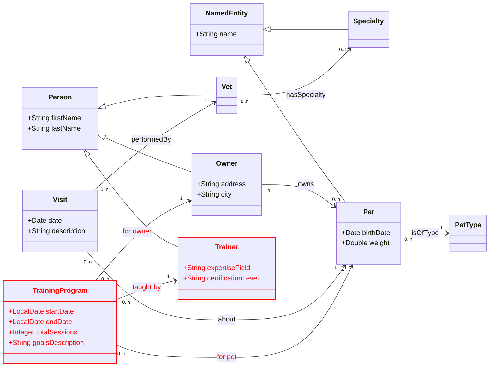

# Evaluación de Prompt

**Proveedor IA:** GEMINI
**Ejercicio:** TEST-ATTRIBUTES-CODE-GENERATION
**Dominio:** PETCLINIC
**Fecha:** 4/6/2026, 23:26:38

## Índice
- [1. Contexto Oculto](#1-contexto-oculto)
- [2. Examen Seleccionado](#2-examen-seleccionado)
- [3. Prompt Visible](#3-prompt-visible)
- [4. Respuesta](#4-respuesta)

---

## 1. Contexto Oculto


=== PAQUETES DE LA PLANTILLA DEL PROYECTO ===
org.springframework.samples.petclinic.user
org.springframework.samples.petclinic.model
org.springframework.samples.petclinic.exceptions

REGLA CRÍTICA DE IMPORTS:
- Usa EXACTAMENTE estos paquetes para las clases que NO son base.
- Paquete raíz: org.springframework.samples.petclinic
- El paquete de ESTE test (Test1.java) debe ser: org.springframework.samples.petclinic;

=== CÓDIGO FUENTE REAL ===
package org.springframework.samples.petclinic.trainer;
import org.springframework.samples.petclinic.person.Person;
@Getter
@Setter
@Table(name = "trainers")
public class Trainer extends Person {
    String expertiseField;
    String certificationLevel;
}

// ---

package org.springframework.samples.petclinic.trainer;
public interface TrainerRepository {
    Optional<Trainer> findById(Integer id);
    List<Trainer> findAll();
    Trainer save(Trainer trainer);
}

// ---

package org.springframework.samples.petclinic.trainer;
public class TrainerService {
    TrainerRepository trainerRepository;
    public TrainerService(TrainerRepository trainerRepository) {
        this.trainerRepository = trainerRepository;
    }
}

// ---

package org.springframework.samples.petclinic.trainingprogram;
import org.springframework.samples.petclinic.owner.Owner;
import org.springframework.samples.petclinic.pet.Pet;
import org.springframework.samples.petclinic.trainer.Trainer;
@Getter
@Setter
@Table(name = "training_programs")
public class TrainingProgram {
    LocalDate startDate;
    LocalDate endDate;
    Integer totalSessions;
    String goalsDescription;
    @Transient
    Trainer trainer;
    @Transient
    Pet pet;
    @Transient
    Owner owner;
}

// ---

package org.springframework.samples.petclinic.trainingprogram;
public interface TrainingProgramRepository {
    Optional<TrainingProgram> findById(Integer id);
    List<TrainingProgram> findAll();
    TrainingProgram save(TrainingProgram trainingProgram);
}

// ---

package org.springframework.samples.petclinic.trainingprogram;
public class TrainingProgramService {
    TrainingProgramRepository trainingProgramRepository;
    public TrainingProgramService(TrainingProgramRepository trainingProgramRepository) {
        this.trainingProgramRepository = trainingProgramRepository;
    }
}

=== ENUNCIADO ===
En este ejercicio, añadiremos la funcionalidad de gestión de programas de entrenamiento y comportamiento para mascotas. Concretamente, se proporcionan las clases “Pet” y “Owner”, que representan a las mascotas registradas en la clínica y a sus propietarios, respectivamente. Además, tendremos la clase “Trainer”, que representa a los especialistas en entrenamiento y modificación de comportamiento animal, y la clase “TrainingProgram”, que registra los planes de entrenamiento personalizados para las mascotas. La clase Trainer, que extiende la clase Person, incluirá los atributos `expertiseField`, para describir su área de especialización (por ejemplo, "obediencia básica", "modificación de agresión"), y `certificationLevel`, para indicar su nivel de acreditación profesional. La clase TrainingProgram incluirá `startDate` y `endDate` para el periodo del programa, `totalSessions` para el número de sesiones planificadas y una `goalsDescription` detallando los objetivos de comportamiento a alcanzar. Se establecerá una relación que indica qué Trainer imparte los programas de entrenamiento, y a qué Pet y Owner están destinados estos programas.

Realizaremos una serie de ejercicios basados en funcionalidades que implementaremos en el sistema, y validaremos mediante pruebas unitarias.



=== REGLAS A EVALUAR (RESTRICCIONES / RELACIONES) ===
Modificar las clases “Trainer” y “TrainingProgram” para que sean entidades. Estas deben tener los siguientes atributos y restricciones:

Para la clase Trainer:
- El atributo de tipo entero (Integer) llamado “id” actuará como clave primaria en la tabla de la base de datos relacional asociada a la entidad.
- El atributo de tipo cadena de caracteres (String) llamado “expertiseField” obligatorio (no puede ser nulo), que debe tener una longitud mínima de 5 caracteres y máxima de 100 y que no puede estar formada por caracteres vacíos (espacios, tabuladores, etc.).
- El atributo de tipo cadena de caracteres (String) llamado “certificationLevel” obligatorio que únicamente podrá tomar tres valores: “BEGINNER”, “INTERMEDIATE”, “ADVANCED”.

Para la clase TrainingProgram:
- El atributo de tipo entero (Integer) llamado “id” actuará como clave primaria en la tabla de la base de datos relacional asociada a la entidad.
- El atributo de tipo fecha (LocalDate) llamado “startDate”, que representa la fecha de inicio del programa. Seguirá el formato “dd/MM/yyyy”. Este atributo debe ser obligatorio.
- El atributo de tipo fecha (LocalDate) llamado “endDate”, que representa la fecha de finalización del programa. Seguirá el formato “dd/MM/yyyy”. Este atributo debe ser obligatorio.
- El atributo de tipo entero (Integer) llamado “totalSessions” obligatorio, que representa el número total de sesiones planificadas. Este atributo tendrá un valor mínimo de 1 y un valor máximo de 50.
- El atributo de tipo cadena de caracteres (String) llamado “goalsDescription” opcional, que, si toma valor, debe tener una longitud mínima de 10 caracteres y máxima de 500 y no puede estar formada por caracteres vacíos (espacios, tabuladores, etc.).

No modifique por ahora las anotaciones @Transient de las clases. Modificar las interfaces “TrainerRepository” y “TrainingProgramRepository” alojada en el mismo paquete para que extienda a CrudRepository.


---

## 2. Examen Seleccionado
En este ejercicio, añadiremos la funcionalidad de gestión de programas de entrenamiento y comportamiento para mascotas. Concretamente, se proporcionan las clases “Pet” y “Owner”, que representan a las mascotas registradas en la clínica y a sus propietarios, respectivamente. Además, tendremos la clase “Trainer”, que representa a los especialistas en entrenamiento y modificación de comportamiento animal, y la clase “TrainingProgram”, que registra los planes de entrenamiento personalizados para las mascotas. La clase Trainer, que extiende la clase Person, incluirá los atributos `expertiseField`, para describir su área de especialización (por ejemplo, "obediencia básica", "modificación de agresión"), y `certificationLevel`, para indicar su nivel de acreditación profesional. La clase TrainingProgram incluirá `startDate` y `endDate` para el periodo del programa, `totalSessions` para el número de sesiones planificadas y una `goalsDescription` detallando los objetivos de comportamiento a alcanzar. Se establecerá una relación que indica qué Trainer imparte los programas de entrenamiento, y a qué Pet y Owner están destinados estos programas.

Realizaremos una serie de ejercicios basados en funcionalidades que implementaremos en el sistema, y validaremos mediante pruebas unitarias.


---

## 3. Prompt Visible
Nuestra misión es generar el test de un examen de la asignatura "Diseño y Pruebas". Actuamos como profesores evaluando conocimientos de JPA y mapeo objeto-relacional. Te proporcionaré el enunciado, el diagrama UML en Mermaid y, **CRÍTICAMENTE, el Código Base de las clases ya generadas**.

Por favor, no uses Wildcard Imports (asteriscos). Genera todos los imports de forma explícita, uno por cada clase utilizada. IMPORTANTE CENTRARSE EN LAS CLASES QUE SE PROPORCIONA COMO CÓDIGO BASE, DE SU LOCALIZACIÓN PARA PODER PONER CORRECTAMENTE LOS IMPORTS DE DONDE SE SACAN LAS CLASES.

---

## REGLA ABSOLUTA — PAQUETES: LEE EL CÓDIGO BASE, EVITA INVENTAR

Esta es la regla más importante del prompt. Debes seguirla antes que cualquier otra cosa.
Además, para las clases que no estén implementadas en el código base, buscarla en el repositorio pasado, como Pet, viene de pet.Pet

**Procedimiento obligatorio antes de escribir un solo import:**

1. Localiza la sección `=== PAQUETES DE LA PLANTILLA DEL PROYECTO ===` del contexto. En ella se te especificará la estructura de los paquetes a importar.
2. Para cada clase que necesites importar, busca su `package` en el código base proporcionado.
3. Construye el import como: `import <package_de_esa_clase>.<NombreClase>;`

- Deberás tener cuidado y poner los nombres de las clases nueva generadas, ya que no siempre es Achievement; deberás coger las clases del contexto que se te proporciona de la extensión funcional.

**Ejemplo concreto:**

- Si el código base de `Achievement.java` empieza con `package es.us.dp1.chess.tournament.achievement;`
- El import correcto en el test es: `import es.us.dp1.chess.tournament.achievement.Achievement;`
- Teniendo en cuenta las mayúsculas y minúsculas de las clases para evitar el error en los tests
- NUNCA: `import org.springframework.samples.chessgame.model.Achievement;`
- NUNCA: `import org.springframework.samples.petClinic.model.Achievement;`

**Aplica lo mismo para `@ComponentScan`:**
Al definir los paquetes, SIEMPRE poner los paquetes individuales necesarios, evitar globalizar en uno todo:

- CORRECTO: `@ComponentScan(basePackages = {"es.us.dp1.chess.tournament.achievement", "es.us.dp1.chess.tournament.userAchievement"})`
- INCORRECTO: `@ComponentScan(basePackages = {"org.springframework.samples.chessgame.repository", "org.springframework.samples.chessgame.model"})`
- INCORRECTO: `@ComponentScan(basePackages = {"es.us.dp1.chess.tournament"})`

**El paquete del propio test (`package ...` en la primera línea) también debe derivarse del código base**, usando el prefijo de donde se crean los test. Ejemplo: si el prefijo raíz es `es.us.dp1.chess.tournament`, el paquete del test será `es.us.dp1.chess.tournament`.

Si una clase (como `ReflexiveTest`, `NamedEntity`, etc.) no aparece en el código base proporcionado, usa el mismo prefijo raíz detectado para inferir su paquete. Nunca uses `org.springframework.samples.*` salvo que ese prefijo aparezca explícitamente en el código base.

Para las diferentes comprobaciones, vamos a llamar a los métodos que nos proporciona la clase ReflexiveTest que te paso dentro del archivo `test_previous_exams`. **IMPORTANTE:** tienes que llamar con el MISMO NOMBRE a los métodos que utilices, además de pasarle los MISMOS tipos de argumentos que pide cada método. A continuación, te proporciono una lista con todos los métodos disponibles y sus correspondientes argumentos necesarios. Los analizarás todos para usarlos correctamente en el test:

```java
void checkThatFieldIsAnnotatedWithDateTimeFormat(Class aClass, String fieldname,String format)

void checkThatFieldIsAnnotatedWith(Class aClass, String fieldname,Class annotationClass)

boolean  isFieldAnnotatedWith(Class aClass, String fieldname,Class annotationClass) throws NoSuchFieldException, SecurityException

boolean classIsAnnotatedWith(Class class1, Class class2)

boolean classHasMethod(Object targetObject, String methodName, Class<?> ... parameterTypes)

void checkThatFieldsAreMandatory(Object validEntity,EntityManager em,String ... fieldnames )

void checkThatFieldIsMandatory(Object validEntity,String fieldname,Class<?> type,EntityManager em)

void checkThatValuesAreNotValid(Object validEntity,Map<String,List<Object>> invalidValues,EntityManager em)

void checkThatValueIsNotValid(Object validEntity,String fieldname,Object value,Class<?> type, EntityManager em)

Object setValue(Object object,String fieldname,Class<?> type, Object value)

Object invokeMethodReflexivelyWithParamTypes(Object targetObject, String methodName, Class<?>[] parameterTypes,Object ... parameterValues)

Object invokeMethodReflexively(Object o, String methodName, Object ... params)

void checkLinkedById(Class myClass,Integer id1,String methodName,Integer id2,EntityManager em)

Object getFieldValueReflexively(Object o, String fieldName)

void checkTransactional(Class<?> myClass,String methodName, Class<?>... parameterTypes)

boolean isMethodAnnotatedWithTest(Method method)

boolean isMethodAnnotatedWithBeforeEach(Method method)

boolean isMethodAnnotatedWithAfterEach(Method method)

void checkTransactionalRollback(Class<?> myClass,String methodName,Class<?>[] paramTypes,Class<? extends Exception> exceptionClass)

boolean isEntity(Class<T> clazz)
```

---

## Reglas de Coherencia Adicionales

2.  **Fidelidad al Código Base:** Si una clase en el código base tiene un atributo con un nombre específico (ej. `checkInDate`), el test debe usar ese nombre exacto, ignorando lo que diga cualquier otro ejemplo externo.
3.  **Manejo de Relaciones:** Si en el Código Base una relación está marcada como `@Transient`, el test debe tratarla según las instrucciones del enunciado, pero siempre importando la clase desde su paquete real.

---

## Especificaciones del Examen

- **Clases Negras:** Núcleo estable (Contexto). No se testea su implementación interna, pero se usan para crear objetos válidos (ej. `Owner`, `Pet`).
- **Clases Rojas:** Tarea principal del alumno. Son las que debemos testear exhaustivamente (Restricciones, Anotaciones y Persistencia).
- **Límite:** Máximo 2 entidades rojas por examen.
- **Framework:** Java 17+, JUnit 5, Spring Boot (@DataJpaTest).
- **Herencia:** La clase de test DEBE extender de `ReflexiveTest` (IMPORTANTE: DEBE USARSE SI O SI ESTA CLASE PARA LA GENERACIÓN DE LOS TESTS, DEBE PONER ReflexiveTest en la parte de `extends...`)

---

## Estructura Estricta Requerida para Test1.java

### 1. Configuración e Inyección

- El nombre ESTRICTO del paquete donde se tiene que generar el test es:
  - Clínica Veterinaria: `package org.springframework.samples.petclinic`
  - Ajedrez: `package es.us.dp1.chess.tournament`
- Inyecta los Repositorios de las entidades rojas y el `EntityManager` mediante `@Autowired` (NUNCA `TestEntityManager`).
- Inyecta SIEMPRE como `@MockBean` el servicio `UserService`:

```java
    @MockBean
    private UserService userService;
```

- Usa `@ComponentScan` apuntando a los paquetes reales detectados en el Código Base (ver Regla Absoluta).
- **IMPORTANTE** los imports de las anotaciones a comprobar deberán venir de jakarta, NUNCA DE javax:
  - CORRECTO: jakarta.persistence.Column;
  - INCORRECTO: javax.persistence.Column;
- **IMPORTANTE**: Omitir crear tests estáticos, para poder usar el método `super`.

### 2. Verificación de Repositorios

Los tests que validan los repositorios, cuando extienden a CRUD Repository no es necesario validar todos los métodos que se proporcionan inicialmente en las clases base, ya que la anotación CRUD los contiene, por lo que la estructura del test sería:

```java
@Test
    void test1RepositoriesExist() {
        assertNotNull(ratingRepository, "RatingRepository should be autowired");
        assertNotNull(ratingChangeRepository, "RatingChangeRepository should be autowired");
        test1RepositoriesContainsMethod();
    }

    void test1RepositoriesContainsMethod() {
        assertTrue(
            CrudRepository.class.isAssignableFrom(RatingRepository.class),
            "RatingRepository should extend CrudRepository"
        );
        assertTrue(
            CrudRepository.class.isAssignableFrom(RatingChangeRepository.class),
            "RatingChangeRepository should extend CrudRepository"
        );
    }

```

- **test1RepositoriesExist():** Verifica `assertNotNull`. Al final, debe llamar a `test1RepositoriesContainsMethod()` solo si el repo no es nulo.
- **test1RepositoriesContainsMethod():** (SIN @Test) Verifica que el repo tiene el método `.count()` o similar mediante reflexión/interfaz.

### 3. Validación de Restricciones (Constraints)

- **test1Check[NOMBRE_ENTIDAD]Constraints():**
  - Invoca `checkThatFieldsAreMandatory` con los campos `NotNull/NotBlank` identificados.
  - Crea el mapa `invalidValues` usando `Map.of(...)`. **PROHIBIDO usar `new HashMap()`**.
  - Los valores de prueba deben ser coherentes con el tipo de dato del Código Base (si es `Double`, usa `0.0`; si es `Integer`, `0`).
  - Invoca `checkThatValuesAreNotValid`.
  - En atributos que sean de tipo Double, NUNCA PONER `columnDefinition = "double(5,2)"` ya que dará error. La forma correcta es por ejemplo: `@Column(name = "cost")`

### 4. Verificación de Anotaciones

- **test1Check[NOMBRE_ENTIDAD]Annotations():**
  - Verifica `@Entity` con `classIsAnnotatedWith`.
  - Verifica `@Enumerated(EnumType.STRING)` si hay Enums.
  - Verifica `@Size`, `@Positive`, `@FutureOrPresent`, etc., según el UML.

### 5. Métodos Auxiliares y Persistencia

- **createValid[NOMBRE_ENTIDAD](EntityManager em):** Método estático que construye una instancia válida.
- **IMPORTANTE:** Usa EXCLUSIVAMENTE `setValue(objeto, "atributo", Tipo.class, valor)` para asignar datos, evitando fallos si no existen setters.
- **test1Valid[NOMBRE_ENTIDAD]IsPersisted():** Verifica que `repo.save()` no lanza excepciones (`assertDoesNotThrow`) y haz `.flush()`.
- Todos los métodos auxiliares que sean necesarios deberán crearse en la misma clase, el test DEBE ser autosuficiente.
- Al crear alguna entidad válida en un método auxiliar, SIEMPRE crear primero los objetos padre, es decir, si un Pet tiene un Owner, primero se deberá crear el Owner y después el Pet. Esto evitará errores de persistencia.

---

## Restricciones de Salida (Formato)

- **PROHIBIDO** generar comentarios explicativos.
- **PROHIBIDO** envolver el código en bloques de código markdown (sin \`\`\`java).
- **PROHIBIDO** incluir texto antes o después del código.
- Entrega el código listo para ser copiado y pegado en un archivo `.java`.

---

## 4. Respuesta
package org.springframework.samples.petclinic;

import org.junit.jupiter.api.Test;
import org.springframework.beans.factory.annotation.Autowired;
import org.springframework.boot.test.autoconfigure.orm.jpa.DataJpaTest;
import org.springframework.context.annotation.ComponentScan;
import org.springframework.data.repository.CrudRepository;
import org.springframework.samples.petclinic.trainer.Trainer;
import org.springframework.samples.petclinic.trainer.TrainerRepository;
import org.springframework.samples.petclinic.trainingprogram.TrainingProgram;
import org.springframework.samples.petclinic.trainingprogram.TrainingProgramRepository;
import org.springframework.samples.petclinic.user.UserService;
import org.springframework.boot.test.mock.mockito.MockBean;

import jakarta.persistence.Column;
import jakarta.persistence.Entity;
import jakarta.persistence.EntityManager;
import jakarta.persistence.GeneratedValue;
import jakarta.persistence.GenerationType;
import jakarta.persistence.Id;
import jakarta.persistence.Table;
import jakarta.validation.constraints.Max;
import jakarta.validation.constraints.Min;
import jakarta.validation.constraints.NotBlank;
import jakarta.validation.constraints.NotNull;
import jakarta.validation.constraints.Pattern;
import jakarta.validation.constraints.Size;

import java.time.LocalDate;
import java.util.List;
import java.util.Map;

import static org.junit.jupiter.api.Assertions.assertNotNull;
import static org.junit.jupiter.api.Assertions.assertTrue;
import static org.junit.jupiter.api.Assertions.assertDoesNotThrow;

public class Test1 extends ReflexiveTest {

    @Autowired
    private TrainerRepository trainerRepository;

    @Autowired
    private TrainingProgramRepository trainingProgramRepository;

    @Autowired
    private EntityManager entityManager;

    @MockBean
    private UserService userService;

    @Test
    void test1RepositoriesExist() {
        assertNotNull(trainerRepository, "TrainerRepository should be autowired");
        assertNotNull(trainingProgramRepository, "TrainingProgramRepository should be autowired");
        test1RepositoriesContainsMethod();
    }

    void test1RepositoriesContainsMethod() {
        assertTrue(
            CrudRepository.class.isAssignableFrom(TrainerRepository.class),
            "TrainerRepository should extend CrudRepository"
        );
        assertTrue(
            CrudRepository.class.isAssignableFrom(TrainingProgramRepository.class),
            "TrainingProgramRepository should extend CrudRepository"
        );
        assertTrue(classHasMethod(trainerRepository, "findById", Integer.class), "TrainerRepository should have findById method");
        assertTrue(classHasMethod(trainerRepository, "findAll"), "TrainerRepository should have findAll method");
        assertTrue(classHasMethod(trainerRepository, "save", Trainer.class), "TrainerRepository should have save method");

        assertTrue(classHasMethod(trainingProgramRepository, "findById", Integer.class), "TrainingProgramRepository should have findById method");
        assertTrue(classHasMethod(trainingProgramRepository, "findAll"), "TrainingProgramRepository should have findAll method");
        assertTrue(classHasMethod(trainingProgramRepository, "save", TrainingProgram.class), "TrainingProgramRepository should have save method");
    }

    @Test
    void test1CheckTrainerAnnotations() throws NoSuchFieldException, SecurityException {
        Class<Trainer> trainerClass = Trainer.class;

        assertTrue(classIsAnnotatedWith(trainerClass, Entity.class), "Trainer class should be annotated with @Entity");
        assertTrue(classIsAnnotatedWith(trainerClass, Table.class), "Trainer class should be annotated with @Table");
        Table trainerTable = trainerClass.getAnnotation(Table.class);
        assertNotNull(trainerTable, "Trainer class should have @Table annotation");
        assertTrue("trainers".equals(trainerTable.name()), "Table name for Trainer should be 'trainers'");

        assertTrue(isFieldAnnotatedWith(trainerClass, "id", Id.class), "id field should be annotated with @Id");
        assertTrue(isFieldAnnotatedWith(trainerClass, "id", GeneratedValue.class), "id field should be annotated with @GeneratedValue");
        GeneratedValue idGeneratedValue = trainerClass.getDeclaredField("id").getAnnotation(GeneratedValue.class);
        assertNotNull(idGeneratedValue, "id field should have @GeneratedValue annotation");
        assertTrue(GenerationType.IDENTITY.equals(idGeneratedValue.strategy()), "GeneratedValue strategy for id should be IDENTITY");
        assertTrue(isFieldAnnotatedWith(trainerClass, "id", Column.class), "id field should be annotated with @Column");

        assertTrue(isFieldAnnotatedWith(trainerClass, "expertiseField", Column.class), "expertiseField should be annotated with @Column");
        assertTrue(isFieldAnnotatedWith(trainerClass, "expertiseField", NotBlank.class), "expertiseField should be annotated with @NotBlank");
        assertTrue(isFieldAnnotatedWith(trainerClass, "expertiseField", Size.class), "expertiseField should be annotated with @Size");
        Size expertiseFieldSize = trainerClass.getDeclaredField("expertiseField").getAnnotation(Size.class);
        assertNotNull(expertiseFieldSize, "expertiseField should have @Size annotation");
        assertTrue(expertiseFieldSize.min() == 5, "expertiseField Size min should be 5");
        assertTrue(expertiseFieldSize.max() == 100, "expertiseField Size max should be 100");

        assertTrue(isFieldAnnotatedWith(trainerClass, "certificationLevel", Column.class), "certificationLevel should be annotated with @Column");
        assertTrue(isFieldAnnotatedWith(trainerClass, "certificationLevel", NotBlank.class), "certificationLevel should be annotated with @NotBlank");
        assertTrue(isFieldAnnotatedWith(trainerClass, "certificationLevel", Pattern.class), "certificationLevel should be annotated with @Pattern");
        Pattern certificationLevelPattern = trainerClass.getDeclaredField("certificationLevel").getAnnotation(Pattern.class);
        assertNotNull(certificationLevelPattern, "certificationLevel should have @Pattern annotation");
        assertTrue("BEGINNER|INTERMEDIATE|ADVANCED".equals(certificationLevelPattern.regexp()), "certificationLevel Pattern should match 'BEGINNER|INTERMEDIATE|ADVANCED'");
    }

    @Test
    void test1CheckTrainingProgramAnnotations() throws NoSuchFieldException, SecurityException {
        Class<TrainingProgram> trainingProgramClass = TrainingProgram.class;

        assertTrue(classIsAnnotatedWith(trainingProgramClass, Entity.class), "TrainingProgram class should be annotated with @Entity");
        assertTrue(classIsAnnotatedWith(trainingProgramClass, Table.class), "TrainingProgram class should be annotated with @Table");
        Table trainingProgramTable = trainingProgramClass.getAnnotation(Table.class);
        assertNotNull(trainingProgramTable, "TrainingProgram class should have @Table annotation");
        assertTrue("training_programs".equals(trainingProgramTable.name()), "Table name for TrainingProgram should be 'training_programs'");

        assertTrue(isFieldAnnotatedWith(trainingProgramClass, "id", Id.class), "id field should be annotated with @Id");
        assertTrue(isFieldAnnotatedWith(trainingProgramClass, "id", GeneratedValue.class), "id field should be annotated with @GeneratedValue");
        GeneratedValue idGeneratedValue = trainingProgramClass.getDeclaredField("id").getAnnotation(GeneratedValue.class);
        assertNotNull(idGeneratedValue, "id field should have @GeneratedValue annotation");
        assertTrue(GenerationType.IDENTITY.equals(idGeneratedValue.strategy()), "GeneratedValue strategy for id should be IDENTITY");
        assertTrue(isFieldAnnotatedWith(trainingProgramClass, "id", Column.class), "id field should be annotated with @Column");

        assertTrue(isFieldAnnotatedWith(trainingProgramClass, "startDate", Column.class), "startDate should be annotated with @Column");
        assertTrue(isFieldAnnotatedWith(trainingProgramClass, "startDate", NotNull.class), "startDate should be annotated with @NotNull");
        checkThatFieldIsAnnotatedWithDateTimeFormat(trainingProgramClass, "startDate", "dd/MM/yyyy");

        assertTrue(isFieldAnnotatedWith(trainingProgramClass, "endDate", Column.class), "endDate should be annotated with @Column");
        assertTrue(isFieldAnnotatedWith(trainingProgramClass, "endDate", NotNull.class), "endDate should be annotated with @NotNull");
        checkThatFieldIsAnnotatedWithDateTimeFormat(trainingProgramClass, "endDate", "dd/MM/yyyy");

        assertTrue(isFieldAnnotatedWith(trainingProgramClass, "totalSessions", Column.class), "totalSessions should be annotated with @Column");
        assertTrue(isFieldAnnotatedWith(trainingProgramClass, "totalSessions", NotNull.class), "totalSessions should be annotated with @NotNull");
        assertTrue(isFieldAnnotatedWith(trainingProgramClass, "totalSessions", Min.class), "totalSessions should be annotated with @Min");
        Min totalSessionsMin = trainingProgramClass.getDeclaredField("totalSessions").getAnnotation(Min.class);
        assertNotNull(totalSessionsMin, "totalSessions should have @Min annotation");
        assertTrue(totalSessionsMin.value() == 1, "totalSessions Min should be 1");
        assertTrue(isFieldAnnotatedWith(trainingProgramClass, "totalSessions", Max.class), "totalSessions should be annotated with @Max");
        Max totalSessionsMax = trainingProgramClass.getDeclaredField("totalSessions").getAnnotation(Max.class);
        assertNotNull(totalSessionsMax, "totalSessions should have @Max annotation");
        assertTrue(totalSessionsMax.value() == 50, "totalSessions Max should be 50");

        assertTrue(isFieldAnnotatedWith(trainingProgramClass, "goalsDescription", Column.class), "goalsDescription should be annotated with @Column");
        assertTrue(isFieldAnnotatedWith(trainingProgramClass, "goalsDescription", Size.class), "goalsDescription should be annotated with @Size");
        Size goalsDescriptionSize = trainingProgramClass.getDeclaredField("goalsDescription").getAnnotation(Size.class);
        assertNotNull(goalsDescriptionSize, "goalsDescription should have @Size annotation");
        assertTrue(goalsDescriptionSize.min() == 10, "goalsDescription Size min should be 10");
        assertTrue(goalsDescriptionSize.max() == 500, "goalsDescription Size max should be 500");
    }

    @Test
    void test1CheckTrainerConstraints() {
        Trainer trainer = createValidTrainer(entityManager);

        checkThatFieldsAreMandatory(trainer, entityManager, "expertiseField", "certificationLevel");

        Map<String, List<Object>> expertiseFieldInvalidValues = Map.of(
            "expertiseField", List.of(
                null,
                "",
                "   ",
                "abc",
                "a".repeat(101)
            )
        );
        checkThatValuesAreNotValid(trainer, expertiseFieldInvalidValues, entityManager);

        Map<String, List<Object>> certificationLevelInvalidValues = Map.of(
            "certificationLevel", List.of(
                null,
                "",
                "   ",
                "INVALID",
                "beginner",
                "ADVANCED "
            )
        );
        checkThatValuesAreNotValid(trainer, certificationLevelInvalidValues, entityManager);
    }

    @Test
    void test1CheckTrainingProgramConstraints() {
        TrainingProgram trainingProgram = createValidTrainingProgram(entityManager);

        checkThatFieldsAreMandatory(trainingProgram, entityManager, "startDate", "endDate", "totalSessions");

        Map<String, List<Object>> startDateInvalidValues = Map.of(
            "startDate", List.of(
                null
            )
        );
        checkThatValuesAreNotValid(trainingProgram, startDateInvalidValues, entityManager);

        Map<String, List<Object>> endDateInvalidValues = Map.of(
            "endDate", List.of(
                null
            )
        );
        checkThatValuesAreNotValid(trainingProgram, endDateInvalidValues, entityManager);

        Map<String, List<Object>> totalSessionsInvalidValues = Map.of(
            "totalSessions", List.of(
                null,
                0,
                51
            )
        );
        checkThatValuesAreNotValid(trainingProgram, totalSessionsInvalidValues, entityManager);

        assertDoesNotThrow(() -> {
            Object tempProgram = createValidTrainingProgram(entityManager);
            setValue(tempProgram, "goalsDescription", String.class, null);
            checkThatFieldsAreMandatory(tempProgram, entityManager);
        }, "goalsDescription should be optional (null is valid)");

        Object tempProgramForInvalidDescription = createValidTrainingProgram(entityManager);
        checkThatValueIsNotValid(tempProgramForInvalidDescription, "goalsDescription", "", String.class, entityManager);
        checkThatValueIsNotValid(tempProgramForInvalidDescription, "goalsDescription", "   ", String.class, entityManager);
        checkThatValueIsNotValid(tempProgramForInvalidDescription, "goalsDescription", "short", String.class, entityManager);
        checkThatValueIsNotValid(tempProgramForInvalidDescription, "goalsDescription", "a".repeat(501), String.class, entityManager);
    }

    @Test
    void test1ValidTrainerIsPersisted() {
        Trainer trainer = createValidTrainer(entityManager);
        assertDoesNotThrow(() -> {
            trainerRepository.save(trainer);
            entityManager.flush();
        }, "Valid Trainer should be persisted without exceptions");
    }

    @Test
    void test1ValidTrainingProgramIsPersisted() {
        TrainingProgram trainingProgram = createValidTrainingProgram(entityManager);
        assertDoesNotThrow(() -> {
            trainingProgramRepository.save(trainingProgram);
            entityManager.flush();
        }, "Valid TrainingProgram should be persisted without exceptions");
    }

    private Trainer createValidTrainer(EntityManager em) {
        Trainer trainer = new Trainer();
        setValue(trainer, "firstName", String.class, "John");
        setValue(trainer, "lastName", String.class, "Doe");
        setValue(trainer, "expertiseField", String.class, "Basic Obedience");
        setValue(trainer, "certificationLevel", String.class, "INTERMEDIATE");
        return trainer;
    }

    private TrainingProgram createValidTrainingProgram(EntityManager em) {
        TrainingProgram program = new TrainingProgram();
        setValue(program, "startDate", LocalDate.class, LocalDate.of(2023, 1, 1));
        setValue(program, "endDate", LocalDate.class, LocalDate.of(2023, 1, 31));
        setValue(program, "totalSessions", Integer.class, 10);
        setValue(program, "goalsDescription", String.class, "Improve basic obedience and recall skills.");
        return program;
    }
}