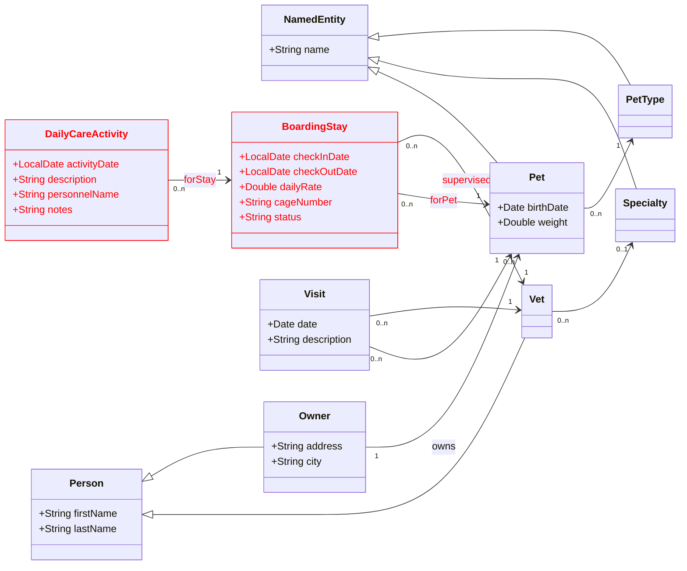

# Evaluación de Prompt

**Proveedor IA:** GEMINI
**Ejercicio:** TEST-ATTRIBUTES-CODE-GENERATION
**Dominio:** PETCLINIC
**Fecha:** 12/6/2026, 1:10:54

## Índice
- [1. Contexto Oculto](#1-contexto-oculto)
- [2. Examen Seleccionado](#2-examen-seleccionado)
- [3. Prompt Visible](#3-prompt-visible)
- [4. Respuesta](#4-respuesta)

---

## 1. Contexto Oculto


=== PAQUETES DE LA PLANTILLA DEL PROYECTO ===
org.springframework.samples.petclinic.user
org.springframework.samples.petclinic.model
org.springframework.samples.petclinic.exceptions

REGLA CRÍTICA DE IMPORTS:
- Usa EXACTAMENTE estos paquetes para las clases que NO son base.
- Paquete raíz: org.springframework.samples.petclinic
- El paquete de ESTE test (Test1.java) debe ser: org.springframework.samples.petclinic;

=== CÓDIGO FUENTE REAL ===
package org.springframework.samples.petclinic.boardingstay;
import org.springframework.samples.petclinic.pet.Pet;
import org.springframework.samples.petclinic.vet.Vet;
@Getter
@Setter
@Table(name = "boarding_stays")
public class BoardingStay {
    LocalDate checkInDate;
    LocalDate checkOutDate;
    Double dailyRate;
    String cageNumber;
    String status;
    @Transient
    Pet forPet;
    @Transient
    Vet supervisedBy;
}

// ---

package org.springframework.samples.petclinic.boardingstay;
public interface BoardingStayRepository {
    Optional<BoardingStay> findById(Integer id);
    List<BoardingStay> findAll();
    BoardingStay save(BoardingStay boardingStay);
}

// ---

package org.springframework.samples.petclinic.boardingstay;
public class BoardingStayService {
    BoardingStayRepository boardingStayRepository;
    public BoardingStayService(BoardingStayRepository boardingStayRepository) {
        this.boardingStayRepository = boardingStayRepository;
    }
    public List<BoardingStay> getAll() {
        return null;
    }
    public BoardingStay save(BoardingStay boardingStay) {
        return null;
    }
}

// ---

package org.springframework.samples.petclinic.dailycareactivity;
import org.springframework.samples.petclinic.boardingstay.BoardingStay;
@Getter
@Setter
@Table(name = "daily_care_activities")
public class DailyCareActivity {
    LocalDate activityDate;
    String description;
    String personnelName;
    String notes;
    @Transient
    BoardingStay forStay;
}

// ---

package org.springframework.samples.petclinic.dailycareactivity;
public interface DailyCareActivityRepository {
    Optional<DailyCareActivity> findById(Integer id);
    List<DailyCareActivity> findAll();
    DailyCareActivity save(DailyCareActivity dailyCareActivity);
}

// ---

package org.springframework.samples.petclinic.dailycareactivity;
public class DailyCareActivityService {
    DailyCareActivityRepository dailyCareActivityRepository;
    public DailyCareActivityService(DailyCareActivityRepository dailyCareActivityRepository) {
        this.dailyCareActivityRepository = dailyCareActivityRepository;
    }
    public List<DailyCareActivity> getAll() {
        return null;
    }
    public DailyCareActivity save(DailyCareActivity dailyCareActivity) {
        return null;
    }
}

=== ENUNCIADO ===
En este ejercicio, añadiremos la funcionalidad de gestión de estancias de mascotas en la clínica para servicios de guardería o internado. Concretamente, tendremos la clase “BoardingStay” que representa el registro de una estancia de una mascota en la clínica, incluyendo la fecha de entrada, la fecha de salida, la tarifa diaria, el número de jaula o alojamiento asignado y el estado actual de la estancia. Además, tendremos la clase “DailyCareActivity” que registrará las actividades de cuidado realizadas diariamente para las mascotas durante su estancia, como la fecha de la actividad, una descripción de lo realizado, el nombre del personal que la llevó a cabo y cualquier nota relevante.

Cada estancia de guardería se asociará con la mascota a la que se le aplica y con el veterinario responsable de supervisar dicha estancia. A su vez, cada actividad de cuidado diario estará vinculada a una estancia de guardería específica.

Realizaremos una serie de ejercicios basados en funcionalidades que implementaremos en el sistema, y validaremos mediante pruebas unitarias.



=== REGLAS A EVALUAR (RESTRICCIONES / RELACIONES) ===
Modificar las clases “BoardingStay” y “DailyCareActivity” para que sean entidades. Estas clases están alojadas en el paquete “org.springframework.samples.petclinic.boarding”, y deben tener los siguientes atributos y restricciones:

**Para ambas clases:**

- El atributo de tipo entero (Integer) llamado “id” actuará como clave primaria en la tabla de la base de datos relacional asociada a la entidad.

**Para la clase BoardingStay:**

- El atributo de tipo fecha (LocalDate) llamado “checkInDate”, que representa la fecha de entrada de la mascota a la estancia. Seguirá el formato “dd/MM/yyyy” (puede usar como ejemplo la clase Pet y su fecha de nacimiento para ver cómo se especificar dicho formato, pero nótese que el patrón del formato es distinto). Este atributo debe ser obligatorio.
- El atributo de tipo fecha (LocalDate) llamado “checkOutDate”, que representa la fecha de salida de la mascota de la estancia. Seguirá el formato “dd/MM/yyyy”. Este atributo debe ser obligatorio.
- El atributo de tipo doble (Double) llamado “dailyRate”, que representa la tarifa diaria de la estancia. Este atributo será obligatorio y tendrá un valor mínimo de 0.01 y un valor máximo de 500.00.
- El atributo de tipo cadena de caracteres (String) llamado “cageNumber” obligatorio (no puede ser nulo), que representa el número de jaula o alojamiento asignado. Debe tener una longitud mínima de 3 caracteres y máxima de 10 y que no puede estar formada por caracteres vacíos (espacios, tabuladores, etc.).
- El atributo de tipo cadena caracteres (String) llamado “status” obligatorio que únicamente podrá tomar cuatro valores: “PENDING”, “IN_PROGRESS”, “COMPLETED”, “CANCELLED”.

**Para la clase DailyCareActivity:**

- El atributo de tipo fecha (LocalDate) llamado “activityDate”, que representa la fecha en que se realizó la actividad de cuidado. Seguirá el formato “dd/MM/yyyy”. Este atributo debe ser obligatorio.
- El atributo de tipo cadena de caracteres (String) llamado “description” obligatorio (no puede ser nulo), que describe la actividad realizada. Debe tener una longitud mínima de 10 caracteres y máxima de 255 y que no puede estar formada por caracteres vacíos (espacios, tabuladores, etc.).
- El atributo de tipo cadena de caracteres (String) llamado “personnelName” obligatorio (no puede ser nulo), que representa el nombre del personal que llevó a cabo la actividad. Debe tener una longitud mínima de 3 caracteres y máxima de 50 y que no puede estar formada por caracteres vacíos (espacios, tabuladores, etc.).
- El atributo de tipo cadena caracteres (String) llamado “notes” opcional, para registrar cualquier nota relevante sobre la actividad. Tendrá una longitud mínima de 5 caracteres y máxima de 500.

No modifique por ahora las anotaciones @Transient de las clases. Modificar las interfaces “BoardingStayRepository” y “DailyCareActivityRepository” alojadas en el mismo paquete para que extienda a CrudRepository. No olvide especificar sus parámetros de tipo.


---

## 2. Examen Seleccionado
En este ejercicio, añadiremos la funcionalidad de gestión de estancias de mascotas en la clínica para servicios de guardería o internado. Concretamente, tendremos la clase “BoardingStay” que representa el registro de una estancia de una mascota en la clínica, incluyendo la fecha de entrada, la fecha de salida, la tarifa diaria, el número de jaula o alojamiento asignado y el estado actual de la estancia. Además, tendremos la clase “DailyCareActivity” que registrará las actividades de cuidado realizadas diariamente para las mascotas durante su estancia, como la fecha de la actividad, una descripción de lo realizado, el nombre del personal que la llevó a cabo y cualquier nota relevante.

Cada estancia de guardería se asociará con la mascota a la que se le aplica y con el veterinario responsable de supervisar dicha estancia. A su vez, cada actividad de cuidado diario estará vinculada a una estancia de guardería específica.

Realizaremos una serie de ejercicios basados en funcionalidades que implementaremos en el sistema, y validaremos mediante pruebas unitarias.


---

## 3. Prompt Visible
Nuestra misión es generar el test de un examen de la asignatura "Diseño y Pruebas". Actuamos como profesores evaluando conocimientos de JPA y mapeo objeto-relacional. Te proporcionaré el enunciado, el diagrama UML en Mermaid y, **CRÍTICAMENTE, el Código Base de las clases ya generadas**.

Por favor, no uses Wildcard Imports (asteriscos). Genera todos los imports de forma explícita, uno por cada clase utilizada. IMPORTANTE CENTRARSE EN LAS CLASES QUE SE PROPORCIONA COMO CÓDIGO BASE, DE SU LOCALIZACIÓN PARA PODER PONER CORRECTAMENTE LOS IMPORTS DE DONDE SE SACAN LAS CLASES.

---

## REGLA ABSOLUTA — PAQUETES: LEE EL CÓDIGO BASE, EVITA INVENTAR

Esta es la regla más importante del prompt. Debes seguirla antes que cualquier otra cosa.
Además, para las clases que no estén implementadas en el código base, buscarla en el repositorio pasado, como Pet, viene de pet.Pet

**Procedimiento obligatorio antes de escribir un solo import:**

1. Localiza la sección `=== PAQUETES DE LA PLANTILLA DEL PROYECTO ===` del contexto. En ella se te especificará la estructura de los paquetes a importar.
2. Para cada clase que necesites importar, busca su `package` en el código base proporcionado.
3. Construye el import como: `import <package_de_esa_clase>.<NombreClase>;`

- Deberás tener cuidado y poner los nombres de las clases nueva generadas, ya que no siempre es Achievement; deberás coger las clases del contexto que se te proporciona de la extensión funcional.

**Ejemplo concreto:**

- Si el código base de `Achievement.java` empieza con `package es.us.dp1.chess.tournament.achievement;`
- El import correcto en el test es: `import es.us.dp1.chess.tournament.achievement.Achievement;`
- Teniendo en cuenta las mayúsculas y minúsculas de las clases para evitar el error en los tests
- NUNCA: `import org.springframework.samples.chessgame.model.Achievement;`
- NUNCA: `import org.springframework.samples.petClinic.model.Achievement;`

**Aplica lo mismo para `@ComponentScan`:**
Al definir los paquetes, SIEMPRE poner los paquetes individuales necesarios, evitar globalizar en uno todo:

- CORRECTO: `@ComponentScan(basePackages = {"es.us.dp1.chess.tournament.achievement", "es.us.dp1.chess.tournament.userAchievement"})`
- INCORRECTO: `@ComponentScan(basePackages = {"org.springframework.samples.chessgame.repository", "org.springframework.samples.chessgame.model"})`
- INCORRECTO: `@ComponentScan(basePackages = {"es.us.dp1.chess.tournament"})`

**El paquete del propio test (`package ...` en la primera línea) también debe derivarse del código base**, usando el prefijo de donde se crean los test. Ejemplo: si el prefijo raíz es `es.us.dp1.chess.tournament`, el paquete del test será `es.us.dp1.chess.tournament`.

Si una clase (como `ReflexiveTest`, `NamedEntity`, etc.) no aparece en el código base proporcionado, usa el mismo prefijo raíz detectado para inferir su paquete. Nunca uses `org.springframework.samples.*` salvo que ese prefijo aparezca explícitamente en el código base.

Para las diferentes comprobaciones, vamos a llamar a los métodos que nos proporciona la clase ReflexiveTest que te paso dentro del archivo `test_previous_exams`. **IMPORTANTE:** tienes que llamar con el MISMO NOMBRE a los métodos que utilices, además de pasarle los MISMOS tipos de argumentos que pide cada método. A continuación, te proporciono una lista con todos los métodos disponibles y sus correspondientes argumentos necesarios. Los analizarás todos para usarlos correctamente en el test:

```java
void checkThatFieldIsAnnotatedWithDateTimeFormat(Class aClass, String fieldname,String format)

void checkThatFieldIsAnnotatedWith(Class aClass, String fieldname,Class annotationClass)

boolean  isFieldAnnotatedWith(Class aClass, String fieldname,Class annotationClass) throws NoSuchFieldException, SecurityException

boolean classIsAnnotatedWith(Class class1, Class class2)

boolean classHasMethod(Object targetObject, String methodName, Class<?> ... parameterTypes)

void checkThatFieldsAreMandatory(Object validEntity,EntityManager em,String ... fieldnames )

void checkThatFieldIsMandatory(Object validEntity,String fieldname,Class<?> type,EntityManager em)

void checkThatValuesAreNotValid(Object validEntity,Map<String,List<Object>> invalidValues,EntityManager em)

void checkThatValueIsNotValid(Object validEntity,String fieldname,Object value,Class<?> type, EntityManager em)

Object setValue(Object object,String fieldname,Class<?> type, Object value)

Object invokeMethodReflexivelyWithParamTypes(Object targetObject, String methodName, Class<?>[] parameterTypes,Object ... parameterValues)

Object invokeMethodReflexively(Object o, String methodName, Object ... params)

void checkLinkedById(Class myClass,Integer id1,String methodName,Integer id2,EntityManager em)

Object getFieldValueReflexively(Object o, String fieldName)

void checkTransactional(Class<?> myClass,String methodName, Class<?>... parameterTypes)

boolean isMethodAnnotatedWithTest(Method method)

boolean isMethodAnnotatedWithBeforeEach(Method method)

boolean isMethodAnnotatedWithAfterEach(Method method)

void checkTransactionalRollback(Class<?> myClass,String methodName,Class<?>[] paramTypes,Class<? extends Exception> exceptionClass)

boolean isEntity(Class<T> clazz)
```

---

## Reglas de Coherencia Adicionales

2.  **Fidelidad al Código Base:** Si una clase en el código base tiene un atributo con un nombre específico (ej. `checkInDate`), el test debe usar ese nombre exacto, ignorando lo que diga cualquier otro ejemplo externo.
3.  **Manejo de Relaciones:** Si en el Código Base una relación está marcada como `@Transient`, el test debe tratarla según las instrucciones del enunciado, pero siempre importando la clase desde su paquete real.

---

## Especificaciones del Examen

- **Clases Negras:** Núcleo estable (Contexto). No se testea su implementación interna, pero se usan para crear objetos válidos (ej. `Owner`, `Pet`).
- **Clases Rojas:** Tarea principal del alumno. Son las que debemos testear exhaustivamente (Restricciones, Anotaciones y Persistencia).
- **Límite:** Máximo 2 entidades rojas por examen.
- **Framework:** Java 17+, JUnit 5, Spring Boot (@DataJpaTest).
- **Herencia:** La clase de test DEBE extender de `ReflexiveTest` (IMPORTANTE: DEBE USARSE SI O SI ESTA CLASE PARA LA GENERACIÓN DE LOS TESTS, DEBE PONER ReflexiveTest en la parte de `extends...`)

---

## Estructura Estricta Requerida para Test1.java

### 1. Configuración e Inyección

- El nombre ESTRICTO del paquete donde se tiene que generar el test es:
  - Clínica Veterinaria: `package org.springframework.samples.petclinic`
  - Ajedrez: `package es.us.dp1.chess.tournament`
- Inyecta los Repositorios de las entidades rojas y el `EntityManager` mediante `@Autowired` (NUNCA `TestEntityManager`).
- Inyecta SIEMPRE como `@MockBean` el servicio `UserService`:

```java
    @MockBean
    private UserService userService;
```

- Usa `@ComponentScan` apuntando a los paquetes reales detectados en el Código Base (ver Regla Absoluta).
- **IMPORTANTE** los imports de las anotaciones a comprobar deberán venir de jakarta, NUNCA DE javax:
  - CORRECTO: jakarta.persistence.Column;
  - INCORRECTO: javax.persistence.Column;
- **IMPORTANTE**: Omitir crear tests estáticos, para poder usar el método `super`.

### 2. Verificación de Repositorios

Los tests que validan los repositorios, cuando extienden a CRUD Repository no es necesario validar todos los métodos que se proporcionan inicialmente en las clases base, ya que la anotación CRUD los contiene, por lo que la estructura del test sería:

```java
@Test
    void test1RepositoriesExist() {
        assertNotNull(ratingRepository, "RatingRepository should be autowired");
        assertNotNull(ratingChangeRepository, "RatingChangeRepository should be autowired");
        test1RepositoriesContainsMethod();
    }

    void test1RepositoriesContainsMethod() {
        assertTrue(
            CrudRepository.class.isAssignableFrom(RatingRepository.class),
            "RatingRepository should extend CrudRepository"
        );
        assertTrue(
            CrudRepository.class.isAssignableFrom(RatingChangeRepository.class),
            "RatingChangeRepository should extend CrudRepository"
        );
    }

```

- **test1RepositoriesExist():** Verifica `assertNotNull`. Al final, debe llamar a `test1RepositoriesContainsMethod()` solo si el repo no es nulo.
- **test1RepositoriesContainsMethod():** (SIN @Test) Verifica que el repo tiene el método `.count()` o similar mediante reflexión/interfaz.

### 3. Validación de Restricciones (Constraints)

- **test1Check[NOMBRE_ENTIDAD]Constraints():**
  - Invoca `checkThatFieldsAreMandatory` con los campos `NotNull/NotBlank` identificados.
  - Crea el mapa `invalidValues` usando `Map.of(...)`. **PROHIBIDO usar `new HashMap()`**.
  - Los valores de prueba deben ser coherentes con el tipo de dato del Código Base (si es `Double`, usa `0.0`; si es `Integer`, `0`).
  - Invoca `checkThatValuesAreNotValid`.
  - En atributos que sean de tipo Double, NUNCA PONER `columnDefinition = "double(5,2)"` ya que dará error. La forma correcta es por ejemplo: `@Column(name = "cost")`

### 4. Verificación de Anotaciones

- **test1Check[NOMBRE_ENTIDAD]Annotations():**
  - Verifica `@Entity` con `classIsAnnotatedWith`.
  - Verifica `@Enumerated(EnumType.STRING)` si hay Enums.
  - Verifica `@Size`, `@Positive`, `@FutureOrPresent`, etc., según el UML.

### 5. Métodos Auxiliares y Persistencia

- **createValid[NOMBRE_ENTIDAD](EntityManager em):** Método estático que construye una instancia válida.
- **IMPORTANTE:** Usa EXCLUSIVAMENTE `setValue(objeto, "atributo", Tipo.class, valor)` para asignar datos, evitando fallos si no existen setters.
- **test1Valid[NOMBRE_ENTIDAD]IsPersisted():** Verifica que `repo.save()` no lanza excepciones (`assertDoesNotThrow`) y haz `.flush()`.
- Todos los métodos auxiliares que sean necesarios deberán crearse en la misma clase, el test DEBE ser autosuficiente.
- Al crear alguna entidad válida en un método auxiliar, SIEMPRE crear primero los objetos padre, es decir, si un Pet tiene un Owner, primero se deberá crear el Owner y después el Pet. Esto evitará errores de persistencia.

---

## Restricciones de Salida (Formato)

- **PROHIBIDO** generar comentarios explicativos.
- **PROHIBIDO** envolver el código en bloques de código markdown (sin \`\`\`java).
- **PROHIBIDO** incluir texto antes o después del código.
- Entrega el código listo para ser copiado y pegado en un archivo `.java`.

---

## 4. Respuesta
package org.springframework.samples.petclinic;

import org.junit.jupiter.api.Assertions;
import org.junit.jupiter.api.Test;
import org.springframework.beans.factory.annotation.Autowired;
import org.springframework.boot.test.autoconfigure.orm.jpa.DataJpaTest;
import org.springframework.boot.test.mock.mockito.MockBean;
import org.springframework.context.annotation.ComponentScan;
import org.springframework.data.repository.CrudRepository;
import org.springframework.samples.petclinic.boardingstay.BoardingStay;
import org.springframework.samples.petclinic.boardingstay.BoardingStayRepository;
import org.springframework.samples.petclinic.dailycareactivity.DailyCareActivity;
import org.springframework.samples.petclinic.dailycareactivity.DailyCareActivityRepository;
import org.springframework.samples.petclinic.owner.Owner;
import org.springframework.samples.petclinic.pet.Pet;
import org.springframework.samples.petclinic.pet.PetType;
import org.springframework.samples.petclinic.user.UserService;
import org.springframework.samples.petclinic.util.ReflexiveTest;
import org.springframework.samples.petclinic.vet.Specialty;
import org.springframework.samples.petclinic.vet.Vet;

import jakarta.persistence.Column;
import jakarta.persistence.Entity;
import jakarta.persistence.EntityManager;
import jakarta.persistence.GeneratedValue;
import jakarta.persistence.GenerationType;
import jakarta.persistence.Id;
import jakarta.persistence.Table;
import jakarta.validation.constraints.DecimalMax;
import jakarta.validation.constraints.DecimalMin;
import jakarta.validation.constraints.NotBlank;
import jakarta.validation.constraints.NotNull;
import jakarta.validation.constraints.Size;
import java.time.LocalDate;
import java.util.HashSet;
import java.util.List;
import java.util.Map;
import java.util.Set;

import static org.junit.jupiter.api.Assertions.assertDoesNotThrow;
import static org.junit.jupiter.api.Assertions.assertNotNull;
import static org.junit.jupiter.api.Assertions.assertTrue;

@DataJpaTest(
    includeFilters = @ComponentScan.Filter(
        org.springframework.stereotype.Service.class
    )
)
@ComponentScan(basePackages = {
    "org.springframework.samples.petclinic.boardingstay",
    "org.springframework.samples.petclinic.dailycareactivity",
    "org.springframework.samples.petclinic.pet",
    "org.springframework.samples.petclinic.vet",
    "org.springframework.samples.petclinic.owner"
})
public class Test1 extends ReflexiveTest {

    @Autowired
    private BoardingStayRepository boardingStayRepository;

    @Autowired
    private DailyCareActivityRepository dailyCareActivityRepository;

    @Autowired
    private EntityManager em;

    @MockBean
    private UserService userService;

    // --- Auxiliary methods for creating valid entities ---

    private Owner createValidOwner() {
        Owner owner = new Owner();
        setValue(owner, "firstName", String.class, "Juan");
        setValue(owner, "lastName", String.class, "Perez");
        setValue(owner, "address", String.class, "123 Main St");
        setValue(owner, "city", String.class, "Springfield");
        setValue(owner, "telephone", String.class, "1234567890");
        em.persist(owner);
        return owner;
    }

    private PetType createValidPetType() {
        PetType petType = new PetType();
        setValue(petType, "name", String.class, "dog");
        em.persist(petType);
        return petType;
    }

    private Pet createValidPet() {
        Pet pet = new Pet();
        setValue(pet, "name", String.class, "Buddy");
        setValue(pet, "birthDate", LocalDate.class, LocalDate.of(2020, 1, 1));
        setValue(pet, "weight", Double.class, 10.5);

        Owner owner = createValidOwner();
        setValue(pet, "owner", Owner.class, owner);

        PetType petType = createValidPetType();
        setValue(pet, "type", PetType.class, petType);

        em.persist(pet);
        return pet;
    }

    private Vet createValidVet() {
        Vet vet = new Vet();
        setValue(vet, "firstName", String.class, "James");
        setValue(vet, "lastName", String.class, "Carter");

        Specialty specialty = new Specialty();
        setValue(specialty, "name", String.class, "dentistry");
        em.persist(specialty);

        Set<Specialty> specialties = new HashSet<>();
        specialties.add(specialty);
        setValue(vet, "specialties", Set.class, specialties);

        em.persist(vet);
        return vet;
    }

    private BoardingStay createValidBoardingStay() {
        BoardingStay boardingStay = new BoardingStay();
        setValue(boardingStay, "checkInDate", LocalDate.class, LocalDate.of(2024, 5, 1));
        setValue(boardingStay, "checkOutDate", LocalDate.class, LocalDate.of(2024, 5, 10));
        setValue(boardingStay, "dailyRate", Double.class, 50.00);
        setValue(boardingStay, "cageNumber", String.class, "CAGE001");
        setValue(boardingStay, "status", String.class, "PENDING");

        Pet pet = createValidPet();
        setValue(boardingStay, "forPet", Pet.class, pet);

        Vet vet = createValidVet();
        setValue(boardingStay, "supervisedBy", Vet.class, vet);

        return boardingStay;
    }

    private DailyCareActivity createValidDailyCareActivity() {
        DailyCareActivity activity = new DailyCareActivity();
        setValue(activity, "activityDate", LocalDate.class, LocalDate.of(2024, 5, 2));
        setValue(activity, "description", String.class, "Morning walk and feeding");
        setValue(activity, "personnelName", String.class, "Alice Smith");
        setValue(activity, "notes", String.class, "Pet seemed happy and ate well.");

        BoardingStay boardingStay = createValidBoardingStay();
        em.persist(boardingStay);
        setValue(activity, "forStay", BoardingStay.class, boardingStay);

        return activity;
    }

    // --- 1. Repository Verification ---

    @Test
    void test1RepositoriesExist() {
        assertNotNull(boardingStayRepository, "BoardingStayRepository should be autowired");
        assertNotNull(dailyCareActivityRepository, "DailyCareActivityRepository should be autowired");
        test1RepositoriesContainsMethod();
    }

    void test1RepositoriesContainsMethod() {
        assertTrue(
            CrudRepository.class.isAssignableFrom(BoardingStayRepository.class),
            "BoardingStayRepository should extend CrudRepository"
        );
        assertTrue(
            CrudRepository.class.isAssignableFrom(DailyCareActivityRepository.class),
            "DailyCareActivityRepository should extend CrudRepository"
        );
    }

    // --- 2. Validation of Constraints ---

    @Test
    void test1CheckBoardingStayConstraints() {
        BoardingStay validBoardingStay = createValidBoardingStay();
        em.persist(createValidPet());
        em.persist(createValidVet());

        checkThatFieldsAreMandatory(validBoardingStay, em,
            "checkInDate", "checkOutDate", "dailyRate", "cageNumber", "status");

        Map<String, List<Object>> invalidValues = Map.of(
            "checkInDate", List.of(null),
            "checkOutDate", List.of(null),
            "dailyRate", List.of(null, 0.0, 500.01),
            "cageNumber", List.of(null, "", "AA", "TOOLONGFORTHISFIELD"),
            "status", List.of(null, "INVALID_STATUS", "pending ") // Test trimmed blank and case sensitivity if applicable, based on problem description it must be exact.
        );
        checkThatValuesAreNotValid(validBoardingStay, invalidValues, em);
    }

    @Test
    void test1CheckDailyCareActivityConstraints() {
        DailyCareActivity validActivity = createValidDailyCareActivity();
        em.persist(createValidBoardingStay());

        checkThatFieldsAreMandatory(validActivity, em,
            "activityDate", "description", "personnelName");
        // "notes" is optional, not included in mandatory check

        Map<String, List<Object>> invalidValues = Map.of(
            "activityDate", List.of(null),
            "description", List.of(null, "", "Too short", "This description is far too short to meet the minimum length requirement. It needs to be at least ten characters long. Let's make it longer to ensure it passes the validation check. This should be long enough now but also checking for max length. This description is intentionally made very long to exceed the maximum allowed length of 255 characters. If this string is saved, it should trigger a validation error. The length must be strictly enforced for data integrity purposes, preventing excessively long entries that could disrupt the database schema or UI layout. This test string is designed to challenge that boundary effectively."),
            "personnelName", List.of(null, "", "AA", "This name is too long for the personnel name field which has a maximum of 50 characters, ensuring this string is way over that limit."),
            "notes", List.of("Short", "This note is way too long for the field notes. It has a minimum of 5 characters and a maximum of 500 characters. We need to make sure that the length of the string is within these boundaries to pass validation. This note should be considered invalid because it exceeds the specified maximum length. This note is way too long for the field notes. It has a minimum of 5 characters and a maximum of 500 characters. We need to make sure that the length of the string is within these boundaries to pass validation. This note should be considered invalid because it exceeds the specified maximum length. This note is way too long for the field notes. It has a minimum of 5 characters and a maximum of 500 characters. We need to make sure that the length of the string is within these boundaries to pass validation. This note should be considered invalid because it exceeds the specified maximum length. This note is way too long for the field notes. It has a minimum of 5 characters and a maximum of 500 characters. We need to make sure that the length of the string is within these boundaries to pass validation. This note should be considered invalid because it exceeds the specified maximum length. This note is way too long for the field notes. It has a minimum of 5 characters and a maximum of 500 characters. We need to make sure that the length of the string is within these boundaries to pass validation. This note should be considered invalid because it exceeds the specified maximum length.")
        );
        checkThatValuesAreNotValid(validActivity, invalidValues, em);
    }

    // --- 3. Verification of Annotations ---

    @Test
    void test1CheckBoardingStayAnnotations() throws NoSuchFieldException {
        Class<BoardingStay> entityClass = BoardingStay.class;

        assertTrue(classIsAnnotatedWith(entityClass, Entity.class), "BoardingStay should be annotated with @Entity");
        assertTrue(classIsAnnotatedWith(entityClass, Table.class), "BoardingStay should be annotated with @Table");
        Assertions.assertEquals("boarding_stays", entityClass.getAnnotation(Table.class).name(), "Table name for BoardingStay should be 'boarding_stays'");

        // id field
        checkThatFieldIsAnnotatedWith(entityClass, "id", Id.class);
        checkThatFieldIsAnnotatedWith(entityClass, "id", GeneratedValue.class);
        Assertions.assertEquals(GenerationType.IDENTITY, entityClass.getDeclaredField("id").getAnnotation(GeneratedValue.class).strategy(), "id field should use GenerationType.IDENTITY");

        // checkInDate
        checkThatFieldIsAnnotatedWith(entityClass, "checkInDate", NotNull.class);
        checkThatFieldIsAnnotatedWithDateTimeFormat(entityClass, "checkInDate", "dd/MM/yyyy");
        checkThatFieldIsAnnotatedWith(entityClass, "checkInDate", Column.class);
        Assertions.assertFalse(entityClass.getDeclaredField("checkInDate").getAnnotation(Column.class).nullable(), "checkInDate field should be non-nullable");

        // checkOutDate
        checkThatFieldIsAnnotatedWith(entityClass, "checkOutDate", NotNull.class);
        checkThatFieldIsAnnotatedWithDateTimeFormat(entityClass, "checkOutDate", "dd/MM/yyyy");
        checkThatFieldIsAnnotatedWith(entityClass, "checkOutDate", Column.class);
        Assertions.assertFalse(entityClass.getDeclaredField("checkOutDate").getAnnotation(Column.class).nullable(), "checkOutDate field should be non-nullable");

        // dailyRate
        checkThatFieldIsAnnotatedWith(entityClass, "dailyRate", NotNull.class);
        checkThatFieldIsAnnotatedWith(entityClass, "dailyRate", DecimalMin.class);
        Assertions.assertEquals("0.01", entityClass.getDeclaredField("dailyRate").getAnnotation(DecimalMin.class).value(), "dailyRate should have min value 0.01");
        checkThatFieldIsAnnotatedWith(entityClass, "dailyRate", DecimalMax.class);
        Assertions.assertEquals("500.00", entityClass.getDeclaredField("dailyRate").getAnnotation(DecimalMax.class).value(), "dailyRate should have max value 500.00");
        checkThatFieldIsAnnotatedWith(entityClass, "dailyRate", Column.class);
        Assertions.assertFalse(entityClass.getDeclaredField("dailyRate").getAnnotation(Column.class).nullable(), "dailyRate field should be non-nullable");

        // cageNumber
        checkThatFieldIsAnnotatedWith(entityClass, "cageNumber", NotBlank.class);
        checkThatFieldIsAnnotatedWith(entityClass, "cageNumber", Size.class);
        Assertions.assertEquals(3, entityClass.getDeclaredField("cageNumber").getAnnotation(Size.class).min(), "cageNumber min size should be 3");
        Assertions.assertEquals(10, entityClass.getDeclaredField("cageNumber").getAnnotation(Size.class).max(), "cageNumber max size should be 10");
        checkThatFieldIsAnnotatedWith(entityClass, "cageNumber", Column.class);
        Assertions.assertFalse(entityClass.getDeclaredField("cageNumber").getAnnotation(Column.class).nullable(), "cageNumber field should be non-nullable");

        // status
        checkThatFieldIsAnnotatedWith(entityClass, "status", NotNull.class);
        checkThatFieldIsAnnotatedWith(entityClass, "status", Column.class);
        Assertions.assertFalse(entityClass.getDeclaredField("status").getAnnotation(Column.class).nullable(), "status field should be non-nullable");
    }

    @Test
    void test1CheckDailyCareActivityAnnotations() throws NoSuchFieldException {
        Class<DailyCareActivity> entityClass = DailyCareActivity.class;

        assertTrue(classIsAnnotatedWith(entityClass, Entity.class), "DailyCareActivity should be annotated with @Entity");
        assertTrue(classIsAnnotatedWith(entityClass, Table.class), "DailyCareActivity should be annotated with @Table");
        Assertions.assertEquals("daily_care_activities", entityClass.getAnnotation(Table.class).name(), "Table name for DailyCareActivity should be 'daily_care_activities'");

        // id field
        checkThatFieldIsAnnotatedWith(entityClass, "id", Id.class);
        checkThatFieldIsAnnotatedWith(entityClass, "id", GeneratedValue.class);
        Assertions.assertEquals(GenerationType.IDENTITY, entityClass.getDeclaredField("id").getAnnotation(GeneratedValue.class).strategy(), "id field should use GenerationType.IDENTITY");

        // activityDate
        checkThatFieldIsAnnotatedWith(entityClass, "activityDate", NotNull.class);
        checkThatFieldIsAnnotatedWithDateTimeFormat(entityClass, "activityDate", "dd/MM/yyyy");
        checkThatFieldIsAnnotatedWith(entityClass, "activityDate", Column.class);
        Assertions.assertFalse(entityClass.getDeclaredField("activityDate").getAnnotation(Column.class).nullable(), "activityDate field should be non-nullable");

        // description
        checkThatFieldIsAnnotatedWith(entityClass, "description", NotBlank.class);
        checkThatFieldIsAnnotatedWith(entityClass, "description", Size.class);
        Assertions.assertEquals(10, entityClass.getDeclaredField("description").getAnnotation(Size.class).min(), "description min size should be 10");
        Assertions.assertEquals(255, entityClass.getDeclaredField("description").getAnnotation(Size.class).max(), "description max size should be 255");
        checkThatFieldIsAnnotatedWith(entityClass, "description", Column.class);
        Assertions.assertFalse(entityClass.getDeclaredField("description").getAnnotation(Column.class).nullable(), "description field should be non-nullable");

        // personnelName
        checkThatFieldIsAnnotatedWith(entityClass, "personnelName", NotBlank.class);
        checkThatFieldIsAnnotatedWith(entityClass, "personnelName", Size.class);
        Assertions.assertEquals(3, entityClass.getDeclaredField("personnelName").getAnnotation(Size.class).min(), "personnelName min size should be 3");
        Assertions.assertEquals(50, entityClass.getDeclaredField("personnelName").getAnnotation(Size.class).max(), "personnelName max size should be 50");
        checkThatFieldIsAnnotatedWith(entityClass, "personnelName", Column.class);
        Assertions.assertFalse(entityClass.getDeclaredField("personnelName").getAnnotation(Column.class).nullable(), "personnelName field should be non-nullable");

        // notes
        checkThatFieldIsAnnotatedWith(entityClass, "notes", Size.class);
        Assertions.assertEquals(5, entityClass.getDeclaredField("notes").getAnnotation(Size.class).min(), "notes min size should be 5");
        Assertions.assertEquals(500, entityClass.getDeclaredField("notes").getAnnotation(Size.class).max(), "notes max size should be 500");
        // Notes is optional, so no check for NotNull, NotBlank or nullable=false.
    }

    // --- 4. Persistency Test ---

    @Test
    void test1ValidBoardingStayIsPersisted() {
        BoardingStay validBoardingStay = createValidBoardingStay();
        assertDoesNotThrow(() -> {
            this.boardingStayRepository.save(validBoardingStay);
            em.flush();
        }, "Saving a valid BoardingStay should not throw an exception");
        assertNotNull(validBoardingStay.getId(), "BoardingStay ID should be generated after saving");
    }

    @Test
    void test1ValidDailyCareActivityIsPersisted() {
        DailyCareActivity validActivity = createValidDailyCareActivity();
        assertDoesNotThrow(() -> {
            this.dailyCareActivityRepository.save(validActivity);
            em.flush();
        }, "Saving a valid DailyCareActivity should not throw an exception");
        assertNotNull(validActivity.getId(), "DailyCareActivity ID should be generated after saving");
    }
}