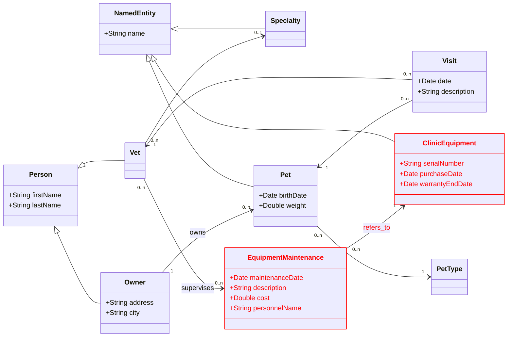

# Evaluación de Prompt

**Proveedor IA:** GEMINI
**Ejercicio:** TEST-ATTRIBUTES-CODE-GENERATION
**Dominio:** PETCLINIC
**Fecha:** 12/6/2026, 2:13:07

## Índice
- [1. Contexto Oculto](#1-contexto-oculto)
- [2. Examen Seleccionado](#2-examen-seleccionado)
- [3. Prompt Visible](#3-prompt-visible)
- [4. Respuesta](#4-respuesta)

---

## 1. Contexto Oculto


=== PAQUETES DE LA PLANTILLA DEL PROYECTO ===
org.springframework.samples.petclinic.user
org.springframework.samples.petclinic.model
org.springframework.samples.petclinic.exceptions

REGLA CRÍTICA DE IMPORTS:
- Usa EXACTAMENTE estos paquetes para las clases que NO son base.
- Paquete raíz: org.springframework.samples.petclinic
- El paquete de ESTE test (Test1.java) debe ser: org.springframework.samples.petclinic;

=== CÓDIGO FUENTE REAL ===
package org.springframework.samples.petclinic.clinicequipment;
import org.springframework.samples.petclinic.model.NamedEntity;
@Getter
@Setter
@Table(name = "clinic_equipment")
public class ClinicEquipment extends NamedEntity {
    String serialNumber;
    Date purchaseDate;
    Date warrantyEndDate;
}

// ---

package org.springframework.samples.petclinic.clinicequipment;
public interface ClinicEquipmentRepository {
    Optional<ClinicEquipment> findById(Integer id);
    List<ClinicEquipment> findAll();
    ClinicEquipment save(ClinicEquipment clinicEquipment);
}

// ---

package org.springframework.samples.petclinic.clinicequipment;
public class ClinicEquipmentService {
    ClinicEquipmentRepository repo;
    public ClinicEquipmentService(ClinicEquipmentRepository clinicEquipmentRepository) {
        this.repo = clinicEquipmentRepository;
    }
    public List<ClinicEquipment> getAll() {
        return null;
    }
    public ClinicEquipment save(ClinicEquipment s) {
        return null;
    }
}

// ---

package org.springframework.samples.petclinic.equipmentmaintenance;
import org.springframework.samples.petclinic.clinicequipment.ClinicEquipment;
import org.springframework.samples.petclinic.vet.Vet;
@Getter
@Setter
@Table(name = "equipment_maintenance")
public class EquipmentMaintenance {
    Date maintenanceDate;
    String description;
    Double cost;
    String personnelName;
    @Transient
    ClinicEquipment clinicEquipment;
    @Transient
    List<Vet> supervisors;
}

// ---

package org.springframework.samples.petclinic.equipmentmaintenance;
public interface EquipmentMaintenanceRepository {
    Optional<EquipmentMaintenance> findById(Integer id);
    List<EquipmentMaintenance> findAll();
    EquipmentMaintenance save(EquipmentMaintenance equipmentMaintenance);
}

// ---

package org.springframework.samples.petclinic.equipmentmaintenance;
public class EquipmentMaintenanceService {
    EquipmentMaintenanceRepository repo;
    public EquipmentMaintenanceService(EquipmentMaintenanceRepository equipmentMaintenanceRepository) {
        this.repo = equipmentMaintenanceRepository;
    }
    public List<EquipmentMaintenance> getAll() {
        return null;
    }
    public EquipmentMaintenance save(EquipmentMaintenance s) {
        return null;
    }
}

=== ENUNCIADO ===
En este ejercicio, añadiremos la funcionalidad de gestión de equipos y mantenimiento de la clínica. Concretamente, tendremos la clase “ClinicEquipment” que representa los diversos equipos médicos y herramientas disponibles. Además, se tendrá la clase “EquipmentMaintenance” que registrará las intervenciones de mantenimiento realizadas sobre estos equipos.

La clase ClinicEquipment incluirá el número de serie del equipo, la fecha de su compra y la fecha de finalización de su garantía. Por su parte, la clase EquipmentMaintenance contendrá la fecha en que se realizó la intervención, una descripción de la misma, el coste asociado y el nombre del personal (interno o externo) que la llevó a cabo. Cada equipo puede tener asociados varios registros de mantenimiento, y cada registro de mantenimiento se refiere a un único equipo. Además, los veterinarios pueden ser los encargados de supervisar o realizar ciertas actividades de mantenimiento.

Realizaremos una serie de ejercicios basados en funcionalidades que implementaremos en el sistema, y validaremos mediante pruebas unitarias.



=== REGLAS A EVALUAR (RESTRICCIONES / RELACIONES) ===
Modificar las clases “ClinicEquipment” y “EquipmentMaintenance” para que sean entidades. Estas deben tener los siguientes atributos y restricciones:

**Para la clase ClinicEquipment:**

- El atributo de tipo entero (Integer) llamado “id” actuará como clave primaria en la tabla de la base de datos relacional asociada a la entidad.
- Un atributo de tipo cadena de caracteres (String) llamado “serialNumber” obligatorio (no puede ser nulo), que debe tener una longitud mínima de 5 caracteres y máxima de 50 y que no puede estar formada por caracteres vacíos (espacios, tabuladores, etc.).
- El atributo de tipo fecha (LocalDate) llamado “purchaseDate”, que representa la fecha de adquisición del equipo. Seguirá el formato “dd/MM/yyyy”. Este atributo debe ser obligatorio y debe ser una fecha anterior o igual a la fecha actual.
- El atributo de tipo fecha (LocalDate) llamado “warrantyEndDate”, que representa la fecha de finalización de la garantía del equipo. Seguirá el formato “dd/MM/yyyy”. Este atributo debe ser obligatorio y debe ser una fecha posterior o igual a la fecha de compra del equipo.

**Para la clase EquipmentMaintenance:**

- El atributo de tipo entero (Integer) llamado “id” actuará como clave primaria en la tabla de la base de datos relacional asociada a la entidad.
- El atributo de tipo fecha (LocalDate) llamado “maintenanceDate”, que representa la fecha en que se realizó la intervención de mantenimiento. Seguirá el formato “dd/MM/yyyy”. Este atributo debe ser obligatorio y debe ser una fecha anterior o igual a la fecha actual.
- El atributo de tipo cadena de caracteres (String) llamado “description” opcional, que registrará los detalles de la intervención. Si se proporciona, debe tener una longitud mínima de 10 caracteres y máxima de 500 y no puede estar formada por caracteres vacíos.
- El atributo de tipo doble (Double) llamado “cost”, que representa el coste asociado a la intervención. Este atributo será obligatorio y tendrá un valor mínimo de 0.01 y un valor máximo de 10000.00.
- Un atributo de tipo cadena de caracteres (String) llamado “personnelName” obligatorio (no puede ser nulo), que debe tener una longitud mínima de 3 caracteres y máxima de 100 y que no puede estar formada por caracteres vacíos (espacios, tabuladores, etc.).

No modifique por ahora las anotaciones @Transient de las clases. Modificar las interfaces “ClinicEquipmentRepository” y “EquipmentMaintenanceRepository” alojada en el mismo paquete para que extienda a CrudRepository.


---

## 2. Examen Seleccionado
En este ejercicio, añadiremos la funcionalidad de gestión de equipos y mantenimiento de la clínica. Concretamente, tendremos la clase “ClinicEquipment” que representa los diversos equipos médicos y herramientas disponibles. Además, se tendrá la clase “EquipmentMaintenance” que registrará las intervenciones de mantenimiento realizadas sobre estos equipos.

La clase ClinicEquipment incluirá el número de serie del equipo, la fecha de su compra y la fecha de finalización de su garantía. Por su parte, la clase EquipmentMaintenance contendrá la fecha en que se realizó la intervención, una descripción de la misma, el coste asociado y el nombre del personal (interno o externo) que la llevó a cabo. Cada equipo puede tener asociados varios registros de mantenimiento, y cada registro de mantenimiento se refiere a un único equipo. Además, los veterinarios pueden ser los encargados de supervisar o realizar ciertas actividades de mantenimiento.

Realizaremos una serie de ejercicios basados en funcionalidades que implementaremos en el sistema, y validaremos mediante pruebas unitarias.


---

## 3. Prompt Visible
Nuestra misión es generar el test de un examen de la asignatura "Diseño y Pruebas". Actuamos como profesores evaluando conocimientos de JPA y mapeo objeto-relacional. Te proporcionaré el enunciado, el diagrama UML en Mermaid y, **CRÍTICAMENTE, el Código Base de las clases ya generadas**.

Por favor, no uses Wildcard Imports (asteriscos). Genera todos los imports de forma explícita, uno por cada clase utilizada. IMPORTANTE CENTRARSE EN LAS CLASES QUE SE PROPORCIONA COMO CÓDIGO BASE, DE SU LOCALIZACIÓN PARA PODER PONER CORRECTAMENTE LOS IMPORTS DE DONDE SE SACAN LAS CLASES.

---

## REGLA ABSOLUTA — PAQUETES: LEE EL CÓDIGO BASE, EVITA INVENTAR

Esta es la regla más importante del prompt. Debes seguirla antes que cualquier otra cosa.
Además, para las clases que no estén implementadas en el código base, buscarla en el repositorio pasado, como Pet, viene de pet.Pet

**Procedimiento obligatorio antes de escribir un solo import:**

1. Localiza la sección `=== PAQUETES DE LA PLANTILLA DEL PROYECTO ===` del contexto. En ella se te especificará la estructura de los paquetes a importar.
2. Para cada clase que necesites importar, busca su `package` en el código base proporcionado.
3. Construye el import como: `import <package_de_esa_clase>.<NombreClase>;`

- Deberás tener cuidado y poner los nombres de las clases nueva generadas, ya que no siempre es Achievement; deberás coger las clases del contexto que se te proporciona de la extensión funcional.

**Ejemplo concreto:**

- Si el código base de `Achievement.java` empieza con `package es.us.dp1.chess.tournament.achievement;`
- El import correcto en el test es: `import es.us.dp1.chess.tournament.achievement.Achievement;`
- Teniendo en cuenta las mayúsculas y minúsculas de las clases para evitar el error en los tests
- NUNCA: `import org.springframework.samples.chessgame.model.Achievement;`
- NUNCA: `import org.springframework.samples.petClinic.model.Achievement;`

**Aplica lo mismo para `@ComponentScan`:**
Al definir los paquetes, SIEMPRE poner los paquetes individuales necesarios, evitar globalizar en uno todo:

- CORRECTO: `@ComponentScan(basePackages = {"es.us.dp1.chess.tournament.achievement", "es.us.dp1.chess.tournament.userAchievement"})`
- INCORRECTO: `@ComponentScan(basePackages = {"org.springframework.samples.chessgame.repository", "org.springframework.samples.chessgame.model"})`
- INCORRECTO: `@ComponentScan(basePackages = {"es.us.dp1.chess.tournament"})`

**El paquete del propio test (`package ...` en la primera línea) también debe derivarse del código base**, usando el prefijo de donde se crean los test. Ejemplo: si el prefijo raíz es `es.us.dp1.chess.tournament`, el paquete del test será `es.us.dp1.chess.tournament`.

Si una clase (como `ReflexiveTest`, `NamedEntity`, etc.) no aparece en el código base proporcionado, usa el mismo prefijo raíz detectado para inferir su paquete. Nunca uses `org.springframework.samples.*` salvo que ese prefijo aparezca explícitamente en el código base.

Para las diferentes comprobaciones, vamos a llamar a los métodos que nos proporciona la clase ReflexiveTest que te paso dentro del archivo `test_previous_exams`. **IMPORTANTE:** tienes que llamar con el MISMO NOMBRE a los métodos que utilices, además de pasarle los MISMOS tipos de argumentos que pide cada método. A continuación, te proporciono una lista con todos los métodos disponibles y sus correspondientes argumentos necesarios. Los analizarás todos para usarlos correctamente en el test:

```java
void checkThatFieldIsAnnotatedWithDateTimeFormat(Class aClass, String fieldname,String format)

void checkThatFieldIsAnnotatedWith(Class aClass, String fieldname,Class annotationClass)

boolean  isFieldAnnotatedWith(Class aClass, String fieldname,Class annotationClass) throws NoSuchFieldException, SecurityException

boolean classIsAnnotatedWith(Class class1, Class class2)

boolean classHasMethod(Object targetObject, String methodName, Class<?> ... parameterTypes)

void checkThatFieldsAreMandatory(Object validEntity,EntityManager em,String ... fieldnames )

void checkThatFieldIsMandatory(Object validEntity,String fieldname,Class<?> type,EntityManager em)

void checkThatValuesAreNotValid(Object validEntity,Map<String,List<Object>> invalidValues,EntityManager em)

void checkThatValueIsNotValid(Object validEntity,String fieldname,Object value,Class<?> type, EntityManager em)

Object setValue(Object object,String fieldname,Class<?> type, Object value)

Object invokeMethodReflexivelyWithParamTypes(Object targetObject, String methodName, Class<?>[] parameterTypes,Object ... parameterValues)

Object invokeMethodReflexively(Object o, String methodName, Object ... params)

void checkLinkedById(Class myClass,Integer id1,String methodName,Integer id2,EntityManager em)

Object getFieldValueReflexively(Object o, String fieldName)

void checkTransactional(Class<?> myClass,String methodName, Class<?>... parameterTypes)

boolean isMethodAnnotatedWithTest(Method method)

boolean isMethodAnnotatedWithBeforeEach(Method method)

boolean isMethodAnnotatedWithAfterEach(Method method)

void checkTransactionalRollback(Class<?> myClass,String methodName,Class<?>[] paramTypes,Class<? extends Exception> exceptionClass)

boolean isEntity(Class<T> clazz)
```

---

## Reglas de Coherencia Adicionales

2.  **Fidelidad al Código Base:** Si una clase en el código base tiene un atributo con un nombre específico (ej. `checkInDate`), el test debe usar ese nombre exacto, ignorando lo que diga cualquier otro ejemplo externo.
3.  **Manejo de Relaciones:** Si en el Código Base una relación está marcada como `@Transient`, el test debe tratarla según las instrucciones del enunciado, pero siempre importando la clase desde su paquete real.

---

## Especificaciones del Examen

- **Clases Negras:** Núcleo estable (Contexto). No se testea su implementación interna, pero se usan para crear objetos válidos (ej. `Owner`, `Pet`).
- **Clases Rojas:** Tarea principal del alumno. Son las que debemos testear exhaustivamente (Restricciones, Anotaciones y Persistencia).
- **Límite:** Máximo 2 entidades rojas por examen.
- **Framework:** Java 17+, JUnit 5, Spring Boot (@DataJpaTest).
- **Herencia:** La clase de test DEBE extender de `ReflexiveTest` (IMPORTANTE: DEBE USARSE SI O SI ESTA CLASE PARA LA GENERACIÓN DE LOS TESTS, DEBE PONER ReflexiveTest en la parte de `extends...`)

---

## Estructura Estricta Requerida para Test1.java

### 1. Configuración e Inyección

- El nombre ESTRICTO del paquete donde se tiene que generar el test es:
  - Clínica Veterinaria: `package org.springframework.samples.petclinic`
  - Ajedrez: `package es.us.dp1.chess.tournament`
- Inyecta los Repositorios de las entidades rojas y el `EntityManager` mediante `@Autowired` (NUNCA `TestEntityManager`).
- Inyecta SIEMPRE como `@MockBean` el servicio `UserService`:

```java
    @MockBean
    private UserService userService;
```

- Usa `@ComponentScan` apuntando a los paquetes reales detectados en el Código Base (ver Regla Absoluta).
- **IMPORTANTE** los imports de las anotaciones a comprobar deberán venir de jakarta, NUNCA DE javax:
  - CORRECTO: jakarta.persistence.Column;
  - INCORRECTO: javax.persistence.Column;
- **IMPORTANTE**: Omitir crear tests estáticos, para poder usar el método `super`.

### 2. Verificación de Repositorios

Los tests que validan los repositorios, cuando extienden a CRUD Repository no es necesario validar todos los métodos que se proporcionan inicialmente en las clases base, ya que la anotación CRUD los contiene, por lo que la estructura del test sería:

```java
@Test
    void test1RepositoriesExist() {
        assertNotNull(ratingRepository, "RatingRepository should be autowired");
        assertNotNull(ratingChangeRepository, "RatingChangeRepository should be autowired");
        test1RepositoriesContainsMethod();
    }

    void test1RepositoriesContainsMethod() {
        assertTrue(
            CrudRepository.class.isAssignableFrom(RatingRepository.class),
            "RatingRepository should extend CrudRepository"
        );
        assertTrue(
            CrudRepository.class.isAssignableFrom(RatingChangeRepository.class),
            "RatingChangeRepository should extend CrudRepository"
        );
    }

```

- **test1RepositoriesExist():** Verifica `assertNotNull`. Al final, debe llamar a `test1RepositoriesContainsMethod()` solo si el repo no es nulo.
- **test1RepositoriesContainsMethod():** (SIN @Test) Verifica que el repo tiene el método `.count()` o similar mediante reflexión/interfaz.

### 3. Validación de Restricciones (Constraints)

- **test1Check[NOMBRE_ENTIDAD]Constraints():**
  - Invoca `checkThatFieldsAreMandatory` con los campos `NotNull/NotBlank` identificados.
  - Crea el mapa `invalidValues` usando `Map.of(...)`. **PROHIBIDO usar `new HashMap()`**.
  - Los valores de prueba deben ser coherentes con el tipo de dato del Código Base (si es `Double`, usa `0.0`; si es `Integer`, `0`).
  - Invoca `checkThatValuesAreNotValid`.
  - En atributos que sean de tipo Double, NUNCA PONER `columnDefinition = "double(5,2)"` ya que dará error. La forma correcta es por ejemplo: `@Column(name = "cost")`

### 4. Verificación de Anotaciones

- **test1Check[NOMBRE_ENTIDAD]Annotations():**
  - Verifica `@Entity` con `classIsAnnotatedWith`.
  - Verifica `@Enumerated(EnumType.STRING)` si hay Enums.
  - Verifica `@Size`, `@Positive`, `@FutureOrPresent`, etc., según el UML.

### 5. Métodos Auxiliares y Persistencia

- **createValid[NOMBRE_ENTIDAD](EntityManager em):** Método estático que construye una instancia válida.
- **IMPORTANTE:** Usa EXCLUSIVAMENTE `setValue(objeto, "atributo", Tipo.class, valor)` para asignar datos, evitando fallos si no existen setters.
- **test1Valid[NOMBRE_ENTIDAD]IsPersisted():** Verifica que `repo.save()` no lanza excepciones (`assertDoesNotThrow`) y haz `.flush()`.
- Todos los métodos auxiliares que sean necesarios deberán crearse en la misma clase, el test DEBE ser autosuficiente.
- Al crear alguna entidad válida en un método auxiliar, SIEMPRE crear primero los objetos padre, es decir, si un Pet tiene un Owner, primero se deberá crear el Owner y después el Pet. Esto evitará errores de persistencia.

---

## Restricciones de Salida (Formato)

- **PROHIBIDO** generar comentarios explicativos.
- **PROHIBIDO** envolver el código en bloques de código markdown (sin \`\`\`java).
- **PROHIBIDO** incluir texto antes o después del código.
- Entrega el código listo para ser copiado y pegado en un archivo `.java`.

---

## 4. Respuesta
package org.springframework.samples.petclinic;

import jakarta.persistence.Column;
import jakarta.persistence.Entity;
import jakarta.persistence.EntityManager;
import jakarta.persistence.GeneratedValue;
import jakarta.persistence.GenerationType;
import jakarta.persistence.Id;
import jakarta.persistence.Table;
import jakarta.persistence.Transient;
import jakarta.validation.constraints.FutureOrPresent;
import jakarta.validation.constraints.Max;
import jakarta.validation.constraints.Min;
import jakarta.validation.constraints.NotBlank;
import jakarta.validation.constraints.NotNull;
import jakarta.validation.constraints.PastOrPresent;
import jakarta.validation.constraints.Size;
import java.time.LocalDate;
import java.time.temporal.ChronoUnit;
import java.util.Collections;
import java.util.List;
import java.util.Map;
import org.junit.jupiter.api.Test;
import org.springframework.beans.factory.annotation.Autowired;
import org.springframework.boot.test.autoconfigure.orm.jpa.DataJpaTest;
import org.springframework.boot.test.mock.mockito.MockBean;
import org.springframework.context.annotation.ComponentScan;
import org.springframework.data.repository.CrudRepository;
import org.springframework.format.annotation.DateTimeFormat;
import org.springframework.samples.petclinic.clinicequipment.ClinicEquipment;
import org.springframework.samples.petclinic.clinicequipment.ClinicEquipmentRepository;
import org.springframework.samples.petclinic.equipmentmaintenance.EquipmentMaintenance;
import org.springframework.samples.petclinic.equipmentmaintenance.EquipmentMaintenanceRepository;
import org.springframework.samples.petclinic.user.UserService;

import static org.junit.jupiter.api.Assertions.assertDoesNotThrow;
import static org.junit.jupiter.api.Assertions.assertNotNull;
import static org.junit.jupiter.api.Assertions.assertTrue;

@DataJpaTest
@ComponentScan(basePackages = {
    "org.springframework.samples.petclinic.clinicequipment",
    "org.springframework.samples.petclinic.equipmentmaintenance"
})
class Test1 extends ReflexiveTest {

    @Autowired
    private ClinicEquipmentRepository clinicEquipmentRepository;

    @Autowired
    private EquipmentMaintenanceRepository equipmentMaintenanceRepository;

    @Autowired
    private EntityManager em;

    @MockBean
    private UserService userService;

    @Test
    void test1RepositoriesExist() {
        assertNotNull(clinicEquipmentRepository, "ClinicEquipmentRepository should be autowired");
        assertNotNull(equipmentMaintenanceRepository, "EquipmentMaintenanceRepository should be autowired");
        test1RepositoriesContainsMethod();
    }

    void test1RepositoriesContainsMethod() {
        assertTrue(
            CrudRepository.class.isAssignableFrom(ClinicEquipmentRepository.class),
            "ClinicEquipmentRepository should extend CrudRepository"
        );
        assertTrue(
            CrudRepository.class.isAssignableFrom(EquipmentMaintenanceRepository.class),
            "EquipmentMaintenanceRepository should extend CrudRepository"
        );
    }

    @Test
    void test1CheckClinicEquipmentAnnotations() {
        Class<?> entityClass = ClinicEquipment.class;

        assertTrue(classIsAnnotatedWith(entityClass, Entity.class), "ClinicEquipment should be annotated with @Entity");
        assertTrue(classIsAnnotatedWith(entityClass, Table.class), "ClinicEquipment should be annotated with @Table");
        checkThatFieldIsAnnotatedWith(entityClass, "id", Id.class);
        checkThatFieldIsAnnotatedWith(entityClass, "id", GeneratedValue.class);
        checkThatFieldIsAnnotatedWith(entityClass, "serialNumber", Column.class);
        checkThatFieldIsAnnotatedWith(entityClass, "serialNumber", NotBlank.class);
        checkThatFieldIsAnnotatedWith(entityClass, "serialNumber", Size.class);
        checkThatFieldIsAnnotatedWith(entityClass, "purchaseDate", Column.class);
        checkThatFieldIsAnnotatedWith(entityClass, "purchaseDate", NotNull.class);
        checkThatFieldIsAnnotatedWith(entityClass, "purchaseDate", PastOrPresent.class);
        checkThatFieldIsAnnotatedWithDateTimeFormat(entityClass, "purchaseDate", "dd/MM/yyyy");
        checkThatFieldIsAnnotatedWith(entityClass, "warrantyEndDate", Column.class);
        checkThatFieldIsAnnotatedWith(entityClass, "warrantyEndDate", NotNull.class);
        checkThatFieldIsAnnotatedWith(entityClass, "warrantyEndDate", FutureOrPresent.class);
        checkThatFieldIsAnnotatedWithDateTimeFormat(entityClass, "warrantyEndDate", "dd/MM/yyyy");
    }

    @Test
    void test1CheckClinicEquipmentConstraints() {
        ClinicEquipment validClinicEquipment = createValidClinicEquipment(em);

        checkThatFieldsAreMandatory(validClinicEquipment, em,
            "serialNumber", "purchaseDate", "warrantyEndDate"
        );

        Map<String, List<Object>> invalidValues = Map.of(
            "serialNumber", List.of(
                null, "", "123", "123456789012345678901234567890123456789012345678901", "   "
            ),
            "purchaseDate", List.of(
                null, LocalDate.now().plus(1, ChronoUnit.DAYS)
            ),
            "warrantyEndDate", List.of(
                null, validClinicEquipment.getPurchaseDate().minus(1, ChronoUnit.DAYS) // Must be >= purchaseDate
            )
        );
        checkThatValuesAreNotValid(validClinicEquipment, invalidValues, em);
    }

    @Test
    void test1ValidClinicEquipmentIsPersisted() {
        ClinicEquipment clinicEquipment = createValidClinicEquipment(em);
        assertDoesNotThrow(() -> clinicEquipmentRepository.save(clinicEquipment), "Valid ClinicEquipment should be saved without exceptions");
        em.flush();
        assertNotNull(clinicEquipment.getId(), "ClinicEquipment ID should be generated after saving");
    }

    @Test
    void test1CheckEquipmentMaintenanceAnnotations() {
        Class<?> entityClass = EquipmentMaintenance.class;

        assertTrue(classIsAnnotatedWith(entityClass, Entity.class), "EquipmentMaintenance should be annotated with @Entity");
        assertTrue(classIsAnnotatedWith(entityClass, Table.class), "EquipmentMaintenance should be annotated with @Table");
        checkThatFieldIsAnnotatedWith(entityClass, "id", Id.class);
        checkThatFieldIsAnnotatedWith(entityClass, "id", GeneratedValue.class);
        checkThatFieldIsAnnotatedWith(entityClass, "maintenanceDate", Column.class);
        checkThatFieldIsAnnotatedWith(entityClass, "maintenanceDate", NotNull.class);
        checkThatFieldIsAnnotatedWith(entityClass, "maintenanceDate", PastOrPresent.class);
        checkThatFieldIsAnnotatedWithDateTimeFormat(entityClass, "maintenanceDate", "dd/MM/yyyy");
        checkThatFieldIsAnnotatedWith(entityClass, "description", Column.class);
        checkThatFieldIsAnnotatedWith(entityClass, "description", Size.class);
        checkThatFieldIsAnnotatedWith(entityClass, "cost", Column.class);
        checkThatFieldIsAnnotatedWith(entityClass, "cost", NotNull.class);
        checkThatFieldIsAnnotatedWith(entityClass, "cost", Min.class);
        checkThatFieldIsAnnotatedWith(entityClass, "cost", Max.class);
        checkThatFieldIsAnnotatedWith(entityClass, "personnelName", Column.class);
        checkThatFieldIsAnnotatedWith(entityClass, "personnelName", NotBlank.class);
        checkThatFieldIsAnnotatedWith(entityClass, "personnelName", Size.class);
        checkThatFieldIsAnnotatedWith(entityClass, "clinicEquipment", Transient.class);
        checkThatFieldIsAnnotatedWith(entityClass, "supervisors", Transient.class);
    }

    @Test
    void test1CheckEquipmentMaintenanceConstraints() {
        ClinicEquipment validClinicEquipment = createValidClinicEquipment(em);
        EquipmentMaintenance validMaintenance = createValidEquipmentMaintenance(validClinicEquipment, em);

        checkThatFieldsAreMandatory(validMaintenance, em,
            "maintenanceDate", "cost", "personnelName"
        );

        Map<String, List<Object>> invalidValues = Map.of(
            "maintenanceDate", List.of(
                null, LocalDate.now().plus(1, ChronoUnit.DAYS)
            ),
            "description", List.of(
                "too short", "1234567890123456789012345678901234567890123456789012345678901234567890123456789012345678901234567890123456789012345678901234567890123456789012345678901234567890123456789012345678901234567890123456789012345678901234567890123456789012345678901234567890123456789012345678901234567890123456789012345678901234567890123456789012345678901234567890123456789012345678901234567890123456789012345678901234567890123456789012345678901234567890123456789012345678901234567890123456789012345678901234567890123456789012345678901234567890123456789012345678901234567890123456789012345678901234567890123456789012345678901234567890123456789012345678901234567