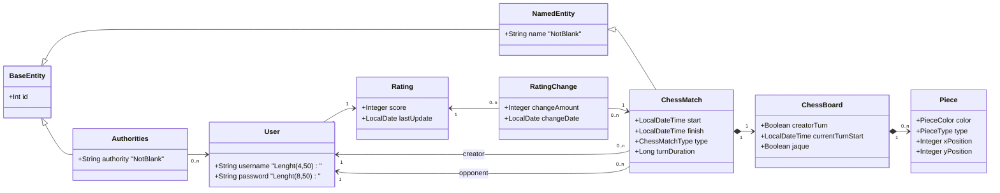
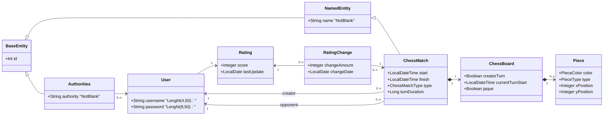

# Evaluación de Prompt

**Proveedor IA:** GEMINI
**Ejercicio:** TEST_RELATIONSHIPS_CODE_GENERATION
**Dominio:** CHESS
**Fecha:** 4/5/2026, 20:24:32

## Índice
- [1. Contexto Oculto](#1-contexto-oculto)
- [2. Examen Seleccionado](#2-examen-seleccionado)
- [3. Prompt Visible](#3-prompt-visible)
- [4. Respuesta](#4-respuesta)
---

## 1. Contexto Oculto

=== PAQUETES DE LA PLANTILLA DEL PROYECTO ===
es.us.dp1.chess.tournament.user
es.us.dp1.chess.tournament.model
es.us.dp1.chess.tournament.exceptions

REGLA CRÍTICA DE IMPORTS:
- Usa EXACTAMENTE estos paquetes para las clases que NO son base.
- Paquete raíz: es.us.dp1.chess.tournament
- El paquete de ESTE test (Test2.java) debe ser: es.us.dp1.chess.tournament;

=== CÓDIGO FUENTE REAL ===
package es.us.dp1.chess.tournament.rating;
@Getter
@Setter
public class Rating {
    Integer score;
    LocalDate lastUpdate;
    @Transient
    List<RatingChange> ratingChanges;
}

// ---

package es.us.dp1.chess.tournament.rating;
public interface RatingRepository {
    Optional<Rating> findById(Integer id);
    List<Rating> findAll();
    Rating save(Rating rating);
}

// ---

package es.us.dp1.chess.tournament.rating;
public class RatingService {
    RatingRepository ratingRepository;
    public RatingService(RatingRepository ratingRepository) {
        this.ratingRepository = ratingRepository;
    }
}

// ---

package es.us.dp1.chess.tournament.ratingchange;
@Getter
@Setter
public class RatingChange {
    Integer changeAmount;
    LocalDate changeDate;
    @Transient
    Rating rating;
    @Transient
    ChessMatch chessMatch;
}

// ---

package es.us.dp1.chess.tournament.ratingchange;
public interface RatingChangeRepository {
    Optional<RatingChange> findById(Integer id);
    List<RatingChange> findAll();
    RatingChange save(RatingChange ratingChange);
}

// ---

package es.us.dp1.chess.tournament.ratingchange;
public class RatingChangeService {
    RatingChangeRepository ratingChangeRepository;
    public RatingChangeService(RatingChangeRepository ratingChangeRepository) {
        this.ratingChangeRepository = ratingChangeRepository;
    }
}

=== ENUNCIADO ===
En este ejercicio, añadiremos la funcionalidad de gestión del sistema de puntuación ELO para los jugadores. Concretamente, se proporcionará una clase `User` que representa a los usuarios del sistema. Los jugadores, al participar en partidas de ajedrez, verán sus puntuaciones ELO actualizadas. Para gestionar esto, tendremos la clase `Rating`, que almacenará la puntuación ELO actual de un jugador. Esta clase incluirá el atributo `score` para la puntuación numérica del jugador y `lastUpdate` para registrar la fecha de la última modificación de dicha puntuación. Además, contaremos con la clase `RatingChange` para llevar un registro histórico de cada ajuste en la puntuación ELO. `RatingChange` tendrá un atributo `changeAmount` que indicará la variación de puntos (positiva o negativa) y `changeDate` para el momento exacto en que se produjo dicho cambio.

Las relaciones entre estas entidades son las siguientes: cada `User` tendrá una única instancia de `Rating` que representa su puntuación actual. A su vez, cada `Rating` estará asociado a múltiples `RatingChange`, documentando la evolución de la puntuación del jugador. Finalmente, cada `RatingChange` se vinculará a la `ChessMatch` específica que motivó dicho ajuste de puntos.

Realizaremos una serie de ejercicios basados en funcionalidades que implementaremos en el sistema, y validaremos mediante pruebas unitarias.

=== REGLAS A EVALUAR (RESTRICCIONES / RELACIONES) ===
Elimine las anotaciones @Transient de los métodos y atributos que las tengan en las entidades creadas en el ejercicio anterior, así como de los atributos `score` y `lastUpdate` de la clase `Rating` y los atributos `changeAmount` y `changeDate` de la clase `RatingChange`. Se pide crear las siguientes relaciones entre las entidades:

Cree una relación unidireccional desde “User” hacia “Rating” que exprese la que aparece en el diagrama UML (mostrado en la primera página de este enunciado) respetando sus cardinalidades, usando el atributo “rating” de la clase “User”. Debe asegurarse de que la relación expresa adecuadamente la cardinalidad que muestra el diagrama UML, por ejemplo, el atributo `rating` no puede ser nulo y es obligatorio, puesto que la cardinalidad es 1 en el extremo de `Rating`.

Además, se pide crear una relación unidireccional desde “RatingChange” hacia “Rating” que represente la que aparece en el diagrama UML, tenga en cuenta la cardinalidad que tiene, usando el atributo “rating” en la clase “RatingChange”. Debe asegurarse de que la relación expresa adecuadamente la cardinalidad que muestra el diagrama UML, por ejemplo, el atributo `rating` no puede ser nulo y es obligatorio, puesto que la cardinalidad es 1 en el extremo de `Rating`.

Finalmente, se pide crear una relación unidireccional desde “RatingChange” hacia “ChessMatch” que represente la que aparece en el diagrama, usando como nombre de atributo `chessMatch` en la clase “RatingChange”. Debe asegurarse de que la relación expresa adecuadamente la cardinalidad que muestra el diagrama UML, por ejemplo, el atributo `chessMatch` no puede ser nulo y es obligatorio, puesto que la cardinalidad es 1 en el extremo de `ChessMatch`.

---

## 2. Examen Seleccionado
En este ejercicio, añadiremos la funcionalidad de gestión del sistema de puntuación ELO para los jugadores. Concretamente, se proporcionará una clase `User` que representa a los usuarios del sistema. Los jugadores, al participar en partidas de ajedrez, verán sus puntuaciones ELO actualizadas. Para gestionar esto, tendremos la clase `Rating`, que almacenará la puntuación ELO actual de un jugador. Esta clase incluirá el atributo `score` para la puntuación numérica del jugador y `lastUpdate` para registrar la fecha de la última modificación de dicha puntuación. Además, contaremos con la clase `RatingChange` para llevar un registro histórico de cada ajuste en la puntuación ELO. `RatingChange` tendrá un atributo `changeAmount` que indicará la variación de puntos (positiva o negativa) y `changeDate` para el momento exacto en que se produjo dicho cambio.

Las relaciones entre estas entidades son las siguientes: cada `User` tendrá una única instancia de `Rating` que representa su puntuación actual. A su vez, cada `Rating` estará asociado a múltiples `RatingChange`, documentando la evolución de la puntuación del jugador. Finalmente, cada `RatingChange` se vinculará a la `ChessMatch` específica que motivó dicho ajuste de puntos.

Realizaremos una serie de ejercicios basados en funcionalidades que implementaremos en el sistema, y validaremos mediante pruebas unitarias.

---

## 3. Prompt Visible
# PROMPT COMPLETO PARA GENERACIÓN DE TESTS DE RELACIONES ENTRE ENTIDADES

## Recursos a proporcionar:
* `test_previous_exams.md`

## Prompt a utilizar
Nuestra misión es generar el test de un examen de la asignatura "Diseño y Pruebas". Actuamos como profesores evaluando conocimientos de JPA y mapeo objeto-relacional. Te proporcionaré el enunciado, el diagrama UML en Mermaid y, **CRÍTICAMENTE, el Código Base de las clases ya generadas**.

Por favor, no uses Wildcard Imports (asteriscos). Genera todos los imports de forma explícita, uno por cada clase utilizada. IMPORTANTE CENTRARSE EN LAS CLASES QUE SE PROPORCIONA COMO CÓDIGO BASE, DE SU LOCALIZACIÓN PARA PODER PONER CORRECTAMENTE LOS IMPORTS DE DONDE SE SACAN LAS CLASES.

---

## REGLA ABSOLUTA — PAQUETES: LEE EL CÓDIGO BASE, EVITA INVENTAR COSAS

Esta es la regla más importante del prompt. Debes seguirla antes que cualquier otra cosa.
Además, para las clases que no estén implementadas en el código base, buscarla en el repositorio pasado, como Pet, viene de pet.Pet

**Procedimiento obligatorio antes de escribir un solo import:**

1. Localiza la sección `=== PAQUETES DE LA PLANTILLA DEL PROYECTO ===` del contexto.
2. Para cada clase que necesites importar, busca su `package` en el código base proporcionado.
3. Construye el import como: `import <package_de_esa_clase>.<NombreClase>;`
- Pero ten en cuenta en poner los nombres de las clases nueva generadas, no es siempre Achievement; sino q coja las clases del contexto que se le pase de la extensión funcional.

**Ejemplo concreto:**
- Si el código base de `Achievement.java` empieza con `package es.us.dp1.chess.tournament.achievement;`
- El import correcto en el test es: `import es.us.dp1.chess.tournament.achievement.Achievement;`
- Teniendo en cuenta las mayúsculas y minúsculas de las clases para evitar el error en los tests
- NUNCA: `import org.springframework.samples.chessgame.model.Achievement;`
- NUNCA: `import org.springframework.samples.petClinic.model.Achievement;`

**Aplica lo mismo para `@ComponentScan`:**
- CORRECTO: `@ComponentScan(basePackages = {"es.us.dp1.chess.tournament.achievement", "es.us.dp1.chess.tournament.userAchievement"})`
- INCORRECTO: `@ComponentScan(basePackages = {"org.springframework.samples.chessgame.repository", "org.springframework.samples.chessgame.model"})`

**El paquete del propio test (`package ...` en la primera línea) también debe derivarse del código base**, usando el prefijo de donde se crean los test. Ejemplo: si el prefijo raíz es `es.us.dp1.chess.tournament`, el paquete del test será `es.us.dp1.chess.tournament`.

Si una clase (como `ReflexiveTest`, `NamedEntity`, etc.) no aparece en el código base proporcionado, usa el mismo prefijo raíz detectado para inferir su paquete. Nunca uses `org.springframework.samples.*` salvo que ese prefijo aparezca explícitamente en el código base.

Tienes que tener en cuenta como los métodos se llaman en ReflexiveTest

---

## Reglas de Coherencia Adicionales
2.  **Fidelidad al Código Base:** Si una clase en el código base tiene un atributo o relación con un nombre específico (ej. `checkInDate`), el test debe usar ese nombre exacto, ignorando lo que diga cualquier otro ejemplo externo.
3.  **Manejo de Relaciones:** Si en el Código Base una relación está marcada como `@Transient`, el test debe tratarla según las instrucciones del enunciado, pero siempre importando la clase desde su paquete real.

---

## Especificaciones del Examen
- **Clases Negras:** Núcleo estable (Contexto). No se testea su implementación interna, pero se usan para crear objetos válidos (ej. `Owner`, `Pet`).
- **Clases Rojas:** Tarea principal del alumno. Son las que debemos testear exhaustivamente (Restricciones, Anotaciones y Persistencia).
- **Límite:** Máximo 2 entidades rojas por examen.
- **Framework:** Java 17+, JUnit 5, Spring Boot (@DataJpaTest).
- **Herencia:** La clase de test DEBE extender de `ReflexiveTest`.

---

## Estructura Estricta Requerida para la Test2.java

Debes generar una clase de pruebas que siga EXACTAMENTE el patrón de diseño proporcionado, siguiendo los ejemplos proporcionados en el archivo markdown "test_previous_exams" anotados como **Test 2: Relaciones entre las entidades**. La clase evaluará lo necesario apoyándose en los métodos de la clase padre `ReflexiveTest`.

### 1. Configuración de la Clase e Inyección de Dependencias
- **Clase y Herencia:** La clase debe ser pública, estar anotada obligatoriamente con `@DataJpaTest()` y heredar de `ReflexiveTest`.
- **Inyección:** Inyecta EXCLUSIVAMENTE el `EntityManager` utilizando `@Autowired(required = false)`. No inyectes repositorios a menos que la creación de la entidad base lo requiera de forma crítica.

### 2. Verificación de Anotaciones (Relaciones JPA)
- **Nomenclatura del Método:** Crea un método llamado `test[Num][NombreEntidad]Annotations()` por cada entidad a evaluar (ej. `test2TreatmentAnnotations()`). Debe ser `public void` y llevar la anotación `@Test`.
- **Implementación (Estricta):** Dentro del método, usa ÚNICAMENTE el método heredado `checkThatFieldIsAnnotatedWith` para comprobar relaciones. 
- **Formato exacto:** `checkThatFieldIsAnnotatedWith(Entidad.class, "nombreDelAtributo", TipoDeRelacion.class);` (Donde `TipoDeRelacion` será `ManyToMany.class`, `ManyToOne.class`, etc.).
- Agrupa todas las aserciones de una misma entidad en su método correspondiente.

### 3. Verificación de Restricciones (Constraints y Obligatoriedad)
- **Nomenclatura del Método:** Crea un método llamado `test[Num][NombreEntidad]Constraints()` por cada relación a implementar (ej. `test2TreatmentConstraints()`). Es obligatorio que sea `public void` y lleve la anotación `@Test` (evita métodos privados o JUnit no los ejecutará).
- **Instanciación de la Entidad:** Para probar las restricciones, la primera línea del método debe instanciar una entidad válida llamando a la factoría de `Test1` pasándole el EntityManager. Formato exacto: `NombreEntidad e = Test1.createValid[NombreEntidad](em);`
- **Filtro de Atributos (¡IMPORTANTE!):** Genera aserciones ÚNICAMENTE para los atributos que implementan las relaciones exigidas en este ejercicio. Omite estrictamente cualquier aserción de obligatoriedad para atributos básicos (como ids, nombres, fechas, etc.) que no formen parte de la relación que se está evaluando.
- **Implementación (Estricta):** Tras instanciar la entidad, usa ÚNICAMENTE el método heredado `checkThatFieldsAreMandatory` para verificar la obligatoriedad de los atributos filtrados en el paso anterior.
- **Formato exacto:** checkThatFieldsAreMandatory(e, em, "nombreDelAtributoRelacion");

### 4. Reglas Críticas de Sintaxis y Reflexión
- **Asignación de Valores (Si generas métodos auxiliares):** Si necesitas construir entidades de prueba localmente, usa EXCLUSIVAMENTE `setValue(objeto, "atributo", Tipo.class, valor)` proporcionado por `ReflexiveTest` para eludir la ausencia de métodos *setter* en el código base.
- **Evita aserciones estándar:** NO uses `assertNotNull`, `assertDoesNotThrow` ni pruebes repositorios con `.save()` a menos que se te pida explícitamente. Cíñete a los métodos de aserción de `ReflexiveTest` (`checkThatFieldIsAnnotatedWith` y `checkThatFieldsAreMandatory`).
- **Separación de responsabilidades**: Mantén estrictamente separados los métodos que comprueban anotaciones de los métodos que comprueban restricciones de validación.
- **Limpieza**: Omite comentarios innecesarios, importaciones no utilizadas y explicaciones adicionales. Devuelve únicamente el código Java solicitado.

---

## Restricciones de Salida (Formato)
- **PROHIBIDO** generar comentarios explicativos.
- **PROHIBIDO** envolver el código en bloques de código markdown (sin \`\`\`java).
- **PROHIBIDO** incluir texto antes o después del código.
- Entrega el código listo para ser copiado y pegado en un archivo `.java`.

---

## 4. Respuesta
package es.us.dp1.chess.tournament;

import es.us.dp1.chess.tournament.test.ReflexiveTest;
import es.us.dp1.chess.tournament.test.Test1;

import es.us.dp1.chess.tournament.user.User;
import es.us.dp1.chess.tournament.rating.Rating;
import es.us.dp1.chess.tournament.ratingchange.RatingChange;
import es.us.dp1.chess.tournament.model.ChessMatch; 

import jakarta.persistence.EntityManager;
import jakarta.persistence.OneToOne;
import jakarta.persistence.ManyToOne;
import jakarta.persistence.JoinColumn;

import org.junit.jupiter.api.Test;
import org.springframework.beans.factory.annotation.Autowired;
import org.springframework.boot.test.autoconfigure.orm.jpa.DataJpaTest;
import org.springframework.context.annotation.ComponentScan;

@DataJpaTest
@ComponentScan(basePackages = {"es.us.dp1.chess.tournament"})
public class Test2 extends ReflexiveTest {

    @Autowired(required = false)
    protected EntityManager em;

    // --- ANNOTATION TESTS ---

    @Test
    public void test2UserAnnotations() {
        checkThatFieldIsAnnotatedWith(User.class, "rating", OneToOne.class);
        checkThatFieldIsAnnotatedWith(User.class, "rating", JoinColumn.class);
    }

    @Test
    public void test2RatingChangeAnnotations() {
        checkThatFieldIsAnnotatedWith(RatingChange.class, "rating", ManyToOne.class);
        checkThatFieldIsAnnotatedWith(RatingChange.class, "rating", JoinColumn.class);

        checkThatFieldIsAnnotatedWith(RatingChange.class, "chessMatch", ManyToOne.class);
        checkThatFieldIsAnnotatedWith(RatingChange.class, "chessMatch", JoinColumn.class);
    }

    // --- CONSTRAINT TESTS ---

    @Test
    public void test2UserConstraints() {
        User user = Test1.createValidUser(em);
        
        // Ensure that 'rating' attribute is mandatory
        checkThatFieldsAreMandatory(user, em, "rating");
    }

    @Test
    public void test2RatingChangeConstraints() {
        RatingChange ratingChange = Test1.createValidRatingChange(em);

        // Ensure that 'rating' attribute is mandatory
        checkThatFieldsAreMandatory(ratingChange, em, "rating");

        // Ensure that 'chessMatch' attribute is mandatory
        checkThatFieldsAreMandatory(ratingChange, em, "chessMatch");
    }
}