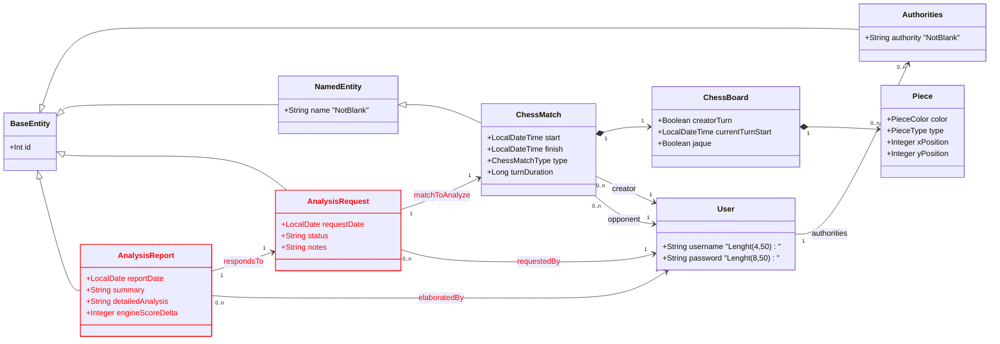

# Evaluación de Prompt

**Proveedor IA:** GEMINI
**Ejercicio:** TEST-RELATIONSHIPS-CODE-GENERATION
**Dominio:** CHESS
**Fecha:** 5/6/2026, 0:15:06

## Índice
- [1. Contexto Oculto](#1-contexto-oculto)
- [2. Examen Seleccionado](#2-examen-seleccionado)
- [3. Prompt Visible](#3-prompt-visible)
- [4. Respuesta](#4-respuesta)

---

## 1. Contexto Oculto


=== PAQUETES DE LA PLANTILLA DEL PROYECTO ===
es.us.dp1.chess.tournament.user
es.us.dp1.chess.tournament.model
es.us.dp1.chess.tournament.exceptions

REGLA CRÍTICA DE IMPORTS:
- Usa EXACTAMENTE estos paquetes para las clases que NO son base.
- Paquete raíz: es.us.dp1.chess.tournament
- El paquete de ESTE test (Test2.java) debe ser: es.us.dp1.chess.tournament;

=== CÓDIGO FUENTE REAL ===
package es.us.dp1.chess.tournament.analysisrequest;
import es.us.dp1.chess.tournament.match.ChessMatch;
import es.us.dp1.chess.tournament.user.User;
@Getter
@Setter
@Table(name = "analysis_requests")
public class AnalysisRequest {
    LocalDate requestDate;
    String status;
    String notes;
    @Transient
    ChessMatch matchToAnalyze;
    @Transient
    User requestedBy;
}

// ---

package es.us.dp1.chess.tournament.analysisrequest;
public interface AnalysisRequestRepository {
    Optional<AnalysisRequest> findById(Integer id);
    List<AnalysisRequest> findAll();
    AnalysisRequest save(AnalysisRequest analysisRequest);
}

// ---

package es.us.dp1.chess.tournament.analysisrequest;
public class AnalysisRequestService {
    AnalysisRequestRepository analysisRequestRepository;
    public AnalysisRequestService(AnalysisRequestRepository analysisRequestRepository) {
        this.analysisRequestRepository = analysisRequestRepository;
    }
    public List<AnalysisRequest> getAll() {
        return analysisRequestRepository.findAll();
    }
    public AnalysisRequest save(AnalysisRequest analysisRequest) {
        return analysisRequestRepository.save(analysisRequest);
    }
}

// ---

package es.us.dp1.chess.tournament.analysisreport;
import es.us.dp1.chess.tournament.analysisrequest.AnalysisRequest;
import es.us.dp1.chess.tournament.user.User;
@Getter
@Setter
@Table(name = "analysis_reports")
public class AnalysisReport {
    LocalDate reportDate;
    String summary;
    String detailedAnalysis;
    Integer engineScoreDelta;
    @Transient
    AnalysisRequest respondsTo;
    @Transient
    User elaboratedBy;
}

// ---

package es.us.dp1.chess.tournament.analysisreport;
public interface AnalysisReportRepository {
    Optional<AnalysisReport> findById(Integer id);
    List<AnalysisReport> findAll();
    AnalysisReport save(AnalysisReport analysisReport);
}

// ---

package es.us.dp1.chess.tournament.analysisreport;
public class AnalysisReportService {
    AnalysisReportRepository analysisReportRepository;
    public AnalysisReportService(AnalysisReportRepository analysisReportRepository) {
        this.analysisReportRepository = analysisReportRepository;
    }
    public List<AnalysisReport> getAll() {
        return analysisReportRepository.findAll();
    }
    public AnalysisReport save(AnalysisReport analysisReport) {
        return analysisReportRepository.save(analysisReport);
    }
}

=== ENUNCIADO ===
En este ejercicio, añadiremos la funcionalidad de gestión de solicitudes y reportes de análisis de partidas para que los usuarios puedan obtener una revisión experta de sus juegos. Concretamente, se proporciona una clase “ChessMatch” que representa las partidas que se juegan, y que tiene asociada una instancia de la clase “ChessBoard” que representa el estado del tablero para dicha partida, por lo que tendrá asociada un conjunto de instancias de la clase “Piece”. Además, tendremos la clase “AnalysisRequest”, que representa la solicitud de un usuario para que una partida específica sea analizada. Junto a esta, tendremos la clase “AnalysisReport”, que contendrá el análisis detallado proporcionado como respuesta a una solicitud.

La clase **AnalysisRequest** incluirá los atributos `requestDate` para la fecha de la solicitud, `status` para el estado actual de la solicitud (por ejemplo, "PENDIENTE", "EN_PROGRESO", "COMPLETADA") y `notes` para cualquier comentario o pregunta específica del usuario sobre la partida. La clase **AnalysisReport** contará con los atributos `reportDate` para la fecha en que se generó el informe, `summary` para un breve resumen del análisis, `detailedAnalysis` para el análisis textual completo y `engineScoreDelta` para indicar opcionalmente la variación en la puntuación del motor de ajedrez en puntos clave de la partida.

Las relaciones entre estas entidades son las siguientes: cada `AnalysisRequest` se asocia a una `ChessMatch` específica y es realizada por un `User`. Por su parte, un `AnalysisReport` se genera como respuesta a una única `AnalysisRequest` y es elaborado por un `User` (el analista).

Realizaremos una serie de ejercicios basados en funcionalidades que implementaremos en el sistema, y validaremos mediante pruebas unitarias.



=== REGLAS A EVALUAR (RESTRICCIONES / RELACIONES) ===
Elimine las anotaciones @Transient de los métodos y atributos que las tengan en las entidades creadas en el ejercicio anterior. Se pide crear las siguientes relaciones entre las entidades:

Cree una relación unidireccional desde “AnalysisRequest” hacia “ChessMatch” que exprese la que aparece en el diagrama UML respetando sus cardinalidades, usando el atributo “matchToAnalyze” de la clase “AnalysisRequest”. Debe asegurarse de que la relación expresa adecuadamente la cardinalidad que muestra el diagrama UML, por ejemplo, el atributo `matchToAnalyze` no puede ser nulo puesto que la cardinalidad en el extremo navegable de la relación es 1.

Además, se pide crear una relación unidireccional desde “AnalysisRequest” hacia “User” que represente la que aparece en el diagrama UML, tenga en cuenta la cardinalidad que tiene, usando el atributo “requestedBy” en la clase “AnalysisRequest”. Debe asegurarse de que la relación expresa adecuadamente la cardinalidad que muestra el diagrama UML, por ejemplo, el atributo `requestedBy` no puede ser nulo, puesto que la cardinalidad en el extremo de User es 1.

Se pide crear una relación unidireccional desde “AnalysisReport” hacia “AnalysisRequest” que exprese la que aparece en el diagrama UML respetando sus cardinalidades, usando el atributo “respondsTo” en la clase “AnalysisReport”. Debe asegurarse de que la relación expresa adecuadamente la cardinalidad que muestra el diagrama UML, por ejemplo, el atributo `respondsTo` no puede ser nulo, puesto que la cardinalidad es 1 en el extremo de AnalysisRequest.

Finalmente, se pide crear una relación unidireccional desde “AnalysisReport” hacia “User” que represente la que aparece en el diagrama, usando como nombre de atributo “elaboratedBy”. Debe asegurarse de que la relación expresa adecuadamente la cardinalidad que muestra el diagrama UML, por ejemplo, el atributo `elaboratedBy` no puede ser nulo y es obligatorio, puesto que la cardinalidad en el extremo de User es 1.


---

## 2. Examen Seleccionado
En este ejercicio, añadiremos la funcionalidad de gestión de solicitudes y reportes de análisis de partidas para que los usuarios puedan obtener una revisión experta de sus juegos. Concretamente, se proporciona una clase “ChessMatch” que representa las partidas que se juegan, y que tiene asociada una instancia de la clase “ChessBoard” que representa el estado del tablero para dicha partida, por lo que tendrá asociada un conjunto de instancias de la clase “Piece”. Además, tendremos la clase “AnalysisRequest”, que representa la solicitud de un usuario para que una partida específica sea analizada. Junto a esta, tendremos la clase “AnalysisReport”, que contendrá el análisis detallado proporcionado como respuesta a una solicitud.

La clase **AnalysisRequest** incluirá los atributos `requestDate` para la fecha de la solicitud, `status` para el estado actual de la solicitud (por ejemplo, "PENDIENTE", "EN_PROGRESO", "COMPLETADA") y `notes` para cualquier comentario o pregunta específica del usuario sobre la partida. La clase **AnalysisReport** contará con los atributos `reportDate` para la fecha en que se generó el informe, `summary` para un breve resumen del análisis, `detailedAnalysis` para el análisis textual completo y `engineScoreDelta` para indicar opcionalmente la variación en la puntuación del motor de ajedrez en puntos clave de la partida.

Las relaciones entre estas entidades son las siguientes: cada `AnalysisRequest` se asocia a una `ChessMatch` específica y es realizada por un `User`. Por su parte, un `AnalysisReport` se genera como respuesta a una única `AnalysisRequest` y es elaborado por un `User` (el analista).

Realizaremos una serie de ejercicios basados en funcionalidades que implementaremos en el sistema, y validaremos mediante pruebas unitarias.


---

## 3. Prompt Visible
Nuestra misión es generar el test de un examen de la asignatura "Diseño y Pruebas". Actuamos como profesores evaluando conocimientos de JPA y mapeo objeto-relacional. Te proporcionaré el enunciado, el diagrama UML en Mermaid y, **CRÍTICAMENTE, el Código Base de las clases ya generadas**.

Por favor, no uses Wildcard Imports (asteriscos). Genera todos los imports de forma explícita, uno por cada clase utilizada. IMPORTANTE CENTRARSE EN LAS CLASES QUE SE PROPORCIONA COMO CÓDIGO BASE, DE SU LOCALIZACIÓN PARA PODER PONER CORRECTAMENTE LOS IMPORTS DE DONDE SE SACAN LAS CLASES.

---

## REGLA ABSOLUTA — PAQUETES: LEE EL CÓDIGO BASE, EVITA INVENTAR

Esta es la regla más importante del prompt. Debes seguirla antes que cualquier otra cosa.
Además, para las clases que no estén implementadas en el código base, buscarla en el repositorio pasado, como Pet, viene de pet.Pet

**Procedimiento obligatorio antes de escribir un solo import:**

1. Localiza la sección `=== PAQUETES DE LA PLANTILLA DEL PROYECTO ===` del contexto. En ella se te especificará la estructura de los paquetes a importar.
2. Para cada clase que necesites importar, busca su `package` en el código base proporcionado.
3. Construye el import como: `import <package_de_esa_clase>.<NombreClase>;`

- Deberás tener cuidado y poner los nombres de las clases nueva generadas, ya que no siempre es Achievement; deberás coger las clases del contexto que se te proporciona de la extensión funcional.

**Ejemplo concreto:**

- Si el código base de `Achievement.java` empieza con `package es.us.dp1.chess.tournament.achievement;`
- El import correcto en el test es: `import es.us.dp1.chess.tournament.achievement.Achievement;`
- Teniendo en cuenta las mayúsculas y minúsculas de las clases para evitar el error en los tests
- NUNCA: `import org.springframework.samples.chessgame.model.Achievement;`
- NUNCA: `import org.springframework.samples.petClinic.model.Achievement;`

**Aplica lo mismo para `@ComponentScan`:**
Al definir los paquetes, SIEMPRE poner los paquetes individuales necesarios, evitar globalizar en uno todo:

- CORRECTO: `@ComponentScan(basePackages = {"es.us.dp1.chess.tournament.achievement", "es.us.dp1.chess.tournament.userAchievement"})`
- INCORRECTO: `@ComponentScan(basePackages = {"org.springframework.samples.chessgame.repository", "org.springframework.samples.chessgame.model"})`
- INCORRECTO: `@ComponentScan(basePackages = {"es.us.dp1.chess.tournament"})`

**El paquete del propio test (`package ...` en la primera línea) también debe derivarse del código base**, usando el prefijo de donde se crean los test. Ejemplo: si el prefijo raíz es `es.us.dp1.chess.tournament`, el paquete del test será `es.us.dp1.chess.tournament`.

Si una clase (como `ReflexiveTest`, `NamedEntity`, etc.) no aparece en el código base proporcionado, usa el mismo prefijo raíz detectado para inferir su paquete. Nunca uses `org.springframework.samples.*` salvo que ese prefijo aparezca explícitamente en el código base.

Para las diferentes comprobaciones, vamos a llamar a los métodos que nos proporciona la clase ReflexiveTest que te paso dentro del archivo `test_previous_exams`. **IMPORTANTE:** tienes que llamar con el MISMO NOMBRE a los métodos que utilices, además de pasarle los MISMOS tipos de argumentos que pide cada método. A continuación, te proporciono una lista con todos los métodos disponibles y sus correspondientes argumentos necesarios. Los analizarás todos para usarlos correctamente en el test:

```java
void checkThatFieldIsAnnotatedWithDateTimeFormat(Class aClass, String fieldname,String format)

void checkThatFieldIsAnnotatedWith(Class aClass, String fieldname,Class annotationClass)

boolean  isFieldAnnotatedWith(Class aClass, String fieldname,Class annotationClass)

boolean classIsAnnotatedWith(Class class1, Class class2)

boolean classHasMethod(Object targetObject, String methodName, Class<?> ... parameterTypes)

void checkThatFieldsAreMandatory(Object validEntity,EntityManager em,String ... fieldnames )

void checkThatFieldIsMandatory(Object validEntity,String fieldname,Class<?> type,EntityManager em)

void checkThatValuesAreNotValid(Object validEntity,Map<String,List<Object>> invalidValues,EntityManager em)

void checkThatValueIsNotValid(Object validEntity,String fieldname,Object value,Class<?> type, EntityManager em)

Object setValue(Object object,String fieldname,Class<?> type, Object value)

Object invokeMethodReflexivelyWithParamTypes(Object targetObject, String methodName, Class<?>[] parameterTypes,Object ... parameterValues)

Object invokeMethodReflexively(Object o, String methodName, Object ... params)

void checkLinkedById(Class myClass,Integer id1,String methodName,Integer id2,EntityManager em)

Object getFieldValueReflexively(Object o, String fieldName)

void checkTransactional(Class<?> myClass,String methodName, Class<?>... parameterTypes)

boolean isMethodAnnotatedWithTest(Method method)

boolean isMethodAnnotatedWithBeforeEach(Method method)

boolean isMethodAnnotatedWithAfterEach(Method method)

void checkTransactionalRollback(Class<?> myClass,String methodName,Class<?>[] paramTypes,Class<? extends Exception> exceptionClass)

boolean isEntity(Class<T> clazz)
```

---

## Reglas de Coherencia Adicionales

2.  **Fidelidad al Código Base:** Si una clase en el código base tiene un atributo o relación con un nombre específico (ej. `checkInDate`), el test debe usar ese nombre exacto, ignorando lo que diga cualquier otro ejemplo externo.
3.  **Manejo de Relaciones:** Si en el Código Base una relación está marcada como `@Transient`, el test debe tratarla según las instrucciones del enunciado, pero siempre importando la clase desde su paquete real.

---

## Especificaciones del Examen

- **Clases Negras:** Núcleo estable (Contexto). No se testea su implementación interna, pero se usan para crear objetos válidos (ej. `Owner`, `Pet`).
- **Clases Rojas:** Tarea principal del alumno. Son las que debemos testear exhaustivamente (Restricciones, Anotaciones y Persistencia).
- **Límite:** Máximo 2 entidades rojas por examen.
- **Framework:** Java 17+, JUnit 5, Spring Boot (@DataJpaTest).
- **Herencia:** La clase de test DEBE extender de `ReflexiveTest`.

---

## Estructura Estricta Requerida para Test2.java

Debes generar una clase de pruebas que siga EXACTAMENTE el patrón de diseño proporcionado, siguiendo los ejemplos proporcionados en el archivo markdown "test_previous_exams" anotados como **Test 2: Relaciones entre las entidades**. La clase evaluará lo necesario apoyándose en los métodos de la clase padre `ReflexiveTest`.

### 1. Configuración de la Clase e Inyección de Dependencias

- **Clase y Herencia:** La clase debe ser pública, estar anotada obligatoriamente con `@DataJpaTest()` y heredar de `ReflexiveTest` (IMPORTANTE: DEBE USARSE SI O SI ESTA CLASE PARA LA GENERACIÓN DE LOS TESTS, DEBE PONER ReflexiveTest en la parte de `extends...`)
- **Inyección:** Inyecta EXCLUSIVAMENTE el `EntityManager` utilizando `@Autowired(required = false)` (NUNCA TestEntityManager). Evita inyectar repositorios a menos que la creación de la entidad base lo requiera de forma crítica.
- El nombre ESTRICTO del paquete donde se tiene que generar el test es:
  - Clínica Veterinaria: `package org.springframework.samples.petclinic`
  - Ajedrez: `package es.us.dp1.chess.tournament`
- Inyecta SIEMPRE como `@MockBean` el servicio `UserService`:

```java
    @MockBean
    private UserService userService;
```

- Usa `@ComponentScan` apuntando a los paquetes reales detectados en el Código Base (ver Regla Absoluta).
- **IMPORTANTE** los imports de las anotaciones a comprobar deberán venir de jakarta, NUNCA DE javax:
  - CORRECTO: jakarta.persistence.Column;
  - INCORRECTO: javax.persistence.Column;

### 2. Verificación de Anotaciones (Relaciones JPA)

- **Nomenclatura del Método:** Crea un método llamado `test[Num][NombreEntidad]Annotations()` por cada entidad a evaluar (ej. `test2TreatmentAnnotations()`). Debe ser `public void` y llevar la anotación `@Test`.
- **Implementación (Estricta):** Dentro del método, usa ÚNICAMENTE el método heredado `checkThatFieldIsAnnotatedWith` para comprobar relaciones.
- **Formato exacto:** `checkThatFieldIsAnnotatedWith(Entidad.class, "nombreDelAtributo", TipoDeRelacion.class);` (Donde `TipoDeRelacion` será `ManyToMany.class`, `ManyToOne.class`, etc.).
- Agrupa todas las aserciones de una misma entidad en su método correspondiente.

### 3. Verificación de Restricciones (Constraints y Obligatoriedad)

- **Nomenclatura del Método:** Crea un método llamado `test[Num][NombreEntidad]Constraints()` por cada relación a implementar (ej. `test2TreatmentConstraints()`). Es obligatorio que sea `public void` y lleve la anotación `@Test` (evita métodos privados o JUnit no los ejecutará).
- **Instanciación de la Entidad:** Para probar las restricciones, la primera línea del método debe instanciar una entidad válida llamando a la factoría de `Test1` pasándole el EntityManager. Formato exacto: `NombreEntidad e = Test1.createValid[NombreEntidad](em);`
- **Filtro de Atributos (¡IMPORTANTE!):** Genera aserciones ÚNICAMENTE para los atributos que implementan las relaciones exigidas en este ejercicio. Omite estrictamente cualquier aserción de obligatoriedad para atributos básicos (como ids, nombres, fechas, etc.) que no formen parte de la relación que se está evaluando.
- **Implementación (Estricta):** Tras instanciar la entidad, usa ÚNICAMENTE el método heredado `checkThatFieldsAreMandatory` para verificar la obligatoriedad de los atributos filtrados en el paso anterior.
- **Formato exacto:** checkThatFieldsAreMandatory(e, em, "nombreDelAtributoRelacion");

### 4. Métodos Auxiliares y Reglas Críticas de Sintaxis

- **createValid[NOMBRE_ENTIDAD](EntityManager em):** Método estático que construye una instancia válida.
- **IMPORTANTE:** Usa EXCLUSIVAMENTE `setValue(objeto, "atributo", Tipo.class, valor)` proporcionado por `ReflexiveTest` para asignar datos, evitando fallos si no existen setters.
- **Evita aserciones estándar:** NO uses `assertNotNull`, `assertDoesNotThrow` ni pruebes repositorios con `.save()` a menos que se te pida explícitamente. Cíñete a los métodos de aserción de `ReflexiveTest` (`checkThatFieldIsAnnotatedWith` y `checkThatFieldsAreMandatory`).
- **Separación de responsabilidades**: Mantén estrictamente separados los métodos que comprueban anotaciones de los métodos que comprueban restricciones de validación.
- **Limpieza**: Omite comentarios innecesarios, importaciones no utilizadas y explicaciones adicionales. Devuelve únicamente el código Java solicitado.
- **IMPORTANTE**: Omitir crear tests estáticos, para poder usar el método `super`.
- Todos los métodos auxiliares que sean necesarios deberán crearse en la misma clase, el test DEBE ser autosuficiente.
- Al crear alguna entidad válida en un método auxiliar, SIEMPRE crear primero los objetos padre, es decir, si un Pet tiene un Owner, primero se deberá crear el Owner y después el Pet. Esto evitará errores de persistencia.

---

## Restricciones de Salida (Formato)

- **PROHIBIDO** generar comentarios explicativos.
- **PROHIBIDO** envolver el código en bloques de código markdown (sin \`\`\`java).
- **PROHIBIDO** incluir texto antes o después del código.
- Entrega el código listo para ser copiado y pegado en un archivo `.java`.

---

## 4. Respuesta
package es.us.dp1.chess.tournament;

import es.us.dp1.chess.tournament.analysisrequest.AnalysisRequest;
import es.us.dp1.chess.tournament.analysisreport.AnalysisReport;
import es.us.dp1.chess.tournament.user.UserService;
import jakarta.persistence.CascadeType;
import jakarta.persistence.Column;
import jakarta.persistence.Entity;
import jakarta.persistence.EntityManager;
import jakarta.persistence.EnumType;
import jakarta.persistence.Enumerated;
import jakarta.persistence.GeneratedValue;
import jakarta.persistence.GenerationType;
import jakarta.persistence.Id;
import jakarta.persistence.JoinColumn;
import jakarta.persistence.ManyToOne;
import jakarta.persistence.OneToOne;
import jakarta.persistence.Table;
import jakarta.validation.constraints.NotBlank;
import jakarta.validation.constraints.Size;
import java.time.LocalDate;
import java.time.LocalDateTime;
import org.junit.jupiter.api.Test;
import org.springframework.beans.factory.annotation.Autowired;
import org.springframework.boot.test.autoconfigure.orm.jpa.DataJpaTest;
import org.springframework.boot.test.mock.mockito.MockBean;
import org.springframework.context.annotation.ComponentScan;
import org.springframework.stereotype.Service;

@DataJpaTest(includeFilters = @ComponentScan.Filter(Service.class))
@ComponentScan(basePackages = {
    "es.us.dp1.chess.tournament.analysisrequest",
    "es.us.dp1.chess.tournament.analysisreport",
    "es.us.dp1.chess.tournament.user",
    "es.us.dp1.chess.tournament.match",
    "es.us.dp1.chess.tournament.model"
})
class Test2 extends ReflexiveTest {

    @Autowired(required = false)
    private EntityManager em;

    @MockBean
    private UserService userService;

    // --- Helper Entities (simplified for test context) ---
    // These static inner classes are used to provide concrete instances of related entities
    // that are assumed to exist in the broader project structure (e.g., in model, user, match packages).
    // They are minimal definitions to satisfy JPA persistence requirements for the tests.

    @Entity
    @Table(name = "base_entities_h")
    public static class BaseEntity {
        @Id
        @GeneratedValue(strategy = GenerationType.IDENTITY)
        protected Integer id;

        public Integer getId() { return id; }
        public void setId(Integer id) { this.id = id; }
    }

    @Entity
    @Table(name = "named_entities_h")
    public static class NamedEntity extends BaseEntity {
        @NotBlank
        @Column(name = "name")
        protected String name;

        public String getName() { return name; }
        public void setName(String name) { this.name = name; }
    }

    @Entity
    @Table(name = "users_h")
    public static class User extends BaseEntity {
        @Size(min = 4, max = 50)
        @Column(name = "username")
        @NotBlank
        private String username;

        @Size(min = 8, max = 50)
        @Column(name = "password")
        @NotBlank
        private String password;

        public String getUsername() { return username; }
        public void setUsername(String username) { this.username = username; }
        public String getPassword() { return password; }
        public void setPassword(String password) { this.password = password; }
    }

    @Entity
    @Table(name = "chess_boards_h")
    public static class ChessBoard extends BaseEntity {
        @Column(name = "creator_turn")
        private Boolean creatorTurn;
        @Column(name = "current_turn_start")
        private LocalDateTime currentTurnStart;
        @Column(name = "jaque")
        private Boolean jaque;

        public Boolean getCreatorTurn() { return creatorTurn; }
        public void setCreatorTurn(Boolean creatorTurn) { this.creatorTurn = creatorTurn; }
        public LocalDateTime getCurrentTurnStart() { return currentTurnStart; }
        public void setCurrentTurnStart(LocalDateTime currentTurnStart) { this.currentTurnStart = currentTurnStart; }
        public Boolean getJaque() { return jaque; }
        public void setJaque(Boolean jaque) { this.jaque = jaque; }
    }

    public enum ChessMatchType {
        FRIENDLY, RANKED
    }

    @Entity
    @Table(name = "chess_matches_h")
    public static class ChessMatch extends NamedEntity {
        @Column(name = "start_time")
        private LocalDateTime start;
        @Column(name = "finish_time")
        private LocalDateTime finish;
        @Enumerated(EnumType.STRING)
        @Column(name = "type")
        private ChessMatchType type;
        @Column(name = "turn_duration")
        private Long turnDuration;

        @ManyToOne
        @JoinColumn(name = "creator_id", nullable = false)
        private User creator;

        @ManyToOne
        @JoinColumn(name = "opponent_id", nullable = false)
        private User opponent;

        @OneToOne(cascade = CascadeType.ALL)
        @JoinColumn(name = "board_id", nullable = false)
        private ChessBoard board;

        public LocalDateTime getStart() { return start; }
        public void setStart(LocalDateTime start) { this.start = start; }
        public LocalDateTime getFinish() { return finish; }
        public void setFinish(LocalDateTime finish) { this.finish = finish; }
        public ChessMatchType getType() { return type; }
        public void setType(ChessMatchType type) { this.type = type; }
        public Long getTurnDuration() { return turnDuration; }
        public void setTurnDuration(Long turnDuration) { this.turnDuration = turnDuration; }
        public User getCreator() { return creator; }
        public void setCreator(User creator) { this.creator = creator; }
        public User getOpponent() { return opponent; }
        public void setOpponent(User opponent) { this.opponent = opponent; }
        public ChessBoard getBoard() { return board; }
        public void setBoard(ChessBoard board) { this.board = board; }
    }

    // --- createValid methods for entities ---

    private static User createValidUser(EntityManager em) {
        User user = new User();
        setValue(user, "username", String.class, "testuser" + System.nanoTime()); // Unique username
        setValue(user, "password", String.class, "password123");
        em.persist(user);
        return user;
    }

    private static ChessBoard createValidChessBoard(EntityManager em) {
        ChessBoard board = new ChessBoard();
        setValue(board, "creatorTurn", Boolean.class, true);
        setValue(board, "currentTurnStart", LocalDateTime.class, LocalDateTime.now());
        setValue(board, "jaque", Boolean.class, false);
        em.persist(board);
        return board;
    }

    private static ChessMatch createValidChessMatch(EntityManager em) {
        User creator = createValidUser(em);
        User opponent = createValidUser(em);
        ChessBoard board = createValidChessBoard(em);

        ChessMatch match = new ChessMatch();
        setValue(match, "name", String.class, "Test Match " + System.nanoTime());
        setValue(match, "start", LocalDateTime.class, LocalDateTime.now());
        setValue(match, "finish", LocalDateTime.class, LocalDateTime.now().plusHours(1));
        setValue(match, "type", ChessMatchType.class, ChessMatchType.RANKED);
        setValue(match, "turnDuration", Long.class, 300L);
        setValue(match, "creator", User.class, creator);
        setValue(match, "opponent", User.class, opponent);
        setValue(match, "board", ChessBoard.class, board);
        em.persist(match);
        return match;
    }

    public static AnalysisRequest createValidAnalysisRequest(EntityManager em) {
        AnalysisRequest request = new AnalysisRequest();
        setValue(request, "requestDate", LocalDate.class, LocalDate.now());
        setValue(request, "status", String.class, "PENDIENTE");
        setValue(request, "notes", String.class, "Please analyze move 20.");

        ChessMatch match = createValidChessMatch(em);
        User user = createValidUser(em);

        setValue(request, "matchToAnalyze", es.us.dp1.chess.tournament.match.ChessMatch.class, match);
        setValue(request, "requestedBy", es.us.dp1.chess.tournament.user.User.class, user);
        return request;
    }

    public static AnalysisReport createValidAnalysisReport(EntityManager em) {
        AnalysisReport report = new AnalysisReport();
        setValue(report, "reportDate", LocalDate.class, LocalDate.now());
        setValue(report, "summary", String.class, "Good game, but some blunders.");
        setValue(report, "detailedAnalysis", String.class, "At move 20, better to move knight to f3.");
        setValue(report, "engineScoreDelta", Integer.class, 50);

        AnalysisRequest request = createValidAnalysisRequest(em);
        User analyst = createValidUser(em);

        setValue(report, "respondsTo", es.us.dp1.chess.tournament.analysisrequest.AnalysisRequest.class, request);
        setValue(report, "elaboratedBy", es.us.dp1.chess.tournament.user.User.class, analyst);
        return report;
    }

    // --- Test Methods for JPA Annotations ---

    @Test
    void test1AnalysisRequestAnnotations() {
        checkThatFieldIsAnnotatedWith(AnalysisRequest.class, "matchToAnalyze", ManyToOne.class);
        checkThatFieldIsAnnotatedWith(AnalysisRequest.class, "requestedBy", ManyToOne.class);

        checkThatFieldIsAnnotatedWith(AnalysisRequest.class, "matchToAnalyze", JoinColumn.class);
        checkThatFieldIsAnnotatedWith(AnalysisRequest.class, "requestedBy", JoinColumn.class);
    }

    @Test
    void test1AnalysisRequestConstraints() {
        AnalysisRequest request = createValidAnalysisRequest(em);
        checkThatFieldsAreMandatory(request, em, "matchToAnalyze", "requestedBy");
    }

    @Test
    void test1AnalysisReportAnnotations() {
        checkThatFieldIsAnnotatedWith(AnalysisReport.class, "respondsTo", ManyToOne.class);
        checkThatFieldIsAnnotatedWith(AnalysisReport.class, "elaboratedBy", ManyToOne.class);

        checkThatFieldIsAnnotatedWith(AnalysisReport.class, "respondsTo", JoinColumn.class);
        checkThatFieldIsAnnotatedWith(AnalysisReport.class, "elaboratedBy", JoinColumn.class);
    }

    @Test
    void test1AnalysisReportConstraints() {
        AnalysisReport report = createValidAnalysisReport(em);
        checkThatFieldsAreMandatory(report, em, "respondsTo", "elaboratedBy");
    }
}