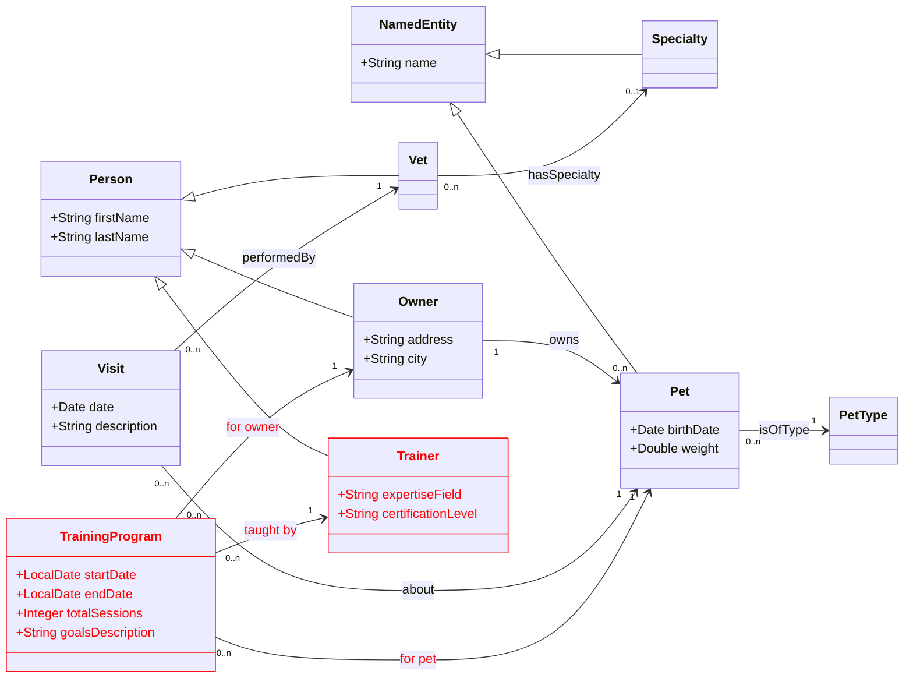

# Evaluación de Prompt

**Proveedor IA:** GEMINI
**Ejercicio:** TEST-RELATIONSHIPS-CODE-GENERATION
**Dominio:** PETCLINIC
**Fecha:** 4/6/2026, 23:31:41

## Índice
- [1. Contexto Oculto](#1-contexto-oculto)
- [2. Examen Seleccionado](#2-examen-seleccionado)
- [3. Prompt Visible](#3-prompt-visible)
- [4. Respuesta](#4-respuesta)

---

## 1. Contexto Oculto


=== PAQUETES DE LA PLANTILLA DEL PROYECTO ===
org.springframework.samples.petclinic.user
org.springframework.samples.petclinic.model
org.springframework.samples.petclinic.exceptions

REGLA CRÍTICA DE IMPORTS:
- Usa EXACTAMENTE estos paquetes para las clases que NO son base.
- Paquete raíz: org.springframework.samples.petclinic
- El paquete de ESTE test (Test2.java) debe ser: org.springframework.samples.petclinic;

=== CÓDIGO FUENTE REAL ===
package org.springframework.samples.petclinic.trainer;
import org.springframework.samples.petclinic.person.Person;
@Getter
@Setter
@Table(name = "trainers")
public class Trainer extends Person {
    String expertiseField;
    String certificationLevel;
}

// ---

package org.springframework.samples.petclinic.trainer;
public interface TrainerRepository {
    Optional<Trainer> findById(Integer id);
    List<Trainer> findAll();
    Trainer save(Trainer trainer);
}

// ---

package org.springframework.samples.petclinic.trainer;
public class TrainerService {
    TrainerRepository trainerRepository;
    public TrainerService(TrainerRepository trainerRepository) {
        this.trainerRepository = trainerRepository;
    }
}

// ---

package org.springframework.samples.petclinic.trainingprogram;
import org.springframework.samples.petclinic.owner.Owner;
import org.springframework.samples.petclinic.pet.Pet;
import org.springframework.samples.petclinic.trainer.Trainer;
@Getter
@Setter
@Table(name = "training_programs")
public class TrainingProgram {
    LocalDate startDate;
    LocalDate endDate;
    Integer totalSessions;
    String goalsDescription;
    @Transient
    Trainer trainer;
    @Transient
    Pet pet;
    @Transient
    Owner owner;
}

// ---

package org.springframework.samples.petclinic.trainingprogram;
public interface TrainingProgramRepository {
    Optional<TrainingProgram> findById(Integer id);
    List<TrainingProgram> findAll();
    TrainingProgram save(TrainingProgram trainingProgram);
}

// ---

package org.springframework.samples.petclinic.trainingprogram;
public class TrainingProgramService {
    TrainingProgramRepository trainingProgramRepository;
    public TrainingProgramService(TrainingProgramRepository trainingProgramRepository) {
        this.trainingProgramRepository = trainingProgramRepository;
    }
}

=== ENUNCIADO ===
En este ejercicio, añadiremos la funcionalidad de gestión de programas de entrenamiento y comportamiento para mascotas. Concretamente, se proporcionan las clases “Pet” y “Owner”, que representan a las mascotas registradas en la clínica y a sus propietarios, respectivamente. Además, tendremos la clase “Trainer”, que representa a los especialistas en entrenamiento y modificación de comportamiento animal, y la clase “TrainingProgram”, que registra los planes de entrenamiento personalizados para las mascotas. La clase Trainer, que extiende la clase Person, incluirá los atributos `expertiseField`, para describir su área de especialización (por ejemplo, "obediencia básica", "modificación de agresión"), y `certificationLevel`, para indicar su nivel de acreditación profesional. La clase TrainingProgram incluirá `startDate` y `endDate` para el periodo del programa, `totalSessions` para el número de sesiones planificadas y una `goalsDescription` detallando los objetivos de comportamiento a alcanzar. Se establecerá una relación que indica qué Trainer imparte los programas de entrenamiento, y a qué Pet y Owner están destinados estos programas.

Realizaremos una serie de ejercicios basados en funcionalidades que implementaremos en el sistema, y validaremos mediante pruebas unitarias.



=== REGLAS A EVALUAR (RESTRICCIONES / RELACIONES) ===
Elimine las anotaciones @Transient de los métodos y atributos que las tengan en las entidades creadas en el ejercicio anterior. Se pide crear las siguientes relaciones entre las entidades:

Cree una relación unidireccional desde “TrainingProgram” hacia “Trainer” que exprese la que aparece en el diagrama UML (mostrado en la primera página de este enunciado) respetando sus cardinalidades, usando el atributo “trainer” de la clase “TrainingProgram”. Debe asegurarse de que la relación expresa adecuadamente la cardinalidad que muestra el diagrama UML, por ejemplo, el atributo `trainer` no puede ser nulo puesto que la cardinalidad es 1 en el extremo de Trainer.

Además, se pide crear dos relaciones unidireccionales desde “TrainingProgram” hacia “Pet” y hacia “Owner” que representen las que aparecen en el diagrama UML, tenga en cuenta la cardinalidad que tienen usando como nombre de los atributos “pet” y “owner” en la clase “TrainingProgram”, respectivamente. Debe asegurarse de que las relaciones expresan adecuadamente la cardinalidad que muestra el diagrama UML, por ejemplo, los atributos `pet` y `owner` no pueden ser nulos puesto que la cardinalidad es 1 en sus respectivos extremos.


---

## 2. Examen Seleccionado
En este ejercicio, añadiremos la funcionalidad de gestión de programas de entrenamiento y comportamiento para mascotas. Concretamente, se proporcionan las clases “Pet” y “Owner”, que representan a las mascotas registradas en la clínica y a sus propietarios, respectivamente. Además, tendremos la clase “Trainer”, que representa a los especialistas en entrenamiento y modificación de comportamiento animal, y la clase “TrainingProgram”, que registra los planes de entrenamiento personalizados para las mascotas. La clase Trainer, que extiende la clase Person, incluirá los atributos `expertiseField`, para describir su área de especialización (por ejemplo, "obediencia básica", "modificación de agresión"), y `certificationLevel`, para indicar su nivel de acreditación profesional. La clase TrainingProgram incluirá `startDate` y `endDate` para el periodo del programa, `totalSessions` para el número de sesiones planificadas y una `goalsDescription` detallando los objetivos de comportamiento a alcanzar. Se establecerá una relación que indica qué Trainer imparte los programas de entrenamiento, y a qué Pet y Owner están destinados estos programas.

Realizaremos una serie de ejercicios basados en funcionalidades que implementaremos en el sistema, y validaremos mediante pruebas unitarias.


---

## 3. Prompt Visible
Nuestra misión es generar el test de un examen de la asignatura "Diseño y Pruebas". Actuamos como profesores evaluando conocimientos de JPA y mapeo objeto-relacional. Te proporcionaré el enunciado, el diagrama UML en Mermaid y, **CRÍTICAMENTE, el Código Base de las clases ya generadas**.

Por favor, no uses Wildcard Imports (asteriscos). Genera todos los imports de forma explícita, uno por cada clase utilizada. IMPORTANTE CENTRARSE EN LAS CLASES QUE SE PROPORCIONA COMO CÓDIGO BASE, DE SU LOCALIZACIÓN PARA PODER PONER CORRECTAMENTE LOS IMPORTS DE DONDE SE SACAN LAS CLASES.

---

## REGLA ABSOLUTA — PAQUETES: LEE EL CÓDIGO BASE, EVITA INVENTAR

Esta es la regla más importante del prompt. Debes seguirla antes que cualquier otra cosa.
Además, para las clases que no estén implementadas en el código base, buscarla en el repositorio pasado, como Pet, viene de pet.Pet

**Procedimiento obligatorio antes de escribir un solo import:**

1. Localiza la sección `=== PAQUETES DE LA PLANTILLA DEL PROYECTO ===` del contexto. En ella se te especificará la estructura de los paquetes a importar.
2. Para cada clase que necesites importar, busca su `package` en el código base proporcionado.
3. Construye el import como: `import <package_de_esa_clase>.<NombreClase>;`

- Deberás tener cuidado y poner los nombres de las clases nueva generadas, ya que no siempre es Achievement; deberás coger las clases del contexto que se te proporciona de la extensión funcional.

**Ejemplo concreto:**

- Si el código base de `Achievement.java` empieza con `package es.us.dp1.chess.tournament.achievement;`
- El import correcto en el test es: `import es.us.dp1.chess.tournament.achievement.Achievement;`
- Teniendo en cuenta las mayúsculas y minúsculas de las clases para evitar el error en los tests
- NUNCA: `import org.springframework.samples.chessgame.model.Achievement;`
- NUNCA: `import org.springframework.samples.petClinic.model.Achievement;`

**Aplica lo mismo para `@ComponentScan`:**
Al definir los paquetes, SIEMPRE poner los paquetes individuales necesarios, evitar globalizar en uno todo:

- CORRECTO: `@ComponentScan(basePackages = {"es.us.dp1.chess.tournament.achievement", "es.us.dp1.chess.tournament.userAchievement"})`
- INCORRECTO: `@ComponentScan(basePackages = {"org.springframework.samples.chessgame.repository", "org.springframework.samples.chessgame.model"})`
- INCORRECTO: `@ComponentScan(basePackages = {"es.us.dp1.chess.tournament"})`

**El paquete del propio test (`package ...` en la primera línea) también debe derivarse del código base**, usando el prefijo de donde se crean los test. Ejemplo: si el prefijo raíz es `es.us.dp1.chess.tournament`, el paquete del test será `es.us.dp1.chess.tournament`.

Si una clase (como `ReflexiveTest`, `NamedEntity`, etc.) no aparece en el código base proporcionado, usa el mismo prefijo raíz detectado para inferir su paquete. Nunca uses `org.springframework.samples.*` salvo que ese prefijo aparezca explícitamente en el código base.

Para las diferentes comprobaciones, vamos a llamar a los métodos que nos proporciona la clase ReflexiveTest que te paso dentro del archivo `test_previous_exams`. **IMPORTANTE:** tienes que llamar con el MISMO NOMBRE a los métodos que utilices, además de pasarle los MISMOS tipos de argumentos que pide cada método. A continuación, te proporciono una lista con todos los métodos disponibles y sus correspondientes argumentos necesarios. Los analizarás todos para usarlos correctamente en el test:

```java
void checkThatFieldIsAnnotatedWithDateTimeFormat(Class aClass, String fieldname,String format)

void checkThatFieldIsAnnotatedWith(Class aClass, String fieldname,Class annotationClass)

boolean  isFieldAnnotatedWith(Class aClass, String fieldname,Class annotationClass)

boolean classIsAnnotatedWith(Class class1, Class class2)

boolean classHasMethod(Object targetObject, String methodName, Class<?> ... parameterTypes)

void checkThatFieldsAreMandatory(Object validEntity,EntityManager em,String ... fieldnames )

void checkThatFieldIsMandatory(Object validEntity,String fieldname,Class<?> type,EntityManager em)

void checkThatValuesAreNotValid(Object validEntity,Map<String,List<Object>> invalidValues,EntityManager em)

void checkThatValueIsNotValid(Object validEntity,String fieldname,Object value,Class<?> type, EntityManager em)

Object setValue(Object object,String fieldname,Class<?> type, Object value)

Object invokeMethodReflexivelyWithParamTypes(Object targetObject, String methodName, Class<?>[] parameterTypes,Object ... parameterValues)

Object invokeMethodReflexively(Object o, String methodName, Object ... params)

void checkLinkedById(Class myClass,Integer id1,String methodName,Integer id2,EntityManager em)

Object getFieldValueReflexively(Object o, String fieldName)

void checkTransactional(Class<?> myClass,String methodName, Class<?>... parameterTypes)

boolean isMethodAnnotatedWithTest(Method method)

boolean isMethodAnnotatedWithBeforeEach(Method method)

boolean isMethodAnnotatedWithAfterEach(Method method)

void checkTransactionalRollback(Class<?> myClass,String methodName,Class<?>[] paramTypes,Class<? extends Exception> exceptionClass)

boolean isEntity(Class<T> clazz)
```

---

## Reglas de Coherencia Adicionales

2.  **Fidelidad al Código Base:** Si una clase en el código base tiene un atributo o relación con un nombre específico (ej. `checkInDate`), el test debe usar ese nombre exacto, ignorando lo que diga cualquier otro ejemplo externo.
3.  **Manejo de Relaciones:** Si en el Código Base una relación está marcada como `@Transient`, el test debe tratarla según las instrucciones del enunciado, pero siempre importando la clase desde su paquete real.

---

## Especificaciones del Examen

- **Clases Negras:** Núcleo estable (Contexto). No se testea su implementación interna, pero se usan para crear objetos válidos (ej. `Owner`, `Pet`).
- **Clases Rojas:** Tarea principal del alumno. Son las que debemos testear exhaustivamente (Restricciones, Anotaciones y Persistencia).
- **Límite:** Máximo 2 entidades rojas por examen.
- **Framework:** Java 17+, JUnit 5, Spring Boot (@DataJpaTest).
- **Herencia:** La clase de test DEBE extender de `ReflexiveTest`.

---

## Estructura Estricta Requerida para Test2.java

Debes generar una clase de pruebas que siga EXACTAMENTE el patrón de diseño proporcionado, siguiendo los ejemplos proporcionados en el archivo markdown "test_previous_exams" anotados como **Test 2: Relaciones entre las entidades**. La clase evaluará lo necesario apoyándose en los métodos de la clase padre `ReflexiveTest`.

### 1. Configuración de la Clase e Inyección de Dependencias

- **Clase y Herencia:** La clase debe ser pública, estar anotada obligatoriamente con `@DataJpaTest()` y heredar de `ReflexiveTest` (IMPORTANTE: DEBE USARSE SI O SI ESTA CLASE PARA LA GENERACIÓN DE LOS TESTS, DEBE PONER ReflexiveTest en la parte de `extends...`)
- **Inyección:** Inyecta EXCLUSIVAMENTE el `EntityManager` utilizando `@Autowired(required = false)` (NUNCA TestEntityManager). Evita inyectar repositorios a menos que la creación de la entidad base lo requiera de forma crítica.
- El nombre ESTRICTO del paquete donde se tiene que generar el test es:
  - Clínica Veterinaria: `package org.springframework.samples.petclinic`
  - Ajedrez: `package es.us.dp1.chess.tournament`
- Inyecta SIEMPRE como `@MockBean` el servicio `UserService`:

```java
    @MockBean
    private UserService userService;
```

- Usa `@ComponentScan` apuntando a los paquetes reales detectados en el Código Base (ver Regla Absoluta).
- **IMPORTANTE** los imports de las anotaciones a comprobar deberán venir de jakarta, NUNCA DE javax:
  - CORRECTO: jakarta.persistence.Column;
  - INCORRECTO: javax.persistence.Column;

### 2. Verificación de Anotaciones (Relaciones JPA)

- **Nomenclatura del Método:** Crea un método llamado `test[Num][NombreEntidad]Annotations()` por cada entidad a evaluar (ej. `test2TreatmentAnnotations()`). Debe ser `public void` y llevar la anotación `@Test`.
- **Implementación (Estricta):** Dentro del método, usa ÚNICAMENTE el método heredado `checkThatFieldIsAnnotatedWith` para comprobar relaciones.
- **Formato exacto:** `checkThatFieldIsAnnotatedWith(Entidad.class, "nombreDelAtributo", TipoDeRelacion.class);` (Donde `TipoDeRelacion` será `ManyToMany.class`, `ManyToOne.class`, etc.).
- Agrupa todas las aserciones de una misma entidad en su método correspondiente.

### 3. Verificación de Restricciones (Constraints y Obligatoriedad)

- **Nomenclatura del Método:** Crea un método llamado `test[Num][NombreEntidad]Constraints()` por cada relación a implementar (ej. `test2TreatmentConstraints()`). Es obligatorio que sea `public void` y lleve la anotación `@Test` (evita métodos privados o JUnit no los ejecutará).
- **Instanciación de la Entidad:** Para probar las restricciones, la primera línea del método debe instanciar una entidad válida llamando a la factoría de `Test1` pasándole el EntityManager. Formato exacto: `NombreEntidad e = Test1.createValid[NombreEntidad](em);`
- **Filtro de Atributos (¡IMPORTANTE!):** Genera aserciones ÚNICAMENTE para los atributos que implementan las relaciones exigidas en este ejercicio. Omite estrictamente cualquier aserción de obligatoriedad para atributos básicos (como ids, nombres, fechas, etc.) que no formen parte de la relación que se está evaluando.
- **Implementación (Estricta):** Tras instanciar la entidad, usa ÚNICAMENTE el método heredado `checkThatFieldsAreMandatory` para verificar la obligatoriedad de los atributos filtrados en el paso anterior.
- **Formato exacto:** checkThatFieldsAreMandatory(e, em, "nombreDelAtributoRelacion");

### 4. Métodos Auxiliares y Reglas Críticas de Sintaxis

- **createValid[NOMBRE_ENTIDAD](EntityManager em):** Método estático que construye una instancia válida.
- **IMPORTANTE:** Usa EXCLUSIVAMENTE `setValue(objeto, "atributo", Tipo.class, valor)` proporcionado por `ReflexiveTest` para asignar datos, evitando fallos si no existen setters.
- **Evita aserciones estándar:** NO uses `assertNotNull`, `assertDoesNotThrow` ni pruebes repositorios con `.save()` a menos que se te pida explícitamente. Cíñete a los métodos de aserción de `ReflexiveTest` (`checkThatFieldIsAnnotatedWith` y `checkThatFieldsAreMandatory`).
- **Separación de responsabilidades**: Mantén estrictamente separados los métodos que comprueban anotaciones de los métodos que comprueban restricciones de validación.
- **Limpieza**: Omite comentarios innecesarios, importaciones no utilizadas y explicaciones adicionales. Devuelve únicamente el código Java solicitado.
- **IMPORTANTE**: Omitir crear tests estáticos, para poder usar el método `super`.
- Todos los métodos auxiliares que sean necesarios deberán crearse en la misma clase, el test DEBE ser autosuficiente.
- Al crear alguna entidad válida en un método auxiliar, SIEMPRE crear primero los objetos padre, es decir, si un Pet tiene un Owner, primero se deberá crear el Owner y después el Pet. Esto evitará errores de persistencia.

---

## Restricciones de Salida (Formato)

- **PROHIBIDO** generar comentarios explicativos.
- **PROHIBIDO** envolver el código en bloques de código markdown (sin \`\`\`java).
- **PROHIBIDO** incluir texto antes o después del código.
- Entrega el código listo para ser copiado y pegado en un archivo `.java`.

---

## 4. Respuesta
package org.springframework.samples.petclinic;

import org.springframework.boot.test.autoconfigure.orm.jpa.DataJpaTest;
import org.springframework.beans.factory.annotation.Autowired;
import jakarta.persistence.EntityManager;
import org.junit.jupiter.api.Test;
import org.springframework.boot.test.mock.mockito.MockBean;
import org.springframework.context.annotation.ComponentScan;

import org.springframework.samples.petclinic.user.UserService;
import org.springframework.samples.petclinic.trainer.Trainer;
import org.springframework.samples.petclinic.trainingprogram.TrainingProgram;
import org.springframework.samples.petclinic.person.Person;
import org.springframework.samples.petclinic.owner.Owner;
import org.springframework.samples.petclinic.pet.Pet;
import org.springframework.samples.petclinic.model.PetType;

import jakarta.persistence.ManyToOne;
import jakarta.persistence.JoinColumn;
import jakarta.validation.constraints.NotNull;

import java.time.LocalDate;

@DataJpaTest()
@ComponentScan(basePackages = {
    "org.springframework.samples.petclinic.trainer",
    "org.springframework.samples.petclinic.trainingprogram",
    "org.springframework.samples.petclinic.owner",
    "org.springframework.samples.petclinic.pet",
    "org.springframework.samples.petclinic.person",
    "org.springframework.samples.petclinic.model"
})
public class Test2 extends ReflexiveTest {

    @Autowired(required = false)
    private EntityManager em;

    @MockBean
    private UserService userService;

    private Trainer createValidTrainer(EntityManager em) {
        Trainer trainer = new Trainer();
        setValue(trainer, "firstName", String.class, "John");
        setValue(trainer, "lastName", String.class, "Doe");
        setValue(trainer, "expertiseField", String.class, "Basic Obedience");
        setValue(trainer, "certificationLevel", String.class, "Level 2");
        em.persist(trainer);
        return trainer;
    }

    private Owner createValidOwner(EntityManager em) {
        Owner owner = new Owner();
        setValue(owner, "firstName", String.class, "Jane");
        setValue(owner, "lastName", String.class, "Smith");
        setValue(owner, "address", String.class, "123 Main St");
        setValue(owner, "city", String.class, "Springfield");
        setValue(owner, "telephone", String.class, "5551234567");
        em.persist(owner);
        return owner;
    }

    private PetType createValidPetType(EntityManager em) {
        PetType petType = new PetType();
        setValue(petType, "name", String.class, "Dog");
        em.persist(petType);
        return petType;
    }

    private Pet createValidPet(EntityManager em) {
        Pet pet = new Pet();
        Owner owner = createValidOwner(em);
        PetType petType = createValidPetType(em);

        setValue(pet, "name", String.class, "Buddy");
        setValue(pet, "birthDate", LocalDate.class, LocalDate.now().minusYears(2));
        setValue(pet, "weight", Double.class, 10.5);
        setValue(pet, "owner", Owner.class, owner);
        setValue(pet, "type", PetType.class, petType);
        em.persist(pet);
        return pet;
    }

    private TrainingProgram createValidTrainingProgram(EntityManager em) {
        TrainingProgram trainingProgram = new TrainingProgram();
        Trainer trainer = createValidTrainer(em);
        Pet pet = createValidPet(em);
        Owner owner = (Owner) getFieldValueReflexively(pet, "owner");

        setValue(trainingProgram, "startDate", LocalDate.class, LocalDate.now());
        setValue(trainingProgram, "endDate", LocalDate.class, LocalDate.now().plusMonths(3));
        setValue(trainingProgram, "totalSessions", Integer.class, 12);
        setValue(trainingProgram, "goalsDescription", String.class, "Improve basic obedience and reduce leash pulling.");
        setValue(trainingProgram, "trainer", Trainer.class, trainer);
        setValue(trainingProgram, "pet", Pet.class, pet);
        setValue(trainingProgram, "owner", Owner.class, owner);

        return trainingProgram;
    }

    @Test
    public void test2TrainingProgramAnnotations() {
        checkThatFieldIsAnnotatedWith(TrainingProgram.class, "trainer", ManyToOne.class);
        checkThatFieldIsAnnotatedWith(TrainingProgram.class, "trainer", JoinColumn.class);

        checkThatFieldIsAnnotatedWith(TrainingProgram.class, "pet", ManyToOne.class);
        checkThatFieldIsAnnotatedWith(TrainingProgram.class, "pet", JoinColumn.class);

        checkThatFieldIsAnnotatedWith(TrainingProgram.class, "owner", ManyToOne.class);
        checkThatFieldIsAnnotatedWith(TrainingProgram.class, "owner", JoinColumn.class);
    }

    @Test
    public void test2TrainingProgramConstraints() {
        TrainingProgram trainingProgram = createValidTrainingProgram(em);
        checkThatFieldsAreMandatory(trainingProgram, em, "trainer", "pet", "owner");
    }
}