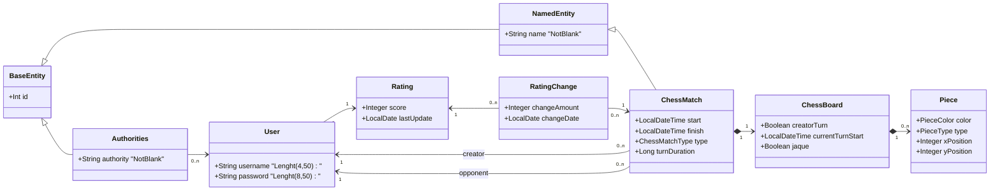

# Evaluación de Prompt

**Ejercicio:** TEST_ATTRIBUTES_CODE_GENERATION
**Dominio:** CHESS
**Fecha:** 4/5/2026, 20:49:32

## Índice
- [1. Contexto Oculto](#1-contexto-oculto)
- [2. Examen Seleccionado](#2-examen-seleccionado)
- [3. Prompt Visible](#3-prompt-visible)
- [4. Respuesta](#4-respuesta)

---

## 1. Contexto Oculto

=== PAQUETES DE LA PLANTILLA DEL PROYECTO ===
es.us.dp1.chess.tournament.user
es.us.dp1.chess.tournament.model
es.us.dp1.chess.tournament.exceptions

REGLA CRÍTICA DE IMPORTS:
- Usa EXACTAMENTE estos paquetes para las clases que NO son base.
- Paquete raíz: es.us.dp1.chess.tournament
- El paquete de ESTE test (Test1.java) debe ser: es.us.dp1.chess.tournament;

=== CÓDIGO FUENTE REAL ===
package es.us.dp1.chess.tournament.rating;
@Getter
@Setter
public class Rating {
    Integer score;
    LocalDate lastUpdate;
    @Transient
    List<RatingChange> ratingChanges;
}

// ---

package es.us.dp1.chess.tournament.rating;
public interface RatingRepository {
    Optional<Rating> findById(Integer id);
    List<Rating> findAll();
    Rating save(Rating rating);
}

// ---

package es.us.dp1.chess.tournament.rating;
public class RatingService {
    RatingRepository ratingRepository;
    public RatingService(RatingRepository ratingRepository) {
        this.ratingRepository = ratingRepository;
    }
}

// ---

package es.us.dp1.chess.tournament.ratingchange;
@Getter
@Setter
public class RatingChange {
    Integer changeAmount;
    LocalDate changeDate;
    @Transient
    Rating rating;
    @Transient
    ChessMatch chessMatch;
}

// ---

package es.us.dp1.chess.tournament.ratingchange;
public interface RatingChangeRepository {
    Optional<RatingChange> findById(Integer id);
    List<RatingChange> findAll();
    RatingChange save(RatingChange ratingChange);
}

// ---

package es.us.dp1.chess.tournament.ratingchange;
public class RatingChangeService {
    RatingChangeRepository ratingChangeRepository;
    public RatingChangeService(RatingChangeRepository ratingChangeRepository) {
        this.ratingChangeRepository = ratingChangeRepository;
    }
}

=== ENUNCIADO ===
En este ejercicio, añadiremos la funcionalidad de gestión del sistema de puntuación ELO para los jugadores. Concretamente, se proporcionará una clase `User` que representa a los usuarios del sistema. Los jugadores, al participar en partidas de ajedrez, verán sus puntuaciones ELO actualizadas. Para gestionar esto, tendremos la clase `Rating`, que almacenará la puntuación ELO actual de un jugador. Esta clase incluirá el atributo `score` para la puntuación numérica del jugador y `lastUpdate` para registrar la fecha de la última modificación de dicha puntuación. Además, contaremos con la clase `RatingChange` para llevar un registro histórico de cada ajuste en la puntuación ELO. `RatingChange` tendrá un atributo `changeAmount` que indicará la variación de puntos (positiva o negativa) y `changeDate` para el momento exacto en que se produjo dicho cambio.

Las relaciones entre estas entidades son las siguientes: cada `User` tendrá una única instancia de `Rating` que representa su puntuación actual. A su vez, cada `Rating` estará asociado a múltiples `RatingChange`, documentando la evolución de la puntuación del jugador. Finalmente, cada `RatingChange` se vinculará a la `ChessMatch` específica que motivó dicho ajuste de puntos.

Realizaremos una serie de ejercicios basados en funcionalidades que implementaremos en el sistema, y validaremos mediante pruebas unitarias.

=== REGLAS A EVALUAR (RESTRICCIONES / RELACIONES) ===
Modificar las clases “Rating” y “RatingChange” para que sean entidades. Estas deben tener los siguientes atributos y restricciones:

**Para ambas clases:**

- El atributo de tipo entero (Integer) llamado “id” actuará como clave primaria en la tabla de la base de datos relacional asociada a la entidad.

**Para la clase Rating:**

- Un atributo de tipo entero (Integer) llamado “score”, que representa la puntuación ELO actual del jugador. Este atributo será obligatorio (no puede ser nulo) y tendrá un valor mínimo de 0 y un valor máximo de 3000.
- Un atributo de tipo fecha (LocalDate) llamado “lastUpdate”, que representa la fecha de la última actualización de la puntuación ELO del jugador. Este atributo debe ser obligatorio y seguirá el formato “dd/MM/yyyy” (puede usar como ejemplo la clase Pet y su fecha de nacimiento para ver cómo se especificar dicho formato, pero nótese que el patrón del formato es distinto).

**Para la clase RatingChange:**

- Un atributo de tipo entero (Integer) llamado “changeAmount”, que indica la variación de puntos ELO (positiva o negativa) que se ha producido. Este atributo será obligatorio (no puede ser nulo) y tendrá un valor mínimo de -200 y un valor máximo de 200.
- Un atributo de tipo fecha (LocalDate) llamado “changeDate”, que representa la fecha exacta en que se registró el cambio de puntuación. Este atributo debe ser obligatorio y seguirá el formato “dd/MM/yyyy” (puede usar como ejemplo la clase Pet y su fecha de nacimiento para ver cómo se especificar dicho formato, pero nótese que el patrón del formato es distinto).

No modifique por ahora las anotaciones @Transient de las clases. Modificar las interfaces “RatingRepository” y “RatingChangeRepository” alojada en el mismo paquete para que extienda a CrudRepository.

---

## 2. Examen Seleccionado
En este ejercicio, añadiremos la funcionalidad de gestión del sistema de puntuación ELO para los jugadores. Concretamente, se proporcionará una clase `User` que representa a los usuarios del sistema. Los jugadores, al participar en partidas de ajedrez, verán sus puntuaciones ELO actualizadas. Para gestionar esto, tendremos la clase `Rating`, que almacenará la puntuación ELO actual de un jugador. Esta clase incluirá el atributo `score` para la puntuación numérica del jugador y `lastUpdate` para registrar la fecha de la última modificación de dicha puntuación. Además, contaremos con la clase `RatingChange` para llevar un registro histórico de cada ajuste en la puntuación ELO. `RatingChange` tendrá un atributo `changeAmount` que indicará la variación de puntos (positiva o negativa) y `changeDate` para el momento exacto en que se produjo dicho cambio.

Las relaciones entre estas entidades son las siguientes: cada `User` tendrá una única instancia de `Rating` que representa su puntuación actual. A su vez, cada `Rating` estará asociado a múltiples `RatingChange`, documentando la evolución de la puntuación del jugador. Finalmente, cada `RatingChange` se vinculará a la `ChessMatch` específica que motivó dicho ajuste de puntos.

Realizaremos una serie de ejercicios basados en funcionalidades que implementaremos en el sistema, y validaremos mediante pruebas unitarias.

---

## 3. Prompt Visible
# PROMPT COMPLETO PARA GENERACIÓN DE TESTS DE RESTRICCIONES DE ATRIBUTOS

## Recursos a proporcionar:
* `test_previous_exams.md`

## Prompt a utilizar
Nuestra misión es generar el test de un examen de la asignatura "Diseño y Pruebas". Actuamos como profesores evaluando conocimientos de JPA y mapeo objeto-relacional. Te proporcionaré el enunciado, el diagrama UML en Mermaid y, **CRÍTICAMENTE, el Código Base de las clases ya generadas**.

Por favor, no uses Wildcard Imports (asteriscos). Genera todos los imports de forma explícita, uno por cada clase utilizada. IMPORTANTE CENTRARSE EN LAS CLASES QUE SE PROPORCIONA COMO CÓDIGO BASE, DE SU LOCALIZACIÓN PARA PODER PONER CORRECTAMENTE LOS IMPORTS DE DONDE SE SACAN LAS CLASES.

---

## ⚠️ REGLA ABSOLUTA Nº 1 — PAQUETES: LEE EL CÓDIGO BASE, NO INVENTES

Esta es la regla más importante del prompt. Debes seguirla antes que cualquier otra cosa.
Además, para las clases que no estén implementadas en el código base, buscarla en el repositorio pasado, como Pet, viene de pet.Pet

**Procedimiento obligatorio antes de escribir un solo import:**

1. Localiza la sección `=== PAQUETES REALES DETECTADOS EN EL CÓDIGO BASE ===` del contexto.
2. Para cada clase que necesites importar, busca su `package` en el código base proporcionado.
3. Construye el import como: `import <package_de_esa_clase>.<NombreClase>;`
- Pero ten en cuenta en poner los nombres de las clases nueva generadas, no es siempre Achievement; sino q coja las clases del contexto que se le pase de la extensión funcional.

**Ejemplo concreto:**
- Si el código base de `Achievement.java` empieza con `package es.us.dp1.chess.tournament.achievement;`
- El import correcto en el test es: `import es.us.dp1.chess.tournament.achievement.Achievement;`
- Teniendo en cuenta las mayúsculas y minúsculas de las clases para evitar el error en los tests
- ❌ NUNCA: `import org.springframework.samples.chessgame.model.Achievement;`
- ❌ NUNCA: `import org.springframework.samples.petClinic.model.Achievement;`

**Aplica lo mismo para `@ComponentScan`:**
- ✅ CORRECTO: `@ComponentScan(basePackages = {"es.us.dp1.chess.tournament.achievement", "es.us.dp1.chess.tournament.userAchievement"})`
- ❌ INCORRECTO: `@ComponentScan(basePackages = {"org.springframework.samples.chessgame.repository", "org.springframework.samples.chessgame.model"})`

**El paquete del propio test (`package ...` en la primera línea) también debe derivarse del código base**, usando el prefijo de donde se crean los test. Ejemplo: si el prefijo raíz es `es.us.dp1.chess.tournament`, el paquete del test será `es.us.dp1.chess.tournament`.

Si una clase (como `ReflexiveTest`, `NamedEntity`, etc.) no aparece en el código base proporcionado, usa el mismo prefijo raíz detectado para inferir su paquete. Nunca uses `org.springframework.samples.*` salvo que ese prefijo aparezca explícitamente en el código base.

Tienes que tener en cuenta como los métodos se llaman en ReflexiveTest

---

## Reglas de Coherencia Adicionales
2.  **Fidelidad al Código Base:** Si una clase en el código base tiene un atributo con un nombre específico (ej. `checkInDate`), el test debe usar ese nombre exacto, ignorando lo que diga cualquier otro ejemplo externo.
3.  **Manejo de Relaciones:** Si en el Código Base una relación está marcada como `@Transient`, el test debe tratarla según las instrucciones del enunciado, pero siempre importando la clase desde su paquete real.

---

## Especificaciones del Examen
- **Clases Negras:** Núcleo estable (Contexto). No se testea su implementación interna, pero se usan para crear objetos válidos (ej. `Owner`, `Pet`).
- **Clases Rojas:** Tarea principal del alumno. Son las que debemos testear exhaustivamente (Restricciones, Anotaciones y Persistencia).
- **Límite:** Máximo 2 entidades rojas por examen.
- **Framework:** Java 17+, JUnit 5, Spring Boot (@DataJpaTest).
- **Herencia:** La clase de test DEBE extender de `ReflexiveTest`.

---

## Estructura Requerida para Test1.java

### 1. Configuración e Inyección
- Inyecta los Repositorios de las entidades rojas y el `EntityManager` mediante `@Autowired`.
- Usa `@ComponentScan` apuntando a los paquetes reales detectados en el Código Base (ver Regla Absoluta Nº 1).

### 2. Verificación de Repositorios
- **test1RepositoriesExist():** Verifica `assertNotNull`. Al final, debe llamar a `test1RepositoriesContainsMethod()` solo si el repo no es nulo.
- **test1RepositoriesContainsMethod():** (SIN @Test) Verifica que el repo tiene el método `.count()` o similar mediante reflexión/interfaz.

### 3. Validación de Restricciones (Constraints)
- **test1Check[NOMBRE_ENTIDAD]Constraints():**
    - Invoca `checkThatFieldsAreMandatory` con los campos `NotNull/NotBlank` identificados.
    - Crea el mapa `invalidValues` usando `Map.of(...)`. **PROHIBIDO usar `new HashMap()`**.
    - Los valores de prueba deben ser coherentes con el tipo de dato del Código Base (si es `Double`, usa `0.0`; si es `Integer`, `0`).
    - Invoca `checkThatValuesAreNotValid`.

### 4. Verificación de Anotaciones
- **test1Check[NOMBRE_ENTIDAD]Annotations():**
    - Verifica `@Entity` con `classIsAnnotatedWith`.
    - Verifica `@Enumerated(EnumType.STRING)` si hay Enums.
    - Verifica `@Size`, `@Positive`, `@FutureOrPresent`, etc., según el UML.

### 5. Métodos Auxiliares y Persistencia
- **createValid[NOMBRE_ENTIDAD](EntityManager em):** Método estático que construye una instancia válida.
- **IMPORTANTE:** Usa EXCLUSIVAMENTE `setValue(objeto, "atributo", Tipo.class, valor)` para asignar datos, evitando fallos si no existen setters.
- **test1Valid[NOMBRE_ENTIDAD]IsPersisted():** Verifica que `repo.save()` no lanza excepciones (`assertDoesNotThrow`) y haz `.flush()`.

---

### 2. Verificación de Repositorios
- **test1RepositoriesExist():** Verifica `assertNotNull`. Al final, debe llamar a `test1RepositoriesContainsMethod()` solo si el repo no es nulo.
- **test1RepositoriesContainsMethod():** (SIN @Test) Verifica que el repo tiene el método `.count()` o similar mediante reflexión/interfaz.

### 3. Validación de Restricciones (Constraints)
- **test1Check[NOMBRE_ENTIDAD]Constraints():**
    - Invoca `checkThatFieldsAreMandatory` con los campos `NotNull/NotBlank` identificados.
    - Crea el mapa `invalidValues` usando `Map.of(...)`. **PROHIBIDO usar `new HashMap()`**.
    - Los valores de prueba deben ser coherentes con el tipo de dato del Código Base (si es `Double`, usa `0.0`; si es `Integer`, `0`).
    - Invoca `checkThatValuesAreNotValid`.

### 4. Verificación de Anotaciones
- **test1Check[NOMBRE_ENTIDAD]Annotations():**
    - Verifica `@Entity` con `classIsAnnotatedWith`.
    - Verifica `@Enumerated(EnumType.STRING)` si hay Enums.
    - Verifica `@Size`, `@Positive`, `@FutureOrPresent`, etc., según el UML.

### 5. Métodos Auxiliares y Persistencia
- **createValid[NOMBRE_ENTIDAD](EntityManager em):** Método estático que construye una instancia válida.
- **IMPORTANTE:** Usa EXCLUSIVAMENTE `setValue(objeto, "atributo", Tipo.class, valor)` para asignar datos, evitando fallos si no existen setters.
- **test1Valid[NOMBRE_ENTIDAD]IsPersisted():** Verifica que `repo.save()` no lanza excepciones (`assertDoesNotThrow`) y haz `.flush()`.

---

## Restricciones de Salida (Formato)
- **PROHIBIDO** generar comentarios explicativos.
- **PROHIBIDO** envolver el código en bloques de código markdown (sin \`\`\`java).
- **PROHIBIDO** incluir texto antes o después del código.
- Entrega el código listo para ser copiado y pegado en un archivo `.java`.

---

## 4. Respuesta
package es.us.dp1.chess.tournament;

import es.us.dp1.chess.tournament.rating.Rating;
import es.us.dp1.chess.tournament.rating.RatingRepository;
import es.us.dp1.chess.tournament.ratingchange.RatingChange;
import es.us.dp1.chess.tournament.ratingchange.RatingChangeRepository;
import jakarta.persistence.Column;
import jakarta.persistence.Entity;
import jakarta.persistence.GeneratedValue;
import jakarta.persistence.GenerationType;
import jakarta.persistence.Id;
import jakarta.validation.ConstraintViolationException;
import jakarta.validation.constraints.Max;
import jakarta.validation.constraints.Min;
import jakarta.validation.constraints.NotNull;
import org.junit.jupiter.api.Test;
import org.springframework.beans.factory.annotation.Autowired;
import org.springframework.boot.test.autoconfigure.orm.jpa.DataJpaTest;
import org.springframework.boot.test.autoconfigure.orm.jpa.TestEntityManager;
import org.springframework.context.annotation.ComponentScan;
import org.springframework.format.annotation.DateTimeFormat;
import org.springframework.stereotype.Repository;
import org.springframework.transaction.annotation.Transactional;

import java.time.LocalDate;
import java.util.Map;
import java.util.Optional;
import java.lang.reflect.Method;

import static org.junit.jupiter.api.Assertions.assertDoesNotThrow;
import static org.junit.jupiter.api.Assertions.assertNotNull;
import static org.junit.jupiter.api.Assertions.assertTrue;
import static org.junit.jupiter.api.Assertions.assertThrows;

@DataJpaTest
@ComponentScan(basePackages = {"es.us.dp1.chess.tournament.rating", "es.us.dp1.chess.tournament.ratingchange"})
@Transactional
public class Test1 extends ReflexiveTest {

    @Autowired
    private RatingRepository ratingRepository;

    @Autowired
    private RatingChangeRepository ratingChangeRepository;

    @Autowired
    private TestEntityManager tem;

    @Test
    void test1RepositoriesExist() {
        assertNotNull(ratingRepository, "RatingRepository should be autowired");
        assertNotNull(ratingChangeRepository, "RatingChangeRepository should be autowired");
        test1RepositoriesContainsMethod();
    }

    void test1RepositoriesContainsMethod() {
        assertTrue(ratingRepository.getClass().isAnnotationPresent(Repository.class), "RatingRepository should be annotated with @Repository");
        assertTrue(ratingChangeRepository.getClass().isAnnotationPresent(Repository.class), "RatingChangeRepository should be annotated with @Repository");

        // Verify CrudRepository methods
        assertDoesNotThrow(() -> {
            Method findByIdMethod = RatingRepository.class.getMethod("findById", Integer.class);
            assertNotNull(findByIdMethod, "RatingRepository should have findById method");
            Method saveMethod = RatingRepository.class.getMethod("save", Rating.class);
            assertNotNull(saveMethod, "RatingRepository should have save method");
            Method countMethod = RatingRepository.class.getMethod("count");
            assertNotNull(countMethod, "RatingRepository should have count method");
        }, "RatingRepository should extend CrudRepository and have its methods");

        assertDoesNotThrow(() -> {
            Method findByIdMethod = RatingChangeRepository.class.getMethod("findById", Integer.class);
            assertNotNull(findByIdMethod, "RatingChangeRepository should have findById method");
            Method saveMethod = RatingChangeRepository.class.getMethod("save", RatingChange.class);
            assertNotNull(saveMethod, "RatingChangeRepository should have save method");
            Method countMethod = RatingChangeRepository.class.getMethod("count");
            assertNotNull(countMethod, "RatingChangeRepository should have count method");
        }, "RatingChangeRepository should extend CrudRepository and have its methods");
    }

    @Test
    void test1CheckRatingConstraints() {
        checkThatFieldsAreMandatory(Rating.class, "score", "lastUpdate");

        Map<String, Object> invalidValuesScoreMin = Map.of("score", -1);
        checkThatValuesAreNotValid(Rating.class, invalidValuesScoreMin);

        Map<String, Object> invalidValuesScoreMax = Map.of("score", 3001);
        checkThatValuesAreNotValid(Rating.class, invalidValuesScoreMax);
    }

    @Test
    void test1CheckRatingAnnotations() {
        classIsAnnotatedWith(Rating.class, Entity.class);

        // id field annotations
        fieldIsAnnotatedWith(Rating.class, "id", Id.class);
        fieldIsAnnotatedWith(Rating.class, "id", GeneratedValue.class);
        hasGeneratedValueStrategy(Rating.class, "id", GenerationType.IDENTITY);
        hasColumn(Rating.class, "id"); // BaseEntity usually has @Column too

        // score field annotations
        fieldIsAnnotatedWith(Rating.class, "score", NotNull.class);
        fieldIsAnnotatedWith(Rating.class, "score", Min.class);
        hasMin(Rating.class, "score", 0);
        fieldIsAnnotatedWith(Rating.class, "score", Max.class);
        hasMax(Rating.class, "score", 3000);

        // lastUpdate field annotations
        fieldIsAnnotatedWith(Rating.class, "lastUpdate", NotNull.class);
        fieldIsAnnotatedWith(Rating.class, "lastUpdate", DateTimeFormat.class);
        hasDateTimeFormatPattern(Rating.class, "lastUpdate", "dd/MM/yyyy");
    }

    @Test
    void test1ValidRatingIsPersisted() {
        Rating rating = createValidRating();
        assertDoesNotThrow(() -> {
            ratingRepository.save(rating);
            tem.flush();
        }, "Valid Rating should be persisted without throwing exceptions");
        assertNotNull(rating.getId(), "Persisted Rating should have an ID");
        Optional<Rating> foundRating = ratingRepository.findById(rating.getId());
        assertTrue(foundRating.isPresent(), "Persisted Rating should be retrievable");
    }

    static Rating createValidRating() {
        Rating rating = new Rating();
        setValue(rating, "score", Integer.class, 1500);
        setValue(rating, "lastUpdate", LocalDate.class, LocalDate.of(2023, 1, 15));
        return rating;
    }

    @Test
    void test1CheckRatingChangeConstraints() {
        checkThatFieldsAreMandatory(RatingChange.class, "changeAmount", "changeDate");

        Map<String, Object> invalidValuesChangeAmountMin = Map.of("changeAmount", -201);
        checkThatValuesAreNotValid(RatingChange.class, invalidValuesChangeAmountMin);

        Map<String, Object> invalidValuesChangeAmountMax = Map.of("changeAmount", 201);
        checkThatValuesAreNotValid(RatingChange.class, invalidValuesChangeAmountMax);
    }

    @Test
    void test1CheckRatingChangeAnnotations() {
        classIsAnnotatedWith(RatingChange.class, Entity.class);

        // id field annotations
        fieldIsAnnotatedWith(RatingChange.class, "id", Id.class);
        fieldIsAnnotatedWith(RatingChange.class, "id", GeneratedValue.class);
        hasGeneratedValueStrategy(RatingChange.class, "id", GenerationType.IDENTITY);
        hasColumn(RatingChange.class, "id");

        // changeAmount field annotations
        fieldIsAnnotatedWith(RatingChange.class, "changeAmount", NotNull.class);
        fieldIsAnnotatedWith(RatingChange.class, "changeAmount", Min.class);
        hasMin(RatingChange.class, "changeAmount", -200);
        fieldIsAnnotatedWith(RatingChange.class, "changeAmount", Max.class);
        hasMax(RatingChange.class, "changeAmount", 200);

        // changeDate field annotations
        fieldIsAnnotatedWith(RatingChange.class, "changeDate", NotNull.class);
        fieldIsAnnotatedWith(RatingChange.class, "changeDate", DateTimeFormat.class);
        hasDateTimeFormatPattern(RatingChange.class, "changeDate", "dd/MM/yyyy");
    }

    @Test
    void test1ValidRatingChangeIsPersisted() {
        RatingChange ratingChange = createValidRatingChange();
        assertDoesNotThrow(() -> {
            ratingChangeRepository.save(ratingChange);
            tem.flush();
        }, "Valid RatingChange should be persisted without throwing exceptions");
        assertNotNull(ratingChange.getId(), "Persisted RatingChange should have an ID");
        Optional<RatingChange> foundRatingChange = ratingChangeRepository.findById(ratingChange.getId());
        assertTrue(foundRatingChange.isPresent(), "Persisted RatingChange should be retrievable");
    }

    static RatingChange createValidRatingChange() {
        RatingChange ratingChange = new RatingChange();
        setValue(ratingChange, "changeAmount", Integer.class, 10);
        setValue(ratingChange, "changeDate", LocalDate.class, LocalDate.of(2023, 1, 16));
        return ratingChange;
    }
}