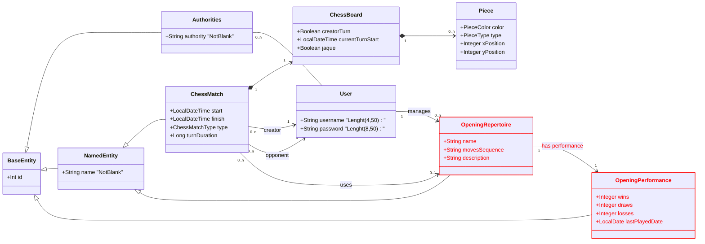

# Evaluación de Prompt

**Ejercicio:** TEST-ATTRIBUTES-CODE-GENERATION
**Dominio:** CHESS
**Fecha:** 4/6/2026, 23:45:09

## Índice
- [1. Contexto Oculto](#1-contexto-oculto)
- [2. Examen Seleccionado](#2-examen-seleccionado)
- [3. Prompt Visible](#3-prompt-visible)
- [4. Respuesta](#4-respuesta)

---

## 1. Contexto Oculto


=== PAQUETES DE LA PLANTILLA DEL PROYECTO ===
es.us.dp1.chess.tournament.user
es.us.dp1.chess.tournament.model
es.us.dp1.chess.tournament.exceptions

REGLA CRÍTICA DE IMPORTS:
- Usa EXACTAMENTE estos paquetes para las clases que NO son base.
- Paquete raíz: es.us.dp1.chess.tournament
- El paquete de ESTE test (Test1.java) debe ser: es.us.dp1.chess.tournament;

=== CÓDIGO FUENTE REAL ===
package es.us.dp1.chess.tournament.openingrepertoire;
import es.us.dp1.chess.tournament.openingperformance.OpeningPerformance;
import es.us.dp1.chess.tournament.match.ChessMatch;
import es.us.dp1.chess.tournament.user.User;
@Getter
@Setter
@Table(name = "opening_repertoires")
public class OpeningRepertoire {
    String name;
    String movesSequence;
    String description;
    @Transient
    User manager;
    @Transient
    List<ChessMatch> usedInMatches;
    @Transient
    OpeningPerformance performance;
}

// ---

package es.us.dp1.chess.tournament.openingrepertoire;
public interface OpeningRepertoireRepository {
    Optional<OpeningRepertoire> findById(Integer id);
    List<OpeningRepertoire> findAll();
    OpeningRepertoire save(OpeningRepertoire openingRepertoire);
}

// ---

package es.us.dp1.chess.tournament.openingrepertoire;
public class OpeningRepertoireService {
    OpeningRepertoireRepository openingRepertoireRepository;
    public OpeningRepertoireService(OpeningRepertoireRepository openingRepertoireRepository) {
        this.openingRepertoireRepository = openingRepertoireRepository;
    }
    public List<OpeningRepertoire> getAll() {
        return openingRepertoireRepository.findAll();
    }
    public OpeningRepertoire save(OpeningRepertoire openingRepertoire) {
        return openingRepertoireRepository.save(openingRepertoire);
    }
}

// ---

package es.us.dp1.chess.tournament.openingperformance;
import es.us.dp1.chess.tournament.openingrepertoire.OpeningRepertoire;
@Getter
@Setter
@Table(name = "opening_performances")
public class OpeningPerformance {
    Integer wins;
    Integer draws;
    Integer losses;
    LocalDate lastPlayedDate;
    @Transient
    OpeningRepertoire openingRepertoire;
}

// ---

package es.us.dp1.chess.tournament.openingperformance;
public interface OpeningPerformanceRepository {
    Optional<OpeningPerformance> findById(Integer id);
    List<OpeningPerformance> findAll();
    OpeningPerformance save(OpeningPerformance openingPerformance);
}

// ---

package es.us.dp1.chess.tournament.openingperformance;
public class OpeningPerformanceService {
    OpeningPerformanceRepository openingPerformanceRepository;
    public OpeningPerformanceService(OpeningPerformanceRepository openingPerformanceRepository) {
        this.openingPerformanceRepository = openingPerformanceRepository;
    }
    public List<OpeningPerformance> getAll() {
        return openingPerformanceRepository.findAll();
    }
    public OpeningPerformance save(OpeningPerformance openingPerformance) {
        return openingPerformanceRepository.save(openingPerformance);
    }
}

=== ENUNCIADO ===
En este ejercicio, añadiremos la funcionalidad de gestión del repertorio de aperturas de ajedrez y el seguimiento de su rendimiento para los usuarios. Concretamente, se proporciona una clase “ChessMatch” que representa las partidas que se juegan, y que tiene asociada una instancia de la clase “ChessBoard” que representa el estado del tablero para dicha partida, por lo que tendrá asociada un conjunto de instancias de la clase “Piece”. Además, tendremos la clase “OpeningRepertoire”, que representa una secuencia de movimientos de apertura que un jugador ha estudiado o planeado usar, y la clase “OpeningPerformance”, que registrará estadísticas específicas sobre el uso de cada apertura.

La clase “OpeningRepertoire” incluirá los atributos `name` para identificar la apertura (ej. "Defensa Siciliana"), `movesSequence` para almacenar la serie de movimientos que la definen, y `description` para una explicación adicional. Cada `User` puede gestionar múltiples `OpeningRepertoire`s. Una `ChessMatch` puede estar asociada a uno de estos repertorios, indicando qué apertura se jugó en esa partida.

Por otro lado, la clase “OpeningPerformance” contará con los atributos `wins`, `draws` y `losses` para registrar el número de victorias, empates y derrotas asociadas a una apertura específica, y `lastPlayedDate` para la fecha de la última partida en la que se utilizó dicha apertura. Cada `OpeningRepertoire` tendrá asociado un único registro de `OpeningPerformance` que resume su eficacia para un `User` dado.

Realizaremos una serie de ejercicios basados en funcionalidades que implementaremos en el sistema, y validaremos mediante pruebas unitarias.



=== REGLAS A EVALUAR (RESTRICCIONES / RELACIONES) ===
Modificar las clases “OpeningRepertoire” y “OpeningPerformance” para que sean entidades. Estas deben tener los siguientes atributos y restricciones:

**Para la clase OpeningRepertoire:**

-   El atributo de tipo entero (Integer) llamado “id” actuará como clave primaria en la tabla de la base de datos relacional asociada a la entidad.

-   Un atributo de tipo cadena de caracteres (String) llamado “name” obligatorio (no puede ser nulo), que debe tener una longitud mínima de 3 caracteres y máxima de 50 y que no puede estar formada únicamente por caracteres vacíos (espacios, tabuladores, etc.).

-   El atributo de tipo cadena de caracteres (String) llamado “movesSequence”, que representa la serie de movimientos de ajedrez que definen la apertura. Este atributo es obligatorio y debe tener una longitud mínima de 10 caracteres y máxima de 255. No puede estar formado únicamente por caracteres vacíos (espacios, tabuladores, etc.).

-   El atributo de tipo cadena de caracteres (String) llamado “description” opcional, que puede contener una explicación adicional sobre la apertura.

**Para la clase OpeningPerformance:**

-   El atributo de tipo entero (Integer) llamado “id” actuará como clave primaria en la tabla de la base de datos relacional asociada a la entidad.

-   El atributo de tipo entero (Integer) llamado “wins”, que representa el número total de victorias registradas con esta apertura. Este atributo es obligatorio y tendrá un valor mínimo de 0.

-   El atributo de tipo entero (Integer) llamado “draws”, que representa el número total de empates registrados con esta apertura. Este atributo es obligatorio y tendrá un valor mínimo de 0.

-   El atributo de tipo entero (Integer) llamado “losses”, que representa el número total de derrotas registradas con esta apertura. Este atributo es obligatorio y tendrá un valor mínimo de 0.

-   El atributo de tipo fecha (LocalDate) llamado “lastPlayedDate”, que representa la fecha de la última partida en la que se utilizó la apertura. Este atributo es opcional y seguirá el formato “dd/MM/yyyy”.

No modifique por ahora las anotaciones @Transient de las clases. Modificar las interfaces “OpeningRepertoireRepository” y “OpeningPerformanceRepository” alojada en el mismo paquete para que extienda a CrudRepository.


---

## 2. Examen Seleccionado
En este ejercicio, añadiremos la funcionalidad de gestión del repertorio de aperturas de ajedrez y el seguimiento de su rendimiento para los usuarios. Concretamente, se proporciona una clase “ChessMatch” que representa las partidas que se juegan, y que tiene asociada una instancia de la clase “ChessBoard” que representa el estado del tablero para dicha partida, por lo que tendrá asociada un conjunto de instancias de la clase “Piece”. Además, tendremos la clase “OpeningRepertoire”, que representa una secuencia de movimientos de apertura que un jugador ha estudiado o planeado usar, y la clase “OpeningPerformance”, que registrará estadísticas específicas sobre el uso de cada apertura.

La clase “OpeningRepertoire” incluirá los atributos `name` para identificar la apertura (ej. "Defensa Siciliana"), `movesSequence` para almacenar la serie de movimientos que la definen, y `description` para una explicación adicional. Cada `User` puede gestionar múltiples `OpeningRepertoire`s. Una `ChessMatch` puede estar asociada a uno de estos repertorios, indicando qué apertura se jugó en esa partida.

Por otro lado, la clase “OpeningPerformance” contará con los atributos `wins`, `draws` y `losses` para registrar el número de victorias, empates y derrotas asociadas a una apertura específica, y `lastPlayedDate` para la fecha de la última partida en la que se utilizó dicha apertura. Cada `OpeningRepertoire` tendrá asociado un único registro de `OpeningPerformance` que resume su eficacia para un `User` dado.

Realizaremos una serie de ejercicios basados en funcionalidades que implementaremos en el sistema, y validaremos mediante pruebas unitarias.


---

## 3. Prompt Visible
Nuestra misión es generar el test de un examen de la asignatura "Diseño y Pruebas". Actuamos como profesores evaluando conocimientos de JPA y mapeo objeto-relacional. Te proporcionaré el enunciado, el diagrama UML en Mermaid y, **CRÍTICAMENTE, el Código Base de las clases ya generadas**.

Por favor, no uses Wildcard Imports (asteriscos). Genera todos los imports de forma explícita, uno por cada clase utilizada. IMPORTANTE CENTRARSE EN LAS CLASES QUE SE PROPORCIONA COMO CÓDIGO BASE, DE SU LOCALIZACIÓN PARA PODER PONER CORRECTAMENTE LOS IMPORTS DE DONDE SE SACAN LAS CLASES.

---

## REGLA ABSOLUTA — PAQUETES: LEE EL CÓDIGO BASE, EVITA INVENTAR

Esta es la regla más importante del prompt. Debes seguirla antes que cualquier otra cosa.
Además, para las clases que no estén implementadas en el código base, buscarla en el repositorio pasado, como Pet, viene de pet.Pet

**Procedimiento obligatorio antes de escribir un solo import:**

1. Localiza la sección `=== PAQUETES DE LA PLANTILLA DEL PROYECTO ===` del contexto. En ella se te especificará la estructura de los paquetes a importar.
2. Para cada clase que necesites importar, busca su `package` en el código base proporcionado.
3. Construye el import como: `import <package_de_esa_clase>.<NombreClase>;`

- Deberás tener cuidado y poner los nombres de las clases nueva generadas, ya que no siempre es Achievement; deberás coger las clases del contexto que se te proporciona de la extensión funcional.

**Ejemplo concreto:**

- Si el código base de `Achievement.java` empieza con `package es.us.dp1.chess.tournament.achievement;`
- El import correcto en el test es: `import es.us.dp1.chess.tournament.achievement.Achievement;`
- Teniendo en cuenta las mayúsculas y minúsculas de las clases para evitar el error en los tests
- NUNCA: `import org.springframework.samples.chessgame.model.Achievement;`
- NUNCA: `import org.springframework.samples.petClinic.model.Achievement;`

**Aplica lo mismo para `@ComponentScan`:**
Al definir los paquetes, SIEMPRE poner los paquetes individuales necesarios, evitar globalizar en uno todo:

- CORRECTO: `@ComponentScan(basePackages = {"es.us.dp1.chess.tournament.achievement", "es.us.dp1.chess.tournament.userAchievement"})`
- INCORRECTO: `@ComponentScan(basePackages = {"org.springframework.samples.chessgame.repository", "org.springframework.samples.chessgame.model"})`
- INCORRECTO: `@ComponentScan(basePackages = {"es.us.dp1.chess.tournament"})`

**El paquete del propio test (`package ...` en la primera línea) también debe derivarse del código base**, usando el prefijo de donde se crean los test. Ejemplo: si el prefijo raíz es `es.us.dp1.chess.tournament`, el paquete del test será `es.us.dp1.chess.tournament`.

Si una clase (como `ReflexiveTest`, `NamedEntity`, etc.) no aparece en el código base proporcionado, usa el mismo prefijo raíz detectado para inferir su paquete. Nunca uses `org.springframework.samples.*` salvo que ese prefijo aparezca explícitamente en el código base.

Para las diferentes comprobaciones, vamos a llamar a los métodos que nos proporciona la clase ReflexiveTest que te paso dentro del archivo `test_previous_exams`. **IMPORTANTE:** tienes que llamar con el MISMO NOMBRE a los métodos que utilices, además de pasarle los MISMOS tipos de argumentos que pide cada método. A continuación, te proporciono una lista con todos los métodos disponibles y sus correspondientes argumentos necesarios. Los analizarás todos para usarlos correctamente en el test:

```java
void checkThatFieldIsAnnotatedWithDateTimeFormat(Class aClass, String fieldname,String format)

void checkThatFieldIsAnnotatedWith(Class aClass, String fieldname,Class annotationClass)

boolean  isFieldAnnotatedWith(Class aClass, String fieldname,Class annotationClass) throws NoSuchFieldException, SecurityException

boolean classIsAnnotatedWith(Class class1, Class class2)

boolean classHasMethod(Object targetObject, String methodName, Class<?> ... parameterTypes)

void checkThatFieldsAreMandatory(Object validEntity,EntityManager em,String ... fieldnames )

void checkThatFieldIsMandatory(Object validEntity,String fieldname,Class<?> type,EntityManager em)

void checkThatValuesAreNotValid(Object validEntity,Map<String,List<Object>> invalidValues,EntityManager em)

void checkThatValueIsNotValid(Object validEntity,String fieldname,Object value,Class<?> type, EntityManager em)

Object setValue(Object object,String fieldname,Class<?> type, Object value)

Object invokeMethodReflexivelyWithParamTypes(Object targetObject, String methodName, Class<?>[] parameterTypes,Object ... parameterValues)

Object invokeMethodReflexively(Object o, String methodName, Object ... params)

void checkLinkedById(Class myClass,Integer id1,String methodName,Integer id2,EntityManager em)

Object getFieldValueReflexively(Object o, String fieldName)

void checkTransactional(Class<?> myClass,String methodName, Class<?>... parameterTypes)

boolean isMethodAnnotatedWithTest(Method method)

boolean isMethodAnnotatedWithBeforeEach(Method method)

boolean isMethodAnnotatedWithAfterEach(Method method)

void checkTransactionalRollback(Class<?> myClass,String methodName,Class<?>[] paramTypes,Class<? extends Exception> exceptionClass)

boolean isEntity(Class<T> clazz)
```

---

## Reglas de Coherencia Adicionales

2.  **Fidelidad al Código Base:** Si una clase en el código base tiene un atributo con un nombre específico (ej. `checkInDate`), el test debe usar ese nombre exacto, ignorando lo que diga cualquier otro ejemplo externo.
3.  **Manejo de Relaciones:** Si en el Código Base una relación está marcada como `@Transient`, el test debe tratarla según las instrucciones del enunciado, pero siempre importando la clase desde su paquete real.

---

## Especificaciones del Examen

- **Clases Negras:** Núcleo estable (Contexto). No se testea su implementación interna, pero se usan para crear objetos válidos (ej. `Owner`, `Pet`).
- **Clases Rojas:** Tarea principal del alumno. Son las que debemos testear exhaustivamente (Restricciones, Anotaciones y Persistencia).
- **Límite:** Máximo 2 entidades rojas por examen.
- **Framework:** Java 17+, JUnit 5, Spring Boot (@DataJpaTest).
- **Herencia:** La clase de test DEBE extender de `ReflexiveTest` (IMPORTANTE: DEBE USARSE SI O SI ESTA CLASE PARA LA GENERACIÓN DE LOS TESTS, DEBE PONER ReflexiveTest en la parte de `extends...`)

---

## Estructura Estricta Requerida para Test1.java

### 1. Configuración e Inyección

- El nombre ESTRICTO del paquete donde se tiene que generar el test es:
  - Clínica Veterinaria: `package org.springframework.samples.petclinic`
  - Ajedrez: `package es.us.dp1.chess.tournament`
- Inyecta los Repositorios de las entidades rojas y el `EntityManager` mediante `@Autowired` (NUNCA `TestEntityManager`).
- Inyecta SIEMPRE como `@MockBean` el servicio `UserService`:

```java
    @MockBean
    private UserService userService;
```

- Usa `@ComponentScan` apuntando a los paquetes reales detectados en el Código Base (ver Regla Absoluta).
- **IMPORTANTE** los imports de las anotaciones a comprobar deberán venir de jakarta, NUNCA DE javax:
  - CORRECTO: jakarta.persistence.Column;
  - INCORRECTO: javax.persistence.Column;
- **IMPORTANTE**: Omitir crear tests estáticos, para poder usar el método `super`.

### 2. Verificación de Repositorios

Los tests que validan los repositorios, cuando extienden a CRUD Repository no es necesario validar todos los métodos que se proporcionan inicialmente en las clases base, ya que la anotación CRUD los contiene, por lo que la estructura del test sería:

```java
@Test
    void test1RepositoriesExist() {
        assertNotNull(ratingRepository, "RatingRepository should be autowired");
        assertNotNull(ratingChangeRepository, "RatingChangeRepository should be autowired");
        test1RepositoriesContainsMethod();
    }

    void test1RepositoriesContainsMethod() {
        assertTrue(
            CrudRepository.class.isAssignableFrom(RatingRepository.class),
            "RatingRepository should extend CrudRepository"
        );
        assertTrue(
            CrudRepository.class.isAssignableFrom(RatingChangeRepository.class),
            "RatingChangeRepository should extend CrudRepository"
        );
    }

```

- **test1RepositoriesExist():** Verifica `assertNotNull`. Al final, debe llamar a `test1RepositoriesContainsMethod()` solo si el repo no es nulo.
- **test1RepositoriesContainsMethod():** (SIN @Test) Verifica que el repo tiene el método `.count()` o similar mediante reflexión/interfaz.

### 3. Validación de Restricciones (Constraints)

- **test1Check[NOMBRE_ENTIDAD]Constraints():**
  - Invoca `checkThatFieldsAreMandatory` con los campos `NotNull/NotBlank` identificados.
  - Crea el mapa `invalidValues` usando `Map.of(...)`. **PROHIBIDO usar `new HashMap()`**.
  - Los valores de prueba deben ser coherentes con el tipo de dato del Código Base (si es `Double`, usa `0.0`; si es `Integer`, `0`).
  - Invoca `checkThatValuesAreNotValid`.
  - En atributos que sean de tipo Double, NUNCA PONER `columnDefinition = "double(5,2)"` ya que dará error. La forma correcta es por ejemplo: `@Column(name = "cost")`

### 4. Verificación de Anotaciones

- **test1Check[NOMBRE_ENTIDAD]Annotations():**
  - Verifica `@Entity` con `classIsAnnotatedWith`.
  - Verifica `@Enumerated(EnumType.STRING)` si hay Enums.
  - Verifica `@Size`, `@Positive`, `@FutureOrPresent`, etc., según el UML.

### 5. Métodos Auxiliares y Persistencia

- **createValid[NOMBRE_ENTIDAD](EntityManager em):** Método estático que construye una instancia válida.
- **IMPORTANTE:** Usa EXCLUSIVAMENTE `setValue(objeto, "atributo", Tipo.class, valor)` para asignar datos, evitando fallos si no existen setters.
- **test1Valid[NOMBRE_ENTIDAD]IsPersisted():** Verifica que `repo.save()` no lanza excepciones (`assertDoesNotThrow`) y haz `.flush()`.
- Todos los métodos auxiliares que sean necesarios deberán crearse en la misma clase, el test DEBE ser autosuficiente.
- Al crear alguna entidad válida en un método auxiliar, SIEMPRE crear primero los objetos padre, es decir, si un Pet tiene un Owner, primero se deberá crear el Owner y después el Pet. Esto evitará errores de persistencia.

---

## Restricciones de Salida (Formato)

- **PROHIBIDO** generar comentarios explicativos.
- **PROHIBIDO** envolver el código en bloques de código markdown (sin \`\`\`java).
- **PROHIBIDO** incluir texto antes o después del código.
- Entrega el código listo para ser copiado y pegado en un archivo `.java`.

---

## 4. Respuesta
package es.us.dp1.chess.tournament;

import es.us.dp1.chess.tournament.openingperformance.OpeningPerformance;
import es.us.dp1.chess.tournament.openingperformance.OpeningPerformanceRepository;
import es.us.dp1.chess.tournament.openingrepertoire.OpeningRepertoire;
import es.us.dp1.chess.tournament.openingrepertoire.OpeningRepertoireRepository;
import es.us.dp1.chess.tournament.user.UserService;

import jakarta.persistence.Entity;
import jakarta.persistence.EntityManager;
import jakarta.persistence.GeneratedValue;
import jakarta.persistence.Id;
import jakarta.persistence.Table;
import jakarta.validation.constraints.Min;
import jakarta.validation.constraints.NotBlank;
import jakarta.validation.constraints.NotNull;
import jakarta.validation.constraints.Size;

import java.time.LocalDate;
import java.util.List;
import java.util.Map;

import org.junit.jupiter.api.Test;
import org.springframework.beans.factory.annotation.Autowired;
import org.springframework.boot.test.autoconfigure.orm.jpa.DataJpaTest;
import org.springframework.boot.test.mock.mockito.MockBean;
import org.springframework.context.annotation.ComponentScan;
import org.springframework.data.repository.CrudRepository;
import org.springframework.format.annotation.DateTimeFormat;

import static org.junit.jupiter.api.Assertions.assertDoesNotThrow;
import static org.junit.jupiter.api.Assertions.assertNotNull;
import static org.junit.jupiter.api.Assertions.assertTrue;

@DataJpaTest
@ComponentScan(basePackages = {"es.us.dp1.chess.tournament.openingrepertoire", "es.us.dp1.chess.tournament.openingperformance", "es.us.dp1.chess.tournament.user"})
class Test1 extends ReflexiveTest {

    @Autowired
    private OpeningRepertoireRepository openingRepertoireRepository;

    @Autowired
    private OpeningPerformanceRepository openingPerformanceRepository;

    @Autowired
    private EntityManager entityManager;

    @MockBean
    private UserService userService;

    @Test
    void test1RepositoriesExist() {
        assertNotNull(openingRepertoireRepository, "OpeningRepertoireRepository should be autowired");
        assertNotNull(openingPerformanceRepository, "OpeningPerformanceRepository should be autowired");
        test1RepositoriesContainsMethod();
    }

    void test1RepositoriesContainsMethod() {
        assertTrue(
            CrudRepository.class.isAssignableFrom(OpeningRepertoireRepository.class),
            "OpeningRepertoireRepository should extend CrudRepository"
        );
        assertTrue(
            CrudRepository.class.isAssignableFrom(OpeningPerformanceRepository.class),
            "OpeningPerformanceRepository should extend CrudRepository"
        );
    }

    @Test
    void test1CheckOpeningRepertoireAnnotations() throws NoSuchFieldException, SecurityException {
        Class<OpeningRepertoire> orClass = OpeningRepertoire.class;

        assertTrue(super.classIsAnnotatedWith(orClass, Entity.class), "OpeningRepertoire should be annotated with @Entity");
        assertTrue(super.classIsAnnotatedWith(orClass, Table.class), "OpeningRepertoire should be annotated with @Table");
        checkThatFieldIsAnnotatedWith(orClass, "id", Id.class);
        checkThatFieldIsAnnotatedWith(orClass, "id", GeneratedValue.class);
        checkThatFieldIsAnnotatedWith(orClass, "name", NotNull.class);
        checkThatFieldIsAnnotatedWith(orClass, "name", NotBlank.class);
        checkThatFieldIsAnnotatedWith(orClass, "name", Size.class);
        checkThatFieldIsAnnotatedWith(orClass, "movesSequence", NotNull.class);
        checkThatFieldIsAnnotatedWith(orClass, "movesSequence", NotBlank.class);
        checkThatFieldIsAnnotatedWith(orClass, "movesSequence", Size.class);
        assertTrue(super.isFieldAnnotatedWith(orClass, "manager", jakarta.persistence.Transient.class), "manager should be annotated with @Transient");
        assertTrue(super.isFieldAnnotatedWith(orClass, "usedInMatches", jakarta.persistence.Transient.class), "usedInMatches should be annotated with @Transient");
        assertTrue(super.isFieldAnnotatedWith(orClass, "performance", jakarta.persistence.Transient.class), "performance should be annotated with @Transient");
    }

    @Test
    void test1CheckOpeningPerformanceAnnotations() throws NoSuchFieldException, SecurityException {
        Class<OpeningPerformance> opClass = OpeningPerformance.class;

        assertTrue(super.classIsAnnotatedWith(opClass, Entity.class), "OpeningPerformance should be annotated with @Entity");
        assertTrue(super.classIsAnnotatedWith(opClass, Table.class), "OpeningPerformance should be annotated with @Table");
        checkThatFieldIsAnnotatedWith(opClass, "id", Id.class);
        checkThatFieldIsAnnotatedWith(opClass, "id", GeneratedValue.class);
        checkThatFieldIsAnnotatedWith(opClass, "wins", NotNull.class);
        checkThatFieldIsAnnotatedWith(opClass, "wins", Min.class);
        checkThatFieldIsAnnotatedWith(opClass, "draws", NotNull.class);
        checkThatFieldIsAnnotatedWith(opClass, "draws", Min.class);
        checkThatFieldIsAnnotatedWith(opClass, "losses", NotNull.class);
        checkThatFieldIsAnnotatedWith(opClass, "losses", Min.class);
        checkThatFieldIsAnnotatedWithDateTimeFormat(opClass, "lastPlayedDate", "dd/MM/yyyy");
        assertTrue(super.isFieldAnnotatedWith(opClass, "openingRepertoire", jakarta.persistence.Transient.class), "openingRepertoire should be annotated with @Transient");
    }

    @Test
    void test1CheckOpeningRepertoireConstraints() {
        OpeningRepertoire validOr = createValidOpeningRepertoire();

        super.checkThatFieldsAreMandatory(validOr, entityManager, "name", "movesSequence");

        Map<String, List<Object>> invalidValues = Map.of(
            "name", List.of(
                null, "", "  ", "ab",
                "a".repeat(51)
            ),
            "movesSequence", List.of(
                null, "", "  ", "a".repeat(9),
                "a".repeat(256)
            )
        );
        super.checkThatValuesAreNotValid(validOr, invalidValues, entityManager);
    }

    @Test
    void test1CheckOpeningPerformanceConstraints() {
        OpeningPerformance validOp = createValidOpeningPerformance();

        super.checkThatFieldsAreMandatory(validOp, entityManager, "wins", "draws", "losses");

        Map<String, List<Object>> invalidValues = Map.of(
            "wins", List.of(
                null, -1
            ),
            "draws", List.of(
                null, -1
            ),
            "losses", List.of(
                null, -1
            )
        );
        super.checkThatValuesAreNotValid(validOp, invalidValues, entityManager);
    }

    @Test
    void test1ValidOpeningRepertoireIsPersisted() throws NoSuchFieldException, IllegalAccessException {
        OpeningRepertoire validOr = createValidOpeningRepertoire();
        assertDoesNotThrow(() -> {
            openingRepertoireRepository.save(validOr);
            entityManager.flush();
        }, "Valid OpeningRepertoire should be persisted without exceptions");
        assertNotNull(super.getFieldValueReflexively(validOr, "id"), "Id should be generated after persisting a valid OpeningRepertoire");
    }

    @Test
    void test1ValidOpeningPerformanceIsPersisted() throws NoSuchFieldException, IllegalAccessException {
        OpeningPerformance validOp = createValidOpeningPerformance();
        assertDoesNotThrow(() -> {
            openingPerformanceRepository.save(validOp);
            entityManager.flush();
        }, "Valid OpeningPerformance should be persisted without exceptions");
        assertNotNull(super.getFieldValueReflexively(validOp, "id"), "Id should be generated after persisting a valid OpeningPerformance");
    }

    private OpeningRepertoire createValidOpeningRepertoire() {
        OpeningRepertoire or = new OpeningRepertoire();
        super.setValue(or, "name", String.class, "Defensa Siciliana");
        super.setValue(or, "movesSequence", String.class, "e4 c5 Nf3 d6 d4 cxd4 Nxd4 Nf6 Nc3 a6");
        super.setValue(or, "description", String.class, "Una de las aperturas más populares contra e4.");
        return or;
    }

    private OpeningPerformance createValidOpeningPerformance() {
        OpeningPerformance op = new OpeningPerformance();
        super.setValue(op, "wins", Integer.class, 10);
        super.setValue(op, "draws", Integer.class, 5);
        super.setValue(op, "losses", Integer.class, 3);
        super.setValue(op, "lastPlayedDate", LocalDate.class, LocalDate.of(2023, 11, 15));
        return op;
    }
}