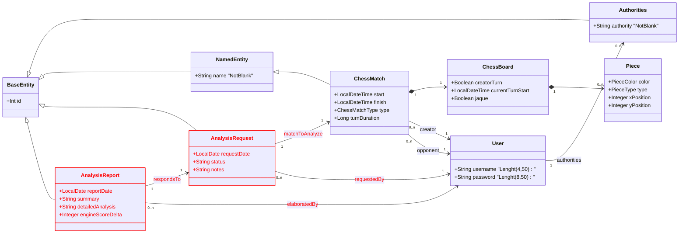

# Evaluación de Prompt

**Ejercicio:** TEST-ATTRIBUTES-CODE-GENERATION
**Dominio:** CHESS
**Fecha:** 5/6/2026, 0:11:50

## Índice
- [1. Contexto Oculto](#1-contexto-oculto)
- [2. Examen Seleccionado](#2-examen-seleccionado)
- [3. Prompt Visible](#3-prompt-visible)
- [4. Respuesta](#4-respuesta)

---

## 1. Contexto Oculto


=== PAQUETES DE LA PLANTILLA DEL PROYECTO ===
es.us.dp1.chess.tournament.user
es.us.dp1.chess.tournament.model
es.us.dp1.chess.tournament.exceptions

REGLA CRÍTICA DE IMPORTS:
- Usa EXACTAMENTE estos paquetes para las clases que NO son base.
- Paquete raíz: es.us.dp1.chess.tournament
- El paquete de ESTE test (Test1.java) debe ser: es.us.dp1.chess.tournament;

=== CÓDIGO FUENTE REAL ===
package es.us.dp1.chess.tournament.analysisrequest;
import es.us.dp1.chess.tournament.match.ChessMatch;
import es.us.dp1.chess.tournament.user.User;
@Getter
@Setter
@Table(name = "analysis_requests")
public class AnalysisRequest {
    LocalDate requestDate;
    String status;
    String notes;
    @Transient
    ChessMatch matchToAnalyze;
    @Transient
    User requestedBy;
}

// ---

package es.us.dp1.chess.tournament.analysisrequest;
public interface AnalysisRequestRepository {
    Optional<AnalysisRequest> findById(Integer id);
    List<AnalysisRequest> findAll();
    AnalysisRequest save(AnalysisRequest analysisRequest);
}

// ---

package es.us.dp1.chess.tournament.analysisrequest;
public class AnalysisRequestService {
    AnalysisRequestRepository analysisRequestRepository;
    public AnalysisRequestService(AnalysisRequestRepository analysisRequestRepository) {
        this.analysisRequestRepository = analysisRequestRepository;
    }
    public List<AnalysisRequest> getAll() {
        return analysisRequestRepository.findAll();
    }
    public AnalysisRequest save(AnalysisRequest analysisRequest) {
        return analysisRequestRepository.save(analysisRequest);
    }
}

// ---

package es.us.dp1.chess.tournament.analysisreport;
import es.us.dp1.chess.tournament.analysisrequest.AnalysisRequest;
import es.us.dp1.chess.tournament.user.User;
@Getter
@Setter
@Table(name = "analysis_reports")
public class AnalysisReport {
    LocalDate reportDate;
    String summary;
    String detailedAnalysis;
    Integer engineScoreDelta;
    @Transient
    AnalysisRequest respondsTo;
    @Transient
    User elaboratedBy;
}

// ---

package es.us.dp1.chess.tournament.analysisreport;
public interface AnalysisReportRepository {
    Optional<AnalysisReport> findById(Integer id);
    List<AnalysisReport> findAll();
    AnalysisReport save(AnalysisReport analysisReport);
}

// ---

package es.us.dp1.chess.tournament.analysisreport;
public class AnalysisReportService {
    AnalysisReportRepository analysisReportRepository;
    public AnalysisReportService(AnalysisReportRepository analysisReportRepository) {
        this.analysisReportRepository = analysisReportRepository;
    }
    public List<AnalysisReport> getAll() {
        return analysisReportRepository.findAll();
    }
    public AnalysisReport save(AnalysisReport analysisReport) {
        return analysisReportRepository.save(analysisReport);
    }
}

=== ENUNCIADO ===
En este ejercicio, añadiremos la funcionalidad de gestión de solicitudes y reportes de análisis de partidas para que los usuarios puedan obtener una revisión experta de sus juegos. Concretamente, se proporciona una clase “ChessMatch” que representa las partidas que se juegan, y que tiene asociada una instancia de la clase “ChessBoard” que representa el estado del tablero para dicha partida, por lo que tendrá asociada un conjunto de instancias de la clase “Piece”. Además, tendremos la clase “AnalysisRequest”, que representa la solicitud de un usuario para que una partida específica sea analizada. Junto a esta, tendremos la clase “AnalysisReport”, que contendrá el análisis detallado proporcionado como respuesta a una solicitud.

La clase **AnalysisRequest** incluirá los atributos `requestDate` para la fecha de la solicitud, `status` para el estado actual de la solicitud (por ejemplo, "PENDIENTE", "EN_PROGRESO", "COMPLETADA") y `notes` para cualquier comentario o pregunta específica del usuario sobre la partida. La clase **AnalysisReport** contará con los atributos `reportDate` para la fecha en que se generó el informe, `summary` para un breve resumen del análisis, `detailedAnalysis` para el análisis textual completo y `engineScoreDelta` para indicar opcionalmente la variación en la puntuación del motor de ajedrez en puntos clave de la partida.

Las relaciones entre estas entidades son las siguientes: cada `AnalysisRequest` se asocia a una `ChessMatch` específica y es realizada por un `User`. Por su parte, un `AnalysisReport` se genera como respuesta a una única `AnalysisRequest` y es elaborado por un `User` (el analista).

Realizaremos una serie de ejercicios basados en funcionalidades que implementaremos en el sistema, y validaremos mediante pruebas unitarias.


=== REGLAS A EVALUAR (RESTRICCIONES / RELACIONES) ===
Modificar las clases “AnalysisRequest” y “AnalysisReport” para que sean entidades. Estas deben tener los siguientes atributos y restricciones:

**Para ambas clases:**

- El atributo de tipo entero (Integer) llamado “id” actuará como clave primaria en la tabla de la base de datos relacional asociada a la entidad.

**Para la clase AnalysisRequest:**

- El atributo de tipo fecha (LocalDate) llamado “requestDate” será obligatorio, representa la fecha en que se realiza la solicitud. Seguirá el formato “dd/MM/yyyy” y no podrá ser una fecha futura.
- Un atributo de tipo cadena de caracteres (String) llamado “status” será obligatorio y únicamente podrá tomar tres valores: “PENDIENTE”, “EN_PROGRESO”, “COMPLETADA”. Además, no podrá estar formada por caracteres vacíos.
- El atributo de tipo cadena de caracteres (String) llamado “notes” será opcional, y si se proporciona, tendrá una longitud máxima de 500 caracteres y no podrá estar formado únicamente por caracteres vacíos.

**Para la clase AnalysisReport:**

- El atributo de tipo fecha (LocalDate) llamado “reportDate” será obligatorio, representa la fecha en que se generó el informe. Seguirá el formato “dd/MM/yyyy” y no podrá ser una fecha futura.
- Un atributo de tipo cadena de caracteres (String) llamado “summary” será obligatorio (no puede ser nulo), que debe tener una longitud mínima de 10 caracteres y máxima de 255 y que no puede estar formada por caracteres vacíos (espacios, tabuladores, etc.).
- Un atributo de tipo cadena de caracteres (String) llamado “detailedAnalysis” será obligatorio (no puede ser nulo), que debe tener una longitud mínima de 50 caracteres y máxima de 2000 y que no puede estar formada por caracteres vacíos (espacios, tabuladores, etc.).
- El atributo de tipo entero (Integer) llamado “engineScoreDelta” será opcional, y si toma valor, deberá estar en el rango de -1000 a 1000, ambos inclusive.

No modifique por ahora las anotaciones @Transient de las clases. Modificar las interfaces “AnalysisRequestRepository” y “AnalysisReportRepository” alojada en el mismo paquete para que extienda a CrudRepository.


---

## 2. Examen Seleccionado
En este ejercicio, añadiremos la funcionalidad de gestión de solicitudes y reportes de análisis de partidas para que los usuarios puedan obtener una revisión experta de sus juegos. Concretamente, se proporciona una clase “ChessMatch” que representa las partidas que se juegan, y que tiene asociada una instancia de la clase “ChessBoard” que representa el estado del tablero para dicha partida, por lo que tendrá asociada un conjunto de instancias de la clase “Piece”. Además, tendremos la clase “AnalysisRequest”, que representa la solicitud de un usuario para que una partida específica sea analizada. Junto a esta, tendremos la clase “AnalysisReport”, que contendrá el análisis detallado proporcionado como respuesta a una solicitud.

La clase **AnalysisRequest** incluirá los atributos `requestDate` para la fecha de la solicitud, `status` para el estado actual de la solicitud (por ejemplo, "PENDIENTE", "EN_PROGRESO", "COMPLETADA") y `notes` para cualquier comentario o pregunta específica del usuario sobre la partida. La clase **AnalysisReport** contará con los atributos `reportDate` para la fecha en que se generó el informe, `summary` para un breve resumen del análisis, `detailedAnalysis` para el análisis textual completo y `engineScoreDelta` para indicar opcionalmente la variación en la puntuación del motor de ajedrez en puntos clave de la partida.

Las relaciones entre estas entidades son las siguientes: cada `AnalysisRequest` se asocia a una `ChessMatch` específica y es realizada por un `User`. Por su parte, un `AnalysisReport` se genera como respuesta a una única `AnalysisRequest` y es elaborado por un `User` (el analista).

Realizaremos una serie de ejercicios basados en funcionalidades que implementaremos en el sistema, y validaremos mediante pruebas unitarias.



---

## 3. Prompt Visible
Nuestra misión es generar el test de un examen de la asignatura "Diseño y Pruebas". Actuamos como profesores evaluando conocimientos de JPA y mapeo objeto-relacional. Te proporcionaré el enunciado, el diagrama UML en Mermaid y, **CRÍTICAMENTE, el Código Base de las clases ya generadas**.

Por favor, no uses Wildcard Imports (asteriscos). Genera todos los imports de forma explícita, uno por cada clase utilizada. IMPORTANTE CENTRARSE EN LAS CLASES QUE SE PROPORCIONA COMO CÓDIGO BASE, DE SU LOCALIZACIÓN PARA PODER PONER CORRECTAMENTE LOS IMPORTS DE DONDE SE SACAN LAS CLASES.

---

## REGLA ABSOLUTA — PAQUETES: LEE EL CÓDIGO BASE, EVITA INVENTAR

Esta es la regla más importante del prompt. Debes seguirla antes que cualquier otra cosa.
Además, para las clases que no estén implementadas en el código base, buscarla en el repositorio pasado, como Pet, viene de pet.Pet

**Procedimiento obligatorio antes de escribir un solo import:**

1. Localiza la sección `=== PAQUETES DE LA PLANTILLA DEL PROYECTO ===` del contexto. En ella se te especificará la estructura de los paquetes a importar.
2. Para cada clase que necesites importar, busca su `package` en el código base proporcionado.
3. Construye el import como: `import <package_de_esa_clase>.<NombreClase>;`

- Deberás tener cuidado y poner los nombres de las clases nueva generadas, ya que no siempre es Achievement; deberás coger las clases del contexto que se te proporciona de la extensión funcional.

**Ejemplo concreto:**

- Si el código base de `Achievement.java` empieza con `package es.us.dp1.chess.tournament.achievement;`
- El import correcto en el test es: `import es.us.dp1.chess.tournament.achievement.Achievement;`
- Teniendo en cuenta las mayúsculas y minúsculas de las clases para evitar el error en los tests
- NUNCA: `import org.springframework.samples.chessgame.model.Achievement;`
- NUNCA: `import org.springframework.samples.petClinic.model.Achievement;`

**Aplica lo mismo para `@ComponentScan`:**
Al definir los paquetes, SIEMPRE poner los paquetes individuales necesarios, evitar globalizar en uno todo:

- CORRECTO: `@ComponentScan(basePackages = {"es.us.dp1.chess.tournament.achievement", "es.us.dp1.chess.tournament.userAchievement"})`
- INCORRECTO: `@ComponentScan(basePackages = {"org.springframework.samples.chessgame.repository", "org.springframework.samples.chessgame.model"})`
- INCORRECTO: `@ComponentScan(basePackages = {"es.us.dp1.chess.tournament"})`

**El paquete del propio test (`package ...` en la primera línea) también debe derivarse del código base**, usando el prefijo de donde se crean los test. Ejemplo: si el prefijo raíz es `es.us.dp1.chess.tournament`, el paquete del test será `es.us.dp1.chess.tournament`.

Si una clase (como `ReflexiveTest`, `NamedEntity`, etc.) no aparece en el código base proporcionado, usa el mismo prefijo raíz detectado para inferir su paquete. Nunca uses `org.springframework.samples.*` salvo que ese prefijo aparezca explícitamente en el código base.

Para las diferentes comprobaciones, vamos a llamar a los métodos que nos proporciona la clase ReflexiveTest que te paso dentro del archivo `test_previous_exams`. **IMPORTANTE:** tienes que llamar con el MISMO NOMBRE a los métodos que utilices, además de pasarle los MISMOS tipos de argumentos que pide cada método. A continuación, te proporciono una lista con todos los métodos disponibles y sus correspondientes argumentos necesarios. Los analizarás todos para usarlos correctamente en el test:

```java
void checkThatFieldIsAnnotatedWithDateTimeFormat(Class aClass, String fieldname,String format)

void checkThatFieldIsAnnotatedWith(Class aClass, String fieldname,Class annotationClass)

boolean  isFieldAnnotatedWith(Class aClass, String fieldname,Class annotationClass) throws NoSuchFieldException, SecurityException

boolean classIsAnnotatedWith(Class class1, Class class2)

boolean classHasMethod(Object targetObject, String methodName, Class<?> ... parameterTypes)

void checkThatFieldsAreMandatory(Object validEntity,EntityManager em,String ... fieldnames )

void checkThatFieldIsMandatory(Object validEntity,String fieldname,Class<?> type,EntityManager em)

void checkThatValuesAreNotValid(Object validEntity,Map<String,List<Object>> invalidValues,EntityManager em)

void checkThatValueIsNotValid(Object validEntity,String fieldname,Object value,Class<?> type, EntityManager em)

Object setValue(Object object,String fieldname,Class<?> type, Object value)

Object invokeMethodReflexivelyWithParamTypes(Object targetObject, String methodName, Class<?>[] parameterTypes,Object ... parameterValues)

Object invokeMethodReflexively(Object o, String methodName, Object ... params)

void checkLinkedById(Class myClass,Integer id1,String methodName,Integer id2,EntityManager em)

Object getFieldValueReflexively(Object o, String fieldName)

void checkTransactional(Class<?> myClass,String methodName, Class<?>... parameterTypes)

boolean isMethodAnnotatedWithTest(Method method)

boolean isMethodAnnotatedWithBeforeEach(Method method)

boolean isMethodAnnotatedWithAfterEach(Method method)

void checkTransactionalRollback(Class<?> myClass,String methodName,Class<?>[] paramTypes,Class<? extends Exception> exceptionClass)

boolean isEntity(Class<T> clazz)
```

---

## Reglas de Coherencia Adicionales

2.  **Fidelidad al Código Base:** Si una clase en el código base tiene un atributo con un nombre específico (ej. `checkInDate`), el test debe usar ese nombre exacto, ignorando lo que diga cualquier otro ejemplo externo.
3.  **Manejo de Relaciones:** Si en el Código Base una relación está marcada como `@Transient`, el test debe tratarla según las instrucciones del enunciado, pero siempre importando la clase desde su paquete real.

---

## Especificaciones del Examen

- **Clases Negras:** Núcleo estable (Contexto). No se testea su implementación interna, pero se usan para crear objetos válidos (ej. `Owner`, `Pet`).
- **Clases Rojas:** Tarea principal del alumno. Son las que debemos testear exhaustivamente (Restricciones, Anotaciones y Persistencia).
- **Límite:** Máximo 2 entidades rojas por examen.
- **Framework:** Java 17+, JUnit 5, Spring Boot (@DataJpaTest).
- **Herencia:** La clase de test DEBE extender de `ReflexiveTest` (IMPORTANTE: DEBE USARSE SI O SI ESTA CLASE PARA LA GENERACIÓN DE LOS TESTS, DEBE PONER ReflexiveTest en la parte de `extends...`)

---

## Estructura Estricta Requerida para Test1.java

### 1. Configuración e Inyección

- El nombre ESTRICTO del paquete donde se tiene que generar el test es:
  - Clínica Veterinaria: `package org.springframework.samples.petclinic`
  - Ajedrez: `package es.us.dp1.chess.tournament`
- Inyecta los Repositorios de las entidades rojas y el `EntityManager` mediante `@Autowired` (NUNCA `TestEntityManager`).
- Inyecta SIEMPRE como `@MockBean` el servicio `UserService`:

```java
    @MockBean
    private UserService userService;
```

- Usa `@ComponentScan` apuntando a los paquetes reales detectados en el Código Base (ver Regla Absoluta).
- **IMPORTANTE** los imports de las anotaciones a comprobar deberán venir de jakarta, NUNCA DE javax:
  - CORRECTO: jakarta.persistence.Column;
  - INCORRECTO: javax.persistence.Column;
- **IMPORTANTE**: Omitir crear tests estáticos, para poder usar el método `super`.

### 2. Verificación de Repositorios

Los tests que validan los repositorios, cuando extienden a CRUD Repository no es necesario validar todos los métodos que se proporcionan inicialmente en las clases base, ya que la anotación CRUD los contiene, por lo que la estructura del test sería:

```java
@Test
    void test1RepositoriesExist() {
        assertNotNull(ratingRepository, "RatingRepository should be autowired");
        assertNotNull(ratingChangeRepository, "RatingChangeRepository should be autowired");
        test1RepositoriesContainsMethod();
    }

    void test1RepositoriesContainsMethod() {
        assertTrue(
            CrudRepository.class.isAssignableFrom(RatingRepository.class),
            "RatingRepository should extend CrudRepository"
        );
        assertTrue(
            CrudRepository.class.isAssignableFrom(RatingChangeRepository.class),
            "RatingChangeRepository should extend CrudRepository"
        );
    }

```

- **test1RepositoriesExist():** Verifica `assertNotNull`. Al final, debe llamar a `test1RepositoriesContainsMethod()` solo si el repo no es nulo.
- **test1RepositoriesContainsMethod():** (SIN @Test) Verifica que el repo tiene el método `.count()` o similar mediante reflexión/interfaz.

### 3. Validación de Restricciones (Constraints)

- **test1Check[NOMBRE_ENTIDAD]Constraints():**
  - Invoca `checkThatFieldsAreMandatory` con los campos `NotNull/NotBlank` identificados.
  - Crea el mapa `invalidValues` usando `Map.of(...)`. **PROHIBIDO usar `new HashMap()`**.
  - Los valores de prueba deben ser coherentes con el tipo de dato del Código Base (si es `Double`, usa `0.0`; si es `Integer`, `0`).
  - Invoca `checkThatValuesAreNotValid`.
  - En atributos que sean de tipo Double, NUNCA PONER `columnDefinition = "double(5,2)"` ya que dará error. La forma correcta es por ejemplo: `@Column(name = "cost")`

### 4. Verificación de Anotaciones

- **test1Check[NOMBRE_ENTIDAD]Annotations():**
  - Verifica `@Entity` con `classIsAnnotatedWith`.
  - Verifica `@Enumerated(EnumType.STRING)` si hay Enums.
  - Verifica `@Size`, `@Positive`, `@FutureOrPresent`, etc., según el UML.

### 5. Métodos Auxiliares y Persistencia

- **createValid[NOMBRE_ENTIDAD](EntityManager em):** Método estático que construye una instancia válida.
- **IMPORTANTE:** Usa EXCLUSIVAMENTE `setValue(objeto, "atributo", Tipo.class, valor)` para asignar datos, evitando fallos si no existen setters.
- **test1Valid[NOMBRE_ENTIDAD]IsPersisted():** Verifica que `repo.save()` no lanza excepciones (`assertDoesNotThrow`) y haz `.flush()`.
- Todos los métodos auxiliares que sean necesarios deberán crearse en la misma clase, el test DEBE ser autosuficiente.
- Al crear alguna entidad válida en un método auxiliar, SIEMPRE crear primero los objetos padre, es decir, si un Pet tiene un Owner, primero se deberá crear el Owner y después el Pet. Esto evitará errores de persistencia.

---

## Restricciones de Salida (Formato)

- **PROHIBIDO** generar comentarios explicativos.
- **PROHIBIDO** envolver el código en bloques de código markdown (sin \`\`\`java).
- **PROHIBIDO** incluir texto antes o después del código.
- Entrega el código listo para ser copiado y pegado en un archivo `.java`.

---

## 4. Respuesta
package es.us.dp1.chess.tournament;

import es.us.dp1.chess.tournament.analysisreport.AnalysisReport;
import es.us.dp1.chess.tournament.analysisreport.AnalysisReportRepository;
import es.us.dp1.chess.tournament.analysisrequest.AnalysisRequest;
import es.us.dp1.chess.tournament.analysisrequest.AnalysisRequestRepository;
import es.us.dp1.chess.tournament.match.ChessBoard;
import es.us.dp1.chess.tournament.match.ChessMatch;
import es.us.dp1.chess.tournament.match.ChessMatchType;
import es.us.dp1.chess.tournament.match.Piece;
import es.us.dp1.chess.tournament.match.PieceColor;
import es.us.dp1.chess.tournament.match.PieceType;
import es.us.dp1.chess.tournament.model.BaseEntity;
import es.us.dp1.chess.tournament.user.User;
import es.us.dp1.chess.tournament.user.UserService;
import jakarta.persistence.Column;
import jakarta.persistence.EntityManager;
import jakarta.validation.constraints.Max;
import jakarta.validation.constraints.Min;
import jakarta.validation.constraints.NotBlank;
import jakarta.validation.constraints.NotNull;
import jakarta.validation.constraints.PastOrPresent;
import jakarta.validation.constraints.Size;
import org.junit.jupiter.api.Test;
import org.springframework.beans.factory.annotation.Autowired;
import org.springframework.boot.test.autoconfigure.orm.jpa.DataJpaTest;
import org.springframework.boot.test.mock.mockito.MockBean;
import org.springframework.context.annotation.ComponentScan;
import org.springframework.data.repository.CrudRepository;
import java.time.LocalDate;
import java.time.LocalDateTime;
import java.util.Collections;
import java.util.List;
import java.util.Map;
import static org.junit.jupiter.api.Assertions.assertDoesNotThrow;
import static org.junit.jupiter.api.Assertions.assertNotNull;
import static org.junit.jupiter.api.Assertions.assertTrue;

@DataJpaTest
@ComponentScan(basePackages = {
    "es.us.dp1.chess.tournament.analysisrequest",
    "es.us.dp1.chess.tournament.analysisreport",
    "es.us.dp1.chess.tournament.user",
    "es.us.dp1.chess.tournament.match",
    "es.us.dp1.chess.tournament.model"
})
class Test1 extends ReflexiveTest {

    @Autowired
    AnalysisRequestRepository analysisRequestRepository;

    @Autowired
    AnalysisReportRepository analysisReportRepository;

    @Autowired
    EntityManager em;

    @MockBean
    private UserService userService;

    // --- Helper Methods ---
    private User createValidUser(String username, String password) {
        User user = new User();
        setValue(user, "username", String.class, username);
        setValue(user, "password", String.class, password);
        // Persist the user if it's not already managed
        if (!em.contains(user)) {
            em.persist(user);
        }
        return user;
    }

    private ChessBoard createValidChessBoard() {
        ChessBoard board = new ChessBoard();
        setValue(board, "creatorTurn", Boolean.class, true);
        setValue(board, "currentTurnStart", LocalDateTime.class, LocalDateTime.now());
        setValue(board, "jaque", Boolean.class, false);
        em.persist(board);

        Piece p1 = new Piece();
        setValue(p1, "color", PieceColor.class, PieceColor.WHITE);
        setValue(p1, "type", PieceType.class, PieceType.PAWN);
        setValue(p1, "xPosition", Integer.class, 1);
        setValue(p1, "yPosition", Integer.class, 1);
        setValue(p1, "board", ChessBoard.class, board);
        em.persist(p1);

        board.setPieces(Collections.singleton(p1)); // Set the piece after persisting it
        em.merge(board);
        return board;
    }

    private ChessMatch createValidChessMatch(User creator, User opponent) {
        ChessMatch match = new ChessMatch();
        setValue(match, "name", String.class, "Test Match " + System.currentTimeMillis());
        setValue(match, "start", LocalDateTime.class, LocalDateTime.now().minusHours(1));
        setValue(match, "finish", LocalDateTime.class, LocalDateTime.now());
        setValue(match, "type", ChessMatchType.class, ChessMatchType.STANDARD);
        setValue(match, "turnDuration", Long.class, 600L);
        setValue(match, "creator", User.class, creator);
        setValue(match, "opponent", User.class, opponent);

        ChessBoard board = createValidChessBoard();
        setValue(match, "board", ChessBoard.class, board);

        em.persist(match);
        return match;
    }

    private AnalysisRequest createValidAnalysisRequest() {
        AnalysisRequest request = new AnalysisRequest();
        setValue(request, "requestDate", LocalDate.class, LocalDate.now());
        setValue(request, "status", String.class, "PENDIENTE");
        setValue(request, "notes", String.class, "Please analyze the opening phase.");

        User user = createValidUser("requester", "password123");
        User opponent = createValidUser("opponent", "password123");
        ChessMatch match = createValidChessMatch(user, opponent);

        setValue(request, "requestedBy", User.class, user);
        setValue(request, "matchToAnalyze", ChessMatch.class, match);

        return request;
    }

    private AnalysisReport createValidAnalysisReport() {
        AnalysisReport report = new AnalysisReport();
        setValue(report, "reportDate", LocalDate.class, LocalDate.now());
        setValue(report, "summary", String.class, "Summary of the game analysis.");
        setValue(report, "detailedAnalysis", String.class, "This is a very detailed analysis of the chess match, explaining key moves and strategic decisions.");
        setValue(report, "engineScoreDelta", Integer.class, 50);

        AnalysisRequest request = createValidAnalysisRequest();
        em.persist(request); // Ensure the request is persisted

        User analyst = createValidUser("analyst", "securepassword");

        setValue(report, "respondsTo", AnalysisRequest.class, request);
        setValue(report, "elaboratedBy", User.class, analyst);

        return report;
    }

    // --- Repository Tests ---
    @Test
    void test1RepositoriesExist() {
        assertNotNull(analysisRequestRepository, "AnalysisRequestRepository should be autowired");
        assertNotNull(analysisReportRepository, "AnalysisReportRepository should be autowired");
        test1RepositoriesContainsMethod();
    }

    void test1RepositoriesContainsMethod() {
        assertTrue(
            CrudRepository.class.isAssignableFrom(AnalysisRequestRepository.class),
            "AnalysisRequestRepository should extend CrudRepository"
        );
        assertTrue(
            CrudRepository.class.isAssignableFrom(AnalysisReportRepository.class),
            "AnalysisReportRepository should extend CrudRepository"
        );
    }

    // --- AnalysisRequest Constraints and Annotations ---
    @Test
    void test1CheckAnalysisRequestAnnotations() {
        Class<AnalysisRequest> clazz = AnalysisRequest.class;

        assertTrue(classIsAnnotatedWith(clazz, jakarta.persistence.Entity.class), "AnalysisRequest should be an Entity");
        assertTrue(classIsAnnotatedWith(clazz, jakarta.persistence.Table.class), "AnalysisRequest should be a Table");
        assertTrue(isFieldAnnotatedWith(clazz, "id", jakarta.persistence.Id.class), "AnalysisRequest should have an @Id field");
        assertTrue(isFieldAnnotatedWith(clazz, "id", jakarta.persistence.GeneratedValue.class), "AnalysisRequest should have @GeneratedValue for id");

        checkThatFieldIsAnnotatedWith(clazz, "requestDate", NotNull.class);
        checkThatFieldIsAnnotatedWith(clazz, "requestDate", PastOrPresent.class);
        checkThatFieldIsAnnotatedWith(clazz, "requestDate", Column.class);

        checkThatFieldIsAnnotatedWith(clazz, "status", NotNull.class);
        checkThatFieldIsAnnotatedWith(clazz, "status", NotBlank.class);
        checkThatFieldIsAnnotatedWith(clazz, "status", Column.class);

        checkThatFieldIsAnnotatedWith(clazz, "notes", Size.class);
        checkThatFieldIsAnnotatedWith(clazz, "notes", Column.class);
    }

    @Test
    void test1CheckAnalysisRequestConstraints() {
        AnalysisRequest validRequest = createValidAnalysisRequest();

        checkThatFieldsAreMandatory(validRequest, em, "requestDate", "status");

        Map<String, List<Object>> invalidValues = Map.of(
            "requestDate", List.of(LocalDate.now().plusDays(1)),
            "status", List.of("", "   ", "INVALID_STATUS", null),
            "notes", List.of("a".repeat(501), "   ")
        );
        checkThatValuesAreNotValid(validRequest, invalidValues, em);
    }

    @Test
    void test1ValidAnalysisRequestIsPersisted() {
        AnalysisRequest validRequest = createValidAnalysisRequest();
        assertDoesNotThrow(() -> {
            analysisRequestRepository.save(validRequest);
            em.flush();
        }, "Saving a valid AnalysisRequest should not throw an exception");
        assertNotNull(validRequest.getId(), "AnalysisRequest ID should be generated after persisting");
    }

    // --- AnalysisReport Constraints and Annotations ---
    @Test
    void test1CheckAnalysisReportAnnotations() {
        Class<AnalysisReport> clazz = AnalysisReport.class;

        assertTrue(classIsAnnotatedWith(clazz, jakarta.persistence.Entity.class), "AnalysisReport should be an Entity");
        assertTrue(classIsAnnotatedWith(clazz, jakarta.persistence.Table.class), "AnalysisReport should be a Table");
        assertTrue(isFieldAnnotatedWith(clazz, "id", jakarta.persistence.Id.class), "AnalysisReport should have an @Id field");
        assertTrue(isFieldAnnotatedWith(clazz, "id", jakarta.persistence.GeneratedValue.class), "AnalysisReport should have @GeneratedValue for id");

        checkThatFieldIsAnnotatedWith(clazz, "reportDate", NotNull.class);
        checkThatFieldIsAnnotatedWith(clazz, "reportDate", PastOrPresent.class);
        checkThatFieldIsAnnotatedWith(clazz, "reportDate", Column.class);

        checkThatFieldIsAnnotatedWith(clazz, "summary", NotNull.class);
        checkThatFieldIsAnnotatedWith(clazz, "summary", NotBlank.class);
        checkThatFieldIsAnnotatedWith(clazz, "summary", Size.class);
        checkThatFieldIsAnnotatedWith(clazz, "summary", Column.class);

        checkThatFieldIsAnnotatedWith(clazz, "detailedAnalysis", NotNull.class);
        checkThatFieldIsAnnotatedWith(clazz, "detailedAnalysis", NotBlank.class);
        checkThatFieldIsAnnotatedWith(clazz, "detailedAnalysis", Size.class);
        checkThatFieldIsAnnotatedWith(clazz, "detailedAnalysis", Column.class);

        checkThatFieldIsAnnotatedWith(clazz, "engineScoreDelta", Min.class);
        checkThatFieldIsAnnotatedWith(clazz, "engineScoreDelta", Max.class);
        checkThatFieldIsAnnotatedWith(clazz, "engineScoreDelta", Column.class);
    }

    @Test
    void test1CheckAnalysisReportConstraints() {
        AnalysisReport validReport = createValidAnalysisReport();

        checkThatFieldsAreMandatory(validReport, em, "reportDate", "summary", "detailedAnalysis");

        Map<String, List<Object>> invalidValues = Map.of(
            "reportDate", List.of(LocalDate.now().plusDays(1)),
            "summary", List.of(
                null, "", "   ", "short", "a".repeat(256)
            ),
            "detailedAnalysis", List.of(
                null, "", "   ", "too short", "a".repeat(2001)
            ),
            "engineScoreDelta", List.of(-1001, 1001)
        );
        checkThatValuesAreNotValid(validReport, invalidValues, em);
    }

    @Test
    void test1ValidAnalysisReportIsPersisted() {
        AnalysisReport validReport = createValidAnalysisReport();
        assertDoesNotThrow(() -> {
            analysisReportRepository.save(validReport);
            em.flush();
        }, "Saving a valid AnalysisReport should not throw an exception");
        assertNotNull(validReport.getId(), "AnalysisReport ID should be generated after persisting");
    }
}