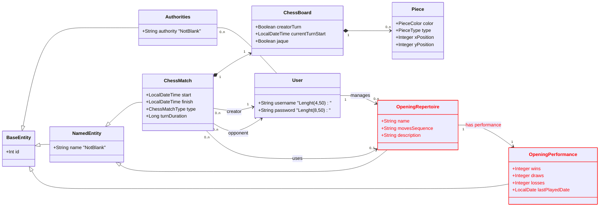

# Evaluación de Prompt

**Ejercicio:** TEST-RELATIONSHIPS-CODE-GENERATION
**Dominio:** CHESS
**Fecha:** 4/6/2026, 23:48:30

## Índice
- [1. Contexto Oculto](#1-contexto-oculto)
- [2. Examen Seleccionado](#2-examen-seleccionado)
- [3. Prompt Visible](#3-prompt-visible)
- [4. Respuesta](#4-respuesta)

---

## 1. Contexto Oculto


=== PAQUETES DE LA PLANTILLA DEL PROYECTO ===
es.us.dp1.chess.tournament.user
es.us.dp1.chess.tournament.model
es.us.dp1.chess.tournament.exceptions

REGLA CRÍTICA DE IMPORTS:
- Usa EXACTAMENTE estos paquetes para las clases que NO son base.
- Paquete raíz: es.us.dp1.chess.tournament
- El paquete de ESTE test (Test2.java) debe ser: es.us.dp1.chess.tournament;

=== CÓDIGO FUENTE REAL ===
package es.us.dp1.chess.tournament.openingrepertoire;
import es.us.dp1.chess.tournament.openingperformance.OpeningPerformance;
import es.us.dp1.chess.tournament.match.ChessMatch;
import es.us.dp1.chess.tournament.user.User;
@Getter
@Setter
@Table(name = "opening_repertoires")
public class OpeningRepertoire {
    String name;
    String movesSequence;
    String description;
    @Transient
    User manager;
    @Transient
    List<ChessMatch> usedInMatches;
    @Transient
    OpeningPerformance performance;
}

// ---

package es.us.dp1.chess.tournament.openingrepertoire;
public interface OpeningRepertoireRepository {
    Optional<OpeningRepertoire> findById(Integer id);
    List<OpeningRepertoire> findAll();
    OpeningRepertoire save(OpeningRepertoire openingRepertoire);
}

// ---

package es.us.dp1.chess.tournament.openingrepertoire;
public class OpeningRepertoireService {
    OpeningRepertoireRepository openingRepertoireRepository;
    public OpeningRepertoireService(OpeningRepertoireRepository openingRepertoireRepository) {
        this.openingRepertoireRepository = openingRepertoireRepository;
    }
    public List<OpeningRepertoire> getAll() {
        return openingRepertoireRepository.findAll();
    }
    public OpeningRepertoire save(OpeningRepertoire openingRepertoire) {
        return openingRepertoireRepository.save(openingRepertoire);
    }
}

// ---

package es.us.dp1.chess.tournament.openingperformance;
import es.us.dp1.chess.tournament.openingrepertoire.OpeningRepertoire;
@Getter
@Setter
@Table(name = "opening_performances")
public class OpeningPerformance {
    Integer wins;
    Integer draws;
    Integer losses;
    LocalDate lastPlayedDate;
    @Transient
    OpeningRepertoire openingRepertoire;
}

// ---

package es.us.dp1.chess.tournament.openingperformance;
public interface OpeningPerformanceRepository {
    Optional<OpeningPerformance> findById(Integer id);
    List<OpeningPerformance> findAll();
    OpeningPerformance save(OpeningPerformance openingPerformance);
}

// ---

package es.us.dp1.chess.tournament.openingperformance;
public class OpeningPerformanceService {
    OpeningPerformanceRepository openingPerformanceRepository;
    public OpeningPerformanceService(OpeningPerformanceRepository openingPerformanceRepository) {
        this.openingPerformanceRepository = openingPerformanceRepository;
    }
    public List<OpeningPerformance> getAll() {
        return openingPerformanceRepository.findAll();
    }
    public OpeningPerformance save(OpeningPerformance openingPerformance) {
        return openingPerformanceRepository.save(openingPerformance);
    }
}

=== ENUNCIADO ===
En este ejercicio, añadiremos la funcionalidad de gestión del repertorio de aperturas de ajedrez y el seguimiento de su rendimiento para los usuarios. Concretamente, se proporciona una clase “ChessMatch” que representa las partidas que se juegan, y que tiene asociada una instancia de la clase “ChessBoard” que representa el estado del tablero para dicha partida, por lo que tendrá asociada un conjunto de instancias de la clase “Piece”. Además, tendremos la clase “OpeningRepertoire”, que representa una secuencia de movimientos de apertura que un jugador ha estudiado o planeado usar, y la clase “OpeningPerformance”, que registrará estadísticas específicas sobre el uso de cada apertura.

La clase “OpeningRepertoire” incluirá los atributos `name` para identificar la apertura (ej. "Defensa Siciliana"), `movesSequence` para almacenar la serie de movimientos que la definen, y `description` para una explicación adicional. Cada `User` puede gestionar múltiples `OpeningRepertoire`s. Una `ChessMatch` puede estar asociada a uno de estos repertorios, indicando qué apertura se jugó en esa partida.

Por otro lado, la clase “OpeningPerformance” contará con los atributos `wins`, `draws` y `losses` para registrar el número de victorias, empates y derrotas asociadas a una apertura específica, y `lastPlayedDate` para la fecha de la última partida en la que se utilizó dicha apertura. Cada `OpeningRepertoire` tendrá asociado un único registro de `OpeningPerformance` que resume su eficacia para un `User` dado.

Realizaremos una serie de ejercicios basados en funcionalidades que implementaremos en el sistema, y validaremos mediante pruebas unitarias.



=== REGLAS A EVALUAR (RESTRICCIONES / RELACIONES) ===
Elimine las anotaciones @Transient de los métodos y atributos que las tengan en las entidades creadas en el ejercicio anterior. Se pide crear las siguientes relaciones entre las entidades:

Cree una relación unidireccional desde “OpeningRepertoire” hacia “User” que exprese la que aparece en el diagrama UML (mostrado en la primera página de este enunciado) respetando sus cardinalidades, usando el atributo “manager” de la clase “OpeningRepertoire”. Debe asegurarse de que la relación expresa adecuadamente la cardinalidad que muestra el diagrama UML, por ejemplo, el atributo manager no puede ser nulo puesto que la cardinalidad es 1 en el extremo de User.

Además, se pide crear una relación unidireccional desde “OpeningRepertoire” hacia “ChessMatch” que represente la que aparece en el diagrama UML, tenga en cuenta la cardinalidad que tiene, usando el atributo “usedByMatches” en la clase “OpeningRepertoire”. Debe asegurarse de que la relación expresa adecuadamente la cardinalidad que muestra el diagrama UML, por ejemplo, el atributo usedByMatches puede ser una colección vacía puesto que la cardinalidad es 0..n en el extremo de ChessMatch.

Finalmente, se pide crear una relación unidireccional desde “OpeningRepertoire” hacia “OpeningPerformance” que represente la que aparece en el diagrama, usando como nombre de atributo “performance”. Debe asegurarse de que la relación expresa adecuadamente la cardinalidad que muestra el diagrama UML, por ejemplo, el atributo performance no puede ser nulo y es obligatorio, puesto que la cardinalidad es 1 en el extremo de OpeningPerformance.


---

## 2. Examen Seleccionado
En este ejercicio, añadiremos la funcionalidad de gestión del repertorio de aperturas de ajedrez y el seguimiento de su rendimiento para los usuarios. Concretamente, se proporciona una clase “ChessMatch” que representa las partidas que se juegan, y que tiene asociada una instancia de la clase “ChessBoard” que representa el estado del tablero para dicha partida, por lo que tendrá asociada un conjunto de instancias de la clase “Piece”. Además, tendremos la clase “OpeningRepertoire”, que representa una secuencia de movimientos de apertura que un jugador ha estudiado o planeado usar, y la clase “OpeningPerformance”, que registrará estadísticas específicas sobre el uso de cada apertura.

La clase “OpeningRepertoire” incluirá los atributos `name` para identificar la apertura (ej. "Defensa Siciliana"), `movesSequence` para almacenar la serie de movimientos que la definen, y `description` para una explicación adicional. Cada `User` puede gestionar múltiples `OpeningRepertoire`s. Una `ChessMatch` puede estar asociada a uno de estos repertorios, indicando qué apertura se jugó en esa partida.

Por otro lado, la clase “OpeningPerformance” contará con los atributos `wins`, `draws` y `losses` para registrar el número de victorias, empates y derrotas asociadas a una apertura específica, y `lastPlayedDate` para la fecha de la última partida en la que se utilizó dicha apertura. Cada `OpeningRepertoire` tendrá asociado un único registro de `OpeningPerformance` que resume su eficacia para un `User` dado.

Realizaremos una serie de ejercicios basados en funcionalidades que implementaremos en el sistema, y validaremos mediante pruebas unitarias.


---

## 3. Prompt Visible
Nuestra misión es generar el test de un examen de la asignatura "Diseño y Pruebas". Actuamos como profesores evaluando conocimientos de JPA y mapeo objeto-relacional. Te proporcionaré el enunciado, el diagrama UML en Mermaid y, **CRÍTICAMENTE, el Código Base de las clases ya generadas**.

Por favor, no uses Wildcard Imports (asteriscos). Genera todos los imports de forma explícita, uno por cada clase utilizada. IMPORTANTE CENTRARSE EN LAS CLASES QUE SE PROPORCIONA COMO CÓDIGO BASE, DE SU LOCALIZACIÓN PARA PODER PONER CORRECTAMENTE LOS IMPORTS DE DONDE SE SACAN LAS CLASES.

---

## REGLA ABSOLUTA — PAQUETES: LEE EL CÓDIGO BASE, EVITA INVENTAR

Esta es la regla más importante del prompt. Debes seguirla antes que cualquier otra cosa.
Además, para las clases que no estén implementadas en el código base, buscarla en el repositorio pasado, como Pet, viene de pet.Pet

**Procedimiento obligatorio antes de escribir un solo import:**

1. Localiza la sección `=== PAQUETES DE LA PLANTILLA DEL PROYECTO ===` del contexto. En ella se te especificará la estructura de los paquetes a importar.
2. Para cada clase que necesites importar, busca su `package` en el código base proporcionado.
3. Construye el import como: `import <package_de_esa_clase>.<NombreClase>;`

- Deberás tener cuidado y poner los nombres de las clases nueva generadas, ya que no siempre es Achievement; deberás coger las clases del contexto que se te proporciona de la extensión funcional.

**Ejemplo concreto:**

- Si el código base de `Achievement.java` empieza con `package es.us.dp1.chess.tournament.achievement;`
- El import correcto en el test es: `import es.us.dp1.chess.tournament.achievement.Achievement;`
- Teniendo en cuenta las mayúsculas y minúsculas de las clases para evitar el error en los tests
- NUNCA: `import org.springframework.samples.chessgame.model.Achievement;`
- NUNCA: `import org.springframework.samples.petClinic.model.Achievement;`

**Aplica lo mismo para `@ComponentScan`:**
Al definir los paquetes, SIEMPRE poner los paquetes individuales necesarios, evitar globalizar en uno todo:

- CORRECTO: `@ComponentScan(basePackages = {"es.us.dp1.chess.tournament.achievement", "es.us.dp1.chess.tournament.userAchievement"})`
- INCORRECTO: `@ComponentScan(basePackages = {"org.springframework.samples.chessgame.repository", "org.springframework.samples.chessgame.model"})`
- INCORRECTO: `@ComponentScan(basePackages = {"es.us.dp1.chess.tournament"})`

**El paquete del propio test (`package ...` en la primera línea) también debe derivarse del código base**, usando el prefijo de donde se crean los test. Ejemplo: si el prefijo raíz es `es.us.dp1.chess.tournament`, el paquete del test será `es.us.dp1.chess.tournament`.

Si una clase (como `ReflexiveTest`, `NamedEntity`, etc.) no aparece en el código base proporcionado, usa el mismo prefijo raíz detectado para inferir su paquete. Nunca uses `org.springframework.samples.*` salvo que ese prefijo aparezca explícitamente en el código base.

Para las diferentes comprobaciones, vamos a llamar a los métodos que nos proporciona la clase ReflexiveTest que te paso dentro del archivo `test_previous_exams`. **IMPORTANTE:** tienes que llamar con el MISMO NOMBRE a los métodos que utilices, además de pasarle los MISMOS tipos de argumentos que pide cada método. A continuación, te proporciono una lista con todos los métodos disponibles y sus correspondientes argumentos necesarios. Los analizarás todos para usarlos correctamente en el test:

```java
void checkThatFieldIsAnnotatedWithDateTimeFormat(Class aClass, String fieldname,String format)

void checkThatFieldIsAnnotatedWith(Class aClass, String fieldname,Class annotationClass)

boolean  isFieldAnnotatedWith(Class aClass, String fieldname,Class annotationClass)

boolean classIsAnnotatedWith(Class class1, Class class2)

boolean classHasMethod(Object targetObject, String methodName, Class<?> ... parameterTypes)

void checkThatFieldsAreMandatory(Object validEntity,EntityManager em,String ... fieldnames )

void checkThatFieldIsMandatory(Object validEntity,String fieldname,Class<?> type,EntityManager em)

void checkThatValuesAreNotValid(Object validEntity,Map<String,List<Object>> invalidValues,EntityManager em)

void checkThatValueIsNotValid(Object validEntity,String fieldname,Object value,Class<?> type, EntityManager em)

Object setValue(Object object,String fieldname,Class<?> type, Object value)

Object invokeMethodReflexivelyWithParamTypes(Object targetObject, String methodName, Class<?>[] parameterTypes,Object ... parameterValues)

Object invokeMethodReflexively(Object o, String methodName, Object ... params)

void checkLinkedById(Class myClass,Integer id1,String methodName,Integer id2,EntityManager em)

Object getFieldValueReflexively(Object o, String fieldName)

void checkTransactional(Class<?> myClass,String methodName, Class<?>... parameterTypes)

boolean isMethodAnnotatedWithTest(Method method)

boolean isMethodAnnotatedWithBeforeEach(Method method)

boolean isMethodAnnotatedWithAfterEach(Method method)

void checkTransactionalRollback(Class<?> myClass,String methodName,Class<?>[] paramTypes,Class<? extends Exception> exceptionClass)

boolean isEntity(Class<T> clazz)
```

---

## Reglas de Coherencia Adicionales

2.  **Fidelidad al Código Base:** Si una clase en el código base tiene un atributo o relación con un nombre específico (ej. `checkInDate`), el test debe usar ese nombre exacto, ignorando lo que diga cualquier otro ejemplo externo.
3.  **Manejo de Relaciones:** Si en el Código Base una relación está marcada como `@Transient`, el test debe tratarla según las instrucciones del enunciado, pero siempre importando la clase desde su paquete real.

---

## Especificaciones del Examen

- **Clases Negras:** Núcleo estable (Contexto). No se testea su implementación interna, pero se usan para crear objetos válidos (ej. `Owner`, `Pet`).
- **Clases Rojas:** Tarea principal del alumno. Son las que debemos testear exhaustivamente (Restricciones, Anotaciones y Persistencia).
- **Límite:** Máximo 2 entidades rojas por examen.
- **Framework:** Java 17+, JUnit 5, Spring Boot (@DataJpaTest).
- **Herencia:** La clase de test DEBE extender de `ReflexiveTest`.

---

## Estructura Estricta Requerida para Test2.java

Debes generar una clase de pruebas que siga EXACTAMENTE el patrón de diseño proporcionado, siguiendo los ejemplos proporcionados en el archivo markdown "test_previous_exams" anotados como **Test 2: Relaciones entre las entidades**. La clase evaluará lo necesario apoyándose en los métodos de la clase padre `ReflexiveTest`.

### 1. Configuración de la Clase e Inyección de Dependencias

- **Clase y Herencia:** La clase debe ser pública, estar anotada obligatoriamente con `@DataJpaTest()` y heredar de `ReflexiveTest` (IMPORTANTE: DEBE USARSE SI O SI ESTA CLASE PARA LA GENERACIÓN DE LOS TESTS, DEBE PONER ReflexiveTest en la parte de `extends...`)
- **Inyección:** Inyecta EXCLUSIVAMENTE el `EntityManager` utilizando `@Autowired(required = false)` (NUNCA TestEntityManager). Evita inyectar repositorios a menos que la creación de la entidad base lo requiera de forma crítica.
- El nombre ESTRICTO del paquete donde se tiene que generar el test es:
  - Clínica Veterinaria: `package org.springframework.samples.petclinic`
  - Ajedrez: `package es.us.dp1.chess.tournament`
- Inyecta SIEMPRE como `@MockBean` el servicio `UserService`:

```java
    @MockBean
    private UserService userService;
```

- Usa `@ComponentScan` apuntando a los paquetes reales detectados en el Código Base (ver Regla Absoluta).
- **IMPORTANTE** los imports de las anotaciones a comprobar deberán venir de jakarta, NUNCA DE javax:
  - CORRECTO: jakarta.persistence.Column;
  - INCORRECTO: javax.persistence.Column;

### 2. Verificación de Anotaciones (Relaciones JPA)

- **Nomenclatura del Método:** Crea un método llamado `test[Num][NombreEntidad]Annotations()` por cada entidad a evaluar (ej. `test2TreatmentAnnotations()`). Debe ser `public void` y llevar la anotación `@Test`.
- **Implementación (Estricta):** Dentro del método, usa ÚNICAMENTE el método heredado `checkThatFieldIsAnnotatedWith` para comprobar relaciones.
- **Formato exacto:** `checkThatFieldIsAnnotatedWith(Entidad.class, "nombreDelAtributo", TipoDeRelacion.class);` (Donde `TipoDeRelacion` será `ManyToMany.class`, `ManyToOne.class`, etc.).
- Agrupa todas las aserciones de una misma entidad en su método correspondiente.

### 3. Verificación de Restricciones (Constraints y Obligatoriedad)

- **Nomenclatura del Método:** Crea un método llamado `test[Num][NombreEntidad]Constraints()` por cada relación a implementar (ej. `test2TreatmentConstraints()`). Es obligatorio que sea `public void` y lleve la anotación `@Test` (evita métodos privados o JUnit no los ejecutará).
- **Instanciación de la Entidad:** Para probar las restricciones, la primera línea del método debe instanciar una entidad válida llamando a la factoría de `Test1` pasándole el EntityManager. Formato exacto: `NombreEntidad e = Test1.createValid[NombreEntidad](em);`
- **Filtro de Atributos (¡IMPORTANTE!):** Genera aserciones ÚNICAMENTE para los atributos que implementan las relaciones exigidas en este ejercicio. Omite estrictamente cualquier aserción de obligatoriedad para atributos básicos (como ids, nombres, fechas, etc.) que no formen parte de la relación que se está evaluando.
- **Implementación (Estricta):** Tras instanciar la entidad, usa ÚNICAMENTE el método heredado `checkThatFieldsAreMandatory` para verificar la obligatoriedad de los atributos filtrados en el paso anterior.
- **Formato exacto:** checkThatFieldsAreMandatory(e, em, "nombreDelAtributoRelacion");

### 4. Métodos Auxiliares y Reglas Críticas de Sintaxis

- **createValid[NOMBRE_ENTIDAD](EntityManager em):** Método estático que construye una instancia válida.
- **IMPORTANTE:** Usa EXCLUSIVAMENTE `setValue(objeto, "atributo", Tipo.class, valor)` proporcionado por `ReflexiveTest` para asignar datos, evitando fallos si no existen setters.
- **Evita aserciones estándar:** NO uses `assertNotNull`, `assertDoesNotThrow` ni pruebes repositorios con `.save()` a menos que se te pida explícitamente. Cíñete a los métodos de aserción de `ReflexiveTest` (`checkThatFieldIsAnnotatedWith` y `checkThatFieldsAreMandatory`).
- **Separación de responsabilidades**: Mantén estrictamente separados los métodos que comprueban anotaciones de los métodos que comprueban restricciones de validación.
- **Limpieza**: Omite comentarios innecesarios, importaciones no utilizadas y explicaciones adicionales. Devuelve únicamente el código Java solicitado.
- **IMPORTANTE**: Omitir crear tests estáticos, para poder usar el método `super`.
- Todos los métodos auxiliares que sean necesarios deberán crearse en la misma clase, el test DEBE ser autosuficiente.
- Al crear alguna entidad válida en un método auxiliar, SIEMPRE crear primero los objetos padre, es decir, si un Pet tiene un Owner, primero se deberá crear el Owner y después el Pet. Esto evitará errores de persistencia.

---

## Restricciones de Salida (Formato)

- **PROHIBIDO** generar comentarios explicativos.
- **PROHIBIDO** envolver el código en bloques de código markdown (sin \`\`\`java).
- **PROHIBIDO** incluir texto antes o después del código.
- Entrega el código listo para ser copiado y pegado en un archivo `.java`.

---

## 4. Respuesta
package es.us.dp1.chess.tournament;

import jakarta.persistence.EntityManager;
import jakarta.persistence.ManyToOne;
import jakarta.persistence.OneToMany;
import jakarta.persistence.OneToOne;
import org.junit.jupiter.api.Test;
import org.springframework.beans.factory.annotation.Autowired;
import org.springframework.boot.test.autoconfigure.orm.jpa.DataJpaTest;
import org.springframework.boot.test.mock.mockito.MockBean;
import org.springframework.context.annotation.ComponentScan;

import es.us.dp1.chess.tournament.ReflexiveTest;
import es.us.dp1.chess.tournament.openingrepertoire.OpeningRepertoire;
import es.us.dp1.chess.tournament.openingperformance.OpeningPerformance;
import es.us.dp1.chess.tournament.user.User;
import es.us.dp1.chess.tournament.match.ChessMatch;
import es.us.dp1.chess.tournament.user.UserService;
import es.us.dp1.chess.tournament.match.ChessBoard;
import es.us.dp1.chess.tournament.match.Piece;
import es.us.dp1.chess.tournament.model.NamedEntity;
import es.us.dp1.chess.tournament.model.BaseEntity;

import java.time.LocalDate;
import java.time.LocalDateTime;
import java.util.ArrayList;
import java.util.List;

@DataJpaTest(properties = { "spring.jpa.hibernate.ddl-auto=create-drop" })
@ComponentScan(basePackages = {
    "es.us.dp1.chess.tournament.openingrepertoire",
    "es.us.dp1.chess.tournament.openingperformance",
    "es.us.dp1.chess.tournament.user",
    "es.us.dp1.chess.tournament.match",
    "es.us.dp1.chess.tournament.model"
})
public class Test2 extends ReflexiveTest {

    @Autowired(required = false)
    EntityManager em;

    @MockBean
    private UserService userService;

    private User createValidUser(EntityManager em) {
        User user = new User();
        setValue(user, "id", Integer.class, 1);
        setValue(user, "username", String.class, "testuser");
        setValue(user, "password", String.class, "password123");
        if (em != null && user.getId() != null && em.find(User.class, user.getId()) == null) {
             em.persist(user);
        }
        return user;
    }

    private OpeningPerformance createValidOpeningPerformance(EntityManager em) {
        OpeningPerformance performance = new OpeningPerformance();
        setValue(performance, "id", Integer.class, 1);
        setValue(performance, "wins", Integer.class, 10);
        setValue(performance, "draws", Integer.class, 5);
        setValue(performance, "losses", Integer.class, 2);
        setValue(performance, "lastPlayedDate", LocalDate.class, LocalDate.now());
        if (em != null && performance.getId() != null && em.find(OpeningPerformance.class, performance.getId()) == null) {
            em.persist(performance);
        }
        return performance;
    }

    private ChessBoard createValidChessBoard(EntityManager em) {
        ChessBoard board = new ChessBoard();
        setValue(board, "id", Integer.class, 1);
        setValue(board, "creatorTurn", Boolean.class, true);
        setValue(board, "currentTurnStart", LocalDateTime.class, LocalDateTime.now());
        setValue(board, "jaque", Boolean.class, false);
        setValue(board, "pieces", List.class, new ArrayList<Piece>());
        if (em != null && board.getId() != null && em.find(ChessBoard.class, board.getId()) == null) {
            em.persist(board);
        }
        return board;
    }

    private ChessMatch createValidChessMatch(EntityManager em) {
        ChessMatch match = new ChessMatch();
        setValue(match, "id", Integer.class, 1);
        setValue(match, "name", String.class, "Test Match");
        setValue(match, "start", LocalDateTime.class, LocalDateTime.now().minusHours(1));
        setValue(match, "finish", LocalDateTime.class, LocalDateTime.now());

        User creator = createValidUser(em);
        User opponent = createValidUser(em);
        setValue(opponent, "id", Integer.class, 2);
        setValue(opponent, "username", String.class, "opponentuser");
        if (em != null && em.find(User.class, opponent.getId()) == null) {
            em.persist(opponent);
        }

        ChessBoard board = createValidChessBoard(em);

        setValue(match, "creator", User.class, creator);
        setValue(match, "opponent", User.class, opponent);
        setValue(match, "chessBoard", ChessBoard.class, board);

        if (em != null && match.getId() != null && em.find(ChessMatch.class, match.getId()) == null) {
            em.persist(match);
        }
        return match;
    }

    private OpeningRepertoire createValidOpeningRepertoire(EntityManager em) {
        OpeningRepertoire repertoire = new OpeningRepertoire();
        setValue(repertoire, "id", Integer.class, 1);
        setValue(repertoire, "name", String.class, "Sicilian Defense");
        setValue(repertoire, "movesSequence", String.class, "e4 c5");
        setValue(repertoire, "description", String.class, "A common opening.");

        User manager = createValidUser(em);
        setValue(manager, "id", Integer.class, 1);
        if (em != null && em.find(User.class, manager.getId()) == null) {
            em.persist(manager);
        }

        OpeningPerformance performance = createValidOpeningPerformance(em);
        setValue(performance, "id", Integer.class, 1);
        if (em != null && em.find(OpeningPerformance.class, performance.getId()) == null) {
             em.persist(performance);
        }

        List<ChessMatch> matches = new ArrayList<>();
        ChessMatch match1 = createValidChessMatch(em);
        setValue(match1, "id", Integer.class, 3);
        setValue(match1, "name", String.class, "Repertoire Match 1");
        if (em != null && em.find(ChessMatch.class, match1.getId()) == null) {
             em.persist(match1);
        }
        matches.add(match1);

        setValue(repertoire, "manager", User.class, manager);
        setValue(repertoire, "usedInMatches", List.class, matches);
        setValue(repertoire, "performance", OpeningPerformance.class, performance);

        return repertoire;
    }

    @Test
    public void test2OpeningRepertoireAnnotations() {
        checkThatFieldIsAnnotatedWith(OpeningRepertoire.class, "manager", ManyToOne.class);
        checkThatFieldIsAnnotatedWith(OpeningRepertoire.class, "usedInMatches", OneToMany.class);
        checkThatFieldIsAnnotatedWith(OpeningRepertoire.class, "performance", OneToOne.class);
    }

    @Test
    public void test2OpeningRepertoireConstraints() {
        OpeningRepertoire repertoire = createValidOpeningRepertoire(em);
        checkThatFieldsAreMandatory(repertoire, em, "manager", "performance");

        OpeningRepertoire repertoireWithNullManager = createValidOpeningRepertoire(em);
        setValue(repertoireWithNullManager, "manager", User.class, null);
        checkThatValueIsNotValid(repertoireWithNullManager, "manager", null, User.class, em);

        OpeningRepertoire repertoireWithNullPerformance = createValidOpeningRepertoire(em);
        setValue(repertoireWithNullPerformance, "performance", OpeningPerformance.class, null);
        checkThatValueIsNotValid(repertoireWithNullPerformance, "performance", null, OpeningPerformance.class, em);
    }
}