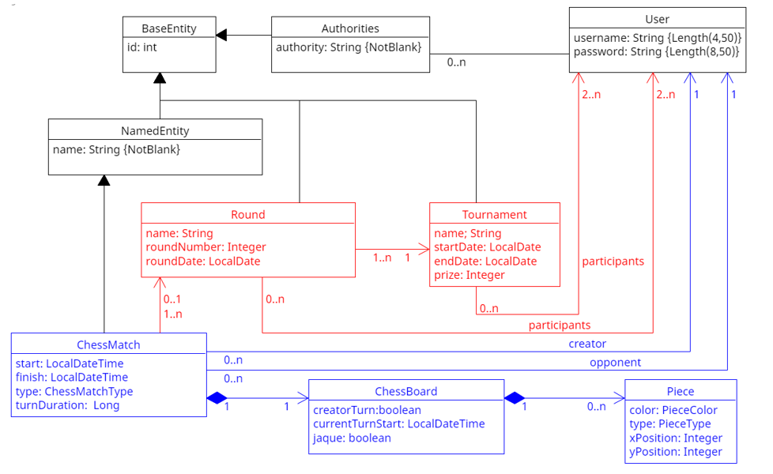
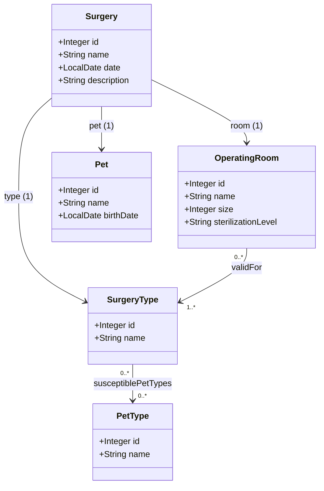
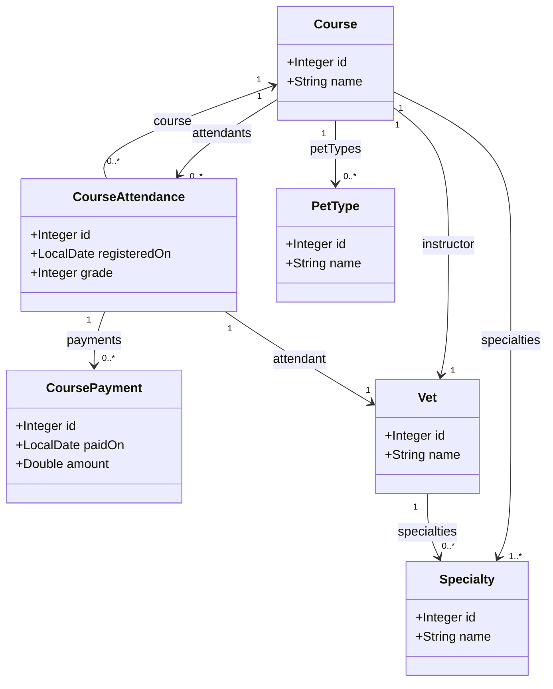
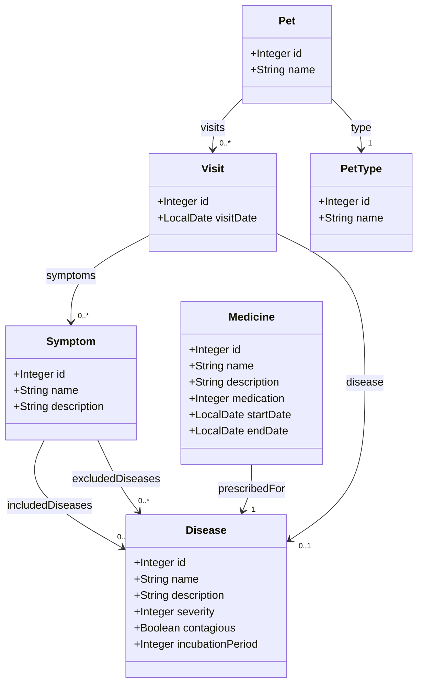

# TODOS LOS EXAMENES TIENEN QUE TENER ESTA CLASE DE TEST

```
package org.springframework.samples.petclinic;

import static org.junit.jupiter.api.Assertions.assertEquals;
import static org.junit.jupiter.api.Assertions.assertNotNull;
import static org.junit.jupiter.api.Assertions.assertThrows;
import static org.junit.jupiter.api.Assertions.assertTrue;
import static org.junit.jupiter.api.Assertions.fail;
import static org.junit.jupiter.api.Assumptions.assumeTrue;

import java.lang.reflect.Field;
import java.lang.reflect.InvocationTargetException;
import java.lang.reflect.Method;
import java.util.Arrays;
import java.util.Collection;
import java.util.List;
import java.util.Map;
import java.util.Set;

import org.junit.jupiter.api.AfterEach;
import org.junit.jupiter.api.BeforeEach;
import org.junit.jupiter.api.Test;
import org.springframework.format.annotation.DateTimeFormat;
import org.springframework.transaction.annotation.Transactional;

import com.fasterxml.jackson.core.JsonProcessingException;
import com.fasterxml.jackson.databind.ObjectMapper;
import com.fasterxml.jackson.datatype.jsr310.JavaTimeModule;

import jakarta.persistence.EntityManager;
import jakarta.validation.ConstraintViolation;
import jakarta.validation.Validation;
import jakarta.validation.Validator;
import jakarta.validation.ValidatorFactory;

public abstract class ReflexiveTest {
    
    public void checkThatFieldIsAnnotatedWithDateTimeFormat(Class aClass, String fieldname,String format){
        try{
            Field date=aClass.getDeclaredField(fieldname);
            DateTimeFormat dateformat=date.getAnnotation(DateTimeFormat.class);
            assertNotNull(dateformat, "The treatmentStart (date) property is not annotated with a DateTimeFormat");
            assertEquals(dateformat.pattern(),format);

        
        }catch(NoSuchFieldException ex){
            fail("The "+aClass.getName()+" class should have a field that is not present: "+ex.getMessage());
        }
    }

    protected void checkAtributeIsAnnotatedWith(Class annotatedClass, String attributeName, Class annotationClass,
            String annotationPropertyName, Object annnotationPropertyValue) {
                try{
                    Field myField=annotatedClass.getDeclaredField(attributeName);
                    Object annotation=myField.getAnnotation(annotationClass);
                    assertNotNull(annotation,"The "+attributeName+" property is not properly annotated");                    
                    Object fieldValue=invokeMethodReflexively(annotation,annotationPropertyName);
                    assertEquals(fieldValue,annnotationPropertyValue); 
                }catch(NoSuchFieldException ex){
                    fail("The "+annotatedClass.getName()+" class should have a field that is not present: "+ex.getMessage());
                }

    }

    public void checkThatFieldIsAnnotatedWith(Class aClass, String fieldname,Class annotationClass){
        try{
            Field myField=aClass.getDeclaredField(fieldname);
            Object annotation=myField.getAnnotation(annotationClass);
            assertNotNull(annotation,"The "+fieldname+" property is not properly annotated");
        }catch(NoSuchFieldException ex){
            fail("The "+aClass.getName()+" class should have a field that is not present: "+ex.getMessage());
        }
    }

    public boolean  isFieldAnnotatedWith(Class aClass, String fieldname,Class annotationClass) throws NoSuchFieldException, SecurityException{
        boolean result=false;
        Field myField=aClass.getDeclaredField(fieldname);
        Object annotation=myField.getAnnotation(annotationClass);
        result= (annotation != null);
        return result;
    }

    public boolean classIsAnnotatedWith(Class class1, Class class2) {
        return class1.getAnnotation(class2)!=null;
    }

    public boolean classHasMethod(Object targetObject, String methodName, Class<?>[] parameterTypes){
        Method method = null;
        try {
            method = targetObject.getClass().getMethod(methodName, parameterTypes);            
            return true;
        } catch (NoSuchMethodException e) {
            return false;
        }
    }

    public void checkThatFieldsAreMandatory(Object validEntity,EntityManager em,String ... fieldnames ){
        for(String fieldName:fieldnames)
            checkThatFieldIsMandatory(validEntity,fieldName,null,em);

    }
    public void checkThatFieldIsMandatory(Object validEntity,String fieldname,Class<?> type,EntityManager em){
        checkThatValueIsNotValid(validEntity, fieldname, null,type, em);
    }
    
    public void checkThatValuesAreNotValid(Object validEntity,Map<String,List<Object>> invalidValues,EntityManager em){
        for(String fieldName:invalidValues.keySet())
            for(Object invalidValue:invalidValues.get(fieldName))
                checkThatValueIsNotValid(validEntity, fieldName, invalidValue,null, em);
    }
    
    public void checkIsValid(Object o){
        ObjectMapper objectMapper=new ObjectMapper();
        objectMapper.registerModule(new JavaTimeModule());
        ValidatorFactory factory = Validation.buildDefaultValidatorFactory();
        Validator validator = factory.getValidator();            
        if(o!=null){            
                Set<ConstraintViolation<Object>> violations=validator.validate(o);
                try {
                    assertTrue(violations.isEmpty(),"The "+o.getClass().getSimpleName()+":'"+objectMapper.writeValueAsString(o)+" should be valid but the following constraint vionations were found:"+violations);
                } catch (JsonProcessingException e) {                    
                    e.printStackTrace();
                }
        }        
    }

    public void checkThatValueIsNotValid(Object validEntity,String fieldname,Object value,Class<?> type, EntityManager em){
        try{
            ValidatorFactory factory = Validation.buildDefaultValidatorFactory();
            Validator validator = factory.getValidator();            
            assumeTrue(validator.validate(validEntity).isEmpty());
            Object originalValue=setValue(validEntity,fieldname,type,value);                        
            Set<ConstraintViolation<Object>> violations=validator.validate(validEntity);
            if(violations.isEmpty()){
                assertThrows(Exception.class,() -> em.persist(validEntity),
                    "You are not constraining the "+fieldname+", since the value "+value+" was considered valid (and it should not be valid)");
            }
            setValue(validEntity,fieldname,type, originalValue);
        }catch (IllegalArgumentException e) {
            fail("The property "+fieldname+" of class "+validEntity.getClass().getName()+" was not modified: "+e.getMessage());
        } 

    }

    public static Object setValue(Object object,String fieldname,Class<?> type, Object value){
            Field myField;
            Object originalValue=null;
            try {
                myField = object.getClass().getField(fieldname);
                myField.setAccessible(true);
                originalValue=myField.get(object);
                myField.set(object, value);
            } catch (NoSuchFieldException e) {                
                e.printStackTrace();
                originalValue=invokeMethodReflexively(object, generateGetterName(fieldname));
                Class[] paramTypes=generateParameterTypes(type,value,originalValue);
                invokeMethodReflexivelyWithParamTypes(object, generateSetterName(fieldname),paramTypes,value);
            } catch (IllegalArgumentException | SecurityException e) {
                fail("The property "+fieldname+" of class "+object.getClass().getName()+" was not modified: "+e.getMessage());
            } catch (IllegalAccessException e) {
                fail("The property "+fieldname+" of class "+object.getClass().getName()+" was not modified: "+e.getMessage());
            }            
            return originalValue;
    }

    private static Class[] generateParameterTypes(Class type, Object value, Object originalValue) {
        Class[] paramTypes={type};
        if(type==null)
            paramTypes[0]= (value!=null?value.getClass():originalValue.getClass());
        return paramTypes;
    }

    private static String generateGetterName(String fieldname) {
        return "get"+fieldname.substring(0, 1).toUpperCase()+fieldname.substring(1); 
    }

    private static String generateSetterName(String fieldname) {
        return "set"+fieldname.substring(0, 1).toUpperCase()+fieldname.substring(1); 
    }

    public static Object invokeMethodReflexivelyWithParamTypes(Object targetObject, String methodName, Class<?>[] parameterTypes,
                                                            Object ... parameterValues) {
        Object result = null;
        Method method = null;
        try {
            method = targetObject.getClass().getMethod(methodName, parameterTypes);
            method.setAccessible(true);
            result = method.invoke(targetObject, parameterValues);
        } catch (NoSuchMethodException e) {            
            try{
                result=tryToInvokeMethodIrrespectivelyOfParameterTypes(targetObject, methodName,parameterValues);
            }catch(Exception ex){                
                fail(targetObject.getClass().getName() + " does not have a " + methodName + " method",ex);
            }
        } catch (SecurityException e) {
            fail(methodName + " method is not accessible in " + targetObject.getClass().getName());
        } catch (IllegalAccessException e) {
            fail(methodName + " method is not accessible in " + targetObject.getClass().getName());
        } catch (IllegalArgumentException e) {
            e.printStackTrace();
            fail("Invalid argument: " + e.getMessage());
        } catch (InvocationTargetException e) {
            fail(e.getMessage());
        }
        return result;
    }
    
    public static Object tryToInvokeMethodIrrespectivelyOfParameterTypes(Object targetObject, String methodName, Object... parameterValues) throws Exception {
        Class<?> clazz = targetObject.getClass();
        Method[] methods = clazz.getMethods();
    
        for (Method method : methods) {
            if (method.getName().equals(methodName)) {
                Class<?>[] methodParamTypes = method.getParameterTypes();
                if (methodParamTypes.length == parameterValues.length) {
                    boolean isCompatible = true;
                    for (int i = 0; i < methodParamTypes.length; i++) {
                        Object paramValue = parameterValues[i];
                        if (paramValue != null) {
                            if (!methodParamTypes[i].isAssignableFrom(paramValue.getClass())) {
                                isCompatible = false;
                                break;
                            }
                        } else {
                            // If parameter value is null, we cannot determine its type, assume it's compatible
                            // Alternatively, you might want to skip methods where the parameter type is primitive
                            if (methodParamTypes[i].isPrimitive()) {
                                isCompatible = false;
                                break;
                            }
                        }
                    }
                    if (isCompatible) {
                        method.setAccessible(true);
                        try {
                            return method.invoke(targetObject, parameterValues);
                        } catch (Exception e) {
                            // Continue to the next method if this one fails
                        }
                    }
                }
            }
        }
        throw new NoSuchMethodException("No suitable method named " + methodName + " found in " + clazz.getName());
    }
    


    public static Object invokeMethodReflexively(Object o, String methodName, Object ... params){
        Object result=null;
        try {
            if(o!=null){
                Method method = o.getClass().getMethod(methodName);            
                result = method.invoke(o,params);
            }else
                fail("The repository was not injected into the tests, its autowired value was null");
        } catch(NoSuchMethodException e) {
            fail("There is no method "+methodName+" in "+o.getClass().getName(), e);
        } catch (IllegalAccessException e) {
            fail("There is no public method "+methodName+" in "+o.getClass().getName(), e);
        } catch (IllegalArgumentException e) {
            fail("There is no method "+methodName+" in "+o.getClass().getName(), e);
        } catch (InvocationTargetException e) {
            fail("There is no method "+methodName+" in "+o.getClass().getName(), e);
        }
        return result;
    }

    public void checkLinkedById(Class myClass,Integer id1,String methodName,Integer id2,EntityManager em){
        Object o=em.find(myClass, id1);
        if(o==null)
            fail("Unable to find "+myClass.getName()+" with id:"+id1);
        else{
            Object o2=invokeMethodReflexively(o, methodName);
            if(o2==null)
                fail("The "+myClass.getName()+"with id:"+id1+"returned null when the method"+methodName+" was invoked");
            else{
                Integer actualId2=(Integer)invokeMethodReflexively(o2,"getId");
                if(actualId2!=null)
                    assertEquals(actualId2, id2,"The value of the id of the linked "+o2.getClass().getName()+" was "+actualId2+" but "+id2+" was expected!");
            }
        }
    }

    protected void checkContainsById(Class myClass, int id1, String methodName, int id2, EntityManager em) {
        Object o=em.find(myClass, id1);
        Integer actualId2=null;
        if(o==null)
            fail("Unable to find "+myClass.getName()+" with id:"+id1);
        else{
            Object o2=invokeMethodReflexively(o, methodName);
            if(o2==null)
                fail("The "+myClass.getName()+"with id:"+id1+"returned null when the method "+methodName+" was invoked");
            if(o2 instanceof Collection){
                for (Object  element : (Collection)o2) {
                    actualId2=(Integer)invokeMethodReflexively(element,"getId");
                    if(actualId2!=null && actualId2.equals(id2))
                        return;
                }
                fail("Id "+id2+"was not found in the id of the elements returned when "+methodName+" was invoked");
            }else
                fail("The "+myClass.getName()+"with id:"+id1+"did not return a Collection when the method"+methodName+" was invoked");
        }
    }


    public Object getFieldValueReflexively(Object o, String fieldName){
        Object result=null;
        try{            
            Field myField=o.getClass().getField(fieldName);
            myField.setAccessible(true);
            result=myField.get(o);            
        }catch(NoSuchFieldException ex){
            result=invokeMethodReflexively(o, generateGetterName(fieldName));            
        } catch (IllegalArgumentException e) {
            fail("The property "+fieldName+" of class "+o.getClass().getName()+" was not modified: "+e.getMessage());
        } catch (IllegalAccessException e) {
            fail("The property "+fieldName+" of class "+o.getClass().getName()+" was not modified: "+e.getMessage());
        }
        return result;
    }

    public void checkTransactional(Class<?> myClass,String methodName, Class<?>... parameterTypes) {
        Method method=null;
        try {
            method = myClass.getDeclaredMethod(methodName, parameterTypes);
            Transactional transactionalAnnotation=method.getAnnotation(Transactional.class);
            assertNotNull(transactionalAnnotation,"The method "+methodName+" is not annotated as transactional");
        } catch (NoSuchMethodException e) {
            fail(myClass.getName()+" does not have a "+methodName+" method");
        } catch (SecurityException e) {
            fail(methodName+" method is not accessible in "+myClass.getName());
        }
    }

    public boolean isMethodAnnotatedWithTest(Method method) {
        Test test=method.getAnnotation(Test.class);
        return test!=null;
    }

    public boolean isMethodAnnotatedWithBeforeEach(Method method) {
        BeforeEach beforeEach=method.getAnnotation(BeforeEach.class);
        return beforeEach!=null;
    }

    public boolean isMethodAnnotatedWithAfterEach(Method method) {
        AfterEach afterEach=method.getAnnotation(AfterEach.class);
        return afterEach!=null;
    }

    public void checkTransactionalRollback(Class<?> myClass,String methodName,Class<?>[] paramTypes,Class<? extends Exception> exceptionClass) {
        Method save=null;
        try {
            save = myClass.getDeclaredMethod(methodName, paramTypes);
        } catch (NoSuchMethodException e) {
           fail("WatchService does not have a save method");
        } catch (SecurityException e) {
            fail("save method is not accessible in WatchService");
        }
        Transactional transactionalAnnotation=save.getAnnotation(Transactional.class);
        assertNotNull(transactionalAnnotation,"The method "+methodName+" is not annotated as transactional");
        List<Class<? extends Throwable>> exceptionsWithRollbackFor=Arrays.asList(transactionalAnnotation.rollbackFor());
        assertTrue(exceptionsWithRollbackFor.contains(exceptionClass));
    }
    
}
```

# Control práctico de DP1 2024-2025 (Segunda Convocatoria Julio 2025)

## Enunciado

En este ejercicio, añadiremos la funcionalidad de gestión de desafíos para una implementación del juego del ajedrez. Concretamente, se proporciona una clase `ChessMatch` que representa las partidas que se juegan, y que tiene asociada una instancia de la clase `ChessBoard` que representa el estado del tablero para dicha partida, por lo que tendrá asociada un conjunto de instancias de la clase `Piece`. 

Además, tendremos la clase `Challenge`, que representa a un desafío acotado en el tiempo, por ejemplo "ganar 7 partidas en una semana entre el 10 y el 17 de julio de 2025", o "jugar 100 partidas en el año 2025 (entre el 1 de enero y el 31 de diciembre)". Para expresar el objetivo del desafío se usa el enumerado `ChallengeObjective`. 

Los usuarios del sistema se inscriben en los desafíos (esta situación está expresada a través de la relación `participants`), y cada vez que juegan una partida ésta se asocia con los desafíos en los que estén participando activamente según las fechas y la inscripción (esta situación está expresada a través de la relación entre `Challenge` y `ChessMatch`).

El diagrama UML que describe las clases y relaciones con las que vamos a trabajar es el siguiente:



Las clases para las que realizaremos el mapeo objeto-relacional como entidades JPA se han señalado en rojo. Las clases en azul son clases que se proporcionan ya mapeadas, pero con las que se trabajará durante el control de laboratorio.

Realizaremos una serie de ejercicios basados en funcionalidades que implementaremos en el sistema, y validaremos mediante pruebas unitarias. Cada ejercicio correctamente resuelto valdrá un punto, el número de casos de prueba de cada ejercicio puede variar entre uno y otro y la nota se calculará en base al porcentaje de casos de prueba que pasan. 

---

## Ejercicios a Resolver

### Test 1 – Creación de la entidad Challenge y su repositorio asociado
Modificar la clase `Challenge` para que sea una entidad. Esta clase está alojada en el paquete `es.us.dp1.chess.tournament.challenge`, y debe tener los siguientes atributos y restricciones:
* El atributo de tipo entero (`Integer`) llamado `id` actuará como clave primaria.
* Un atributo de tipo cadena de caracteres (`String`) llamado `message` obligatorio (no puede ser nulo), que debe tener una longitud mínima de 5 caracteres y máxima de 60 y que no puede estar formada por caracteres vacíos.
* El atributo de tipo entero (`Integer`) llamado `targetValue`, que representa el número de partidas ganadas o jugadas, o el número de piezas capturadas. Es obligatorio y su valor debe ser mayor o igual a 1.
* El atributo de tipo fecha (`LocalDate`) llamado `startDate`, que representa la fecha de comienzo y es obligatorio.
* El atributo de tipo fecha (`LocalDate`) llamado `endDate`, que representa la fecha de finalización y es obligatorio.
* Un atributo del tipo enumerado `ChallengeObjective` llamado `goal` obligatorio. Debe almacenarse como una cadena en la BD.

No modifique por ahora las anotaciones `@Transient` de las clases. Modificar la interfaz `ChallengeRepository` alojada en el mismo paquete para que extienda a `CrudRepository`. No olvide especificar sus parámetros de tipo y descomentar la consulta del método `findActiveChallengesAtDate`.

**Código del Test:**
```java
package es.us.dp1.chess.tournament;

import static org.junit.jupiter.api.Assertions.assertFalse;
import static org.junit.jupiter.api.Assertions.assertNotNull;
import static org.junit.jupiter.api.Assertions.assertTrue;
import static org.junit.jupiter.api.Assertions.fail;

import java.time.LocalDate;
import java.util.List;
import java.util.Map;
import java.util.Optional;
import java.util.Set;

import org.junit.jupiter.api.Disabled;
import org.junit.jupiter.api.Test;
import org.springframework.beans.factory.annotation.Autowired;
import org.springframework.boot.test.autoconfigure.orm.jpa.DataJpaTest;
import org.springframework.context.annotation.ComponentScan;

import org.springframework.stereotype.Service;

import es.us.dp1.chess.tournament.match.ChessMatch;
import es.us.dp1.chess.tournament.round.Round;
import es.us.dp1.chess.tournament.round.RoundRepository;
import es.us.dp1.chess.tournament.round.Tournament;
import es.us.dp1.chess.tournament.round.TournamentRepository;
import es.us.dp1.chess.tournament.user.Authorities;
import es.us.dp1.chess.tournament.user.User;
import jakarta.persistence.Entity;
import jakarta.persistence.EntityManager;
import jakarta.validation.ConstraintViolation;

@DataJpaTest()
//@Disabled
public class Test1 extends ReflexiveTest{

    @Autowired(required = false)
    TournamentRepository tournamentRepo;
    @Autowired(required = false)
    RoundRepository roundRepo;
    
    @Autowired
    EntityManager em;
 
    @Test
    public void test1RepositoriesExist(){
        assertNotNull(tournamentRepo,"The tournament repository was not injected into the tests, its autowired value was null");
        assertNotNull(roundRepo,"The round repository was not injected into the tests, its autowired value was null");
        test1RepositoriesContainsMethod();
    }

    public void test1RepositoriesContainsMethod(){
        if(tournamentRepo!=null){
            Object v=tournamentRepo.findById(12);
            assertFalse(null!=v && ((Optional)v).isPresent(), "No result (null) should be returned for a tournament that does not exist");
        }else
            fail("The tournament repository was not injected into the tests, its autowired value was null");
        
        if(roundRepo!=null){
            Object v=roundRepo.findById(12);
            assertFalse(null!=v && ((Optional)v).isPresent(), "No result (null) should be returned for a round that does not exist");
        }else
            fail("The round repository was not injected into the tests, its autowired value was null");
    }
    
    

    
    @Test
    public void test1CheckRoundConstraints() {
        Map<String,List<Object>> invalidValues=Map.of( 
                                        "name",     List.of(
                                                        "      ","a",
                                                        "aaaa",
                                                        "En un lugar de la Mancha, de cuyo nombre no quiero acordarme, no ha mucho tiempo que " +
                                                        "vivía un hidalgo de los de lanza en astillero, adarga antigua, rocín flaco y galgo corredor." +
                                                        "Una olla de algo más vaca que carnero, salpicón las más noches, duelos y quebrantos"+ 
                                                        "los sábados," + 
                                                        "lentejas los viernes, algún palomino de añadidura los domingos, consumían las tres"+
                                                        " partes de su hacienda. "),                                           
                                            "roundNumber",  List.of(-1, 0, 1001)                                           
                                            );


        Round r=createValidRound(em);
        if(r.getTournament()!=null)
            em.persist(r.getTournament());
        em.persist(r);
        
        checkThatFieldsAreMandatory(r, em, "roundDate");        
        
        checkThatValuesAreNotValid(r, invalidValues,em);   
    }

     @Test
    public void test1CheckTournamentContraints() {
         Map<String,List<Object>> invalidValues=Map.of(
                                            "name",     List.of(
                                                    "      ",
                                                    "a",
                                                    "aaaa",
                                                    "En un lugar de la Mancha, de cuyo nombre no quiero acordarme, no ha mucho tiempo" +
                                                    "que vivía un hidalgo de los de lanza en astillero, adarga antigua, rocín flaco y" +
                                                    "galgo corredor. Una olla de algo más vaca que carnero, salpicón las más noches,"
                                                    + "duelos y quebrantos los sábados, lentejas los viernes, algún palomino de añadidura" +
                                                    "los domingos, consumían las tres partes de su hacienda. "),
                                            "prize", List.of(-1,0)
                                            );

                                        
        Tournament t=createValidTournament(em);
        em.persist(t);
        
        checkThatFieldsAreMandatory(t, em, "name","startDate","endDate","prize");        
        
        checkThatValuesAreNotValid(t, invalidValues,em);   
    }

    
    @Test
    public void test1CheckTournamentAnnotations() {        
        assertTrue(classIsAnnotatedWith(Tournament.class,Entity.class));
    }

    @Test
    public void test1CheckRoundAnnotations() {
        assertTrue(classIsAnnotatedWith(Round.class,Entity.class));
    }

    public static Tournament createValidTournament(EntityManager em){        
        Tournament tournament=new Tournament();        
        setValue(tournament,"name",String.class,"Torneo de Ajedrez de Los Palacios");
        User u1=null;
        User u2=null;
        if(em!=null){
            u1=em.find(User.class, 4);
            u2=em.find(User.class, 5);        
        }else{
            u1=createUser("Pepe");
            u2=createUser("Juan");
        }
        tournament.setStartDate(LocalDate.of(2024, 12, 1)); 
        tournament.setEndDate(LocalDate.of(2024, 12, 20));
        tournament.setPrize(1000);
        tournament.setParticipants(List.of(u1,u2));        
        return tournament;
    }

    public static Round createValidRound(EntityManager em){
        
        User u1=null;
        User u2=null;
        if(em!=null){
            u1=em.find(User.class, 4);
            u2=em.find(User.class, 5);
        }else{
            u1=createUser("Pepe");
            u2=createUser("Juan");
        }
        Round round = new Round();
        setValue(round, "name", String.class, "Finals");        
        round.setRoundNumber(1);  // Valor dentro del rango
        round.setRoundDate(LocalDate.of(2024, 12, 1));        
        round.setParticipants(List.of(u1,u2));
        round.setTournament(createValidTournament(em));
        return round;
    }

    public static User createUser(String name){
        Authorities a1=new Authorities();
        a1.setAuthority("PANA");
        User u1=new User();
        setValue(u1,"username",String.class,name);
        setValue(u1, "authority", Authorities.class, a1);
        return u1;
    }
        
}
```

### Test 2 – Creación de relaciones entre las entidades
Elimine las anotaciones `@Transient` de los métodos y atributos que las tengan en las entidades creadas en el ejercicio anterior. Se pide crear las siguientes relaciones:
* Relación unidireccional desde `Challenge` hacia `User` usando el atributo `participants`.
* Relación unidireccional desde `Challenge` hacia `ChessMatch` mediante el atributo `matches`.
*Debe asegurarse de que las relaciones expresan adecuadamente la cardinalidad que muestra el diagrama UML.*

**Código del Test:**
```java
package es.us.dp1.chess.tournament;


import org.junit.jupiter.api.Test;
import org.springframework.beans.factory.annotation.Autowired;
import org.springframework.boot.test.autoconfigure.orm.jpa.DataJpaTest;

import es.us.dp1.chess.tournament.match.ChessMatch;
import es.us.dp1.chess.tournament.round.Round;
import es.us.dp1.chess.tournament.round.Tournament;
import jakarta.persistence.EntityManager;
import jakarta.persistence.ManyToMany;
import jakarta.persistence.ManyToOne;

@DataJpaTest()
public class Test2 extends ReflexiveTest{
    
    @Autowired(required = false)
    EntityManager em;         

    @Test
    public void test2TournamentAnnotations() {
        checkThatFieldIsAnnotatedWith(Tournament.class, "participants", ManyToMany.class);                                  
    }

    @Test
    public void test2RoundAnnotations() {        
        checkThatFieldIsAnnotatedWith(Round.class, "tournament", ManyToOne.class);        
        checkThatFieldIsAnnotatedWith(Round.class, "participants", ManyToMany.class);                
    }

    @Test
    public void test2ChessMatchAnnotations() {        
        checkThatFieldIsAnnotatedWith(ChessMatch.class, "round", ManyToOne.class);                
    }
    
    @Test
    private void test2TournamentConstraints() {
        Tournament t=Test1.createValidTournament(em);
        checkThatFieldsAreMandatory(t, em,"participants");        
    }

    @Test
    private void test2RoundConstraints() {
        Round r=Test1.createValidRound(em);
        checkThatFieldsAreMandatory(r, em,"participants","tournament");                
    }


}
```

### Test 3 – Modificación del script de inicialización de la base de datos (Desafíos)
Modificar el script de inicialización de la BD, para que se creen los siguientes desafíos:

**Challenge 1:**
* `id`: 1
* `message`: "Are you a champion?"
* `startDate`: 2025-07-01
* `endDate`: 2025-07-31
* `targetValue`: 10
* `goal`: WIN_MATCHES

**Challenge 2:**
* `id`: 2
* `message`: "The resilient player will endure!"
* `startDate`: 2025-07-15
* `endDate`: 2025-07-31
* `targetValue`: 5
* `goal`: PLAY_MATCHES

**Código del Test:**
```java
package es.us.dp1.chess.tournament;

import static org.junit.jupiter.api.Assertions.assertEquals;
import static org.junit.jupiter.api.Assertions.assertNotNull;
import static org.junit.jupiter.api.Assertions.assertNull;

import java.time.LocalDate;

import org.junit.jupiter.api.Disabled;
import org.junit.jupiter.api.Test;
import org.springframework.beans.factory.annotation.Autowired;
import org.springframework.boot.test.autoconfigure.orm.jpa.DataJpaTest;

import es.us.dp1.chess.tournament.round.Round;
import es.us.dp1.chess.tournament.round.Tournament;
import jakarta.persistence.EntityManager;

@DataJpaTest()
public class Test3 extends ReflexiveTest {    
    
    @Autowired
    EntityManager em;    
    
    @Test
    public void test3InitialTournament(){                        
        Tournament m1=em.find(Tournament.class,1);
        assertNotNull(m1,"There should exist a Tournament with id:1");
        assertEquals("Los Palacios Chess Tournament",getFieldValueReflexively(m1, "name"));
        assertEquals(1000,m1.getPrize());
        assertEquals(LocalDate.of(2024, 10, 1), m1.getStartDate());
        assertEquals(LocalDate.of(2024, 10, 15),m1.getEndDate());        
    }

    @Test
    public void test3InitialRounds()
    {
        Round round1 = em.find(Round.class, 1);
        assertNotNull(round1,"Cannot find round with id "+1);
        assertEquals("SemiFinals",getFieldValueReflexively(round1,"name"));
        assertEquals(LocalDate.of(2024,10,07),round1.getRoundDate());
        assertEquals(2,round1.getRoundNumber());
        
        Round round2 = em.find(Round.class, 2);        
        assertNotNull(round2,"Cannot find round with id "+2);
        assertEquals("Finals",getFieldValueReflexively(round2,"name"));
        assertEquals(LocalDate.of(2024,10,15),round2.getRoundDate());
        assertEquals(1,round2.getRoundNumber());
        
    }       
        
    
}
```

### Test 4 – Modificación del script de inicialización (Relaciones)
Modificar este script para que:
* El desafío con `id` 1 se asocie con la partida con `id` 2.
* El desafío con `id` 2 se asocie con las partidas con `id` 1 y 2.
* El desafío con `id` 1 se asocie con el usuario con `id` 4.
* El desafío con `id` 2 se asocie con el usuario con `id` 5.

**Código del Test:**
```java
package es.us.dp1.chess.tournament;

import org.junit.jupiter.api.Disabled;
import org.junit.jupiter.api.Test;
import org.springframework.beans.factory.annotation.Autowired;
import org.springframework.boot.test.autoconfigure.orm.jpa.DataJpaTest;

import es.us.dp1.chess.tournament.round.Round;
import es.us.dp1.chess.tournament.round.Tournament;
import jakarta.persistence.EntityManager;

@DataJpaTest
public class Test4 extends ReflexiveTest {
   
    @Autowired
    EntityManager em;
    
    @Test
    public void test4TournamentLinks() {        
        checkContainsById(Tournament.class,1,"getParticipants",4,em);
        checkContainsById(Tournament.class,1,"getParticipants",5,em);
        checkContainsById(Tournament.class,1,"getParticipants",6,em);
        checkContainsById(Tournament.class,1,"getParticipants",7,em);        
    }

    @Test
    public void test4RoundsLinks() {        
        
        checkContainsById(Round.class,1,"getParticipants",4,em);
        checkContainsById(Round.class,1,"getParticipants",5,em);
        checkContainsById(Round.class,1,"getParticipants",6,em);
        checkContainsById(Round.class,1,"getParticipants",7,em);        

        checkContainsById(Round.class,2,"getParticipants",4,em);        
        checkContainsById(Round.class,2,"getParticipants",7,em);        
        
        
    }

    @Test
    public void test4RoundTournamentsLinks() {                         
        checkLinkedById(Round.class,1,"getTournament",1,em);
        checkLinkedById(Round.class,2,"getTournament",1,em);        
    }
    
}
```

### Test 5 – Creación de servicios de gestión de desafíos
Modificar la clase `ChallengeService` para proporcionar los métodos:
1. `getAll`: Obtener todos los desafíos almacenados.
2. `getById`: Obtener un desafío por Id.
3. `save`: Grabar un desafío en la base de datos, teniendo en cuenta que no pueden existir más de 3 desafíos activos al mismo tiempo. En dicho caso se lanzará una excepción de tipo `TooManyConcurrentChallengesException`.

*Todos los métodos deben ser transaccionales a nivel de método.*

**Código del Test:**
```java
package es.us.dp1.chess.tournament;

import static org.junit.jupiter.api.Assertions.*;
import static org.mockito.ArgumentMatchers.*;
import static org.mockito.Mockito.*;

import java.util.List;

import org.junit.jupiter.api.BeforeEach;
import org.junit.jupiter.api.Test;
import org.junit.jupiter.api.extension.ExtendWith;
import org.mockito.Mock;
import org.mockito.junit.jupiter.MockitoExtension;

import es.us.dp1.chess.tournament.round.Round;
import es.us.dp1.chess.tournament.round.RoundRepository;
import es.us.dp1.chess.tournament.round.RoundService;
import es.us.dp1.chess.tournament.round.Tournament;
import es.us.dp1.chess.tournament.round.TournamentRepository;
import es.us.dp1.chess.tournament.round.TournamentService;

@ExtendWith(MockitoExtension.class)
public class Test5 extends ReflexiveTest{
     @Mock
    TournamentRepository tr;
    @Mock
    RoundRepository rr;

    
    TournamentService ts;    
    RoundService rs;
    
    @BeforeEach
    public void configuation(){
        ts=new TournamentService(tr);
        rs=new RoundService(rr);
    }
    
    @Test
    public void test5CheckTransactionalityOfTournamentService(){
        checkTransactional(TournamentService.class,"save", Tournament.class);        
        checkTransactional(TournamentService.class,"getAll");
    }
    
    @Test
    public void test5CheckTransactionalityOfRoundService(){
        checkTransactional(RoundService.class,"save", Round.class);        
        checkTransactional(RoundService.class,"getAll");
    }    
    
    @Test
    public void test5TournamentServiceCanGetTournaments(){
        assertNotNull(ts,"TournamentService was not injected by spring");
        when(tr.findAll()).thenReturn(List.of());
        List<Tournament> offers=ts.getAll();
        assertNotNull(offers,"The list of Tournaments found by the TournamentService was null");
        // The test fails if the service does not invoke the findAll of the repository:
        verify(tr).findAll();            
    }
    

    @Test
    public void test5RoundServiceCanGetRounds(){
        assertNotNull(rs,"RoundService was not injected by spring");
        when(rr.findAll()).thenReturn(List.of());
        List<Round> discounts=rs.getAll();
        assertNotNull(discounts,"The list of Rounds found by the RoundService was null");
        // The test fails if the service does not invoke the findAll of the repository:
        verify(rr).findAll();               
    }

    @Test
    public void test5RoundServiceCanSaveRounds(){
        assertNotNull(rs,"RoundService was not injected by spring");
        when(rr.save(any(Round.class))).thenReturn(null);    
        Round s=Test1.createValidRound(null);                
        rs.save(s);
        // The test fails if the service does not invoke the save function of the repository:
        verify(rr).save(s);
    }

    @Test
    public void test5TournamentServiceCanSaveTournaments() {
        assertNotNull(ts,"TournamentService was not injected by spring");
        when(tr.save(any(Tournament.class))).thenReturn(null);
        Tournament t=Test1.createValidTournament(null);
        ts.save(t);
        // The test fails if the service does not invoke the save function of the repository:
        verify(tr).save(t);
    }    
}
```

### Test 6 – Anotar el repositorio de partidas con una consulta compleja
Modificar la consulta personalizada `comprisedMatchesWithLessThanNPieces` del `MatchRepository` que recibe dos instantes determinados y un número de piezas. Devuelve el número de partidas celebradas (y terminadas) en ese rango de tiempo cuyo tablero contiene menos piezas de las indicadas.

**Código del Test:**
```java

package es.us.dp1.chess.tournament;

import static org.junit.jupiter.api.Assertions.*;

import java.time.LocalDate;
import java.time.LocalDateTime;
import java.util.Set;

import org.junit.jupiter.api.Disabled;
import org.junit.jupiter.api.Test;
import org.springdoc.core.converters.models.Pageable;
import org.springframework.beans.factory.annotation.Autowired;
import org.springframework.boot.test.autoconfigure.orm.jpa.DataJpaTest;
import org.springframework.data.domain.Page;

import es.us.dp1.chess.tournament.match.ChessMatch;
import es.us.dp1.chess.tournament.match.MatchRepository;
import jakarta.persistence.EntityManager;

@DataJpaTest
public class Test6 {
    
    @Autowired
    MatchRepository dr;
        
    @Autowired
    EntityManager em;
    @Test
    public void test() {
        validatefindByComplexCriteria();
    }    

    private void 
    validatefindByComplexCriteria() {
        int d= dr.comprisedMatches(                                   
            LocalDateTime.of(2024,10,1,0,0,0),
            LocalDateTime.of(2024,12,17,0,0,0) 
        );
        assertNotNull(d);
        assertEquals(4, d);

        d= dr.comprisedMatches(                                  
            LocalDateTime.of(2024,10,12,0,0,0),
            LocalDateTime.of(2024,12,17,0,0,0)
        );
        assertNotNull(d);
        assertEquals(3, d);
        

        d= dr.comprisedMatches(                                   
            LocalDateTime.of(2024,10,14,0,0,0),
            LocalDateTime.of(2024,12,17,0,0,0)
        );
        assertNotNull(d);
        assertEquals(1, d);
        

        d= dr.comprisedMatches(                        
            LocalDateTime.of(2024,11,12,0,0,0),
            LocalDateTime.of(2024,12,17,0,0,0)

        );
        assertNotNull(d);
        assertEquals(0, d);                       

    }
        
}
```

### Test 7 – Creación del controlador para devolver el tablero
Crear un método en `ChessMatchController` que responda a peticiones `GET` en la URL:
`http://localhost:8080/api/v1/matches/X/board`
Debe devolver el tablero (`ChessBoard`) de la partida `X`. Si no existe, devuelve `404 (NOT_FOUND)`.

**Código del Test:**
```java
package es.us.dp1.chess.tournament;

import static org.hamcrest.Matchers.hasSize;
import static org.hamcrest.Matchers.is;
import static org.springframework.security.test.web.servlet.request.SecurityMockMvcRequestPostProcessors.csrf;
import static org.springframework.test.web.servlet.request.MockMvcRequestBuilders.get;
import static org.springframework.test.web.servlet.request.MockMvcRequestBuilders.post;
import static org.springframework.test.web.servlet.result.MockMvcResultMatchers.jsonPath;
import static org.springframework.test.web.servlet.result.MockMvcResultMatchers.status;


import org.junit.jupiter.api.BeforeEach;
import org.junit.jupiter.api.Test;
import org.springframework.beans.factory.annotation.Autowired;
import org.springframework.boot.test.context.SpringBootTest;
import org.springframework.boot.test.context.SpringBootTest.WebEnvironment;
import org.springframework.security.test.context.support.WithMockUser;
import org.springframework.security.test.web.servlet.setup.SecurityMockMvcConfigurers;
import org.springframework.test.web.servlet.MockMvc;
import org.springframework.test.web.servlet.setup.MockMvcBuilders;
import org.springframework.transaction.annotation.Transactional;
import org.springframework.web.context.WebApplicationContext;

import com.fasterxml.jackson.core.JsonProcessingException;

@SpringBootTest(webEnvironment = WebEnvironment.RANDOM_PORT)
public class Test7 {
    @Autowired
	private WebApplicationContext context;
	
	private MockMvc mockMvc;

    private String url = "/api/v1/matches";
	@BeforeEach
	public void setup() {
		mockMvc = MockMvcBuilders
		.webAppContextSetup(context)
		.apply(SecurityMockMvcConfigurers.springSecurity())
		.build();
	}    	

	@Test
    @Transactional
    @WithMockUser(username = "player", authorities = {"PLAYER"})
    public void test7CanGetMatches() throws JsonProcessingException, Exception{
        mockMvc.perform(get(url))
			.andExpect(status().isOk());			
    }

    

    @Test
    @Transactional
    @WithMockUser(username = "player", authorities = {"PLAYER"})
    public void test7CanGetMathById() throws JsonProcessingException, Exception{
        mockMvc.perform(get(url+"/1"))
			.andExpect(status().isOk())			
            .andExpect(jsonPath("$.name", is("The Immortal Match, Anderssen vs Kieseritzky 1851")));        
    }


    @Test
    @Transactional
    @WithMockUser(username = "player", authorities = {"PLAYER"})
    public void test3aCannotGetHistoryOfNonExistentPet() throws JsonProcessingException, Exception{        
       mockMvc.perform(get(url+"/474629"))
			.andExpect(status().isNotFound());
    }
}
```

### Test 8 – Prueba para algoritmo de jaque con caballo
Modifique la clase de pruebas `HorseJaqueDetectorTest` y especifique casos de prueba para el método `boolean isJaque(int horseX, int horseY, int kingX, int kingY)`. Si se le pasan posiciones inválidas, el algoritmo lanza `InvalidPositionException`.


**Código del Test:**
```java
package es.us.dp1.chess.tournament;

import static org.junit.jupiter.api.Assertions.*;
import static org.mockito.ArgumentMatchers.*;
import static org.mockito.Mockito.*;

import java.time.LocalDateTime;
import java.util.List;

import org.junit.jupiter.api.Disabled;
import org.junit.jupiter.api.Test;
import org.junit.jupiter.api.extension.ExtendWith;
import org.mockito.Mock;
import org.mockito.junit.jupiter.MockitoExtension;
import org.mockito.junit.jupiter.MockitoSettings;
import org.mockito.quality.Strictness;

import es.us.dp1.chess.tournament.match.ChessMatch;
import es.us.dp1.chess.tournament.match.ChessMatchService;
import es.us.dp1.chess.tournament.match.ConcurrentMatchException;
import es.us.dp1.chess.tournament.match.MatchRepository;
import es.us.dp1.chess.tournament.round.RoundRepository;
import es.us.dp1.chess.tournament.user.User;

@ExtendWith(MockitoExtension.class)
@MockitoSettings(strictness = Strictness.LENIENT)
public class Test8 extends ReflexiveTest{    
    MatchRepository mr;

    ChessMatchService ms;

    @Test
    public void test8CheckCreationOkWihtoutConcurrentMatches() {
        mr = mock(MatchRepository.class);
        ChessMatch m1 =createOngoingMatch();
        m1.setFinish(LocalDateTime.now());
        when(mr.findByCreator(any(User.class))).thenReturn(List.of(m1));
        when(mr.findByOpponent(any(User.class))).thenReturn(List.of());
        ms=new ChessMatchService(mr);
        ChessMatch m = createOngoingMatch();
        ms.save(m);
        verify(mr).save(m);
    }        

    @Test
    public void test8CheckCreationKOWihtConcurrentMatches() {
        mr = mock(MatchRepository.class);
        when(mr.findByCreator(any(User.class))).thenReturn(List.of(createOngoingMatch()));
        when(mr.findByOpponent(any(User.class))).thenReturn(List.of());
        ms=new ChessMatchService(mr);
        ChessMatch m = createOngoingMatch();
        assertThrows(ConcurrentMatchException.class, ()-> ms.save(m));
        verify(mr, never()).save(m);        
    }

    @Test
    public void test8CheckSaveAnnotations(){
        Class<?>[] paramTypes = {ChessMatch.class};
        checkTransactional(ChessMatchService.class, "save", ChessMatch.class);
        checkTransactionalRollback(ChessMatchService.class, "save", paramTypes, 
        ConcurrentMatchException.class);
    }

    private ChessMatch createOngoingMatch() {
        ChessMatch m = new ChessMatch();
        m.setStart(LocalDateTime.now().minusDays(1));
        m.setCreator(Test1.createUser("Fulanito"));
        m.setOpponent(Test1.createUser("Zetanito"));
        m.setId((int)(Math.random() * 1000)+100);
        return m;
    }
}
```

### Test 9 – Creación de un componente básico React
Modificar el componente React en `frontend/src/matches/board.js` para que muestre los detalles del tablero haciendo una petición `GET` a `api/v1/matches/X/board`. Debe mostrar:
* `Alert` (color: danger) con el texto "¡Jaque al rey!" si el tablero tiene la propiedad jaque a true.
* Un título (H5) con el texto "Turno".
* Un `Badge` (color: primary si es el creador, dark si es el oponente) con el texto "Blancas" (creador) o "Negras" (oponente).

**Código del Test:**
```java
package es.us.dp1.chess.tournament;

import static org.junit.jupiter.api.Assertions.fail;

import java.lang.reflect.InvocationTargetException;
import java.lang.reflect.Method;
import java.util.stream.Stream;

import org.junit.jupiter.params.ParameterizedTest;
import org.junit.jupiter.params.provider.Arguments;
import org.junit.jupiter.params.provider.MethodSource;

import es.us.dp1.chess.tournament.horsemovevalidator.HorseMoveValidatorTest;
import es.us.dp1.chess.tournament.match.horsemovevalidator.AlmostValidHorseMoveValidator;
import es.us.dp1.chess.tournament.match.horsemovevalidator.CrappyHorseMoveValidator;
import es.us.dp1.chess.tournament.match.horsemovevalidator.DummyHorseMoveValidator;
import es.us.dp1.chess.tournament.match.horsemovevalidator.HorseMoveValidator;
import es.us.dp1.chess.tournament.match.horsemovevalidator.StrangeMovesValidator;
import es.us.dp1.chess.tournament.match.horsemovevalidator.ValidHorseMoveValidator;
import junit.framework.AssertionFailedError;

public class Test9 extends ReflexiveTest{    
    public class WrapperAlgorithm implements HorseMoveValidator {
        private HorseMoveValidator algorithm;
        private int numRuns;

        public WrapperAlgorithm(HorseMoveValidator algorithm) {
            this.algorithm = algorithm;
            this.numRuns = 0;
        }        

        public int getNumRuns() {
            return numRuns;
        }

        @Override
        public boolean isValid(int originX, int originY, int destinationX, int destinationY) {
            numRuns++;
            return algorithm.isValid(originX, originY, destinationX, destinationY);
        }

    }


    @ParameterizedTest    
    @MethodSource("provideAlgorithmsAndExpectedResults")
    public void testHorseMoveValidatorAlgorithm(HorseMoveValidator alg, boolean shouldFail){
        // Configure SUT:
        HorseMoveValidatorTest cdaTest=new HorseMoveValidatorTest();
        WrapperAlgorithm wrapper = new WrapperAlgorithm(alg);
        cdaTest.setAlgorithm(wrapper);
        int numberOfExecutedTestMethods=0;
        // ExecuteTests        
        numberOfExecutedTestMethods=executeTests(cdaTest, shouldFail);             
        if(numberOfExecutedTestMethods<1)  
            fail("You have not specified any test method!");    
        if(wrapper.getNumRuns() < 1)
            fail("The SUT has not been executed in the test!");    
    }

    private void executeAfterEach(HorseMoveValidatorTest cdaTest) {
        Method[] methods=cdaTest.getClass().getDeclaredMethods();
        for(Method method:methods){
            if(isMethodAnnotatedWithAfterEach(method)){
                try {                    
                    method.invoke(cdaTest);                    
                } catch (IllegalAccessException | IllegalArgumentException | InvocationTargetException e) {
                    System.out.println("Error while trying to invoke method:"+method.getName());
                    e.printStackTrace();
                }
            }
        }
    }

    private int executeTests(HorseMoveValidatorTest cdaTest, boolean shouldFail) {
        int executed=0;
        Method[] methods=cdaTest.getClass().getDeclaredMethods();
        boolean failDetected=false;
        String message="No test method detected the faulty implementation of the algorithm";
        for(Method method:methods){
            if(isMethodAnnotatedWithTest(method)){
                try {                                        
                    executed++;
                    executeBeforeEach(cdaTest);
                    method.invoke(cdaTest);     
                    executeAfterEach(cdaTest);
                }catch(AssertionError assertionError){
                    failDetected=true;
                    message="The test method named "+method.getName()+" failed (and should not)! AsssertionError: "+
                    assertionError.getMessage();
                } catch(InvocationTargetException e){
                    if(e.getTargetException() instanceof org.opentest4j.AssertionFailedError){
                        failDetected=true;
                        message="The test method named "+method.getName()+" failed (and should not)! AsssertionError: "
                                    +((org.opentest4j.AssertionFailedError)e.getTargetException()).getMessage();
                    }else
                        System.out.println("Error while trying to invoke method:"+method.getName());                    
                }catch (IllegalAccessException | IllegalArgumentException  e) {                    
                    System.out.println("Error while trying to invoke method:"+method.getName());                    
                }
            }
        }
        if(failDetected!=shouldFail)
            fail(message);
        return executed;
    }

    private void executeBeforeEach(HorseMoveValidatorTest cdaTest) {
        Method[] methods=cdaTest.getClass().getDeclaredMethods();
        for(Method method:methods){
            if(isMethodAnnotatedWithBeforeEach(method)){
                try {
                    method.invoke(cdaTest);
                } catch (IllegalAccessException | IllegalArgumentException | InvocationTargetException e) {
                    System.out.println("Error while trying to invoke method:"+method.getName());
                    e.printStackTrace();
                }
            }
        }
    }    

    public static Stream<Arguments> provideAlgorithmsAndExpectedResults(){
        return Stream.of(
            Arguments.of(new ValidHorseMoveValidator(), false),
            Arguments.of(new DummyHorseMoveValidator(), true),
            Arguments.of(new CrappyHorseMoveValidator(), true),
            Arguments.of(new StrangeMovesValidator(), true),
            Arguments.of(new AlmostValidHorseMoveValidator(), true)            
        );
    }
        
}
```


# Control práctico de DP1 2024-2025 (Segunda Convocatoria Julio 2025)

## Enunciado

En este ejercicio, añadiremos la funcionalidad de gestión de desafíos para una implementación del juego del ajedrez. Concretamente, se proporciona una clase `ChessMatch` que representa las partidas que se juegan, y que tiene asociada una instancia de la clase `ChessBoard` que representa el estado del tablero para dicha partida, por lo que tendrá asociada un conjunto de instancias de la clase `Piece`. 

Además, tendremos la clase `Challenge`, que representa a un desafío acotado en el tiempo, por ejemplo *"ganar 7 partidas en una semana entre el 10 y el 17 de julio de 2025"*, o *"jugar 100 partidas en el año 2025 (entre el 1 de enero y el 31 de diciembre)"*. Para expresar el objetivo del desafío se usa el enumerado `ChallengeObjective`. 

Los usuarios del sistema se inscriben en los desafíos (esta situación está expresada a través de la relación **"participants"**), y cada vez que juegan una partida ésta se asocia con los desafíos en los que estén participando activamente según las fechas y la inscripción (esta situación está expresada a través de la relación entre `Challenge` y `ChessMatch`).

> **Nota sobre el UML:** Las clases para las que realizaremos el mapeo objeto-relacional como entidades JPA se han señalado en rojo. Las clases en azul son clases que se proporcionan ya mapeadas, pero con las que se trabajará durante el control de laboratorio.

Realizaremos una serie de ejercicios basados en funcionalidades que implementaremos en el sistema, y validaremos mediante pruebas unitarias. Si desea ver el resultado que arrojarían las pruebas en backend, puede ejecutarlas (bien mediante su entorno de desarrollo favorito, bien mediante el comando `mvnw test` en la carpeta raíz del proyecto). Cada ejercicio correctamente resuelto valdrá un punto; el número de casos de prueba de cada ejercicio puede variar entre uno y otro y la nota se calculará en base al porcentaje de casos de prueba que pasan. Por ejemplo, si pasan la mitad (50%) de los casos de prueba de un ejercicio, en lugar de un punto usted obtendrá un 0.5.

### Instrucciones de Entrega
Para comenzar el control debe aceptar la tarea a través del siguiente enlace: [https://classroom.github.com/a/lD4Iqc88](https://classroom.github.com/a/lD4Iqc88)

Al aceptar dicha tarea, se creará un repositorio único individual para usted; debe usar dicho repositorio para realizar el control práctico. Debe entregar la actividad en EV asociada al control check proporcionando como texto la dirección URL de su repositorio personal. Recuerde que además debe entregar su solución del control.

La entrega de su solución al control se realizará mediante un único comando `git push` a su repositorio individual. Recuerde que debe hacer push antes de cerrar sesión en la computadora y abandonar el aula; de lo contrario, su intento se evaluará como no presentado. Su primera tarea en este control será clonar el repositorio. A continuación, deberá importar el proyecto en su entorno de desarrollo favorito y comenzar los ejercicios abajo listados. Al importar el proyecto, el mismo puede presentar errores de compilación. No se preocupe, dichos errores irán desapareciendo conforme vaya implementando los distintos ejercicios.

### Notas Importantes

* **Nota importante 1:** No modifique los nombres de las clases ni la signatura (nombre, tipo de respuesta y parámetros) de los métodos proporcionados como material de base. Las pruebas que se usan para la evaluación dependen de esta estructura. Si los modifica probablemente no pueda hacer que pasen las pruebas, y obtendrá una mala calificación.
* **Nota importante 2:** No modifique las pruebas unitarias proporcionadas bajo ningún concepto. Aunque las modifique en su copia local, éstas serán restituidas mediante un comando git antes de la ejecución de las pruebas para la nota final.
* **Nota importante 3:** Mientras haya ejercicios no resueltos habrá tests que no funcionen y, por tanto, el comando `mvnw install` finalizará con error. Esto es normal. Si se quiere probar la aplicación se puede ejecutar de la forma habitual pese a este error.
* **Nota importante 4:** La descarga del material usando git y la entrega de su solución con git forman parte de las competencias evaluadas. No se aceptarán entregas por otros medios ni se podrá solicitar ayuda a los profesores para estas tareas.
* **Nota importante 5:** No se aceptarán como soluciones válidas proyectos cuyo código fuente no compile correctamente o que provoquen fallos al arrancar la aplicación en la inicialización del contexto de Spring. Serán evaluadas con una nota de 0.

---

## Ejercicios a Desarrollar

### Test 1 – Creación de la entidad Challenge y su repositorio asociado
Modificar la clase `Challenge` para que sea una entidad. Esta clase está alojada en el paquete `es.us.dp1.chess.tournament.challenge`, y debe tener los siguientes atributos y restricciones:

* El atributo de tipo entero (`Integer`) llamado `id` actuará como clave primaria.
* Un atributo de tipo cadena de caracteres (`String`) llamado `message` obligatorio (no puede ser nulo), que debe tener una longitud mínima de 5 caracteres y máxima de 60 y que no puede estar formada por caracteres vacíos (espacios, tabuladores, etc.). [^1]
* El atributo de tipo entero (`Integer`) llamado `targetValue`, que representa el número de partidas ganadas/jugadas o piezas capturadas. Este atributo es obligatorio y su valor debe ser mayor o igual a 1.
* El atributo de tipo fecha (`LocalDate`) llamado `startDate`, que representa la fecha de comienzo y es obligatorio.
* El atributo de tipo fecha (`LocalDate`) llamado `endDate`, que representa la fecha de finalización y es obligatorio.
* Un atributo del tipo enumerado `ChallengeObjective` llamado `goal`. Este atributo es obligatorio y debe almacenarse como una cadena en la BD.

*No modifique por ahora las anotaciones `@Transient` de las clases.* Modificar la interfaz `ChallengeRepository` alojada en el mismo paquete para que extienda a `CrudRepository`. No olvide especificar sus parámetros de tipo y descomentar la consulta del método `findActiveChallengesAtDate`.

**Código del Test:**
```java
package es.us.dp1.chess.tournament;

import static org.junit.jupiter.api.Assertions.*;

import java.text.DateFormat.Field;
import java.time.LocalDate;
import java.util.List;
import java.util.Map;
import java.util.Optional;

import org.junit.jupiter.api.Test;
import org.springframework.beans.factory.annotation.Autowired;
import org.springframework.boot.test.autoconfigure.orm.jpa.DataJpaTest;

import es.us.dp1.chess.tournament.challenge.Challenge;
import es.us.dp1.chess.tournament.challenge.ChallengeObjective;
import es.us.dp1.chess.tournament.challenge.ChallengeRepository;
import es.us.dp1.chess.tournament.user.Authorities;
import es.us.dp1.chess.tournament.user.User;
import jakarta.persistence.Entity;
import jakarta.persistence.EntityManager;
import jakarta.persistence.EnumType;
import jakarta.persistence.Enumerated;

@DataJpaTest()
//@Disabled
public class Test1 extends ReflexiveTest{

    @Autowired(required = false)
    ChallengeRepository challengesRepository;

    @Autowired
    EntityManager em;

    @Test
    public void test1RepositoriesExist(){
        assertNotNull(challengesRepository,"The challenge repository was not injected into the tests, its autowired value was null");

        test1RepositoriesContainsMethod();
    }

    public void test1RepositoriesContainsMethod(){
        if(challengesRepository!=null){
            Object v=challengesRepository.findById(12);
            assertFalse(null!=v && ((Optional)v).isPresent(), "No result (null) should be returned for a challenge that does not exist");
        }else
            fail("The challenge repository was not injected into the tests, its autowired value was null");
    }


     @Test
    public void test1CheckChallengeContraints() {
         Map<String,List<Object>> invalidValues=Map.of(
                                            "message",     List.of(
                                                    "      ",
                                                    "a",
                                                    "aaaa",
                                                    "En un lugar de la Mancha, de cuyo nombre no quiero acordarme,"+
                                                    "no ha mucho tiempo que vivía un hidalgo de los de lanza en astillero,"+
                                                    "adarga antigua, rocín flaco y galgo corredor. Una olla de algo más" +
                                                    "vaca que carnero, salpicón las más noches, duelos y quebrantos" +
                                                    "los sábados, lentejas los viernes, algún palomino de añadidura los domingos,"+
                                                    "consumían las tres partes de su hacienda. "),
                                            "targetValue", List.of(-1,0)
                                            );


        Challenge t=createValidChallenge(em);
        em.persist(t);

        checkThatFieldsAreMandatory(t, em, "message","startDate","endDate","targetValue","goal");

        checkThatValuesAreNotValid(t, invalidValues,em);
    }


    @Test
    public void test1CheckChallengeAnnotations() throws NoSuchFieldException, SecurityException {
        assertTrue(classIsAnnotatedWith(Challenge.class,Entity.class));
        // 1. Obtenemos el campo goal.
        java.lang.reflect.Field goalField = Challenge.class.getDeclaredField("goal");

        // 2. Comprobamos que el Field posee la anotación
        assertTrue(
            goalField.isAnnotationPresent(Enumerated.class),
            "El atributo 'goal' carece de la anotación @Enumerated"
        );

        // 3. Inspeccionamos el valor de la anotación
        Enumerated enumerated = goalField.getAnnotation(Enumerated.class);
        assertEquals(
            EnumType.STRING,
            enumerated.value(),
            "La anotación @Enumerated no está configurada con EnumType.STRING"
        );
    }


    public static Challenge createValidChallenge(EntityManager em){
        Challenge challenge=new Challenge();
        setValue(challenge,"message",String.class,"Do you dare?");
        User u1=null;
        User u2=null;
        if(em!=null){
            u1=em.find(User.class, 4);
            u2=em.find(User.class, 5);
        }else{
            u1=createUser("Pepe");
            u2=createUser("Juan");
        }
        challenge.setStartDate(LocalDate.of(2024, 12, 1));
        challenge.setEndDate(LocalDate.of(2024, 12, 20));
        challenge.setTargetValue(10);
        challenge.setParticipants(List.of(u1,u2));
        challenge.setGoal(ChallengeObjective.WIN_MATCHES);
        return challenge;
    }


    public static User createUser(String name){
        Authorities a1=new Authorities();
        a1.setAuthority("PANA");
        User u1=new User();
        setValue(u1,"username",String.class,name);
        setValue(u1, "authority", Authorities.class, a1);
        return u1;
    }

}
```

### Test 2 – Creación de relaciones entre las entidades
Elimine las anotaciones `@Transient` de los métodos y atributos que las tengan en las entidades creadas en el ejercicio anterior. Se pide crear las siguientes relaciones:

* Cree una relación unidireccional desde `Challenge` hacia `User` que exprese la que aparece en el diagrama UML respetando sus cardinalidades, usando el atributo `participants` de la clase `Challenge`.
* Cree otra relación unidireccional desde `Challenge` hacia `ChessMatch` mediante el atributo `matches` que represente la que aparece en el diagrama UML. Debe asegurarse de que las relaciones expresan adecuadamente la cardinalidad que muestra el diagrama (ej. algunos atributos pueden ser nulos si la cardinalidad es 0..n, pero otros no si es 1..n).

**Código del Test:**
```java
package es.us.dp1.chess.tournament;


import org.junit.jupiter.api.Test;
import org.springframework.beans.factory.annotation.Autowired;
import org.springframework.boot.test.autoconfigure.orm.jpa.DataJpaTest;

import es.us.dp1.chess.tournament.challenge.Challenge;
import jakarta.persistence.EntityManager;
import jakarta.persistence.ManyToMany;

@DataJpaTest()
public class Test2 extends ReflexiveTest{

    @Autowired(required = false)
    EntityManager em;

    @Test
    public void test2ChallengeParticipantsAnnotations() {
        checkThatFieldIsAnnotatedWith(Challenge.class, "participants", ManyToMany.class);
    }

    @Test
    public void test2ChallengeMatchesAnnotations() {
        checkThatFieldIsAnnotatedWith(Challenge.class, "matches", ManyToMany.class);
    }

}
```

### Test 3 – Modificación del script de inicialización de la BD para incluir dos desafíos
Modificar el script de inicialización de la base de datos para que se creen los siguientes desafíos:

**Challenge 1:**
* **id:** 1
* **message:** "Are you a champion?"
* **startDate:** 2025-07-01
* **endDate:** 2025-07-31
* **targetValue:** 10
* **goal:** WIN_MATCHES

**Challenge 2:**
* **id:** 2
* **message:** "The resilient player will endure!"
* **startDate:** 2025-07-15
* **endDate:** 2025-07-31
* **targetValue:** 5
* **goal:** PLAY_MATCHES

**Código del Test:**
```java
package es.us.dp1.chess.tournament;

import static org.junit.jupiter.api.Assertions.assertEquals;
import static org.junit.jupiter.api.Assertions.assertNotNull;
import static org.junit.jupiter.api.Assertions.assertNull;

import java.time.LocalDate;

import org.junit.jupiter.api.Disabled;
import org.junit.jupiter.api.Test;
import org.springframework.beans.factory.annotation.Autowired;
import org.springframework.boot.test.autoconfigure.orm.jpa.DataJpaTest;

import es.us.dp1.chess.tournament.challenge.ChallengeObjective;
import es.us.dp1.chess.tournament.challenge.Challenge;
import jakarta.persistence.EntityManager;

@DataJpaTest()
public class Test3 extends ReflexiveTest {

    @Autowired
    EntityManager em;

    @Test
    public void test3InitialChallenge1(){
        Challenge m1=em.find(Challenge.class,1);
        assertNotNull(m1,"There should exist a Challenge with id:1");
        assertEquals("Are you a champion?",getFieldValueReflexively(m1, "message"));
        assertEquals(10,m1.getTargetValue());
        assertEquals(LocalDate.of(2025, 07, 1), m1.getStartDate());
        assertEquals(LocalDate.of(2025, 07, 31),m1.getEndDate());
        assertEquals(ChallengeObjective.WIN_MATCHES,m1.getGoal());
    }

    @Test
    public void test3InitialChallenge2(){
        Challenge m1=em.find(Challenge.class,2);
        assertNotNull(m1,"There should exist a Challenge with id:2");
        assertEquals("The resilient player will endure!",getFieldValueReflexively(m1, "message"));
        assertEquals(5,m1.getTargetValue());
        assertEquals(LocalDate.of(2025, 07, 15), m1.getStartDate());
        assertEquals(LocalDate.of(2025, 07, 31),m1.getEndDate());
        assertEquals(ChallengeObjective.PLAY_MATCHES,m1.getGoal());
    }
}
```

### Test 4 – Modificación del script para relacionar desafíos, partidas y usuarios
Modificar este script de inicialización de la base de datos para que:
* El desafío cuyo id es 1 se asocie con la partida cuyo id es 2.
* El desafío cuyo id es 2 se asocie con las partidas cuyo id es 1 y 2.
* El desafío cuyo id es 1 se asocie con el usuario cuyo id es 4.
* El desafío cuyo id es 2 se asocie con el usuario cuyo id es 5.

*Tenga en cuenta que el orden en que aparecen los INSERT en el script es relevante al definir las asociaciones.*

**Código del Test:**
```java
package es.us.dp1.chess.tournament;

import org.junit.jupiter.api.Test;
import org.springframework.beans.factory.annotation.Autowired;
import org.springframework.boot.test.autoconfigure.orm.jpa.DataJpaTest;

import es.us.dp1.chess.tournament.challenge.Challenge;
import jakarta.persistence.EntityManager;

@DataJpaTest
public class Test4 extends ReflexiveTest {

    @Autowired
    EntityManager em;

    @Test
    public void test4ChallengesParticipantsLinks() {
        checkContainsById(Challenge.class,1,"getParticipants",4,em);
        checkContainsById(Challenge.class,2,"getParticipants",5,em);
    }

    @Test
    public void test4ChallengesMatchesLinks() {
        checkContainsById(Challenge.class,1,"getMatches",2,em);
        checkContainsById(Challenge.class,2,"getMatches",1,em);
    }

}
```

### Test 5 – Creación de servicios de gestión de desafíos
Modificar la clase `ChallengeService`, para que sea un servicio Spring de lógica de negocio y proporcione una implementación a los métodos que permitan:
* Obtener todos los desafíos almacenados en la base de datos como una lista usando el repositorio (método `getAll`).
* Obtener un desafío por Id (método `getById`).
* Grabar un desafío en la base de datos, teniendo en cuenta que no pueden existir más de 3 desafíos activos al mismo tiempo en el sistema. En dicho caso se lanzará una excepción de tipo `TooManyConcurrentChallengesException` (puede usar el método `findActiveChallengesAtDate` del repositorio).

Todos estos métodos deben ser transaccionales, pero las anotaciones asociadas deben realizarse a nivel de método, no a nivel de clase. No modifique por ahora la implementación del resto de métodos.

**Código del Test:**
```java
package es.us.dp1.chess.tournament;

import static org.junit.jupiter.api.Assertions.*;
import static org.mockito.ArgumentMatchers.*;
import static org.mockito.Mockito.*;

import java.time.LocalDate;
import java.time.LocalDateTime;
import java.util.List;

import org.junit.jupiter.api.BeforeEach;
import org.junit.jupiter.api.Test;
import org.junit.jupiter.api.extension.ExtendWith;
import org.mockito.Mock;
import org.mockito.junit.jupiter.MockitoExtension;

import es.us.dp1.chess.tournament.challenge.ChallengeObjective;
import es.us.dp1.chess.tournament.challenge.Challenge;
import es.us.dp1.chess.tournament.challenge.ChallengeRepository;
import es.us.dp1.chess.tournament.challenge.ChallengeService;
import es.us.dp1.chess.tournament.challenge.TooManyConcurrentChallengesException;

@ExtendWith(MockitoExtension.class)
public class Test5 extends ReflexiveTest{
     @Mock
    ChallengeRepository chr;

    ChallengeService ts;

    @BeforeEach
    public void configuation(){
        ts=new ChallengeService(chr);
    }

    @Test
    public void test5CheckTransactionalityOfChallengeService(){
        checkTransactional(ChallengeService.class,"save", Challenge.class);
        checkTransactional(ChallengeService.class,"getAll");
    }

    @Test
    public void test5ChallengeServiceCanGetChallenges(){
        assertNotNull(ts,"TChallengeService was not injected by spring");
        when(chr.findAll()).thenReturn(List.of());
        List<Challenge> offers=ts.getAll();
        assertNotNull(offers,"The list of Challenges found by the ChallengeService was null");
        // The test fails if the service does not invoke the findAll of the repository:
        verify(chr).findAll();
    }

    @Test
    public void test5ChallengeServiceCanSaveChallenges() throws TooManyConcurrentChallengesException {
        assertNotNull(ts,"ChallengeService was not injected by spring");
        when(chr.save(any(Challenge.class))).thenReturn(null);
        Challenge t=Test1.createValidChallenge(null);
        ts.save(t);
        // The test fails if the service does not invoke the save function of the repository:
        verify(chr).save(t);
    }

    @Test
    public void test5ChallengeServiceImposesConcurrencyConstraints() {
        Challenge c1=new Challenge();
        LocalDate start=LocalDate.of(2025, 07, 01);
        LocalDate end=LocalDate.of(2025, 07, 31);
        c1.setStartDate(start);
        c1.setEndDate(end);
        c1.setGoal(ChallengeObjective.WIN_MATCHES);
        c1.setTargetValue(10);

        Challenge c2=createRandomChallengeBetweenDates(start, end);

        when(chr.findActiveChallengesAtDate(any(LocalDate.class)))
            .thenReturn(List.of(c2,c2,c2,c2,c2,c2,c2,c2,c2,c2));
        assertThrows(TooManyConcurrentChallengesException.class,()->{
            ts.save(c1);
        });
        verify(chr,never()).save(c1);
    }

    public Challenge createRandomChallengeBetweenDates(LocalDate start, LocalDate end){
        Challenge c=new Challenge();
        c.setStartDate(start);
        c.setEndDate(end);
        c.setGoal(ChallengeObjective.WIN_MATCHES);
        c.setTargetValue(10);
        return c;
    }

}
```

### Test 6 – Anotar el repositorio de partidas con una consulta compleja
Modificar la consulta personalizada que puede invocarse a través del método `comprisedMatchesWithLessThanNPieces` del repositorio de partida `MatchRepository` (alojado en `es.us.dp1.chess.tournament.match`). Este recibe como parámetro dos instantes determinados (que definen un rango) y un número de piezas. El objetivo es que devuelva el número de partidas celebradas (y terminadas) en ese rango de tiempo cuyo tablero contiene menos piezas de las indicadas.

**Código del Test:**
```java

package es.us.dp1.chess.tournament;

import static org.junit.jupiter.api.Assertions.*;

import java.time.LocalDate;
import java.time.LocalDateTime;
import java.util.List;

import org.junit.jupiter.api.Test;
import org.springframework.beans.factory.annotation.Autowired;
import org.springframework.boot.test.autoconfigure.orm.jpa.DataJpaTest;

import es.us.dp1.chess.tournament.match.ChessMatch;
import es.us.dp1.chess.tournament.match.MatchRepository;
import jakarta.persistence.EntityManager;

@DataJpaTest
public class Test6 {

    @Autowired
    MatchRepository mr;

    @Autowired
    EntityManager em;
    @Test
    public void test() {
        validatefindByComplexCriteria();
    }

    private void
    validatefindByComplexCriteria() {
        List<ChessMatch> d= mr.comprisedMatchesWithLessThanNPieces(
            LocalDateTime.of(2024,10,1,0,0,0),
            LocalDateTime.of(2024,12,17,0,0,0),
            28
        );
        assertNotNull(d);
        assertEquals(4, d.size());

        d= mr.comprisedMatchesWithLessThanNPieces(
            LocalDateTime.of(2024,10,12,0,0,0),
            LocalDateTime.of(2024,12,17,0,0,0),
            1
        );
        assertNotNull(d);
        assertEquals(2, d.size());


        d= mr.comprisedMatchesWithLessThanNPieces(
            LocalDateTime.of(2024,10,14,0,0,0),
            LocalDateTime.of(2024,12,17,0,0,0),
            32
        );
        assertNotNull(d);
        assertEquals(1, d.size());


        d= mr.comprisedMatchesWithLessThanNPieces(
            LocalDateTime.of(2024,11,12,0,0,0),
            LocalDateTime.of(2024,12,17,0,0,0),
            32
        );
        assertNotNull(d);
        assertEquals(0, d.size());

    }

}
```

### Test 7 – Creación del controlador para devolver el tablero de una partida
Crear un método en el controlador `ChessMatchController` que permita devolver el tablero de una partida. El método debe responder a peticiones tipo `GET` en la URL:
`http://localhost:8080/api/v1/matches/X/board`

El método debe devolver el tablero (`ChessBoard`) de una partida concreta, donde `X` es la Id de la partida. En caso de que no exista, el sistema debe devolver el código de estado `404 (NOT_FOUND)`.

**Código del Test:**
```java
package es.us.dp1.chess.tournament;

import static org.hamcrest.Matchers.hasSize;
import static org.hamcrest.Matchers.is;
import static org.springframework.security.test.web.servlet.request.SecurityMockMvcRequestPostProcessors.csrf;
import static org.springframework.test.web.servlet.request.MockMvcRequestBuilders.get;
import static org.springframework.test.web.servlet.request.MockMvcRequestBuilders.post;
import static org.springframework.test.web.servlet.result.MockMvcResultMatchers.jsonPath;
import static org.springframework.test.web.servlet.result.MockMvcResultMatchers.status;


import org.junit.jupiter.api.BeforeEach;
import org.junit.jupiter.api.Test;
import org.springframework.beans.factory.annotation.Autowired;
import org.springframework.boot.test.context.SpringBootTest;
import org.springframework.boot.test.context.SpringBootTest.WebEnvironment;
import org.springframework.security.test.context.support.WithMockUser;
import org.springframework.security.test.web.servlet.setup.SecurityMockMvcConfigurers;
import org.springframework.test.web.servlet.MockMvc;
import org.springframework.test.web.servlet.setup.MockMvcBuilders;
import org.springframework.transaction.annotation.Transactional;
import org.springframework.web.context.WebApplicationContext;

import com.fasterxml.jackson.core.JsonProcessingException;

@SpringBootTest(webEnvironment = WebEnvironment.RANDOM_PORT)
public class Test7 {
    @Autowired
	private WebApplicationContext context;

	private MockMvc mockMvc;

    private String url = "/api/v1/matches";
	@BeforeEach
	public void setup() {
		mockMvc = MockMvcBuilders
		.webAppContextSetup(context)
		.apply(SecurityMockMvcConfigurers.springSecurity())
		.build();
	}


    @Test
    @Transactional
    @WithMockUser(username = "player", authorities = {"PLAYER"})
    public void test7CanGetboardMatchById() throws JsonProcessingException, Exception{
        mockMvc.perform(get(url+"/1/board"))
			.andExpect(status().isOk())
            .andExpect(jsonPath("$.jaque", is(false)))
            .andExpect(jsonPath("$.creatorTurn", is(false)))
            .andExpect(jsonPath("$.pieces", hasSize(16)));
    }


    @Test
    @Transactional
    @WithMockUser(username = "player", authorities = {"PLAYER"})
    public void test3aCannotGetHistoryOfNonExistentPet() throws JsonProcessingException, Exception{
       mockMvc.perform(get(url+"/474629/board"))
			.andExpect(status().isNotFound());
    }
}
```

### Test 8 – Prueba para un algoritmo de validación de movimientos (Caballo)
La interfaz `HorseJaqueDetector` en `es.us.dp1.chess.tournament.match.jaquedetector` pretende detectar cuándo un caballo contrario está dando jaque a nuestro rey. El método tiene la signatura: `boolean isJaque(int horseX, int horseY, int kingX, int kingY)`. Si se le pasan posiciones inválidas (fuera del rango 0 a 7), debe lanzar `InvalidPositionException`.

Modifique la clase de pruebas `HorseJaqueDetectorTest` en `scr/test/java/es/us/dp1/chess/tournament/horsejaquedetector` y especifique tantos métodos con casos de prueba como considere necesarios. La clase tiene un atributo de tipo `HorseJaqueDetector` llamado `algorithm`; úselo como sujeto bajo prueba.

*Su implementación no debe usar mocks, ni anotaciones de pruebas de Spring, ni tests parametrizados. Todos los métodos anotados con `@Test` deben ser sin parámetros.*

**Código del Test:**
```java
package es.us.dp1.chess.tournament;

import static org.junit.jupiter.api.Assertions.fail;

import java.lang.reflect.InvocationTargetException;
import java.lang.reflect.Method;
import java.util.stream.Stream;

import org.junit.jupiter.params.ParameterizedTest;
import org.junit.jupiter.params.provider.Arguments;
import org.junit.jupiter.params.provider.MethodSource;

import es.us.dp1.chess.tournament.horsejaquedetector.HorseJaqueDetectorTest;
import es.us.dp1.chess.tournament.match.jaquedetector.AlmostValidHorseJaqueDetector;
import es.us.dp1.chess.tournament.match.jaquedetector.CrappyHorseJaqueDetector;
import es.us.dp1.chess.tournament.match.jaquedetector.DummyHorseJaqueDetector;
import es.us.dp1.chess.tournament.match.jaquedetector.HorseJaqueDetector;
import es.us.dp1.chess.tournament.match.jaquedetector.InvalidPositionException;
import es.us.dp1.chess.tournament.match.jaquedetector.StrangeJaqueDetector;
import es.us.dp1.chess.tournament.match.jaquedetector.ValidHorseJaqueDetector;

public class Test8 extends ReflexiveTest{
    public class WrapperAlgorithm implements HorseJaqueDetector {
        private HorseJaqueDetector algorithm;
        private int numRuns;

        public WrapperAlgorithm(HorseJaqueDetector algorithm) {
            this.algorithm = algorithm;
            this.numRuns = 0;
        }

        public int getNumRuns() {
            return numRuns;
        }

        @Override
        public boolean isJaque(int originX, int originY, int destinationX, int destinationY)
                throws InvalidPositionException {
                    numRuns++;
                    return algorithm.isJaque(originX, originY, destinationX, destinationY);
        }
    }


    @ParameterizedTest
    @MethodSource("provideAlgorithmsAndExpectedResults")
    public void testHorseMoveValidatorAlgorithm(HorseJaqueDetector alg, boolean shouldFail){
        // Configure SUT:
        HorseJaqueDetectorTest cdaTest=new HorseJaqueDetectorTest();
        WrapperAlgorithm wrapper = new WrapperAlgorithm(alg);
        cdaTest.setAlgorithm(wrapper);
        int numberOfExecutedTestMethods=0;
        // ExecuteTests
        numberOfExecutedTestMethods=executeTests(cdaTest, shouldFail);
        if(numberOfExecutedTestMethods<1)
            fail("You have not specified any test method!");
        if(wrapper.getNumRuns() < 1)
            fail("The SUT has not been executed in the test!");
    }

    private void executeAfterEach(HorseJaqueDetectorTest cdaTest) {
        Method[] methods=cdaTest.getClass().getDeclaredMethods();
        for(Method method:methods){
            if(isMethodAnnotatedWithAfterEach(method)){
                try {
                    method.invoke(cdaTest);
                } catch (IllegalAccessException | IllegalArgumentException | InvocationTargetException e) {
                    System.out.println("Error while trying to invoke method:"+method.getName());
                    e.printStackTrace();
                }
            }
        }
    }

    private int executeTests(HorseJaqueDetectorTest cdaTest, boolean shouldFail) {
        int executed=0;
        Method[] methods=cdaTest.getClass().getDeclaredMethods();
        boolean failDetected=false;
        String message="No test method detected the faulty implementation of the algorithm";
        for(Method method:methods){
            if(isMethodAnnotatedWithTest(method)){
                try {
                    executed++;
                    executeBeforeEach(cdaTest);
                    method.invoke(cdaTest);
                    executeAfterEach(cdaTest);
                }catch(AssertionError assertionError){
                    failDetected=true;
                    message="The test method named "+method.getName()+" failed (and should not)! AsssertionError: "+
                    assertionError.getMessage();
                } catch(InvocationTargetException e){
                    if(e.getTargetException() instanceof org.opentest4j.AssertionFailedError){
                        failDetected=true;
                        message="The test method named "+method.getName()+" failed (and should not)! AsssertionError: "
                                    +((org.opentest4j.AssertionFailedError)e.getTargetException()).getMessage();
                    }else
                        System.out.println("Error while trying to invoke method:"+method.getName());
                }catch (IllegalAccessException | IllegalArgumentException  e) {
                    System.out.println("Error while trying to invoke method:"+method.getName());
                }
            }
        }
        if(failDetected!=shouldFail)
            fail(message);
        return executed;
    }

    private void executeBeforeEach(HorseJaqueDetectorTest cdaTest) {
        Method[] methods=cdaTest.getClass().getDeclaredMethods();
        for(Method method:methods){
            if(isMethodAnnotatedWithBeforeEach(method)){
                try {
                    method.invoke(cdaTest);
                } catch (IllegalAccessException | IllegalArgumentException | InvocationTargetException e) {
                    System.out.println("Error while trying to invoke method:"+method.getName());
                    e.printStackTrace();
                }
            }
        }
    }

    public static Stream<Arguments> provideAlgorithmsAndExpectedResults(){
        return Stream.of(
            Arguments.of(new ValidHorseJaqueDetector(), false),
            Arguments.of(new DummyHorseJaqueDetector(), true),
            Arguments.of(new CrappyHorseJaqueDetector(), true),
            Arguments.of(new StrangeJaqueDetector(), true),
            Arguments.of(new AlmostValidHorseJaqueDetector(), true)
        );
    }

}
```

### Test 9 – Creación de un componente básico React de información de tableros
Modificar el componente React proporcionado en `frontend/src/matches/board.js` para que muestre los detalles del tablero haciendo una petición `GET` a la API en `api/v1/matches/X/board`.
Debe mostrar:
* Un componente `Alert` de reactstrap (color `danger`) con el texto "¡Jaque al rey!" si el tablero tiene la propiedad jaque a true.
* Un título de nivel 5 (`<h5>`) cuyo contenido sea el texto "Turno".
* Un componente `Badge` de reactstrap (color `primary` si es el turno del creador, o `dark` si es el turno del oponente). El contenido será "Blancas" si es turno del creador y "Negras" si es el turno del oponente.

*(Para probar, ejecute `npm test` en la carpeta frontend y pulse 'a').*


### Test 10 – Creación de un componente de detalles de tablero en React
Complete el código del componente `boardDetail`, para hacer que se muestre cada pieza en la celda correspondiente de la tabla que representa al tablero de ajedrez. Nótese el uso que se hace de la colección de piezas y las variables definidas. Probablemente necesite importar el componente `Table` de reactstrap.

*(Para probar, ejecute `npm test` en la carpeta frontend y pulse 'a').*

---
[^1]: *Nótese que estas restricciones no coinciden con las de `NamedEntity`.*

# Control práctico de DP1 2023-2024 (Tercera convocatoria-octubre 2024)

## Enunciado

En este ejercicio, añadiremos la funcionalidad de gestión de enfermedades, síntomas y tratamientos médicos. Concretamente, se proporciona una clase `Disease` que representa a las enfermedades que pueden desarrollar las mascotas, que se relaciona con el tipo de mascotas que pueden sufrirlas.

Además, tendremos las clases `Symptom` y `Treatment` que representan a los síntomas que pueden aparecer a consecuencia de una enfermedad y los tratamientos recomendados para cada enfermedad respectivamente. Además, se ha creado una relación que indica qué síntomas son susceptibles de presentarse para una enfermedad llamada **"includes"**, y otra relación para indicar qué síntomas excluyen que se trate de ciertas enfermedades llamada **"excludes"**, para ayudar a los veterinarios a realizar diagnósticos más precisos.

> **Nota sobre el UML:** Las clases para las que realizaremos el mapeo objeto-relacional como entidades JPA se han señalado en rojo. Las clases en azul son clases que se proporcionan ya mapeadas pero con las que se trabajará durante el control de laboratorio.

Realizaremos una serie de ejercicios basados en funcionalidades que implementaremos en el sistema, y validaremos mediante pruebas unitarias. Si desea ver el resultado que arrojarían las pruebas en backend, puede ejecutarlas (bien mediante su entorno de desarrollo favorito, bien mediante el comando `mvnw test` en la carpeta raíz del proyecto). Cada ejercicio correctamente resuelto valdrá un punto, el número de casos de prueba de cada ejercicio puede variar entre uno y otro y la nota se calculará en base al porcentaje de casos de prueba que pasan. Por ejemplo, si pasan la mitad (50%) de los casos de prueba de un ejercicio, en lugar de un punto usted obtendrá un 0.5.

### Instrucciones de Entrega
Para comenzar el control debe aceptar la tarea de este control práctico a través del siguiente enlace: [https://classroom.github.com/a/7txXh2sC](https://classroom.github.com/a/7txXh2sC)

Al aceptar dicha tarea, se creará un repositorio único individual para usted; debe usar dicho repositorio para realizar el control práctico. Debe entregar la actividad en EV asociada al control check proporcionando como texto la dirección url de su repositorio personal. Recuerde que además debe entregar su solución del control.

La entrega de su solución al control se realizará mediante un único comando `git push` a su repositorio individual. Recuerde que debe hacer push antes de cerrar sesión en la computadora y abandonar el aula, de lo contrario, su intento se evaluará como no presentado. Su primera tarea en este control será clonar el repositorio. A continuación, deberá importar el proyecto en su entorno de desarrollo favorito y comenzar los ejercicios abajo listados. Al importar el proyecto, el mismo puede presentar errores de compilación. No se preocupe, si existen, dichos errores irán desapareciendo conforme usted vaya implementando los distintos ejercicios del control.

### Notas Importantes

* **Nota importante 1:** No modifique los nombres de las clases ni la signatura (nombre, tipo de respuesta y parámetros) de los métodos proporcionados como material de base para el control. Las pruebas que se usan para la evaluación dependen de que las clases y los métodos tengan la estructura y nombres proporcionados. Si los modifica probablemente no pueda hacer que pasen las pruebas, y obtendrá una mala calificación.
* **Nota importante 2:** No modifique las pruebas unitarias proporcionadas como parte del proyecto bajo ningún concepto. Aunque modifique las pruebas en su copia local del proyecto, éstas serán restituidas mediante un comando git previamente a la ejecución de las pruebas para la emisión de la nota final, por lo que sus modificaciones en las pruebas no serán tenidas en cuenta en ningún momento.
* **Nota importante 3:** Mientras haya ejercicios no resueltos habrá tests que no funcionen y, por tanto, el comando `mvnw install` finalizará con error. Esto es normal debido a la forma en la que está planteado el control y no hay que preocuparse por ello. Si se quiere probar la aplicación se puede ejecutar de la forma habitual pese a que `mvnw install` finalice con error.
* **Nota importante 4:** La descarga del material de la prueba usando git, y la entrega de su solución con git a través del repositorio GitHub creado a tal efecto forman parte de las competencias evaluadas durante el examen, por lo que no se aceptarán entregas que no hagan uso de este medio, y no se podrá solicitar ayuda a los profesores para realizar estas tareas.
* **Nota importante 5:** No se aceptarán como soluciones válidas proyectos cuyo código fuente no compile correctamente o que provoquen fallos al arrancar la aplicación en la inicialización del contexto de Spring. Las soluciones cuyo código fuente no compile o incapaces de arrancar el contexto de Spring serán evaluadas con una nota de 0.

---

## Ejercicios a Desarrollar

### Test 1 – Creación de las entidades Symptom y Treatment y sus repositorios asociados
Modificar las clases `Symptom` y `Treatment` para que sean entidades. Estas clases están alojadas en el paquete `org.springframework.samples.petclinic.disease`, y deben tener los siguientes atributos y restricciones:

**Para ambas clases:**
* El atributo de tipo entero (`Integer`) llamado `id` actuará como clave primaria en la tabla de la base de datos relacional asociada a la entidad.
* Un atributo de tipo cadena de caracteres (`String`) llamado `name` obligatorio (no puede ser nulo), que debe tener una longitud mínima de 3 caracteres y máxima de 50 y que no puede estar formada por caracteres vacíos (espacios, tabuladores, etc.).

**Para la clase Treatment:**
* El atributo de tipo entero (`Integer`) llamado `baseDose`, que representa el número de miligramos de tratamiento por kilogramo de peso del animal. Este atributo será obligatorio y tendrá un valor mínimo de 1.
* El atributo de tipo entero (`Integer`) llamado `shockDose`, que representa una cantidad fija de miligramos. En la lógica de negocio del sistema esta cantidad se añadirá al tratamiento en caso de que la enfermedad a tratar sea mortal (valor 5 para el atributo `severity` en la entidad `Disease`). El atributo es opcional, pero si toma valor, tendrá un valor mínimo de 1.
* El atributo de tipo entero (`Integer`) llamado `maxDose` que representa la dosis máxima de tratamiento que puede llegar a administrarse (en miligramos de tratamiento por kilogramo de peso del animal). Este atributo es obligatorio y tendrá un valor mínimo de 1.

**Para la clase Symptom:**
* El atributo de tipo cadena caracteres (`String`) llamado `virulence` opcional que únicamente podrá tomar tres valores: "LOW", "MEDIUM", "HIGH". [^1]

*No modifique por ahora las anotaciones `@Transient` de las clases.* Modificar las interfaces `SymptomRepository` y `TreatmentRepository` alojadas en el mismo paquete para que extiendan a `CrudRepository`. No olvide especificar sus parámetros de tipo.

**Código del Test:**
```java
package org.springframework.samples.petclinic;

import static org.junit.jupiter.api.Assertions.assertFalse;
import static org.junit.jupiter.api.Assertions.assertNotNull;
import static org.junit.jupiter.api.Assertions.assertTrue;
import static org.junit.jupiter.api.Assertions.fail;

import java.util.List;
import java.util.Map;
import java.util.Optional;
import java.util.Set;

import org.junit.jupiter.api.Test;
import org.springframework.beans.factory.annotation.Autowired;
import org.springframework.boot.test.autoconfigure.orm.jpa.DataJpaTest;
import org.springframework.context.annotation.ComponentScan;
import org.springframework.samples.petclinic.disease.Disease;
import org.springframework.samples.petclinic.disease.Symptom;
import org.springframework.samples.petclinic.disease.SymptomRepository;
import org.springframework.samples.petclinic.disease.Treatment;
import org.springframework.samples.petclinic.disease.TreatmentRepository;
import org.springframework.stereotype.Service;

import jakarta.persistence.Entity;
import jakarta.persistence.EntityManager;

@DataJpaTest(includeFilters = @ComponentScan.Filter(Service.class))
public class Test1 extends ReflexiveTest{

    @Autowired(required = false)
    SymptomRepository symptomsRepo;
    @Autowired(required = false)
    TreatmentRepository treatmentsRepo;
    
    @Autowired
    EntityManager em;

    @Test
    public void test1RepositoriesExist(){
        assertNotNull(symptomsRepo,"The symptoms repository was not injected into the tests, its autowired value was null");
        assertNotNull(treatmentsRepo,"The treatments repository was not injected into the tests, its autowired value was null");
        test1RepositoriesContainsMethod();
    }

    public void test1RepositoriesContainsMethod(){
        if(symptomsRepo!=null){
            Object v=symptomsRepo.findById(12);
            assertFalse(null!=v && ((Optional)v).isPresent(), 
            "No result (null) should be returned for a symptom that does not exist");
        }else
            fail("The symptoms repository was not injected into the tests, its autowired value was null");
        
        if(treatmentsRepo!=null){
            Object v=treatmentsRepo.findById(12);
            assertFalse(null!=v && ((Optional)v).isPresent(), 
            "No result (null) should be returned for a treatment that does not exist");
        }else
            fail("The treatments repository was not injected into the tests, its autowired value was null");
    }
    
    

    
    @Test
    public void test1CheckTreatmentsConstraints() {
        Map<String,List<Object>> invalidValues=Map.of( 
                                        "name",     List.of(
                                                        "      ","a",
                                                        "En un lugar de la Mancha, de cuyo nombre no quiero acordarme,"+
                                                        "no ha mucho tiempo que vivía un hidalgo de los de lanza en astillero,"+
                                                        "adarga antigua, rocín flaco y galgo corredor. Una olla de algo"+
                                                        "más vaca que carnero, salpicón las más noches, duelos y"+
                                                        "quebrantos los sábados, lentejas los viernes, algún palomino"+
                                                        "de añadidura los domingos, consumían las tres partes de su hacienda. "),                                           
                                            "baseDose",  List.of( -1, 0 ),
                                            "shockDose", List.of( -1, 0),
                                            "maxDose", List.of( -1, 0)                                            
                                            );


        Treatment t=createValidTreatment(em);
        em.persist(t);
        
        checkThatFieldsAreMandatory(t, em, "baseDose","maxDose");        
        
        checkThatValuesAreNotValid(t, invalidValues,em);   
    }
    @Test
    public void test1CheckSymptomsContraints() {
         Map<String,List<Object>> invalidValues=Map.of(
                                            "name",     List.of(
                                                    "      ","a",
                                                    "En un lugar de la Mancha, de cuyo nombre no quiero acordarme,"+
                                                    "no ha mucho tiempo que vivía un hidalgo de los de lanza en astillero,"+
                                                    "adarga antigua, rocín flaco y galgo corredor. Una olla de algo más vaca"+
                                                    "que carnero, salpicón las más noches, duelos y quebrantos los sábados,"+
                                                    "lentejas los viernes, algún palomino de añadidura los domingos,"+
                                                    "consumían las tres partes de su hacienda. "),
                                            "virulence", List.of ("too bad","oh no!")                                            
                                            );


        Symptom s=createValidSymptom(em);
        em.persist(s);
        
        checkThatFieldsAreMandatory(s, em, "name");        
        
        checkThatValuesAreNotValid(s, invalidValues,em);   
    }

    
    @Test
    public void test1CheckTreatmentAnnotations() {        
        assertTrue(classIsAnnotatedWith(Treatment.class,Entity.class));
    }

    @Test
    public void test1CheckSymptomAnnotations() {
        assertTrue(classIsAnnotatedWith(Symptom.class,Entity.class));
    }

    public static Symptom createValidSymptom(EntityManager em){        
        Symptom o=new Symptom();        
        setValue(o,"name",String.class,"Un síntoma válido");
        o.setVirulence("LOW");
        o.setIncludes(Set.of(em.find(Disease.class, 1)));
        return o;
    }

    public static Treatment createValidTreatment(EntityManager em){
        Treatment t=new Treatment();
        setValue(t,"name",String.class,"Un tratamiento válido");
        t.setBaseDose(10);
        t.setShockDose(null);
        t.setMaxDose(50);
        t.setRecommendedFor(Set.of(em.find(Disease.class,1)));
        return t;
    }
}
```

### Test 2 – Creación de relaciones entre las entidades
Elimine las anotaciones `@Transient` de los métodos y atributos que las tengan en las entidades creadas en el ejercicio anterior, así como la del atributo `symptoms` de la clase `Visit`. Se pide crear las siguientes relaciones entre las entidades:

* Cree una relación unidireccional desde `Visit` hacia `Symptom` que exprese la que aparece en el diagrama UML respetando sus cardinalidades, usando el atributo `symptoms` de la clase `Visit`.
* Se pide crear dos relaciones unidireccionales desde `Symptom` hacia `Disease` que representen las que aparecen en el diagrama UML, tenga en cuenta la cardinalidad que tienen (recuerde que en este caso, al tratarse de una doble relación n a n entre las mismas entidades se trata de unas relaciones bastante exóticas), usando como nombre de los atributos `includes` y `excludes` en la clase `Symptom`. Debe asegurarse de que las relaciones expresan adecuadamente la cardinalidad que muestra el diagrama UML (ej. algunos atributos pueden ser nulos puesto que la cardinalidad es 0..n pero otros no, porque su cardinalidad en el extremo navegable es 1..n).
* Finalmente, se pide crear una relación unidireccional desde `Treatment` hacia `Disease` que represente la que aparece en el diagrama, usando como nombre de atributo `recommendedFor`. Debe asegurarse de que las relaciones expresan adecuadamente la cardinalidad que muestra el diagrama UML (ej. el atributo no puede ser nulo y es obligatorio, puesto que la cardinalidad es 1..n en el extremo de Disease).

**Código del Test:**
```java
package org.springframework.samples.petclinic;

import org.junit.jupiter.api.Test;
import org.springframework.beans.factory.annotation.Autowired;
import org.springframework.boot.test.autoconfigure.orm.jpa.DataJpaTest;
import org.springframework.samples.petclinic.disease.Symptom;
import org.springframework.samples.petclinic.disease.Treatment;
import org.springframework.samples.petclinic.visit.Visit;

import jakarta.persistence.EntityManager;
import jakarta.persistence.ManyToMany;
import jakarta.persistence.ManyToOne;

@DataJpaTest()
public class Test2 extends ReflexiveTest{
    
    @Autowired(required = false)
    EntityManager em;         

    @Test
    public void test2TreatmentAnnotations() {
        checkThatFieldIsAnnotatedWith(Treatment.class, "recommendedFor", ManyToMany.class);                          
    }

    @Test
    public void test2SymptomAnnotations() {        
        checkThatFieldIsAnnotatedWith(Symptom.class, "includes", ManyToMany.class);        
        checkThatFieldIsAnnotatedWith(Symptom.class, "excludes", ManyToMany.class);                
    }

    @Test
    public void test2VisitAnnotationsAndConstraints(){
        checkThatFieldIsAnnotatedWith(Visit.class, "symptoms", ManyToMany.class);
    }

    @Test
    public void test2TreatmentConstraints() {
        Treatment t=Test1.createValidTreatment(em);
        checkThatFieldsAreMandatory(t, em,"recommendedFor");        
    }

    @Test
    public void test2SymptomsConstraints() {
        Symptom s=Test1.createValidSymptom(em);
        checkThatFieldsAreMandatory(s, em,"includes");                
    }

}
```

### Test 3 – Modificación del script de inicialización de la base de datos para incluir dos síntomas y dos tratamientos
Modificar el script de inicialización de la base de datos, para que se creen los siguientes síntomas (`Symptom`) y tratamientos (`Treatment`):

**Symptom 1:**
* **id:** 1
* **name:** "Cough"
* **virulence:** "LOW"

**Symptom 2:**
* **id:** 2
* **name:** "Hair loss"
* **virulence:** "MEDIUM"

**Treatment 1:**
* **id:** 1
* **name:** "aspirin"
* **baseDose:** 12
* **shockDose:** null
* **maxDose:** 50

**Treatment 2:**
* **id:** 2
* **name:** "paracetamol"
* **baseDose:** 20
* **shockDose:** 40
* **maxDose:** 150

**Código del Test:**
```java
package org.springframework.samples.petclinic;

import static org.junit.jupiter.api.Assertions.assertEquals;
import static org.junit.jupiter.api.Assertions.assertNotNull;
import static org.junit.jupiter.api.Assertions.assertNull;

import org.junit.jupiter.api.Test;
import org.springframework.beans.factory.annotation.Autowired;
import org.springframework.boot.test.autoconfigure.orm.jpa.DataJpaTest;
import org.springframework.samples.petclinic.disease.Symptom;
import org.springframework.samples.petclinic.disease.Treatment;

import jakarta.persistence.EntityManager;

@DataJpaTest()
public class Test3 extends ReflexiveTest {    
    @Autowired
    EntityManager em;    
    
    @Test
    public void test3InitialTreatments(){                        
        Treatment t1=em.find(Treatment.class,1);
        assertNotNull(t1,"There should exist a Treatment with id:1");
        assertEquals("aspirin",getFieldValueReflexively(t1, "name"));
        //assertEquals("Aspirin, also known by its generic name acetylsalicylic acid, is a widely 
        //used medication with analgesic (pain-relieving), antipyretic (fever-reducing), 
        // and anti-inflammatory properties.",t1.getDescription());
        assertEquals(12,t1.getBaseDose());
        assertNull(t1.getShockDose());
        assertEquals(50,t1.getMaxDose());


        Treatment t2=em.find(Treatment.class,2); 
        assertNotNull(t2,"There should exist a Treatment with id:2");       
        assertEquals("paracetamol",getFieldValueReflexively(t2, "name"));
        //assertEquals("Paracetamol, known as acetaminophen in the United States and Canada, 
        // is a widely used over-the-counter (OTC) medication with analgesic (pain-relieving) 
        // and antipyretic (fever-reducing) properties.",t2.getDescription());
        assertEquals(20,t2.getBaseDose());
        assertEquals(40,t2.getShockDose());
        assertEquals(150,t2.getMaxDose());
        

    }
    @Test
    public void test3InitialSymptoms()
    {
        Symptom symptom1 = em.find(Symptom.class, 1);
        assertNotNull(symptom1,"Cannot find sypmtom with id "+1);
        assertEquals("Cough",getFieldValueReflexively(symptom1,"name"));
        assertEquals("LOW",symptom1.getVirulence());
        
        Symptom symptom2 = em.find(Symptom.class, 2);        
        assertNotNull(symptom2,"Cannot find sypmtom with id "+2);
        assertEquals("Hair loss",getFieldValueReflexively(symptom2,"name"));
        assertEquals("MEDIUM",symptom2.getVirulence());
        
    }        
    
}
```

### Test 4 – Modificación del script para relacionar los tratamientos y los síntomas con las visitas y enfermedades
Modificar este script de inicialización de la base de datos para que:
* El Treatment cuyo id es 1 se asocie con la Disease con id=2.
* El Treatment cuyo id es 2 se asocie con la Disease con id=1.
* El Symptom cuyo id es 1 tenga como posibles enfermedades incluidas la Disease con ids 2 y 3.
* El Symptom cuyo id es 2 tenga como posibles enfermedades incluidas la Disease con ids 1 y 3.
* El Symptom cuyo id es 1 excluya como posible enfermedad la Disease con id=1.
* El Symptom cuyo id es 2 excluya como posible enfermedad la Disease con id=2.
* La Visit cuyo id es 1 tenga asociados los síntomas 1 y 2.

*Tenga en cuenta que el orden en que aparecen los INSERT en el script de inicialización de la base de datos es relevante al definir las asociaciones.*

**Código del Test:**
```java
package org.springframework.samples.petclinic;

import org.junit.jupiter.api.Test;
import org.springframework.beans.factory.annotation.Autowired;
import org.springframework.boot.test.autoconfigure.orm.jpa.DataJpaTest;
import org.springframework.samples.petclinic.disease.Symptom;
import org.springframework.samples.petclinic.disease.Treatment;
import org.springframework.samples.petclinic.visit.Visit;

import jakarta.persistence.EntityManager;

@DataJpaTest
public class Test4 extends ReflexiveTest {
    
    @Autowired
    EntityManager em;
    
    @Test
    public void test4TreatmentLinks() {        
        checkContainsById(Treatment.class,1,"getRecommendedFor",2,em);
        checkContainsById(Treatment.class,2,"getRecommendedFor",1,em);        
    }

    @Test
    public void test4SymptomsLinks() {        
        checkContainsById(Symptom.class,1,"getIncludes",2,em);
        checkContainsById(Symptom.class,1,"getIncludes",3,em);
        checkContainsById(Symptom.class,2,"getIncludes",1,em);
        checkContainsById(Symptom.class,2,"getIncludes",3,em);
        checkContainsById(Symptom.class,1,"getExcludes",1,em);
        checkContainsById(Symptom.class,2,"getExcludes",2,em);
    }

    @Test
    public void test4VisitsLinks() {
                         
        checkContainsById(Visit.class,1,"getSymptoms",1,em);
        checkContainsById(Visit.class,1,"getSymptoms",2,em);
        
    }
    
}
```

### Test 5 – Creación de servicios de gestión de los síntomas y los tratamientos
Modificar las clases `SymptomService` y `TreatmentService`, para que sean un servicio Spring de lógica de negocio y proporcionen una implementación a los métodos que permitan:

1. Obtener todos los síntomas/tratamientos (`Symptom` / `Treatment`) almacenados en la base de datos como una lista usando el repositorio (método `getAll` en cada uno de los servicios correspondientes).
2. Grabar un síntoma/tratamiento (`Symptom` / `Treatment`) en la base de datos (método `save`).

Todos estos métodos deben ser transaccionales, pero las anotaciones asociadas deben realizarse a nivel de método, no a nivel de clase. No modifique por ahora la implementación del resto de métodos de los servicios.

**Código del Test:**
```java
package org.springframework.samples.petclinic;

import static org.junit.jupiter.api.Assertions.assertNotNull;
import static org.mockito.ArgumentMatchers.any;
import static org.mockito.Mockito.verify;
import static org.mockito.Mockito.when;

import java.util.List;
import java.util.Set;

import org.junit.jupiter.api.BeforeEach;
import org.junit.jupiter.api.Test;
import org.junit.jupiter.api.extension.ExtendWith;
import org.mockito.Mock;
import org.mockito.junit.jupiter.MockitoExtension;
import org.springframework.samples.petclinic.disease.Disease;
import org.springframework.samples.petclinic.disease.Symptom;
import org.springframework.samples.petclinic.disease.SymptomRepository;
import org.springframework.samples.petclinic.disease.SymptomService;
import org.springframework.samples.petclinic.disease.Treatment;
import org.springframework.samples.petclinic.disease.TreatmentRepository;
import org.springframework.samples.petclinic.disease.TreatmentService;
import org.springframework.samples.petclinic.pet.PetType;

@ExtendWith(MockitoExtension.class)
public class Test5 extends ReflexiveTest{
     @Mock
    TreatmentRepository tr;
    @Mock
    SymptomRepository sr;

    
    TreatmentService ts;    
    SymptomService ss;
    
    @BeforeEach
    public void configuation(){
        ts=new TreatmentService(tr);
        ss=new SymptomService(sr);
    }
    
    @Test
    public void test5CheckTransactionalityOfTreatmentService(){
        checkTransactional(TreatmentService.class,"save", Treatment.class);        
        checkTransactional(TreatmentService.class,"getAll");
    }
    
    @Test
    public void test5CheckTransactionalityOfSymptomService(){
        checkTransactional(SymptomService.class,"save", Symptom.class);        
        checkTransactional(SymptomService.class,"getAll");
    }    
    
    @Test
    public void test5TreatmentServiceCanGetTreatments(){
        assertNotNull(ts,"TreatmentService was not injected by spring");
        when(tr.findAll()).thenReturn(List.of());
        List<Treatment> offers=ts.getAll();
        assertNotNull(offers,"The list of Treatments found by the TreatmentService was null");
        // The test fails if the service does not invoke the findAll of the repository:
        verify(tr).findAll();            
    }
    

    @Test
    public void test5SymptomServiceCanGetSymptoms(){
        assertNotNull(ss,"SymptomService was not injected by spring");
        when(sr.findAll()).thenReturn(List.of());
        List<Symptom> discounts=ss.getAll();
        assertNotNull(discounts,"The list of symptoms found by the SymptomService was null");
        // The test fails if the service does not invoke the findAll of the repository:
        verify(sr).findAll();               
    }

    @Test
    public void test5SymptomServiceCanSaveSymptoms(){
        assertNotNull(ss,"SymptomService was not injected by spring");
        when(sr.save(any(Symptom.class))).thenReturn(null);
        Disease d=createValidDisease();
        Symptom s=new Symptom();
        setValue(s,"name",String.class,"A valid symptom");
        s.setIncludes(Set.of(d));                
        ss.save(s);        
        // The test fails if the service does not invoke the save function of the repository:
        verify(sr).save(s);     
    }        

    @Test
    public void test5TreatmentServiceCanSaveTreatments() {        
        assertNotNull(ts,"OfferService was not injected by spring");
        when(tr.save(any(Treatment.class))).thenReturn(null);
        Disease d=createValidDisease();
        Treatment t=new Treatment();
        setValue(t, "name", String.class, "Pucherito de la mama");
        t.setRecommendedFor(Set.of(d));        
            ts.save(t);        
        // The test fails if the service does not invoke the save function of the repository:
        verify(tr).save(t);                
    }

    private Disease createValidDisease() {
        PetType pt=new PetType();
        pt.setId(1);
        pt.setName("cat");
        Disease d=new Disease();
        d.setName("COVID19");
        d.setDescription("Better not!");
        d.setSeverity(3);
        d.setSusceptiblePetTypes(Set.of(pt));
        return d;
    }

}
```

### Test 6 – Anotar el repositorio de Enfermedades con una consulta compleja
Modificar la consulta personalizada que puede invocarse a través del método `findEpidemicDiseases` del repositorio `DiseaseRepository` (alojado en el paquete `org.springframework.samples.petclinic.disease`) que reciba como parámetro un conjunto de tipos de mascotas, dos fechas determinadas (que definen un rango de fechas), y un entero que representa un número de diagnósticos. 

El objetivo es que devuelva todas las enfermedades diagnosticadas entre los tipos de mascotas especificados en alguna visita durante el periodo especificado, tales que estas enfermedades han sido diagnosticadas como mínimo el número de veces que indica el último parámetro. Este método permitirá encontrar enfermedades con visos de epidemia entre la población de una serie de tipos de mascotas durante un periodo indicado.

A continuación se muestra un ejemplo, sea la siguiente tabla de visitas y diagnósticos entre el 12 de noviembre de 2023 y el 11 de diciembre de 2023:

| Pet | PetType[^2] | Date (from Visit) | Diagnose |
| :--- | :--- | :--- | :--- |
| {id:1, name:"Leo"} | {id: 1, name:"Cat"} | 13/11/2023 | {id:1,name:"Rabies Shot"} |
| {id:3, name:"Rosy"} | {id: 2, name:"Dog"} | 14/11/2023 | {id:1,name:"Rabies Shot"} |
| {id:2, name:"Basil"} | {id: 6, name:"Hamster"} | 17/11/2023 | {id:1,name:"Rabies Shot"} |
| {id:4, name:"Jewel"} | {id: 2, name:"Dog"} | 18/11/2023 | Null |
| {id:10, name:"Mulligan"} | {id: 2, name:"Dog"} | 29/11/2023 | {id:1,name:"Rabies Shot"} |
| {id:12, name:"Lucky"} | {id: 2, name:"Dog"} | 05/12/2023 | {id:2,name:"Flu"} |
| {id:12, name:"Lucky"} | {id: 2, name:"Dog"} | 10/12/2023 | {id:1,name:"Rabies Shot"} |

Si invocamos al método con los siguientes valores de los parámetros: `petTypes={"dog","hamster"}`, `startDate=12 de noviembre de 2023`, `endDate=10 de diciembre de 2023`, `diagnoses=2`. El resultado debería ser un conjunto que contenga la enfermedad llamada "Rabies Shot" puesto que para perros y hámsters en esas fechas hubo cuatro visitas con diagnóstico, y 3 de ellas fueron de dicha enfermedad. Nótese que la enfermedad llamada "Flu" no aparecería puesto que durante el periodo indicado solamente se diagnosticó una vez en el periodo para el tipo de mascotas analizados.

**Código del Test:**
```java
package org.springframework.samples.petclinic;

import static org.junit.jupiter.api.Assertions.assertEquals;
import static org.junit.jupiter.api.Assertions.assertNotNull;

import java.time.LocalDate;
import java.time.LocalDateTime;
import java.util.Set;

import org.junit.jupiter.api.Test;
import org.springframework.beans.factory.annotation.Autowired;
import org.springframework.boot.test.autoconfigure.orm.jpa.DataJpaTest;
import org.springframework.samples.petclinic.disease.Disease;
import org.springframework.samples.petclinic.disease.DiseaseRepository;
import org.springframework.samples.petclinic.pet.PetType;

import jakarta.persistence.EntityManager;

@DataJpaTest
public class Test6 {
       
    @Autowired
    DiseaseRepository dr;
        
    @Autowired
    EntityManager em;
    @Test
    public void test() {
        validatefindByComplexCriteria();
    }    

    private void 
    validatefindByComplexCriteria() {
        PetType cats=em.find(PetType.class, 1);
        PetType dogs=em.find(PetType.class, 2);
        PetType hamsters=em.find(PetType.class, 6);
        Set<Disease> diseases = dr.findEpidemicDiseases(            
            Set.of(dogs,hamsters),    
            LocalDateTime.of(2023,11,12,0,0,0),
            LocalDateTime.of(2023, 12, 11,0,0,0),
            3
        );
        assertNotNull(diseases);
        assertEquals(1, diseases.size());
        assertEquals("Rabies Shot",diseases.iterator().next().getName());

        diseases = dr.findEpidemicDiseases(            
            Set.of(dogs,hamsters),    
            LocalDateTime.of(2023,11,12,0,0,0),
            LocalDateTime.of(2023, 12, 11,0,0,0),
            1
        );
        assertNotNull(diseases);
        assertEquals(2, diseases.size());
        
        diseases = dr.findEpidemicDiseases(            
            Set.of(dogs,hamsters),    
            LocalDateTime.of(2023,11,12,0,0,0),
            LocalDateTime.of(2023, 12, 11,0,0,0),
            5
        );
        assertNotNull(diseases);
        assertEquals(0, diseases.size());

        diseases = dr.findEpidemicDiseases(            
            Set.of(dogs,hamsters),    
            LocalDateTime.of(2000,11,12,0,0,0),
            LocalDateTime.of(2000, 12, 11,0,0,0),
            1
        );
        assertNotNull(diseases);
        assertEquals(0, diseases.size());

        diseases = dr.findEpidemicDiseases(            
            Set.of(dogs),    
            LocalDateTime.of(2023,11,12,0,0,0),
            LocalDateTime.of(2023, 12, 11,0,0,0),
            2
        );
        assertNotNull(diseases);
        assertEquals(1, diseases.size());
        assertEquals("Rabies Shot",diseases.iterator().next().getName());
        diseases = dr.findEpidemicDiseases(            
            Set.of(cats),    
            LocalDateTime.of(2023,11,12,0,0,0),
            LocalDateTime.of(2023, 12, 11,0,0,0),
            1
        );
        assertNotNull(diseases);
        assertEquals(1, diseases.size());
        assertEquals("Rabies Shot",diseases.iterator().next().getName());        

    }
}
```

### Test 7 – Creación del controlador para devolver las Enfermedades disponibles
Crear un método en el controlador `DiseaseController` (alojada en el paquete `org.springframework.samples.petclinic.disease`) que permita devolver todas las enfermedades existentes. El método debe responder a peticiones tipo GET en la URL:
`http://localhost:8080/api/v1/diseases`

Así mismo debe crear un método para devolver una enfermedad concreta, este método debe responder a peticiones en la url `http://localhost:8080/api/v1/diseases/X` donde X es la Id de la enfermedad a obtener, y devolverá los datos de la enfermedad correspondiente. En caso de que no exista una enfermedad con el id especificado el sistema debe devolver el código de estado `404 (NOT_FOUND)`.

Estos endpoints de la API asociados a la gestión de enfermedades deberían estar accesibles únicamente para usuarios de tipo Vet (que tengan la authority "VET").

**Código del Test:**
```java
package org.springframework.samples.petclinic;

import static org.hamcrest.Matchers.hasSize;
import static org.hamcrest.Matchers.is;
import static org.springframework.security.test.web.servlet.request.SecurityMockMvcRequestPostProcessors.csrf;
import static org.springframework.test.web.servlet.request.MockMvcRequestBuilders.get;
import static org.springframework.test.web.servlet.request.MockMvcRequestBuilders.post;
import static org.springframework.test.web.servlet.result.MockMvcResultMatchers.jsonPath;
import static org.springframework.test.web.servlet.result.MockMvcResultMatchers.status;

import org.junit.jupiter.api.BeforeEach;
import org.junit.jupiter.api.Test;
import org.springframework.beans.factory.annotation.Autowired;
import org.springframework.boot.test.context.SpringBootTest;
import org.springframework.boot.test.context.SpringBootTest.WebEnvironment;
import org.springframework.http.MediaType;
import org.springframework.security.test.context.support.WithMockUser;
import org.springframework.security.test.web.servlet.setup.SecurityMockMvcConfigurers;
import org.springframework.test.web.servlet.MockMvc;
import org.springframework.test.web.servlet.setup.MockMvcBuilders;
import org.springframework.web.context.WebApplicationContext;

import com.fasterxml.jackson.core.JsonProcessingException;
import com.fasterxml.jackson.databind.ObjectMapper;

import jakarta.transaction.Transactional;

@SpringBootTest(webEnvironment = WebEnvironment.RANDOM_PORT)
public class Test7 {    	    	
    
	@Autowired
	private WebApplicationContext context;
	
	private MockMvc mockMvc;

	@BeforeEach
	public void setup() {
		mockMvc = MockMvcBuilders
		.webAppContextSetup(context)
		.apply(SecurityMockMvcConfigurers.springSecurity())
		.build();
	}    	

	@Test
    @Transactional
    @WithMockUser(username = "vet1", authorities = {"VET"})
    public void test7VetsCanGetDiseases() throws JsonProcessingException, Exception{        
       mockMvc.perform(get("/api/v1/diseases"))
			.andExpect(status().isOk())
			.andExpect(jsonPath("$", hasSize(3)));        
    }

	@Test
    @Transactional
    @WithMockUser(username = "vet1", authorities = {"VET"})
    public void test7VetsCanGetDiseaseThaExist() throws JsonProcessingException, Exception{        
       mockMvc.perform(get("/api/v1/diseases/1"))
			.andExpect(status().isOk())
			.andExpect(jsonPath("$.name", is("Rabies Shot")));        
    }

	@Test
    @Transactional
    @WithMockUser(username = "vet1", authorities = {"VET"})
    public void test7VetsCanNotGetDiseaseThaDontExist() throws JsonProcessingException, Exception{        
         mockMvc.perform(get("/api/v1/diseases/1"))
			.andExpect(status().isOk());
        mockMvc.perform(get("/api/v1/diseases/46231"))
			.andExpect(status().isNotFound());        
    }


	@Test
    @Transactional
    @WithMockUser(username = "owner1", authorities = {"OWNER"})
    public void test7OwnersCannotGetDiseases() throws JsonProcessingException, Exception{        
       mockMvc.perform(get("/api/v1/diseases"))
			.andExpect(status().isForbidden());	        
    }

	@Test
    @Transactional
    @WithMockUser(username = "owner1", authorities = {"OWNER"})
    public void test7OwnersCannotGetDisease() throws JsonProcessingException, Exception{        
       mockMvc.perform(get("/api/v1/diseases/1"))
			.andExpect(status().isForbidden());	        
    }
	
}
```

### Test 8 – Modificar el servicio de gestión de Visitas para que no permita guardar diagnósticos imposibles
Modificar el método `save` del servicio de gestión de visitas (`VisitService`) de manera que se lance la excepción (`UnfeasibleDiagnoseExcepction`) en caso de que se intente guardar una visita asociada a una enfermedad que no pueden desarrollar las mascotas del tipo de la que ha venido a la visita. Por ejemplo, imaginen una visita donde el dueño trae a su serpiente y el veterinario lo diagnostica con juanetes en las patas traseras (que no puede ser desarrollada por ese tipo de mascotas). 

El método debe ser transaccional y hacer rollback de la transacción en caso de que se lance dicha excepción. Nótese, que existen relaciones entre la clase `Disease` y la clase `PetType` que permiten indicar las enfermedades que pueden o no desarrollar las mascotas dependiendo de su tipo/especie.

**Código del Test:**
```java
package org.springframework.samples.petclinic;

import static org.junit.jupiter.api.Assertions.assertThrows;
import static org.junit.jupiter.api.Assertions.fail;
import static org.mockito.Mockito.times;
import static org.mockito.Mockito.verify;

import java.time.LocalDate;
import java.time.LocalDateTime;
import java.util.UUID;

import org.junit.jupiter.api.Test;
import org.springframework.beans.factory.annotation.Autowired;
import org.springframework.boot.test.autoconfigure.orm.jpa.DataJpaTest;
import org.springframework.boot.test.mock.mockito.MockBean;
import org.springframework.context.annotation.ComponentScan;
import org.springframework.samples.petclinic.disease.Disease;
import org.springframework.samples.petclinic.disease.DiseaseService;
import org.springframework.samples.petclinic.pet.Pet;
import org.springframework.samples.petclinic.pet.PetService;
import org.springframework.samples.petclinic.vet.Vet;
import org.springframework.samples.petclinic.vet.VetService;
import org.springframework.samples.petclinic.visit.UnfeasibleDiagnoseException;
import org.springframework.samples.petclinic.visit.Visit;
import org.springframework.samples.petclinic.visit.VisitRepository;
import org.springframework.samples.petclinic.visit.VisitService;
import org.springframework.stereotype.Service;

import jakarta.persistence.EntityManager;

@DataJpaTest(includeFilters = @ComponentScan.Filter(Service.class))
public class Test8 {

	@MockBean
	VisitRepository vr;

    @Autowired
	VisitService visitService;    

	@Autowired 
	DiseaseService diseaseService;

	@Autowired 
	PetService  petService;

	@Autowired
	VetService vetservice;

	@Autowired
	EntityManager em;    

	@Test
	public void test8UnfeasibleDiagnoseDetected() {
		Visit v=createInvalidDiagnose();		
		assertThrows(UnfeasibleDiagnoseException.class, () -> visitService.save(v),
		"The treatment of the offer is the base treatment of dicount with id 1, an Unfeasible Offer exception should be thrown.");		
	}

	@Test
	public void test8ValidDiagnoseSaved() {
		Visit v=createValidDiagnose();				
		try {
			visitService.save(v);				
		} catch (UnfeasibleDiagnoseException e) {
			fail("The offer is valid, the exteption shold not be thrown! :"+e.getMessage());
		}
		verify(vr,times(1)).save(v);
	}

	private Visit createValidDiagnose() {
		Vet vet=vetservice.findVetById(1);
        Pet p=petService.findPetById(1);
		Disease d=diseaseService.findDiseaseById(1);
		Visit result=new Visit();
		result.setPet(p);
		result.setDiagnose(d);
		result.setDatetime(LocalDateTime.now());
		result.setVet(vet);
        return result;
	}

	private Visit createInvalidDiagnose() {
		Vet vet=vetservice.findVetById(1);
        Pet p=petService.findPetById(2);
		Disease d=diseaseService.findDiseaseById(1);
		Visit result=new Visit();
		result.setPet(p);
		result.setDiagnose(d);
		result.setDatetime(LocalDateTime.now());
		result.setVet(vet);
        return result;
	}
}
```

### Test 9 – Implementar una prueba para un algoritmo de validación de la aplicación tratamientos
En la clínica se ha decidido crear un sistema informático que permita validar los tratamientos a aplicar a las mascotas por el personal antes de inyectarlo/suministrarlo. Para ello el algoritmo tomará como parámetros un valor de dosis a aplicar, una mascota, una enfermedad, y el tratamiento concreto que se aplicará. El algoritmo debe comprobar que el valor de dosis es correcto:

* Bien la dosis base, es decir peso de la mascota por valor de dosis base del tratamiento si la enfermedad es de severidad baja o media.
* O bien una dosis de choque, que consistirá en la dosis base más el valor de tratamiento de choque especificado por el tratamiento a aplicar en caso de que la enfermedad sea mortal (5 en el atributo `severity` de la `Disease`).
* Debe tener en cuenta que si la dosis correcta fuera superior al límite de toxicidad indicado por la dosis máxima del tratamiento (valor de `maxDose` multiplicado por el peso de la mascota), el valor correcto sería dicha dosis máxima.
* En caso de que el valor de la dosis a administrar indicado como parámetro no sea correcto se lanzará una excepción de tipo `IncorrectDoseException`.
* Sin embargo, si la dosis supera en límite de toxicidad del tratamiento (es mayor que el peso de la mascota multiplicado por el valor de `maxDose` del tratamiento, ya que éste está expresado en gramos por kilo de peso de la mascota), el algoritmo debe lanzar una excepción de tipo `ToxicDoseException`.

La interfaz del algoritmo está especificada en la interfaz `TreatmentValidatorAlgorithm` que se encuentra en el paquete `org.springframework.samples.petclinic.disease.treatmentvalidator`. Y se proporcionan cuatro implementaciones del algoritmo.

Modifique la clase de pruebas llamada `treatmentValidatorTest` que se encuentra en la carpeta `scr/main/test/disease` y especifique tantos métodos con casos de prueba como considere necesarios para validar el correcto funcionamiento del algoritmo. Nótese que la clase tiene un atributo de tipo `TreatmentValidatorAlgorithm` llamado `algorithm`, use dicho atributo como sujeto bajo prueba en todos sus métodos de prueba.

*Su implementación del test no debe usar mocks, ni anotaciones de pruebas de spring (`@DataJpaTest`, `@SpringBootTest`, etc.), ni tests parametrizados, y todos los métodos anotados con `@Test` deben ser sin parámetros.*

**Código del Test:**
```java
package org.springframework.samples.petclinic;

import static org.junit.jupiter.api.Assertions.fail;

import java.lang.reflect.InvocationTargetException;
import java.lang.reflect.Method;
import java.util.stream.Stream;

import org.junit.jupiter.params.ParameterizedTest;
import org.junit.jupiter.params.provider.Arguments;
import org.junit.jupiter.params.provider.MethodSource;
import org.springframework.samples.petclinic.disease.TreatmentValidatorTest;
import org.springframework.samples.petclinic.disease.treatmentvalidator.AllwaysThrowsIncorrectDoseExceptionDetectionAlgorithm;
import org.springframework.samples.petclinic.disease.treatmentvalidator.AllwaysThrowsToxicDoseExceptionDetectionAlgorithm;
import org.springframework.samples.petclinic.disease.treatmentvalidator.DummyTreatmentValidationAlgorithm;
import org.springframework.samples.petclinic.disease.treatmentvalidator.InvertedExecptionsThrownValidatorAlgorithm;
import org.springframework.samples.petclinic.disease.treatmentvalidator.InvertedIncorrectTreatmentDetectionRuleValidatorAlgorithm;
import org.springframework.samples.petclinic.disease.treatmentvalidator.InvertedToxicTreatmentDetectionRuleValidatorAlgorithm;
import org.springframework.samples.petclinic.disease.treatmentvalidator.TreatmentValidatorAlgorithm;
import org.springframework.samples.petclinic.disease.treatmentvalidator.ValidTreatmentValidatorAlgorithm;
import junit.framework.AssertionFailedError;

public class Test9 extends ReflexiveTest{    

    @ParameterizedTest    
    @MethodSource("provideAlgorithmsAndExpectedResults")
    public void testCampaignDesignAlgorithm(TreatmentValidatorAlgorithm alg, boolean shouldFail){
        // Configure SUT:
        TreatmentValidatorTest cdaTest=new TreatmentValidatorTest();
        cdaTest.setAlgorithm(alg);
        int numberOfExecutedTestMethods=0;
        // ExecuteTests        
        numberOfExecutedTestMethods=executeTests(cdaTest, shouldFail);             
        if(numberOfExecutedTestMethods<1)  
            fail("You have not specified any test method!");    
    }

    private void executeAfterEach(TreatmentValidatorTest cdaTest) {
        Method[] methods=cdaTest.getClass().getDeclaredMethods();
        for(Method method:methods){
            if(isMethodAnnotatedWithAfterEach(method)){
                try {                    
                    method.invoke(cdaTest);                    
                } catch (IllegalAccessException | IllegalArgumentException | InvocationTargetException e) {
                    System.out.println("Error while trying to invoke method:"+method.getName());
                    e.printStackTrace();
                }
            }
        }
    }

    private int executeTests(TreatmentValidatorTest cdaTest, boolean shouldFail) {
        int executed=0;
        Method[] methods=cdaTest.getClass().getDeclaredMethods();
        boolean failDetected=false;
        String message="No test method detected the faulty implementation of the algorithm";
        for(Method method:methods){
            if(isMethodAnnotatedWithTest(method)){
                try {                                        
                    executed++;
                    executeBeforeEach(cdaTest);
                    method.invoke(cdaTest);     
                    executeAfterEach(cdaTest);
                }catch(AssertionError assertionError){
                    failDetected=true;
                    message="The test method named "+method.getName()+" failed (and should not)! AsssertionError: "
                    +assertionError.getMessage();
                } catch(InvocationTargetException e){
                    if(e.getTargetException() instanceof org.opentest4j.AssertionFailedError){
                        failDetected=true;
                        message="The test method named "+method.getName()+" failed (and should not)! AsssertionError: "
                                    +((org.opentest4j.AssertionFailedError)e.getTargetException()).getMessage();
                    }else
                        System.out.println("Error while trying to invoke method:"+method.getName());                    
                }catch (IllegalAccessException | IllegalArgumentException  e) {                    
                    System.out.println("Error while trying to invoke method:"+method.getName());                    
                }
            }
        }
        if(failDetected!=shouldFail)
            fail(message);
        return executed;
    }

    private void executeBeforeEach(TreatmentValidatorTest cdaTest) {
        Method[] methods=cdaTest.getClass().getDeclaredMethods();
        for(Method method:methods){
            if(isMethodAnnotatedWithBeforeEach(method)){
                try {
                    method.invoke(cdaTest);
                } catch (IllegalAccessException | IllegalArgumentException | InvocationTargetException e) {
                    System.out.println("Error while trying to invoke method:"+method.getName());
                    e.printStackTrace();
                }
            }
        }
    }    

    public static Stream<Arguments> provideAlgorithmsAndExpectedResults(){
        return Stream.of(
            Arguments.of(new ValidTreatmentValidatorAlgorithm(), false),
            Arguments.of(new DummyTreatmentValidationAlgorithm(), true),
            Arguments.of(new AllwaysThrowsToxicDoseExceptionDetectionAlgorithm(), true),
            Arguments.of(new AllwaysThrowsIncorrectDoseExceptionDetectionAlgorithm(), true),
            Arguments.of(new InvertedIncorrectTreatmentDetectionRuleValidatorAlgorithm(), true),
            Arguments.of(new InvertedToxicTreatmentDetectionRuleValidatorAlgorithm(), true),
            Arguments.of(new InvertedExecptionsThrownValidatorAlgorithm(), true)
        );
    }
}
```

### Test 10 – Creación de un componente React de listado de enfermedades
Modificar el componente React proporcionado en el fichero `frontend/src/disease/index.js` para que muestre un listado de las enfermedades disponibles en el sistema. Para ello debe hacer uso de la API lanzando una petición tipo GET contra la URL `api/v1/diseases`.

Este componente debe mostrar las enfermedades en una tabla (se recomienda usar el componente `Table` de reactstrap) incluyendo columnas para su nombre, y el conjunto de tipos de mascotas que pueden desarrollar la enfermedad. Para esto último, el componente debe mostrar en la celda asociada una lista (preferiblemente no ordenada `<ul>`) con el nombre de los tipos de mascotas susceptibles de desarrollar la enfermedad en la celda correspondiente.

Para poder lanzar este test y comprobar su resultado puede colocarse en la carpeta de frontend y ejecutar el comando `npm test` y pulsar 'a' en el menú de comandos de jest. Nótese que previamente debe haber lanzado al menos una vez el comando `npm install` para que todas las librerías de node estén instaladas.

---
[^1]: La expresión regular para implementar dicha restricción es `^(LOW)|(MEDIUM)|(HIGH)$`
[^2]: Obtained for the pet of the corresponding visit

# Control práctico de DP1 2024-2025 (Control-check 1) G1

## Enunciado

En este ejercicio, añadiremos la funcionalidad de gestión de enfermedades, síntomas y tratamientos médicos. Concretamente, se proporciona una clase “Disease” que representa a las enfermedades que pueden desarrollar las mascotas, que se relaciona con el tipo de mascotas que pueden sufrirlas. Además, tendremos las clases “Symptom” y “Treatment” que representan a los síntomas que pueden aparecer a consecuencia de una enfermedad y los tratamientos recomendados para cada enfermedad respectivamente. Además, se ha creado una relación que indica qué síntomas son susceptibles de presentarse para una enfermedad llamada “includes”, para ayudar a los veterinarios a realizar diagnósticos más precisos.

El diagrama UML que describe las clases y relaciones con las que vamos a trabajar es el siguiente:

```
classDiagram
    class PetType {
        +Integer id
        +String name
    }

    class Disease {
        +Integer id
        +String name
        +Integer severity
    }

    class Symptom {
        +Integer id
        +String name
        +String virulence
    }

    class Treatment {
        +Integer id
        +String name
        +Integer baseDose
        +Integer shockDose
        +Integer maxDose
    }

    class Visit {
        +Integer id
        +LocalDate date
        +String description
    }

    %% Relaciones y Cardinalidades
    Disease "0..*" --> "1..*" PetType : isSusceptible
    Symptom "0..*" --> "1..*" Disease : includes
    Treatment "0..*" --> "1" Disease : recommendedFor
    Visit "0..*" --> "0..1" Disease : diagnose
    Visit "0..*" --> "0..*" Symptom : symptoms
```

Las clases para las que realizaremos el mapeo objeto-relacional como entidades JPA se han señalado en rojo [en el diagrama original]. Las clases en azul son clases que se proporcionan ya mapeadas pero con las que se trabajará durante el control de laboratorio.

Realizaremos una serie de ejercicios basados en funcionalidades que implementaremos en el sistema, y validaremos mediante pruebas unitarias. Si desea ver el resultado que arrojarían las pruebas en backend, puede ejecutarlas (bien mediante su entorno de desarrollo favorito, bien mediante el comando `mvnw test` en la carpeta raíz del proyecto). Cada ejercicio correctamente resuelto valdrá dos puntos, el número de casos de prueba de cada ejercicio puede variar entre uno y otro y la nota se calculará en base al porcentaje de casos de prueba que pasan.

Para comenzar esta prueba debe aceptar la tarea disponible en:
https://classroom.github.com/a/wuz35o_p

Al aceptar dicha tarea, se creará un repositorio único individual para usted. Debe entregar la actividad en EV asociada al control check proporcionando como texto la dirección url de su repositorio personal. La entrega de su solución al control se realizará mediante un único comando `git push` a su repositorio individual.

> **Nota 1:** No modifique los nombres de las clases ni la signatura (nombre, tipo de respuesta y parámetros) de los métodos proporcionados como material de base para el control.

> **Nota 2:** No modifique las pruebas unitarias proporcionadas como parte del proyecto bajo ningún concepto.

> **Nota 3:** Mientras haya ejercicios no resueltos habrá tests que no funcionen y el comando `mvnw install` finalizará con error. Esto es normal.

> **Nota 4:** La descarga del material y la entrega mediante git forman parte de las competencias evaluadas. No se aceptarán entregas que no hagan uso de este medio.

> **Nota 5:** No se aceptarán proyectos cuyo código fuente no compile correctamente o que provoquen fallos al arrancar la aplicación. Serán evaluados con **0**.

> **Nota 6:** Excepto el ejercicio 5 (que depende del 4), los ejercicios son independientes y pueden resolverse en cualquier orden.

---

### Test 1 – Modificar el servicio de gestión de Visitas

Modificar el método `save` del servicio de gestión de visitas (`VisitService`) de manera que se lance la excepción `UnfeasibleDiagnoseException` en caso de que se intente guardar una visita asociada a una enfermedad que no pueden desarrollar las mascotas del tipo de la que ha venido a la visita. Por ejemplo, imaginen una visita donde el dueño trae a su serpiente y el veterinario lo diagnostica con juanetes en las patas traseras (que no puede ser desarrollada por ese tipo de mascotas, las serpientes no tienen patas). El método debe ser **transaccional** y hacer **rollback** de la transacción en caso de que se lance dicha excepción. Nótese, que existen relaciones entre la clase Disease y la clase PetType que permiten indicar las enfermedades que pueden o no desarrollar las mascotas dependiendo de su tipo/especie.

**Código del Test:**
```java
package org.springframework.samples.petclinic;

import static org.junit.jupiter.api.Assertions.assertThrows;
import static org.junit.jupiter.api.Assertions.fail;
import static org.mockito.Mockito.times;
import static org.mockito.Mockito.verify;

import java.time.LocalDateTime;

import org.junit.jupiter.api.Test;
import org.springframework.beans.factory.annotation.Autowired;
import org.springframework.boot.test.autoconfigure.orm.jpa.DataJpaTest;
import org.springframework.boot.test.mock.mockito.MockBean;
import org.springframework.context.annotation.ComponentScan;
import org.springframework.samples.petclinic.disease.Disease;
import org.springframework.samples.petclinic.disease.DiseaseService;
import org.springframework.samples.petclinic.disease.SymptomRepository;
import org.springframework.samples.petclinic.disease.TreatmentRepository;
import org.springframework.samples.petclinic.pet.Pet;
import org.springframework.samples.petclinic.pet.PetService;
import org.springframework.samples.petclinic.vet.Vet;
import org.springframework.samples.petclinic.vet.VetService;
import org.springframework.samples.petclinic.visit.UnfeasibleDiagnoseException;
import org.springframework.samples.petclinic.visit.Visit;
import org.springframework.samples.petclinic.visit.VisitRepository;
import org.springframework.samples.petclinic.visit.VisitService;
import org.springframework.stereotype.Service;

import jakarta.persistence.EntityManager;

@DataJpaTest(includeFilters = @ComponentScan.Filter(Service.class))
public class Test1 {

	@MockBean
	VisitRepository vr;

	@MockBean
	SymptomRepository sr;

	@MockBean
	TreatmentRepository	tr;

    @Autowired
	VisitService visitService;    

	@Autowired 
	DiseaseService diseaseService;

	@Autowired 
	PetService  petService;

	@Autowired
	VetService vetservice;

	@Autowired
	EntityManager em;    

	@Test
	public void test1UnfeasibleDiagnoseDetected() {
		Visit v=createInvalidDiagnose();		
		assertThrows(UnfeasibleDiagnoseException.class, () -> visitService.save(v),
		"The diagnose is unfeasible, an UnfeasibleDiagnoseException should be thrown.");		
	}

	@Test
	public void test1ValidDiagnoseSaved() {
		Visit v=createValidDiagnose();				
		try {
			visitService.save(v);				
		} catch (UnfeasibleDiagnoseException e) {
			fail("The diagnose is feasible, the exteption shold not be thrown! :"+e.getMessage());
		}
		// The save method of the visits repository should be invoked once:
		verify(vr,times(1)).save(v);
	}

	private Visit createValidDiagnose() {
		Vet vet=vetservice.findVetById(1);
        Pet p=petService.findPetById(1);
		Disease d=diseaseService.findDiseaseById(1);
		Visit result=new Visit();
		result.setPet(p);
		result.setDiagnose(d);
		result.setDatetime(LocalDateTime.now());
		result.setVet(vet);
        return result;
	}

	private Visit createInvalidDiagnose() {
		Vet vet=vetservice.findVetById(1);
        Pet p=petService.findPetById(2);
		Disease d=diseaseService.findDiseaseById(1);
		Visit result=new Visit();
		result.setPet(p);
		result.setDiagnose(d);
		result.setDatetime(LocalDateTime.now());
		result.setVet(vet);
        return result;
	}
}

```
---

### Test 2 – Creación de servicios y controlador

#### Parte 2A: Servicios de Gestión *(1 punto)*

Modificar las clases `SymptomService` y `TreatmentService`, para que sean un servicio Spring de lógica de negocio y proporcionen una implementación a los métodos que permitan, usando una implementación del repositorio correspondiente (`SymptomRepository` / `TreatmentRepository`) que será inyectada mediante Spring (usando la anotación “`@Autowired(required=false)`” ):

- Obtener todos los síntomas/tratamientos (`Symptom` / `Treatment`) usando método `getAll` en cada uno de los servicios correspondientes.
- Grabar un síntoma/tratamiento (`Symptom` / `Treatment`) en la base de datos (método `save`).

Todos estos métodos deben ser **transaccionales**, pero las anotaciones asociadas deben realizarse a nivel de método, no a nivel de clase. No modifique por ahora la implementación del resto de métodos de los servicios, ni tampoco los repositorios (hasta que no implemente las entidades en el ejercicio 4 no podrá hacerlo correctamente).

**Código del Test:**
```java
package org.springframework.samples.petclinic;

import static org.junit.jupiter.api.Assertions.assertNotNull;
import static org.mockito.ArgumentMatchers.any;
import static org.mockito.Mockito.verify;
import static org.mockito.Mockito.when;

import java.util.List;
import java.util.Set;

import org.junit.jupiter.api.BeforeEach;
import org.junit.jupiter.api.Test;
import org.junit.jupiter.api.extension.ExtendWith;
import org.mockito.Mock;
import org.mockito.junit.jupiter.MockitoExtension;
import org.springframework.samples.petclinic.disease.Disease;
import org.springframework.samples.petclinic.disease.Symptom;
import org.springframework.samples.petclinic.disease.SymptomRepository;
import org.springframework.samples.petclinic.disease.SymptomService;
import org.springframework.samples.petclinic.disease.Treatment;
import org.springframework.samples.petclinic.disease.TreatmentRepository;
import org.springframework.samples.petclinic.disease.TreatmentService;
import org.springframework.samples.petclinic.pet.PetType;

@ExtendWith(MockitoExtension.class)
public class Test2a extends ReflexiveTest{
    @Mock
    TreatmentRepository tr;
    @Mock
    SymptomRepository sr;

    
    TreatmentService ts;    
    SymptomService ss;
    
    @BeforeEach
    public void configuation(){
        ts=new TreatmentService(tr);
        ss=new SymptomService(sr);
    }
    
    @Test
    public void test2aCheckTransactionalityOfTreatmentService(){
        checkTransactional(TreatmentService.class,"save", Treatment.class);        
        checkTransactional(TreatmentService.class,"getAll");
    }
    
    @Test
    public void test2aCheckTransactionalityOfSymptomService(){
        checkTransactional(SymptomService.class,"save", Symptom.class);        
        checkTransactional(SymptomService.class,"getAll");
    }    
    
    @Test
    public void test2aTreatmentServiceCanGetTreatments(){
        assertNotNull(ts,"TreatmentService was not injected by spring");
        when(tr.findAll()).thenReturn(List.of());
        List<Treatment> offers=ts.getAll();
        assertNotNull(offers,"The list of Treatments found by the TreatmentService was null");
        // The test fails if the service does not invoke the findAll of the repository:
        verify(tr).findAll();            
    }
    

    @Test
    public void test2aSymptomServiceCanGetSymptoms(){
        assertNotNull(ss,"SymptomService was not injected by spring");
        when(sr.findAll()).thenReturn(List.of());
        List<Symptom> discounts=ss.getAll();
        assertNotNull(discounts,"The list of symptoms found by the SymptomService was null");
        // The test fails if the service does not invoke the findAll of the repository:
        verify(sr).findAll();               
    }

    @Test
    public void test2aSymptomServiceCanSaveSymptoms(){
        assertNotNull(ss,"SymptomService was not injected by spring");
        when(sr.save(any(Symptom.class))).thenReturn(null);
        Disease d=createValidDisease();
        Symptom s=new Symptom();
        try{
            tryToInvokeMethodIrrespectivelyOfParameterTypes(s,"setName","A valid symptom");
        }catch(Exception e){  
            System.out.println("An exception was thrown, maybe because Symptom does not extend NamedEntity");  
        }
        s.setIncludes(Set.of(d));                
        ss.save(s);        
        // The test fails if the service does not invoke the save function of the repository:
        verify(sr).save(s);     
    }        

    @Test
    public void test2aTreatmentServiceCanSaveTreatments() {        
        assertNotNull(ts,"OfferService was not injected by spring");
        when(tr.save(any(Treatment.class))).thenReturn(null);
        Disease d=createValidDisease();
        Treatment t=new Treatment();
        try{
            tryToInvokeMethodIrrespectivelyOfParameterTypes(t, "setName", "Pucherito de la mama");
        }catch(Exception e){  
            System.out.println("An exception was thrown, maybe because Treatment does not extend NamedEntity");  
        }
        t.setRecommendedFor(Set.of(d));        
            ts.save(t);        
        // The test fails if the service does not invoke the save function of the repository:
        verify(tr).save(t);                
    }

    private Disease createValidDisease() {
        PetType pt=new PetType();
        pt.setId(1);
        pt.setName("cat");
        Disease d=new Disease();
        d.setName("COVID19");
        d.setDescription("Better not!");
        d.setSeverity(3);
        d.setSusceptiblePetTypes(Set.of(pt));
        return d;
    }

}
```


### Parte 2B: Controlador para API de Enfermedades *(1 punto)*

Crear un método en el controlador `DiseaseController` (alojado en el paquete `org.springframework.samples.petclinic.disease`): que permita devolver todas las enfermedades existentes. El método debe responder a peticiones tipo GET en la URL:

http://localhost:8080/api/v1/diseases

Así mismo debe crear un método para devolver una enfermedad concreta, este método debe responder a peticiones en la url 

http://localhost:8080/api/v1/diseases/X 

donde X es la Id de la enfermedad a obtener, y devolverá los datos de la enfermedad correspondiente. En caso de que no exista una enfermedad con el id especificado el sistema debe devolver el código de estado `404 NOT_FOUND`.

Estos endpoints de la API asociados a la gestión de enfermedades deberían estar accesibles únicamente para usuarios de tipo **Vet** (authority `"VET"`).

**Código del Test:**
```java
package org.springframework.samples.petclinic;

import static org.hamcrest.Matchers.hasSize;
import static org.hamcrest.Matchers.is;
import static org.springframework.security.test.web.servlet.request.SecurityMockMvcRequestPostProcessors.csrf;
import static org.springframework.test.web.servlet.request.MockMvcRequestBuilders.get;
import static org.springframework.test.web.servlet.request.MockMvcRequestBuilders.post;
import static org.springframework.test.web.servlet.result.MockMvcResultMatchers.jsonPath;
import static org.springframework.test.web.servlet.result.MockMvcResultMatchers.status;

import org.junit.jupiter.api.BeforeEach;
import org.junit.jupiter.api.Test;
import org.springframework.beans.factory.annotation.Autowired;
import org.springframework.boot.test.context.SpringBootTest;
import org.springframework.boot.test.context.SpringBootTest.WebEnvironment;
import org.springframework.boot.test.mock.mockito.MockBean;
import org.springframework.http.MediaType;
import org.springframework.samples.petclinic.disease.SymptomRepository;
import org.springframework.samples.petclinic.disease.TreatmentRepository;
import org.springframework.security.test.context.support.WithMockUser;
import org.springframework.security.test.web.servlet.setup.SecurityMockMvcConfigurers;
import org.springframework.test.web.servlet.MockMvc;
import org.springframework.test.web.servlet.setup.MockMvcBuilders;
import org.springframework.web.context.WebApplicationContext;

import com.fasterxml.jackson.core.JsonProcessingException;
import com.fasterxml.jackson.databind.ObjectMapper;

import jakarta.transaction.Transactional;

@SpringBootTest(webEnvironment = WebEnvironment.RANDOM_PORT)
public class Test2b {    	    	
    
	@Autowired()
	private WebApplicationContext context;

    @MockBean
	SymptomRepository sr;

	@MockBean
	TreatmentRepository	tr;


	private MockMvc mockMvc;

	@BeforeEach
	public void setup() {
		mockMvc = MockMvcBuilders
		.webAppContextSetup(context)
		.apply(SecurityMockMvcConfigurers.springSecurity())
		.build();
	}    	

	@Test
    @Transactional
    @WithMockUser(username = "vet1", authorities = {"VET"})
    public void test2bVetsCanGetDiseases() throws JsonProcessingException, Exception{        
       mockMvc.perform(get("/api/v1/diseases"))
			.andExpect(status().isOk())
			.andExpect(jsonPath("$", hasSize(3)));        
    }

	@Test
    @Transactional
    @WithMockUser(username = "vet1", authorities = {"VET"})
    public void test2bVetsCanGetDiseaseThaExist() throws JsonProcessingException, Exception{        
       mockMvc.perform(get("/api/v1/diseases/1"))
			.andExpect(status().isOk())
			.andExpect(jsonPath("$.name", is("Rabies Shot")));        
    }

	@Test
    @Transactional
    @WithMockUser(username = "vet1", authorities = {"VET"})
    public void test2bVetsCanNotGetDiseaseThaDontExist() throws JsonProcessingException, Exception{        
         mockMvc.perform(get("/api/v1/diseases/1"))
			.andExpect(status().isOk());
        mockMvc.perform(get("/api/v1/diseases/46231"))
			.andExpect(status().isNotFound());        
    }


	@Test
    @Transactional
    @WithMockUser(username = "owner1", authorities = {"OWNER"})
    public void test2bOwnersCannotGetDiseases() throws JsonProcessingException, Exception{        
       mockMvc.perform(get("/api/v1/diseases"))
			.andExpect(status().isForbidden());	        
    }

	@Test
    @Transactional
    @WithMockUser(username = "owner1", authorities = {"OWNER"})
    public void test2bOwnersCannotGetDisease() throws JsonProcessingException, Exception{        
       mockMvc.perform(get("/api/v1/diseases/1"))
			.andExpect(status().isForbidden());	        
    }
	
}

```
---

### Test 3 – Creación de un componente React de listado de enfermedades


Modificar el componente React proporcionado en el fichero `frontend/src/disease/index.js` para que muestre un listado de las enfermedades disponibles en el sistema. 

Para ello debe hacer uso de la API lanzando una petición tipo `GET` contra la URL `api/v1/diseases`.

Este componente debe mostrar las enfermedades en una tabla **tabla** (se recomienda el componente `Table` de reactstrap) incluyendo columnas para su nombre, y el conjunto de tipos de mascotas que pueden desarrollar la enfermedad. Para esto último, el componente debe mostrar en la celda asociada una lista (preferiblemente no ordenada `<ul>`) con el nombre de los tipos de mascotas susceptibles de desarrollar la enfermedad en la celda correspondiente.

Para poder lanzar este test y comprobar su resultado puede colocarse en la carpeta de frontend y ejecutar el comando `npm test` y pulsar `'a’ en el menú de comandos de jest`. Nótese que previamente debe haber lanzado al menos una vez el comando `npm install` para que todas las librerías de node estén instaladas.

---

### Test 4 – Creación de las entidades Symptom y Treatment

Modificar las clases `Symptom` y `Treatment` para que sean entidades. Estas clases están alojadas en el paquete `org.springframework.samples.petclinic.disease`, y deben tener los siguientes atributos y restricciones:

#### Atributos comunes a ambas clases

- El atributo de tipo entero `Integer` llamado `id` actuará como clave primaria en la tabla de la base de datos relacional asociada a la entidad.

- Un atributo de tipo cadena de caracteres `String` llamado `name`obligatorio (no puede ser nulo), que debe tener una longitud mínima de 3 caracteres y máxima de 50 y que no puede estar formada por caracteres vacíos (espacios, tabuladores, etc.).´

#### Atributos de `Treatment`

- El atributo de tipo entero `Integer` llamado `baseDose` , que representa el número de miligramos de tratamiento por kilogramo de peso del animal. Este atributo será obligatorio y tendrá un valor mínimo de 1.

- El atributo de tipo entero llamado `Integer`llamado `shockDose`, que representa una cantidad fija de miligramos. En la lógica de negocio del sistema esta cantidad se añadirá al tratamiento en caso de que la enfermedad a tratar sea mortal (valor 5 para el atributo severity en la entidad Disease). El atributo es opcional, pero si toma valor, tendrá un valor mínimo de 1.

- El atributo de tipo entero `Integer`llamado `maxDose` que representa la dosis máxima de tratamiento que puede llegar a administrarse (en miligramos de tratamiento por kilogramo de peso del animal). Este atributo es obligatorio y tendrá un valor mínimo de 1.


#### Atributos de `Symptom`

- El atributo de tipo cadena caracteres `String` llamado `virulence` opcional que únicamente podrá tomar tres valores `LOW`, `MEDIUM`, `HIGH` ¹.

> ¹ Expresión regular: `^(LOW)|(MEDIUM)|(HIGH)$`


Modificar las interfaces `SymptomRepository` y `TreatmentRepository` alojadas en el mismo paquete para que extiendan a `CrudRepository`. No olvide especificar sus parámetros de tipo.

Elimine las anotaciones **@Transient** de los métodos y atributos que las tengan en las entidades creadas anteriormente, así como la del atributo `symptoms` de la clase `Visit`. Se pide crear las siguientes relaciones entre las entidades. Cree una relación unidireccional desde `Visit` hacia `Symptom` que exprese la que aparece en el diagrama UML (mostrado en la primera página de este enunciado) respetando sus cardinalidades, usando el atributo `symptoms` de la clase `Visit`.

Además, se pide crear una relación unidireccional desde `Symptom` hacia `Disease` que represente laque aparece en el diagrama UML, tenga en cuenta la cardinalidad que tiene, usando el atributo `includes` en la clase `Symptom`. Debe asegurarse de que las relaciones expresan adecuadamente la cardinalidad que muestra el diagrama UML, por ejemplo, algunos atributos pueden ser nulos puesto que la cardinalidad es *0..n* pero otros no, porque su cardinalidad en el extremo navegable de la relación es *1..n*.

Finalmente, se pide crear una relación unidireccional desde ´Treatment´ hacia ´Disease´ que represente la que aparece en el diagrama, usando como nombre de atributo `recommendedFor`. Debe asegurarse de que las relaciones expresan adecuadamente la cardinalidad que muestra el diagrama UML, por ejemplo, el atributo no puede ser nulo y es obligatorio, puesto que la cardinalidad es *1..n* en el extremo de Disease.


**Código del Test:**
```java
package org.springframework.samples.petclinic;

import static org.junit.jupiter.api.Assertions.assertFalse;
import static org.junit.jupiter.api.Assertions.assertNotNull;
import static org.junit.jupiter.api.Assertions.assertTrue;
import static org.junit.jupiter.api.Assertions.fail;

import java.util.List;
import java.util.Map;
import java.util.Optional;
import java.util.Set;

import org.junit.jupiter.api.Test;
import org.springframework.beans.factory.annotation.Autowired;
import org.springframework.boot.test.autoconfigure.orm.jpa.DataJpaTest;
import org.springframework.context.annotation.ComponentScan;
import org.springframework.samples.petclinic.disease.Disease;
import org.springframework.samples.petclinic.disease.Symptom;
import org.springframework.samples.petclinic.disease.SymptomRepository;
import org.springframework.samples.petclinic.disease.Treatment;
import org.springframework.samples.petclinic.disease.TreatmentRepository;
import org.springframework.samples.petclinic.visit.Visit;
import org.springframework.stereotype.Service;

import jakarta.persistence.Entity;
import jakarta.persistence.EntityManager;
import jakarta.persistence.ManyToMany;

@DataJpaTest(includeFilters = @ComponentScan.Filter(Service.class))
public class Test4 extends ReflexiveTest{

    @Autowired(required = false)
    SymptomRepository symptomsRepo;
    @Autowired(required = false)
    TreatmentRepository treatmentsRepo;
    
    @Autowired(required = false)
    EntityManager em;

    @Test
    public void test4RepositoriesExist(){
        assertNotNull(symptomsRepo,"The symptoms repository was not injected into the tests, its autowired value was null");
        assertNotNull(treatmentsRepo,"The treatments repository was not injected into the tests, its autowired value was null");
        test4RepositoriesContainsMethod();
    }

    public void test4RepositoriesContainsMethod(){
        if(symptomsRepo!=null){
            Object v=symptomsRepo.findById(12);
            assertFalse(null!=v && ((Optional)v).isPresent(), "No result (null) should be returned"+
            "for a symptom that does not exist");
        }else
            fail("The symptoms repository was not injected into the tests, its autowired value was null");
        
        if(treatmentsRepo!=null){
            Object v=treatmentsRepo.findById(12);
            assertFalse(null!=v && ((Optional)v).isPresent(), "No result (null) should be returned"+
            "for a treatment that does not exist");
        }else
            fail("The treatments repository was not injected into the tests, its autowired value was null");
    }
    
    

    
    @Test
    public void test4CheckTreatmentsConstraints() {
        Map<String,List<Object>> invalidValues=Map.of( 
                                        "name",     List.of(
                                                        "      ","a",
                                                        "En un lugar de la Mancha, de cuyo nombre no quiero acordarme,"+
                                                        "no ha mucho tiempo que vivía un hidalgo de los de lanza en astillero,"+
                                                        "adarga antigua, rocín flaco y galgo corredor. Una olla de algo"+
                                                        "más vaca que carnero, salpicón las más noches, duelos y quebrantos"+
                                                        "los sábados, lentejas los viernes, algún palomino de añadidura"+
                                                        "los domingos, consumían las tres partes de su hacienda. "),                                           
                                            "baseDose",  List.of( -1, 0 ),
                                            "shockDose", List.of( -1, 0),
                                            "maxDose", List.of( -1, 0)                                            
                                            );


        Treatment t=createValidTreatment(em);
        em.persist(t);
        
        checkThatFieldsAreMandatory(t, em, "baseDose","maxDose");        
        
        checkThatValuesAreNotValid(t, invalidValues,em);   
    }
    @Test
    public void test4CheckSymptomsContraints() {
         Map<String,List<Object>> invalidValues=Map.of(
                                            "name",     List.of(
                                                    "      ","a",
                                                    "En un lugar de la Mancha, de cuyo nombre no quiero acordarme,"+
                                                    "no ha mucho tiempo que vivía un hidalgo de los de lanza en astillero,"+
                                                    "adarga antigua, rocín flaco y galgo corredor. Una olla de algo"+
                                                    "más vaca que carnero, salpicón las más noches, duelos y quebrantos los sábados,"+
                                                    "lentejas los viernes, algún palomino de añadidura los domingos,"+
                                                    "consumían las tres partes de su hacienda. "),
                                            "virulence", List.of ("too bad","oh no!")                                            
                                            );


        Symptom s=createValidSymptom(em);
        em.persist(s);
        
        checkThatFieldsAreMandatory(s, em, "name");        
        
        checkThatValuesAreNotValid(s, invalidValues,em);   
    }

    
    @Test
    public void test4CheckTreatmentAnnotations() {        
        assertTrue(classIsAnnotatedWith(Treatment.class,Entity.class));
    }

    @Test
    public void test4CheckSymptomAnnotations() {
        assertTrue(classIsAnnotatedWith(Symptom.class,Entity.class));
    }    

    @Test
    public void test4TreatmentAnnotations() {
        checkThatFieldIsAnnotatedWith(Treatment.class, "recommendedFor", ManyToMany.class);                          
    }

    @Test
    public void test4SymptomAnnotations() {        
        checkThatFieldIsAnnotatedWith(Symptom.class, "includes", ManyToMany.class);            
    }

    @Test
    public void test4VisitAnnotationsAndConstraints(){
        checkThatFieldIsAnnotatedWith(Visit.class, "symptoms", ManyToMany.class);
    }

    @Test
    public void test4TreatmentConstraints() {
        Treatment t=createValidTreatment(em);
        checkThatFieldsAreMandatory(t, em,"recommendedFor");        
    }

    @Test
    public void test4SymptomsConstraints() {
        Symptom s=createValidSymptom(em);
        checkThatFieldsAreMandatory(s, em,"includes");                
    }

    public static Symptom createValidSymptom(EntityManager em){        
        Symptom o=new Symptom();        
        setValue(o,"name",String.class,"Un síntoma válido");
        o.setVirulence("LOW");
        o.setIncludes(Set.of(em.find(Disease.class, 1)));
        return o;
    }

    public static Treatment createValidTreatment(EntityManager em){
        Treatment t=new Treatment();
        setValue(t,"name",String.class,"Un tratamiento válido");
        t.setBaseDose(10);
        t.setShockDose(null);
        t.setMaxDose(50);
        t.setRecommendedFor(Set.of(em.find(Disease.class,1)));
        return t;
    }
}
```
---

### Test 5 – Modificación del script de inicialización de la base de datos

Modificar el script de inicialización de la base de datos, para que se creen los siguientes síntomas (`Symptom`) y tratamientos (`Treatment`):

#### Síntomas 1:
- `id`: 1
- `name`: `"Cough"`
- `virulence`: `"LOW"`

#### Síntomas 2:
- `id`: 2
- `name`: `"Hair loss"`
- `virulence`: `"MEDIUM"`

#### Tratamiento 1:
- `id`: 1
- `name` : `"aspirin"` 
- `baseDose` : 12
- `shockDose` : null
- `maxDose` : 50

#### Tratamiento 2:
- `id`: 2
- `name` : `"paracetamol"` 
- `baseDose` : 20
- `shockDose` : 40
- `maxDose` : 150


Además, debe modificar este script de inicialización de la base de datos para que:

- El **Treatment** cuyo id es **1** se asocie con la Disease con `id 2`

- El **Treatment** cuyo id es **2** se asocie con la Disease con `id 1`

- El **Symptom** cuyo id es **1** tenga como posibles enfermedades incluidas la Disease con `ids 2 y 3` .

- El **Symptom** cuyo id es **2** tenga como posibles enfermedades incluidas la Diseases con `ids 1 y 3`.

- La **Visit** cuyo id es **1** tenga asociados los `síntomas 1 y 2`.

Tenga en cuenta que el orden en que aparecen los `INSERT` en el script de inicialización de la base de datos es relevante al definir las asociaciones.

**Código del Test:**
```java
package org.springframework.samples.petclinic;

import static org.junit.jupiter.api.Assertions.assertEquals;
import static org.junit.jupiter.api.Assertions.assertNotNull;
import static org.junit.jupiter.api.Assertions.assertNull;

import org.junit.jupiter.api.Test;
import org.springframework.beans.factory.annotation.Autowired;
import org.springframework.boot.test.autoconfigure.orm.jpa.DataJpaTest;
import org.springframework.samples.petclinic.disease.Symptom;
import org.springframework.samples.petclinic.disease.Treatment;
import org.springframework.samples.petclinic.visit.Visit;

import jakarta.persistence.EntityManager;

@DataJpaTest()
public class Test5 extends ReflexiveTest {    
    @Autowired
    EntityManager em;    
    
    @Test
    public void test5InitialTreatments(){                        
        Treatment t1=em.find(Treatment.class,1);
        assertNotNull(t1,"There should exist a Treatment with id:1");
        assertEquals("aspirin",getFieldValueReflexively(t1, "name"));
        //assertEquals("Aspirin, also known by its generic name acetylsalicylic acid, 
        // is a widely used medication with analgesic (pain-relieving), antipyretic (fever-reducing),
        //  and anti-inflammatory properties.",t1.getDescription());
        assertEquals(12,t1.getBaseDose());
        assertNull(t1.getShockDose());
        assertEquals(50,t1.getMaxDose());


        Treatment t2=em.find(Treatment.class,2); 
        assertNotNull(t2,"There should exist a Treatment with id:2");       
        assertEquals("paracetamol",getFieldValueReflexively(t2, "name"));
        //assertEquals("Paracetamol, known as acetaminophen in the United States and Canada, 
        // is a widely used over-the-counter (OTC) medication with analgesic (pain-relieving) 
        // and antipyretic (fever-reducing) properties.",t2.getDescription());
        assertEquals(20,t2.getBaseDose());
        assertEquals(40,t2.getShockDose());
        assertEquals(150,t2.getMaxDose());
        

    }
    @Test
    public void test5InitialSymptoms()
    {
        Symptom symptom1 = em.find(Symptom.class, 1);
        assertNotNull(symptom1,"Cannot find sypmtom with id "+1);
        assertEquals("Cough",getFieldValueReflexively(symptom1,"name"));
        assertEquals("LOW",symptom1.getVirulence());
        
        Symptom symptom2 = em.find(Symptom.class, 2);        
        assertNotNull(symptom2,"Cannot find sypmtom with id "+2);
        assertEquals("Hair loss",getFieldValueReflexively(symptom2,"name"));
        assertEquals("MEDIUM",symptom2.getVirulence());
        
    }        
    
    @Test
    public void test5TreatmentLinks() {        
        checkContainsById(Treatment.class,1,"getRecommendedFor",2,em);
        checkContainsById(Treatment.class,2,"getRecommendedFor",1,em);        
    }

    @Test
    public void test5SymptomsLinks() {        
        checkContainsById(Symptom.class,1,"getIncludes",2,em);
        checkContainsById(Symptom.class,1,"getIncludes",3,em);
        checkContainsById(Symptom.class,2,"getIncludes",1,em);
        checkContainsById(Symptom.class,2,"getIncludes",3,em);        
    }

    @Test
    public void test5VisitsLinks() {
                         
        checkContainsById(Visit.class,1,"getSymptoms",1,em);
        checkContainsById(Visit.class,1,"getSymptoms",2,em);
        
    }

}
```

# Control práctico de DP1 2024-2025 (Control-check 1)

## Enunciado

En este ejercicio, añadiremos la funcionalidad de gestión de cirugías a las mascotas. En concreto, tendremos la clase "Surgery", que representa la realización de una cirugía a una mascota por un equipo de veterinarios, y la clase "OperatingRoom", que representa las distintas salas de operaciones disponibles en la clínica para realizar la cirugía. Cada sala de operaciones está preparada para tratar a un determinado tipo de cirugía concreto, representado con la clase "SurgeryType". Por ejemplo, podemos tener las salas 1 y 2 preparadas para cirugía de tejidos blandos y la sala 3 preparada para cirugía oftálmica. Además, la clase SurgeryType se relaciona con aquellos PetType a los que ese tipo de cirugía puede aplicar.

El diagrama UML que describe las clases y relaciones con las que vamos a trabajar es el siguiente:


Las clases para las que realizaremos el mapeo objeto-relacional como entidades JPA se han señalado en rojo. Las clases en azul son clases que se proporcionan ya mapeadas pero con las que se trabajará durante el control de laboratorio.

Realizaremos una serie de ejercicios basados en funcionalidades que implementaremos en el sistema, y validaremos mediante pruebas unitarias. Si desea ver el resultado que arrojarían las pruebas en backend, puede ejecutarlas (bien mediante su entorno de desarrollo favorito, bien mediante el comando "mvnw test" en la carpeta raíz del proyecto). Cada ejercicio correctamente resuelto valdrá dos puntos, el número de casos de prueba de cada ejercicio puede variar entre uno y otro y la nota se calculará en base al porcentaje de casos de prueba que pasan. Por ejemplo, si pasan la mitad (50%) de los casos de prueba de un ejercicio, usted obtendrá un punto (2*0,5=1), y si pasan un 10% obtendrá 0,2 puntos.

Para comenzar esta prueba debe aceptar la tarea disponible en:
https://classroom.github.com/a/aLOR6cj9

Al aceptar dicha tarea, se creará un repositorio único individual para usted, debe usar dicho repositorio para realizar el control práctico. Debe entregar la actividad en EV asociada al control check proporcionando como texto la dirección url de su repositorio personal. Recuerde que además debe entregar su solución del control.

La entrega de su solución al control se realizará mediante un único comando "git push" a su repositorio individual. Recuerde que debe hacer push antes de cerrar sesión en la computadora y abandonar el aula, de lo contrario, su intento se evaluará como no presentado. Su primera tarea en este control será clonar (recuerde que si va a usar los equipos del aula para realizar el control necesitará usar un token de autenticación de GitHub como clave, tiene un documento de ayuda a la configuración en el propio repositorio del control). A continuación, deberá importar el proyecto en su entorno de desarrollo favorito y comenzar los ejercicios abajo listados. Al importar el proyecto, el mismo puede presentar errores de compilación. No se preocupe, si existen, dichos errores irán despareciendo conforme usted vaya implementando los distintos ejercicios del control.

> **Nota importante 1:** No modifique los nombres de las clases ni la signatura (nombre, tipo de respuesta y parámetros) de los métodos proporcionados como material de base para el control. Las pruebas que se usan para la evaluación dependen de que las clases y los métodos tengan la estructura y nombres proporcionados. Si los modifica probablemente no pueda hacer que pasen las pruebas, y obtendrá una mala calificación.

> **Nota importante 2:** No modifique las pruebas unitarias proporcionadas como parte del proyecto bajo ningún concepto. Aunque modifique las pruebas en su copia local del proyecto, éstas serán restituidas mediante un comando git previamente a la ejecución de las pruebas para la emisión de la nota final, por lo que sus modificaciones en las pruebas no serán tenidas en cuenta en ningún momento.

> **Nota importante 3:** Mientras haya ejercicios no resueltos habrá tests que no funcionen y, por tanto, el comando mvnw install finalizará con error. Esto es normal debido a la forma en la que está planteado el control y no hay que preocuparse por ello. Si se quiere probar la aplicación se puede ejecutar de la forma habitual pese a que mvnw install finalice con error.

> **Nota importante 4:** La descarga del material de la prueba usando git, y la entrega de su solución con git a través del repositorio GitHub creado a tal efecto forman parte de las competencias evaluadas durante el examen, por lo que no se aceptarán entregas que no hagan uso de este medio, y no se podrá solicitar ayuda a los profesores para realizar estas tareas.

> **Nota importante 5:** No se aceptarán como soluciones válidas proyectos cuyo código fuente no compile correctamente o que provoquen fallos al arrancar la aplicación en la inicialización del contexto de Spring. Las soluciones cuyo código fuente no compile o sean incapaces de arrancar el contexto de Spring serán evaluadas con una nota de 0.

> **Nota importante 6:** Excepto el ejercicio 5 (que depende del 4) los ejercicios del examen son independientes y pueden ser resueltos en cualquier orden.

---

## Test 1 – Modificar el servicio de gestión de Visitas para que no permita guardar recomendaciones de cirugía imposibles

Modificar el método `save` del servicio de gestión de visitas (`VisitService`) de manera que se lance la excepción (`UnfeasibleSurgeryException`) en caso de que se intente guardar una visita asociada a una recomendación de un tipo de cirugía que no aplica a las mascotas del tipo de la que ha venido a la visita. Por ejemplo, imaginen una visita donde el dueño trae a su pájaro y el veterinario le recomienda la cirugía de extracción de una pieza dental (que no puede ser realizada sobre ese tipo de mascotas). El método debe ser transaccional y hacer rollback de la transacción en caso de que se lance dicha excepción.

**Código del Test:**
```java
package org.springframework.samples.petclinic;

import static org.junit.jupiter.api.Assertions.assertThrows;
import static org.junit.jupiter.api.Assertions.fail;
import static org.mockito.Mockito.times;
import static org.mockito.Mockito.verify;

import java.time.LocalDateTime;
import java.util.Optional;

import org.junit.jupiter.api.Test;
import org.springframework.beans.factory.annotation.Autowired;
import org.springframework.boot.test.autoconfigure.orm.jpa.DataJpaTest;
import org.springframework.boot.test.mock.mockito.MockBean;
import org.springframework.context.annotation.ComponentScan;
import org.springframework.samples.petclinic.pet.Pet;
import org.springframework.samples.petclinic.pet.PetService;
import org.springframework.samples.petclinic.surgery.SurgeryType;
import org.springframework.samples.petclinic.surgery.SurgeryTypeRepository;
import org.springframework.samples.petclinic.vet.Vet;
import org.springframework.samples.petclinic.vet.VetService;
import org.springframework.samples.petclinic.visit.UnfeasibleSurgeryException;
import org.springframework.samples.petclinic.visit.Visit;
import org.springframework.samples.petclinic.visit.VisitRepository;
import org.springframework.samples.petclinic.visit.VisitService;
import org.springframework.stereotype.Service;

import jakarta.persistence.EntityManager;
import jakarta.transaction.SystemException;

@DataJpaTest(includeFilters = @ComponentScan.Filter(Service.class))
public class Test1 {

	@MockBean
	VisitRepository vr;

    @Autowired
	VisitService visitService;    

	@Autowired 
	SurgeryTypeRepository surgeryTypeRepository;

	@Autowired 
	PetService  petService;

	@Autowired
	VetService vetservice;

	@Autowired
	EntityManager em;    

	@Test
	public void test1UnfeasibleSurgeryRecommended() throws SystemException {
		Visit v=createInvalidVisit();		
		
		assertThrows(UnfeasibleSurgeryException.class, () -> visitService.save(v),"The surgery type is not valid for the pet type. An exception should be thrown.");		
		// assertTrue(em.getTransaction().getRollbackOnly());
	}

	@Test
	public void test1ValidSurgerySaved() {
		Visit v=createValidVisit();				
		try {
			visitService.save(v);				
		} catch (UnfeasibleSurgeryException e) {
			fail("The surgery type is valid for the pet type. No exception should be thrown. :"+e.getMessage());
		}
		verify(vr,times(1)).save(v);
	}

	@Test
	public void test1NoSurgerySaved() {
		Visit v=createNoSurgeryVisit();				
		try {
			visitService.save(v);				
		} catch (UnfeasibleSurgeryException e) {
			fail("The surgery type is valid for the pet type. No exception should be thrown. :"+e.getMessage());
		}
		verify(vr,times(1)).save(v);
	}

	private SurgeryType findSurgeryTypeById(int id) {
		Optional<SurgeryType> st = surgeryTypeRepository.findById(id);
		return st.isPresent() ? st.get() : null;
	}

	private Visit createValidVisit() {
		Vet vet=vetservice.findVetById(1);
        Pet p=petService.findPetById(1);
		SurgeryType st = findSurgeryTypeById(2);
		Visit result=new Visit();
		result.setPet(p);
		result.setRecommends(st);
		result.setDatetime(LocalDateTime.now());
		result.setVet(vet);
        return result;
	}

	private Visit createNoSurgeryVisit() {
		Vet vet=vetservice.findVetById(1);
        Pet p=petService.findPetById(3);
		Visit result=new Visit();
		result.setPet(p);
		result.setRecommends(null);
		result.setDatetime(LocalDateTime.now());
		result.setVet(vet);
        return result;
	}

	private Visit createInvalidVisit() {
		Vet vet=vetservice.findVetById(1);
        Pet p=petService.findPetById(3);
		SurgeryType st = findSurgeryTypeById(2);
		Visit result=new Visit();
		result.setPet(p);
		result.setRecommends(st);
		result.setDatetime(LocalDateTime.now());
		result.setVet(vet);
        return result;
	}
}
```
---

## Test 2 – Creación de servicio y del controlador para devolver los tipos de cirugía disponibles

### Parte 2A: Servicios de Gestión (1 punto)

Modificar la clase `SurgeryTypeService` para que sea un servicio Spring de lógica de negocio y proporcionen una implementación a los métodos que permitan:

1. Obtener todos los tipos de cirugía (`SurgeryType`) almacenados en la base de datos como una lista usando el repositorio (método `findSurgeryTypes` del servicio).
2. Obtener el tipo de cirugía (`SurgeryType`) correspondiente a un id pasado por parámetro o `null` en caso de que no exista (método `findSurgeryTypeById` del servicio).

Todos estos métodos deben ser transaccionales, pero las anotaciones asociadas deben realizarse a nivel de método, no a nivel de clase.

**Código del Test:**
```java
package org.springframework.samples.petclinic;

import static org.junit.jupiter.api.Assertions.assertNotNull;
import static org.junit.jupiter.api.Assertions.assertNull;
import static org.mockito.ArgumentMatchers.any;
import static org.mockito.Mockito.verify;
import static org.mockito.Mockito.when;

import java.util.List;
import java.util.Optional;

import org.junit.jupiter.api.BeforeEach;
import org.junit.jupiter.api.Test;
import org.junit.jupiter.api.extension.ExtendWith;
import org.mockito.Mock;
import org.mockito.junit.jupiter.MockitoExtension;
import org.springframework.samples.petclinic.surgery.SurgeryType;
import org.springframework.samples.petclinic.surgery.SurgeryTypeRepository;
import org.springframework.samples.petclinic.surgery.SurgeryTypeService;

@ExtendWith(MockitoExtension.class)
public class Test2a extends ReflexiveTest{

    @Mock
    SurgeryTypeRepository str;

    SurgeryTypeService sts;
    
    @BeforeEach
    public void configuation(){
        sts = new SurgeryTypeService(str);
    }
    
    @Test
    public void test2aCheckTransactionalityOfSurgeryTypeService(){
        checkTransactional(SurgeryTypeService.class,"findSurgeryTypes");
        checkTransactional(SurgeryTypeService.class, "findSurgeryTypeById", Integer.class);
    }
    
    
    @Test
    public void test2aSurgeryTypeServiceCanGetSurgeryTypes(){
        assertNotNull(sts,"SurgeryTypeService was not injected by spring");
        when(str.findAll()).thenReturn(List.of());
        List<SurgeryType> types = sts.findSurgeryTypes();
        assertNotNull(types, "The list of SurgeryTypes found by the SurgeryTypeService was null");
        // The test fails if the service does not invoke the findAll of the repository:
        verify(str).findAll();            
    }
    
    @Test
    public void test2aSurgeryTypeServiceCanGetSurgeryTypeWithId(){
        assertNotNull(sts,"SurgeryTypeService was not injected by spring");
        when(str.findById(any(Integer.class))).thenReturn(Optional.of(Test4.createSurgeryType(null)));
        SurgeryType type = sts.findSurgeryTypeById(3);
        assertNotNull(type ,"The SurgeryType found by the SurgeryTypeService was null and should not be");
        // The test fails if the service does not invoke the findAll of the repository:
        verify(str).findById(any(Integer.class));            
    }

    @Test
    public void test2aSurgeryTypeServiceCanGetSurgeryTypeWithIdAndReturnNull(){
        assertNotNull(sts,"SurgeryTypeService was not injected by spring");
        when(str.findById(any(Integer.class))).thenReturn(Optional.empty());
        SurgeryType type = sts.findSurgeryTypeById(3);
        assertNull(type ,"The SurgeryType found by the SurgeryTypeService was not null and should be");
        // The test fails if the service does not invoke the findAll of the repository:
        verify(str).findById(any(Integer.class));            
    }
}
```

### Parte 2B: Creación del controlador para devolver los tipos de cirugía disponibles

Crear un método en el controlador `SurgeryTypeController` (alojado en el paquete `org.springframework.samples.petclinic.surgery`) que permita devolver todos los tipos de cirugía existentes. El método debe responder a peticiones tipo GET en la URL:
```
http://localhost:8080/api/v1/surgerytypes
```

Así mismo debe crear un método para devolver un tipo de cirugía concreto, este método debe responder a peticiones en la url `http://localhost:8080/api/v1/surgerytypes/X` donde X es el Id del tipo de cirugía a obtener, y devolverá los datos del tipo de cirugía correspondiente. En caso de que no exista un tipo de cirugía con el id especificado el sistema debe devolver el código de estado 404 (NOT_FOUND).

Estos endpoint de la API asociados a la gestión de tipos de cirugía deberían estar accesibles únicamente para usuarios de tipo Vet (que tengan la authority "VET").

**Código del Test:**
```java
package org.springframework.samples.petclinic;

import static org.hamcrest.Matchers.hasSize;
import static org.hamcrest.Matchers.is;
import static org.springframework.test.web.servlet.request.MockMvcRequestBuilders.get;
import static org.springframework.test.web.servlet.result.MockMvcResultMatchers.jsonPath;
import static org.springframework.test.web.servlet.result.MockMvcResultMatchers.status;

import org.junit.jupiter.api.BeforeEach;
import org.junit.jupiter.api.Test;
import org.springframework.beans.factory.annotation.Autowired;
import org.springframework.boot.test.context.SpringBootTest;
import org.springframework.boot.test.context.SpringBootTest.WebEnvironment;
import org.springframework.security.test.context.support.WithMockUser;
import org.springframework.security.test.web.servlet.setup.SecurityMockMvcConfigurers;
import org.springframework.test.web.servlet.MockMvc;
import org.springframework.test.web.servlet.setup.MockMvcBuilders;
import org.springframework.web.context.WebApplicationContext;

import com.fasterxml.jackson.core.JsonProcessingException;

import jakarta.transaction.Transactional;

@SpringBootTest(webEnvironment = WebEnvironment.RANDOM_PORT)
public class Test2b {    	    	
    
	@Autowired
	private WebApplicationContext context;
	
	private MockMvc mockMvc;

	@BeforeEach
	public void setup() {
		mockMvc = MockMvcBuilders
                    .webAppContextSetup(context)
                    .apply(SecurityMockMvcConfigurers.springSecurity())
                    .build();
	}    	

	@Test
    @Transactional
    @WithMockUser(username = "vet1", authorities = {"VET"})
    public void test2bVetsCanGetSurgeryTypes() throws JsonProcessingException, Exception{        
       mockMvc.perform(get("/api/v1/surgerytypes"))
			.andExpect(status().isOk())
			.andExpect(jsonPath("$", hasSize(5)));        
    }

	@Test
    @Transactional
    @WithMockUser(username = "vet1", authorities = {"VET"})
    public void test2bVetsCanGettypeThatExist() throws JsonProcessingException, Exception{        
       mockMvc.perform(get("/api/v1/surgerytypes/1"))
			.andExpect(status().isOk())
			.andExpect(jsonPath("$.name", is("Dental extractions")));        
    }

	@Test
    @Transactional
    @WithMockUser(username = "vet1", authorities = {"VET"})
    public void test2bVetsCanNotGettypesThatDontExist() throws JsonProcessingException, Exception{        
        mockMvc.perform(get("/api/v1/surgerytypes/1"))
        .andExpect(status().isOk());
       mockMvc.perform(get("/api/v1/surgerytypes/46231"))
			.andExpect(status().isNotFound());        
    }


	@Test
    @Transactional
    @WithMockUser(username = "owner1", authorities = {"OWNER"})
    public void test2bOwnersCannotGettypes() throws JsonProcessingException, Exception{        
       mockMvc.perform(get("/api/v1/surgerytypes"))
			.andExpect(status().isForbidden());	        
    }

	@Test
    @Transactional
    @WithMockUser(username = "owner1", authorities = {"OWNER"})
    public void test2bOwnersCannotGetSpecifictypes() throws JsonProcessingException, Exception{        
       mockMvc.perform(get("/api/v1/surgerytypes/1"))
			.andExpect(status().isForbidden());	        
    }
	
}
```
---

## Test 3 – Creación de un componente React de listado de tipos de cirugía

Modificar el componente React proporcionado en el fichero `frontend/src/surgerytype/index.js` para que muestre un listado de las enfermedades disponibles en el sistema. Para ello debe hacer uso de la API lanzando una petición tipo GET contra la URL `api/v1/surgerytypes`. Un ejemplo de respuesta que podría obtener es:
```json
[
  {
    "id": 1,
    "name": "Dental extractions",
    "susceptiblePetTypes": [
      {"name": "dog", "id": 2},
      {"name": "cat", "id": 1},
      {"name": "snake", "id": 4}
    ]
  },
  {
    "id": 2,
    "name": "Bladder surgery",
    "susceptiblePetTypes": [
      {"name": "cat", "id": 1},
      {"name": "hamster", "id": 6}
    ]
  }
]
```

Este componente debe mostrar los tipos de cirugía en una tabla (se recomienda usar el componente `Table` de reactstrap) incluyendo columnas para su nombre, y el conjunto de tipos de mascotas al que aplica este tipo de cirugía. Para esto último, el componente debe mostrar en la celda asociada una lista (preferiblemente no ordenada `<ul>`) con el nombre de los tipos de mascotas a los que aplica en la celda correspondiente.

Para poder lanzar este test y comprobar su resultado puede colocarse en la carpeta de frontend y ejecutar el comando `npm test` y pulsar `a` en el menú de comandos de jest. Nótese que previamente debe haber lanzado al menos una vez el comando `npm install` para que todas las librerías de node estén instaladas.

---

## Test 4 – Creación de las entidades Surgery y OperatingRoom y sus repositorios asociados

Modificar las clases `Surgery` y `OperatingRoom` para que sean entidades y eliminar las anotaciones `@Transient` de estas clases. Estas clases están alojadas en el paquete `org.springframework.samples.petclinic.surgery`, y deben tener los siguientes atributos y restricciones:

**Para ambas clases:**
- El atributo de tipo entero (`Integer`) llamado `"id"` actuará como clave primaria en la tabla de la base de datos relacional asociada a la entidad.
- Un atributo de tipo cadena de caracteres (`String`) llamado `"name"` obligatorio (no puede ser nulo), que debe tener una longitud mínima de 3 caracteres y máxima de 50 y que no puede estar formada por caracteres vacíos (espacios, tabuladores, etc.).

**Para la clase Surgery:**
- Un atributo de tipo fecha (`LocalDate`) llamado `"date"`, que representa la fecha en que se realiza la cirugía. Seguirá el formato `"dd/MM/yyyy"` (puede usar como ejemplo la clase `Pet` y su fecha de nacimiento para ver cómo se especificar dicho formato, pero nótese que el patrón del formato es distinto). Este atributo debe ser obligatorio y se almacenará en la BD con el nombre de columna `"surgery_date"`.
- El atributo de tipo cadena caracteres (`String`) llamado `"description"` opcional.

**Para la clase OperatingRoom:**
- Un atributo de tipo entero llamado `"size"` obligatorio, que representa el tamaño de la sala en metros cuadrados, y tiene que ser un número mayor que cero.
- Un atributo de tipo cadena de caracteres (`String`) llamado `"sterilizationLevel"` obligatorio que únicamente podrá tomar tres valores: `"FULL"`, `"SEMI"`, `"LOW"`.

Modificar las interfaces `SurgeryRepository` y `OperationRoomRepository` alojadas en el mismo paquete para que extiendan a `CrudRepository`. No olvide especificar sus parámetros de tipo.

Se pide crear las siguientes relaciones entre las entidades:

- Una relación unidireccional desde `Surgery` hacia `Pet` que exprese la que aparece en el diagrama UML respetando sus cardinalidades, usando el atributo `"pet"`.
- Una relación unidireccional desde `Surgery` hacia `SurgeryType` que represente la que aparece en el diagrama UML respetando sus cardinalidades, usando el atributo `"type"`.
- Una relación unidireccional desde `OperatingRoom` hacia `SurgeryType` que represente la que aparece en el diagrama UML respetando sus cardinalidades, usando el atributo `"validFor"`.
- Una relación unidireccional desde `Surgery` hacia `OperatingRoom` que exprese la que aparece en el diagrama UML respetando sus cardinalidades, usando el atributo `"room"` de la clase `"Surgery"`.


**Código del Test:**
```java
package org.springframework.samples.petclinic;

import static org.junit.jupiter.api.Assertions.assertFalse;
import static org.junit.jupiter.api.Assertions.assertNotNull;
import static org.junit.jupiter.api.Assertions.assertThrows;
import static org.junit.jupiter.api.Assertions.assertTrue;
import static org.junit.jupiter.api.Assertions.fail;

import java.time.LocalDate;
import java.util.List;
import java.util.Map;
import java.util.Optional;
import java.util.Set;

import org.junit.jupiter.api.Test;
import org.springframework.beans.factory.annotation.Autowired;
import org.springframework.boot.test.autoconfigure.orm.jpa.DataJpaTest;
import org.springframework.context.annotation.ComponentScan;
import org.springframework.samples.petclinic.pet.Pet;
import org.springframework.samples.petclinic.pet.PetType;
import org.springframework.samples.petclinic.surgery.OperatingRoom;
import org.springframework.samples.petclinic.surgery.OperatingRoomRepository;
import org.springframework.samples.petclinic.surgery.Surgery;
import org.springframework.samples.petclinic.surgery.SurgeryRepository;
import org.springframework.samples.petclinic.surgery.SurgeryType;
import org.springframework.stereotype.Service;

import jakarta.persistence.Column;
import jakarta.persistence.Entity;
import jakarta.persistence.EntityManager;
import jakarta.persistence.ManyToMany;
import jakarta.persistence.ManyToOne;
import jakarta.validation.ConstraintViolation;
import jakarta.validation.Validation;
import jakarta.validation.Validator;
import jakarta.validation.ValidatorFactory;

@DataJpaTest(includeFilters = @ComponentScan.Filter(Service.class))
public class Test4 extends ReflexiveTest{

    @Autowired(required = false)
    SurgeryRepository surgeryRepo;
    @Autowired(required = false)
    OperatingRoomRepository roomRepo;
    
    @Autowired
    EntityManager em;


    @Test
    public void test4CheckRoomAnnotations() {        
        assertTrue(classIsAnnotatedWith(OperatingRoom.class,Entity.class));
    }

    @Test
    public void test4CheckSurgeryAnnotations() {
        assertTrue(classIsAnnotatedWith(Surgery.class,Entity.class));
    }    
    
    @Test
    public void test4RoomAnnotations() {
        checkThatFieldIsAnnotatedWith(OperatingRoom.class, "validFor", ManyToMany.class);                          
        checkThatFieldIsAnnotatedWith(Surgery.class, "date", Column.class);
        checkThatFieldIsAnnotatedWithDateTimeFormat(Surgery.class,"date","dd/MM/yyyy");        
    }

    @Test
    public void test4SurgeryAnnotations() {        
        checkThatFieldIsAnnotatedWith(Surgery.class, "type", ManyToOne.class);        
        checkThatFieldIsAnnotatedWith(Surgery.class, "room", ManyToOne.class);                
        checkThatFieldIsAnnotatedWith(Surgery.class, "pet", ManyToOne.class);        
    }


    @Test
    private void test4RoomConstraints() {
        OperatingRoom t=Test4.createValidRoom(em);
        checkThatFieldsAreMandatory(t, em,"validFor");        
    }

    @Test
    public void test4SurgeryConstraints() {
        Surgery s=Test4.createValidSurgery(em);
        checkThatFieldsAreMandatory(s, em,"room", "type", "pet");                
    }

    @Test
    public void test4RepositoriesExist(){
        assertNotNull(surgeryRepo,"The surgery repository was not injected into the tests, its autowired value was null");
        assertNotNull(roomRepo,"The operation room repository was not injected into the tests, its autowired value was null");
        test4RepositoriesContainsMethod();
    }

    public void test4RepositoriesContainsMethod(){
        if(surgeryRepo!=null){
            Object v=surgeryRepo.findById(12);
            assertFalse(null!=v && ((Optional)v).isPresent(), "No result (null) should be returned for a surgery that does not exist");
        }else
            fail("The surgery repository was not injected into the tests, its autowired value was null");
        
        if(roomRepo!=null){
            Object v=roomRepo.findById(12);
            assertFalse(null!=v && ((Optional)v).isPresent(), "No result (null) should be returned for a room that does not exist");
        }else
            fail("The room repository was not injected into the tests, its autowired value was null");
    }
        
    @Test
    public void test4CheckSurgeryConstraints() {
        Map<String,List<Object>> invalidValues=Map.of(
                                            "name",     List.of(
                                                    "      ","a",
                                                    "En un lugar de la Mancha, de cuyo nombre no quiero acordarme, no ha mucho tiempo que vivía un hidalgo de los de lanza en astillero, adarga antigua, rocín flaco y galgo corredor. Una olla de algo más vaca que carnero, salpicón las más noches, duelos y quebrantos los sábados, lentejas los viernes, algún palomino de añadidura los domingos, consumían las tres partes de su hacienda. ")                                            
                                            );

        Surgery t=createValidSurgery(em);
        em.persist(t);
        
        checkThatFieldsAreMandatory(t, em, "name","date");
        checkThatValuesAreNotValid(t, invalidValues,em);   
    }

    @Test
    public void test4CheckRoomContraints() {
         Map<String,List<Object>> invalidValues=Map.of(
                                            "name",     List.of(
                                                    "      ","a",
                                                    "En un lugar de la Mancha, de cuyo nombre no quiero acordarme, no ha mucho tiempo que vivía un hidalgo de los de lanza en astillero, adarga antigua, rocín flaco y galgo corredor. Una olla de algo más vaca que carnero, salpicón las más noches, duelos y quebrantos los sábados, lentejas los viernes, algún palomino de añadidura los domingos, consumían las tres partes de su hacienda. "),
                                            "sterilizationLevel", List.of("bla bla", "")
                                        );

        OperatingRoom s=createValidRoom(em);
        em.persist(s);
        
        checkThatFieldsAreMandatory(s, em, "name", "sterilizationLevel");        
        checkThatValuesAreNotValid(s, invalidValues,em);   


        ValidatorFactory factory = Validation.buildDefaultValidatorFactory();
        Validator validator = factory.getValidator();            

        for (int size : List.of(-1,0)) {
            s.setSize(size);
            Set<ConstraintViolation<Object>> violations=validator.validate(s);
            if(violations.isEmpty()){
                assertThrows(Exception.class,() -> em.persist(s),
                    "You are not constraining the size, since the value "+size+" was considered valid (and it should not be valid)");
            }
            s.setSize(12);
        }

    }

    public static OperatingRoom createValidRoom(EntityManager em){        
        OperatingRoom o = new OperatingRoom();
        setValue(o,"name",String.class,"Una habitación propia");
        o.setSize(23);
        o.setSterilizationLevel("FULL");
        o.setValidFor(Set.of(createSurgeryType(em)));

        if (em != null) {
            em.persist(o);
        }
        
        return o;
    }

    public static SurgeryType createSurgeryType(EntityManager em) {
        SurgeryType st;
        if (em != null) {
            st = em.find(SurgeryType.class,1);
        } else {
            st = new SurgeryType();
            st.setName("Extracción dental");
            st.setSusceptiblePetTypes(Set.of(createValidPetType(em)));
        }
        return st;
    }

    public static Pet createValidPet(EntityManager em) {
        Pet p;
        if (em != null) {
            p = em.find(Pet.class,1);
        } else {
            p = new Pet();
            p.setName("gatito lindo");
            p.setBirthDate(LocalDate.of(2023, 12, 17));
            p.setType(createValidPetType(em));
        }
        return p;
    }

    public static PetType createValidPetType(EntityManager em) {
        PetType pt;
        if (em != null) {
            pt = em.find(PetType.class,1);
        } else {
            pt = new PetType();
            pt.setName("cat");
        }
        return pt;
    }

    public static Surgery createValidSurgery(EntityManager em){
        Surgery t=new Surgery();
        setValue(t,"name",String.class,"Una cirugía válida");
        t.setDate(LocalDate.of(2023, 12, 16));
        t.setRoom(createValidRoom(em));
        t.setType(createSurgeryType(em));
        t.setPet(createValidPet(em));
        return t;
    }
}
```

---

## Test 5 – Modificación del script de inicialización de la base de datos para incluir dos cirugías y dos salas de operaciones

Modificar el script de inicialización de la base de datos, para que se creen las siguientes cirugías (`Surgery`) y salas de operaciones (`OperatingRoom`):

**Surgery 1:**
- id: 1
- name: "Fang extraction"
- description: null
- date: 16/10/2024
- room: OperatingRoom con id=1
- pet: Pet con id=3
- type: SurgeryType con id=1

**Surgery 2:**
- id: 2
- name: "Removal of a bladder stone"
- description: "Removal of a bladder stone to a 10-year-old cat."
- date: 17/10/2024
- room: OperatingRoom con id=2
- pet: Pet con id=1
- type: SurgeryType con id=2

**OperatingRoom 1:**
- id: 1
- name: "Room for dental surgery"
- size: 15
- sterilizationLevel: "SEMI"
- Asociado con los SurgeryType con ids 1, 3 y 4

**OperatingRoom 2:**
- id: 2
- name: "Room for soft tissue surgery"
- size: 20
- sterilizationLevel: "FULL"
- Asociado con los SurgeryType con ids 2 y 5

> Tenga en cuenta que el orden en que aparecen los INSERT en el script de inicialización de la base de datos es relevante al definir las asociaciones.

**Código del Test:**
```java
package org.springframework.samples.petclinic;

import static org.junit.Assert.assertNull;
import static org.junit.jupiter.api.Assertions.assertEquals;
import static org.junit.jupiter.api.Assertions.assertNotNull;

import java.time.LocalDate;

import org.junit.jupiter.api.Test;
import org.springframework.beans.factory.annotation.Autowired;
import org.springframework.boot.test.autoconfigure.orm.jpa.DataJpaTest;
import org.springframework.samples.petclinic.pet.Pet;
import org.springframework.samples.petclinic.surgery.OperatingRoom;
import org.springframework.samples.petclinic.surgery.Surgery;

import jakarta.persistence.EntityManager;

@DataJpaTest
public class Test5 extends ReflexiveTest {
    
    @Autowired
    EntityManager em;

    @Test
    public void test5InitialSurgery1(){                        
        Surgery t1=em.find(Surgery.class,1);
        assertNotNull(t1,"There should exist a Surgery with id:1");
        assertEquals("Fang extraction",getFieldValueReflexively(t1, "name"));
        assertNull(t1.getDescription());
        assertEquals(LocalDate.of(2024, 10, 16),t1.getDate());        
        assertEquals(em.find(OperatingRoom.class, 1), t1.getRoom());
        assertNotNull(t1.getPet());
        assertEquals(3, t1.getPet().getId());
        assertNotNull(t1.getRoom());
        assertEquals(1, getFieldValueReflexively(t1.getRoom(), "id"));
        assertNotNull(t1.getType());
        assertEquals(1, t1.getType().getId());
    }

    @Test
    public void test5InitialSurgery2(){                        
        Surgery t2=em.find(Surgery.class,2); 
        assertNotNull(t2,"There should exist a Surgery with id:2");       
        assertEquals("Removal of a bladder stone",getFieldValueReflexively(t2, "name"));
        assertEquals("Removal of a bladder stone to a 10-year-old cat.",t2.getDescription());
        assertEquals(LocalDate.of(2024,10,17),t2.getDate());
        assertEquals(em.find(OperatingRoom.class, 2), t2.getRoom());
        assertNotNull(t2.getPet());
        assertEquals(1, t2.getPet().getId());
        assertNotNull(t2.getRoom());
        assertEquals(2, getFieldValueReflexively(t2.getRoom(), "id"));
        assertNotNull(t2.getType());
        assertEquals(2, t2.getType().getId());
    }

    @Test
    public void test5InitialOperatingRoom1()
    {
        OperatingRoom s1 = em.find(OperatingRoom.class, 1);
        assertNotNull(s1,"Cannot find operating room with id "+1);
        assertEquals("Room for dental surgery",getFieldValueReflexively(s1,"name"));
        assertEquals(15, s1.getSize());
        assertEquals("SEMI", s1.getSterilizationLevel());
    }

    @Test
    public void test5InitialOperatingRoom2() {
        OperatingRoom s2 = em.find(OperatingRoom.class, 2);        
        assertNotNull(s2,"Cannot find operating room with id "+2);
        assertEquals("Room for soft tissue surgery",getFieldValueReflexively(s2,"name"));
        assertEquals(20, s2.getSize());
        assertEquals("FULL", s2.getSterilizationLevel());
    }        

    
    @Test
    public void test5OperatingRoomLinks() {        
        checkContainsById(OperatingRoom.class,1,"getValidFor",1,em);
        checkContainsById(OperatingRoom.class,1,"getValidFor",3,em);
        checkContainsById(OperatingRoom.class,1,"getValidFor",4,em);
        checkContainsById(OperatingRoom.class,2,"getValidFor",2,em);        
        checkContainsById(OperatingRoom.class,2,"getValidFor",5,em);        
    }
    
}
```

# Control práctico de DP1 2024-2025 (Control-check 1)

## Enunciado

En este ejercicio, añadiremos la funcionalidad de gestión de cursos de especialización sobre mascotas para los veterinarios de las clínicas. Concretamente, se proporciona una clase "Course" que representa los cursos disponibles, relacionados con los tipos de mascota sobre los que versan y el veterinario que actúa como profesor. Además, tendremos las clases "CourseAttendance" y "CoursePayment" que registran la información asociada con los veterinarios que asisten al curso como alumnos y el pago de las tasas correspondientes, dado que el profesor no trabaja gratis.

El diagrama UML que describe las clases y relaciones con las que vamos a trabajar es el siguiente:


Las clases para las que realizaremos el mapeo objeto-relacional como entidades JPA se han señalado en rojo. Las clases en azul son clases que se proporcionan ya mapeadas pero con las que se trabajará durante el control de laboratorio.

Realizaremos una serie de ejercicios basados en funcionalidades que implementaremos en el sistema, y validaremos mediante pruebas unitarias. Si desea ver el resultado que arrojarían las pruebas en backend, puede ejecutarlas (bien mediante su entorno de desarrollo favorito, bien mediante el comando "mvnw test" en la carpeta raíz del proyecto). Cada ejercicio correctamente resuelto valdrá dos puntos, el número de casos de prueba de cada ejercicio puede variar entre uno y otro y la nota se calculará en base al porcentaje de casos de prueba que pasan. Por ejemplo, si pasan la mitad (50%) de los casos de prueba de un ejercicio, usted obtendrá un punto (2*0,5=1), y si pasan un 10% obtendrá 0,2 puntos.

Para comenzar esta prueba debe aceptar la tarea disponible en:
https://classroom.github.com/a/dGR4ggrZ

Al aceptar dicha tarea, se creará un repositorio único individual para usted, debe usar dicho repositorio para realizar el control práctico. Debe entregar la actividad en EV asociada al control check proporcionando como texto la dirección URL de su repositorio personal. Recuerde que además debe entregar su solución del control.

La entrega de su solución al control se realizará mediante un único comando "git push" a su repositorio individual. Recuerde que debe hacer push antes de cerrar sesión en la computadora y abandonar el aula, de lo contrario, su intento se evaluará como no presentado. Su primera tarea en este control será clonar (recuerde que si va a usar los equipos del aula para realizar el control necesitará usar un token de autenticación de GitHub como clave, tiene un documento de ayuda a la configuración en el propio repositorio del control). A continuación, deberá importar el proyecto en su entorno de desarrollo favorito y comenzar los ejercicios abajo listados. Al importar el proyecto, el mismo puede presentar errores de compilación. No se preocupe, si existen, dichos errores irán despareciendo conforme usted vaya implementando los distintos ejercicios del control.

> **Nota importante 1:** No modifique los nombres de las clases ni la signatura (nombre, tipo de respuesta y parámetros) de los métodos proporcionados como material de base para el control. Las pruebas que se usan para la evaluación dependen de que las clases y los métodos tengan la estructura y nombres proporcionados. Si los modifica probablemente no pueda hacer que pasen las pruebas.

> **Nota importante 2:** No modifique las pruebas unitarias proporcionadas como parte del proyecto bajo ningún concepto. Aunque modifique las pruebas en su copia local del proyecto, éstas serán restituidas mediante un comando git previamente a la ejecución de las pruebas para la emisión de la nota final, por lo que sus modificaciones en las pruebas no serán tenidas en cuenta en ningún momento.

> **Nota importante 3:** Mientras haya ejercicios no resueltos habrá tests que no funcionen y, por tanto, el comando "mvnw install" finalizará con error. Esto es normal debido a la forma en la que está planteado el control y no hay que preocuparse por ello. Si se quiere probar la aplicación se puede ejecutar de la forma habitual pese a que "mvnw install" finalice con error.

> **Nota importante 4:** La descarga del material de la prueba usando git, y la entrega de su solución con git a través del repositorio GitHub creado a tal efecto forman parte de las competencias evaluadas durante el examen, por lo que no se aceptarán entregas que no hagan uso de este medio, y no se podrá solicitar ayuda a los profesores para realizar estas tareas.

> **Nota importante 5:** No se aceptarán como soluciones válidas proyectos cuyo código fuente no compile correctamente o que provoquen fallos al arrancar la aplicación en la inicialización del contexto de Spring. Las soluciones cuyo código fuente no compile o incapaces de arrancar el contexto de Spring serán evaluadas con una nota de 0.

> **Nota importante 6:** Excepto el ejercicio 5 (que dependen del 4) los ejercicios del examen son independientes y pueden ser resueltos en cualquier orden.

---

## Test 1 – Modificar el servicio de gestión de Asistencia a Cursos para que no permita guardar cursos cuyo instructor no conozca la especialidad a impartir

Modificar el método `save` del servicio de gestión de cursos (`CourseService`) de manera que se lance la excepción (`UnfeasibleCourseException`) en caso de que se intente guardar un curso sobre una especialidad que no tiene asociada el veterinario que lo va a impartir. Por ejemplo, imaginen un curso sobre la especialidad radiology que va a ser impartido por Rafael Ortega que tiene la especialidad de surgery y por tanto no podría impartir dicho curso. El método debe ser transaccional y hacer rollback de la transacción en caso de que se lance dicha excepción. Nótese, que existen relaciones entre la clase `Course` y la clase `Specialty`, entre `Course` y `Vet`, y entre `Vet` y `Specialty`.

**Código del Test:**
```java
package org.springframework.samples.petclinic;

import static org.junit.jupiter.api.Assertions.assertThrows;
import static org.junit.jupiter.api.Assertions.fail;
import static org.mockito.Mockito.times;
import static org.mockito.Mockito.verify;
import org.junit.jupiter.api.Test;
import org.springframework.beans.factory.annotation.Autowired;
import org.springframework.boot.test.autoconfigure.orm.jpa.DataJpaTest;
import org.springframework.boot.test.mock.mockito.MockBean;
import org.springframework.context.annotation.ComponentScan;
import org.springframework.samples.petclinic.course.Course;
import org.springframework.samples.petclinic.course.CourseRepository;
import org.springframework.samples.petclinic.course.CourseService;
import org.springframework.samples.petclinic.course.UnfeasibleCourseException;
import org.springframework.samples.petclinic.vet.Vet;
import org.springframework.samples.petclinic.vet.VetService;
import org.springframework.stereotype.Service;

@DataJpaTest(includeFilters = @ComponentScan.Filter(Service.class))
public class Test1 {

	@MockBean
	CourseRepository cr;

	private static final Integer VET_ID = 4;
	private static final Integer OTHER_SPECIALTY_ID = 1;

	@Autowired(required = false)
	CourseService courseService;

	@Autowired
	VetService vetService;

	@Test
	public void test1UnfeasibleCourseDetected() {
		Course c = createCourseWithouthSpecialty();
		c.setCourseSpecialty(vetService.findSpecialtyById(OTHER_SPECIALTY_ID));
		assertThrows(UnfeasibleCourseException.class, () -> courseService.save(c),
				"The course is associated with a specialty that the vet teacher does not have, so an Unfeasible Course exception should be thrown.");
	}

	@Test
	public void test1ValidCourseSaved() {
		Course c = createCourseWithouthSpecialty();
		c.setCourseSpecialty(c.getTeacher().getSpecialty());
		try {
			courseService.save(c);
		} catch (UnfeasibleCourseException e) {
			fail("The course is valid, the exception should not be thrown! :" + e.getMessage());
		}
		verify(cr, times(1)).save(c);
	}

	@Test
	public void test1ValidCourseWithoutSpecialtySaved() {
		Course c = createCourseWithouthSpecialty();
		try {
			courseService.save(c);
		} catch (UnfeasibleCourseException e) {
			fail("The course is valid, the exception should not be thrown! :" + e.getMessage());
		}
		verify(cr, times(1)).save(c);
	}

	public Course createCourseWithouthSpecialty() {
		Vet vet = vetService.findVetById(VET_ID);
		Course c = new Course();
		c.setName("Test course");
		c.setDescription("Dummy description");
		c.setMaxAttendants(10);
		c.setPrice(100.0);
		c.setTeacher(vet);
		return c;
	}

}
```
---

## Test 2 – Creación de servicios de gestión de las asistencias a cursos y los pagos; y del controlador para devolver los cursos disponibles

### Parte 2A: Servicios de Gestión (1 punto)

Modificar las clases `CourseAttendanceService` y `CoursePaymentService`, para que sean un servicio Spring de lógica de negocio y proporcionen una implementación a los métodos que permitan, usando una implementación del repositorio correspondiente (`CourseAttendanceRepository` / `CoursePaymentRepository`) que será inyectada mediante Spring (usando la anotación `@Autowired(required=false)`):

1. Obtener todas las asistencias a cursos/pagos de cursos (`CourseAttendance` / `CoursePayment`) almacenados en la base de datos como una lista usando el repositorio (método `getAll` en cada uno de los servicios correspondientes).
2. Grabar una asistencia a cursos/pago (`CourseAttendance` / `CoursePayment`) en la base de datos (método `save`).

Todos estos métodos deben ser transaccionales, pero las anotaciones asociadas deben realizarse a nivel de método, no a nivel de clase. No modifique por ahora la implementación del resto de métodos de los servicios, ni tampoco los repositorios (hasta que no implemente las entidades en el ejercicio 4 no podrá hacerlo correctamente).

**Código del Test:**
```java
package org.springframework.samples.petclinic;

import static org.junit.jupiter.api.Assertions.assertNotNull;
import static org.junit.jupiter.api.Assertions.fail;
import static org.mockito.ArgumentMatchers.any;
import static org.mockito.Mockito.verify;
import static org.mockito.Mockito.when;

import java.time.LocalDate;
import java.util.List;
import org.junit.jupiter.api.BeforeEach;
import org.junit.jupiter.api.Test;
import org.junit.jupiter.api.extension.ExtendWith;
import org.mockito.Mock;
import org.mockito.junit.jupiter.MockitoExtension;
import org.springframework.beans.factory.annotation.Autowired;
import org.springframework.dao.DataAccessException;
import org.springframework.samples.petclinic.course.Course;
import org.springframework.samples.petclinic.course.CourseAttendance;
import org.springframework.samples.petclinic.course.CourseAttendanceRepository;
import org.springframework.samples.petclinic.course.CourseAttendanceService;
import org.springframework.samples.petclinic.course.CoursePayment;
import org.springframework.samples.petclinic.course.CoursePaymentRepository;
import org.springframework.samples.petclinic.course.CoursePaymentService;
import org.springframework.samples.petclinic.course.UnfeasibleCourseException;
import org.springframework.samples.petclinic.vet.Vet;

import jakarta.persistence.EntityManager;

@ExtendWith(MockitoExtension.class)
public class Test2a extends ReflexiveTest{
    @Mock
    CourseAttendanceRepository car;
    @Mock
    CoursePaymentRepository cpr;

    @Autowired(required = false)
    EntityManager em;  

    
    CourseAttendanceService cas;    
    CoursePaymentService cps;
    
    @BeforeEach
    public void configuation(){
        cas=new CourseAttendanceService(car);
        cps=new CoursePaymentService(cpr);
    }
    
    @Test
    public void test2aCheckTransactionalityOfCourseAttendanceService(){
        checkTransactional(CourseAttendanceService.class,"save", CourseAttendance.class);        
        checkTransactional(CourseAttendanceService.class,"getAll");
    }
    
    @Test
    public void test2aCheckTransactionalityOfCoursePaymentService(){
        checkTransactional(CoursePaymentService.class,"save", CoursePayment.class);        
        checkTransactional(CoursePaymentService.class,"getAll");
    }    
    
    @Test
    public void test2aCourseAttendanceServiceCanGetCourseAttendances(){
        assertNotNull(cas,"CourseAttendanceService was not injected by spring");
        when(car.findAll()).thenReturn(List.of());
        List<CourseAttendance> attendances=cas.getAll();
        assertNotNull(attendances,"The list of Attendances found by the CourseAttendanceService was null");
        // The test fails if the service does not invoke the findAll of the repository:
        verify(car).findAll();            
    }
    

    @Test
    public void test2aCoursePaymentServiceCanGetCoursePayments(){
        assertNotNull(cps,"CoursePaymentService was not injected by spring");
        when(cpr.findAll()).thenReturn(List.of());
        List<CoursePayment> payments=cps.getAll();
        assertNotNull(payments,"The list of Payments found by the CoursePaymentService was null");
        // The test fails if the service does not invoke the findAll of the repository:
        verify(cpr).findAll();            
    }

    @Test
    public void test2aCourseAttendanceServiceCanSaveCourseAttendances(){
        assertNotNull(cas,"CourseAttendanceService was not injected by spring");
        when(car.save(any(CourseAttendance.class))).thenReturn(null);
        CourseAttendance ca = createValidCourseAttendance();
        try {
            cas.save(ca);
        } catch (DataAccessException | UnfeasibleCourseException e) {
            fail("The save method in CourseAttendanceService has failed: "+e.getMessage());
        }        
        // The test fails if the service does not invoke the save function of the repository:
        verify(car).save(ca);     
    }

    @Test
    public void test2aCoursePaymentServiceCanSaveCoursePayments(){
        assertNotNull(cps,"CoursePaymentService was not injected by spring");
        when(cpr.save(any(CoursePayment.class))).thenReturn(null);
        CoursePayment cp = createValidCoursePayment();
        cps.save(cp);        
        // The test fails if the service does not invoke the save function of the repository:
        verify(cpr).save(cp);     
    }

    private CourseAttendance createValidCourseAttendance(){
        CourseAttendance ca=new CourseAttendance();
        //setValue(ca,"name",String.class,"Un course attendance válido");
        ca.setGrade(10);
        ca.setRegisteredOn(LocalDate.of(2023,12,18));
        //ca.setPayments(Set.of(Test1old.createValidCoursePayment(em)));
        ca.setCourse(new Course());
        ca.setAttendant(new Vet());
        return ca;
    }

    private CoursePayment createValidCoursePayment(){        
        CoursePayment cp=new CoursePayment();     
        cp.setAmount(10.00);
        cp.setPaidOn(LocalDate.of(2023,12,18));
        return cp;
    }
}
```

### Parte 2B: Controlador para API de Cursos (1 punto)

Crear un método en el controlador `CourseController` (alojado en el paquete `org.springframework.samples.petclinic.course`) que permita devolver todos los cursos existentes. El método debe responder a peticiones tipo GET en la URL:
```
http://localhost:8080/api/v1/courses
```

Así mismo debe crear un método para devolver un curso concreto, este método debe responder a peticiones en la url `http://localhost:8080/api/v1/courses/X` donde X es la Id del curso a obtener, y devolverá los datos del curso correspondiente. En caso de que no exista un curso con el id especificado el sistema debe devolver el código de estado 404 (NOT_FOUND).

Estos endpoint de la API asociados a la gestión de cursos deberían estar accesibles únicamente para usuarios de tipo Vet (que tengan la authority "VET").

**Código del Test:**
```java
package org.springframework.samples.petclinic;

import static org.hamcrest.Matchers.hasSize;
import static org.hamcrest.Matchers.is;
import static org.springframework.test.web.servlet.request.MockMvcRequestBuilders.get;
import static org.springframework.test.web.servlet.result.MockMvcResultMatchers.jsonPath;
import static org.springframework.test.web.servlet.result.MockMvcResultMatchers.status;

import org.junit.jupiter.api.BeforeEach;
import org.junit.jupiter.api.Test;
import org.springframework.beans.factory.annotation.Autowired;
import org.springframework.boot.test.context.SpringBootTest;
import org.springframework.boot.test.context.SpringBootTest.WebEnvironment;
import org.springframework.boot.test.mock.mockito.MockBean;
import org.springframework.samples.petclinic.course.CourseAttendanceRepository;
import org.springframework.samples.petclinic.course.CoursePaymentRepository;
import org.springframework.security.test.context.support.WithMockUser;
import org.springframework.security.test.web.servlet.setup.SecurityMockMvcConfigurers;
import org.springframework.test.web.servlet.MockMvc;
import org.springframework.test.web.servlet.setup.MockMvcBuilders;
import org.springframework.web.context.WebApplicationContext;

import com.fasterxml.jackson.core.JsonProcessingException;
import jakarta.transaction.Transactional;

@SpringBootTest(webEnvironment = WebEnvironment.RANDOM_PORT)
public class Test2b {    	    	

    @MockBean
    CourseAttendanceRepository car;

    @MockBean
    CoursePaymentRepository cpr;

	@Autowired
	private WebApplicationContext context;
	
	private MockMvc mockMvc;

	@BeforeEach
	public void setup() {
		mockMvc = MockMvcBuilders
		.webAppContextSetup(context)
		.apply(SecurityMockMvcConfigurers.springSecurity())
		.build();
	}    	

	@Test
    @Transactional
    @WithMockUser(username = "vet1", authorities = {"VET"})
    public void test2bVetsCanGetCourses() throws JsonProcessingException, Exception{        
       mockMvc.perform(get("/api/v1/courses"))
			.andExpect(status().isOk())
			.andExpect(jsonPath("$", hasSize(9)));        
    }

	@Test
    @Transactional
    @WithMockUser(username = "vet1", authorities = {"VET"})
    public void test2bVetsCanGetCourseThatExists() throws JsonProcessingException, Exception{        
       mockMvc.perform(get("/api/v1/courses/1"))
			.andExpect(status().isOk())
			.andExpect(jsonPath("$.name", is("Martial Arts for Turtles")));        
    }

	@Test
    @Transactional
    @WithMockUser(username = "vet1", authorities = {"VET"})
    public void test2bVetsCanNotGetCourseThatDoesNotExist() throws JsonProcessingException, Exception{        
       mockMvc.perform(get("/api/v1/courses/1"))
			.andExpect(status().isOk());
        mockMvc.perform(get("/api/v1/courses/46231"))
			.andExpect(status().isNotFound());        
    }


	@Test
    @Transactional
    @WithMockUser(username = "owner1", authorities = {"OWNER"})
    public void test2bOwnersCannotGetCourses() throws JsonProcessingException, Exception{        
       mockMvc.perform(get("/api/v1/courses"))
			.andExpect(status().isForbidden());	        
    }

	@Test
    @Transactional
    @WithMockUser(username = "owner1", authorities = {"OWNER"})
    public void test2bOwnersCannotGetCourse() throws JsonProcessingException, Exception{        
       mockMvc.perform(get("/api/v1/courses/1"))
			.andExpect(status().isForbidden());	        
    }	
}
```

---

## Test 3 – Creación de un componente React de listado de cursos

Modificar el componente React proporcionado en el fichero `frontend/src/course/index.js` para que muestre un listado de los cursos disponibles en el sistema. Para ello debe hacer uso de la API lanzando una petición tipo GET contra la URL `api/v1/courses`.

Este componente debe mostrar los cursos en una tabla (se recomienda usar el componente `Table` de reactstrap) incluyendo columnas para su nombre, y el conjunto de tipos de mascotas para las que es aplicable el curso. Para esto último, el componente debe mostrar en la celda asociada una lista (preferiblemente no ordenada `<ul>`) con el nombre de los tipos de mascotas sobre los que versa el curso en la celda correspondiente.

Para poder lanzar este test y comprobar su resultado puede colocarse en la carpeta de frontend y ejecutar el comando `npm test` y pulsar `a` en el menú de comandos de jest. Nótese que previamente debe haber lanzado al menos una vez el comando `npm install` para que todas las librerías de node estén instaladas.

---

## Test 4 – Creación de las entidades CourseAttendance y CoursePayment y sus repositorios asociados

Modificar las clases `CourseAttendance` y `CoursePayment` para que sean entidades. Estas clases están alojadas en el paquete `org.springframework.samples.petclinic.course`, y deben tener los siguientes atributos y restricciones:

**Para ambas clases:**
- El atributo de tipo entero (`Integer`) llamado `"id"` actuará como clave primaria en la tabla de la base de datos relacional asociada a la entidad.

**Para la clase CourseAttendance:**
- El atributo de tipo fecha (`LocalDate`) llamado `"registeredOn"`, que representa la fecha en que el alumno se registra en el curso, seguirá el formato `"dd/MM/yyyy"`. Este atributo debe ser obligatorio. En la base de datos se almacenará con el nombre de columna `"registrationDate"`.
- El atributo de tipo entero (`Integer`) llamado `"grade"`, que representa la calificación global del curso. Este atributo es opcional, y debe estar en el rango de valores de 0 a 10, ambos inclusive.

**Para la clase CoursePayment:**
- El atributo de tipo fecha (`LocalDate`) llamado `"paidOn"`, que representa la fecha en que el alumno realiza un pago (parcial o total) del precio del curso, seguirá el formato `"dd/MM/yyyy"`. Este atributo debe ser obligatorio. En la base de datos se almacenará con el nombre de columna `"paymentDate"`.
- El atributo de tipo doble (`Double`) llamado `"amount"`, que representa la cantidad abonada en el pago. Este atributo será obligatorio.

Modificar las interfaces `CourseAttendanceRepository` y `CoursePaymentRepository` alojadas en el mismo paquete para que extiendan a `CrudRepository`. No olvide especificar sus parámetros de tipo.

Elimine las anotaciones `@Transient` de los métodos y atributos que las tengan en las entidades creadas anteriormente, así como la del atributo `attendants` de la clase `Course`. Se pide crear las siguientes relaciones entre las entidades:

- Una relación bidireccional entre `CourseAttendance` y `Course` que represente la que aparece en el diagrama UML, teniendo en cuenta la cardinalidad que tiene.
- Dos relaciones unidireccionales desde `CourseAttendance` hacia `Vet` y hacia `CoursePayment` que expresen las que aparecen en el diagrama UML, usando los atributos `"attendant"` y `"payments"` de la clase `CourseAttendance`, correspondientemente.

Debe asegurarse de que las relaciones expresan adecuadamente la cardinalidad que muestra el diagrama UML; por ejemplo, algunos atributos pueden ser nulos puesto que la cardinalidad es 0..n pero otros no, porque su cardinalidad en el extremo navegable de la relación es 1.

**Código del Test:**
```java
package org.springframework.samples.petclinic;

import static org.junit.jupiter.api.Assertions.assertFalse;
import static org.junit.jupiter.api.Assertions.assertNotNull;
import static org.junit.jupiter.api.Assertions.assertTrue;
import static org.junit.jupiter.api.Assertions.fail;

import java.time.LocalDate;
import java.util.List;
import java.util.Map;
import java.util.Optional;
import java.util.Set;

import org.junit.jupiter.api.Test;
import org.springframework.beans.factory.annotation.Autowired;
import org.springframework.boot.test.autoconfigure.orm.jpa.DataJpaTest;
import org.springframework.context.annotation.ComponentScan;
import org.springframework.samples.petclinic.course.Course;
import org.springframework.samples.petclinic.course.CourseAttendance;
import org.springframework.samples.petclinic.course.CourseAttendanceRepository;
import org.springframework.samples.petclinic.course.CoursePayment;
import org.springframework.samples.petclinic.course.CoursePaymentRepository;
import org.springframework.samples.petclinic.vet.Vet;
import org.springframework.stereotype.Service;

import jakarta.persistence.Entity;
import jakarta.persistence.EntityManager;
import jakarta.persistence.ManyToOne;
import jakarta.persistence.OneToMany;
import jakarta.persistence.Transient;

@DataJpaTest(includeFilters = @ComponentScan.Filter(Service.class))
public class Test4 extends ReflexiveTest{

    @Autowired(required = false)
    CourseAttendanceRepository attendanceRepo;
    @Autowired(required = false)
    CoursePaymentRepository paymentRepo;
    
    @Autowired
    EntityManager em;

    @Test
    public void test4RepositoriesExist(){
        assertNotNull(attendanceRepo,"The course attendance repository was not injected into the tests, its autowired value was null");
        assertNotNull(paymentRepo,"The course payment repository was not injected into the tests, its autowired value was null");
        test4RepositoriesContainsMethod();
    }

    public void test4RepositoriesContainsMethod(){
        if(attendanceRepo!=null){
            Object v=attendanceRepo.findById(12);
            assertFalse(null!=v && ((Optional)v).isPresent(), "No result (null) should be returned for a course attendance that does not exist");
        }else
            fail("The course attendance repository was not injected into the tests, its autowired value was null");
        
        if(paymentRepo!=null){
            Object v=paymentRepo.findById(12);
            assertFalse(null!=v && ((Optional)v).isPresent(), "No result (null) should be returned for a course payment that does not exist");
        }else
            fail("The course payment repository was not injected into the tests, its autowired value was null");
    }
    
    @Test
    public void test4CheckCourseAttendanceConstraints() {
        Map<String,List<Object>> invalidValues=Map.of(
                                            "grade",     List.of(
                                                        -1,11       
                                                    )                                            
                                            );


        CourseAttendance ca=createValidCourseAttendance(em);
        em.persist(ca);
        
        checkThatFieldsAreMandatory(ca, em, "registeredOn");        
        
        checkThatValuesAreNotValid(ca, invalidValues,em);   
    }

    @Test
    public void test4CheckCoursePaymentContraints() {


        CoursePayment cp=createValidCoursePayment(em);
        em.persist(cp);
        
        checkThatFieldsAreMandatory(cp, em, "paidOn","amount");        
          
    }

    @Test
    public void test4CheckCourseAttendanceAnnotations() {        
        assertTrue(classIsAnnotatedWith(CourseAttendance.class,Entity.class));
    }

    @Test
    public void test4CheckCoursePaymentAnnotations() {
        assertTrue(classIsAnnotatedWith(CoursePayment.class,Entity.class));
    }

    @Test
    public void test4CourseRemoveAnnotations() {
        try{
            assertFalse(isFieldAnnotatedWith(Course.class, "attendants", Transient.class));
        }catch(NoSuchFieldException ex){
            fail("The Course class should not have a field with Transient annotation: "+ex.getMessage());
        }
    }

    @Test
    public void test4CourseAttendanceRemoveAnnotations() {
        try{
            assertFalse(isFieldAnnotatedWith(CourseAttendance.class, "attendant", Transient.class));
            assertFalse(isFieldAnnotatedWith(CourseAttendance.class, "course", Transient.class));
            assertFalse(isFieldAnnotatedWith(CourseAttendance.class, "payments", Transient.class));
        }catch(NoSuchFieldException ex){
            fail("The CourseAttendance class should not have a field with Transient annotation: "+ex.getMessage());
        }
    }

    @Test
    public void test4CourseAnnotations() {
        checkThatFieldIsAnnotatedWith(Course.class, "attendants", OneToMany.class);                          
    }

    @Test
    public void test4CourseAttendanceAnnotations() {
        checkThatFieldIsAnnotatedWith(CourseAttendance.class, "attendant", ManyToOne.class);    
        checkThatFieldIsAnnotatedWith(CourseAttendance.class, "course", ManyToOne.class); 
        checkThatFieldIsAnnotatedWith(CourseAttendance.class, "payments", OneToMany.class);                       
    }

    @Test
    private void test4CourseConstraints() {
        Course c=createValidCourse(em);
        checkThatFieldsAreMandatory(c, em,"teacher","maxAttendants");        
    }

    @Test
    private void test4CourseAttendanceConstraints() {
        CourseAttendance ca = createValidCourseAttendance(em);
        checkThatFieldsAreMandatory(ca, em,"course","attendant");        
    }

    public static Course createValidCourse(EntityManager em){        
        Course c = new Course(); 
        setValue(c,"name",String.class,"Un course válido");
        c.setMaxAttendants(10);
        c.setTeacher(em.find(Vet.class,1));
        return c;
    }

    public static CoursePayment createValidCoursePayment(EntityManager em){        
        CoursePayment cp=new CoursePayment();     
        cp.setAmount(10.00);
        cp.setPaidOn(LocalDate.of(2023,12,18));
        return cp;
    }

    public static CourseAttendance createValidCourseAttendance(EntityManager em){
        CourseAttendance ca=new CourseAttendance();
        ca.setGrade(10);
        ca.setRegisteredOn(LocalDate.of(2023,12,18));
        ca.setPayments(Set.of(createValidCoursePayment(em)));
        ca.setCourse(em.find(Course.class,1));
        ca.setAttendant(em.find(Vet.class,1));
        return ca;
    }
}
```

---

## Test 5 – Modificación del script de inicialización de la base de datos para incluir dos asistencias a cursos y sus relaciones

Modificar el script de inicialización de la base de datos, para que se creen las siguientes asistencias a curso (`CourseAttendance`) y pagos de cursos (`CoursePayment`):

**CourseAttendance 1:**
- id: 1
- registeredOn: 05-01-2023
- grade: 5

**CourseAttendance 2:**
- id: 2
- registeredOn: 18-12-2023
- grade: (sin valor aún)

**CoursePayment 1:**
- id: 1
- paidOn: 06-01-2023
- amount: 150.00

**CoursePayment 2:**
- id: 2
- paidOn: 10-01-2023
- amount: 150.00

**CoursePayment 3:**
- id: 3
- paidOn: 19-12-2023
- amount: 50.00

Además, debe modificar este script de inicialización de la base de datos para que:

- El `CourseAttendance` cuyo id es 1 se asocie con el `Vet` cuyo id es 5
- El `CourseAttendance` cuyo id es 1 se asocie con el `Course` cuyo id es 1
- El `CourseAttendance` cuyo id es 2 se asocie con el `Vet` cuyo id es 3
- El `CourseAttendance` cuyo id es 2 se asocie con el `Course` cuyo id es 2
- El `CourseAttendance` cuyo id es 1 se asocie con los `CoursePayment` con ids 1 y 2
- El `CourseAttendance` cuyo id es 2 se asocie con el `CoursePayment` con id=3

> Tenga en cuenta que el orden en que aparecen los INSERT en el script de inicialización de la base de datos es relevante al definir las asociaciones.

**Código del Test:**
```java
package org.springframework.samples.petclinic;

import static org.junit.jupiter.api.Assertions.assertEquals;
import static org.junit.jupiter.api.Assertions.assertNotNull;
import java.time.LocalDate;

import org.junit.jupiter.api.Test;
import org.springframework.beans.factory.annotation.Autowired;
import org.springframework.boot.test.autoconfigure.orm.jpa.DataJpaTest;
import org.springframework.samples.petclinic.course.CourseAttendance;
import org.springframework.samples.petclinic.course.CoursePayment;

import jakarta.persistence.EntityManager;

@DataJpaTest()
public class Test5 extends ReflexiveTest {    
    @Autowired
    EntityManager em;    
    
    @Test
    public void test5InitialCourseAttendances(){                        
        CourseAttendance ca1=em.find(CourseAttendance.class,1);
        assertNotNull(ca1,"There should exist a CourseAttendance with id:1");
        assertEquals(LocalDate.of(2023,01,05),ca1.getRegisteredOn(), "incorrect registering date for id:1");
        assertEquals(5,ca1.getGrade());    
        
        CourseAttendance ca2=em.find(CourseAttendance.class,2);
        assertNotNull(ca2,"There should exist a CourseAttendance with id:2");
        assertEquals(LocalDate.of(2023,12,18),ca2.getRegisteredOn(), "incorrect registering date for id:2");
        assertEquals(null,ca2.getGrade());
    }

    @Test
    public void test5AttendanceRelationships(){
        checkLinkedById(CourseAttendance.class,1,"getCourse",1,em);
        checkLinkedById(CourseAttendance.class,2,"getCourse",2,em);
        checkLinkedById(CourseAttendance.class,1,"getAttendant",5,em);
        checkLinkedById(CourseAttendance.class,2,"getAttendant",3,em);
    } 

    @Test
    public void test5InitialCoursePayments(){                        
        CoursePayment cp1=em.find(CoursePayment.class,1);
        assertNotNull(cp1,"There should exist a CoursePayment with id:1");
        assertEquals(LocalDate.of(2023,01,06),cp1.getPaidOn(), "incorrect payment date for id:1");
        assertEquals(150.00,cp1.getAmount());    
        
        CoursePayment cp2=em.find(CoursePayment.class,2);
        assertNotNull(cp2,"There should exist a CoursePayment with id:2");
        assertEquals(LocalDate.of(2023,01,10),cp2.getPaidOn(), "incorrect payment date for id:2");
        assertEquals(150.00,cp2.getAmount());     

        CoursePayment cp3=em.find(CoursePayment.class,3);
        assertNotNull(cp3,"There should exist a CoursePayment with id:3");
        assertEquals(LocalDate.of(2023,12,19),cp3.getPaidOn(), "incorrect payment date for id:3");
        assertEquals(50.00,cp3.getAmount());     
    }       
    
    @Test
    public void test5PaymentLinks() {    
        checkContainsById(CourseAttendance.class,1,"getPayments",1,em);
        checkContainsById(CourseAttendance.class,1,"getPayments",2,em);
        checkContainsById(CourseAttendance.class,2,"getPayments",3,em);
    }   
}
```

# Control práctico de DP1 2024-2025 (Control-check 2)

## Enunciado

En este ejercicio, añadiremos la funcionalidad de gestión de enfermedades, síntomas y medicamentos. Concretamente, se proporciona una clase `Disease` que representa a las enfermedades que pueden desarrollar las mascotas, que se relaciona con el tipo de mascotas que pueden sufrirlas. Esta clase, además de la descripción y severidad de la enfermedad, presenta los atributos de contagiosidad y de periodo de incubación de la dolencia.

Además, tendremos las clases `Symptom`y `Medicine` que representan a los síntomas que pueden aparecer a consecuencia de una enfermedad y los medicamentos recomendados para cada enfermedad respectivamente.

Además, se ha creado una relación que indica qué síntomas son susceptibles de presentarse para una enfermedad llamada `includedDiseases`, y otra relación para indicar qué síntomas excluyen que se trate de ciertas enfermedades llamada `excludedDiseases`, para ayudar a los veterinarios a realizar diagnósticos más precisos.

Por otro lado, tenemos una relación denominada `prescribedfor` para indicar la medicación recetada para la cura de la afección de la mascota.

El diagrama UML que describe las clases y relaciones con las que vamos a trabajar es el siguiente:

## Diagrama UML



Las clases para las que realizaremos el mapeo como entidades JPA se han señalado en rojo. Las clases azules son clases que se proporcionan ya mapeadas pero con las que se trabajará durante el control.

Realizaremos una serie de ejercicios basados en funcionalidades que implementaremos en el sistema, y validaremos mediante pruebas unitarias. Si desea ver el resultado que arrojarían las pruebas en backend, puede ejecutarlas:

- Mediante su entorno de desarrollo favorito  
- O usando el comando:

```bash
mvnw test