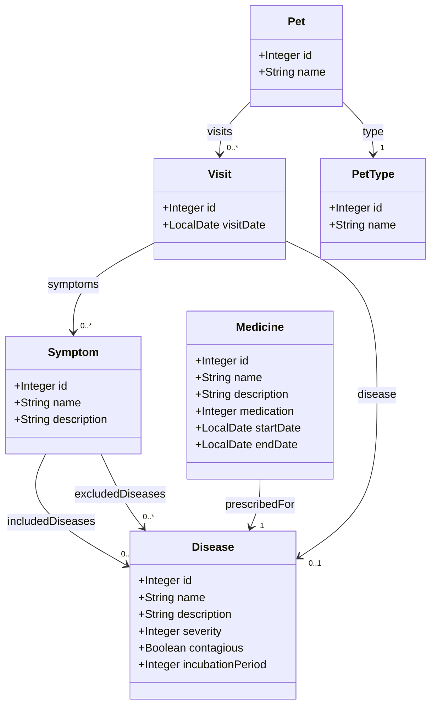
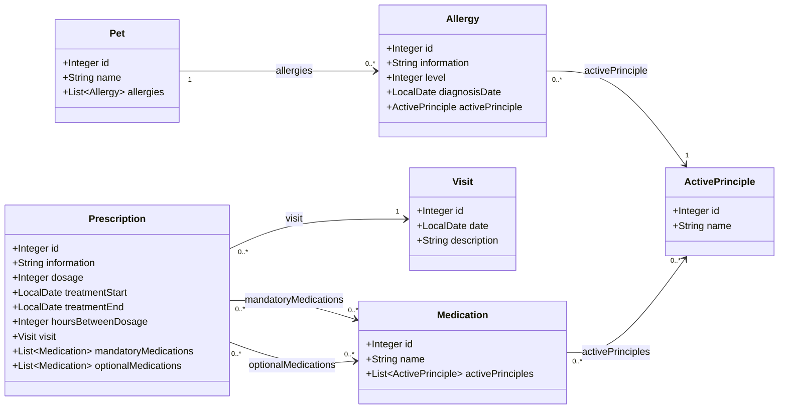

# CLASE COMÚN ReflexiveTest (CLASE CON LOS MÉTODOS A UTILIZAR POR LOS TESTS)

```java
package org.springframework.samples.petclinic;

import static org.junit.jupiter.api.Assertions.assertEquals;
import static org.junit.jupiter.api.Assertions.assertNotNull;
import static org.junit.jupiter.api.Assertions.assertThrows;
import static org.junit.jupiter.api.Assertions.assertTrue;
import static org.junit.jupiter.api.Assertions.fail;
import static org.junit.jupiter.api.Assumptions.assumeTrue;

import java.lang.reflect.Field;
import java.lang.reflect.InvocationTargetException;
import java.lang.reflect.Method;
import java.util.Arrays;
import java.util.Collection;
import java.util.List;
import java.util.Map;
import java.util.Set;

import org.junit.jupiter.api.AfterEach;
import org.junit.jupiter.api.BeforeEach;
import org.junit.jupiter.api.Test;
import org.springframework.format.annotation.DateTimeFormat;
import org.springframework.transaction.annotation.Transactional;

import jakarta.persistence.Entity;
import jakarta.persistence.EntityManager;
import jakarta.validation.ConstraintViolation;
import jakarta.validation.Validation;
import jakarta.validation.Validator;
import jakarta.validation.ValidatorFactory;

public abstract class ReflexiveTest {

    protected static final String LONGER_THAN_60_STRING = "En un lugar de la Mancha, de cuyo nombre no quiero acordarme, no ha mucho tiempo que vivía un hidalgo de los de lanza en astillero, adarga antigua, rocín flaco y galgo corredor. Una olla de algo más vaca que carnero, salpicón las más noches, duelos y quebrantos los sábados, lentejas los viernes, algún palomino de añadidura los domingos, consumían las tres partes de su hacienda.";

    public void checkThatFieldIsAnnotatedWithDateTimeFormat(Class aClass, String fieldname,String format){
        try{
            Field date=aClass.getDeclaredField(fieldname);
            DateTimeFormat dateformat=date.getAnnotation(DateTimeFormat.class);
            assertNotNull(dateformat, "The treatmentStart (date) property is not annotated with a DateTimeFormat");
            assertEquals(dateformat.pattern(),format);


        }catch(NoSuchFieldException ex){
            fail("The "+aClass.getName()+" class should have a field that is not present: "+ex.getMessage());
        }
    }

    public void checkThatFieldIsAnnotatedWith(Class aClass, String fieldname,Class annotationClass){
        try{
            Field myField=aClass.getDeclaredField(fieldname);
            Object annotation=myField.getAnnotation(annotationClass);
            assertNotNull(annotation,"The "+fieldname+" property is not properly annotated");
        }catch(NoSuchFieldException ex){
            fail("The "+aClass.getName()+" class should have a field that is not present: "+ex.getMessage());
        }
    }

    public boolean  isFieldAnnotatedWith(Class aClass, String fieldname,Class annotationClass) throws NoSuchFieldException, SecurityException{
        boolean result=false;
        Field myField=aClass.getDeclaredField(fieldname);
        Object annotation=myField.getAnnotation(annotationClass);
        result= (annotation == null);
        return result;
    }

    public boolean classIsAnnotatedWith(Class class1, Class class2) {
        return class1.getAnnotation(class2)!=null;
    }

    public boolean classHasMethod(Object targetObject, String methodName, Class<?> ... parameterTypes) {
        try {
            Method method = targetObject.getClass().getMethod(methodName, parameterTypes);
            return true;
        } catch (NoSuchMethodException e) {
            return false;
        }
    }

    public void checkThatFieldsAreMandatory(Object validEntity,EntityManager em,String ... fieldnames ){
        for(String fieldName:fieldnames)
            checkThatFieldIsMandatory(validEntity,fieldName,null,em);

    }
    public void checkThatFieldIsMandatory(Object validEntity,String fieldname,Class<?> type,EntityManager em){
        checkThatValueIsNotValid(validEntity, fieldname, null,type, em);
    }

    public void checkThatValuesAreNotValid(Object validEntity,Map<String,List<Object>> invalidValues,EntityManager em){
        for(String fieldName:invalidValues.keySet())
            for(Object invalidValue:invalidValues.get(fieldName))
                checkThatValueIsNotValid(validEntity, fieldName, invalidValue,null, em);
    }

    public void checkThatValueIsNotValid(Object validEntity,String fieldname,Object value,Class<?> type, EntityManager em){
        try{
            ValidatorFactory factory = Validation.buildDefaultValidatorFactory();
            Validator validator = factory.getValidator();
            assumeTrue(validator.validate(validEntity).isEmpty());
            Object originalValue=setValue(validEntity,fieldname,type,value);
            Set<ConstraintViolation<Object>> violations=validator.validate(validEntity);
            if(violations.isEmpty()){
                if(isEntity(validEntity.getClass())) {
                    assertThrows(Exception.class,() -> em.persist(validEntity),
                        "You are not constraining the "+fieldname+", since the value "+value+" was considered valid (and it should not be valid)");
                } else {
                    fail("You are not constraining the "+fieldname+", since the value "+value+" was considered valid (and it should not be valid)");
                }
            }
            setValue(validEntity,fieldname,type, originalValue);
        }catch (IllegalArgumentException e) {
            fail("The property "+fieldname+" of class "+validEntity.getClass().getName()+" was not modified: "+e.getMessage());
        }

    }

    public static Object setValue(Object object,String fieldname,Class<?> type, Object value){
            Field myField;
            Object originalValue=null;
            try {
                myField = object.getClass().getField(fieldname);
                myField.setAccessible(true);
                originalValue=myField.get(object);
                myField.set(object, value);
            } catch (NoSuchFieldException e) {
                // TODO Auto-generated catch block
                e.printStackTrace();
                originalValue=invokeMethodReflexively(object, generateGetterName(fieldname));
                Class[] paramTypes=generateParameterTypes(type,value,originalValue);
                invokeMethodReflexivelyWithParamTypes(object, generateSetterName(fieldname),paramTypes,value);
            } catch (IllegalArgumentException | SecurityException e) {
                fail("The property "+fieldname+" of class "+object.getClass().getName()+" was not modified: "+e.getMessage());
            } catch (IllegalAccessException e) {
                fail("The property "+fieldname+" of class "+object.getClass().getName()+" was not modified: "+e.getMessage());
            }
            return originalValue;
    }

    private static Class[] generateParameterTypes(Class type, Object value, Object originalValue) {
        Class[] paramTypes={type};
        if(type==null)
            paramTypes[0]= (value!=null?value.getClass():originalValue.getClass());
        return paramTypes;
    }

    private static String generateGetterName(String fieldname) {
        return "get"+fieldname.substring(0, 1).toUpperCase()+fieldname.substring(1);
    }

    private static String generateSetterName(String fieldname) {
        return "set"+fieldname.substring(0, 1).toUpperCase()+fieldname.substring(1);
    }

    public static Object invokeMethodReflexivelyWithParamTypes(Object targetObject, String methodName, Class<?>[] parameterTypes,
                                                            Object ... parameterValues) {
        Object result = null;
        Method method = null;
        try {
            method = targetObject.getClass().getMethod(methodName, parameterTypes);
            method.setAccessible(true);
            result = method.invoke(targetObject, parameterValues);
        } catch (NoSuchMethodException e) {
            fail(targetObject.getClass().getName() + " does not have a " + methodName + " method");
        } catch (SecurityException e) {
            fail(methodName + " method is not accessible in " + targetObject.getClass().getName());
        } catch (IllegalAccessException e) {
            fail(methodName + " method is not accessible in " + targetObject.getClass().getName());
        } catch (IllegalArgumentException e) {
            e.printStackTrace();
            fail("Invalid argument: " + e.getMessage());
        } catch (InvocationTargetException e) {
            fail(e.getMessage());
        }
        return result;
    }

    public static Object invokeMethodReflexively(Object o, String methodName, Object ... params){
        Object result=null;
        try {
            if(o!=null){
                Method method = o.getClass().getMethod(methodName);
                result = method.invoke(o,params);
            }else
                fail("The repository was not injected into the tests, its autowired value was null");
        } catch(NoSuchMethodException e) {
            fail("There is no method "+methodName+" in "+o.getClass().getName(), e);
        } catch (IllegalAccessException e) {
            fail("There is no public method "+methodName+" in "+o.getClass().getName(), e);
        } catch (IllegalArgumentException e) {
            fail("There is no method "+methodName+" in "+o.getClass().getName(), e);
        } catch (InvocationTargetException e) {
            fail("There is no method "+methodName+" in "+o.getClass().getName(), e);
        }
        return result;
    }

    public void checkLinkedById(Class myClass,Integer id1,String methodName,Integer id2,EntityManager em){
        Object o=em.find(myClass, id1);
        if(o==null)
            fail("Unable to find "+myClass.getName()+" with id:"+id1);
        else{
            Object o2=invokeMethodReflexively(o, methodName);
            if(o2==null)
                fail("The "+myClass.getName()+"with id:"+id1+"returned null when the method"+methodName+" was invoked");
            else{
                Integer actualId2=(Integer)invokeMethodReflexively(o2,"getId");
                if(actualId2!=null)
                    assertEquals(actualId2, id2,"The value of the id of the linked "+o2.getClass().getName()+" was "+actualId2+" but "+id2+" was expected!");
            }
        }
    }

    protected void checkContainsById(Class myClass, int id1, String methodName, int id2, EntityManager em) {
        Object o=em.find(myClass, id1);
        Integer actualId2=null;
        if(o==null)
            fail("Unable to find "+myClass.getName()+" with id:"+id1);
        else{
            Object o2=invokeMethodReflexively(o, methodName);
            if(o2==null)
                fail("The "+myClass.getName()+"with id:"+id1+"returned null when the method "+methodName+" was invoked");
            if(o2 instanceof Collection){
                for (Object  element : (Collection)o2) {
                    actualId2=(Integer)invokeMethodReflexively(element,"getId");
                    if(actualId2!=null && actualId2.equals(id2))
                        return;
                }
                fail("Id "+id2+"was not found in the id of the elements returned when "+methodName+" was invoked");
            }else
                fail("The "+myClass.getName()+"with id:"+id1+"did not return a Collection when the method"+methodName+" was invoked");
        }
    }


    public Object getFieldValueReflexively(Object o, String fieldName){
        Object result=null;
        try{
            Field myField=o.getClass().getField(fieldName);
            myField.setAccessible(true);
            result=myField.get(o);
        }catch(NoSuchFieldException ex){
            result=invokeMethodReflexively(o, generateGetterName(fieldName));
        } catch (IllegalArgumentException e) {
            fail("The property "+fieldName+" of class "+o.getClass().getName()+" was not modified: "+e.getMessage());
        } catch (IllegalAccessException e) {
            fail("The property "+fieldName+" of class "+o.getClass().getName()+" was not modified: "+e.getMessage());
        }
        return result;
    }

    public void checkTransactional(Class<?> myClass,String methodName, Class<?>... parameterTypes) {
        Method method=null;
        try {
            method = myClass.getDeclaredMethod(methodName, parameterTypes);
            Transactional transactionalAnnotation=method.getAnnotation(Transactional.class);
            assertNotNull(transactionalAnnotation,"The method "+methodName+" is not annotated as transactional");
        } catch (NoSuchMethodException e) {
            fail(myClass.getName()+" does not have a "+methodName+" method");
        } catch (SecurityException e) {
            fail(methodName+" method is not accessible in "+myClass.getName());
        }
    }

    public boolean isMethodAnnotatedWithTest(Method method) {
        Test test=method.getAnnotation(Test.class);
        return test!=null;
    }

    public boolean isMethodAnnotatedWithBeforeEach(Method method) {
        BeforeEach beforeEach=method.getAnnotation(BeforeEach.class);
        return beforeEach!=null;
    }

    public boolean isMethodAnnotatedWithAfterEach(Method method) {
        AfterEach afterEach=method.getAnnotation(AfterEach.class);
        return afterEach!=null;
    }

    public void checkTransactionalRollback(Class<?> myClass,String methodName,Class<?>[] paramTypes,Class<? extends Exception> exceptionClass) {
        Method save=null;
        try {
            save = myClass.getDeclaredMethod(methodName, paramTypes);
        } catch (NoSuchMethodException e) {
           fail("WatchService does not have a save method");
        } catch (SecurityException e) {
            fail("save method is not accessible in WatchService");
        }
        Transactional transactionalAnnotation=save.getAnnotation(Transactional.class);
        assertNotNull(transactionalAnnotation,"The method "+methodName+" is not annotated as transactional");
        List<Class<? extends Throwable>> exceptionsWithRollbackFor=Arrays.asList(transactionalAnnotation.rollbackFor());
        assertTrue(exceptionsWithRollbackFor.contains(exceptionClass));
    }

    public <T> boolean isEntity(Class<T> clazz) {
        return classIsAnnotatedWith(clazz, Entity.class);
    }
}

```

# EJEMPLOS PRINCIPALES. Fíjate principalmente en ellos y sigue su estructura.

## Examen PetClinic ExamCraft

## Enunciado

En este ejercicio, añadiremos la funcionalidad de gestión de eventos y competiciones para las mascotas organizadas por la clínica. Concretamente, se proporcionará una clase “Event” que representa los distintos eventos (como concursos de belleza, carreras de agilidad o jornadas de vacunación) que la clínica puede organizar. Esta clase incluirá atributos para especificar el tipo de evento, la fecha de realización, la ubicación donde se llevará a cabo, el número máximo de participantes permitidos y el coste de inscripción para cada mascota. Además, tendremos la clase “Participation” que registrará la inscripción de una mascota en un evento específico. Esta clase contendrá la fecha en la que se realizó el registro, así como la puntuación obtenida y la posición final de la mascota en dicho evento, si es aplicable. La clase Participation se relacionará con la mascota que se inscribe y con el evento al que asiste.

Las clases para las que realizaremos el mapeo objeto-relacional como entidades JPA se han señalado en rojo. Realizaremos una serie de ejercicios basados en funcionalidades que implementaremos en el sistema, y validaremos mediante pruebas unitarias.

classDiagram
direction LR
class NamedEntity {
+String name
}
class Person {
+String firstName
+String lastName
}
class Vet
class Owner {
+String address
+String city
}
class Specialty
class Pet {
+Date birthDate
+Double weight
}
class PetType
class Visit {
+Date date
+String description
}
class Event {
+String type
+Date date
+String location
+Integer maxParticipants
+Double cost
}
class Participation {
+LocalDate registeredOn
+Integer score
+Integer finalPosition
}
NamedEntity <|-- Pet
NamedEntity <|-- Specialty
NamedEntity <|-- PetType
NamedEntity <|-- Event
Person <|-- Vet
Person <|-- Owner
Owner "1" --> "0..n" Pet : owns
Vet "0..n" --> "0..1" Specialty
Visit "0..n" --> "1" Pet
Visit "0..n" --> "1" Vet
Pet "0..n" --> "1" PetType
Participation "0..n" --> "1" Pet
Participation "0..n" --> "1" Event

---

## Ejercicios a Resolver

### Test 1 – Restricciones de atributos

Modificar las clases “Event” y “Participation” para que sean entidades. Estas deben tener los siguientes atributos y restricciones:

**Para ambas clases:**

- El atributo de tipo entero (Integer) llamado “id” actuará como clave primaria en la tabla de la base de datos relacional asociada a la entidad.

**Para la clase Event:**

- Un atributo de tipo cadena de caracteres (String) llamado “name” obligatorio (no puede ser nulo), que debe tener una longitud mínima de 5 caracteres y máxima de 60 y que no puede estar formada por caracteres vacíos (espacios, tabuladores, etc.).
- El atributo de tipo cadena caracteres (String) llamado “type” obligatorio que únicamente podrá tomar cuatro valores: “BELLEZA”, “AGILIDAD”, “VACUNACION”, “ADOPCION”.
- El atributo de tipo fecha (LocalDate) llamado “date”, que representa la fecha en que se realiza el evento. Seguirá el formato “dd/MM/yyyy”. Este atributo debe ser obligatorio y se almacenará en la BD con el nombre de columna “event_date”.
- Un atributo de tipo cadena de caracteres (String) llamado “location” obligatorio (no puede ser nulo), que debe tener una longitud mínima de 5 caracteres y máxima de 100 y que no puede estar formada por caracteres vacíos (espacios, tabuladores, etc.).
- El atributo de tipo entero (Integer) llamado “maxParticipants”, que representa el número máximo de mascotas que pueden inscribirse en el evento. Este atributo será obligatorio y tendrá un valor mínimo de 2 y un valor máximo de 1000.
- El atributo de tipo doble (Double) llamado “cost”, que representa el coste de inscripción para cada mascota. Este atributo será obligatorio y tendrá un valor mínimo de 0.01 y un valor máximo de 500.0.

**Para la clase Participation:**

- El atributo de tipo fecha (LocalDate) llamado “registeredOn”, que representa la fecha en que la mascota se registra en el evento, seguirá el formato “dd/MM/yyyy”. Este atributo debe ser obligatorio. En la base de datos se almacenará con el nombre de columna “registration_date”.
- El atributo de tipo entero (Integer) llamado “score”, que representa la puntuación obtenida por la mascota en el evento. Este atributo es opcional, y debe estar en el rango de valores de 0 a 100, ambos inclusive.
- El atributo de tipo entero (Integer) llamado “finalPosition”, que representa la posición final de la mascota en el evento. Este atributo es opcional, y tendrá un valor mínimo de 1 y un valor máximo de 999.

No modifique por ahora las anotaciones @Transient de las clases. Modificar las interfaces “EventRepository” y “ParticipationRepository” alojada en el mismo paquete para que extienda a CrudRepository.

**Código del Test:**

```java
package org.springframework.samples.petclinic;

import org.springframework.samples.petclinic.event.Event;
import org.springframework.samples.petclinic.event.EventRepository;
import org.springframework.samples.petclinic.participation.Participation;
import org.springframework.samples.petclinic.participation.ParticipationRepository;
import org.springframework.samples.petclinic.pet.Pet;
import org.springframework.samples.petclinic.owner.Owner;
import org.springframework.samples.petclinic.pet.PetType;
import org.springframework.samples.petclinic.user.UserService;
import org.junit.jupiter.api.Test;
import org.springframework.beans.factory.annotation.Autowired;
import org.springframework.boot.test.autoconfigure.orm.jpa.DataJpaTest;
import org.springframework.boot.test.mock.mockito.MockBean;
import org.springframework.context.annotation.ComponentScan;
import org.springframework.data.repository.CrudRepository;

import jakarta.persistence.EntityManager;
import jakarta.persistence.Entity;
import jakarta.persistence.Id;
import jakarta.persistence.GeneratedValue;
import jakarta.persistence.Column;
import jakarta.validation.constraints.NotNull;
import jakarta.validation.constraints.NotBlank;
import jakarta.validation.constraints.Size;
import jakarta.validation.constraints.Min;
import jakarta.validation.constraints.Max;
import jakarta.validation.constraints.Pattern;

import java.time.LocalDate;
import java.util.Map;
import java.util.Arrays;
import java.util.List;

import static org.junit.jupiter.api.Assertions.assertNotNull;
import static org.junit.jupiter.api.Assertions.assertTrue;
import static org.junit.jupiter.api.Assertions.assertDoesNotThrow;
import static org.assertj.core.api.Assertions.assertThat;

@DataJpaTest
@ComponentScan(basePackages = {"org.springframework.samples.petclinic.event", "org.springframework.samples.petclinic.participation", "org.springframework.samples.petclinic.pet", "org.springframework.samples.petclinic.owner"})
class Test1 extends ReflexiveTest {

    @Autowired
    private EventRepository eventRepository;

    @Autowired
    private ParticipationRepository participationRepository;

    @Autowired
    private EntityManager entityManager;

    @MockBean
    private UserService userService;

    @Test
    void test1RepositoriesExist() {
        assertNotNull(eventRepository, "The EventRepository should not be null.");
        assertNotNull(participationRepository, "The ParticipationRepository should not be null.");
        test1RepositoriesContainsMethod();
    }

    void test1RepositoriesContainsMethod() {
        assertThat(eventRepository).isInstanceOf(CrudRepository.class);
        assertThat(participationRepository).isInstanceOf(CrudRepository.class);
    }

    @Test
    void test1CheckEventConstraints() {
        Event validEvent = createValidEvent(entityManager);

        checkThatFieldsAreMandatory(validEvent, entityManager, "name", "type", "date", "location", "maxParticipants", "cost");

        Map<String, List<Object>> invalidValues = Map.of(
            "name", Arrays.asList("", "a", "aaaa", "a".repeat(61)),
            "type", Arrays.asList("INVALID"),
            "date", Arrays.asList((LocalDate) null),
            "location", Arrays.asList("", "loca", "l".repeat(101)),
            "maxParticipants", Arrays.asList(1, 1001),
            "cost", Arrays.asList(-1.0, 500.01)
        );
        checkThatValuesAreNotValid(validEvent, invalidValues, entityManager);
    }

    @Test
    void test1CheckParticipationConstraints() {
        Participation validParticipation = createValidParticipation(entityManager);

        checkThatFieldsAreMandatory(validParticipation, entityManager, "registeredOn");

        Map<String, List<Object>> invalidValues = Map.of(
            "registeredOn", Arrays.asList((LocalDate) null),
            "score", Arrays.asList(-1, 101),
            "finalPosition", Arrays.asList(0, 1000)
        );
        checkThatValuesAreNotValid(validParticipation, invalidValues, entityManager);
    }

    @Test
    void test1CheckEventAnnotations() {
        assertTrue(classIsAnnotatedWith(Event.class, Entity.class));

        checkThatFieldIsAnnotatedWith(Event.class, "id", Id.class);
        checkThatFieldIsAnnotatedWith(Event.class, "id", GeneratedValue.class);

        checkThatFieldIsAnnotatedWith(Event.class, "name", NotNull.class);
        checkThatFieldIsAnnotatedWith(Event.class, "name", NotBlank.class);
        checkThatFieldIsAnnotatedWith(Event.class, "name", Size.class);

        checkThatFieldIsAnnotatedWith(Event.class, "type", NotNull.class);
        checkThatFieldIsAnnotatedWith(Event.class, "type", Pattern.class);

        checkThatFieldIsAnnotatedWith(Event.class, "date", NotNull.class);
        checkThatFieldIsAnnotatedWith(Event.class, "date", Column.class);

        checkThatFieldIsAnnotatedWith(Event.class, "location", NotNull.class);
        checkThatFieldIsAnnotatedWith(Event.class, "location", NotBlank.class);
        checkThatFieldIsAnnotatedWith(Event.class, "location", Size.class);

        checkThatFieldIsAnnotatedWith(Event.class, "maxParticipants", NotNull.class);
        checkThatFieldIsAnnotatedWith(Event.class, "maxParticipants", Min.class);
        checkThatFieldIsAnnotatedWith(Event.class, "maxParticipants", Max.class);

        checkThatFieldIsAnnotatedWith(Event.class, "cost", NotNull.class);
        checkThatFieldIsAnnotatedWith(Event.class, "cost", Min.class);
        checkThatFieldIsAnnotatedWith(Event.class, "cost", Max.class);
    }

    @Test
    void test1CheckParticipationAnnotations() {
        assertTrue(classIsAnnotatedWith(Participation.class, Entity.class));

        checkThatFieldIsAnnotatedWith(Participation.class, "id", Id.class);
        checkThatFieldIsAnnotatedWith(Participation.class, "id", GeneratedValue.class);

        checkThatFieldIsAnnotatedWith(Participation.class, "registeredOn", NotNull.class);
        checkThatFieldIsAnnotatedWith(Participation.class, "registeredOn", Column.class);

        checkThatFieldIsAnnotatedWith(Participation.class, "score", Min.class);
        checkThatFieldIsAnnotatedWith(Participation.class, "score", Max.class);

        checkThatFieldIsAnnotatedWith(Participation.class, "finalPosition", Min.class);
        checkThatFieldIsAnnotatedWith(Participation.class, "finalPosition", Max.class);
    }

    public static Event createValidEvent(EntityManager em) {
        Event event = new Event();
        setValue(event, "name", String.class, "Annual Dog Show");
        setValue(event, "type", String.class, "BELLEZA");
        setValue(event, "date", LocalDate.class, LocalDate.now().plusDays(7));
        setValue(event, "location", String.class, "City Park Amphitheater");
        setValue(event, "maxParticipants", Integer.class, 100);
        setValue(event, "cost", Double.class, 25.0);
        return event;
    }

    private Participation createValidParticipation(EntityManager em) {

        PetType type = new PetType();
        setValue(type, "name", String.class, "dog");
        em.persist(type);

        Owner owner = new Owner();
        setValue(owner, "firstName", String.class, "Test");
        setValue(owner, "lastName", String.class, "User");
        setValue(owner, "address", String.class, "123 Street");
        setValue(owner, "city", String.class, "Sevilla");
        setValue(owner, "telephone", String.class, "123456789");
        em.persist(owner);

        Pet pet = new Pet();
        setValue(pet, "name", String.class, "Leo");
        setValue(pet, "birthDate", LocalDate.class, LocalDate.now());
        setValue(pet, "type", PetType.class, type);
        setValue(pet, "owner", Owner.class, owner);
        em.persist(pet);

        Event event = new Event();
        setValue(event, "name", String.class, "Concurso Agility");
        setValue(event, "type", String.class, "AGILIDAD");
        setValue(event, "date", LocalDate.class, LocalDate.now().plusDays(10));
        setValue(event, "location", String.class, "Parque Central");
        setValue(event, "maxParticipants", Integer.class, 20);
        setValue(event, "cost", Double.class, 10.0);
        em.persist(event);

        Participation participation = new Participation();
        setValue(participation, "registeredOn", LocalDate.class, LocalDate.now());
        setValue(participation, "score", Integer.class, 0);
        setValue(participation, "finalPosition", Integer.class, 1);
        setValue(participation, "pet", Pet.class, pet);
        setValue(participation, "event", Event.class, event);

        return participation;
    }

    @Test
    void test1ValidEventIsPersisted() {
        Event event = createValidEvent(entityManager);
        assertDoesNotThrow(() -> eventRepository.save(event), "Saving a valid Event should not throw an exception.");
        entityManager.flush();
    }

    @Test
    void test1ValidParticipationIsPersisted() {
        Participation participation = createValidParticipation(entityManager);
        assertDoesNotThrow(() -> participationRepository.save(participation), "Saving a valid Participation should not throw an exception.");
        entityManager.flush();
    }
}
```

### Test 2 – Relaciones entre las entidades

Elimine las anotaciones @Transient de los métodos y atributos que las tengan en las entidades creadas en el ejercicio anterior. Se pide crear las siguientes relaciones entre las entidades:

Cree una relación unidireccional desde “Participation” hacia “Pet” que exprese la que aparece en el diagrama UML (mostrado en la primera página de este enunciado) respetando sus cardinalidades, usando el atributo “pet” en la clase “Participation”. Debe asegurarse de que la relación expresa adecuadamente la cardinalidad que muestra el diagrama UML, por ejemplo, el atributo `pet` no puede ser nulo, puesto que la cardinalidad es 1 en el extremo de `Pet`.

Además, se pide crear una relación unidireccional desde “Participation” hacia “Event” que represente la que aparece en el diagrama UML, tenga en cuenta la cardinalidad que tiene, usando el atributo “event” en la clase “Participation”. Debe asegurarse de que la relación expresa adecuadamente la cardinalidad que muestra el diagrama UML, por ejemplo, el atributo `event` no puede ser nulo, puesto que la cardinalidad es 1 en el extremo de `Event`.

**Código del Test:**

```java
package org.springframework.samples.petclinic;

import org.springframework.boot.test.autoconfigure.orm.jpa.DataJpaTest;
import org.springframework.boot.test.mock.mockito.MockBean;
import org.springframework.context.annotation.ComponentScan;
import org.springframework.beans.factory.annotation.Autowired;
import org.junit.jupiter.api.Test;

import jakarta.persistence.EntityManager;
import jakarta.persistence.ManyToOne;

import org.springframework.samples.petclinic.event.Event;
import org.springframework.samples.petclinic.participation.Participation;
import org.springframework.samples.petclinic.pet.Pet;
import org.springframework.samples.petclinic.user.UserService;

import java.time.LocalDate;

@DataJpaTest(properties = {
    "spring.jpa.hibernate.ddl-auto=create-drop",
    "spring.test.database.replace=none",
    "spring.datasource.url=jdbc:h2:mem:petclinic"
})
@ComponentScan(basePackages = {
    "org.springframework.samples.petclinic.event",
    "org.springframework.samples.petclinic.participation",
    "org.springframework.samples.petclinic.pet",
    "org.springframework.samples.petclinic.model"
})
public class Test2 extends ReflexiveTest {

    @Autowired(required = false)
    protected EntityManager em;

    @MockBean
    private UserService userService;

    @Test
    public void test2ParticipationAnnotations() {
        checkThatFieldIsAnnotatedWith(Participation.class, "pet", ManyToOne.class);
        checkThatFieldIsAnnotatedWith(Participation.class, "event", ManyToOne.class);
    }

    @Test
    public void test2ParticipationConstraints() {
        Pet pet = new Pet();
        setValue(pet, "name", String.class, "Buddy");
        setValue(pet, "birthDate", LocalDate.class, LocalDate.now().minusYears(1));

        Event event = new Event();
        setValue(event, "name", String.class, "Spring Festival");
        setValue(event, "type", String.class, "Festival");
        setValue(event, "date", LocalDate.class, LocalDate.now().plusMonths(1));
        setValue(event, "location", String.class, "Park");
        setValue(event, "maxParticipants", Integer.class, 100);
        setValue(event, "cost", Double.class, 10.0);

        Participation participation = new Participation();
        setValue(participation, "registeredOn", LocalDate.class, LocalDate.now());
        setValue(participation, "pet", Pet.class, pet);
        setValue(participation, "event", Event.class, event);

        checkThatFieldsAreMandatory(participation, em, "pet", "event");
    }
}
```

## Examen Chess ExamCraft

## Enunciado

En este ejercicio, añadiremos la funcionalidad de gestión del sistema de puntuación ELO para los jugadores. Concretamente, se proporcionará una clase `User` que representa a los usuarios del sistema. Los jugadores, al participar en partidas de ajedrez, verán sus puntuaciones ELO actualizadas. Para gestionar esto, tendremos la clase `Rating`, que almacenará la puntuación ELO actual de un jugador. Esta clase incluirá el atributo `score` para la puntuación numérica del jugador y `lastUpdate` para registrar la fecha de la última modificación de dicha puntuación. Además, contaremos con la clase `RatingChange` para llevar un registro histórico de cada ajuste en la puntuación ELO. `RatingChange` tendrá un atributo `changeAmount` que indicará la variación de puntos (positiva o negativa) y `changeDate` para el momento exacto en que se produjo dicho cambio.

Las relaciones entre estas entidades son las siguientes: cada `User` tendrá una única instancia de `Rating` que representa su puntuación actual. A su vez, cada `Rating` estará asociado a múltiples `RatingChange`, documentando la evolución de la puntuación del jugador. Finalmente, cada `RatingChange` se vinculará a la `ChessMatch` específica que motivó dicho ajuste de puntos.

Realizaremos una serie de ejercicios basados en funcionalidades que implementaremos en el sistema, y validaremos mediante pruebas unitarias.

classDiagram
direction LR
class BaseEntity {
+Int id
}
class Authorities {
+String authority "NotBlank"
}
class User {
+String username "Lenght(4,50)"
+String password "Lenght(8,50)"
}
class NamedEntity {
+String name "NotBlank"
}
class ChessMatch {
+LocalDateTime start
+LocalDateTime finish
+ChessMatchType type
+Long turnDuration
}
class ChessBoard {
+Boolean creatorTurn
+LocalDateTime currentTurnStart
+Boolean jaque
}
class Piece {
+PieceColor color
+PieceType type
+Integer xPosition
+Integer yPosition
}
class Rating {
+Integer score
+LocalDate lastUpdate
}
class RatingChange {
+Integer changeAmount
+LocalDate changeDate
}
BaseEntity <|-- Authorities
BaseEntity <|-- NamedEntity
NamedEntity <|-- ChessMatch
Authorities "0..n" --> User
ChessMatch "1" _ --> "1" ChessBoard
ChessMatch "0..n" --> "1" User : creator
ChessMatch "0..n" --> "1" User : opponent
ChessBoard "1" _ --> "0..n" Piece
User "1" --> "1" Rating
Rating "1" <-- "0..n" RatingChange
RatingChange "0..n" --> "1" ChessMatch

---

## Ejercicios a Resolver

### Test 1 – Restricciones de atributos

Modificar las clases “Rating” y “RatingChange” para que sean entidades. Estas deben tener los siguientes atributos y restricciones:

**Para ambas clases:**

- El atributo de tipo entero (Integer) llamado “id” actuará como clave primaria en la tabla de la base de datos relacional asociada a la entidad.

**Para la clase Rating:**

- Un atributo de tipo entero (Integer) llamado “score”, que representa la puntuación ELO actual del jugador. Este atributo será obligatorio (no puede ser nulo) y tendrá un valor mínimo de 0 y un valor máximo de 3000.
- Un atributo de tipo fecha (LocalDate) llamado “lastUpdate”, que representa la fecha de la última actualización de la puntuación ELO del jugador. Este atributo debe ser obligatorio y seguirá el formato “dd/MM/yyyy” (puede usar como ejemplo la clase Pet y su fecha de nacimiento para ver cómo se especificar dicho formato, pero nótese que el patrón del formato es distinto).

**Para la clase RatingChange:**

- Un atributo de tipo entero (Integer) llamado “changeAmount”, que indica la variación de puntos ELO (positiva o negativa) que se ha producido. Este atributo será obligatorio (no puede ser nulo) y tendrá un valor mínimo de -200 y un valor máximo de 200.
- Un atributo de tipo fecha (LocalDate) llamado “changeDate”, que representa la fecha exacta en que se registró el cambio de puntuación. Este atributo debe ser obligatorio y seguirá el formato “dd/MM/yyyy” (puede usar como ejemplo la clase Pet y su fecha de nacimiento para ver cómo se especificar dicho formato, pero nótese que el patrón del formato es distinto).

No modifique por ahora las anotaciones @Transient de las clases. Modificar las interfaces “RatingRepository” y “RatingChangeRepository” alojada en el mismo paquete para que extienda a CrudRepository.

**Código del Test:**

```java
package es.us.dp1.chess.tournament;

import es.us.dp1.chess.tournament.match.ChessMatch;
import es.us.dp1.chess.tournament.rating.Rating;
import es.us.dp1.chess.tournament.rating.RatingRepository;
import es.us.dp1.chess.tournament.ratingchange.RatingChange;
import es.us.dp1.chess.tournament.ratingchange.RatingChangeRepository;
import es.us.dp1.chess.tournament.user.Authorities;
import es.us.dp1.chess.tournament.user.User;
import es.us.dp1.chess.tournament.user.UserService;
import jakarta.persistence.Entity;
import jakarta.persistence.EntityManager;
import jakarta.persistence.GeneratedValue;
import jakarta.persistence.GenerationType;
import jakarta.persistence.Id;
import jakarta.validation.constraints.Max;
import jakarta.validation.constraints.Min;
import jakarta.validation.constraints.NotNull;
import org.junit.jupiter.api.Test;
import org.springframework.beans.factory.annotation.Autowired;
import org.springframework.boot.test.autoconfigure.orm.jpa.DataJpaTest;
import org.springframework.boot.test.autoconfigure.orm.jpa.TestEntityManager;
import org.springframework.boot.test.mock.mockito.MockBean;
import org.springframework.context.annotation.ComponentScan;
import org.springframework.data.repository.CrudRepository;
import org.springframework.transaction.annotation.Transactional;

import java.time.LocalDate;
import java.util.List;
import java.util.Map;
import java.util.Optional;
import java.lang.reflect.Field;

import static org.junit.jupiter.api.Assertions.*;

@DataJpaTest(properties = {
    "spring.sql.init.mode=never"
})
@ComponentScan(basePackages = {"es.us.dp1.chess.tournament.rating", "es.us.dp1.chess.tournament.ratingchange", "es.us.dp1.chess.tournament.user"})
@Transactional
public class Test1 extends ReflexiveTest {

    @Autowired
    private RatingRepository ratingRepository;

    @Autowired
    private RatingChangeRepository ratingChangeRepository;

    @Autowired
    private TestEntityManager tem;

    @MockBean
    private UserService userService;

    @Test
    void test1RepositoriesExist() {
        assertNotNull(ratingRepository, "RatingRepository should be autowired");
        assertNotNull(ratingChangeRepository, "RatingChangeRepository should be autowired");
        test1RepositoriesContainsMethod();
    }

    void test1RepositoriesContainsMethod() {
        assertTrue(
            CrudRepository.class.isAssignableFrom(RatingRepository.class),
            "RatingRepository should extend CrudRepository"
        );
        assertTrue(
            CrudRepository.class.isAssignableFrom(RatingChangeRepository.class),
            "RatingChangeRepository should extend CrudRepository"
        );
    }

    @Test
    void test1CheckRatingConstraints() {
        Rating validRating = createValidRating(tem.getEntityManager());

        checkThatFieldsAreMandatory(validRating, tem.getEntityManager(), "score", "lastUpdate");

        Rating r1 = createValidRating(tem.getEntityManager());
        checkThatValuesAreNotValid(r1, Map.of("score", List.of(-1)), tem.getEntityManager());

        Rating r2 = createValidRating(tem.getEntityManager());
        checkThatValuesAreNotValid(r2, Map.of("score", List.of(3001)), tem.getEntityManager());
    }

    @Test
    void test1CheckRatingAnnotations() {
        assertTrue(classIsAnnotatedWith(Rating.class, Entity.class),
            "Rating should be annotated with @Entity");

        checkThatFieldIsAnnotatedWith(Rating.class, "id", Id.class);
        checkThatFieldIsAnnotatedWith(Rating.class, "id", GeneratedValue.class);
        assertDoesNotThrow(() -> {
            Field idField = Rating.class.getDeclaredField("id");
            GeneratedValue gv = idField.getAnnotation(GeneratedValue.class);
            assertNotNull(gv, "id should have @GeneratedValue");
            assertEquals(GenerationType.IDENTITY, gv.strategy(), "id @GeneratedValue strategy should be IDENTITY");;
        });

        checkThatFieldIsAnnotatedWith(Rating.class, "score", NotNull.class);
        checkThatFieldIsAnnotatedWith(Rating.class, "score", Min.class);
        assertDoesNotThrow(() -> {
            Field scoreField = Rating.class.getDeclaredField("score");
            Min min = scoreField.getAnnotation(Min.class);
            assertNotNull(min, "score should have @Min");
            assertEquals(0L, min.value(), "score @Min value should be 0");
            Max max = scoreField.getAnnotation(Max.class);
            assertNotNull(max, "score should have @Max");
            assertEquals(3000L, max.value(), "score @Max value should be 3000");
        });
        checkThatFieldIsAnnotatedWith(Rating.class, "score", Max.class);

        checkThatFieldIsAnnotatedWith(Rating.class, "lastUpdate", NotNull.class);
        checkThatFieldIsAnnotatedWithDateTimeFormat(Rating.class, "lastUpdate", "dd/MM/yyyy");
    }

    @Test
    void test1ValidRatingIsPersisted() {
        Rating rating = createValidRating(tem.getEntityManager());
        assertDoesNotThrow(() -> {
            ratingRepository.save(rating);
            tem.flush();
        }, "Valid Rating should be persisted without throwing exceptions");
        assertNotNull(rating.getId(), "Persisted Rating should have an ID");
        Optional<Rating> foundRating = ratingRepository.findById(rating.getId());
        assertTrue(foundRating.isPresent(), "Persisted Rating should be retrievable");
    }


    @Test
    void test1CheckRatingChangeConstraints() {
        RatingChange validRatingChange = createValidRatingChange(tem.getEntityManager());

        checkThatFieldsAreMandatory(validRatingChange, tem.getEntityManager(), "changeAmount", "changeDate");

        RatingChange rc1 = createValidRatingChange(tem.getEntityManager());
        checkThatValuesAreNotValid(rc1, Map.of("changeAmount", List.of(-201)), tem.getEntityManager());

        RatingChange rc2 = createValidRatingChange(tem.getEntityManager()  );
        checkThatValuesAreNotValid(rc2, Map.of("changeAmount", List.of(201)), tem.getEntityManager());
    }

    @Test
    void test1CheckRatingChangeAnnotations() {
        assertTrue(classIsAnnotatedWith(RatingChange.class, Entity.class),
            "RatingChange should be annotated with @Entity");

        checkThatFieldIsAnnotatedWith(RatingChange.class, "id", Id.class);
        checkThatFieldIsAnnotatedWith(RatingChange.class, "id", GeneratedValue.class);
        assertDoesNotThrow(() -> {
            Field idField = RatingChange.class.getDeclaredField("id");
            GeneratedValue gv = idField.getAnnotation(GeneratedValue.class);
            assertNotNull(gv, "id should have @GeneratedValue");
            assertEquals(GenerationType.IDENTITY, gv.strategy(), "id @GeneratedValue strategy should be IDENTITY");
        });

        checkThatFieldIsAnnotatedWith(RatingChange.class, "changeAmount", NotNull.class);
        checkThatFieldIsAnnotatedWith(RatingChange.class, "changeAmount", Min.class);
        assertDoesNotThrow(() -> {
            Field changeAmountField = RatingChange.class.getDeclaredField("changeAmount");
            Min min = changeAmountField.getAnnotation(Min.class);
            assertNotNull(min, "changeAmount should have @Min");
            assertEquals(-200L, min.value(), "changeAmount @Min value should be -200");
            Max max = changeAmountField.getAnnotation(Max.class);
            assertNotNull(max, "changeAmount should have @Max");
            assertEquals(200L, max.value(), "changeAmount @Max value should be 200");
        });
        checkThatFieldIsAnnotatedWith(RatingChange.class, "changeAmount", Max.class);

        checkThatFieldIsAnnotatedWith(RatingChange.class, "changeDate", NotNull.class);
        checkThatFieldIsAnnotatedWithDateTimeFormat(RatingChange.class, "changeDate", "dd/MM/yyyy");
    }

    @Test
    void test1ValidRatingChangeIsPersisted() {
        Rating rating = createValidRating(tem.getEntityManager());
        Authorities auth = createValidAuthorities(tem.getEntityManager());
        User creator = new User();
        setValue(creator, "rating", Rating.class, createValidRating(tem.getEntityManager()));
        setValue(creator, "authority", Authorities.class, auth);
        setValue(creator, "username", String.class, "matchcreator");
        setValue(creator, "password", String.class, "pass");
        tem.persist(creator);

        ChessMatch match = new ChessMatch();
        setValue(match, "name", String.class, "Test Match");
        setValue(match, "creator", User.class, creator);
        tem.persist(match);

        RatingChange ratingChange = new RatingChange();
        setValue(ratingChange, "changeAmount", Integer.class, 10);
        setValue(ratingChange, "changeDate", LocalDate.class, LocalDate.of(2023, 1, 16));
        setValue(ratingChange, "rating", Rating.class, rating);
        setValue(ratingChange, "chessMatch", ChessMatch.class, match);

        assertDoesNotThrow(() -> {
            ratingChangeRepository.save(ratingChange);
            tem.flush();
        }, "Valid RatingChange should be persisted without throwing exceptions");
        assertNotNull(ratingChange.getId(), "Persisted RatingChange should have an ID");
        Optional<RatingChange> foundRatingChange = ratingChangeRepository.findById(ratingChange.getId());
        assertTrue(foundRatingChange.isPresent(), "Persisted RatingChange should be retrievable");
    }

    static Authorities createValidAuthorities(EntityManager em) {
        Authorities authorities = new Authorities();
        setValue(authorities, "authority", String.class, "PLAYER");
        if (em != null) em.persist(authorities);
        return authorities;
    }

    static Rating createValidRating(EntityManager em) {
        Rating rating = new Rating();
        setValue(rating, "score", Integer.class, 1500);
        setValue(rating, "lastUpdate", LocalDate.class, LocalDate.of(2023, 1, 15));
        if (em != null) em.persist(rating);
        return rating;
    }

    static User createValidUser(EntityManager em) {
        User user = new User();
        setValue(user, "rating", Rating.class, createValidRating(em));
        setValue(user, "authority", Authorities.class, createValidAuthorities(em));
        setValue(user, "username", String.class, "testuser");
        setValue(user, "password", String.class, "testpass");
        return user;
    }

    static ChessMatch createValidChessMatch(EntityManager em) {
        ChessMatch match = new ChessMatch();
        setValue(match, "name", String.class, "Test Match");
        User creator = createValidUser(em);
        setValue(match, "creator", User.class, creator);
        return match;
    }

    static RatingChange createValidRatingChange(EntityManager em) {
        RatingChange ratingChange = new RatingChange();
        setValue(ratingChange, "changeAmount", Integer.class, 10);
        setValue(ratingChange, "changeDate", LocalDate.class, LocalDate.of(2023, 1, 16));
        setValue(ratingChange, "rating", Rating.class, createValidRating(em));
        setValue(ratingChange, "chessMatch", ChessMatch.class, createValidChessMatch(em));
        return ratingChange;
    }
}
```

### Test 2 – Relaciones entre las entidades

Elimine las anotaciones @Transient de los métodos y atributos que las tengan en las entidades creadas en el ejercicio anterior. Se pide crear las siguientes relaciones entre las entidades:

Cree una relación unidireccional desde “User” hacia “Rating” que exprese la que aparece en el diagrama UML (mostrado en la primera página de este enunciado) respetando sus cardinalidades, usando el atributo “rating” de la clase “User”.

Además, se pide crear dos relaciones unidireccionales desde “RatingChange” hacia “Rating” y hacia “ChessMatch” que representen las que aparecen en el diagrama UML, tenga en cuenta la cardinalidad que tienen (recuerde que en este caso, se tratan de relaciones de 0..n a 1), usando como nombre de los atributos “rating” y “chessMatch” en la clase “RatingChange”, correspondientemente. Debe asegurarse de que las relaciones expresan adecuadamente la cardinalidad que muestra el diagrama UML, por ejemplo, algunos atributos pueden ser nulos puesto que la cardinalidad es 0..n pero otros no, porque su cardinalidad en el extremo navegable de la relación es 1..n.

**Código del Test:**

```java
package es.us.dp1.chess.tournament;

import es.us.dp1.chess.tournament.user.Authorities;
import es.us.dp1.chess.tournament.user.User;
import es.us.dp1.chess.tournament.user.UserService;
import es.us.dp1.chess.tournament.match.ChessMatch;
import es.us.dp1.chess.tournament.rating.Rating;
import es.us.dp1.chess.tournament.ratingchange.RatingChange;

import jakarta.persistence.EntityManager;
import jakarta.persistence.OneToOne;
import jakarta.persistence.ManyToOne;
import jakarta.persistence.JoinColumn;

import java.time.LocalDate;

import org.junit.jupiter.api.Test;
import org.springframework.beans.factory.annotation.Autowired;
import org.springframework.boot.test.autoconfigure.orm.jpa.DataJpaTest;
import org.springframework.boot.test.mock.mockito.MockBean;
import org.springframework.context.annotation.ComponentScan;

@DataJpaTest(properties = {
    "spring.sql.init.mode=never"
})
@ComponentScan(basePackages = {
    "es.us.dp1.chess.tournament.rating",
    "es.us.dp1.chess.tournament.ratingchange"
})
public class Test2 extends ReflexiveTest {

    @Autowired(required = false)
    protected EntityManager em;

    @MockBean
    private UserService userService;


    @Test
    public void test2UserAnnotations() {
        checkThatFieldIsAnnotatedWith(User.class, "rating", OneToOne.class);
        checkThatFieldIsAnnotatedWith(User.class, "rating", JoinColumn.class);
    }

    @Test
    public void test2RatingChangeAnnotations() {
        checkThatFieldIsAnnotatedWith(RatingChange.class, "rating", ManyToOne.class);
        checkThatFieldIsAnnotatedWith(RatingChange.class, "rating", JoinColumn.class);

        checkThatFieldIsAnnotatedWith(RatingChange.class, "chessMatch", ManyToOne.class);
        checkThatFieldIsAnnotatedWith(RatingChange.class, "chessMatch", JoinColumn.class);
    }


    @Test
    public void test2UserConstraints() {
        User user = createValidUser(em);

        checkThatFieldsAreMandatory(user, em, "rating");
    }

    @Test
    public void test2RatingChangeConstraints() {
        RatingChange ratingChange = createValidRatingChange(em);

        checkThatFieldsAreMandatory(ratingChange, em, "rating");
        checkThatFieldsAreMandatory(ratingChange, em, "chessMatch");
    }

    static Authorities createValidAuthorities(EntityManager em) {
        Authorities authorities = new Authorities();
        setValue(authorities, "authority", String.class, "PLAYER");
        if (em != null) em.persist(authorities);
        return authorities;
    }

    static Rating createValidRating(EntityManager em) {
        Rating rating = new Rating();
        setValue(rating, "score", Integer.class, 1500);
        setValue(rating, "lastUpdate", LocalDate.class, LocalDate.of(2023, 1, 15));
        if (em != null) em.persist(rating);
        return rating;
    }

    static User createValidUser(EntityManager em) {
        User user = new User();
        setValue(user, "rating", Rating.class, createValidRating(em));
        setValue(user, "authority", Authorities.class, createValidAuthorities(em));
        setValue(user, "username", String.class, "testuser");
        setValue(user, "password", String.class, "testpass");
        return user;
    }

    static ChessMatch createValidChessMatch(EntityManager em) {
        ChessMatch match = new ChessMatch();
        setValue(match, "name", String.class, "Test Match");
        User creator = createValidUser(em);
        setValue(match, "creator", User.class, creator);
        return match;
    }

    static RatingChange createValidRatingChange(EntityManager em) {
        RatingChange ratingChange = new RatingChange();
        setValue(ratingChange, "changeAmount", Integer.class, 10);
        setValue(ratingChange, "changeDate", LocalDate.class, LocalDate.of(2023, 1, 16));
        setValue(ratingChange, "rating", Rating.class, createValidRating(em));
        setValue(ratingChange, "chessMatch", ChessMatch.class, createValidChessMatch(em));
        return ratingChange;
    }
}
```

# Control práctico de DP1 2024-2025 (Segunda Convocatoria Julio 2025)

## Enunciado

En este ejercicio, añadiremos la funcionalidad de gestión de desafíos para una implementación del juego del ajedrez. Concretamente, se proporciona una clase `ChessMatch` que representa las partidas que se juegan, y que tiene asociada una instancia de la clase `ChessBoard` que representa el estado del tablero para dicha partida, por lo que tendrá asociada un conjunto de instancias de la clase `Piece`.

Además, tendremos la clase `Challenge`, que representa a un desafío acotado en el tiempo, por ejemplo "ganar 7 partidas en una semana entre el 10 y el 17 de julio de 2025", o "jugar 100 partidas en el año 2025 (entre el 1 de enero y el 31 de diciembre)". Para expresar el objetivo del desafío se usa el enumerado `ChallengeObjective`.

Los usuarios del sistema se inscriben en los desafíos (esta situación está expresada a través de la relación `participants`), y cada vez que juegan una partida ésta se asocia con los desafíos en los que estén participando activamente según las fechas y la inscripción (esta situación está expresada a través de la relación entre `Challenge` y `ChessMatch`).

El diagrama UML que describe las clases y relaciones con las que vamos a trabajar es el siguiente:


Las clases para las que realizaremos el mapeo objeto-relacional como entidades JPA se han señalado en rojo. Las clases en azul son clases que se proporcionan ya mapeadas, pero con las que se trabajará durante el control de laboratorio.

Realizaremos una serie de ejercicios basados en funcionalidades que implementaremos en el sistema, y validaremos mediante pruebas unitarias. Cada ejercicio correctamente resuelto valdrá un punto, el número de casos de prueba de cada ejercicio puede variar entre uno y otro y la nota se calculará en base al porcentaje de casos de prueba que pasan.

---

## Ejercicios a Resolver

### Test 1 – Restricciones de atributos

Modificar la clase `Challenge` para que sea una entidad. Esta clase está alojada en el paquete `es.us.dp1.chess.tournament.challenge`, y debe tener los siguientes atributos y restricciones:

- El atributo de tipo entero (`Integer`) llamado `id` actuará como clave primaria.
- Un atributo de tipo cadena de caracteres (`String`) llamado `message` obligatorio (no puede ser nulo), que debe tener una longitud mínima de 5 caracteres y máxima de 60 y que no puede estar formada por caracteres vacíos.
- El atributo de tipo entero (`Integer`) llamado `targetValue`, que representa el número de partidas ganadas o jugadas, o el número de piezas capturadas. Es obligatorio y su valor debe ser mayor o igual a 1.
- El atributo de tipo fecha (`LocalDate`) llamado `startDate`, que representa la fecha de comienzo y es obligatorio.
- El atributo de tipo fecha (`LocalDate`) llamado `endDate`, que representa la fecha de finalización y es obligatorio.
- Un atributo del tipo enumerado `ChallengeObjective` llamado `goal` obligatorio. Debe almacenarse como una cadena en la BD.

No modifique por ahora las anotaciones `@Transient` de las clases. Modificar la interfaz `ChallengeRepository` alojada en el mismo paquete para que extienda a `CrudRepository`. No olvide especificar sus parámetros de tipo y descomentar la consulta del método `findActiveChallengesAtDate`.

**Código del Test:**

```java
package es.us.dp1.chess.tournament;

import static org.junit.jupiter.api.Assertions.assertFalse;
import static org.junit.jupiter.api.Assertions.assertNotNull;
import static org.junit.jupiter.api.Assertions.assertTrue;
import static org.junit.jupiter.api.Assertions.fail;

import java.time.LocalDate;
import java.util.List;
import java.util.Map;
import java.util.Optional;
import java.util.Set;

import org.junit.jupiter.api.Disabled;
import org.junit.jupiter.api.Test;
import org.springframework.beans.factory.annotation.Autowired;
import org.springframework.boot.test.autoconfigure.orm.jpa.DataJpaTest;
import org.springframework.context.annotation.ComponentScan;

import org.springframework.stereotype.Service;

import es.us.dp1.chess.tournament.match.ChessMatch;
import es.us.dp1.chess.tournament.round.Round;
import es.us.dp1.chess.tournament.round.RoundRepository;
import es.us.dp1.chess.tournament.round.Tournament;
import es.us.dp1.chess.tournament.round.TournamentRepository;
import es.us.dp1.chess.tournament.user.Authorities;
import es.us.dp1.chess.tournament.user.User;
import jakarta.persistence.Entity;
import jakarta.persistence.EntityManager;
import jakarta.validation.ConstraintViolation;

@DataJpaTest()
//@Disabled
public class Test1 extends ReflexiveTest{

    @Autowired(required = false)
    TournamentRepository tournamentRepo;
    @Autowired(required = false)
    RoundRepository roundRepo;

    @Autowired
    EntityManager em;

    @Test
    public void test1RepositoriesExist(){
        assertNotNull(tournamentRepo,"The tournament repository was not injected into the tests, its autowired value was null");
        assertNotNull(roundRepo,"The round repository was not injected into the tests, its autowired value was null");
        test1RepositoriesContainsMethod();
    }

    public void test1RepositoriesContainsMethod(){
        if(tournamentRepo!=null){
            Object v=tournamentRepo.findById(12);
            assertFalse(null!=v && ((Optional)v).isPresent(), "No result (null) should be returned for a tournament that does not exist");
        }else
            fail("The tournament repository was not injected into the tests, its autowired value was null");

        if(roundRepo!=null){
            Object v=roundRepo.findById(12);
            assertFalse(null!=v && ((Optional)v).isPresent(), "No result (null) should be returned for a round that does not exist");
        }else
            fail("The round repository was not injected into the tests, its autowired value was null");
    }


    @Test
    public void test1CheckRoundConstraints() {
        Map<String,List<Object>> invalidValues=Map.of(
                                        "name",     List.of(
                                                        "      ","a",
                                                        "aaaa",
                                                        "En un lugar de la Mancha, de cuyo nombre no quiero acordarme, no ha mucho tiempo que " +
                                                        "vivía un hidalgo de los de lanza en astillero, adarga antigua, rocín flaco y galgo corredor." +
                                                        "Una olla de algo más vaca que carnero, salpicón las más noches, duelos y quebrantos"+
                                                        "los sábados," +
                                                        "lentejas los viernes, algún palomino de añadidura los domingos, consumían las tres"+
                                                        " partes de su hacienda. "),
                                            "roundNumber",  List.of(-1, 0, 1001)
                                            );


        Round r=createValidRound(em);
        if(r.getTournament()!=null)
            em.persist(r.getTournament());
        em.persist(r);

        checkThatFieldsAreMandatory(r, em, "roundDate");

        checkThatValuesAreNotValid(r, invalidValues,em);
    }

     @Test
    public void test1CheckTournamentContraints() {
         Map<String,List<Object>> invalidValues=Map.of(
                                            "name",     List.of(
                                                    "      ",
                                                    "a",
                                                    "aaaa",
                                                    "En un lugar de la Mancha, de cuyo nombre no quiero acordarme, no ha mucho tiempo" +
                                                    "que vivía un hidalgo de los de lanza en astillero, adarga antigua, rocín flaco y" +
                                                    "galgo corredor. Una olla de algo más vaca que carnero, salpicón las más noches,"
                                                    + "duelos y quebrantos los sábados, lentejas los viernes, algún palomino de añadidura" +
                                                    "los domingos, consumían las tres partes de su hacienda. "),
                                            "prize", List.of(-1,0)
                                            );


        Tournament t=createValidTournament(em);
        em.persist(t);

        checkThatFieldsAreMandatory(t, em, "name","startDate","endDate","prize");

        checkThatValuesAreNotValid(t, invalidValues,em);
    }


    @Test
    public void test1CheckTournamentAnnotations() {
        assertTrue(classIsAnnotatedWith(Tournament.class,Entity.class));
    }

    @Test
    public void test1CheckRoundAnnotations() {
        assertTrue(classIsAnnotatedWith(Round.class,Entity.class));
    }

    public static Tournament createValidTournament(EntityManager em){
        Tournament tournament=new Tournament();
        setValue(tournament,"name",String.class,"Torneo de Ajedrez de Los Palacios");
        User u1=null;
        User u2=null;
        if(em!=null){
            u1=em.find(User.class, 4);
            u2=em.find(User.class, 5);
        }else{
            u1=createUser("Pepe");
            u2=createUser("Juan");
        }
        tournament.setStartDate(LocalDate.of(2024, 12, 1));
        tournament.setEndDate(LocalDate.of(2024, 12, 20));
        tournament.setPrize(1000);
        tournament.setParticipants(List.of(u1,u2));
        return tournament;
    }

    public static Round createValidRound(EntityManager em){

        User u1=null;
        User u2=null;
        if(em!=null){
            u1=em.find(User.class, 4);
            u2=em.find(User.class, 5);
        }else{
            u1=createUser("Pepe");
            u2=createUser("Juan");
        }
        Round round = new Round();
        setValue(round, "name", String.class, "Finals");
        round.setRoundNumber(1);  // Valor dentro del rango
        round.setRoundDate(LocalDate.of(2024, 12, 1));
        round.setParticipants(List.of(u1,u2));
        round.setTournament(createValidTournament(em));
        return round;
    }

    public static User createUser(String name){
        Authorities a1=new Authorities();
        a1.setAuthority("PANA");
        User u1=new User();
        setValue(u1,"username",String.class,name);
        setValue(u1, "authority", Authorities.class, a1);
        return u1;
    }

}
```

### Test 2 – Relaciones entre las entidades

Elimine las anotaciones `@Transient` de los métodos y atributos que las tengan en las entidades creadas en el ejercicio anterior. Se pide crear las siguientes relaciones:

- Relación unidireccional desde `Challenge` hacia `User` usando el atributo `participants`.
- Relación unidireccional desde `Challenge` hacia `ChessMatch` mediante el atributo `matches`.
  _Debe asegurarse de que las relaciones expresan adecuadamente la cardinalidad que muestra el diagrama UML._

**Código del Test:**

```java
package es.us.dp1.chess.tournament;


import org.junit.jupiter.api.Test;
import org.springframework.beans.factory.annotation.Autowired;
import org.springframework.boot.test.autoconfigure.orm.jpa.DataJpaTest;

import es.us.dp1.chess.tournament.match.ChessMatch;
import es.us.dp1.chess.tournament.round.Round;
import es.us.dp1.chess.tournament.round.Tournament;
import jakarta.persistence.EntityManager;
import jakarta.persistence.ManyToMany;
import jakarta.persistence.ManyToOne;

@DataJpaTest()
public class Test2 extends ReflexiveTest{

    @Autowired(required = false)
    EntityManager em;

    @Test
    public void test2TournamentAnnotations() {
        checkThatFieldIsAnnotatedWith(Tournament.class, "participants", ManyToMany.class);
    }

    @Test
    public void test2RoundAnnotations() {
        checkThatFieldIsAnnotatedWith(Round.class, "tournament", ManyToOne.class);
        checkThatFieldIsAnnotatedWith(Round.class, "participants", ManyToMany.class);
    }

    @Test
    public void test2ChessMatchAnnotations() {
        checkThatFieldIsAnnotatedWith(ChessMatch.class, "round", ManyToOne.class);
    }

    @Test
    private void test2TournamentConstraints() {
        Tournament t=Test1.createValidTournament(em);
        checkThatFieldsAreMandatory(t, em,"participants");
    }

    @Test
    private void test2RoundConstraints() {
        Round r=Test1.createValidRound(em);
        checkThatFieldsAreMandatory(r, em,"participants","tournament");
    }


}
```

# Control práctico de DP1 2024-2025 (Segunda Convocatoria Julio 2025)

## Enunciado

En este ejercicio, añadiremos la funcionalidad de gestión de desafíos para una implementación del juego del ajedrez. Concretamente, se proporciona una clase `ChessMatch` que representa las partidas que se juegan, y que tiene asociada una instancia de la clase `ChessBoard` que representa el estado del tablero para dicha partida, por lo que tendrá asociada un conjunto de instancias de la clase `Piece`.

Además, tendremos la clase `Challenge`, que representa a un desafío acotado en el tiempo, por ejemplo _"ganar 7 partidas en una semana entre el 10 y el 17 de julio de 2025"_, o _"jugar 100 partidas en el año 2025 (entre el 1 de enero y el 31 de diciembre)"_. Para expresar el objetivo del desafío se usa el enumerado `ChallengeObjective`.

Los usuarios del sistema se inscriben en los desafíos (esta situación está expresada a través de la relación **"participants"**), y cada vez que juegan una partida ésta se asocia con los desafíos en los que estén participando activamente según las fechas y la inscripción (esta situación está expresada a través de la relación entre `Challenge` y `ChessMatch`).

> **Nota sobre el UML:** Las clases para las que realizaremos el mapeo objeto-relacional como entidades JPA se han señalado en rojo. Las clases en azul son clases que se proporcionan ya mapeadas, pero con las que se trabajará durante el control de laboratorio.

Realizaremos una serie de ejercicios basados en funcionalidades que implementaremos en el sistema, y validaremos mediante pruebas unitarias. Si desea ver el resultado que arrojarían las pruebas en backend, puede ejecutarlas (bien mediante su entorno de desarrollo favorito, bien mediante el comando `mvnw test` en la carpeta raíz del proyecto). Cada ejercicio correctamente resuelto valdrá un punto; el número de casos de prueba de cada ejercicio puede variar entre uno y otro y la nota se calculará en base al porcentaje de casos de prueba que pasan. Por ejemplo, si pasan la mitad (50%) de los casos de prueba de un ejercicio, en lugar de un punto usted obtendrá un 0.5.

### Instrucciones de Entrega

Para comenzar el control debe aceptar la tarea a través del siguiente enlace: [https://classroom.github.com/a/lD4Iqc88](https://classroom.github.com/a/lD4Iqc88)

Al aceptar dicha tarea, se creará un repositorio único individual para usted; debe usar dicho repositorio para realizar el control práctico. Debe entregar la actividad en EV asociada al control check proporcionando como texto la dirección URL de su repositorio personal. Recuerde que además debe entregar su solución del control.

La entrega de su solución al control se realizará mediante un único comando `git push` a su repositorio individual. Recuerde que debe hacer push antes de cerrar sesión en la computadora y abandonar el aula; de lo contrario, su intento se evaluará como no presentado. Su primera tarea en este control será clonar el repositorio. A continuación, deberá importar el proyecto en su entorno de desarrollo favorito y comenzar los ejercicios abajo listados. Al importar el proyecto, el mismo puede presentar errores de compilación. No se preocupe, dichos errores irán desapareciendo conforme vaya implementando los distintos ejercicios.

### Notas Importantes

- **Nota importante 1:** No modifique los nombres de las clases ni la signatura (nombre, tipo de respuesta y parámetros) de los métodos proporcionados como material de base. Las pruebas que se usan para la evaluación dependen de esta estructura. Si los modifica probablemente no pueda hacer que pasen las pruebas, y obtendrá una mala calificación.
- **Nota importante 2:** No modifique las pruebas unitarias proporcionadas bajo ningún concepto. Aunque las modifique en su copia local, éstas serán restituidas mediante un comando git antes de la ejecución de las pruebas para la nota final.
- **Nota importante 3:** Mientras haya ejercicios no resueltos habrá tests que no funcionen y, por tanto, el comando `mvnw install` finalizará con error. Esto es normal. Si se quiere probar la aplicación se puede ejecutar de la forma habitual pese a este error.
- **Nota importante 4:** La descarga del material usando git y la entrega de su solución con git forman parte de las competencias evaluadas. No se aceptarán entregas por otros medios ni se podrá solicitar ayuda a los profesores para estas tareas.
- **Nota importante 5:** No se aceptarán como soluciones válidas proyectos cuyo código fuente no compile correctamente o que provoquen fallos al arrancar la aplicación en la inicialización del contexto de Spring. Serán evaluadas con una nota de 0.

---

## Ejercicios a Desarrollar

### Test 1 – Restricciones de atributos

Modificar la clase `Challenge` para que sea una entidad. Esta clase está alojada en el paquete `es.us.dp1.chess.tournament.challenge`, y debe tener los siguientes atributos y restricciones:

- El atributo de tipo entero (`Integer`) llamado `id` actuará como clave primaria.
- Un atributo de tipo cadena de caracteres (`String`) llamado `message` obligatorio (no puede ser nulo), que debe tener una longitud mínima de 5 caracteres y máxima de 60 y que no puede estar formada por caracteres vacíos (espacios, tabuladores, etc.). [^1]
- El atributo de tipo entero (`Integer`) llamado `targetValue`, que representa el número de partidas ganadas/jugadas o piezas capturadas. Este atributo es obligatorio y su valor debe ser mayor o igual a 1.
- El atributo de tipo fecha (`LocalDate`) llamado `startDate`, que representa la fecha de comienzo y es obligatorio.
- El atributo de tipo fecha (`LocalDate`) llamado `endDate`, que representa la fecha de finalización y es obligatorio.
- Un atributo del tipo enumerado `ChallengeObjective` llamado `goal`. Este atributo es obligatorio y debe almacenarse como una cadena en la BD.

_No modifique por ahora las anotaciones `@Transient` de las clases._ Modificar la interfaz `ChallengeRepository` alojada en el mismo paquete para que extienda a `CrudRepository`. No olvide especificar sus parámetros de tipo y descomentar la consulta del método `findActiveChallengesAtDate`.

**Código del Test:**

```java
package es.us.dp1.chess.tournament;

import static org.junit.jupiter.api.Assertions.*;

import java.text.DateFormat.Field;
import java.time.LocalDate;
import java.util.List;
import java.util.Map;
import java.util.Optional;

import org.junit.jupiter.api.Test;
import org.springframework.beans.factory.annotation.Autowired;
import org.springframework.boot.test.autoconfigure.orm.jpa.DataJpaTest;

import es.us.dp1.chess.tournament.challenge.Challenge;
import es.us.dp1.chess.tournament.challenge.ChallengeObjective;
import es.us.dp1.chess.tournament.challenge.ChallengeRepository;
import es.us.dp1.chess.tournament.user.Authorities;
import es.us.dp1.chess.tournament.user.User;
import jakarta.persistence.Entity;
import jakarta.persistence.EntityManager;
import jakarta.persistence.EnumType;
import jakarta.persistence.Enumerated;

@DataJpaTest()
//@Disabled
public class Test1 extends ReflexiveTest{

    @Autowired(required = false)
    ChallengeRepository challengesRepository;

    @Autowired
    EntityManager em;

    @Test
    public void test1RepositoriesExist(){
        assertNotNull(challengesRepository,"The challenge repository was not injected into the tests, its autowired value was null");

        test1RepositoriesContainsMethod();
    }

    public void test1RepositoriesContainsMethod(){
        if(challengesRepository!=null){
            Object v=challengesRepository.findById(12);
            assertFalse(null!=v && ((Optional)v).isPresent(), "No result (null) should be returned for a challenge that does not exist");
        }else
            fail("The challenge repository was not injected into the tests, its autowired value was null");
    }


     @Test
    public void test1CheckChallengeContraints() {
         Map<String,List<Object>> invalidValues=Map.of(
                                            "message",     List.of(
                                                    "      ",
                                                    "a",
                                                    "aaaa",
                                                    "En un lugar de la Mancha, de cuyo nombre no quiero acordarme,"+
                                                    "no ha mucho tiempo que vivía un hidalgo de los de lanza en astillero,"+
                                                    "adarga antigua, rocín flaco y galgo corredor. Una olla de algo más" +
                                                    "vaca que carnero, salpicón las más noches, duelos y quebrantos" +
                                                    "los sábados, lentejas los viernes, algún palomino de añadidura los domingos,"+
                                                    "consumían las tres partes de su hacienda. "),
                                            "targetValue", List.of(-1,0)
                                            );


        Challenge t=createValidChallenge(em);
        em.persist(t);

        checkThatFieldsAreMandatory(t, em, "message","startDate","endDate","targetValue","goal");

        checkThatValuesAreNotValid(t, invalidValues,em);
    }


    @Test
    public void test1CheckChallengeAnnotations() throws NoSuchFieldException, SecurityException {
        assertTrue(classIsAnnotatedWith(Challenge.class,Entity.class));
        // 1. Obtenemos el campo goal.
        java.lang.reflect.Field goalField = Challenge.class.getDeclaredField("goal");

        // 2. Comprobamos que el Field posee la anotación
        assertTrue(
            goalField.isAnnotationPresent(Enumerated.class),
            "El atributo 'goal' carece de la anotación @Enumerated"
        );

        // 3. Inspeccionamos el valor de la anotación
        Enumerated enumerated = goalField.getAnnotation(Enumerated.class);
        assertEquals(
            EnumType.STRING,
            enumerated.value(),
            "La anotación @Enumerated no está configurada con EnumType.STRING"
        );
    }


    public static Challenge createValidChallenge(EntityManager em){
        Challenge challenge=new Challenge();
        setValue(challenge,"message",String.class,"Do you dare?");
        User u1=null;
        User u2=null;
        if(em!=null){
            u1=em.find(User.class, 4);
            u2=em.find(User.class, 5);
        }else{
            u1=createUser("Pepe");
            u2=createUser("Juan");
        }
        challenge.setStartDate(LocalDate.of(2024, 12, 1));
        challenge.setEndDate(LocalDate.of(2024, 12, 20));
        challenge.setTargetValue(10);
        challenge.setParticipants(List.of(u1,u2));
        challenge.setGoal(ChallengeObjective.WIN_MATCHES);
        return challenge;
    }


    public static User createUser(String name){
        Authorities a1=new Authorities();
        a1.setAuthority("PANA");
        User u1=new User();
        setValue(u1,"username",String.class,name);
        setValue(u1, "authority", Authorities.class, a1);
        return u1;
    }

}
```

### Test 2 – Relaciones entre las entidades

Elimine las anotaciones `@Transient` de los métodos y atributos que las tengan en las entidades creadas en el ejercicio anterior. Se pide crear las siguientes relaciones:

- Cree una relación unidireccional desde `Challenge` hacia `User` que exprese la que aparece en el diagrama UML respetando sus cardinalidades, usando el atributo `participants` de la clase `Challenge`.
- Cree otra relación unidireccional desde `Challenge` hacia `ChessMatch` mediante el atributo `matches` que represente la que aparece en el diagrama UML. Debe asegurarse de que las relaciones expresan adecuadamente la cardinalidad que muestra el diagrama (ej. algunos atributos pueden ser nulos si la cardinalidad es 0..n, pero otros no si es 1..n).

**Código del Test:**

```java
package es.us.dp1.chess.tournament;


import org.junit.jupiter.api.Test;
import org.springframework.beans.factory.annotation.Autowired;
import org.springframework.boot.test.autoconfigure.orm.jpa.DataJpaTest;

import es.us.dp1.chess.tournament.challenge.Challenge;
import jakarta.persistence.EntityManager;
import jakarta.persistence.ManyToMany;

@DataJpaTest()
public class Test2 extends ReflexiveTest{

    @Autowired(required = false)
    EntityManager em;

    @Test
    public void test2ChallengeParticipantsAnnotations() {
        checkThatFieldIsAnnotatedWith(Challenge.class, "participants", ManyToMany.class);
    }

    @Test
    public void test2ChallengeMatchesAnnotations() {
        checkThatFieldIsAnnotatedWith(Challenge.class, "matches", ManyToMany.class);
    }

}
```

# Control práctico de DP1 2023-2024 (Tercera convocatoria-octubre 2024)

## Enunciado

En este ejercicio, añadiremos la funcionalidad de gestión de enfermedades, síntomas y tratamientos médicos. Concretamente, se proporciona una clase `Disease` que representa a las enfermedades que pueden desarrollar las mascotas, que se relaciona con el tipo de mascotas que pueden sufrirlas.

Además, tendremos las clases `Symptom` y `Treatment` que representan a los síntomas que pueden aparecer a consecuencia de una enfermedad y los tratamientos recomendados para cada enfermedad respectivamente. Además, se ha creado una relación que indica qué síntomas son susceptibles de presentarse para una enfermedad llamada **"includes"**, y otra relación para indicar qué síntomas excluyen que se trate de ciertas enfermedades llamada **"excludes"**, para ayudar a los veterinarios a realizar diagnósticos más precisos.

> **Nota sobre el UML:** Las clases para las que realizaremos el mapeo objeto-relacional como entidades JPA se han señalado en rojo. Las clases en azul son clases que se proporcionan ya mapeadas pero con las que se trabajará durante el control de laboratorio.

Realizaremos una serie de ejercicios basados en funcionalidades que implementaremos en el sistema, y validaremos mediante pruebas unitarias. Si desea ver el resultado que arrojarían las pruebas en backend, puede ejecutarlas (bien mediante su entorno de desarrollo favorito, bien mediante el comando `mvnw test` en la carpeta raíz del proyecto). Cada ejercicio correctamente resuelto valdrá un punto, el número de casos de prueba de cada ejercicio puede variar entre uno y otro y la nota se calculará en base al porcentaje de casos de prueba que pasan. Por ejemplo, si pasan la mitad (50%) de los casos de prueba de un ejercicio, en lugar de un punto usted obtendrá un 0.5.

### Instrucciones de Entrega

Para comenzar el control debe aceptar la tarea de este control práctico a través del siguiente enlace: [https://classroom.github.com/a/7txXh2sC](https://classroom.github.com/a/7txXh2sC)

Al aceptar dicha tarea, se creará un repositorio único individual para usted; debe usar dicho repositorio para realizar el control práctico. Debe entregar la actividad en EV asociada al control check proporcionando como texto la dirección url de su repositorio personal. Recuerde que además debe entregar su solución del control.

La entrega de su solución al control se realizará mediante un único comando `git push` a su repositorio individual. Recuerde que debe hacer push antes de cerrar sesión en la computadora y abandonar el aula, de lo contrario, su intento se evaluará como no presentado. Su primera tarea en este control será clonar el repositorio. A continuación, deberá importar el proyecto en su entorno de desarrollo favorito y comenzar los ejercicios abajo listados. Al importar el proyecto, el mismo puede presentar errores de compilación. No se preocupe, si existen, dichos errores irán desapareciendo conforme usted vaya implementando los distintos ejercicios del control.

### Notas Importantes

- **Nota importante 1:** No modifique los nombres de las clases ni la signatura (nombre, tipo de respuesta y parámetros) de los métodos proporcionados como material de base para el control. Las pruebas que se usan para la evaluación dependen de que las clases y los métodos tengan la estructura y nombres proporcionados. Si los modifica probablemente no pueda hacer que pasen las pruebas, y obtendrá una mala calificación.
- **Nota importante 2:** No modifique las pruebas unitarias proporcionadas como parte del proyecto bajo ningún concepto. Aunque modifique las pruebas en su copia local del proyecto, éstas serán restituidas mediante un comando git previamente a la ejecución de las pruebas para la emisión de la nota final, por lo que sus modificaciones en las pruebas no serán tenidas en cuenta en ningún momento.
- **Nota importante 3:** Mientras haya ejercicios no resueltos habrá tests que no funcionen y, por tanto, el comando `mvnw install` finalizará con error. Esto es normal debido a la forma en la que está planteado el control y no hay que preocuparse por ello. Si se quiere probar la aplicación se puede ejecutar de la forma habitual pese a que `mvnw install` finalice con error.
- **Nota importante 4:** La descarga del material de la prueba usando git, y la entrega de su solución con git a través del repositorio GitHub creado a tal efecto forman parte de las competencias evaluadas durante el examen, por lo que no se aceptarán entregas que no hagan uso de este medio, y no se podrá solicitar ayuda a los profesores para realizar estas tareas.
- **Nota importante 5:** No se aceptarán como soluciones válidas proyectos cuyo código fuente no compile correctamente o que provoquen fallos al arrancar la aplicación en la inicialización del contexto de Spring. Las soluciones cuyo código fuente no compile o incapaces de arrancar el contexto de Spring serán evaluadas con una nota de 0.

---

## Ejercicios a Desarrollar

### Test 1 – Restricciones de atributos

Modificar las clases `Symptom` y `Treatment` para que sean entidades. Estas clases están alojadas en el paquete `org.springframework.samples.petclinic.disease`, y deben tener los siguientes atributos y restricciones:

**Para ambas clases:**

- El atributo de tipo entero (`Integer`) llamado `id` actuará como clave primaria en la tabla de la base de datos relacional asociada a la entidad.
- Un atributo de tipo cadena de caracteres (`String`) llamado `name` obligatorio (no puede ser nulo), que debe tener una longitud mínima de 3 caracteres y máxima de 50 y que no puede estar formada por caracteres vacíos (espacios, tabuladores, etc.).

**Para la clase Treatment:**

- El atributo de tipo entero (`Integer`) llamado `baseDose`, que representa el número de miligramos de tratamiento por kilogramo de peso del animal. Este atributo será obligatorio y tendrá un valor mínimo de 1.
- El atributo de tipo entero (`Integer`) llamado `shockDose`, que representa una cantidad fija de miligramos. En la lógica de negocio del sistema esta cantidad se añadirá al tratamiento en caso de que la enfermedad a tratar sea mortal (valor 5 para el atributo `severity` en la entidad `Disease`). El atributo es opcional, pero si toma valor, tendrá un valor mínimo de 1.
- El atributo de tipo entero (`Integer`) llamado `maxDose` que representa la dosis máxima de tratamiento que puede llegar a administrarse (en miligramos de tratamiento por kilogramo de peso del animal). Este atributo es obligatorio y tendrá un valor mínimo de 1.

**Para la clase Symptom:**

- El atributo de tipo cadena caracteres (`String`) llamado `virulence` opcional que únicamente podrá tomar tres valores: "LOW", "MEDIUM", "HIGH". [^1]

_No modifique por ahora las anotaciones `@Transient` de las clases._ Modificar las interfaces `SymptomRepository` y `TreatmentRepository` alojadas en el mismo paquete para que extiendan a `CrudRepository`. No olvide especificar sus parámetros de tipo.

**Código del Test:**

```java
package org.springframework.samples.petclinic;

import static org.junit.jupiter.api.Assertions.assertFalse;
import static org.junit.jupiter.api.Assertions.assertNotNull;
import static org.junit.jupiter.api.Assertions.assertTrue;
import static org.junit.jupiter.api.Assertions.fail;

import java.util.List;
import java.util.Map;
import java.util.Optional;
import java.util.Set;

import org.junit.jupiter.api.Test;
import org.springframework.beans.factory.annotation.Autowired;
import org.springframework.boot.test.autoconfigure.orm.jpa.DataJpaTest;
import org.springframework.context.annotation.ComponentScan;
import org.springframework.samples.petclinic.disease.Disease;
import org.springframework.samples.petclinic.disease.Symptom;
import org.springframework.samples.petclinic.disease.SymptomRepository;
import org.springframework.samples.petclinic.disease.Treatment;
import org.springframework.samples.petclinic.disease.TreatmentRepository;
import org.springframework.stereotype.Service;

import jakarta.persistence.Entity;
import jakarta.persistence.EntityManager;

@DataJpaTest(includeFilters = @ComponentScan.Filter(Service.class))
public class Test1 extends ReflexiveTest{

    @Autowired(required = false)
    SymptomRepository symptomsRepo;
    @Autowired(required = false)
    TreatmentRepository treatmentsRepo;

    @Autowired
    EntityManager em;

    @Test
    public void test1RepositoriesExist(){
        assertNotNull(symptomsRepo,"The symptoms repository was not injected into the tests, its autowired value was null");
        assertNotNull(treatmentsRepo,"The treatments repository was not injected into the tests, its autowired value was null");
        test1RepositoriesContainsMethod();
    }

    public void test1RepositoriesContainsMethod(){
        if(symptomsRepo!=null){
            Object v=symptomsRepo.findById(12);
            assertFalse(null!=v && ((Optional)v).isPresent(),
            "No result (null) should be returned for a symptom that does not exist");
        }else
            fail("The symptoms repository was not injected into the tests, its autowired value was null");

        if(treatmentsRepo!=null){
            Object v=treatmentsRepo.findById(12);
            assertFalse(null!=v && ((Optional)v).isPresent(),
            "No result (null) should be returned for a treatment that does not exist");
        }else
            fail("The treatments repository was not injected into the tests, its autowired value was null");
    }


    @Test
    public void test1CheckTreatmentsConstraints() {
        Map<String,List<Object>> invalidValues=Map.of(
                                        "name",     List.of(
                                                        "      ","a",
                                                        "En un lugar de la Mancha, de cuyo nombre no quiero acordarme,"+
                                                        "no ha mucho tiempo que vivía un hidalgo de los de lanza en astillero,"+
                                                        "adarga antigua, rocín flaco y galgo corredor. Una olla de algo"+
                                                        "más vaca que carnero, salpicón las más noches, duelos y"+
                                                        "quebrantos los sábados, lentejas los viernes, algún palomino"+
                                                        "de añadidura los domingos, consumían las tres partes de su hacienda. "),
                                            "baseDose",  List.of( -1, 0 ),
                                            "shockDose", List.of( -1, 0),
                                            "maxDose", List.of( -1, 0)
                                            );


        Treatment t=createValidTreatment(em);
        em.persist(t);

        checkThatFieldsAreMandatory(t, em, "baseDose","maxDose");

        checkThatValuesAreNotValid(t, invalidValues,em);
    }
    @Test
    public void test1CheckSymptomsContraints() {
         Map<String,List<Object>> invalidValues=Map.of(
                                            "name",     List.of(
                                                    "      ","a",
                                                    "En un lugar de la Mancha, de cuyo nombre no quiero acordarme,"+
                                                    "no ha mucho tiempo que vivía un hidalgo de los de lanza en astillero,"+
                                                    "adarga antigua, rocín flaco y galgo corredor. Una olla de algo más vaca"+
                                                    "que carnero, salpicón las más noches, duelos y quebrantos los sábados,"+
                                                    "lentejas los viernes, algún palomino de añadidura los domingos,"+
                                                    "consumían las tres partes de su hacienda. "),
                                            "virulence", List.of ("too bad","oh no!")
                                            );


        Symptom s=createValidSymptom(em);
        em.persist(s);

        checkThatFieldsAreMandatory(s, em, "name");

        checkThatValuesAreNotValid(s, invalidValues,em);
    }


    @Test
    public void test1CheckTreatmentAnnotations() {
        assertTrue(classIsAnnotatedWith(Treatment.class,Entity.class));
    }

    @Test
    public void test1CheckSymptomAnnotations() {
        assertTrue(classIsAnnotatedWith(Symptom.class,Entity.class));
    }

    public static Symptom createValidSymptom(EntityManager em){
        Symptom o=new Symptom();
        setValue(o,"name",String.class,"Un síntoma válido");
        o.setVirulence("LOW");
        o.setIncludes(Set.of(em.find(Disease.class, 1)));
        return o;
    }

    public static Treatment createValidTreatment(EntityManager em){
        Treatment t=new Treatment();
        setValue(t,"name",String.class,"Un tratamiento válido");
        t.setBaseDose(10);
        t.setShockDose(null);
        t.setMaxDose(50);
        t.setRecommendedFor(Set.of(em.find(Disease.class,1)));
        return t;
    }
}
```

### Test 2 – Relaciones entre las entidades

Elimine las anotaciones `@Transient` de los métodos y atributos que las tengan en las entidades creadas en el ejercicio anterior, así como la del atributo `symptoms` de la clase `Visit`. Se pide crear las siguientes relaciones entre las entidades:

- Cree una relación unidireccional desde `Visit` hacia `Symptom` que exprese la que aparece en el diagrama UML respetando sus cardinalidades, usando el atributo `symptoms` de la clase `Visit`.
- Se pide crear dos relaciones unidireccionales desde `Symptom` hacia `Disease` que representen las que aparecen en el diagrama UML, tenga en cuenta la cardinalidad que tienen (recuerde que en este caso, al tratarse de una doble relación n a n entre las mismas entidades se trata de unas relaciones bastante exóticas), usando como nombre de los atributos `includes` y `excludes` en la clase `Symptom`. Debe asegurarse de que las relaciones expresan adecuadamente la cardinalidad que muestra el diagrama UML (ej. algunos atributos pueden ser nulos puesto que la cardinalidad es 0..n pero otros no, porque su cardinalidad en el extremo navegable es 1..n).
- Finalmente, se pide crear una relación unidireccional desde `Treatment` hacia `Disease` que represente la que aparece en el diagrama, usando como nombre de atributo `recommendedFor`. Debe asegurarse de que las relaciones expresan adecuadamente la cardinalidad que muestra el diagrama UML (ej. el atributo no puede ser nulo y es obligatorio, puesto que la cardinalidad es 1..n en el extremo de Disease).

**Código del Test:**

```java
package org.springframework.samples.petclinic;

import org.junit.jupiter.api.Test;
import org.springframework.beans.factory.annotation.Autowired;
import org.springframework.boot.test.autoconfigure.orm.jpa.DataJpaTest;
import org.springframework.samples.petclinic.disease.Symptom;
import org.springframework.samples.petclinic.disease.Treatment;
import org.springframework.samples.petclinic.visit.Visit;

import jakarta.persistence.EntityManager;
import jakarta.persistence.ManyToMany;
import jakarta.persistence.ManyToOne;

@DataJpaTest()
public class Test2 extends ReflexiveTest{

    @Autowired(required = false)
    EntityManager em;

    @Test
    public void test2TreatmentAnnotations() {
        checkThatFieldIsAnnotatedWith(Treatment.class, "recommendedFor", ManyToMany.class);
    }

    @Test
    public void test2SymptomAnnotations() {
        checkThatFieldIsAnnotatedWith(Symptom.class, "includes", ManyToMany.class);
        checkThatFieldIsAnnotatedWith(Symptom.class, "excludes", ManyToMany.class);
    }

    @Test
    public void test2VisitAnnotationsAndConstraints(){
        checkThatFieldIsAnnotatedWith(Visit.class, "symptoms", ManyToMany.class);
    }

    @Test
    public void test2TreatmentConstraints() {
        Treatment t=Test1.createValidTreatment(em);
        checkThatFieldsAreMandatory(t, em,"recommendedFor");
    }

    @Test
    public void test2SymptomsConstraints() {
        Symptom s=Test1.createValidSymptom(em);
        checkThatFieldsAreMandatory(s, em,"includes");
    }

}
```

# Control práctico de DP1 2024-2025 (Control-check 2)

## Enunciado

En este ejercicio, añadiremos la funcionalidad de gestión de enfermedades, síntomas y medicamentos. Concretamente, se proporciona una clase `Disease` que representa a las enfermedades que pueden desarrollar las mascotas, que se relaciona con el tipo de mascotas que pueden sufrirlas. Esta clase, además de la descripción y severidad de la enfermedad, presenta los atributos de contagiosidad y de periodo de incubación de la dolencia.

Además, tendremos las clases `Symptom` y `Medicine` que representan a los síntomas que pueden aparecer a consecuencia de una enfermedad y los medicamentos recomendados para cada enfermedad respectivamente. Se ha creado una relación que indica qué síntomas son susceptibles de presentarse para una enfermedad llamada `includedDiseases`, y otra relación para indicar qué síntomas excluyen que se trate de ciertas enfermedades llamada `excludedDiseases`, para ayudar a los veterinarios a realizar diagnósticos más precisos. Por otro lado, tenemos una relación denominada `prescribedfor` para indicar la medicación recetada para la cura de la afección de la mascota.

## Diagrama UML



> Las clases para las que realizaremos el mapeo como entidades JPA se han señalado en rojo. Las clases azules son clases que se proporcionan ya mapeadas pero con las que se trabajará durante el control.

Realizaremos una serie de ejercicios basados en funcionalidades que implementaremos en el sistema, y validaremos mediante pruebas unitarias. Cada ejercicio correctamente resuelto valdrá **dos puntos**, el número de casos de prueba de cada ejercicio puede variar entre uno y otro y la nota se calculará en base al porcentaje de casos de prueba que pasan. Por ejemplo, si pasan la mitad (50%) de los casos de prueba de un ejercicio, en lugar de dos puntos usted obtendrá un 1.

Para comenzar el control debe aceptar la tarea a través del siguiente enlace:
https://classroom.github.com/a/c6rYpQqz

Al aceptar dicha tarea, se creará un repositorio único individual para usted; debe usar dicho repositorio para realizar el control práctico. Debe entregar la actividad en EV asociada al control check proporcionando como texto la dirección url de su repositorio personal. La entrega de su solución al control se realizará mediante un único comando `git push` a su repositorio individual. Recuerde que debe hacer push antes de cerrar sesión en la computadora y abandonar el aula, de lo contrario, su intento se evaluará como no presentado.

---

### Notas Importantes

> **Nota 1:** No modifique los nombres de las clases ni la signatura (nombre, tipo de respuesta y parámetros) de los métodos proporcionados como material de base para el control. Las pruebas que se usan para la evaluación dependen de que las clases y los métodos tengan la estructura y nombres proporcionados. Si los modifica probablemente no pueda hacer que pasen las pruebas.

> **Nota 2:** No modifique las pruebas unitarias proporcionadas como parte del proyecto bajo ningún concepto. Aunque modifique las pruebas en su copia local del proyecto, éstas serán restituidas mediante un comando git previamente a la ejecución de las pruebas para la emisión de la nota final, por lo que sus modificaciones en las pruebas no serán tenidas en cuenta en ningún momento.

> **Nota 3:** Mientras haya ejercicios no resueltos habrá tests que no funcionen y, por tanto, el comando `mvnw install` finalizará con error. Esto es normal. Si se quiere probar la aplicación se puede ejecutar de la forma habitual pese a que `mvnw install` finalice con error.

> **Nota 4:** La descarga del material de la prueba usando git, y la entrega de su solución con git a través del repositorio GitHub creado a tal efecto forman parte de las competencias evaluadas durante el examen, por lo que no se aceptarán entregas que no hagan uso de este medio, y no se podrá solicitar ayuda a los profesores para realizar estas tareas.

> **Nota 5:** No se aceptarán como soluciones válidas proyectos cuyo código fuente no compile correctamente o que provoquen fallos al arrancar la aplicación en la inicialización del contexto de Spring. Las soluciones cuyo código fuente no compile o sean incapaces de arrancar el contexto de Spring serán evaluadas con una nota de **0**.

---

## Test 1 – Restricciones de atributos

Modificar las clases `Symptom` y `Medicine` para que sean entidades. Estas clases están alojadas en el paquete `org.springframework.samples.petclinic.disease`, y deben tener los siguientes atributos y restricciones:

**Para ambas clases:**

- El atributo de tipo entero `Integer` llamado `id` actuará como clave primaria en la tabla de la base de datos relacional asociada a la entidad.

- Un atributo de tipo cadena de caracteres `String` llamado `name` obligatorio (no puede ser nulo), que debe tener una longitud mínima de 3 caracteres y máxima de 50 y que no puede estar formada por caracteres vacíos (espacios, tabuladores, etc.).

- El atributo de tipo cadena caracteres `String` llamado `description` opcional.

**Para la clase `Medicine`:**

- El atributo de tipo entero `Integer` llamado `medication`, que representa la cantidad de medicación que debe tomar el animal en función de su peso. El atributo será obligatorio y tendrá un valor mínimo de 1 y un valor máximo de 1000 (a partir de este valor, la dosis puede ser mortal).

- El atributo de tipo fecha `LocalDate` llamado `startDate`, que representa la fecha en que comienza la medicación pautada. La fecha seguirá el formato `dd/MM/yyyy` (puede usar como ejemplo la clase Pet y su fecha de nacimiento para ver cómo se especificar dicho formato, pero nótese que el patrón del formato es distinto). Este atributo es obligatorio.

- El atributo de tipo fecha `LocalDate` llamado `endDate`, que representa la fecha en que debe terminar la medicación pautada. Seguirá el formato `dd/MM/yyyy`. Este atributo debe ser obligatorio.

> Para el formato de fecha puede usar como ejemplo la clase `Pet` y su fecha de nacimiento, pero nótese que el patrón del formato es distinto.

_No modifique por ahora las anotaciones `@Transient` de las clases._ Modificar las interfaces `SymptomRepository` y `MedicineRepository` alojadas en el mismo paquete para que extiendan a `CrudRepository`. No olvide especificar sus parámetros de tipo.

**Código del Test:**

```java
package org.springframework.samples.petclinic;

import static org.junit.jupiter.api.Assertions.assertFalse;
import static org.junit.jupiter.api.Assertions.assertNotNull;
import static org.junit.jupiter.api.Assertions.assertTrue;
import static org.junit.jupiter.api.Assertions.fail;

import java.time.LocalDate;
import java.util.List;
import java.util.Map;
import java.util.Optional;
import java.util.Set;

import org.junit.jupiter.api.Test;
import org.springframework.beans.factory.annotation.Autowired;
import org.springframework.boot.test.autoconfigure.orm.jpa.DataJpaTest;
import org.springframework.context.annotation.ComponentScan;
import org.springframework.samples.petclinic.disease.Disease;
import org.springframework.samples.petclinic.disease.MedicineRepository;
import org.springframework.samples.petclinic.disease.Symptom;
import org.springframework.samples.petclinic.disease.SymptomRepository;
import org.springframework.samples.petclinic.disease.Medicine;
import org.springframework.samples.petclinic.disease.MedicineRepository;

import org.springframework.stereotype.Service;

import jakarta.persistence.Entity;
import jakarta.persistence.EntityManager;
import jakarta.validation.ConstraintViolation;

@DataJpaTest(includeFilters = @ComponentScan.Filter(Service.class))
public class Test1 extends ReflexiveTest{

    @Autowired(required = false)
    SymptomRepository symptomsRepo;
    @Autowired(required = false)
    MedicineRepository medicineRepo;

    @Autowired
    EntityManager em;

    @Test
    public void test1RepositoriesExist(){
        assertNotNull(symptomsRepo,"The symptoms repository was not injected into the tests, its autowired value was null");
        assertNotNull(medicineRepo,"The medicine repository was not injected into the tests, its autowired value was null");
        test1RepositoriesContainsMethod();
    }

    public void test1RepositoriesContainsMethod(){
        if(symptomsRepo!=null){
            Object v=symptomsRepo.findById(12);
            assertFalse(null!=v && ((Optional)v).isPresent(), "No result (null) should be returned for a symptom that does not exist");
        }else
            fail("The symptoms repository was not injected into the tests, its autowired value was null");

        if(medicineRepo!=null){
            Object v=medicineRepo.findById(12);
            assertFalse(null!=v && ((Optional)v).isPresent(), "No result (null) should be returned for a medicine that does not exist");
        }else
            fail("The medicine repository was not injected into the tests, its autowired value was null");
    }


    @Test
    public void test1CheckMedicineConstraints() {
        Map<String,List<Object>> invalidValues=Map.of(
                                        "name",     List.of(
                                                        "      ","a",
                                                        "En un lugar de la Mancha, de cuyo nombre no quiero acordarme, no ha mucho tiempo que vivía un hidalgo de los de lanza en astillero, adarga antigua, rocín flaco y galgo corredor. Una olla de algo más vaca que carnero, salpicón las más noches, duelos y quebrantos los sábados, lentejas los viernes, algún palomino de añadidura los domingos, consumían las tres partes de su hacienda. "),
                                            "medication",  List.of(-1, 0, 1001)
                                           // "startDate", List.of(LocalDate.ofYearDay(2024, 30),LocalDate.of(2023, 12, 12)),
                                          //  "endDate", List.of(LocalDate.ofYearDay(2024, 60),LocalDate.of(2024, 12, 13))
                                            );


        Medicine t=createValidMedicine(em);
        em.persist(t);

        checkThatFieldsAreMandatory(t, em, "medication","startDate","endDate");

        checkThatValuesAreNotValid(t, invalidValues,em);
    }

     @Test
    public void test1CheckSymptomsContraints() {
         Map<String,List<Object>> invalidValues=Map.of(
                                            "name",     List.of(
                                                    "      ",
                                                    "a",
                                                    "En un lugar de la Mancha, de cuyo nombre no quiero acordarme, no ha mucho tiempo que vivía un hidalgo de los de lanza en astillero, adarga antigua, rocín flaco y galgo corredor. Una olla de algo más vaca que carnero, salpicón las más noches, duelos y quebrantos los sábados, lentejas los viernes, algún palomino de añadidura los domingos, consumían las tres partes de su hacienda. ")

                                            );


        Symptom s=createValidSymptom(em);
        em.persist(s);

        checkThatFieldsAreMandatory(s, em, "name");

        checkThatValuesAreNotValid(s, invalidValues,em);
    }


    @Test
    public void test1CheckMedicineAnnotations() {
        assertTrue(classIsAnnotatedWith(Medicine.class,Entity.class));
    }

    @Test
    public void test1CheckSymptomAnnotations() {
        assertTrue(classIsAnnotatedWith(Symptom.class,Entity.class));
    }

    public static Symptom createValidSymptom(EntityManager em){
        Symptom o=new Symptom();
        setValue(o,"name",String.class,"Un síntoma válido");
        o.setDescription("Una descripción");
        o.setIncludedDiseases(Set.of());
        return o;
    }

    public static Medicine createValidMedicine(EntityManager em){

        Medicine medicine = new Medicine();
        setValue(medicine, "name", String.class, "medicine");
        medicine.setDescription("description");
        medicine.setMedication(100);  // Valor dentro del rango
        medicine.setStartDate(LocalDate.of(2024, 12, 1));
        medicine.setEndDate(LocalDate.of(2024, 12, 15));
        medicine.setPrescribedfor(Set.of(em.find(Disease.class,1)));
        return medicine;
    }
}
```

## Test 2 – Relaciones entre las entidades

Elimine las anotaciones `@Transient` de los métodos y atributos que las tengan en las entidades creadas en el ejercicio anterior, así como la del atributo `symptoms` de la clase `Visit`. Se pide crear las siguientes relaciones entre las entidades:

- Cree una relación unidireccional desde `Visit` hacia `Symptom` que exprese la que aparece en el diagrama UML respetando sus cardinalidades, usando el atributo `symptoms` de la clase `Visit`.

- Cree dos relaciones unidireccionales desde `Symptom` hacia `Disease` que representen las que aparecen en el diagrama UML (al tratarse de una doble relación n a n entre las mismas entidades se trata de unas relaciones bastante exóticas), usando como nombre de los atributos `includedDiseases` y `excludedDiseases` en la clase `Symptom`.

- Cree una relación unidireccional desde `Medicine` hacia `Disease` que represente la que aparece en el diagrama. Debe asegurarse de que las relaciones expresan adecuadamente la cardinalidad que muestra el diagrama UML.

**Código del Test:**

```java
package org.springframework.samples.petclinic;

import org.junit.jupiter.api.Test;
import org.springframework.beans.factory.annotation.Autowired;
import org.springframework.boot.test.autoconfigure.orm.jpa.DataJpaTest;
import org.springframework.samples.petclinic.disease.Medicine;
import org.springframework.samples.petclinic.disease.Symptom;
import org.springframework.samples.petclinic.visit.Visit;

import jakarta.persistence.EntityManager;
import jakarta.persistence.ManyToMany;

@DataJpaTest()
public class Test2 extends ReflexiveTest{

    @Autowired(required = false)
    EntityManager em;

    @Test
    public void test2TreatmentAnnotations() {
        checkThatFieldIsAnnotatedWith(Medicine.class, "prescribedfor", ManyToMany.class);
    }

    @Test
    public void test2SymptomAnnotations() {
        checkThatFieldIsAnnotatedWith(Symptom.class, "includedDiseases", ManyToMany.class);
        checkThatFieldIsAnnotatedWith(Symptom.class, "excludedDiseases", ManyToMany.class);
    }

    @Test
    public void test2VisitAnnotationsAndConstraints(){
        checkThatFieldIsAnnotatedWith(Visit.class, "symptoms", ManyToMany.class);
    }

    @Test
    private void test2TreatmentConstraints() {
        Medicine t=Test1.createValidMedicine(em);
        checkThatFieldsAreMandatory(t, em,"prescribedfor");
    }

    @Test
    private void test2SymptomsConstraints() {
        Symptom s=Test1.createValidSymptom(em);
        checkThatFieldsAreMandatory(s, em,"includedDiseases");

    }
}
```

````markdown
# Control práctico de DP1 2024-2025 (Control-check 2)

## Enunciado

En este ejercicio, añadiremos la funcionalidad de gestión de alergias de las mascotas a principios activos de los medicamentos prescritos en las visitas de las mascotas. Concretamente, se proporciona una clase que representa los medicamentos disponibles que está relacionada con otra clase que representa los principios activos que pueden contener. Como objetivo, tendremos que completar las clases "Allergy" que representa las alergias de las mascotas a los distintos principios activos, así como "Prescription" que representa la prescripción de medicamentos obligatorios y opcionales para una mascota en una visita y que obviamente tendrá que tener en cuenta las alergias de dicha mascota.

El diagrama UML que describe las clases y relaciones con las que vamos a trabajar es el siguiente:


````

Las clases para las que realizaremos el mapeo como entidades JPA se han señalado en rojo (`Prescription` y `Allergy`). Las clases azules son clases que se proporcionan ya mapeadas pero con las que se trabajará durante el control.

Realizaremos una serie de ejercicios basados en funcionalidades que implementaremos en el sistema, y validaremos mediante pruebas unitarias. Si desea ver el resultado que arrojarían las pruebas en backend, puede ejecutarlas (bien mediante su entorno de desarrollo favorito, bien mediante el comando `mvnw test` en la carpeta raíz del proyecto). Cada ejercicio correctamente resuelto valdrá dos puntos, el número de casos de prueba de cada ejercicio puede variar entre uno y otro y la nota se calculará en base al porcentaje de casos de prueba que pasan. Por ejemplo, si pasan la mitad (50%) de los casos de prueba de un ejercicio, en lugar de dos puntos usted obtendrá un 1.

Para comenzar el control debe aceptar la tarea de este control práctico a través del siguiente enlace:

https://classroom.github.com/a/oSqbyiyk

Al aceptar dicha tarea, se creará un repositorio único individual para usted, debe usar dicho repositorio para realizar el control práctico. Debe entregar la actividad en EV asociada al control check proporcionando como texto la dirección url de su repositorio personal. Recuerde que además debe entregar su solución del control.

La entrega de su solución al control se realizará mediante un único comando `git push` a su repositorio individual. Recuerde que debe hacer push antes de cerrar sesión en la computadora y abandonar el aula, de lo contrario, su intento se evaluará como no presentado. Su primera tarea en este control será clonar (recuerde que si va a usar los equipos del aula para realizar el control necesitará usar un token de autenticación de GitHub como clave, tiene un documento de ayuda a la configuración en el propio repositorio del control). A continuación, deberá importar el proyecto en su entorno de desarrollo favorito y comenzar los ejercicios abajo listados. Al importar el proyecto, el mismo puede presentar errores de compilación. No se preocupe, si existen, dichos errores irán despareciendo conforme usted vaya implementando los distintos ejercicios del control.

> **Nota importante 1:** No modifique los nombres de las clases ni la signatura (nombre, tipo de respuesta y parámetros) de los métodos proporcionados como material de base para el control. Las pruebas que se usan para la evaluación dependen de que las clases y los métodos tengan la estructura y nombres proporcionados. Si los modifica probablemente no pueda hacer que pasen las pruebas, y obtendrá una mala calificación.

> **Nota importante 2:** No modifique las pruebas unitarias proporcionadas como parte del proyecto bajo ningún concepto. Aunque modifique las pruebas en su copia local del proyecto, éstas serán restituidas mediante un comando git previamente a la ejecución de las pruebas para la emisión de la nota final, por lo que sus modificaciones en las pruebas no serán tenidas en cuenta en ningún momento.

> **Nota importante 3:** Mientras haya ejercicios no resueltos habrá tests que no funcionen y, por tanto, el comando `mvnw install` finalizará con error. Esto es normal debido a la forma en la que está planteado el control y no hay que preocuparse por ello. Si se quiere probar la aplicación se puede ejecutar de la forma habitual pese a que `mvnw install` finalice con error.

> **Nota importante 4:** La descarga del material de la prueba usando git, y la entrega de su solución con git a través del repositorio GitHub creado a tal efecto forman parte de las competencias evaluadas durante el examen, por lo que no se aceptarán entregas que no hagan uso de este medio, y no se podrá solicitar ayuda a los profesores para realizar estas tareas.

> **Nota importante 5:** No se aceptarán como soluciones válidas proyectos cuyo código fuente no compile correctamente o que provoquen fallos al arrancar la aplicación en la inicialización del contexto de Spring. Las soluciones cuyo código fuente no compile o sean incapaces de arrancar el contexto de Spring serán evaluadas con una nota de 0.

---

## Test 1 – Restricciones de atributos

Modificar las clases `Prescription` y `Allergy` para que sean entidades. Estas clases están alojadas en el paquete `org.springframework.samples.petclinic.medication`, y deben tener los siguientes atributos y restricciones:

**Para ambas clases:**

- El atributo de tipo entero (`Integer`) llamado `id` actuará como clave primaria en la tabla de la base de datos relacional asociada a la entidad.
- El atributo de tipo cadena de caracteres (`String`) llamado `information` opcional.

**Para la clase `Prescription`:**

- El atributo obligatorio de tipo entero (`Integer`) llamado `dosage`, que representa la cantidad de medicación en miligramos que debe tomar el animal. El atributo será obligatorio y tendrá un valor mínimo de 1 y un valor máximo de 1000.
- El atributo de tipo fecha (`LocalDate`) llamado `treatmentStart`, que representa la fecha en que comienza la medicación pautada. La fecha seguirá el formato `dd/MM/yyyy` (puede usar como ejemplo la clase `Pet` y su fecha de nacimiento para ver cómo se especifica dicho formato, pero nótese que el patrón del formato es distinto). Este atributo es obligatorio.
- El atributo de tipo fecha (`LocalDate`) llamado `treatmentEnd`, que representa la fecha en que debe terminar la medicación pautada. Seguirá el formato `dd/MM/yyyy`. Este atributo debe ser obligatorio.
- El atributo de tipo entero (`Integer`) llamado `hoursBetweenDosage`, que representa el número de horas entre cada dosis a dar al animal. El atributo será obligatorio y tendrá un valor mínimo de 1 y un valor máximo de 24.

**Para la clase `Allergy`:**

- El atributo obligatorio de tipo entero (`Integer`) llamado `level`, que representa la severidad con la que se presenta la alergia en el animal. El atributo será obligatorio y tendrá un valor mínimo de 1 y un valor máximo de 10.
- El atributo de tipo fecha (`LocalDate`) llamado `diagnosisDate`, que representa la fecha en la que la alergia fue diagnosticada al animal. Seguirá el formato `dd/MM/yyyy`. Este atributo debe ser obligatorio.

No modifique por ahora las anotaciones `@Transient` de las clases. Modificar las interfaces `PrescriptionRepository` y `AllergyRepository` alojadas en el mismo paquete para que extiendan a `CrudRepository`. No olvide especificar sus parámetros de tipo.

**Código del Test:**

```java
package org.springframework.samples.petclinic;

import static org.junit.jupiter.api.Assertions.assertFalse;
import static org.junit.jupiter.api.Assertions.assertNotNull;
import static org.junit.jupiter.api.Assertions.assertTrue;
import static org.junit.jupiter.api.Assertions.fail;

import java.time.LocalDate;
import java.util.List;
import java.util.Map;
import java.util.Optional;
import java.util.Set;

import org.junit.jupiter.api.Test;
import org.springframework.beans.factory.annotation.Autowired;
import org.springframework.boot.test.autoconfigure.orm.jpa.DataJpaTest;
import org.springframework.context.annotation.ComponentScan;
import org.springframework.samples.petclinic.medication.ActivePrinciple;
import org.springframework.samples.petclinic.medication.Allergy;
import org.springframework.samples.petclinic.medication.AllergyRepository;
import org.springframework.samples.petclinic.medication.Medication;
import org.springframework.samples.petclinic.medication.Prescription;
import org.springframework.samples.petclinic.medication.PrescriptionRepository;
import org.springframework.samples.petclinic.visit.Visit;
import org.springframework.stereotype.Service;

import jakarta.persistence.Entity;
import jakarta.persistence.EntityManager;

@DataJpaTest(includeFilters = @ComponentScan.Filter(Service.class))
public class test1 extends ReflexiveTest{

    @Autowired(required = false)
    AllergyRepository allergiesRepo;
    @Autowired(required = false)
    PrescriptionRepository prescriptionRepo;

    @Autowired
    EntityManager em;

    @Test
    public void test1RepositoriesExist(){
        assertNotNull(allergiesRepo,"The allergies repository was not injected into the tests, its autowired value was null");
        assertNotNull(prescriptionRepo,"The prescription repository was not injected into the tests, its autowired value was null");
        test1RepositoriesContainsMethod();
    }

    public void test1RepositoriesContainsMethod(){
        if(allergiesRepo!=null){
            Object v=allergiesRepo.findById(12);
            assertFalse(null!=v && ((Optional)v).isPresent(), "No result (null) should be returned for an allergy that does not exist");
        }else
            fail("The allergies repository was not injected into the tests, its autowired value was null");

        if(prescriptionRepo!=null){
            Object v=prescriptionRepo.findById(12);
            assertFalse(null!=v && ((Optional)v).isPresent(), "No result (null) should be returned for a prescription that does not exist");
        }else
            fail("The prescription repository was not injected into the tests, its autowired value was null");
    }


    @Test
    public void test1CheckPrescriptionConstraints() {
        Map<String,List<Object>> invalidValues=Map.of(
                                            "dosage", List.of(0, 1001),
                                            "hoursBetweenDosage", List.of(0, 25)
                                            );


        Prescription t=createValidPrescription(em);
        em.persist(t);

        checkThatFieldsAreMandatory(t, em, "dosage","treatmentStart","treatmentEnd","hoursBetweenDosage");

        checkThatValuesAreNotValid(t, invalidValues,em);
    }

     @Test
    public void test1CheckAllergiesContraints() {
         Map<String,List<Object>> invalidValues=Map.of(
                                            "level", List.of(0, 11)
                                            );


        Allergy s=createValidAllergy(em);
        em.persist(s);

        checkThatFieldsAreMandatory(s, em, "level", "diagnosisDate");

        checkThatValuesAreNotValid(s, invalidValues,em);
    }


    @Test
    public void test1CheckPrescriptionAnnotations() {
        assertTrue(classIsAnnotatedWith(Prescription.class,Entity.class));
    }

    @Test
    public void test1CheckAllergyAnnotations() {
        assertTrue(classIsAnnotatedWith(Allergy.class,Entity.class));
    }

    public static Allergy createValidAllergy(EntityManager em){
        Allergy o=new Allergy();
        o.setInformation("Una descripción alérgica");
        o.setLevel(5);;
        o.setDiagnosisDate(LocalDate.of(2024, 12, 1));
        o.setActivePrinciples(Set.of(em.find(ActivePrinciple.class,1)));
        return o;
    }

    public static Prescription createValidPrescription(EntityManager em){

        Prescription prescription = new Prescription();
        prescription.setInformation("description of a prescription");
        prescription.setDosage  (100);  // Valor dentro del rango
        prescription.setTreatmentStart(LocalDate.of(2024, 12, 1));
        prescription.setTreatmentEnd(LocalDate.of(2024, 12, 15));
        prescription.setHoursBetweenDosage(8); // Valor dentro del rango
        prescription.setVisit(em.find(Visit.class,1));
        prescription.setMandatoryMedications(Set.of(em.find(Medication.class,1)));
        return prescription;
    }


}
```

## Test 2 – Relaciones entre las entidades

Elimine las anotaciones `@Transient` de los métodos y atributos que las tengan en las entidades creadas en el ejercicio anterior, así como del atributo `allergies` de la clase `Pet`. Se pide crear las siguientes relaciones entre las entidades:

- Cree una relación unidireccional desde `Prescription` hacia `Visit` que exprese la que aparece en el diagrama UML (mostrado en la primera página de este enunciado) respetando sus cardinalidades, usando un atributo `visit` en la clase `Prescription`.
- Cree dos relaciones unidireccionales desde `Prescription` hacia `Medication` que representen las que aparecen en el diagrama UML, es decir la medicación prescrita tanto obligatoria como opcional. Tenga en cuenta la cardinalidad que tienen (recuerde que en este caso, al tratarse de una doble relación n a n entre las mismas entidades se trata de unas relaciones bastante exóticas vistas en teoría), usando como nombre de los atributos `mandatoryMedications` y `optionalMedications` en la clase `Prescription`. Debe asegurarse de que las relaciones expresan adecuadamente la cardinalidad que muestra el diagrama UML.
- Finalmente, se piden crear dos relaciones para la clase `Allergy`. Una de ellas unidireccional desde `Pet` hacia `Allergy`; y otra desde `Allergy` hacia `ActivePrinciple` que representen las que aparecen en el diagrama. Debe asegurarse de que las relaciones expresan adecuadamente la cardinalidad que muestra el diagrama UML.

**Código del Test:**

```java
package org.springframework.samples.petclinic;

import org.junit.jupiter.api.Test;
import org.springframework.beans.factory.annotation.Autowired;
import org.springframework.boot.test.autoconfigure.orm.jpa.DataJpaTest;
import org.springframework.samples.petclinic.medication.Allergy;
import org.springframework.samples.petclinic.medication.Prescription;
import org.springframework.samples.petclinic.pet.Pet;
import org.springframework.samples.petclinic.visit.Visit;

import jakarta.persistence.EntityManager;
import jakarta.persistence.ManyToMany;
import jakarta.persistence.ManyToOne;

@DataJpaTest()
public class test2 extends ReflexiveTest{

    @Autowired(required = false)
    EntityManager em;

    @Test
    public void test2PrescriptionAnnotations() {
        checkThatFieldIsAnnotatedWith(Prescription.class, "visit", ManyToOne.class);
        checkThatFieldIsAnnotatedWith(Prescription.class, "mandatoryMedications", ManyToMany.class);
        checkThatFieldIsAnnotatedWith(Prescription.class, "optionalMedications", ManyToMany.class);
    }

    @Test
    public void test2AllergyAnnotations() {
        checkThatFieldIsAnnotatedWith(Allergy.class, "activePrinciples", ManyToMany.class);
    }

    @Test
    public void test2PetAnnotationsAndConstraints(){
        checkThatFieldIsAnnotatedWith(Pet.class, "allergies", ManyToMany.class);
    }

    @Test
    private void test2PrescriptionConstraints() {
        Prescription t=test1.createValidPrescription(em);
        checkThatFieldsAreMandatory(t, em,"mandatoryMedications", "visit");
    }

    @Test
    private void test2AllergyConstraints() {
        Allergy s=test1.createValidAllergy(em);
        checkThatFieldsAreMandatory(s, em,"activePrinciples");

    }


}
```
