# Product Backlog: ExamCraft

## INICIO

* **HU-01:** Como profesor quiero poder abrir ExamCraft desde la pestaña “Extensiones” de mi navegador Chrome para poder ejecutarla rápida y fácilmente.
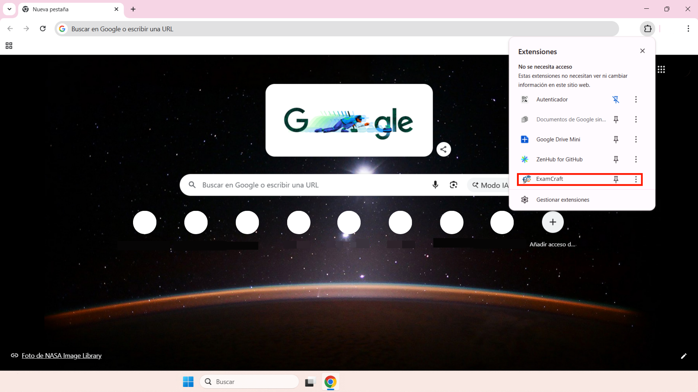

* **HU-02:** Como profesor quiero poder elegir en la página de inicio de ExamCraft entre “Crear examen” o “Consultar exámenes anteriores”, para que no haya confusión y todos los elementos estén bien organizados.
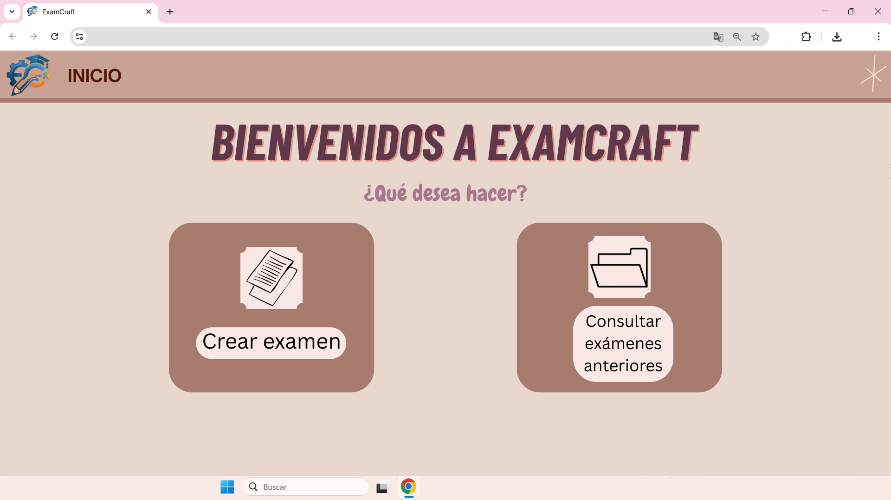

* **HU-03:** Como profesor quiero que al seleccionar la opción “Crear examen” se muestre una pantalla con las distintas modalidades de creación: “Crear examen por partes” o “Crear examen completo”, para poder elegir si deseo crear el examen paso a paso o en una sola vez.
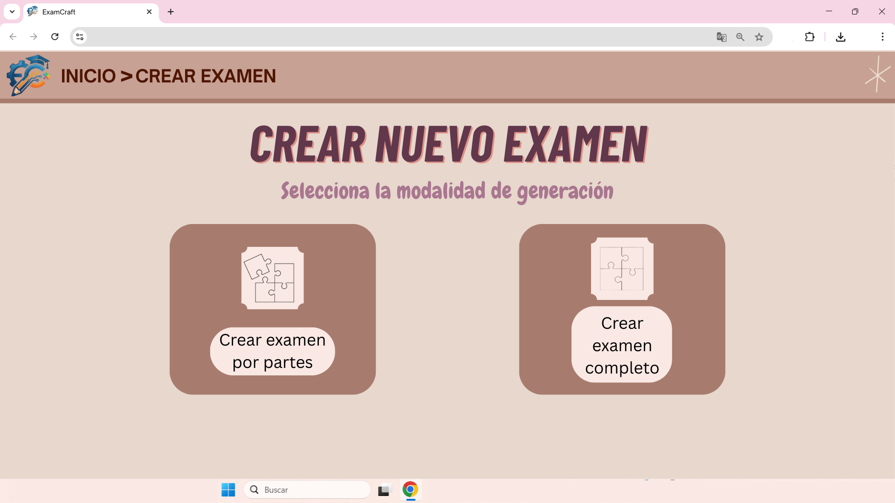

## CREAR EXAMEN POR PARTES

* **HU-04:** Como profesor quiero que al elegir “Crear examen por partes”, se muestre una pantalla que me permita elegir entre las siguientes partes: Enunciado, Restricciones de atributos y Relaciones entre entidades, para así poder empezar por la creación del ejercicio que yo quiera.
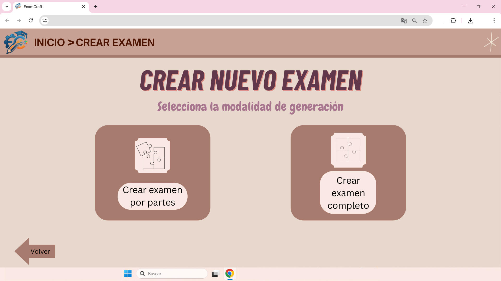

* **HU-05:** Como profesor quiero que al elegir la parte “Enunciado” se me dé a elegir entre los diferentes dominios de examen que existen, es decir, entre examen de Clínica Veterinaria o Ajedrez, para así poder seleccionar qué tipo de enunciado quiero crear.
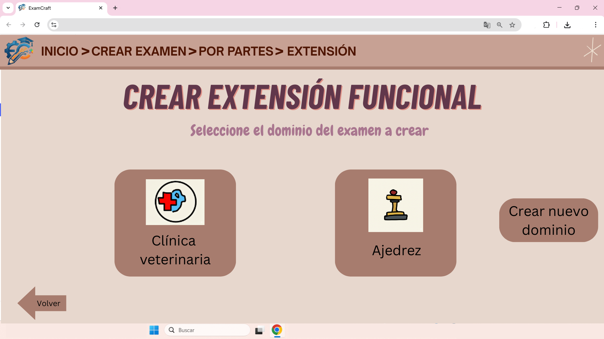

* **HU-06:** Como profesor quiero que, tras haber seleccionado el dominio deseado, la parte “Enunciado” se divida en dos pasos con redirección automática y sin elección a elegir, el primero correspondiente a la generación del texto del enunciado, y el segundo para la generación del diagrama UML del mismo, para así poder proceder ordenadamente.
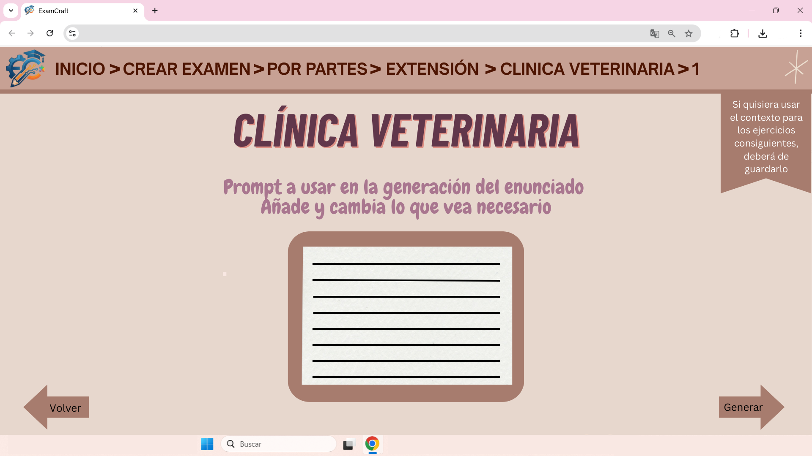
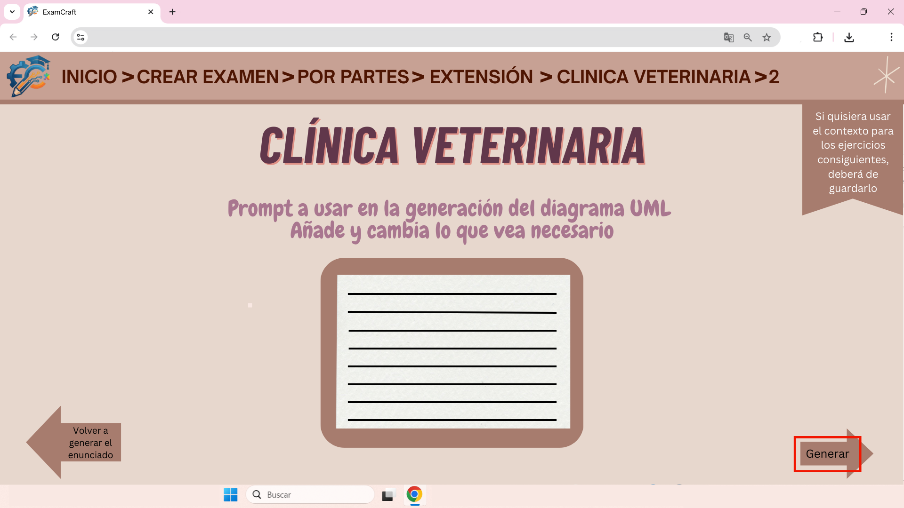

* **HU-07:** Como profesor quiero que en la pantalla en la que se muestran los diferentes dominios de examen a elegir, se muestre además un botón no interactivo “Añadir nuevo dominio de examen”, para así saber que existe un punto de extensión en esa parte concreta de la extensión.
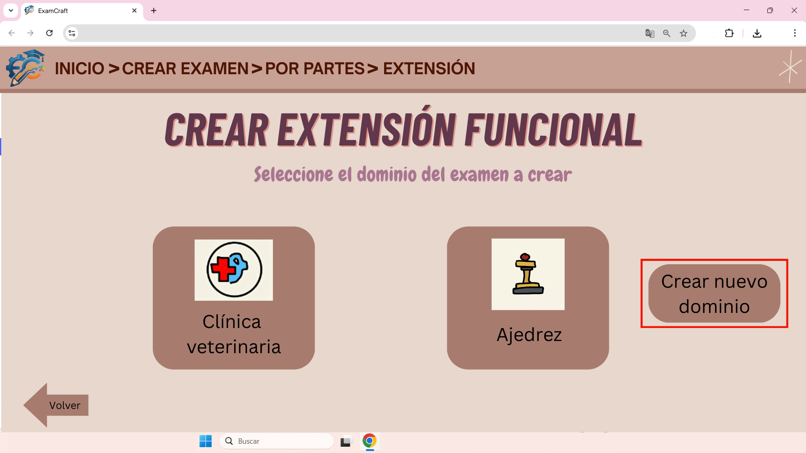

* **HU-08:** Como profesor quiero que al elegir generar la parte “Restricciones de atributos” o la parte “Relaciones entre entidades” se me informe que para la creación de dicha parte seleccionada, es necesario tener en cuenta alguna extensión funcional almacenada anteriormente en el sistema, y que para ello se me den dos opciones, seleccionar alguna extensión o bien cancelar la operación actual, para así poder elegir si quiero que el sistema se base y se mantenga dentro del contexto de otro examen ya creado para la generación de dicha parte nueva o no.
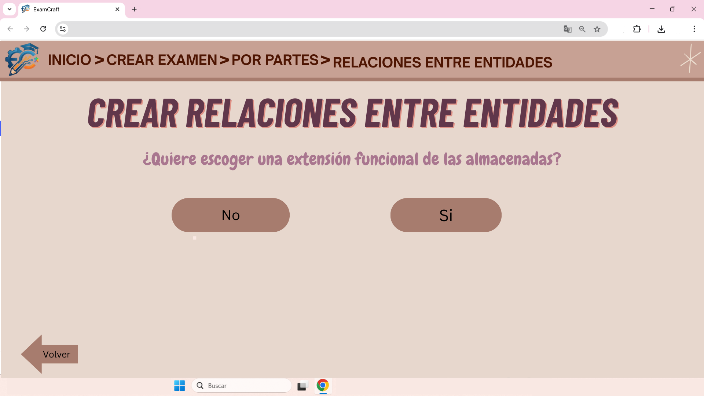

* **HU-09:** Como profesor quiero que en caso de una respuesta positiva en la HU-08, se me muestre un sistema de carpetas con todos los exámenes almacenados hasta el momento en el sistema y una vista previa del contenido de cada uno de ellos, para así poder seleccionar qué examen utilizar como contexto para la generación de la parte seleccionada anteriormente.
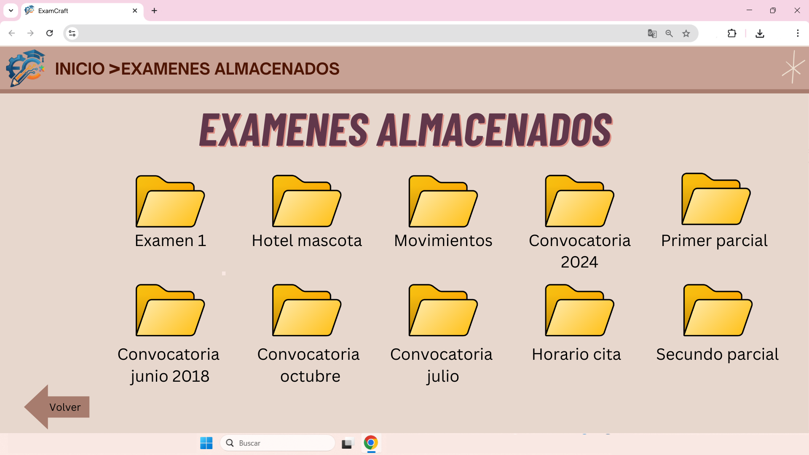

* **HU-10:** CComo profesor quiero que en caso de respuesta negativa en la HU-08, se me vuelva a mostrar la pantalla correspondiente a la selección de la parte a generar, es decir, la de la HU-04, para así garantizar que las partes “Restricciones de atributos” y “Relaciones entre entidades” no puedan ser generadas totalmente desde 0 sin ningún contexto ni enunciado.

## CREAR EXAMEN COMPLETO

* **HU-11:** Como profesor quiero que al elegir “Crear examen completo”, se me dé a elegir entre los diferentes dominios de examen que existen, es decir, entre examen de Clínica Veterinaria o Ajedrez, para así poder seleccionar qué tipo de examen quiero crear.
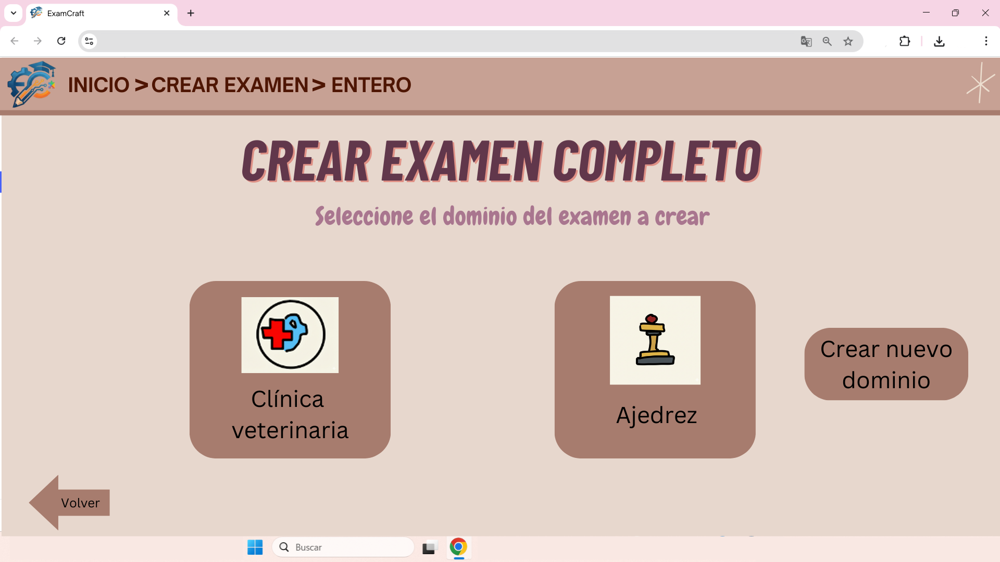

## SOLUCIÓN

* **HU-12:** Como profesor quiero que en el paso de generación del texto del enunciado (dentro de la parte “Enunciado”) se me muestre la solución propuesta de dicho paso en una pantalla de solución intermedia, antes de pasar al paso de la generación del diagrama UML, para así poder decidir si me gusta o no el enunciado devuelto antes de generar su correspondiente diagrama.

* **HU-13:** Como profesor quiero que se me muestre el segundo paso correspondiente a la generación del diagrama UML (de la parte “Enunciado”) solo si he validado la solución del primer paso propuesta por el sistema previamente en la pantalla de solución intermedia, para así definir claramente qué texto de enunciado quiero utilizar.
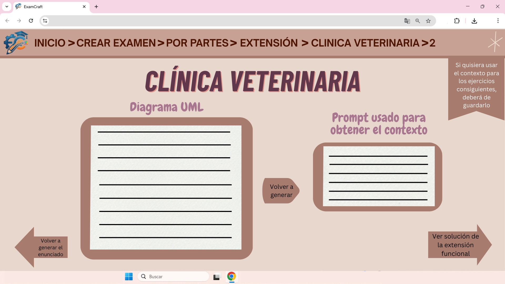

* **HU-14:** Como profesor quiero que el segundo paso correspondiente a la generación del diagrama UML (de la parte “Enunciado”) me lleve directamente a la página de solución final, donde se me muestre de forma unificada la solución de los dos pasos, para así poder ver el resultado final y completo de la parte “Enunciado”.
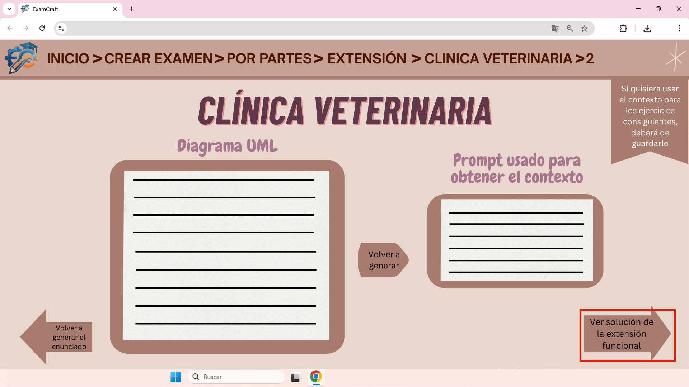
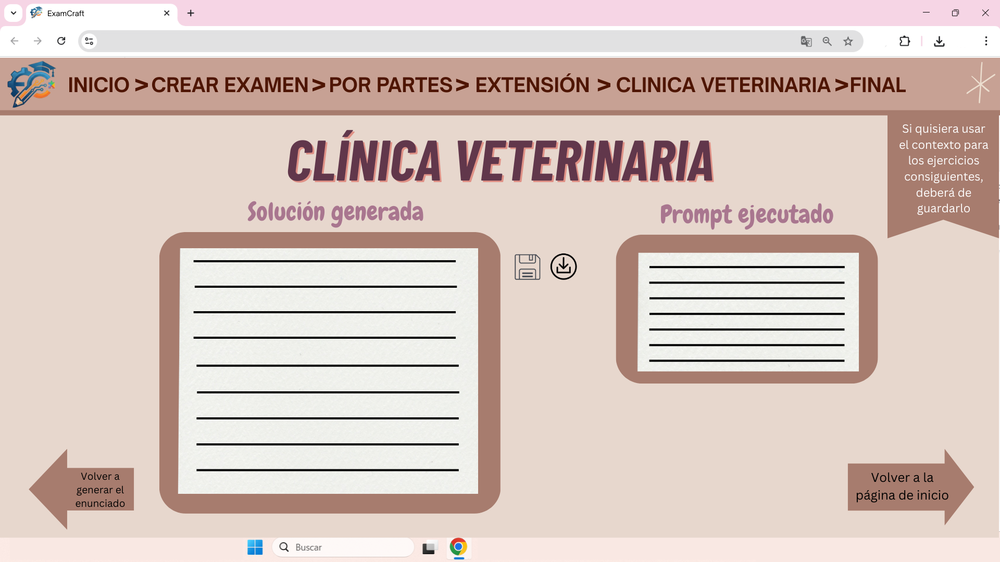

* **HU-15:** Como profesor quiero que como paso previo a cualquier pantalla de solución (intermedia o final), independientemente de lo solicitado, se me muestre el prompt que el sistema lanzará para obtener la solución, para así poder modificarlo a mi gusto para personalizar la consulta antes de pasar a la pantalla de la solución.

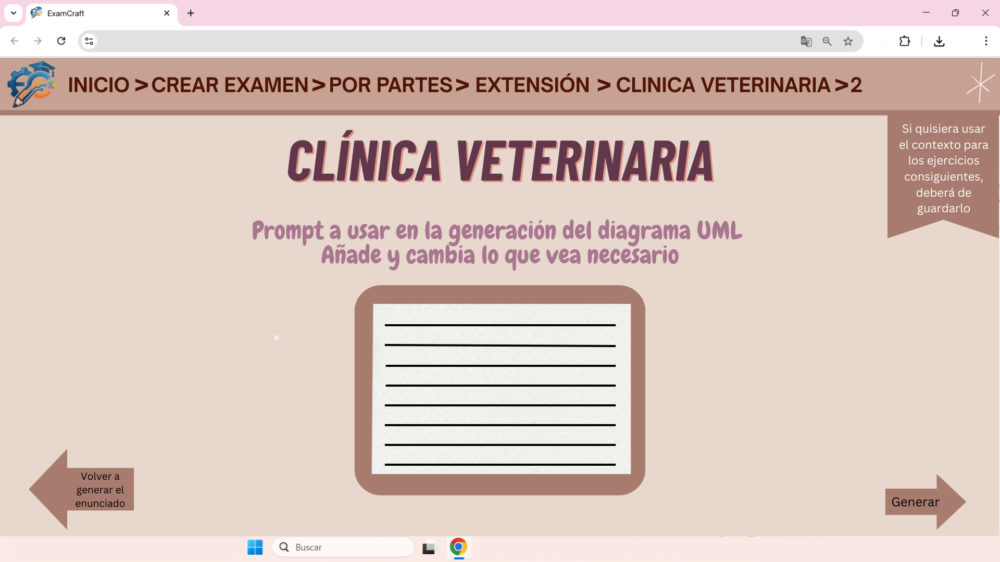

* **HU-16:** Como profesor quiero que tanto en la pantalla de solución final como en la intermedia se me muestre un apartado en formato Word con la solución de la parte o examen solicitado, para así poder leer de forma adecuada la solución proporcionada por el sistema.

* **HU-17:** Como profesor quiero que en la pantalla de solución final, concretamente en el apartado de la solución de la parte o examen solicitado en formato Word, en caso de haber generado un nuevo enunciado, se muestre el código Mermaid del diagrama UML proporcionado, para así poder comprobar el diagrama concreto.

* **HU-18:** Como profesor quiero que tanto en la pantalla de solución final como en la intermedia se me muestre una caja de texto editable donde se encuentre el prompt que se ha lanzado, para así poder eliminarlo, modificarlo o crear otras consultas personalizadas dentro de dicha caja a partir de la solución dada.

* **HU-19:** Como profesor quiero poder volver a hacer una consulta (**HU-18**) a partir de una solución proporcionada por el sistema, usando un botón para volver a generar la solución, para que se muestre otra nueva posible solución una vez pulsado.
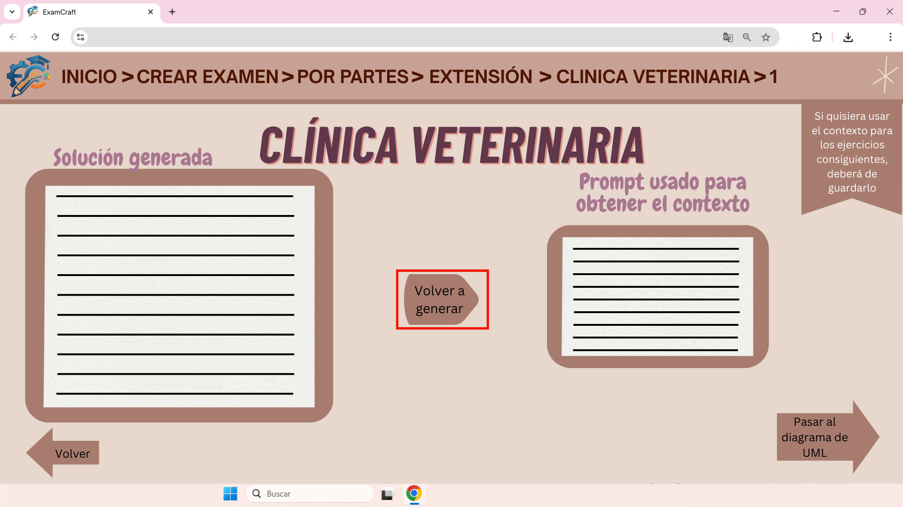
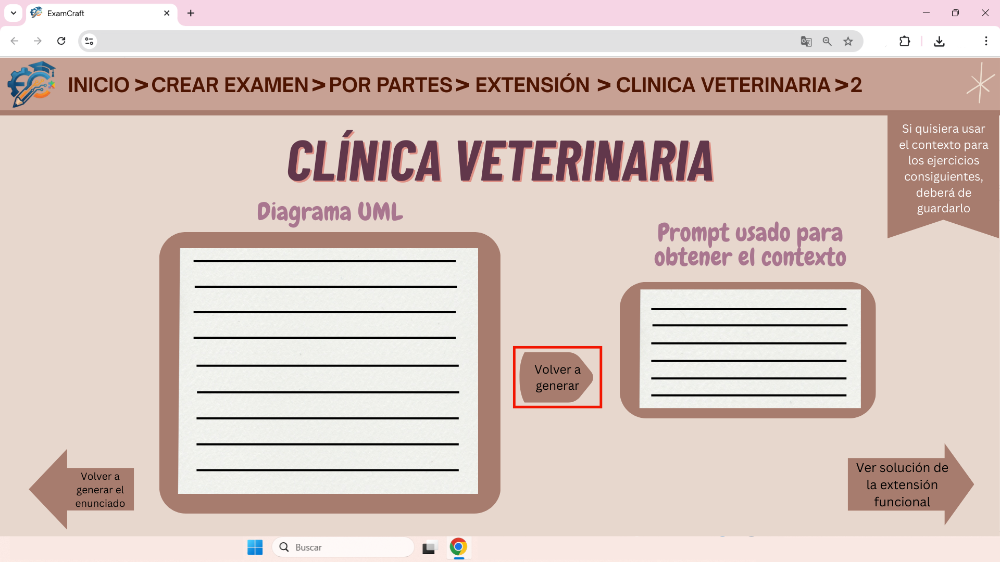

* **HU-20:** Como profesor quiero poder volver a generar una nueva solución a partir de otra dada previamente pulsando un botón, para así poder conocer otras soluciones alternativas.

* **HU-21:** Como profesor quiero poder descargar, desde la pantalla de solución final, la solución proporcionada por el sistema en tres formatos diferentes a elegir, en Word, PDF o MarkDown, para así poder almacenar en mi sistema local, en este caso, en Descargas, dicha solución.
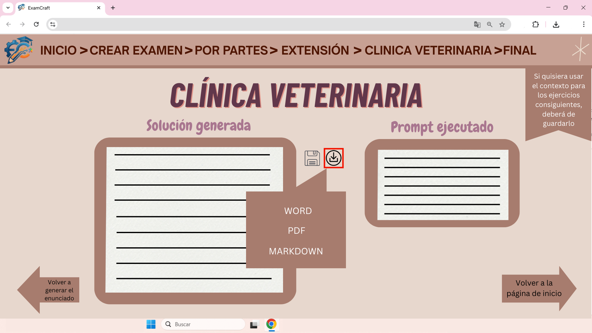

* **HU-22:** Como profesor quiero poder guardar, desde la pantalla de solución final y con el nombre que yo establezca, la solución proporcionada por el sistema en el almacenamiento de la extensión, para que esta aparezca en el apartado de “Consultar exámenes anteriores” y pueda ser usado como contexto para futuras peticiones.
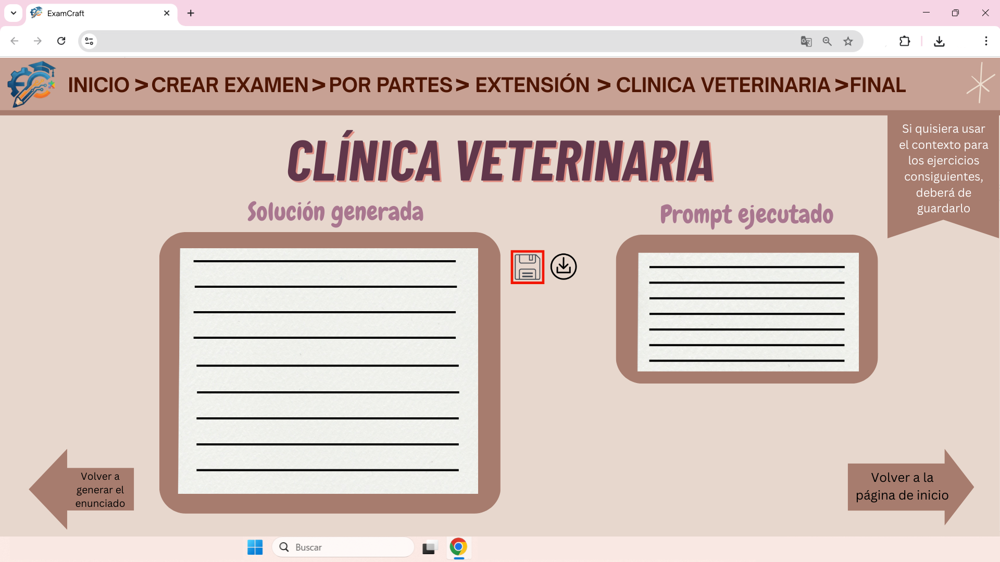

* **HU-23:** Como profesor quiero que la solución proporcionada tenga en cuenta siempre los exámenes anteriormente creados y almacenados en el sistema, para así evitar que no me genere soluciones similares a las ya dadas en otras ocasiones, a menos que yo lo especifique explícitamente (**HU-08**)

## PANTALLA “CONSULTAR EXÁMENES ANTERIORES”

* **HU-24:** Como profesor quiero que al seleccionar la opción para consultar los exámenes anteriores se me muestre un sistema de carpetas con todos los exámenes almacenados hasta el momento en la extensión, para así poder visualizar en detalle todos los exámenes que se han ido generando.

* **HU-25:** Como profesor quiero que en la pantalla “Consultar exámenes anteriores”, cuando pulse una parte de un examen creado, se me muestre en otra pantalla una vista previa de esa parte en formato PDF, para así poder visualizar el contenido de esta adecuadamente.
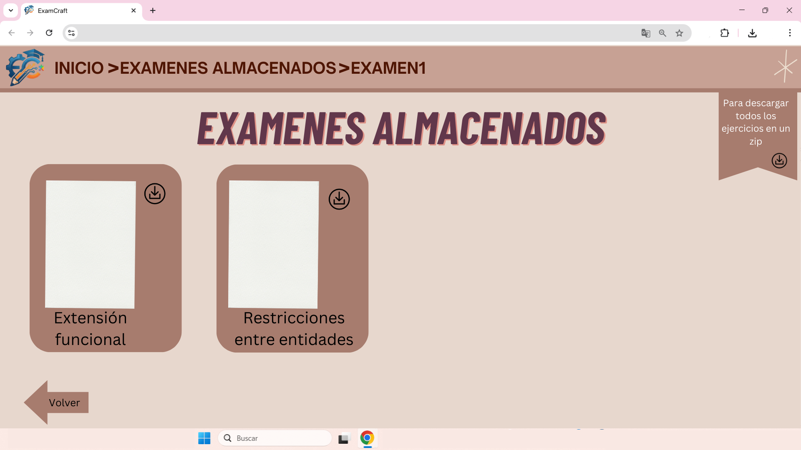

* **HU-26:** Como profesor quiero poder descargar, desde la pantalla de “Consultar exámenes anteriores”, exámenes completos almacenados en la extensión en formato ZIP, para así tener en mi sistema local, en este caso, en Descargas, todas las partes que lo constituyen, tanto en formato Word, MarkDown o PDF.
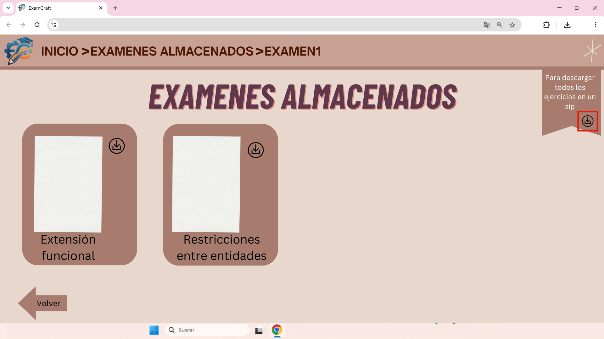

* **HU-27:** Como profesor quiero que, desde la pantalla de vista previa de cualquier parte específica de un examen que yo haya seleccionado previamente, se me permita descargar dicha parte tanto en formato Word, MarkDown o PDF, para así tener en mi sistema local, en este caso, en Descargas, una parte específica de un examen que yo quiera.
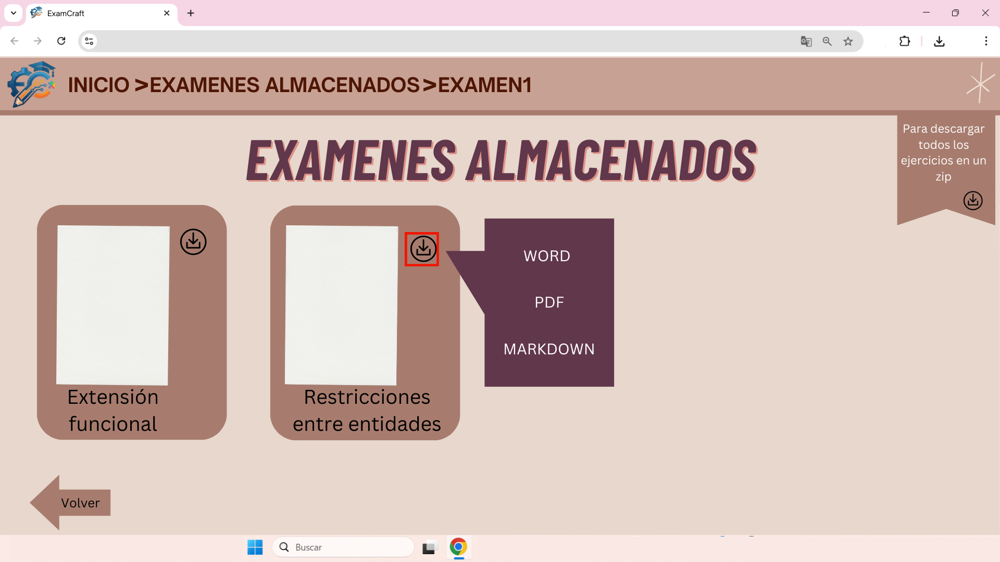

## NAVEGACIÓN

* **HU-28:** Como profesor quiero poder cancelar cualquier acción que requiera también confirmación, para así poder expresar mi deseo de no realizar dicha operación.
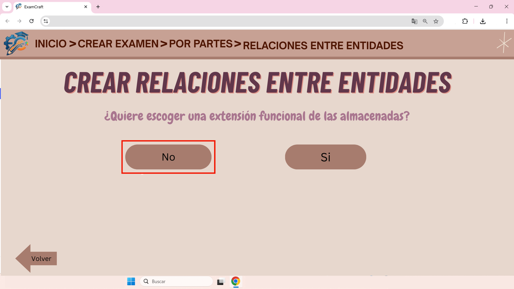

* **HU-29:** Como profesor, quiero disponer de una barra de navegación tipo migas de pan (breadcrumb) que muestre la ruta jerárquica de navegación (por ejemplo: Inicio > Crear examen > Crear examen por partes), para poder identificar mi ubicación actual dentro del sistema.

* **HU-30:** Como profesor, quiero tener un botón “Volver” que me permite retroceder en cualquier pestaña, para así poder navegar entre las diferentes pantallas correctamente.
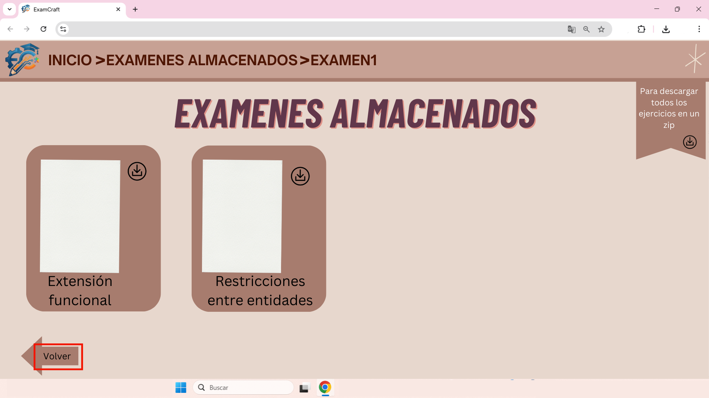